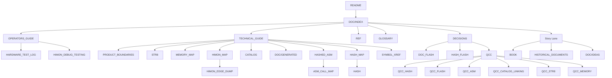

# R-YORS Documentation Map

This map explains how the hand-written docs fit together. Markdown is
canonical; `DOC/HTML` and the root `index.html` redirect are generated,
ignored, untracked presentation and are only rebuilt on explicit request.

## Main Spine

```text
README.md
  -> DOC/INDEX.md
     -> GUIDES/OPERATORS_GUIDE.md
     -> GUIDES/TECHNICAL_GUIDE.md
     -> GUIDES/REF.md
     -> GUIDES/GLOSSARY.md
     -> GUIDES/DECISIONS.md
```

## Product Map

```text
R-YORS
  whole project/system direction
  keeps source, ROMs, maps, decisions, reports, and manuals together

STR8
  reset-time recovery/update guard
  maps flash, rotates backups, restores images, installs $C000 payloads
  owns protected top-sector policy while STR8 is active

IVI / LEAF
  IVI is the interrupt-vector indirection mechanism
  LEAF is the future friendly front door over that mechanism

HIMON
  default monitor payload
  owns ordinary inspection, loading, debug, disassembly, assembler direction,
  and current hash/catalog workbench behavior

THE
  future hash/catalog resolver environment
  not the boot safety layer and not arbitrary command execution

Payload targets
  BASIC, Forth, apps, tools, and user monitors that can stand beside HIMON
```

Short form:

```text
R-YORS boots through STR8.
STR8 keeps recovery/update safe.
STR8 hands normal operation to HIMON or another payload.
HIMON provides the default monitor/debug/catalog workbench.
```

## Reader Paths

```text
Operator
  OPERATORS_GUIDE.md
  REF.md
  LOGS/HARDWARE_TEST_LOG.md
  HIMON/HIMON_DEBUG_TESTING.md

Technical
  TECHNICAL_GUIDE.md
  STR8/PRODUCT_BOUNDARIES.md
  STR8/STR8.md
  MEMORY/MEMORY_MAP.md
  HIMON/HIMON_MAP.md
  CATALOG/CATALOG.md
  DOC/GENERATED/*

Policy
  DECISIONS.md
  DOC_FLASH.md
  HASH_FLASH.md
  QCC/*

Story
  STORY/BOOK.md
  STORY/HISTORICAL_DOCUMENTS.md
  DOC/IDEAS.md
```

The story path is intentionally outside the main operator/technical path.

## Source Map

```text
Current operational source used by generated routine docs:

HIMON/
  SRC/HIMON/himon.asm
  SRC/HIMON/*.inc
  SRC/HIMON/fnv1a-fold.asm

STR8/
  SRC/STR8/str8.asm
  SRC/STR8/str8-worker.asm

Support/
  SRC/LIB/ftdi/*.asm
  SRC/LIB/dev/*.asm
  SRC/LIB/util/*.asm
```

Legacy demos, harnesses, games, ACIA/PIA, and historical monitor experiments
remain documented where useful, but they are outside the generated operational
maps unless promoted.

`LOCAL/` is ignored and may contain private source homes:

```text
LOCAL/basic-programs/
LOCAL/fig-forth/
LOCAL/msbasic/
LOCAL/wdcmonv2/
LOCAL/s3x/
```

## Guide Roles

```text
OPERATORS_GUIDE.md              current board-facing guide
TECHNICAL_GUIDE.md              current architecture guide
REF.md                          compact reference
GLOSSARY.md                     vocabulary only
DECISIONS.md                    settled calls
QCC/                            active design questions
HASH_FLASH.md                   command-surface and milestone alerts
DOC_FLASH.md                    documentation-shape alerts
STR8/PRODUCT_BOUNDARIES.md      product ownership lanes
STR8/STR8.md                    STR8 design contract and direction
STR8/STR8_WORK_PROCESS.md       STR8 proof/work rail
LOGS/HARDWARE_TEST_LOG.md       board transcript validations
HIMON/HIMON_DEBUG_TESTING.md    RAM debug proof process
MEMORY/MEMORY_MAP.md            address ownership
CATALOG/CATALOG.md              callable routine selection view
HIMON/HIMON_MAP.md              readable HIMON capability map
HIMON/HIMON_EDGE_DUMP.md        raw direct-edge evidence
ASM/SYMBOL_XREF.md              symbol/routine cards and tags
HASH/HASH_MAP.md                hash meanings and connections
HASH/HASH.md                    FNV-era details and CRC16 pivot
ASM/HASHED_ASM.md               assembler thesis and fixups
ASM/ASM_CALL_MAP.md             renderable ASM routine-flow map
STORY/BOOK.md                   narrative manuscript spine
STORY/HISTORICAL_DOCUMENTS.md   lineage and evidence map
```

## Mermaid View



## Consistency Rules

- `OPERATORS_GUIDE.md` is the canonical board-facing guide.
- `TECHNICAL_GUIDE.md` is the canonical architecture guide.
- `BOOK.md`, `HISTORICAL_DOCUMENTS.md`, and `DOC/IDEAS.md` are story and
  narrative support, not required main-path docs.
- `DECISIONS.md` is the settled-call list. Check it before reopening design
  alternatives.
- `QCC/` preserves active design thinking without making it
  settled spec.
- Settled QCC answers should move into `DECISIONS.md`.
- Each concept should have one canonical home. Other documents may summarize
  and link, but should not restate the full explanation.
- Generated docs should remain evidence or views, not the primary hand-written
  explanation.
- New guide files should be added to `INDEX.md`, `TOC.md`, `MAP.md`,
  `META/XREF.md`, and `META/BIB.md` together.
