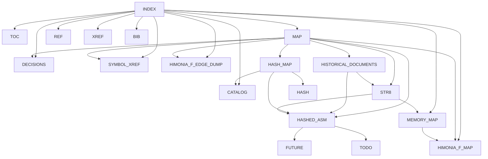

# R-YORS Documentation Map

This is the map for the guide set inside `ror`.

## Guide Spine

```text
DOC/INDEX.md
  -> DOC/GUIDES/INDEX.md
     -> TOC.md
     -> MAP.md
     -> DECISIONS.md
     -> REF.md
     -> XREF.md
     -> CATALOG.md
     -> MEMORY_MAP.md
     -> SYMBOL_XREF.md
     -> HIMONIA_F_MAP.md
     -> HIMONIA_F_EDGE_DUMP.md
     -> BIB.md
```

## Design Map

```text
R-YORS
  boots through STR8

Decisions
  records settled calls before details sprawl into guide debate
  prevents reopening hash, naming, STR8, ABI, ASM, and doc-shape decisions

STR8
  keeps recovery/update safe
  hands normal operation to HIMON

HIMON
  provides the monitor, command dispatch, assembler, catalog lookup,
  and debug tools

Himonia-F
  current implementation path toward HIMON
  owns normal monitor interaction
  hashes command tokens
  dispatches to command records

STR8
  owns recovery/update guardrails
  prefers the protected $F800-$FFFF anchor
  documents the proposed boot/recovery/update overview map
  scans writable flash
  protects anchors/vectors/ABI slots
  verifies and commits flash changes
  later condenses cluttered banks

Hashed ASM
  reads `A [addr] [label:] MMM [operand] .`
  hashes labels and mnemonics
  emits bytes
  creates fixups for forward labels
  documents process trees, fixup lifecycle, writer split, and linking maps
  exports symbols after verification

Catalog
  maps hash/name to kind, bank, address, and flags
  may store compressed command/routine text
  becomes the bridge between assembler output and runtime lookup

Symbol Ref/Xref/XXref
  records routine contracts, source locations, FNV hashes, and ABI details
  classifies current and future symbols with reusable semantic tokens
  gives Himonia-F a compact call tree separate from full generated edge dumps

Catalog
  groups callable routines by programmer need: read, write, string, hex, hash,
  flash, vector, and recovery BIO
  keeps names, hashes, entry/exit registers, carry flags, notes, and tags
  compact enough to answer "what routine do I call?"

Memory Map
  records current Himonia-F ROM and RAM address ownership
  identifies user flash, monitor code/data, ABI entries, vectors, and gaps
  distinguishes the current Himonia-F image from the future STR8/HIMON split

Himonia-F Map
  turns the raw direct edges into readable subsystem diagrams
  maps startup, dispatch, commands, loader/flash, debug, disasm, ASM, and ABI
  gives Himonia-F a full capability map

Himonia-F Edge Dump
  lists direct `JSR` and `JMP` sites from the current Himonia-F source
  preserves raw line-number edges separately from compact call-tree diagrams
```

Short form:

```text
R-YORS boots through STR8.
STR8 keeps recovery/update safe.
STR8 hands normal operation to HIMON.
HIMON provides the monitor, command dispatch, assembler, catalog lookup,
and debug tools.
```

## Source Map

```text
SRC/TEST/apps/himon/
  himon.asm
  himon-parent.asm
  himonia.asm
  fnv1a-hbstr.asm

SRC/TEST/apps/
  rom-append-calc.asm
  life.asm
  microchess.asm

LOCAL/
  basic-programs/*.BAS
  fig-forth/source/ff6502.html
  fig-forth/generated/fig-forth.asm
  msbasic/source/
  msbasic/generated/osi-basic.asm
  wdcmonv2/
  s3x/

SRC/TEST/
  test-flash.asm
  ftdi/
  dev/
  util/
  pia/
  acia/

SRC/STASH/
  promoted/stable lane

SRC/SESH/
  session/WIP lane
```

## Mermaid View



## Consistency Rules

- `STR8` is the recovery/update name.
- `DECISIONS.md` is the settled-call list. Check it before reopening design
  alternatives.
- The older recovery-guide name is retired; use `STR8`.
- `HASH.md` covers routine header IDs and their relationship to FNV-1a.
- `HASH_MAP.md` covers all hash meanings and where they connect.
- `SYMBOL_XREF.md` covers symbol-level contracts and semantic tags.
- `CATALOG.md` covers the programmer-facing callable routine catalog.
- `HIMONIA_F_MAP.md` is the readable Himonia-F edge/capability map.
- `HIMONIA_F_EDGE_DUMP.md` is the direct Himonia-F edge dump.
- New guide files should be added to `INDEX.md`, `TOC.md`, `MAP.md`, `XREF.md`,
  and `BIB.md` together.
