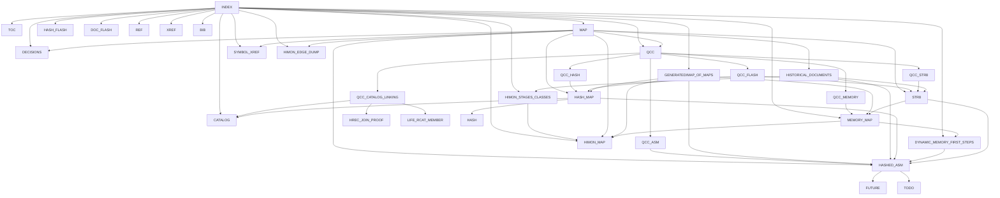

# R-YORS Documentation Map

This is the map for the guide set inside `ror`.

## Guide Spine

```text
DOC/INDEX.md
  -> DOC/GENERATED/MAP_OF_MAPS.md
  -> DOC/GUIDES/INDEX.md
     -> TOC.md
     -> MAP.md
     -> PRODUCT_BOUNDARIES.md
     -> BOOK.md
     -> HASH_FLASH.md
     -> DOC_FLASH.md
     -> DECISIONS.md
     -> QCC.md
     -> BRINGUP.md
     -> HIMON_STAGES_CLASSES.md
     -> REF.md
     -> XREF.md
     -> HARDWARE_TEST_LOG.md
     -> CATALOG.md
     -> LIFE_RCAT_MEMBER.md
     -> MEMORY_MAP.md
     -> DYNAMIC_MEMORY_FIRST_STEPS.md
     -> SYMBOL_XREF.md
     -> HIMON_MAP.md
     -> HIMON_EDGE_DUMP.md
     -> BIB.md
```

## Design Map

```text
R-YORS
  boots through STR8

Product Boundaries
  names the current product lanes inside one repo
  treats R-YORS as the project/system direction
  treats STR8 as board management
  treats LEAF/IVI as the interrupt-vector front door
  treats HIMON as the default monitor payload
  treats BETTERMON/WDCMONv2/apps/tools as peer payload targets

BOOK
  gives the project a manuscript spine
  turns the guide set into chapter questions, answers, and proof pointers
  preserves the narrative of building a hashed runtime from the bench up

Decisions
  records settled calls before details sprawl into guide debate
  prevents reopening hash, naming, STR8, ASM, and doc-shape decisions

QCC
  records Questions, Comments, and Concerns before they become decisions
  keeps what-if design notes visible without making them settled spec
  splits active topics into hash, flash, ASM, catalog-linking, STR8, and
  memory QCC pages

DOC FLASH
  alerts when doc shape, edicts, canonical homes, or remembered artifact names
  change enough that a reader's mental map is stale

STR8
  is the board management product
  keeps recovery/update safe
  installs and boots selected targets
  uses HIMON as the default bundled payload, not the only possible payload

LEAF / IVI
  gives STR8 a stable interrupt front door when installed
  keeps hardware vectors recoverable
  lets payloads patch latched NMI/IRQ/BRK entry addresses
  does not dictate payload interrupt meanings after handoff

HIMON
  is the default monitor payload and workbench
  provides command dispatch, loader/debug tools, assembler direction,
  catalog lookup, and hash experiments

HIMON
  current monitor implementation path
  owns normal monitor interaction
  hashes command tokens
  dispatches to command records

HIMON Stages And Classes
  reconstructs the historical Himon/Himonia/Himonia-F stages from source and guides
  explains routine-class families such as CMD, CMD_HASH, MON, HIM, ASM, DIS,
  DBG, L, FNV1A, MATH, ABI, and future MEM

STR8
  owns recovery/update guardrails
  V0 manages image-oriented 32K ROM bank recovery
  future STR8 lives in the bank 3 $F000-$FFFF top erase sector
  protects only the selected $FC00/$FA00/$F800/$F600/$F400/$F200/$F000 window
  documents the proposed boot/recovery/update overview map
  future direction scans writable flash and catalog regions
  future direction protects selected STR8 window and vectors
  V0 verifies copied bank images
  later HIMON/maintenance or future STR8 condenses cluttered banks

Bringup
  orders STR8 work from simulation stub to reset-owned recovery
  keeps erase/write work behind read-only proofs
  records bank policy, protected-window policy, and failure cases

Hardware Test Log
  records real board transcript evidence after bringup/test passes
  keeps validation excerpts for STR8, HIMON, HREC, search, debug, and catalog
  lookup separate from design intent and how-to checklists

Hashed ASM
  reads `A [addr] [label:] MMM [operand] .`
  hashes labels and mnemonics
  emits bytes
  creates fixups for forward labels
  documents process trees, fixup lifecycle, writer split, and linking maps
  exports symbols after verification

Catalog
  maps hash/name to kind, bank, address, and flags
  may store compressed command/routine text
  becomes the bridge between assembler output and runtime lookup

Life RCAT Member
  uses standalone LIFE as a worked example for an RCAT-visible member
  separates RBODY bytes, RREC export records, imports, entry contracts,
  zero-page needs, RAM needs, and NMI vector behavior
  keeps LIFE out of generated HIMON call trees while still using it to test
  catalog vocabulary

QCC Flash
  records the proposed FSB lifecycle for formed, sealed, and buried records
  discusses condense/compress triggers, purge classes, and flash-safe ownership

QCC Hash
  records 1/2/4 byte hash-width questions, folded FNV-1a helpers, and compact
  signature concerns

QCC ASM
  records hash-first assembler questions about labels, fixups, symbol text, and
  sealed output

QCC STR8
  records STR8 ownership questions around scanning, recovery/update boundaries,
  and future STRAIGHTEN behavior

QCC Memory
  records RAM/IO/flash range questions, 4K sector selectors, allocation scope,
  and TBE bit-helper direction

Symbol Ref/Xref/XXref
  records routine contracts, source locations, FNV hashes, and ABI details
  classifies current and future symbols with reusable semantic tokens
  gives HIMON a compact call tree separate from full generated edge dumps

Catalog
  groups callable routines by programmer need: read, write, string, hex, hash,
  flash, vector, and recovery BIO
  keeps names, hashes, entry/exit registers, carry flags, notes, and tags
  compact enough to answer "what routine do I call?"

Memory Map
  records current HIMON ROM and RAM address ownership
  identifies user flash, monitor code/data, ABI entries, vectors, and gaps
  distinguishes the current HIMON image from the future STR8/HIMON split

Dynamic Memory First Steps
  explains byte, word, and pointer allocation as byte reservations
  keeps STR8 out of general heap ownership and HIMON out for now
  uses the current memory map and zero-page rules to scope any future heap

HIMON Map
  turns the raw direct edges into readable subsystem diagrams
  maps startup, dispatch, commands, loader/flash, debug, disasm, ASM, and ABI
  gives HIMON a full capability map

HIMON Edge Dump
  lists direct `JSR` and `JMP` sites from the current HIMON source
  preserves raw line-number edges separately from compact call-tree diagrams

Generated Interrupt Vector Map
  maps current RESET, NMI, IRQ, and BRK trampoline paths
  shows RAM vector patch cells, monitor trap install, BRK split, and RTI resume

Generated Map Of Maps
  acts as the atlas for guide maps and source-derived maps
  answers which map to open for command flow, hash flow, HIMON calls, support
  layers, memory ranges, and document navigation
```

Short form:

```text
R-YORS is the project/system direction.
STR8 is the board management product.
LEAF/IVI is the interrupt front door.
HIMON is the default monitor payload.
Other payloads can stand beside HIMON.
```

## Source Map

```text
Current operational source used by generated routine docs:

HIMON/
  himon.asm
  himon-shared-eq.inc
  himon-asm.inc
  himon-bootlog.inc
  himon-debug.inc
  himon-disasm.inc
  fnv1a-fold.asm

STR8/
  str8.asm

SRC/STASH/ftdi/
SRC/SESH/ftdi/
ROM/ftdi-backend-debug.asm
ROM/ftdi/
ROM/dev/
ROM/util/

Legacy demos, harnesses, games, ACIA/PIA, and historical monitor experiments
are outside the generated operational maps.

LOCAL/
  basic-programs/*.BAS
  fig-forth/source/ff6502.html
  fig-forth/generated/fig-forth.asm
  msbasic/source/
  msbasic/generated/osi-basic.asm
  wdcmonv2/
  s3x/
```

## Mermaid View



## Consistency Rules

- `STR8` is the recovery/update name.
- `STR8` means Subroutine To Return, pronounced `S-T-R-8`, with an intentional
  `RTS` echo.
- `DECISIONS.md` is the settled-call list. Check it before reopening design
  alternatives.
- `QCC.md` and `QCC_*.md` are Questions, Comments, Concerns working notes.
  They preserve active design thinking without making it settled spec.
- Settled QCC answers should move into `DECISIONS.md`.
- The older recovery-guide name is retired; use `STR8`.
- `HASH.md` covers routine header IDs and their relationship to FNV-1a.
- `HASH_MAP.md` covers all hash meanings and where they connect.
- `SYMBOL_XREF.md` covers symbol-level contracts and semantic tags.
- `CATALOG.md` covers the programmer-facing callable routine catalog.
- `HIMON_MAP.md` is the readable HIMON edge/capability map.
- `HIMON_EDGE_DUMP.md` is the direct HIMON edge dump.
- `DYNAMIC_MEMORY_FIRST_STEPS.md` is conceptual only until a real allocator is
  explicitly reserved in the memory map and routine contracts.
- New guide files should be added to `INDEX.md`, `TOC.md`, `MAP.md`, `XREF.md`,
  and `BIB.md` together.
