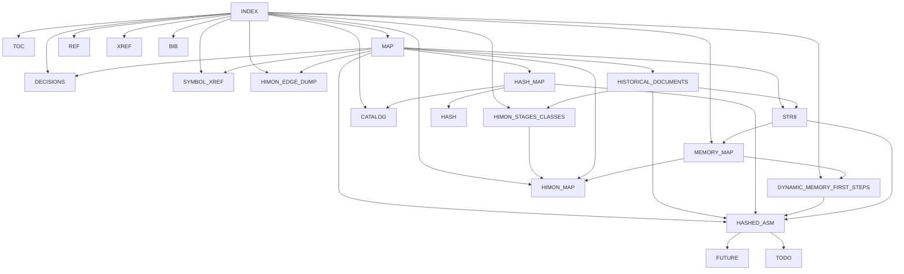

# R-YORS Documentation Map

This is the map for the guide set inside `ror`.

## Guide Spine

```text
DOC/INDEX.md
  -> DOC/GUIDES/INDEX.md
     -> TOC.md
     -> MAP.md
     -> DECISIONS.md
     -> HIMON_STAGES_CLASSES.md
     -> REF.md
     -> XREF.md
     -> CATALOG.md
     -> MEMORY_MAP.md
     -> DYNAMIC_MEMORY_FIRST_STEPS.md
     -> SYMBOL_XREF.md
     -> HIMON_MAP.md
     -> HIMON_EDGE_DUMP.md
     -> BIB.md
```

## Design Map

```text
R-YORS
  boots through STR8

Decisions
  records settled calls before details sprawl into guide debate
  prevents reopening hash, naming, STR8, ABI, ASM, and doc-shape decisions

STR8
  keeps recovery/update safe
  hands normal operation to HIMON

HIMON
  provides the monitor, command dispatch, assembler, catalog lookup,
  and debug tools

Himonia-F
  current implementation path toward HIMON
  owns normal monitor interaction
  hashes command tokens
  dispatches to command records

HIMON Stages And Classes
  reconstructs Himon/Himonia/Himonia-F stages from source and guides
  explains routine-class families such as CMD, CMD_HASH, MON, HIM, ASM, DIS,
  DBG, L, FNV1A, MATH, ABI, and future MEM

STR8
  owns recovery/update guardrails
  V0 manages image-oriented 32K ROM bank recovery
  future STR8 lives in the bank 3 $F000-$FFFF top erase sector
  protects only the selected $FC00/$FA00/$F800/$F600/$F400/$F200/$F000 window
  documents the proposed boot/recovery/update overview map
  future direction scans writable flash and catalog regions
  future direction protects anchors/vectors/ABI slots
  V0 verifies copied bank images
  later HIMON/maintenance or future STR8 condenses cluttered banks

Hashed ASM
  reads `A [addr] [label:] MMM [operand] .`
  hashes labels and mnemonics
  emits bytes
  creates fixups for forward labels
  documents process trees, fixup lifecycle, writer split, and linking maps
  exports symbols after verification

Catalog
  maps hash/name to kind, bank, address, and flags
  may store compressed command/routine text
  becomes the bridge between assembler output and runtime lookup

Symbol Ref/Xref/XXref
  records routine contracts, source locations, FNV hashes, and ABI details
  classifies current and future symbols with reusable semantic tokens
  gives Himonia-F a compact call tree separate from full generated edge dumps

Catalog
  groups callable routines by programmer need: read, write, string, hex, hash,
  flash, vector, and recovery BIO
  keeps names, hashes, entry/exit registers, carry flags, notes, and tags
  compact enough to answer "what routine do I call?"

Memory Map
  records current Himonia-F ROM and RAM address ownership
  identifies user flash, monitor code/data, ABI entries, vectors, and gaps
  distinguishes the current Himonia-F image from the future STR8/HIMON split

Dynamic Memory First Steps
  explains byte, word, and pointer allocation as byte reservations
  keeps STR8 out of general heap ownership and HIMON out for now
  uses the current memory map and zero-page rules to scope any future heap

HIMON Map
  turns the raw direct edges into readable subsystem diagrams
  maps startup, dispatch, commands, loader/flash, debug, disasm, ASM, and ABI
  gives HIMON a full capability map

HIMON Edge Dump
  lists direct `JSR` and `JMP` sites from the current HIMON source
  preserves raw line-number edges separately from compact call-tree diagrams
```

Short form:

```text
R-YORS boots through STR8.
STR8 keeps recovery/update safe.
STR8 hands normal operation to HIMON.
HIMON provides the monitor, command dispatch, assembler, catalog lookup,
and debug tools.
```

## Source Map

```text
SRC/TEST/apps/himon/
  himon.asm
  himon-parent.asm
  mon.asm
  mon-cmd-*.inc
  himonia.asm
  himonia-f.asm
  fnv1a-hbstr.asm

SRC/TEST/apps/
  rom-append-calc.asm
  life.asm
  microchess.asm

LOCAL/
  basic-programs/*.BAS
  fig-forth/source/ff6502.html
  fig-forth/generated/fig-forth.asm
  msbasic/source/
  msbasic/generated/osi-basic.asm
  wdcmonv2/
  s3x/

SRC/TEST/
  test-flash.asm
  ftdi/
  dev/
  util/
  pia/
  acia/

SRC/STASH/
  promoted/stable lane

SRC/SESH/
  session/WIP lane
```

## Mermaid View



## Consistency Rules

- `STR8` is the recovery/update name.
- `STR8` means Subroutine To Return, pronounced `S-T-R-8`, with an intentional
  `RTS` echo.
- `DECISIONS.md` is the settled-call list. Check it before reopening design
  alternatives.
- The older recovery-guide name is retired; use `STR8`.
- `HASH.md` covers routine header IDs and their relationship to FNV-1a.
- `HASH_MAP.md` covers all hash meanings and where they connect.
- `SYMBOL_XREF.md` covers symbol-level contracts and semantic tags.
- `CATALOG.md` covers the programmer-facing callable routine catalog.
- `HIMON_MAP.md` is the readable HIMON edge/capability map.
- `HIMON_EDGE_DUMP.md` is the direct HIMON edge dump.
- `DYNAMIC_MEMORY_FIRST_STEPS.md` is conceptual only until a real allocator is
  explicitly reserved in the memory map and routine contracts.
- New guide files should be added to `INDEX.md`, `TOC.md`, `MAP.md`, `XREF.md`,
  and `BIB.md` together.
