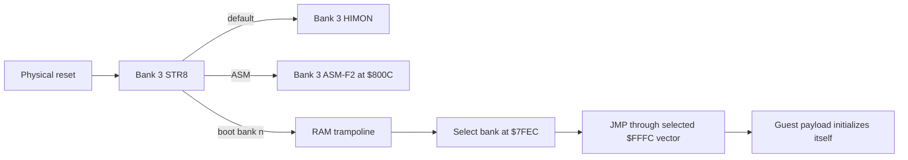

# STR8 Multiboot, S19, And Bank-Volume Direction

This is the canonical architecture record for booting alternate flash banks,
consolidating S19 handling, and introducing managed bank storage. It records an
accepted direction, not current command behavior or a completed on-board
format.

```text
status:     accepted direction; implementation and hardware proof pending
provenance: ORIG-WLP2, COLLAB-AI
evidence:   DERIVED-SRC for addresses and current code ownership
```

The current board image and hardware transcripts remain the source of truth.
In particular, the present bare STR8 `0`, `1`, and `2` commands restore Bank 3;
they do not boot the selected bank.

## Decision

Bank 3 remains the physical-reset recovery root. A bootable bank reserves its
top 4K sector for STR8 or a future ABI-compatible STR8 build and owns the 28K
payload below it:

```text
$8000-$EFFF  selected-bank payload: OS, BIOS, monitor, code, or data
$F000-$FFFF  selected-bank STR8 recovery/service sector and vectors
```

The default Bank 3 payload remains the R-YORS workbench:

```text
$800C        ASM-F2 entry
$C000        HIMON entry
$F000        STR8 reset/recovery entry
```

Banks 0-2 may later be independent boot images, append-only volumes, or a
declared mixture. Reserving the top sector is the preferred R-YORS boot
contract. A completely independent 32K image is possible only when it provides
its own safe reset vectors and accepts that Bank-3 STR8 services are not mapped
while that bank is selected.

## What This Changes

This broadens STR8 from "restore Bank 3 from a stored full-bank copy" toward a
small board supervisor that can hand control to a selected compatible bank. It
does not change the immediate AP/OIL proof order, remove the recovery role, or
turn S19 into a filesystem.

The near-term gates remain:

1. Prove missing-import failure is atomic after moving the AP linker into
   HIMON: no body entry and no partial import patch.
2. Prove a banked AP source resolves through the current HIMON-resident RJOIN
   path.
3. Append both transcripts to the hardware test log and commit the evidence.
4. Only then prototype multiboot handoff from RAM.

The AP linker stays in HIMON for these proofs. AP relocation and RJOIN should
share narrow primitives where byte counts justify it--record validation, FNV
record scan, resolved-address return, and patch-range checks--but should not be
forced into one large policy routine. Placement can be revisited after the two
current-image proofs provide a stable baseline.

## Hardware Grounding

The board exposes one selected flash bank at `$8000-$FFFF`. The bank latch is
outside that window at `$7FEC`, and pull-ups select Bank 3 on physical reset.
The flash erase sector is 4K. Flash erase/program code already runs from the
RAM worker tray at `$0200-$09FF`.

These facts produce three invariants:

- Code must not select another bank while executing from the flash window.
- Bank handoff, flash mutation, and cross-bank copying must run from RAM.
- Every compatible boot bank needs valid `$FFFA-$FFFF` vectors before it is
  offered as bootable.

Physical reset is the final escape hatch: it returns Bank 3 even if a selected
guest payload crashes, provided the hardware and Bank-3 top sector are intact.

## Boot Handoff

A non-destructive STR8 boot command copies a small trampoline to RAM. The
trampoline establishes a documented CPU state, selects the bank, and enters
that bank through its reset vector:



The first handoff contract should be deliberately small:

```text
interrupts disabled
decimal mode cleared
stack and RAM-vector ownership explicitly documented
selected bank stable before vector fetch
guest reset code owns subsequent RAM/peripheral initialization
```

The exact register values and whether the trampoline resets the stack pointer
are implementation decisions to freeze before the first board proof. The guest
must not call Bank-3-only HIMON/RJOIN addresses after selection. It needs its
own BIOS, replicated stable STR8 service entries, or a separately designed RAM
BIOS.

## Proposed Command Surface

Do not overload the current destructive restore commands during the migration.
Keep bare `0`, `1`, and `2` as the current restore path until it is deliberately
retired. Add a non-destructive launch family under `G`:

```text
G or G H     enter Bank 3 HIMON
G A          enter Bank 3 ASM-F2 at $800C
G 0          boot Bank 0 through its reset vector
G 1          boot Bank 1 through its reset vector
G 2          boot Bank 2 through its reset vector
```

Those spellings are proposed, not implemented. New destructive operations must
keep the existing four-or-more-character rule, for example `RESTORE`,
`FORMAT`, `ERASE`, or `BACKUP` with explicit confirmation.

## S19 Ownership

STR8 and HIMON currently duplicate S19 work. STR8 has the narrow `U` loader for
`$C000-$EFFF`; HIMON has `L`, `L G`, and `L F`. The target split is mechanism
from policy:

```text
STR8 S19 mechanism
  serial record acquisition
  hex-byte and count decoding
  checksum validation
  S0/S1/S9 descriptor output

HIMON L policy
  select legal RAM destination
  write accepted S1 data to RAM
  use S9 as the optional L G entry point

STR8 flash policy
  select bank and legal flash range
  stage a complete erase sector or payload image
  erase, program, verify, and report transaction status
```

A source include alone improves maintenance but does not reclaim ROM bytes.
The size-saving form is a stable callable STR8 S19 service with HIMON retaining
only its user-interface and RAM-write policy. HIMON `L F` should eventually
delegate flash mutation to STR8 or be retired after an equivalent STR8 command
is proven.

### Measured Starting Point

The current linked maps show that this is practical without first enlarging the
top sector:

```text
STR8 reusable S19 mechanism   about 268 bytes already resident
  $F43F-$F4D6  record start/skip/S1 decode before staging policy
  $F516-$F589  count, sum, checksum, and hex-byte helpers

HIMON S19 parser/checksum     about 465 bytes before UI/write policy
  $D231-$D365  record dispatch plus S0/S1 parsing
  $DE0D-$DEA8  S9, sum, checksum, strict hex, and failure handling

current STR8 growth hole      1,145 bytes at $F8AD-$FD25
current HIMON headroom          211 bytes at $EF2D-$EFFF
```

Not all 465 HIMON bytes disappear: HIMON still needs command UI, RAM range
policy, result reporting, and a small client adapter. The important point is
that STR8 already contains most of the mechanism, so adding a stable service
should increase HIMON headroom and leave enough STR8 room for small additional
formats.

### Validated-Record Service

The common service should parse and validate one complete input record into a
RAM buffer before returning it. It must not write the destination as bytes
arrive. On success it returns a small descriptor:

```text
format        S19, Intel HEX16, or counted BIN
record kind   data, end, entry, or ignored metadata
address       16-bit destination for a data record
length        validated payload-byte count
entry         optional 16-bit execution address
data pointer  address of the validated record buffer
```

The caller then applies policy. HIMON copies accepted data to a legal RAM
destination. STR8 copies accepted data into a staging image and performs any
later erase/program/verify transaction. Buffer-before-sink prevents a bad
record checksum from causing a partial RAM or flash mutation and lets all
formats share the same policy clients.

Use one stable STR8 service entry or operation multiplexer rather than exposing
internal parser labels. The service needs a byte-source contract and a request/
result block; format-specific code should share hex-byte decoding, address and
length fields, record buffering, and status codes.

### Frozen V1 STR8 Record-Service ABI

This subsection is the accepted V1 contract for the first shared S19
implementation. It freezes the callable boundary before code moves. The entry,
header, RAM cells, operation values, result values, and compatibility rules are
not current behavior until the implementation and hardware gates pass.

#### Fixed Top-Sector Header

The existing fixed entries remain compatible and the record service extends
the jump table without moving them:

```text
$F000-$F002  JMP STR8_BOOT_START
$F003-$F005  JMP STR8_RUN_WORKER_SERVICE_BODY
$F006-$F008  JMP STR8_AP_IMPORT_LINK_SERVICE_BODY
$F009-$F00B  JMP STR8_RECORD_SERVICE_BODY
$F00C        $53  'S'  record-service signature byte 0
$F00D        $52  'R'  record-service signature byte 1
$F00E        $01       record-service ABI version
$F00F        $07       V1 capability bits
$F010        first unconstrained STR8 boot-body address
```

`SR` means STR8 Record service. Capability bits are:

```text
$01  parse S19 from a caller-supplied RAM buffer
$02  acquire and parse S19 from the private STR8 console
$04  apply a validated S1 record through the conservative L F flash policy
```

Unknown capability bits are ignored. A V1 HIMON image requires signature
`53 52`, version `$01`, and every capability needed by the requested command.
The first production HIMON/STR8 pair requires all three bits. Missing or
mismatched capability fails before HIMON prints the loader-ready banner; HIMON
reports `LERR=$06`, returns A=`$06` with carry clear, and receives no S19 data.

#### Request/Result Block And Record Buffer

The V1 block occupies 20 bytes of the loader workspace that the shared service
replaces:

```text
address  name                 direction  meaning
$7E95    STR8_REC_OP          request    operation number
$7E96    STR8_REC_FORMAT      request/apply  format number
$7E97    STR8_REC_SOURCE      request    byte-source number
$7E98    STR8_REC_STATUS      result     canonical service status
$7E99    STR8_REC_SRC_LO      request    buffered-source pointer low
$7E9A    STR8_REC_SRC_HI      request    buffered-source pointer high
$7E9B    STR8_REC_SRC_LEN     request    buffered-source byte count
$7E9C    STR8_REC_KIND        result/apply  metadata, data, or end
$7E9D    STR8_REC_FLAGS       result/apply  descriptor flags
$7E9E    STR8_REC_ADDR_LO     result/apply  record address low
$7E9F    STR8_REC_ADDR_HI     result/apply  record address high
$7EA0    STR8_REC_DATA_LEN    result/apply  validated payload length, 0..252
$7EA1    STR8_REC_ENTRY_LO    result     optional entry address low
$7EA2    STR8_REC_ENTRY_HI    result     optional entry address high
$7EA3    STR8_REC_DATA_LO     result/apply  validated-data pointer low
$7EA4    STR8_REC_DATA_HI     result/apply  validated-data pointer high
$7EA5    STR8_REC_FAIL_LO     result     failing flash address low
$7EA6    STR8_REC_FAIL_HI     result     failing flash address high
$7EA7    STR8_REC_OBSERVED    result     byte read at a flash failure
$7EA8    STR8_REC_EXPECTED    result     requested byte at a flash failure
```

The decoded record buffer is `$7B00-$7BFB`, exactly 252 bytes. `$7BFC-$7BFF`
remain unallocated by this ABI. Successful S0 and S1 descriptors return data
pointer `$7B00`; S9 returns length zero and the same harmless pointer value.
The service may overwrite the record buffer while parsing a record that later
fails. On failure only `STR8_REC_STATUS` is authoritative; descriptor fields
and buffer contents are invalid, and no destination-policy sink has run.

The request/result block is foreground scratch, not persistent state. HIMON
keeps command totals, first/last addresses, load mode, drain state, and the
final GO address outside `$7E95-$7EA8`. Other monitor operations may reuse the
block after the record-service call returns.

#### Values And Operations

```text
operation
$01  STR8_REC_OP_PARSE
$02  STR8_REC_OP_APPLY_LF

format
$01  STR8_REC_FORMAT_S19

source
$00  STR8_REC_SOURCE_BUFFER
$01  STR8_REC_SOURCE_CONSOLE

record kind
$00  STR8_REC_KIND_NONE
$01  STR8_REC_KIND_METADATA   S0
$02  STR8_REC_KIND_DATA       S1
$03  STR8_REC_KIND_END        S9

descriptor flags
$01  STR8_REC_FLAG_ENTRY_VALID
```

`STR8_REC_OP_PARSE` requires format S19. Buffer source requires a nonwrapping
source span named by `SRC_HI:SRC_LO` and `SRC_LEN`; the parser consumes exactly
that many bytes and rejects trailing bytes after the checksum. The NUL that
HIMON's line reader stores is outside `SRC_LEN` and is not part of the record.
HIMON buffer mode remains limited to its 255-byte input line; STR8 console
mode can accept the full S1 count and 252-byte decoded payload.

Console source ignores the source pointer and length. It skips leading CR/LF,
accepts Ctrl-C as an abort, requires `S` after the skipped line endings, and
requires CR or LF immediately after the checksum. It consumes one terminator;
the next call skips a remaining LF from a CR/LF pair. Both sources accept lower
or upper case hex.

`STR8_REC_OP_APPLY_LF` ignores the source fields and accepts only an S19 DATA
descriptor whose data pointer is `$7B00` and whose length is at most 252. A
zero-length S1 succeeds without inspecting or changing flash. Nonzero spans
must not wrap and must lie wholly in Bank 3 `$8000-$BFFF`.

For APPLY_LF, FORMAT, KIND, FLAGS, ADDR, DATA_LEN, and DATA are inputs copied
from the preceding successful PARSE result. APPLY_LF preserves those descriptor
fields and overwrites only STATUS and the four failure-diagnostic fields.

Before mutation, APPLY_LF preflights the complete record. A destination byte is
acceptable when it already equals the requested byte or is `$FF`. Any other
value fails the complete record with NEED_ERASE before a byte from that record
is programmed. A successful preflight runs the flash operation from the STR8
RAM worker, programs only differing bytes, verifies read-back, and restores
Bank 3 before return. It never erases a sector. Matching bytes count toward
HIMON's accepted `WR` total exactly as they do in the current `L F` command.

#### Canonical Status Values

```text
$00  STR8_REC_OK
$01  STR8_REC_BAD_OP
$02  STR8_REC_BAD_FORMAT
$03  STR8_REC_BAD_SOURCE
$04  STR8_REC_BAD_START
$05  STR8_REC_BAD_TYPE
$06  STR8_REC_BAD_HEX
$07  STR8_REC_BAD_COUNT
$08  STR8_REC_BAD_CHECKSUM
$09  STR8_REC_BAD_END
$0A  STR8_REC_LF_PROTECT
$0B  STR8_REC_LF_NEED_ERASE
$0C  STR8_REC_LF_WRITE
$0D  STR8_REC_LF_VERIFY
$0E  STR8_REC_ABORT
```

BAD_START means that the next record does not begin with `S`. BAD_TYPE means
that the record is not S0, S1, or S9. BAD_COUNT includes count less than three
and S9 count other than three. BAD_END includes buffered trailing text and a
missing console line terminator. LF_PROTECT covers a wrapping or out-of-range
nonempty flash span.

For LF_PROTECT, NEED_ERASE, WRITE, and VERIFY, `FAIL_HI:FAIL_LO` names the
first failing destination. OBSERVED and EXPECTED are valid for NEED_ERASE and
VERIFY; WRITE fills them when the worker has a reliable read-back value.

HIMON preserves its public loader status surface through this mapping:

```text
STR8 BAD_START..BAD_END       -> LOAD_FAIL_PARSE       $01
HIMON RAM/protect policy      -> LOAD_FAIL_PROTECT     $02
STR8 LF_PROTECT               -> LOAD_FAIL_PROTECT     $02
STR8 LF_NEED_ERASE            -> LOAD_FAIL_ERASE       $03
STR8 LF_WRITE or LF_VERIFY    -> LOAD_FAIL_WRITE       $04
HIMON normal L into flash     -> LOAD_FAIL_NEED_FLASH  $05
bad/missing STR8 service ABI  -> LOAD_FAIL_SERVICE     $06
```

BAD_OP, BAD_FORMAT, or BAD_SOURCE from a correctly built HIMON client are
internal service-contract failures and also map to `$06`. `L F` continues to
drain and validate records through S9 after its first flash-policy failure,
latching the first public failure and counting later S1 bytes as skipped.

#### S19 Profile And Descriptor Rules

V1 accepts only S0, S1, and S9. The count participates in the S-record sum and
includes address, data, and checksum bytes. The complete byte sum, including
the checksum, must equal `$FF`.

```text
S0  count >= 3; return METADATA, 16-bit address, and 0..252 metadata bytes
S1  count >= 3; return DATA, 16-bit destination, and 0..252 data bytes
S9  count = 3; return END, zero data length, address as ENTRY, ENTRY_VALID set
```

Unsupported S-record types fail with BAD_TYPE. S2/S8 remain deferred. The
parser publishes a successful descriptor only after count, syntax, checksum,
and input termination all pass.

HIMON retains its current V1 RAM classifications: a nonempty S1 span must not
wrap; bytes below `$7F00` are the normal RAM-write domain, `$7F00-$7FFF` is
protected, and `$8000+` requires a flash-capable command. HIMON preflights the
complete RAM span before copying so a boundary failure does not partially
apply the record. Because `$7B00` remains inside the compatible RAM domain,
the HIMON copy adapter must provide memmove semantics when a destination
overlaps the shared record buffer. Tightening the ordinary loader boundary to
`MON_WORK_BASE=$7A00` is a separate policy decision, not part of this ABI.

#### Machine Contract

Entry requires Bank 3 visible, decimal mode clear, a balanced caller stack,
and a valid request block. The service is foreground-only and non-reentrant.
It may clobber A, X, Y, N, Z, V, the shared zero-page scratch `$CD-$D6`, the
request/result block, and the record buffer. It leaves decimal mode clear,
restores the caller's interrupt-disable state after any RAM-worker operation,
and returns with a balanced stack.

Success returns carry set, A=`$00`, and status `$00`. Failure returns carry
clear with A and `STR8_REC_STATUS` set to the same nonzero status. X, Y, and
the arithmetic flags other than carry are undefined on return.

#### Compatibility And Installation Order

Old HIMON remains compatible with new STR8 because `$F000`, `$F003`, and
`$F006` retain their meanings and old HIMON keeps its private parser. New HIMON
must not call `$F009` until the fixed signature, ABI version, and required
capabilities pass.

The required onboard cutover is therefore STR8 first, HIMON second:

1. Install and verify the new STR8 top sector while old HIMON still loads S19.
2. Verify `$F000-$F00F`, STR8 identity, worker placement, and vector tail.
3. Use the new STR8 `U` path, already converted to this parser, to install the
   new HIMON client.
4. Prove `L`, `L G`, and `L F`, then reload and enter ASM-F2 through `L F`.

New HIMON over old or mismatched STR8 is a detected unsupported pairing. Its
loader commands fail with `$06`; they never jump through an unverified `$F009`.
The complete previous combined ROM remains the programmer-recovery artifact
for the top-sector transition.

#### S19 Migration Phase Status

```text
Phase 0  PASS 2026-07-19  V1 policy and byte-level ABI frozen
Phase 1  PASS 2026-07-20  provider/header/parser/U/APPLY_LF board gates closed
         STR8 provider, buffer/console parser, APPLY_LF worker mode, and
         converted STR8 U client implemented without changing HIMON
Phase 2  PASS 2026-07-20  HIMON L/L G/client parser board gates closed
         HIMON L, L G, and the parse half of L F use the buffered STR8 parser;
         private HIMON S19 syntax/checksum code removed
Phase 3  PASS 2026-07-20  HIMON L F/APPLY_LF whole-record board gates closed
         HIMON L F submits each validated S1 descriptor to STR8 APPLY_LF;
         whole-record preflight and failure diagnostics are provider-owned
Phase 4  pending: remove the transitional HIMON L F byte sink and close the
         ASM-F2 board proof
```

The Phase-1 resident image publishes `4C xx xx 53 52 01 07` at `$F009-$F00F`.
The combined-image builder now rejects a displaced entry, signature/version/
capability mismatch, request-block mismatch, data-buffer mismatch, worker
packing mismatch, or top-sector overlap. STR8 `U` is the first parser client:
it receives one validated descriptor at a time and preflights a complete S1
span before copying it into the C/D/E staging buffers. The fixed header, parser
negatives, converted `U`, and non-erasing APPLY_LF cases have their accepted
Phase-1 transcript evidence in `HARDWARE_TEST_LOG.md`.

The Phase-2 HIMON image verifies the complete `53 52 01 07` service header
before printing any loader-ready banner. Every `L` form sends the counted
HIMON line buffer to `STR8_REC_OP_PARSE`; BAD_START through BAD_END retain the
public `$01` parse failure, and service-contract failures return `$06`. Normal
`L`/`L G` preflight the complete RAM span and copy the decoded `$7B00` record
buffer with memmove semantics. `L F` also consumes the validated descriptor in
this phase, but deliberately retains the old per-byte flash-policy sink until
Phase 3 replaces it with `STR8_REC_OP_APPLY_LF`.

Removing the duplicate S0/S1/S9 syntax, hex, count, and checksum routines in
Phase 2 more than pays for the HIMON adapter: the linked HIMON exclusive end
moves from `$EF2D` to `$EED8`, leaving `$0128` bytes before STR8 at `$F000`.
The ordered Phase-1 provider gates and Phase-2 HIMON gates have board
transcripts in `HARDWARE_TEST_LOG.md`.  The remaining Phase-3 gate is limited
to the `L F` APPLY_LF handoff and its whole-record flash behavior.

In Phase 3, HIMON sends the descriptor published by the immediately preceding
successful `PARSE` call to `STR8_REC_OP_APPLY_LF`, including a zero-length S1.
On success, the complete S1 count contributes to `WR`; already-matching bytes
count just as programmed bytes do.  On `LF_PROTECT`, `LF_NEED_ERASE`,
`LF_WRITE`, or `LF_VERIFY`, HIMON copies STR8's failing address, observed byte,
and expected byte into its existing diagnostics and maps the public failure to
`$02`, `$03`, or `$04`.  A record rejected by whole-record preflight contributes
its complete length to `SKIP`, and later valid S1 records are parsed, counted
as skipped, and drained through S9 without invoking the flash worker.  The old
byte-at-a-time sink remains in the binary but is unreachable from `L F` until
Phase 4 removes that transitional code after board proof.

## Additional Load Formats

Additional formats follow the shared S19 service. They do not replace S19 as
the first board/update transport.

### Minimal Intel HEX16

The first Intel HEX reader accepts only the useful 16-bit subset:

```text
type 00  data
type 01  end of file
```

It shares STR8's ASCII hex-byte reader, byte-count loop, record buffer, and
destination policy. Its checksum rule is the Intel HEX sum-to-zero rule rather
than S19's sum-to-`$FF` rule. Reject extended segment/linear-address records,
or accept only an explicitly zero upper address, until a real use needs more
than the W65C02's 16-bit address space. A minimal implementation is expected to
cost roughly 60-100 additional STR8 bytes after the record service exists.

If `HEX` instead means a project-local `hhhh: dd...` text form, it can be even
smaller, but Intel HEX16 is preferred because it is a standard checked file
format.

### Counted Binary With CRC16

Raw binary cannot be auto-detected and must not pass through HIMON's line
reader. Every byte value, including CR, LF, Ctrl-C, `S`, and `:`, may be payload.
Use an explicit command that supplies destination, exact length, and expected
CRC16 before entering a raw-byte receive loop, for example:

```text
LOAD BIN $2000 $1234 $89C3
```

After a ready response, the sender transmits exactly `$1234` bytes. The loader
updates CRC-16/CCITT while receiving, compares `$89C3`, and only then exposes
the buffered payload to the destination policy. Flash installation uses a
separate confirmed `UPDATE BIN` path and stages the complete image before any
erase. The short receive loop plus the existing no-table CRC16 shape is
expected to cost roughly 90-140 additional bytes. A no-CRC raw loader would be
smaller but is not an acceptable flash/update transport.

Full Intel HEX extended-address handling and XMODEM/YMODEM-style framing are
deferred. They add code and state without helping the first 16-bit local-load
case.

### Expected Combined Cost

After removing HIMON's duplicate S19 parser, a minimal Intel HEX16 reader plus
counted BIN/CRC16 should be approximately net-neutral for the combined Bank-3
image and may make it smaller. This is a planning estimate, not a size promise;
the refactor build and map are the deciding evidence. Generic callbacks,
service-vector glue, and buffer management must remain small enough that the
abstraction does not consume the bytes it is meant to recover.

### Possible V2.xxx/V3 S28 Physical-Flash Transport

S2/S8 support is parked as a possible STR8 `V2.xxx` or R-YORS `V3`
capability. Those version names are planning horizons, not assigned releases or
a promise to implement this immediately. S19 remains the ordinary 16-bit
loader and the first shared-decoder proof.

Motorola S-record type S2 carries a 24-bit address and S8 terminates a transfer
with a 24-bit start-address field. `.s28` is the file/profile name; there is no
separate S28 record type. For R-YORS flash transport, define the S2 address as a
linear physical address in the 128K flash device:

```text
$00000-$07FFF  Bank 0 physical flash
$08000-$0FFFF  Bank 1 physical flash
$10000-$17FFF  Bank 2 physical flash
$18000-$1FFFF  Bank 3 physical flash; reset/default bank
```

Translation at the STR8 boundary is:

```text
bank        = physical_address >> 15
bank_offset = physical_address & $7FFF
cpu_address = $8000 | bank_offset
```

Examples:

```text
$00000  Bank 0, CPU $8000 when selected
$08000  Bank 1, CPU $8000 when selected
$14000  Bank 2, CPU $C000 when selected
$1F000  Bank 3, CPU $F000 top sector
$1FFFA  Bank 3, CPU $FFFA vector block
```

Keep three-byte physical addresses inside the transport/storage boundary. They
do not turn W65C02 execution, HIMON pointers, AP relocation, or RJOIN addresses
into 24-bit runtime values.

The first S28 flash command should still name one target bank, for example:

```text
UPDATE BANK 2 S28
```

STR8 rejects every S2 record outside that bank, so operator intent and file
addresses cross-check each other. A later, more strongly confirmed whole-board
restore may accept multiple banks in one file. Ordinary S28 updates initially
allow only Banks 0-2. Bank-3 payload writes and Bank-3 `$F000-$FFFF` STR8/vector
writes remain separate guarded authorities.

S28 makes destination addressing richer; it does not make flash writes direct
or automatically safe. The implementation remains:

```text
validate S2 record
  -> translate physical address
  -> stage complete 4K sector or complete payload
  -> run the flash worker from RAM
  -> select target bank
  -> erase, program, and read-back verify
  -> restore Bank 3
```

If sectors stream one at a time, require monotonic records or otherwise prevent
a committed sector from being revisited. Record checksums do not make a whole
image atomic. Keep the target bank invalid/unbootable until all expected ranges
and an image-level CRC or seal pass; commit the bootable/winner marker last.
An S8 address is metadata for flash images, not authority for an immediate
cross-bank jump. Boot only through the selected bank's validated reset vector.

Generalizing S1/S9 to S1/S2 and S9/S8 should add only an address byte, adjusted
count validation, dispatch, range checking, and translation--roughly 60-120
bytes after the common decoder exists. The guarded sector/image transaction is
the larger implementation cost. S28 is therefore preferred over nonzero Intel
HEX extended-address records for the first bank-aware transport, though both
can eventually feed the same validated-record descriptor.

## Full-Payload Staging

The 28K payload `$8000-$EFFF` fits in low RAM as one image:

```text
$0A00-$79FF  proposed 28K selected-bank payload staging area
$0200-$09FF  RAM worker-code tray
$7A00-$7EFF  monitor/system workspace and candidate moved update state
$7F00-$7FFF  I/O
```

This is not the current RAM map. The current `$0A00-$19FF` area stages one 4K
sector, and STR8 update state occupies `$1FE9-$1FFF`. Before a full-payload
stager may use `$0A00-$79FF`, that state must move outside the proposed image,
with `$7A00-$7EFF` the natural system-owned candidate. The design must also
define whether a failed download preserves the previous flash payload and how
the 28K image is authenticated before erase begins.

The top sector must remain a separate transaction. A payload update must not
silently rewrite `$F000-$FFFF`; a STR8/top-sector update needs its own guarded
install path.

## Bank Roles And Volumes

A bank cannot simultaneously promise all of `$8000-$EFFF` to an arbitrary
28K image and to unrelated filesystem records. Each bank therefore declares a
role before use:

```text
IMAGE   one bootable or loadable payload
VOLUME  managed records, not directly booted as an arbitrary image
MIXED   a fixed image extent plus an explicitly bounded record extent
```

The cautious first rollout is:

```text
Bank 3  supervisor and default HIMON/ASM-F2 workbench
Bank 2  golden recovery image
Bank 1  first alternate boot image
Bank 0  first append-only volume or second alternate image
```

This rollout is a safety default, not a permanent bank assignment. Later,
Banks 0-2 may each be complete and separate R-YORS-compatible images once the
boot ABI, validation, and recovery path are hardware-proven.

## First Volume Format

Start with an append-only record log, not a balancing tree or a full directory
filesystem. The minimum useful volume needs:

```text
volume signature, format version, and role
typed record header
record generation or sequence
payload length
checksum
commit/seal state that tolerates interrupted writes
linear RCAT scan to discover the newest valid records
explicit reclaim/reformat operation
```

Candidate record families such as `RCAT`, `RBODY`, `RDICT`, `RTEXT`, and
`RDATA` fit this log. Deletion, balancing, a VTOC, menus, indexes, caches,
compaction, and garbage collection come later, when board use demonstrates the
need. The first implementation should be reconstructible by a complete linear
scan, so cached indexes are disposable accelerators rather than the only copy
of directory truth.

S19 remains an import/export transport. It may carry an image or record bytes,
but it is not the on-flash directory format.

## Implementation And Proof Sequence

```text
1  PASS 2026-07-19: missing-import atomicity on the current HIMON AP linker
2  PASS 2026-07-19: banked-source RJOIN on the current combined image
3  evidence commit and size/map baseline
4  RAM-only bank-select/reset-vector handoff prototype
5  boot-bank validation and the per-bank payload/top-sector ABI
6  shared validated-record STR8 S19 service; preserve existing behavior
7  minimal Intel HEX16 types 00/01 through the same descriptor interface
8  explicit counted BIN plus CRC16; no binary auto-detection
9  guarded full-payload staging and selected-bank install
10 minimal append-only VOLUME format and linear RCAT
11 AP-v2/hash-import work and optional directory/index/cache layers
12 possible V2.xxx/V3 S2/S8 physical-flash transport after bank ABI proof
```

Every phase keeps a Bank-3 recovery path and adds hardware transcript evidence
before the next phase depends on it.

## Remaining Open Decisions To Freeze Before Code

- Exact boot-bank validity marker, version, checksum, and compatibility rules.
- Exact RAM-trampoline entry/exit register and stack contract.
- Whether compatible banks carry identical STR8 bytes or only the same small
  service ABI.
- Where the current `$1FE9-$1FFF` state moves for a 28K staging build.
- Atomic download/install rules and validation strength for a full payload.
- Initial on-flash record header and interrupted-write commit encoding.
- Which bank first becomes `VOLUME` after Bank 2 is retained as recovery.
- Exact CRC-16/CCITT byte order and host-sender handshake for counted BIN.
- Exact S28 image manifest/seal, monotonic-sector rule, and commit-last
  boot-valid marker if the V2.xxx/V3 transport is promoted.

These choices are intentionally not hidden inside the first implementation.
They should be written into [DECISIONS.md](../DECISIONS.md) as they settle and
proven in [HARDWARE_TEST_LOG.md](../LOGS/HARDWARE_TEST_LOG.md).
