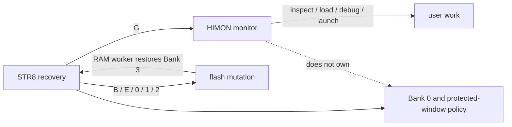

# RTFM R-YORS

This is the short operator map. The rest of the docs explain why; this page is
for remembering what matters when the board is in front of you.

## Big Picture

```text
reset -> STR8 -> HIMON -> user work
```

STR8 is the small recovery/update monitor. HIMON is the normal interactive
monitor. Use STR8 for backup/restore policy. Use HIMON for ordinary inspection,
loading, disassembly, assembly, and launching code.



## Current Status

A rudimentary STR8 flash-recovery path has been lightly tested on hardware and
is functioning nominally. Treat it as an early recovery tool, not a finished
field-updater: keep a programmer recovery path and known-good image nearby.

## Command Safety Mandate

```text
DESTRUCTIVE COMMANDS MUST BE 4+ CHARACTERS.
```

Future destructive commands must use full words. This applies to copy, fill,
move, erase, flash, bank, backup, restore, and boot/recovery policy changes.
STR8 keeps `R` as reset. The current one-key STR8 recovery commands are an
early proof surface with `Y` confirmation; treat the destructive keys as
transitional until the command surface is revised.

## Current Burn Image

```text
primary image:   SRC/BUILD/bin/himon-str8-rom.bin
HIMON:           $C000-$E357
STR8 image:      $F000-$F620
worker source:   $F800-$FA7F, copied to $0200 when needed
STR8 window:     $F000-$FFFF
config pocket:   $FFF0-$FFF9
vectors:         $FFFA-$FFFF
```

Build the combined image with:

```text
make -C SRC himon-str8-rom-bin
```

## First Boot Checks

After burn, these should match:

```text
D C000 +10   78 D8 A2 FF 9A AD E6 7E ...
D F000 +10   78 D8 A2 FF 9A 20 1D F0 ...
D F800 +10   08 78 AD 17 03 C9 04 F0 ...
D FFFA FFFF  C2 DB 00 F0 C5 DB
```

On reset, STR8 should initialize FTDI, print `HIMON IN 3S. S=STR8`, and count
down `3 2 1`. Press `S` during that delay to show the STR8 prompt.

## Flash Banks

```text
Bank 3  live reset/boot image
Bank 2  newest backup image
Bank 1  older backup image
Bank 0  held base/factory slot until enrolled
```

Bank 0 is not ordinary rotation space until `E` is confirmed in STR8. After
that, Bank 0 joins backup rotation and may be erased by future backups.

## STR8 Keys

```text
?       print STR8 ID/state
B       backup rotation
E       enroll Bank 0 into rotation, destructive, confirmed
M       map bank/sector status, + used and - erased
0       restore Bank 0 -> Bank 3
1       restore Bank 1 -> Bank 3
2       restore Bank 2 -> Bank 3
G       go HIMON
R       reset through live vector
```

`B`, `E`, `0`, `1`, and `2` are destructive and ask for `Y`. `R` remains the
STR8 reset key. `M` is read-only but switches flash banks from the RAM worker.
Do not press NMI while STR8 is erasing, programming, or mapping flash. Under the
command safety mandate, future destructive STR8 commands should move to
full-word names.

## HIMON Basics

```text
?              help
# [token]      list records, or resolve token without executing it
D start +n     dump memory count
D start end    dump memory range
M addr         modify memory
U start +n     disassemble
A addr         assemble
G addr         go to address
L              load S-records to RAM
L G            load S-records and go
L F            flash-load under the current guard
R [regs]       display/edit trapped context registers
B start        set breakpoint
B C start      clear breakpoint
B L            list breakpoints
N              single-step trapped context
X              resume trapped context
Q              quiesce with WAI, then re-enter on wake
```

For dump commands in the current parser, `+n` is the safer habit when you mean
"show me this many bytes." The target range syntax is `start +count` for a byte
count and short inclusive end tokens that inherit the start high byte, so
`D 3000 FF` means `$3000-$30FF`. Target continuation behavior: after
`D 3000 FF`, a bare `D` displays `$3100-$31FF`.

## Sharp Edges

```text
STR8 owns backup/restore and protected-window policy.
HIMON L F is not a sector erase/update tool.
The old $F00D/$FADE/$FEED fixed ABI entries are gone.
STR8 ordinary restore preserves $C000-$FFFF unless high flash is confirmed.
WDCMONv2/base-image preservation is still TODO bridge work.
```

## Update Direction

Future HIMON/STR8 updates should be RAM-resident sector transactions:

```text
read sector into RAM
merge staged update bytes
program directly if all changes are 1->0
confirm before erase
erase/write full staged sector if needed
verify by read-back compare
restore Bank 3 before printing status
```

STR8 self-update is a special confirmed operation and should end in reset.

## More RTFM

```text
DOC/GUIDES/RTFM-str8.md    recovery, backups, restores, Bank 0
DOC/GUIDES/RTFM-himon.md   monitor commands, loading, debug notes
```
