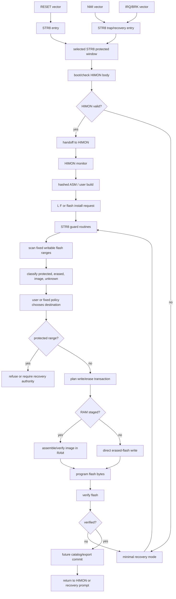
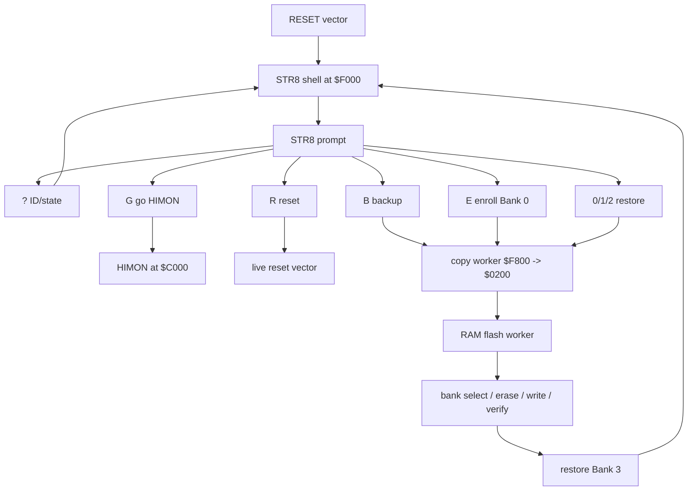
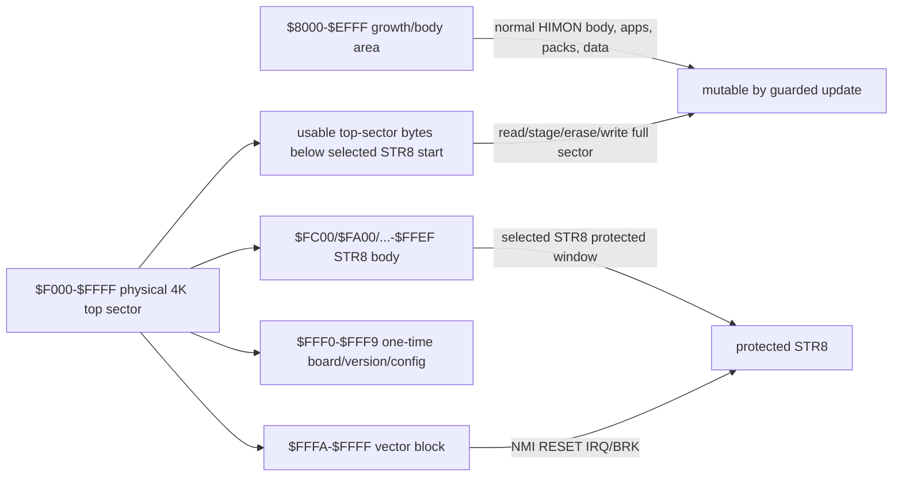

# STR8 Recovery Monitor

`STR8` means `Subroutine To Return`. It is pronounced `S-T-R-8`, can also be
read as `Straight 8`, and deliberately echoes `RTS` / Return from Subroutine.

Future naming may let STR8 grow into `STR8-N`, read as `STRAIGHTEN`: a richer
repair/normalization path once the small recovery anchor has proved itself.
That name is a direction, not a promise that the first STR8 must own every
system policy.

Terms such as bank, sector, segment, protected window, owns, uses, requests,
contract, buried, gone, and condense follow [GLOSSARY.md](./GLOSSARY.md).

STR8 is the protected recovery/update monitor for HIMON. It is not
just a crash handler and not just a flash writer. It keeps the machine on a
known-good path while code, routines, data, and banks are being changed.

V0 STR8 is image-oriented recovery: banks 0-2 hold whole 32K ROM images for
backup and restore, while the selected STR8 protected window is flashed through
its own guarded path. HIMON owns hashed catalog lookup, rich command behavior,
and IRQ/vector control in the first version. Future STR8-N/STRAIGHTEN may offer
catalog, FNV, scan, repair, and vector-layer services after the image-recovery
path is stable, but it should remain useful to systems that keep their own
memory map, interrupt policy, or runtime supervisor.

Working definition:

```text
STR8 = the top-sector recovery anchor and flash mutation guard.
```

System relationship:

```text
R-YORS boots through STR8.
STR8 keeps recovery/update safe.
STR8 hands normal operation to HIMON.
HIMON provides the monitor, command dispatch, assembler, catalog lookup,
and debug tools.
```

## Core Questions

V0's recovery target is settled:

```text
restore from a whole 32K ROM image in bank 0, 1, or 2
logical image range: $8000-$FFFF
bank 3 restore: write ordinary image bytes by guarded flash flow
protected STR8 window: skip unless explicit STR8 install/update is requested
```

Bank 0 begins as the optional WDCMONv2/base-image hold slot. A future
WDCMONv2-to-R-YORS bridge should offer to save the board's original live base
flash image before conversion, but that preservation flow is a TODO and is not
part of today's STR8 test target.

Until explicitly enrolled, bank 0 is excluded from automatic backup rotation.
The STR8 `E` command enrolls bank 0 after a destructive confirmation and sets a
one-way in-flash flag. The current proof uses bit 0 of `$FFF0`: erased/set
means `B0 HOLD`, cleared means `B0 ROT`. After enrollment, automatic backup
rotates `1 -> 0`, `2 -> 1`, and `3 -> 2`. Bank 0 then remains in the rotation
until erase/reflash or a deliberate STR8 configuration rebuild.

First principle: STR8 cannot safely erase the code it is currently running
from. Self-recovery therefore needs either a protected window that is not erased
during normal updates, or a RAM-resident updater that has already copied all
required flash routines out of the target erase area.

Future open recovery questions remain for self-update, catalog-aware repair,
and richer install/export flows. Those are not V0.

## Recommended Split

Use a two-level model:

```text
STR8 protected window:
  minimal, protected, always recoverable
  provides recovery entry, flash guard state, verifier, and repair hooks

HIMON body:
  normal monitor/catalog/assembler/loader services
  can be updated by STR8
```

The current V0 split is small, W65C02-specific, and gives STR8 the whole
physical top flash sector so recovery code can keep growing without crowding
the vectors.

The physical top erase sector is still `$F000-$FFFF`, because flash erase
granularity is 4K and the hardware vectors live at the top of ROM. The current
combined image uses `$F000-$FFFF` as the protected STR8 top sector:

```text
$FC00-$FFFF  1K protected STR8 window
$FA00-$FFFF  1.5K protected STR8 window
$F800-$FFFF  2K protected STR8 window
$F600-$FFFF  2.5K protected STR8 window
$F400-$FFFF  3K protected STR8 window
$F200-$FFFF  3.5K protected STR8 window
$F000-$FFFF  4K protected STR8 window, current combined image

$FFF0-$FFF9  one-time flash board/version/config bytes, inside the window
$FFFA-$FFFF  W65C02 hardware vector block
```

Protected-window bytes are flashed through a separate install/self-update path.
That path still stages the full top sector and preserves non-target bytes,
because hardware erase granularity is 4K. Ordinary writes must not treat the
selected STR8 protected window as casual free space. Bytes below the chosen
protected start but still inside `$F000-$FFFF` may hold common routines or
HIMON-facing material, but updating them requires the same top-sector
transaction: read the full 4K sector into RAM, update only the allowed bytes in
the staged image, erase `$F000-$FFFF`, write the full staged sector back, and
verify by read-back.

V0 restore still reasons about complete `$8000-$FFFF` ROM images as sources,
but the bank 3 write path skips the selected STR8 protected window unless the
operator explicitly requests a STR8 install/update. The `$FFF0-$FFF9` bytes are
reserved for one-time flash data such as board id, version, and config
information. They can be patched only by clearing bits until the top sector is
erased/rebuilt. The final hardware vector bytes are the W65C02 vector table:

```text
$FFFA-$FFFB  NMI
$FFFC-$FFFD  RESET
$FFFE-$FFFF  IRQ/BRK
```

Those vector bytes remain part of the selected STR8 protected window. They are
treated as vector table rather than normal code storage.

## Vector Integration Policy

V0 HIMON controls IRQ/vector behavior.

Direction change: earlier STR8 notes leaned toward future STR8 ownership of the
final hardware vectors and broader trap authority. After careful
reconsideration by the project author, the direction is softer and more
reusable: STR8 should offer recovery-safe hooks and routines, while the active
system may keep its own memory and interrupt policy.

STR8 should not assume it owns memory management or application interrupt
policy. A board, application, or user-built system may already have its own RAM
map, interrupt discipline, and trap supervisor. STR8 should be useful in that
world as a set of recovery routines and guarded update paths, not as a demand
that the rest of the system reorganize around it.

That keeps STR8 in the R-YORS spirit: routines made from routines, useful as
layers a system can choose and combine rather than a hidden operating-system
claim over the board.

The R-YORS reference path can still route reset/trap behavior through STR8 or a
shared vector layer when that makes recovery safer. The preferred integration is
through explicit hooks such as `SYS_VEC`/IRQ-vector services when they exist,
rather than by silently claiming all practical NMI/BRK/IRQ behavior.

Reference integration rule:

```text
hardware vector -> STR8 entry/trampoline/router -> active handler
```

Reference normal operation:

```text
STR8 validates HIMON
STR8 hands off to HIMON
HIMON installs NMI/BRK/IRQ handlers through STR8 or SYS_VEC calls
STR8 routes traps to the installed HIMON handlers
```

Reference recovery operation:

```text
HIMON missing/corrupt/unsafe
STR8 ignores or clears HIMON-installed handlers
STR8 routes traps to minimal recovery handlers
```

So yes: HIMON controls practical trap handling in V0. Later
STR8-N/STRAIGHTEN can offer a recovery-safe vector path for systems that choose
it. Systems that already own interrupts can still use STR8 routines directly and
keep their own policy.

The code may use W65C02 instructions when they keep the anchor smaller or
clearer. NMOS 6502 portability is not a STR8 V0 goal.

## Recovery I/O Layering

STR8 should talk to the smallest useful layer that still preserves a reusable
contract.

Working rule:

```text
prefer BIO_* for STR8 recovery I/O
use PIN_* only when no BIO_* helper exists yet
promote repeated PIN_* use into BIO_*
avoid COR_*/SYS_* in the STR8 hot path unless explicitly recovery-safe
```

That gives STR8 a direct, small path for bytes, hex, CRLF, and future flash
status output without dragging in the normal monitor personality. `PIN_*`
remains the hardware/register edge. `BIO_*` is the first reusable board I/O
contract. `COR_*` and `SYS_*` sit above that for richer monitor/application
behavior.

Possible layouts:

```text
Protected top-sector model:
  $8000-$BFFF          app/growth space in the selected ROM bank
  $C000-$E357          current HIMON body and data
  $E358-$EFFF          slack inside the used E sector
  $F000-$FFFF          STR8 protected top sector

RAM-updater model:
  special install/self-update path only
  before erasing protected areas, copy updater to RAM and run from RAM
  leave either a valid STR8 sector or a clear external-recovery requirement
```

The protected top-sector model matches the hardware reality that the top 4K
erase sector contains the reset vectors and recovery authority. The whole sector
must be erased and rewritten as a sector when any byte in it changes, but the
protected policy window should be no larger than STR8 actually needs. STR8
should not grow into a full monitor just because the sector is special; HIMON
still owns the rich interactive environment.

## STR8 V0 Constraints

V0 should stay deliberately small:

```text
W65C02-specific code is allowed
first implementation is a RAM-resident S19 launched under HIMON
first RAM proof image links at $3000
first RAM proof reserves $4000-$4FFF as the 4K copy buffer
first RAM proof can perform backup rotation with read-back verify
first RAM proof can enroll bank 0 into rotation by clearing an in-flash flag bit
first RAM proof can restore bank 0, 1, or 2 to bank 3 while preserving STR8 bytes
current ROM build links STR8 at $F000 and stores a RAM worker at $F800
current ROM build copies the worker to $0200 before B/0/1/2 flash mutation
current ROM build copies the worker to $0200 before E config mutation
current ROM build has working B, E, 0, 1, 2, G, R, and ? commands
physical top erase sector is bank 3 $F000-$FFFF
current protected STR8 proof window starts at $F000
protected bytes are flashed through a separate STR8 install/update path
non-STR8 top-sector updates use read/stage/erase/full-sector-write/verify
STR8 code/data/recovery lives from selected start through $FFEF
one-time board/version/config window is $FFF0-$FFF9
hardware vector block is $FFFA-$FFFF
V0 uses whole 32K ROM bank images as recovery and backup sources
V0 bank copy uses a 4K RAM buffer one erase sector at a time
V0 HIMON controls IRQ/vector behavior
V0 has no FNV/catalog lookup
no flash garbage collection
no relocation replay
no command-text compression in STR8 itself
no rich user interface
```

V0 should do only enough to keep boot and flash mutation recoverable:

```text
reset entry
startup delay before first console output
initialize FTDI/VIA console path directly
leave IRQ/vector policy with HIMON/reference system in V0
boot check
handoff to HIMON
minimal recovery entry
selected STR8 protected-window check
flash write/erase guard hooks
small verify/check routines
```

STR8 V0 verification means fixed-range checks, flash status, byte-for-byte
read-back across restored ordinary image bytes, and separate read-back
verification after any protected-window install/update. Future catalog-owning
STR8 may use FNV once that direction becomes real.

## Boot Relationship

Current prototypes may boot directly into HIMON. The proposed R-YORS/STR8
path boots through STR8 first, then hands normal operation to HIMON
after a small validity check.

At boot, STR8 should be able to:

- verify the HIMON body enough to decide whether normal boot is safe
- enter recovery mode if the body is missing, partial, or corrupt
- preserve a small failure reason for the user
- provide a minimal serial/FTDI path if the normal monitor body cannot run
- expose flash repair/install commands

In the first implementation, this can be mostly policy and a few guard bytes.
The full recovery monitor can grow later.

## WDCMONv2 Board-Onboarding Bridge

One desired future path is to let someone buy a stock W65C02SXB-style board and
move from WDCMONv2 into R-YORS without requiring an external ROM/flash
programmer or deep WDC toolchain work.

Author preference: if a T48 programmer is available, directly programming the
flash/ROM remains the cleanest installation method. The bridge exists so a new
board owner can still get to R-YORS using only the stock WDCMONv2 load/run
path.

This bridge is a future option, not a committed STR8 V0 feature. It may never
be implemented, or its final form may have more or fewer features than this
sketch depending on what the board and installer actually need.

This is not the normal path for a board that already has R-YORS/HIMON
flashed and running. It is a first-install ramp for a fresh board.

Working shape:

```text
board boots existing WDCMONv2
user loads a simple BSO2/WDC-style bridge program using WDCMONv2's load/run style
bridge prints/verifies board and firmware identity
bridge uses WDC-style signatures and fixed jump/service vectors where useful
bridge receives or carries STR8/HIMON image data
bridge erases/programs/verifies the target flash region
board reboots through STR8
STR8 validates and hands off to HIMON
```

The bridge is not meant to become the permanent monitor and it should not make
the user live in WDC's methods. It borrows only the stock board's existing
loading path and the simple BSO2/WDC-style program shape so the user can start
from what they already have. Once the bridge is running, its job is to convert
flash to the R-YORS layout.

BSO2 is the model for the structure, not a literal source dependency:

```text
CODE region
board/ROM signature
reset/NMI/IRQ jump trampolines
documented cold-start routine
small board I/O initialization
minimal FTDI/serial byte contract
known load/link address
single-purpose reflash flow
```

That gives the user a plain loader-shaped program that can be started from
WDCMONv2 and then does the controlled conversion to R-YORS.

Useful pieces to preserve from the WDC side:

```text
board/firmware signature   tells the bridge what it is running on
jump/service vectors       give stable callable entry points
simple load/execute path    lets the user start without a dedicated programmer
```

The STR8 side should treat this as an installation authority with extra care:
verify the image, verify the target range, avoid erasing the running bridge,
and leave either a valid STR8 anchor or a clear recovery failure reason.

Possible later nicety: before conversion, STR8 or the bridge may offer to save
or record the original WDCMONv2 image/provenance somewhere safe. That backup
question belongs to the future installer design; it is not required to define
STR8's recovery contract.

## Proposed STR8 Overview Map

This is the future high-level STR8/HIMON shape. It keeps STR8 small while
allowing later catalog-aware flash mutation. V0 is simpler: image-based
restore/verify and backup rotation.



The future core rule is that normal work may begin in HIMON, but flash mutation
can cross a STR8 boundary before bytes are trusted. V0 does not do
catalog-shaped work; it restores and verifies fixed bank images with the
protected STR8 window handled separately.

## Minimal Recovery

Minimal recovery is not full HIMON. It is a small HIMON-lite only in the sense
that it has enough serial I/O and flash safety to repair the machine.

V0 command surface should be closer to this:

```text
?          print tiny STR8 ID/state
B          backup rotation, with verify built in
E          enroll bank 0 into backup rotation, destructive, confirmed
0          restore bank 0 to bank 3, with verify built in
1          restore bank 1 to bank 3, with verify built in
2          restore bank 2 to bank 3, with verify built in
G          go HIMON
R          reset
```

`L S`, `L F`, `GO addr`, standalone verify, catalog repair, and richer loading
are later features. The recovery loader should avoid the full assembler, full
catalog UI, compression tools, and rich command parser. Those belong in HIMON
once normal operation is safe.

There is no casual bank 0 erase command in the first command surface. `E` is the
only Bank 0 policy change: it confirms the destructive consequence, sets the
one-way rotation flag, and lets future `B` commands use bank 0 as the oldest
automatic backup slot.

## Current Command Worker Map

The current ROM build keeps the prompt and text in resident STR8, but runs flash
mutation from RAM:



The worker does not call ROM, HIMON, or BIO while flash banks are being changed.
It restores Bank 3 and returns carry/status; the resident STR8 shell prints the
result.

## Future Advanced Sector Tool

A later advanced mode may expose sector-level flash maintenance, but it is not
part of V0's tiny recovery prompt. It belongs behind an explicit advanced entry
such as `A`, a confirmation, and possibly a larger STR8-N or HIMON maintenance
build.

Good fit:

```text
select source bank
select source sector
select destination bank
select destination sector
erase selected destination sector, confirmed
copy source bank/sector -> destination bank/sector, verify
compare/check selected source and destination sector
quit advanced mode
```

Bad fit:

```text
the normal ? B E M 0 1 2 G R rescue path
automatic backup policy
casual bank 0 erase before enrollment
catalog garbage collection
rich monitor UI
```

Guard rails:

- Advanced copy must never silently change the Bank 0 enrollment flag. `E`
  remains the ordinary Bank 0 policy command.
- Writes to live bank 3, Bank 0 before enrollment, the selected STR8 protected
  window, or the hardware vector bytes need refusal or loud confirmation.
- The running STR8 code, RAM flash worker, and staged sector image must not be
  erased out from under the operation.
- Copy must verify immediately by read-back compare. A separate later verify is
  not enough for a destructive maintenance command.
- Sector copies can intentionally create mixed images. STR8 should report that
  risk instead of pretending a copied sector means the whole bank is bootable.
- Sector size comes from flash geometry. The current board uses 4K erase
  sectors, but the UI should not make the number part of the policy.

## STR8 Protected Address Map



The whole `$F000-$FFFF` sector is the physical erase unit. Only the chosen
STR8 window is policy-protected. If code or data below the window changes, the
flash driver still has to read, stage, erase, rewrite, and verify the full 4K
sector.

## Flash Growth Workflow

Desired user flow:

```text
Himon boots.
User writes a program/routine/data definition.
User wants it in flash.
Himon scans writable flash sections.
Himon presents a list of candidate sections.
User picks a section.
User assembles/builds for that section.
User loads/writes with L F.
Himon verifies the written bytes.
Himon discovers the new record.
The routine/program/data is now self-referencing through the catalog.
Repeat until ROM space is intentionally filled.
```

The key idea is that `L F` should not merely program bytes. It should help turn
new flash content into catalog-visible content.

## Future Writable Section Scan

Future STR8 may provide routines to scan flash and classify regions:

```text
selected STR8 protected window
HIMON body
free/erased
catalog records
routine/program pack
data pack
unknown/non-HIMON bytes
bad/partial write
```

This is not V0. A future simple scan can look for erased `$FF` runs and known
record signatures. Later scans can understand module headers, checksums,
sequence numbers, and append-only catalog entries.

## Bank Use Intent

The first STR8 bank policy is image-oriented:

```text
bank 3 = live reset/boot image
bank 2 = most recent backup image
bank 1 = previous backup image
bank 0 = optional WDCMONv2/base hold, unless enrolled into rotation
```

On a backup request before bank 0 enrollment:

```text
copy bank 2 -> bank 1
copy bank 3 -> bank 2
```

On a backup request after `E` enrolls bank 0:

```text
copy bank 1 -> bank 0
copy bank 2 -> bank 1
copy bank 3 -> bank 2
```

The `E` enrollment flag is intentionally one-way under ordinary flash rules.
Once the flag is set, bank 0 stays in automatic rotation until erase/reflash or
a deliberate STR8 configuration rebuild.

On a recovery/restore request:

```text
restore ordinary bytes from selected 32K bank image 0, 1, or 2 -> bank 3
skip selected STR8 protected window unless explicit STR8 install/update is requested
```

Restoring bank 0 means restoring whatever bank 0 currently holds. Before
enrollment that may be a WDCMONv2/base image and may remove R-YORS from the live
boot image. After enrollment it is simply the oldest rotating backup image.

Saving the board's original WDCMONv2/base flash image remains a future bridge
TODO, not a requirement for today's STR8 RAM proof.

The generic primitive remains a bank copy:

```text
FLSH_COPY_BANK_AX   ; A = source bank, X = destination bank
```

A later installer/bridge wrapper for restoring a saved base image may be
deliberately descriptive:

```text
STR8_RESTORE_FACTORY
FLASH_S19_BOARD_RESET_TO_FACTORY
```

Full-bank copy in the current RAM-resident S19 proof stages one 4K erase sector
at a time through `$4000-$4FFF`:

```text
B command, B0 HOLD: copy bank 2 -> bank 1, then bank 3 -> bank 2
B command, B0 ROT:  copy bank 1 -> bank 0, bank 2 -> bank 1, bank 3 -> bank 2
0/1/2 commands:     copy selected bank -> bank 3 while preserving STR8 bytes
```

Each 4K window reads from the source bank, writes the destination bank, and
verifies by simple read-back compare. The `$F000` ROM build uses the same copy
policy by first copying its worker from bank 3 `$F800-$FFFF` into RAM
`$0200-$09FF`. Ordinary restore into bank 3 preserves `$C000-$FFFF` unless the
operator explicitly confirms high flash, so HIMON, the ROM worker, and the
protected STR8/vector window remain usable after a normal restore. FNV, catalog
lookup, wear leveling, and cycle counts are later work.

## STR8/HIMON Update Direction

The flash guard should stay in place. Updating HIMON or STR8 should not mean
"turn off the guard and let a ROM-resident command erase whatever it is running
from." The safer shape is a confirmed RAM-resident sector transaction.

Generic sector update:

```text
select destination bank and 4K sector
read the live destination sector into the RAM staging buffer
apply the new bytes to the staged sector image
compare staged image with live flash
if all changes are 1->0, program changed bytes and verify
if any change needs 0->1, ask for erase confirmation
after confirmation, erase the destination sector
write the complete staged sector back
verify the complete sector by read-back compare
restore bank 3 before printing status
```

This is a good fit for ordinary HIMON body sectors. STR8 can keep the guard,
but still provide a deliberate tool that knows which sector is being rebuilt
and whether an erase is required.

The top sector needs stricter policy. `$F000-$FFFF` contains STR8, the RAM
worker source copy, the config pocket, and vectors. Updating that sector must
preserve the non-target bytes unless the operator explicitly requested a STR8
update.

STR8 self-update is the special case:

```text
new STR8 image is staged in RAM
current top sector is staged in RAM
new STR8 bytes replace the protected-window bytes in the staged image
config bytes are preserved unless explicitly changed
vectors are rebuilt deliberately
operator confirms the protected-sector erase
RAM worker erases $F000-$FFFF, writes the staged sector, verifies, then resets
```

Do not add little fixed holes in `$FE03-$FFEF` for counters or future promises.
Pack STR8 code and data back-to-back, reserve only deliberate fixed pockets
such as `$FFF0-$FFF9`, and treat the remaining slack as growth space. Repeated
write counters belong in a separate metadata sector if they become important;
they should not force routine erases of STR8's protected sector.

## Self-Referencing Flash Content

A flashed routine/program/data item becomes self-referencing when it carries or
is accompanied by catalog metadata:

```text
hash/name identity
kind
address/value
flags
optional compressed name text
optional module id
optional version/content checksum
```

The assembler project uses this directly:

```text
SYS_WRITE_CSTR is typed.
Himon hashes/canonicalizes it.
Catalog lookup returns the address.
The assembled code emits the call target.
```

The text name is not required for fast lookup, but it is important for onboard
catalog maintenance, collision proof, listings, and later self-hosted linking.

## L F Policy

First version of `L F` can be conservative:

- require user-selected destination or explicit flash mode
- refuse selected STR8 protected window and vector regions
- write only erased flash bytes unless an erase command has prepared the sector
- verify every written byte
- rescan and print discovered records after write
- report partial/unknown records instead of guessing

Later `L F` can become catalog-aware:

- detect provided routines already present
- detect unresolved imports
- use existing routine references instead of duplicating code
- reject or qualify duplicate exports
- write append-only catalog records
- commit with a final valid byte or sequence marker

## Duplication Problem

Right now, duplicated code is a real risk.

If every flash load brings its own copy of helper routines, ROM fills quickly and
the catalog becomes ambiguous. That is acceptable for early experiments, but it
is not the end state.

Later loading should distinguish:

```text
provided/exported routine:
  this module offers a routine

required/imported routine:
  this module needs a routine that may already exist

private routine:
  local to the module; not visible globally

replacement/update:
  newer provider for an existing routine
```

When `L F` sees a provided routine that already exists, it can choose among:

```text
reject duplicate
accept duplicate as module-local
alias to existing provider
replace by version policy
keep both with qualified module names
```

The simplest safe rule:

```text
If global hash/name already exists, reject duplicate global export unless the
user explicitly installs it as module-local or replacement.
```

## Catalog Without Host Tools

The catalog must be maintainable on board. There may be no modern build tools.

That means:

- collision checks happen by runtime catalog scan
- onboard-created exports should include name text, preferably compressed
- `#` is the master catalog view and may show collisions
- host-generated flags are optional conveniences, not required truth

Hash-only records can exist for tiny ROM built-ins, but self-hosted exported
symbols should carry enough name metadata to prove identity on board.

Name metadata may be compressed, but compression must be optional. If the
compressed form is not smaller than the raw form after headers/flags, store the
raw name instead. A small W65C02-friendly decoder is more important than an
aggressive compression ratio.

## Open Decisions

- What fixed image marker/check should STR8 V0 use for whole-image recovery
  images?
- Which catalog, FNV, scan, and vector-layer hooks should future
  STR8-N/STRAIGHTEN offer without requiring ownership of user memory or
  interrupt policy?
- What explicit import labels should HIMON use for resident STR8 routines once
  STR8 is no longer a simulation stub?
- Does `L F` assemble/write directly to flash, or assemble into RAM and then
  flash from a verified staging image?
- What is the first catalog record format that supports both compact built-ins
  and onboard-created named exports?
- What is the first compression format for routine names: HBSTR, PACK5, or a
  mixed encoding flag?
