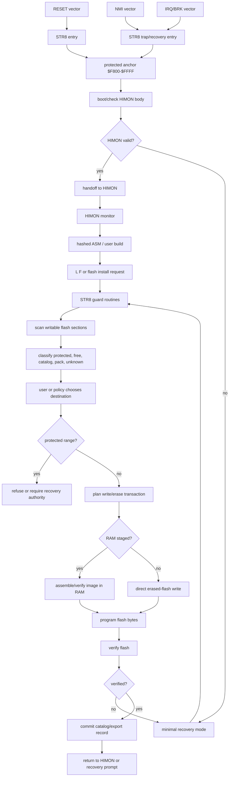
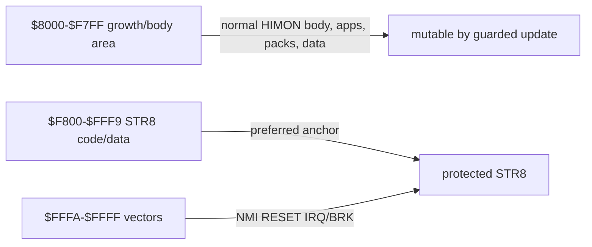

# STR8 Recovery Monitor

`STR8` means `Straight 8`.

STR8 is the protected recovery/update monitor for Himonia-F/Himon. It is not
just a crash handler and not just a flash writer. It keeps the machine on a
known-good path while code, routines, data, banks, and catalog records are being
changed.

Working definition:

```text
STR8 = the Himon-owned recovery monitor and flash mutation guard.
```

System relationship:

```text
R-YORS boots through STR8.
STR8 keeps recovery/update safe.
STR8 hands normal operation to HIMON.
HIMON provides the monitor, command dispatch, assembler, catalog lookup,
and debug tools.
```

## Core Questions

The open design question is what STR8 is allowed to recover:

```text
1. user routines/programs/data only
2. Himonia-F main monitor body
3. STR8 itself
4. the entire $8000-$FFFF ROM image
5. only a protected top region such as $F800-$FFFF
```

First principle: STR8 cannot safely erase the code it is currently running
from. Self-recovery therefore needs either a protected anchor that is not erased
during normal updates, or a RAM-resident updater that has already copied all
required flash routines out of the target erase area.

## Recommended Split

Use a two-level model:

```text
STR8 anchor:
  minimal, protected, always recoverable
  owns reset/NMI/BRK recovery, flash guard state, verifier, and repair entry

Himon body:
  normal monitor/catalog/assembler/loader services
  can be updated by STR8
```

The preferred V0 split is small and W65C02-specific.

Hard preference:

```text
$F800-$FFFF  preferred protected STR8 anchor, including vectors
$F800-$FFF9  STR8 code/data portion, about 2K minus vector bytes
$FFFA-$FFFF  W65C02 hardware vectors, protected and owned by STR8 policy
```

Fallback if the first STR8 anchor needs more space:

```text
$F000-$FFFF  STR8 anchor, ABI stubs, vectors, verifier, repair tools
```

The preferred `$F800-$FFFF` anchor keeps the code honest: STR8 should be a
small boot/recovery/update authority, not another full monitor. When the docs
say `$F800-$FFF9`, they are naming the code/data portion of the same protected
anchor, with vectors excluded for precision. The final six bytes are the W65C02
vector table:

```text
$FFFA-$FFFB  NMI
$FFFC-$FFFD  RESET
$FFFE-$FFFF  IRQ/BRK
```

Those vector bytes remain part of the STR8 protected anchor. They are treated as
vector table rather than normal code storage.

## Vector Ownership Policy

STR8 owns the hardware vector bytes at `$FFFA-$FFFF`.

HIMON/Himonia-F can take over vector behavior, but it should do that by
installing handlers through STR8-owned vector routing, not by casually owning
the final six bytes itself.

Working rule:

```text
hardware vector -> STR8 entry/trampoline/router -> active handler
```

Normal operation:

```text
STR8 validates HIMON
STR8 hands off to HIMON
HIMON installs NMI/BRK/IRQ handlers through STR8 or SYS_VEC calls
STR8 routes traps to the installed HIMON handlers
```

Recovery operation:

```text
HIMON missing/corrupt/unsafe
STR8 ignores or clears HIMON-installed handlers
STR8 routes traps to minimal recovery handlers
```

So yes: Himonia-F can "take over" practical trap handling by installing
vectors. But the ownership remains STR8's because STR8 must be able to recover
when HIMON is absent, broken, or mid-update.

The code may use W65C02 instructions when they keep the anchor smaller or
clearer. NMOS 6502 portability is not a STR8 V0 goal.

## Recovery I/O Layering

STR8 should talk to the smallest useful layer that still preserves a reusable
contract.

Working rule:

```text
prefer BIO_* for STR8 recovery I/O
use PIN_* only when no BIO_* helper exists yet
promote repeated PIN_* use into BIO_*
avoid COR_*/SYS_* in the STR8 hot path unless explicitly recovery-safe
```

That gives STR8 a direct, small path for bytes, hex, CRLF, and future flash
status output without dragging in the normal monitor personality. `PIN_*`
remains the hardware/register edge. `BIO_*` is the first reusable board I/O
contract. `COR_*` and `SYS_*` sit above that for richer monitor/application
behavior.

Possible layouts:

```text
Preferred 2K anchor model:
  $8000-$F7FF  HIMON body, apps, routine packs, data
  $F800-$FFFF  STR8 protected anchor
                code/data through $FFF9, vectors at $FFFA-$FFFF

Top-anchor model:
  $8000-$EFFF  Himon body, apps, routine packs, data
  $F000-$FFFF  STR8 anchor, ABI stubs, vectors, verifier

RAM-updater model:
  flash layout remains flexible
  before erasing Himon/STR8 areas, copy updater to RAM and run from RAM
```

The preferred 2K anchor matches the instinct that the highest ROM area should
hold stable recovery, ABI, and vectors, while still forcing STR8 to stay small.
The `$F000-$FFFF` model remains acceptable if V0 cannot fit or if board bring-up
needs a richer protected repair tool.

## STR8 V0 Constraints

V0 should stay deliberately small:

```text
W65C02-specific code is allowed
protected anchor prefers $F800-$FFFF
code/data should fit $F800-$FFF9
vectors live at $FFFA-$FFFF
no flash garbage collection
no relocation replay
no command-text compression in STR8 itself
no rich user interface
```

V0 should do only enough to keep boot and flash mutation recoverable:

```text
reset entry
NMI/IRQ/BRK vector ownership policy
boot check
handoff to HIMON
minimal recovery entry
protected range check
flash write/erase guard hooks
small verify/check routines
```

## Boot Relationship

Current prototypes may boot directly into Himonia-F. The proposed R-YORS/STR8
path boots through STR8 first, then hands normal operation to HIMON/Himonia-F
after a small validity check.

At boot, STR8 should be able to:

- verify the Himon body enough to decide whether normal boot is safe
- enter recovery mode if the body is missing, partial, or corrupt
- preserve a small failure reason for the user
- provide a minimal serial/FTDI path if the normal monitor body cannot run
- expose flash repair/install commands

In the first implementation, this can be mostly policy and a few guard bytes.
The full recovery monitor can grow later.

## WDCMONv2 Board-Onboarding Bridge

One desired future path is to let someone buy a stock W65C02SXB-style board and
move from WDCMONv2 into R-YORS without requiring an external ROM/flash
programmer or deep WDC toolchain work.

Author preference: if a T48 programmer is available, directly programming the
flash/ROM remains the cleanest installation method. The bridge exists so a new
board owner can still get to R-YORS using only the stock WDCMONv2 load/run
path.

This bridge is a future option, not a committed STR8 V0 feature. It may never
be implemented, or its final form may have more or fewer features than this
sketch depending on what the board and installer actually need.

This is not the normal path for a board that already has Himonia-F/R-YORS
flashed and running. It is a first-install ramp for a fresh board.

Working shape:

```text
board boots existing WDCMONv2
user loads a simple BSO2/WDC-style bridge program using WDCMONv2's load/run style
bridge prints/verifies board and firmware identity
bridge uses WDC-style signatures and fixed jump/service vectors where useful
bridge receives or carries STR8/HIMON image data
bridge erases/programs/verifies the target flash region
board reboots through STR8
STR8 validates and hands off to HIMON
```

The bridge is not meant to become the permanent monitor and it should not make
the user live in WDC's methods. It borrows only the stock board's existing
loading path and the simple BSO2/WDC-style program shape so the user can start
from what they already have. Once the bridge is running, its job is to convert
flash to the R-YORS layout.

BSO2 is the model for the structure, not a literal source dependency:

```text
CODE region
board/ROM signature
reset/NMI/IRQ jump trampolines
documented cold-start routine
small board I/O initialization
minimal FTDI/serial byte API
known load/link address
single-purpose reflash flow
```

That gives the user a plain loader-shaped program that can be started from
WDCMONv2 and then does the controlled conversion to R-YORS.

Useful pieces to preserve from the WDC side:

```text
board/firmware signature   tells the bridge what it is running on
jump/service vectors       give stable callable entry points
simple load/execute path    lets the user start without a dedicated programmer
```

The STR8 side should treat this as an installation authority with extra care:
verify the image, verify the target range, avoid erasing the running bridge,
and leave either a valid STR8 anchor or a clear recovery failure reason.

Possible later nicety: before conversion, STR8 or the bridge may offer to save
or record the original WDCMONv2 image/provenance somewhere safe. That backup
question belongs to the future installer design; it is not required to define
STR8's recovery contract.

## Proposed STR8 Overview Map

This is the proposed high-level STR8 shape. It keeps STR8 small: STR8 owns the
protected decision path and flash mutation guard, while HIMON owns the rich
interactive monitor.



The core rule is that normal work may begin in HIMON, but flash mutation crosses
a STR8 boundary before bytes are trusted. That boundary is where range checks,
erase/write state, verification, and commit markers live.

## Minimal Recovery

Minimal recovery is not full HIMON. It is a small HIMON-lite only in the sense
that it has enough serial I/O and flash safety to repair the machine.

V0 command surface should be closer to this:

```text
? / ID     print STR8, board, version, and boot failure reason
L S        load S-record text into RAM/staging
L F        flash a verified staged image or selected S-record payload
V          verify staged image or flash range
G addr     jump only when the target is explicitly accepted
R          reset/retry normal boot
```

`L S` and `L F` are clearer than a bare `L` in recovery mode. The recovery
loader should avoid the full assembler, full catalog UI, compression tools, and
rich command parser. Those belong in HIMON once normal operation is safe.

## STR8 Protected Address Map



Fallback remains:

```text
$F000-$FFFF  larger protected STR8 anchor if V0 cannot fit at $F800
```

## Flash Growth Workflow

Desired user flow:

```text
Himon boots.
User writes a program/routine/data definition.
User wants it in flash.
Himon scans writable flash sections.
Himon presents a list of candidate sections.
User picks a section.
User assembles/builds for that section.
User loads/writes with L F.
Himon verifies the written bytes.
Himon discovers the new record.
The routine/program/data is now self-referencing through the catalog.
Repeat until ROM space is intentionally filled.
```

The key idea is that `L F` should not merely program bytes. It should help turn
new flash content into catalog-visible content.

## Writable Section Scan

STR8 should provide routines to scan flash and classify regions:

```text
protected anchor
Himon body
free/erased
catalog records
routine/program pack
data pack
unknown/non-Himon bytes
bad/partial write
```

A simple first scan can look for erased `$FF` runs and known record signatures.
Later scans can understand module headers, checksums, sequence numbers, and
append-only catalog entries.

## Bank Use Intent

The working policy is to avoid using bank 3 as the default destination for every
new onboard-built thing.

Bank 3 should remain the least cluttered bank:

```text
Himon body
core command records
boot-facing catalog/index records
stable trampolines
STR8-facing repair/recovery material
```

Banks 0-2 are better candidates for growth:

```text
routine packs
data packs
expanded command text
onboard-built exports
append-only replacement records
dead/stale records waiting for condense
```

This keeps the currently bootable/recoverable bank easier to reason about while
still allowing the machine to grow itself. STR8 should therefore report free
space by bank and prefer banks 0-2 for user-selected flash destinations unless
the user explicitly asks for bank 3.

## Self-Referencing Flash Content

A flashed routine/program/data item becomes self-referencing when it carries or
is accompanied by catalog metadata:

```text
hash/name identity
kind
address/value
flags
optional compressed name text
optional module id
optional version/content checksum
```

The assembler project uses this directly:

```text
SYS_WRITE_CSTR is typed.
Himon hashes/canonicalizes it.
Catalog lookup returns the address.
The assembled code emits the call target.
```

The text name is not required for fast lookup, but it is important for onboard
catalog maintenance, collision proof, listings, and later self-hosted linking.

## L F Policy

First version of `L F` can be conservative:

- require user-selected destination or explicit flash mode
- refuse protected STR8/ABI/vector regions
- write only erased flash bytes unless an erase command has prepared the sector
- verify every written byte
- rescan and print discovered records after write
- report partial/unknown records instead of guessing

Later `L F` can become catalog-aware:

- detect provided routines already present
- detect unresolved imports
- use existing routine references instead of duplicating code
- reject or qualify duplicate exports
- write append-only catalog records
- commit with a final valid byte or sequence marker

## Duplication Problem

Right now, duplicated code is a real risk.

If every flash load brings its own copy of helper routines, ROM fills quickly and
the catalog becomes ambiguous. That is acceptable for early experiments, but it
is not the end state.

Later loading should distinguish:

```text
provided/exported routine:
  this module offers a routine

required/imported routine:
  this module needs a routine that may already exist

private routine:
  local to the module; not visible globally

replacement/update:
  newer provider for an existing routine
```

When `L F` sees a provided routine that already exists, it can choose among:

```text
reject duplicate
accept duplicate as module-local
alias to existing provider
replace by version policy
keep both with qualified module names
```

The simplest safe rule:

```text
If global hash/name already exists, reject duplicate global export unless the
user explicitly installs it as module-local or replacement.
```

## Catalog Without Host Tools

The catalog must be maintainable on board. There may be no modern build tools.

That means:

- collision checks happen by runtime catalog scan
- onboard-created exports should include name text, preferably compressed
- `#` is the master catalog view and may show collisions
- host-generated flags are optional conveniences, not required truth

Hash-only records can exist for tiny ROM built-ins, but self-hosted exported
symbols should carry enough name metadata to prove identity on board.

Name metadata may be compressed, but compression must be optional. If the
compressed form is not smaller than the raw form after headers/flags, store the
raw name instead. A small W65C02-friendly decoder is more important than an
aggressive compression ratio.

## Open Decisions

- Can STR8 V0 fit in the preferred `$F800-$FFFF` anchor, with code/data through
  `$FFF9`, or does first bring-up
  require the fallback `$F000-$FFFF` region?
- Is bank 3 formally reserved for the least-cluttered boot/recovery/catalog
  path, with banks 0-2 preferred for growth packs?
- Does STR8 own `$FACE`, `$FADE`, `$FEED`, `$F00D`, and any future ABI slots, or
  does it only verify/route them?
- Does `L F` assemble/write directly to flash, or assemble into RAM and then
  flash from a verified staging image?
- What is the first catalog record format that supports both compact built-ins
  and onboard-created named exports?
- What is the first compression format for routine names: HBSTR, PACK5, or a
  mixed encoding flag?
