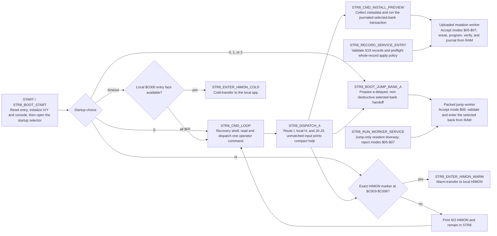
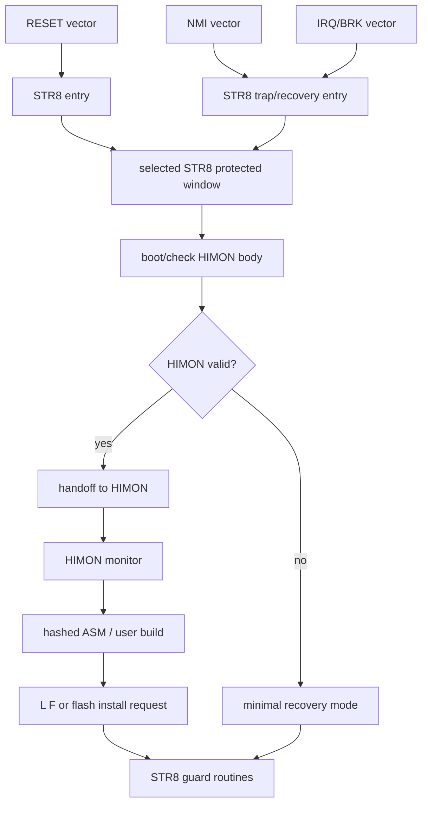
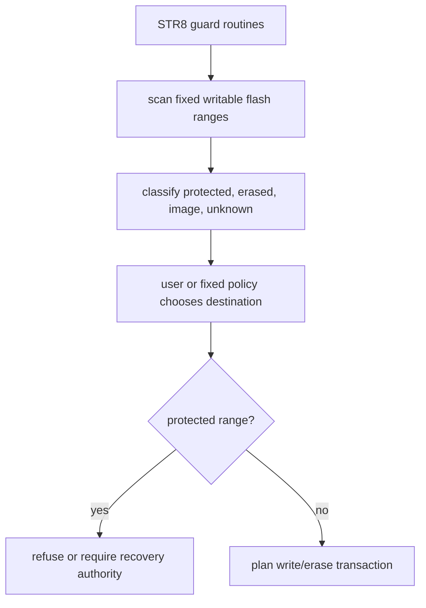
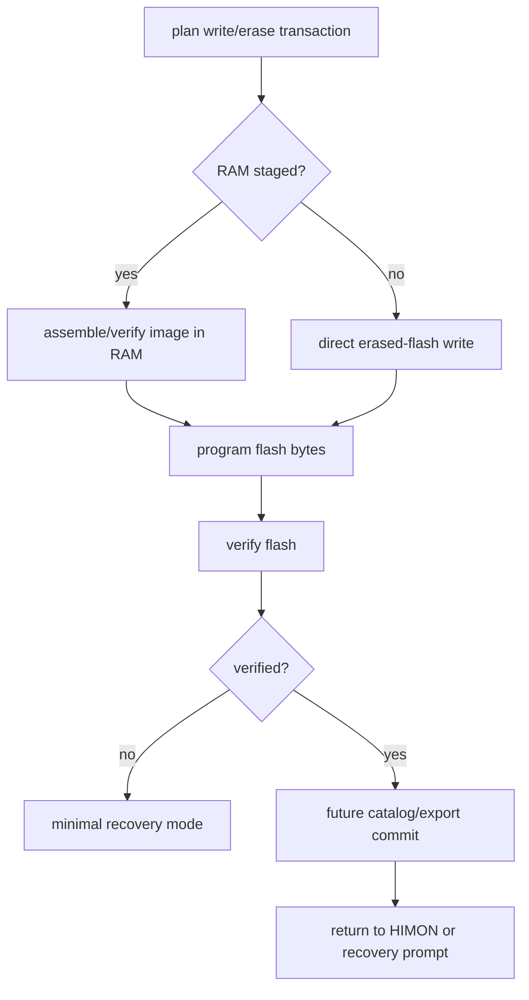
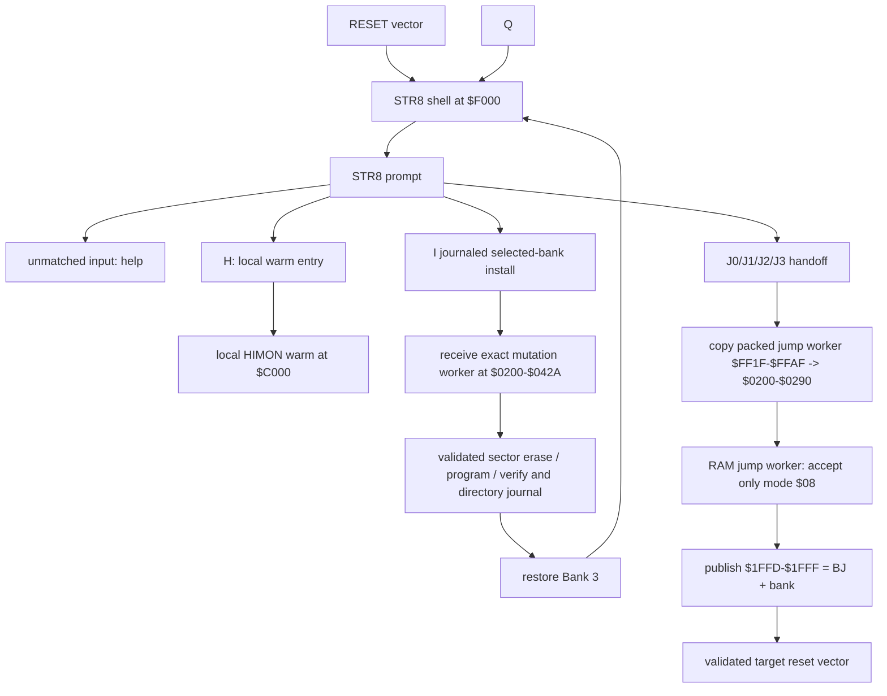
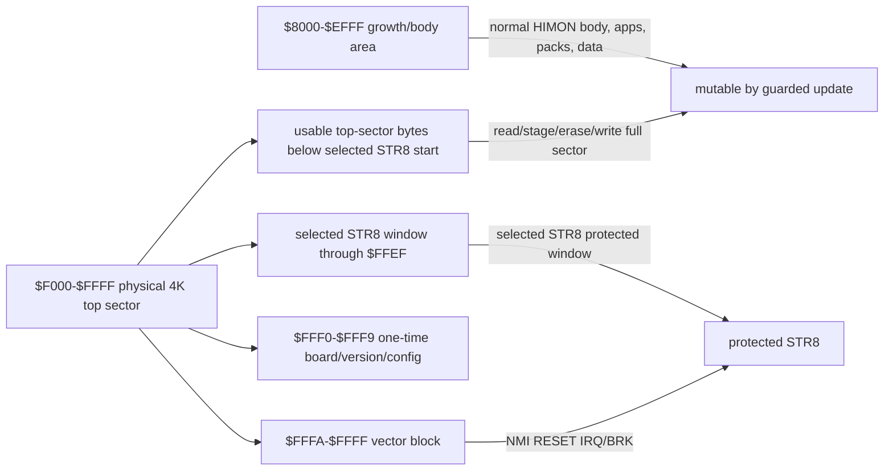

# STR8 Recovery Monitor

`STR8` means `Subroutine To Return`. It is pronounced `S-T-R-8`, can also be
read as `Straight 8`, and deliberately echoes `RTS` / Return from Subroutine.

Future naming may let STR8 grow into `STR8-N`, read as `STRAIGHTEN`: a richer
repair/normalization path once the small recovery anchor has proved itself.
That name is a direction, not a promise that the first STR8 must own every
system policy.

Terms such as bank, sector, segment, protected window, owns, uses, requests,
contract, buried, gone, and condense follow [GLOSSARY.md](../GLOSSARY.md).
Raw direct `JSR`/`JMP` evidence lives in
[STR8_EDGE_DUMP.md](STR8_EDGE_DUMP.md).

STR8 is the protected recovery/update monitor for HIMON. It is not
just a crash handler and not just a flash writer. It keeps the machine on a
known-good path while code, routines, data, and banks are being changed.

V0 STR8 is image-oriented recovery: banks 0-2 hold whole 32K ROM images for
backup and restore, while the selected STR8 protected window is flashed through
its own guarded path. HIMON owns catalog lookup, rich command behavior, and
IRQ/vector control in the first version. Future STR8-N/STRAIGHTEN may offer
catalog, compact-hash lookup, scan, repair, and vector-layer services after the
image-recovery path is stable, but it should remain useful to systems that keep
their own memory map, interrupt policy, or runtime supervisor.

Working definition:

```text
STR8 = the top-sector recovery anchor and flash mutation guard.
```

Product-boundary definition: STR8 is the board management product inside
R-YORS. See [PRODUCT_BOUNDARIES.md](PRODUCT_BOUNDARIES.md) for the split
between R-YORS, STR8, IVI/LEAF, HIMON, and peer payload targets.

System relationship:

```text
R-YORS boots through STR8.
STR8 keeps recovery/update safe.
STR8 hands normal operation to HIMON.
HIMON provides the monitor, command dispatch, assembler, catalog lookup,
and debug tools.
```

## Top-Level Routine Guide

This is the readable routine-level entrance to `SRC/STR8/str8.asm` and
`SRC/STR8/str8-worker.asm`. Each box starts with the actual routine label and
then states its top-level purpose. The arrows summarize control flow and
service ownership; [STR8_EDGE_DUMP.md](STR8_EDGE_DUMP.md) retains the complete
direct `JSR`/`JMP` evidence.



AP parsing and FNV import linking are HIMON responsibilities. STR8's retired
`$F006` slot now returns carry clear; the former adapter source is retained in
`SRC/ARCHIVE/str8/` for later reference.

The flashable V1 candidate is built separately with
`make -C SRC str8-v1-artifact`. It packs the permanent jump worker at
`$FF1F-$FFAF`, leaves the fixed directory erased at `$FFB0-$FFEF`, and emits a
single-file `I` transport containing the uploaded mutation worker before the
dense bank image. The one-time migration, directory-preserving supervisor
refresh, first journaled Bank-2 transaction, rejected worker, interrupted
transaction, fail-closed launch, same-pair retry, and recovered launch are all
hardware-accepted by the [V1 migration board test](STR8_V1_MIGRATION_BOARD_TEST.md),
[V1 refresh board test](STR8_V1_REFRESH_BOARD_TEST.md), and
[V1 interruption board test](STR8_V1_INTERRUPTION_BOARD_TEST.md).

V1 is not yet the default combined-image/documentation baseline. HIMON's
banked AP loader still requests retired `$F003` stage mode `$06`; it must move
to a read-only `$F010/$0203` stage-and-restore routine and receive board proof
before promotion.

## Milestone Snapshot

The STR8 hardware milestone is image backup and recovery, proven with three
bootable live-bank payloads:

```text
HIMON      recovery/inspection monitor
OSI BASIC  interactive programming payload
fig-FORTH  threaded language payload
```

The hardware log preserves the earlier `M`, `U`, cascading `B`, Bank 0
enrollment, selected-bank backup, and restore behavior as retired V0 history.
Resident `M`, `E`, `B`, `U`, `G`, and `R` are removed from the flashable V1
surface. V1 exposes `I`, bare `0`-`3`, and `J0`-`J3`; it preserves the selected
bank through startup, gates `J0`-`J2` on a COMPLETE directory record, and
keeps mutation code in the uploaded RAM worker. Migration, refresh,
interruption recovery, and the full Bank Jump Record cold-preservation matrix
are hardware-accepted. The direct-run maintenance utilities and earlier V0
captures remain historical recovery evidence rather than resident commands.

The milestone does not make STR8 a finished field-updater. STR8 self-update or
Bank-3 whole-ROM replacement, catalog-aware repair, raw range update, and
original WDCMONv2/base-image preservation remain separate future work.

## Core Questions

The retired V0 recovery target was:

```text
restore from a whole 32K ROM image in bank 0, 1, or 2
logical image range: $8000-$FFFF
bank 3 restore: write ordinary image bytes by guarded flash flow
protected STR8 window: skip unless explicit STR8 install/update is requested
```

Bank 0 is an explicit backup destination on the same terms as Bank 1 and Bank
2. A future WDCMONv2-to-R-YORS bridge should offer to save the board's original
live base flash image before conversion, but that preservation flow is a TODO
and is not part of today's STR8 test target. `B` names one destination and
requires confirmation; there is no automatic cascade, `E` command, or Bank 0
enrollment flag.

First principle: STR8 cannot safely erase the code it is currently running
from. Self-recovery therefore needs either a protected window that is not erased
during normal updates, or a RAM-resident updater that has already copied all
required flash routines out of the target erase area.

Future open recovery questions remain for self-update, catalog-aware repair,
and richer install/export flows. Those are not V0.

## Recommended Split

Use a two-level model:

```text
STR8 protected window:
  minimal, protected, always recoverable
  provides recovery entry, flash guard state, verifier, and repair hooks

HIMON body:
  normal monitor/catalog/assembler/loader services
  can be updated by STR8
```

The live bank has a deliberate budget target:

```text
$8000-$BFFF   16K low-flash code/data, currently ASM-F2 plus AP packages
$C000-$EFFF   12K HIMON monitor/tools budget
$F000-$FFFF    4K STR8 recovery-owned erase sector
```

This is a boundary target, not a panic rule. STR8 should stay inside the top
4K sector and may use less than that. HIMON should fit below `$F000`; growing
past the 12K budget should be an intentional call because it consumes low-flash
code/package space.

The current V0 split is small, W65C02-specific, and gives STR8 the whole
physical top flash sector so recovery code can keep growing without crowding
the vectors.

The physical top erase sector is still `$F000-$FFFF`, because flash erase
granularity is 4K and the hardware vectors live at the top of ROM. The current
combined image uses `$F000-$FFFF` as the protected STR8 top sector:

```text
$FC00-$FFFF  1K protected STR8 window
$FA00-$FFFF  1.5K protected STR8 window
$F800-$FFFF  2K protected STR8 window
$F600-$FFFF  2.5K protected STR8 window
$F400-$FFFF  3K protected STR8 window
$F200-$FFFF  3.5K protected STR8 window
$F000-$FFFF  4K protected STR8 window, current combined image

$FFF0-$FFF9  one-time flash board/version/config bytes, inside the window
$FFFA-$FFFF  W65C02 hardware vector block
```

Protected-window bytes are flashed through a separate install/self-update path.
That path still stages the full top sector and preserves non-target bytes,
because hardware erase granularity is 4K. Ordinary writes must not treat the
selected STR8 protected window as casual free space. Bytes below the chosen
protected start but still inside `$F000-$FFFF` may hold common routines or
HIMON-facing material, but updating them requires the same top-sector
transaction: read the full 4K sector into RAM, update only the allowed bytes in
the staged image, erase `$F000-$FFFF`, write the full staged sector back, and
verify by read-back.

V0 restore still reasons about complete `$8000-$FFFF` ROM images as sources,
but the bank 3 write path skips the selected STR8 protected window unless the
operator explicitly requests a STR8 install/update. The `$FFF0-$FFF9` bytes are
reserved for one-time flash data such as board id, version, and config
information. They can be patched only by clearing bits until the top sector is
erased/rebuilt. The final hardware vector bytes are the W65C02 vector table:

```text
$FFFA-$FFFB  NMI
$FFFC-$FFFD  RESET
$FFFE-$FFFF  IRQ/BRK
```

Those vector bytes remain part of the selected STR8 protected window. They are
treated as vector table rather than normal code storage.

The flashable V1 high-flash layout should be read as a top-sector ownership
rule, not as general free ROM. STR8 code/data grows upward, the permanent jump
worker is packed immediately below the fixed directory, and the remaining free
space is one contiguous reserve:

```text
$F000-$FD91  STR8 transaction code
             size $0D92 = 3474 bytes

$FD92-$FED7  STR8 transaction data
             size $0146 = 326 bytes

$FED8-$FF1E  contiguous reserve
             size $0047 = 71 bytes

$FF1F-$FFAF  packed permanent jump worker
             size $0091 = 145 bytes; copied to $0200-$0290

$FFB0-$FFEF  fixed four-record V1 directory
             size $0040 = 64 bytes; initially all $FF

$FFF0-$FFF9  one-time flash board/version/config pocket
             size $000A = 10 bytes

$FFFA-$FFFF  W65C02 hardware vectors
             size $0006 = 6 bytes
```

The mutation worker is not stored in ROM. The one-file `I` transport uploads
its 555 bytes to `$0200-$042A` before sending the dense bank image.

If STR8 later caches hash/address fast paths in flash, that cache belongs in a
deliberate STR8-owned record area, not in a fixed little post-worker hole.
Cached addresses are hints: validate the cache against the active ROM/build
identity before trusting it, and fall back to a fresh scan when identity or
checksum does not match.

## Vector Integration Policy

V0 HIMON controls IRQ/vector behavior.

Direction change: earlier STR8 notes leaned toward future STR8 ownership of the
final hardware vectors and broader trap authority. After careful
reconsideration by the project author, the direction is softer and more
reusable: STR8 should offer recovery-safe hooks and routines, while the active
system may keep its own memory and interrupt policy.

STR8 should not assume it owns memory management or application interrupt
policy. A board, application, or user-built system may already have its own RAM
map, interrupt discipline, and trap supervisor. STR8 should be useful in that
world as a set of recovery routines and guarded update paths, not as a demand
that the rest of the system reorganize around it.

That keeps STR8 in the R-YORS spirit: routines made from routines, useful as
layers a system can choose and combine rather than a hidden operating-system
claim over the board.

The R-YORS reference path can still route reset/trap behavior through STR8 or a
shared vector layer when that makes recovery safer. The preferred integration is
through explicit hooks such as `SYS_VEC`/IRQ-vector services when they exist,
rather than by silently claiming all practical NMI/BRK/IRQ behavior.

During STR8-owned time, NMI should normally be inert. If an NMI edge arrives
while STR8 is waiting, prompting, or doing recovery work, the reference behavior
is a tiny STR8-safe target that returns with `RTI`; the button press does not
become a command by itself. If STR8 needs operator input, it should poll a key,
event latch, or request flag at safe points.

Future supervisor entry may deliberately open a short boot recognition window
where NMI sets a `STR8_SUP_REQUEST` flag and then returns. STR8 would poll that
flag and choose supervisor/recovery mode before normal HIMON handoff. Before
flash erase/write/verify starts, STR8 should restore inert NMI behavior and
must not depend on asynchronous NMI as an event source.

### Interrupt Vector Indirection

`IVI` means Interrupt Vector Indirection. It came from BSO2 and is pronounced
`IVY`. If a user chooses STR8 as the board's boot/recovery product, STR8 may
reasonably own the hardware vector front door and provide patchable indirect
targets:

```text
RESET    -> STR8 reset supervisor
NMI      -> IVI_NMI
IRQ/BRK  -> IVI_IRQ_BRK

IVI_NMI      -> JMP (IVI_NMI_VEC)
IVI_IRQ_BRK  -> split stacked B flag
  IRQ        -> JMP (IVI_IRQ_VEC)
  BRK        -> decode BRK operand/signature, then dispatch
```

That is mechanism, not permanent interrupt policy. During STR8-owned time,
these targets are safe defaults or recovery handlers. After handoff, the
payload may install its own NMI, IRQ, and BRK targets through the documented
patch points. HIMON can use IVI for NMI/debug re-entry, a real IRQ owner, and a
BRK expansion table; another monitor can install different meanings without
reflashing `$FFFA-$FFFF`.

The product value is simple:

```text
install STR8 once
hardware vectors stay recoverable
payloads patch indirect vectors
BRK services can grow behind one stable IRQ/BRK entry
experiments do not require top-sector vector reflashing
```

Future BRK dispatch can reserve ranges without making STR8 own every meaning:

```text
BRK $00-$7F  payload/user/debug space
BRK $80-$BF  STR8/IVI recovery or board services
BRK $C0-$FF  system/future/reserved
```

The exact ranges are not settled. The important rule is that IVI may split and
route BRK, while the selected payload owns the meanings it claims.

Reference integration rule:

```text
hardware vector -> STR8 entry/trampoline/router -> active handler
```

Reference normal operation:

```text
RESET enters STR8 at $F000
STR8 seeds IVI RAM vectors with safe defaults
STR8 prints 16 progress dots over about 6 seconds, then flushes RX
STR8 prints its shared make-time `STR8-N V 00.mmdd(hhmm)` identity
STR8 opens an approximately 6-second selector
selector timeout cold-starts Bank 3 HIMON
selector H requires the local HIMON marker at $C003-$C006, then warm-starts
  HIMON without changing banks and preserves RAM
selector H prints NO HIMON and remains in STR8 when that marker is absent
selector S/s enters STR8
selector 0/1/2 announces the bank, waits about 3 more seconds, and uses the J handoff
STR8 hands off to HIMON
HIMON installs NMI/BRK/IRQ handlers through STR8 or SYS_VEC calls
STR8 routes traps to the installed HIMON handlers
```

Reference recovery operation:

```text
HIMON missing/corrupt/unsafe
STR8 ignores or clears HIMON-installed handlers
STR8 routes traps to minimal recovery handlers
```

In the current combined image, STR8 owns the physical vector front door and
HIMON controls the practical trap behavior after handoff by patching the RAM
targets. Systems that already own interrupts can still use the same IVI cells
directly and keep their own policy. LEAF is the newer/friendlier front-door idea
built on this IVI mechanism; it is not a separate policy owner yet.

The code may use W65C02 instructions when they keep the anchor smaller or
clearer. NMOS 6502 portability is not a STR8 V0 goal.

## Recovery I/O Layering

STR8 should talk to the smallest useful layer that keeps recovery independent
and avoids duplicate public catalog providers.

Working rule:

```text
use private STR8_CON_* for V0 console init/read/write/flush
do not publish STR8_CON_* as BIO_*/PIN_* catalog records
keep public BIO_FTDI_* ownership in HIMON/current ROM body
avoid COR_*/SYS_* in the STR8 hot path unless explicitly recovery-safe
```

That accepts a small private code duplicate inside the protected STR8 anchor so
recovery does not depend on HIMON's resident BIO copy, and so the combined image
does not publish a second global `BIO_FTDI_*` provider with the same lookup hash.
`PIN_*` remains the hardware/register edge, `BIO_*` remains the reusable board
I/O contract, and `COR_*`/`SYS_*` sit above that for richer
monitor/application behavior.

Future catalogs should mark the active recovery dependency chain with
`REQUIRED_FOR_RECOVERY` metadata rather than inferring protection from a
`BIO_*` or `PIN_*` prefix. STR8 V0's private `STR8_CON_*` helpers mean HIMON's
public `BIO_FTDI_*` records are not automatically pinned for recovery. If a
later STR8-N path imports shared `BIO_CON_*` or `PIN_*` providers, those exact
providers and their required dependencies become recovery-required until an
explicit recovery update transaction replaces them.

Possible layouts:

```text
Protected top-sector model:
  $8000-$BFFF          app/growth space in the selected ROM bank
  $C000-$E75B          current HIMON body and data
  $E75C-$EFFF          slack inside the used E sector
  $F000-$FFFF          STR8 protected top sector

RAM-updater model:
  special install/self-update path only
  before erasing protected areas, copy updater to RAM and run from RAM
  leave either a valid STR8 sector or a clear external-recovery requirement
```

The protected top-sector model matches the hardware reality that the top 4K
erase sector contains the reset vectors and recovery authority. The whole sector
must be erased and rewritten as a sector when any byte in it changes, but the
protected policy window should be no larger than STR8 actually needs. STR8
should not grow into a full monitor just because the sector is special; HIMON
still owns the rich interactive environment.

## STR8 V0 Evidence and Current Transition

V0 should stay deliberately small:

```text
W65C02-specific code is allowed
first implementation is a RAM-resident S19 launched under HIMON
first RAM proof image links at $3000
first RAM proof reserves $4000-$4FFF as the 4K copy buffer
first RAM proof can back up bank 3 to selected bank 0, 1, or 2 with read-back verify
first RAM proof can restore bank 0, 1, or 2 to bank 3 while preserving STR8 bytes
flashable V1 links STR8 at $F000 and packs the jump worker at $FF1F-$FFAF
the V1 transport uploads the mutation worker to $0200-$042A before bank data
the V1.02 command surface is I, local H, and explicit J0-J3
full worker accepts modes $05-$08; V1 packed jump worker accepts only $08
reclaim candidate 00.0801(2234) is installed and board-accepted
retired B and bare 0/1/2 commands return ? on that installed candidate
all 252 unrecognized worker modes return without dispatch in the RAM board proof
00.0801 J1/J2 reach a STR8-bearing target that immediately remaps Bank 3
the resulting Bank-3 banner is not proof that a Bank-1/2 release stayed selected
current source removes the startup PCR write and preserves a J-selected bank
repaired 00.0802(1323) is installed; selector 2 sustains distinct Bank-2 HIMON 0731
direct-run full-bank copy is board-accepted for Bank 3 to Banks 0, 1, and 2
distinct payloads accept cross-bank selector routes into Banks 1 and 2
resident cross-bank J0/J1/J2 and sustained Bank-0/1/2 selection are board-accepted
distinct 1509-to-1518 return accepts J3 software handoff from Bank 0 to Bank 3
current V1.02 host boot-selector build accepts 0/1/2/H/S after a post-delay RX flush
current host attach delay prints 16 dots over about 5.991 seconds before the banner
queued attach-time input is flushed after dot 16
the 16-dot emitter and dot-time queued-input rejection are host- and board-accepted
current host selector prompt counts 6 5 4 3 2 1 over about 5.991 seconds
the six-second selector-prompt timeout and key acceptance are board-accepted
STR8-N, HIMON, and ASM-F2 share one local `00.mmdd(hhmm)` make-time stamp
STR8 identity omits a bank suffix instead of publishing a guessed bank number
boot-selector 0/1/2 reuses the J worker after an additional 3-second pause
boot-selector timeout still enters Bank 3 HIMON cold
boot-selector H enters local HIMON warm with RAM preserved; H and S act immediately
the earlier three-count boot-selector candidate is accepted on hardware
boot-selector queued-input flush and earlier warm-3 RAM retention pass on hardware
boot-selector reset-time 1/2 delayed handoffs pass on hardware
boot-selector reset-time 0 is operator-accepted
boot-selector six-second prompting delay supersedes the accepted three-count profile
future delay changes reopen the affected timing and selector observations
accepted boot-selector image consumes reset-time choices without echo
installed 00.0731(1438) echoes printable input uppercase before dispatch
Backspace and CR/LF cancel on hardware; a CRLF pair is one response
Delete shares the Backspace source branch but lacks a distinct board marker
J0/J1/J2 direct RAM mechanics and reset recovery pass on hardware
J0/J1/J2/J3 resident candidate is installed
resident J0/J1/J2/J3 target/reset matrix and corrected inventory pass
echo follow-up RAM J2 and resident visible J0/J1/J2 smoke pass
current host candidate publishes `42 4A bank` at $1FFD-$1FFF before final J
shared bank count accepts record banks 0-3 in STR8, worker, and HIMON cold clear
Bank-3 record publication and HCOLD persistence pass on HIMON 00.0802(1536)
full J0-J3 launch/publication and invalid-vector matrix passes on hardware
post-HCOLD J0/J1 record dumps remain: current J1 dump plus one J0 repeat
earlier accepted installed CRCs were B0 $4B59, B1 $2A3D, B2 $04EF, B3 $4663
post-reclaim inventory CRCs are B0 $5B4A, B1 $19F9, B2 $19F9, B3 $068B
current host build exposes the V1 record service at $F009 with `SR`/`01`/`07`
current host build exposes the RAM-caller bank selector at $F010 -> $0203
installed $F010/$0203 selector invalid and Bank 0-3 matrix passes on hardware
combined maintenance abort, B0 erase, copy, map, Q, and B3 ALL recovery pass
current host build converts `U` to the shared validate-first S19 parser
record-service transport, direct load, erase/apply, and recovery pass on hardware
current STR8 binary identity marker is `7A 0F 6A 5F`; the banner omits it
the no-hash 00.0802(1404) banner is board-accepted
physical top erase sector is bank 3 $F000-$FFFF
current protected STR8 proof window starts at $F000
protected bytes are flashed through a separate STR8 install/update path
non-STR8 top-sector updates use read/stage/erase/full-sector-write/verify
STR8 code/data grows upward from $F000
stored worker currently occupies $FD93-$FFEF and grows downward
current contiguous free hole is $F9D1-$FD92
STR8 code/data/recovery lives from selected start through $FFEF
one-time board/version/config window is $FFF0-$FFF9
hardware vector block is $FFFA-$FFFF
retired V0 used whole 32K ROM bank images as recovery and backup sources
retired V0 bank copy used a 4K RAM buffer one erase sector at a time
V0 HIMON controls IRQ/vector behavior
V0 has no catalog lookup
no flash garbage collection
no relocation replay
no command-text compression in STR8 itself
no rich user interface
```

The accepted `J0`-`J2` result applies to the recorded R-YORS images. Every
unrelated system requires its own warm-handoff, peripheral, vector, and CRC
qualification. Use
[STR8_GUEST_IMAGE_QUALIFICATION.md](STR8_GUEST_IMAGE_QUALIFICATION.md) for the
generic procedure.

V0 should do only enough to keep boot and flash mutation recoverable:

```text
reset entry
16-dot, approximately six-second attach progress before the build identity
initialize FTDI/VIA console path directly
leave IRQ/vector policy with HIMON/reference system in V0
boot check
handoff to HIMON
minimal recovery entry
selected STR8 protected-window check
flash write/erase guard hooks
small verify/check routines
```

STR8 V0 verification means fixed-range checks, flash status, byte-for-byte
read-back across restored ordinary image bytes, and separate read-back
verification after any protected-window install/update. Future catalog-owning
STR8 may use the settled catalog split after the image-recovery path is stable:
FNV32 for public identity, CRC16/short IDs for compact local contexts, and
checksums/CRC32 for integrity where needed.

## Boot Relationship

Earlier prototypes could boot directly into HIMON. The current R-YORS/STR8
reference path boots through STR8 first, then hands normal operation to HIMON
or to another image occupying the live `$C000-$EFFF` payload window.

At boot, STR8 should be able to:

- verify the HIMON body enough to decide whether normal boot is safe
- enter recovery mode if the body is missing, partial, or corrupt
- preserve a small failure reason for the user
- provide a minimal serial/FTDI path if the normal monitor body cannot run
- expose flash repair/install commands

The current minimal availability gate scans the first 16 bytes at local
`$C000`. If all 16 are `$FF`, both the timeout/cold path and the `3` or `G`
warm path print `NO BOOT @C000` and enter the resident STR8 menu. This prevents
an erased HIMON or user-app window from transferring execution into blank
flash. It is an availability test, not an integrity test: a partial or corrupt
image with any programmed byte in that 16-byte entry face can still pass.
Directory identity and image CRC remain the later stronger gate.

## WDCMONv2 Board-Onboarding Bridge

One desired future path is to let someone buy a stock W65C02SXB-style board and
move from WDCMONv2 into R-YORS without requiring an external ROM/flash
programmer or deep WDC toolchain work.

Author preference: if a T48 programmer is available, directly programming the
flash/ROM remains the cleanest installation method. The bridge exists so a new
board owner can still get to R-YORS using only the stock WDCMONv2 load/run
path.

This bridge is a future option, not a committed STR8 V0 feature. It may never
be implemented, or its final form may have more or fewer features than this
sketch depending on what the board and installer actually need.

This is not the normal path for a board that already has R-YORS/HIMON
flashed and running. It is a first-install ramp for a fresh board.

Working shape:

```text
board boots existing WDCMONv2
user loads a simple BSO2/WDC-style bridge program using WDCMONv2's load/run style
bridge prints/verifies board and firmware identity
bridge uses WDC-style signatures and fixed jump/service vectors where useful
bridge receives or carries STR8/HIMON image data
bridge erases/programs/verifies the target flash region
board reboots through STR8
STR8 validates and hands off to HIMON
```

The bridge is not meant to become the permanent monitor and it should not make
the user live in WDC's methods. It borrows only the stock board's existing
loading path and the simple BSO2/WDC-style program shape so the user can start
from what they already have. Once the bridge is running, its job is to convert
flash to the R-YORS layout.

BSO2 is the model for the structure, not a literal source dependency:

```text
CODE region
board/ROM signature
reset/NMI/IRQ jump trampolines
documented cold-start routine
small board I/O initialization
minimal FTDI/serial byte contract
known load/link address
single-purpose reflash flow
```

That gives the user a plain loader-shaped program that can be started from
WDCMONv2 and then does the controlled conversion to R-YORS.

Useful pieces to preserve from the WDC side:

```text
board/firmware signature   tells the bridge what it is running on
jump/service vectors       give stable callable entry points
simple load/execute path    lets the user start without a dedicated programmer
```

The STR8 side should treat this as an installation authority with extra care:
verify the image, verify the target range, avoid erasing the running bridge,
and leave either a valid STR8 anchor or a clear recovery failure reason.

Possible later nicety: before conversion, STR8 or the bridge may offer to save
or record the original WDCMONv2 image/provenance somewhere safe. That backup
question belongs to the future installer design; it is not required to define
STR8's recovery contract.

## Proposed STR8 Overview Map

This is the future high-level STR8/HIMON shape. It keeps STR8 small while
allowing later catalog-aware flash mutation. V0 is simpler: image-based
restore/verify and explicitly selected backup.

### Entry, Validation, And Handoff



### Range Selection And Policy



### Flash Transaction



The future core rule is that normal work may begin in HIMON, but flash mutation
can cross a STR8 boundary before bytes are trusted. The retired V0 surface did
not do catalog-shaped work. The current transition retains only the validated
fixed-window updater until the bank installer replaces it.

## Minimal Recovery

Minimal recovery is not full HIMON. It is a small HIMON-lite only in the sense
that it has enough serial I/O and flash safety to repair the machine.

The current transitional command surface is:

```text
U          update Bank 3 $C000-$EFFF from validated S19, confirmed
J0/J1/J2/J3 non-destructive selected-bank reset-vector handoff
G          go HIMON
R          reset through the live reset vector
other      print the active command help line
```

`I`, `H`, and `J0`-`J3` are the V1.02 command surface. Every other input,
including bare `0`-`3`, `?`, `U`, `G`, and `R`, prints the compact help line.
`H` enters the local HIMON warm without changing banks; `J3` uses the validated
physical-bank handoff. `L S`, `L F`, `GO addr`,
standalone verify, catalog repair, and richer loading remain outside the
minimal supervisor.

## Current Command Worker Map

The current ROM build keeps the prompt and text in resident STR8, but runs flash
mutation from RAM:



The worker does not call ROM, HIMON, or BIO while flash banks are being changed.
Ordinary worker paths restore Bank 3 and return carry/status so resident STR8
can print the result. Successful `J` handoff resets software CPU state and
jumps through the RAM-held target vector without returning.

## Future Advanced Sector Tool

A later advanced mode may expose sector-level flash maintenance, but it is not
part of V0's tiny recovery prompt. It belongs behind an explicit advanced entry
such as `A`, a confirmation, and possibly a larger STR8-N or HIMON maintenance
build.

Good fit:

```text
select source bank
select source sector
select destination bank
select destination sector
erase selected destination sector, confirmed
copy source bank/sector -> destination bank/sector, verify
compare/check selected source and destination sector
quit advanced mode
```

Bad fit:

```text
the retired transitional U/J/G/R update/handoff path
implicit or cascading backup policy
an unconfirmed bank 0 erase
catalog garbage collection
rich monitor UI
```

Guard rails:

- Advanced copy must name its destination and must not silently cascade into
  another bank.
- Writes to live bank 3, any backup bank, the selected STR8 protected window,
  or the hardware vector bytes need refusal or loud confirmation.
- The running STR8 code, RAM flash worker, and staged sector image must not be
  erased out from under the operation.
- Copy must verify immediately by read-back compare. A separate later verify is
  not enough for a destructive maintenance command.
- Sector copies can intentionally create mixed images. STR8 should report that
  risk instead of pretending a copied sector means the whole bank is bootable.
- Sector size comes from flash geometry. The current board uses 4K erase
  sectors, but the UI should not make the number part of the policy.

## STR8 Protected Address Map



The whole `$F000-$FFFF` sector is the physical erase unit. Only the chosen
STR8 window is policy-protected. If code or data below the window changes, the
flash driver still has to read, stage, erase, rewrite, and verify the full 4K
sector.

## Flash Growth Workflow

Desired user flow:

```text
Himon boots.
User writes a program/routine/data definition.
User wants it in flash.
Himon scans writable flash sections.
Himon presents a list of candidate sections.
User picks a section.
User assembles/builds for that section.
User loads/writes with L F.
Himon verifies the written bytes.
Himon discovers the new record.
The routine/program/data is now self-referencing through the catalog.
Repeat until ROM space is intentionally filled.
```

The key idea is that `L F` should not merely program bytes. It should help turn
new flash content into catalog-visible content.

## Future Writable Section Scan

Future STR8 may provide routines to scan flash and classify regions:

```text
selected STR8 protected window
HIMON body
free/erased
catalog records
routine/program pack
data pack
unknown/non-HIMON bytes
bad/partial write
```

This is not V0. A future simple scan can look for erased `$FF` runs and known
record signatures. Later scans can understand module headers, checksums,
sequence numbers, and append-only catalog entries.

## Retired V0 Bank Use Intent

The first STR8 bank policy was image-oriented:

```text
bank 3 = live reset/boot image
bank 2 = selectable backup image
bank 1 = selectable backup image
bank 0 = selectable backup image
```

On a retired V0 backup request:

```text
prompt for bank 0, 1, or 2
confirm the selected bank erase
copy bank 3 -> selected bank
verify by read-back compare
```

The other two backup banks are unchanged. Bank 0 has no separate enrollment or
protection state, and the old `$FFF0` bit is ignored.

On a retired V0 recovery/restore request:

```text
restore ordinary bytes from selected 32K bank image 0, 1, or 2 -> bank 3
skip selected STR8 protected window unless explicit STR8 install/update is requested
```

Restoring bank 0 means restoring whatever bank 0 currently holds. That may be a
selected backup or an older WDCMONv2/base image and may remove R-YORS from the
live boot image.

Saving the board's original WDCMONv2/base flash image remains a future bridge
TODO, not a requirement for today's STR8 RAM proof.

The generic primitive remains a bank copy:

```text
FLSH_COPY_BANK_AX   ; A = source bank, X = destination bank
```

A later installer/bridge wrapper for restoring a saved base image may be
deliberately descriptive:

```text
STR8_RESTORE_FACTORY
FLASH_S19_BOARD_RESET_TO_FACTORY
```

The retired V0 RAM-resident S19 proof staged full-bank copy one 4K erase sector
at a time through `$4000-$4FFF`:

```text
B command + 0/1/2:  copy bank 3 -> selected bank only
0/1/2 commands:     copy selected bank -> bank 3 while preserving STR8 bytes
```

Each V0 4K window read from the source bank, wrote the destination bank, and
verified by simple read-back compare. The accepted V0 `$F000` ROM candidate
copied its then-current worker from Bank 3 `$FD03-$FFEF` into RAM
`$0200-$09FF`. Those copy/restore modes are now retired; the current worker
accepts only `$05-$08`. Catalog lookup, hashed metadata, wear leveling, and
cycle counts are later work.

Partitioned-bank layouts remain QCC thought experiments until promoted. They
are not part of the retired `B`, `0`, `1`, and `2` recovery contract.

## Next Partitioned Backup Direction

The next STR8 backup direction may stop treating banks 0 and 1 as independent
whole-bank images. Instead, STR8 can own them together as a 64K managed backup
arena. The preferred layout gives metadata one fixed sector and keeps the
remaining 60K as a 15-sector payload pool:

```text
bank 0
  $8000-$8FFF  metadata/catalog sector
  $9000-$BFFF  payload pool sectors 0-2, default 12K lane
  $C000-$EFFF  payload pool sectors 3-5, default 12K lane
  $F000-$FFFF  payload pool sector 6

bank 1
  $8000-$9FFF  payload pool sectors 7-8
  $A000-$CFFF  payload pool sectors 9-11, default 12K lane
  $D000-$FFFF  payload pool sectors 12-14, default 12K lane

bank 2     SYS/USR bank

bank 3     default boot bank
  $8000-$BFFF  16K user-available space
  $C000-$EFFF  12K default payload gate
  $F000-$FFFF   4K STR8 recovery/top-sector region
```

This is still range-aware backup planning, not current V0 behavior. The
important design move is that STR8 decides the storage placement. The operator
requests a backup or restore; STR8 reports the actual slot plan and refuses
unsafe overlap or a range that cannot be represented safely.

The five clean 12K lanes are the obvious HIMON-sized view of the pool, not a
fixed allocation rule. Plain `B` remains the product-safe backup command. Its
default job is to back up the live HIMON payload range, bank 3 `$C000-$EFFF`,
using three 4K sectors. A future explicit form, such as `B start end`, may back
up another CPU-visible range; STR8 validates or rounds that request to flash
erase sectors, then allocates the number of payload sectors actually needed.
`$F000-$FFFF` can use one sector. `$8000-$BFFF` can use four. Erased sectors can
use no payload sectors at all.

The metadata/catalog sector records where each payload came from:

```text
status/lifecycle byte, erased $FF and cleared bit-by-bit as phases commit
origin bank
origin start
requested length
actual sector-rounded range
allocated payload sector list
payload offset, when packed
per-sector state: present or erased
entry address, if executable
name/label
role
hash/check
generation
compression kind, initially none
```

The lifecycle byte is monotonic flash state, not a mutable enum. A later STR8
store can clear bits after irreversible steps such as bytes written, BODY FNV
verified, directory entry committed, install attempted, install verified, or
superseded. Because flash can clear `1` bits to `0` without an erase, reset-time
scan can ignore partially committed records and prefer the latest fully
committed one.

Erased-sector detection belongs in the backup path. If a source sector is all
`$FF`, STR8 should record that sector as erased and store no payload bytes for
it. Restore then erases the destination sector and leaves it erased. This lets
explicit range backup preserve a sparse or partly blank region without wasting
slot bytes or inventing data.

Full-sector backups such as `$F000-$FFFF` must keep their payload sector pure.
Metadata lives in bank 0 `$8000-$8FFF`, not in front of copied bytes at the
start of the payload. If metadata were prepended to a full sector, the backup
would become a two-sector container; that is not the preferred STR8 product
shape.

Future STR8-N/STRAIGHTEN can grow from this into a `PACK` manager: move named
regions into safe homes, remember their origin, and later restore or relocate
them. Optional compression belongs behind explicit metadata and verification;
it is not a current STR8 V0 feature and not permission to compress unknown
bytes.

## STR8 Target Update Direction

The flash guard should stay in place. Updating HIMON or STR8 should not mean
"turn off the guard and let a ROM-resident command erase whatever it is running
from." The safer shape is a confirmed RAM-resident sector rebuild.

The V0 installer should be target/range-shaped internally, not HIMON-shaped.
HIMON is the default bundled target and the first useful proof, but the low
level operation should read as "install this target image/range" so another
monitor or app can use the same path later:

```text
target name:     HIMON, BETTERMON, app, or explicit range
target range:    bank plus CPU-visible address range
entry address:   where STR8 should hand off after validation
protected range: what must not be erased by this install
```

The operator-facing surface should stay simpler than the internal primitive.
First expose named profiles such as:

```text
UPDATE
UPDATE HIMON
UPDATE STR8
```

Do not ask the operator to choose a raw target/range until a later advanced
mode can print and guard that choice well enough to be mistake-proof.

The first S19 update gates are fixed and named:

```text
UPDATE HIMON
  accepts only $C000-$EFFF records
  refuses $F000-$FFFF records
  keeps STR8 alive if HIMON is bad

UPDATE STR8
  accepts only $F000-$FFFF records
  refuses $C000-$EFFF records
  requires literal STR8 confirmation
  verifies and resets instead of returning casually
```

If a future package contains both ranges, STR8 should split it into two visible
operations. The operator should never have to notice a raw address typo to keep
the board safe.

For V0, treat target replacement as a sector erase/rebuild operation, not as a
casual flash write or byte patch:

```text
select destination bank and 4K sector
read the live destination sector into the RAM staging buffer
receive S19 bytes as transport, if needed
merge incoming bytes into the staged 4K sector image
compare staged image with live flash
if staged image matches flash: report OK, no erase
if staged image differs: confirm sector erase
erase the destination sector
write the complete staged sector back
verify the complete sector by read-back compare
restore bank 3 before printing status
```

The 1->0 direct-program shortcut is later optimization, not the first
target-update contract. Monitor replacement should be a whole-sector rebuild.

S19 is only the transport format. STR8 should collect or merge S19 data into a
complete 4K RAM sector image before flash is touched. This preserves bytes that
the S19 did not mention.

For now, creating that install transport is still an off-board packaging step.
The host build creates the vector-complete ROM `.bin`, then converts the needed
image/range back into S1/S9 text for the board to receive. The board consumes
the S19; it does not yet manufacture S19 from a binary image. That can change
after onboard ASM/export tooling or a STR8 image builder can hand STR8 complete
sector images or sealed candidate records directly.

Future STR8 may also accept bank-aware S2/S8 `.s28` transport. S2 records carry
24-bit addresses, so the extra byte can name the physical SST39SF010A flash
address instead of only repeating CPU-visible `$8000-$FFFF` addresses. A simple
four-bank physical flash-chip map would be:

```text
bank 0  physical flash $00000-$07FFF
bank 1  physical flash $08000-$0FFFF
bank 2  physical flash $10000-$17FFF
bank 3  physical flash $18000-$1FFFF  reset/default boot bank
```

STR8 would translate that address into `bank`, `bank_offset`, and
`$8000 + bank_offset`, then apply the same protected-window and sector-rebuild
rules before writing anything. That makes `.s28` a good later fast path for
bulk bank storage/retrieval/transport, while V0 can stay with S1/S9 packages.

Current helper target:

```text
make -C SRC himon-str8-rom-install-s19
```

It writes `BUILD/s19/himon-str8-rom-install.s19` from the vector-complete
`BUILD/bin/himon-str8-rom.bin`.

Current lab helper for the active top sector:

```text
make -C SRC str8-top-stage-s19
```

It writes `BUILD/s19/str8-top-stage-0a00.s19`, the vector-complete
`$F000-$FFFF` sector remapped to RAM `$0A00-$19FF` for the
`DOC/GUIDES/ASM/SAMPLES/topwr-transient-3000.a` writer. This stream is for staged RAM
sector replacement only; it is not a normal STR8 `U` payload stream.

This is a good fit for ordinary HIMON body sectors. Updating `$C000-$EFFF`
should rebuild only the touched HIMON sectors and leave the `$F000-$FFFF`
recovery sector intact. If the new HIMON is bad, reset should still reach STR8.
The same rule applies to a non-HIMON target: rebuild only the target-owned
sectors, preserve STR8's recovery sector, and do not assume the payload is
called HIMON in the low-level installer.

The operator-manual version of that rule is the payload-stream section in
[OPERATORS_GUIDE.md](../OPERATORS_GUIDE.md#str8-payload-streams): build a
payload whose live entry is `$C000`, emit only S1 records in `$C000-$EFFF`,
feed that stream through `U`, and decide deliberately whether the old image or
the new payload belongs in the rotating backup chain. If the payload owns NMI,
BRK, or IRQ, it must patch the IVI RAM targets at `$7EFA-$7EFF` after handoff;
STR8 keeps the top-sector stubs alive but does not define the payload's
interrupt policy.

The top sector needs stricter policy. `$F000-$FFFF` contains STR8, the RAM
worker source copy, the config pocket, and vectors. Updating that sector must
preserve the non-target bytes unless the operator explicitly requested a STR8
update. A failed top-sector rebuild can remove the reset vector or recovery
code, so this path remains the dangerous one.

STR8 self-update is the special case:

```text
new STR8 image is staged in RAM
current top sector is staged in RAM
new STR8 bytes replace the protected-window bytes in the staged image
config bytes are preserved unless explicitly changed
vectors are rebuilt deliberately
operator confirms the protected-sector erase
RAM worker erases $F000-$FFFF, writes the staged sector, verifies, then resets
```

Do not add little fixed holes in `$FE03-$FFEF` for counters or future promises.
Pack STR8 code and data back-to-back, reserve only deliberate fixed pockets
such as `$FFF0-$FFF9`, and treat the remaining slack as growth space. Repeated
write counters belong in a separate metadata sector if they become important;
they should not force routine erases of STR8's protected sector.

Wear maps and scratch use should remain hash-shaped rather than file-shaped. A
future wear map can be an append-only `WMAP` record: write the newer map, verify
it, seal it, and let hash/kind/generation select the newest sealed map. A future
scratch sector can be a `TMP` or `STAGE` lease chosen from erased or
reclaimable low-wear sectors, but it must never contain the only valid copy of
anything required for boot or recovery.

Two 2K policy windows can share two 4K sectors, but erase remains 4K. If a 2K
`WMAP` or `STAGE` window in sector X ping-pongs with a matching window in
sector Y, the other half of each sector must be preserved through the sector
transaction or be explicitly disposable.

## Self-Referencing Flash Content

A flashed routine/program/data item becomes self-referencing when it carries or
is accompanied by catalog metadata:

```text
hash/name identity
kind
address/value
flags
optional compressed name text
optional module id
optional version/content checksum
```

The assembler project uses this directly:

```text
SYS_WRITE_CSTR is typed.
Himon hashes/canonicalizes it.
Catalog lookup returns the address.
The assembled code emits the call target.
```

The text name is not required for fast lookup, but it is important for onboard
catalog maintenance, collision proof, listings, and later self-hosted linking.

## L F Policy

First version of `L F` can be conservative:

- require user-selected destination or explicit flash mode
- refuse selected STR8 protected window and vector regions
- write only erased flash bytes unless an erase command has prepared the sector
- verify every written byte
- rescan and print discovered records after write
- report partial/unknown records instead of guessing

Later `L F` can become catalog-aware:

- detect provided routines already present
- detect unresolved imports
- use existing routine references instead of duplicating code
- reject or qualify duplicate exports
- write append-only catalog records
- commit with a final valid byte or sequence marker

## Duplication Problem

Right now, duplicated code is a real risk.

If every flash load brings its own copy of helper routines, ROM fills quickly and
the catalog becomes ambiguous. That is acceptable for early experiments, but it
is not the end state.

Later loading should distinguish:

```text
provided/exported routine:
  this module offers a routine

required/imported routine:
  this module needs a routine that may already exist

private routine:
  local to the module; not visible globally

replacement/update:
  newer provider for an existing routine
```

When `L F` sees a provided routine that already exists, it can choose among:

```text
reject duplicate
accept duplicate as module-local
alias to existing provider
replace by version policy
keep both with qualified module names
```

The simplest safe rule:

```text
If global hash/name already exists, reject duplicate global export unless the
user explicitly installs it as module-local or replacement.
```

## Catalog Without Host Tools

The catalog must be maintainable on board. There may be no modern build tools.

That means:

- collision checks happen by runtime catalog scan
- onboard-created exports should include name text, preferably compressed
- `#` is the master catalog view and may show collisions
- host-generated flags are optional conveniences, not required truth

Hash-only records can exist for tiny ROM built-ins, but self-hosted exported
symbols should carry enough name metadata to prove identity on board.

Name metadata may be compressed, but compression must be optional. If the
compressed form is not smaller than the raw form after headers/flags, store the
raw name instead. A small W65C02-friendly decoder is more important than an
aggressive compression ratio.

## Open Decisions

- What fixed image marker/check should STR8 V0 use for whole-image recovery
- Should whole-image recovery use the STR8 marker `7A 0F 6A 5F`, a
  separate per-image check, or both?
- Which catalog, compact-hash, scan, and vector-layer hooks should future
  STR8-N/STRAIGHTEN offer without requiring ownership of user memory or
  interrupt policy?
- What explicit import labels should HIMON use for resident STR8 routines once
  STR8 is no longer a simulation stub?
- Does `L F` assemble/write directly to flash, or assemble into RAM and then
  flash from a verified staging image?
- What is the first catalog record format that supports both compact built-ins
  and onboard-created named exports?
- What is the first compression format for routine names: HBSTR, PACK5, or a
  mixed encoding flag?
