# STR8 Edge Dump

Generated-style edge dump for `STR8/str8.asm`.

For the readable subsystem/capability view, see
[STR8.md](STR8.md).

Scope: direct `JSR target` and `JMP target` edges only. Relative branches, fallthrough, data labels, indirect calls, and computed jumps are not included. Source is the nearest preceding global label.

## Summary

```text
source file:     STR8/str8.asm
global labels:   129
raw call sites:  244
unique edges:    184
external targets:7
```

## Mermaid Direct-Edge Atlas

Every unique direct edge is present in this atlas. Source routines are grouped by command/subsystem stem, then split into independent Mermaid panels of at most 12 edges. The text sections below remain the complete audit-oriented evidence.

### Family Overview (part 1 of 4)

```mermaid
flowchart TD
    EDGE_ATLAS_ROOT_0["STR8 Edge Dump<br/>184 unique edges"] --> EDGE_FAMILY_0_0["ENTRY / unprefixed<br/>1 edge / 1 panel"]
    EDGE_ATLAS_ROOT_0["STR8 Edge Dump<br/>184 unique edges"] --> EDGE_FAMILY_0_1["STR8 / AP<br/>1 edge / 1 panel"]
    EDGE_ATLAS_ROOT_0["STR8 Edge Dump<br/>184 unique edges"] --> EDGE_FAMILY_0_2["STR8 / BOOT<br/>23 edges / 2 panels"]
    EDGE_ATLAS_ROOT_0["STR8 Edge Dump<br/>184 unique edges"] --> EDGE_FAMILY_0_3["STR8 / CON<br/>3 edges / 1 panel"]
    EDGE_ATLAS_ROOT_0["STR8 Edge Dump<br/>184 unique edges"] --> EDGE_FAMILY_0_4["STR8 / CONFIRM<br/>1 edge / 1 panel"]
    EDGE_ATLAS_ROOT_0["STR8 Edge Dump<br/>184 unique edges"] --> EDGE_FAMILY_0_5["STR8 / COPY<br/>6 edges / 1 panel"]
    EDGE_ATLAS_ROOT_0["STR8 Edge Dump<br/>184 unique edges"] --> EDGE_FAMILY_0_6["STR8 / DELAY<br/>1 edge / 1 panel"]
    EDGE_ATLAS_ROOT_0["STR8 Edge Dump<br/>184 unique edges"] --> EDGE_FAMILY_0_7["STR8 / DISPATCH<br/>7 edges / 1 panel"]
    EDGE_ATLAS_ROOT_0["STR8 Edge Dump<br/>184 unique edges"] --> EDGE_FAMILY_0_8["STR8 / ENTER<br/>2 edges / 1 panel"]
    EDGE_ATLAS_ROOT_0["STR8 Edge Dump<br/>184 unique edges"] --> EDGE_FAMILY_0_9["STR8 / ERASE<br/>3 edges / 1 panel"]
    EDGE_ATLAS_ROOT_0["STR8 Edge Dump<br/>184 unique edges"] --> EDGE_FAMILY_0_10["STR8 / INIT<br/>1 edge / 1 panel"]
    EDGE_ATLAS_ROOT_0["STR8 Edge Dump<br/>184 unique edges"] --> EDGE_FAMILY_0_11["STR8 / IVY<br/>3 edges / 1 panel"]
```

### Family Overview (part 2 of 4)

```mermaid
flowchart TD
    EDGE_ATLAS_ROOT_1["STR8 Edge Dump<br/>184 unique edges"] --> EDGE_FAMILY_1_0["STR8 / JUMP<br/>9 edges / 1 panel"]
    EDGE_ATLAS_ROOT_1["STR8 Edge Dump<br/>184 unique edges"] --> EDGE_FAMILY_1_1["STR8 / PRESERVE<br/>1 edge / 1 panel"]
    EDGE_ATLAS_ROOT_1["STR8 Edge Dump<br/>184 unique edges"] --> EDGE_FAMILY_1_2["STR8 / PRINT<br/>18 edges / 2 panels"]
    EDGE_ATLAS_ROOT_1["STR8 Edge Dump<br/>184 unique edges"] --> EDGE_FAMILY_1_3["STR8 / PROGRAM<br/>6 edges / 1 panel"]
    EDGE_ATLAS_ROOT_1["STR8 Edge Dump<br/>184 unique edges"] --> EDGE_FAMILY_1_4["STR8 / READ<br/>6 edges / 1 panel"]
    EDGE_ATLAS_ROOT_1["STR8 Edge Dump<br/>184 unique edges"] --> EDGE_FAMILY_1_5["STR8 / REC<br/>25 edges / 3 panels"]
    EDGE_ATLAS_ROOT_1["STR8 Edge Dump<br/>184 unique edges"] --> EDGE_FAMILY_1_6["STR8 / RECORD<br/>3 edges / 1 panel"]
    EDGE_ATLAS_ROOT_1["STR8 Edge Dump<br/>184 unique edges"] --> EDGE_FAMILY_1_7["STR8 / RUN<br/>7 edges / 1 panel"]
    EDGE_ATLAS_ROOT_1["STR8 Edge Dump<br/>184 unique edges"] --> EDGE_FAMILY_1_8["STR8 / SELECT<br/>1 edge / 1 panel"]
    EDGE_ATLAS_ROOT_1["STR8 Edge Dump<br/>184 unique edges"] --> EDGE_FAMILY_1_9["STR8 / STAGE<br/>2 edges / 1 panel"]
    EDGE_ATLAS_ROOT_1["STR8 Edge Dump<br/>184 unique edges"] --> EDGE_FAMILY_1_10["STR8 / STARTUP<br/>4 edges / 1 panel"]
    EDGE_ATLAS_ROOT_1["STR8 Edge Dump<br/>184 unique edges"] --> EDGE_FAMILY_1_11["STR8 / VERIFY<br/>1 edge / 1 panel"]
```

### Family Overview (part 3 of 4)

```mermaid
flowchart TD
    EDGE_ATLAS_ROOT_2["STR8 Edge Dump<br/>184 unique edges"] --> EDGE_FAMILY_2_0["STR8 / WRITE<br/>3 edges / 1 panel"]
    EDGE_ATLAS_ROOT_2["STR8 Edge Dump<br/>184 unique edges"] --> EDGE_FAMILY_2_1["STR8 CMD / ABORT<br/>2 edges / 1 panel"]
    EDGE_ATLAS_ROOT_2["STR8 Edge Dump<br/>184 unique edges"] --> EDGE_FAMILY_2_2["STR8 CMD / BACKUP<br/>7 edges / 1 panel"]
    EDGE_ATLAS_ROOT_2["STR8 Edge Dump<br/>184 unique edges"] --> EDGE_FAMILY_2_3["STR8 CMD / COPY<br/>2 edges / 1 panel"]
    EDGE_ATLAS_ROOT_2["STR8 Edge Dump<br/>184 unique edges"] --> EDGE_FAMILY_2_4["STR8 CMD / G<br/>3 edges / 1 panel"]
    EDGE_ATLAS_ROOT_2["STR8 Edge Dump<br/>184 unique edges"] --> EDGE_FAMILY_2_5["STR8 CMD / ID<br/>1 edge / 1 panel"]
    EDGE_ATLAS_ROOT_2["STR8 Edge Dump<br/>184 unique edges"] --> EDGE_FAMILY_2_6["STR8 CMD / JUMP<br/>5 edges / 1 panel"]
    EDGE_ATLAS_ROOT_2["STR8 Edge Dump<br/>184 unique edges"] --> EDGE_FAMILY_2_7["STR8 CMD / LOOP<br/>4 edges / 1 panel"]
    EDGE_ATLAS_ROOT_2["STR8 Edge Dump<br/>184 unique edges"] --> EDGE_FAMILY_2_8["STR8 CMD / OK<br/>2 edges / 1 panel"]
    EDGE_ATLAS_ROOT_2["STR8 Edge Dump<br/>184 unique edges"] --> EDGE_FAMILY_2_9["STR8 CMD / RESET<br/>1 edge / 1 panel"]
    EDGE_ATLAS_ROOT_2["STR8 Edge Dump<br/>184 unique edges"] --> EDGE_FAMILY_2_10["STR8 CMD / RESTORE<br/>7 edges / 1 panel"]
    EDGE_ATLAS_ROOT_2["STR8 Edge Dump<br/>184 unique edges"] --> EDGE_FAMILY_2_11["STR8 CMD / UNKNOWN<br/>1 edge / 1 panel"]
```

### Family Overview (part 4 of 4)

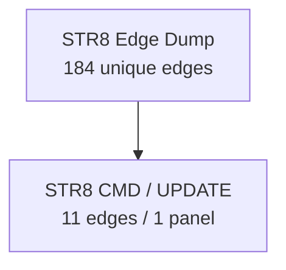

### Family Detail

#### ENTRY / unprefixed


#### STR8 / AP


#### STR8 / BOOT

Panel 1 of 2: `STR8_BOOT_INPUT_ARM` through `STR8_BOOT_START`.

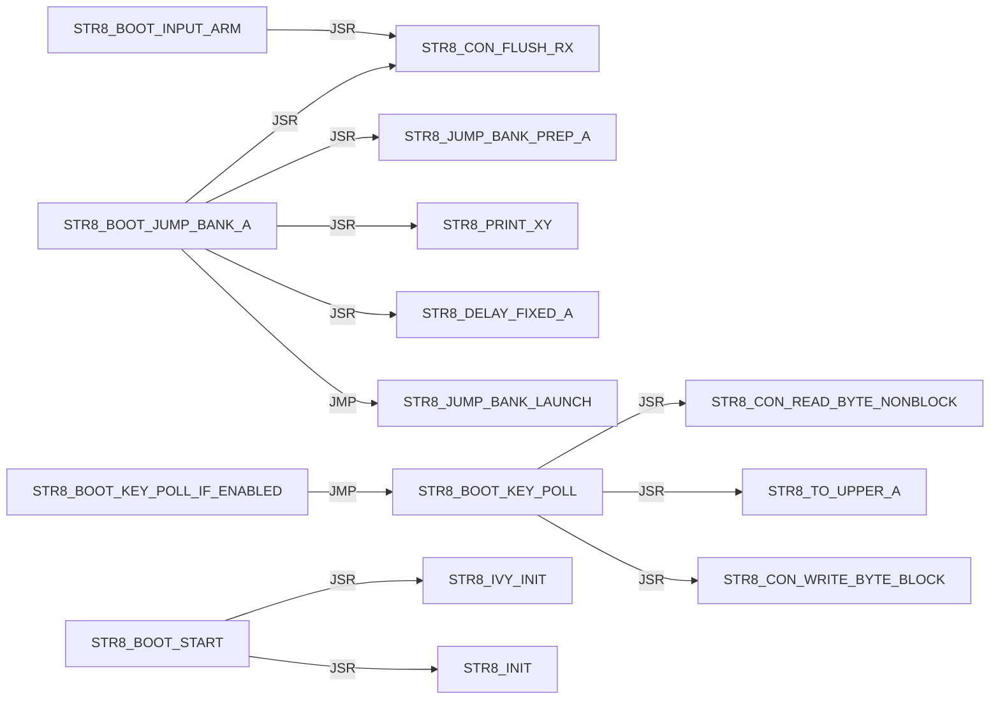

Panel 2 of 2: `STR8_BOOT_START` through `STR8_BOOT_START`.

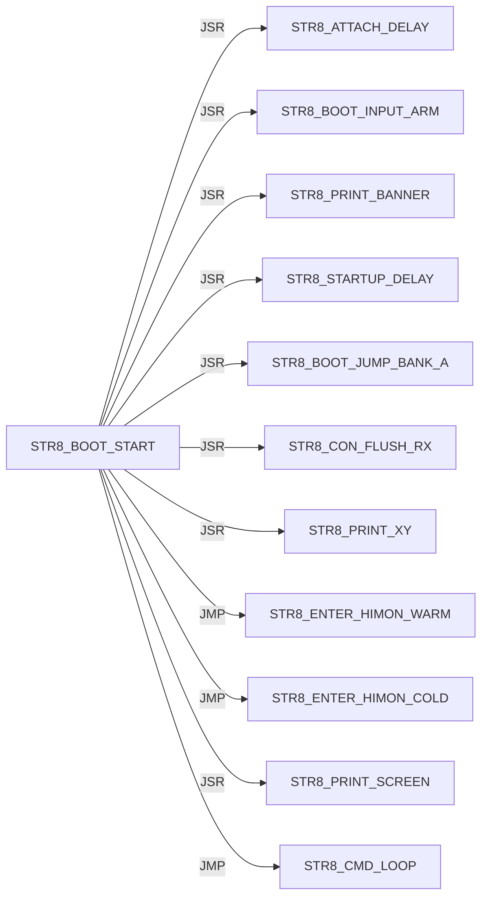

#### STR8 / CON

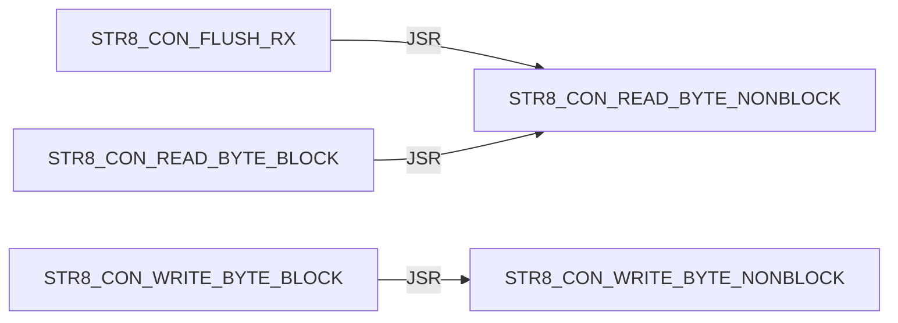

#### STR8 / CONFIRM


#### STR8 / COPY

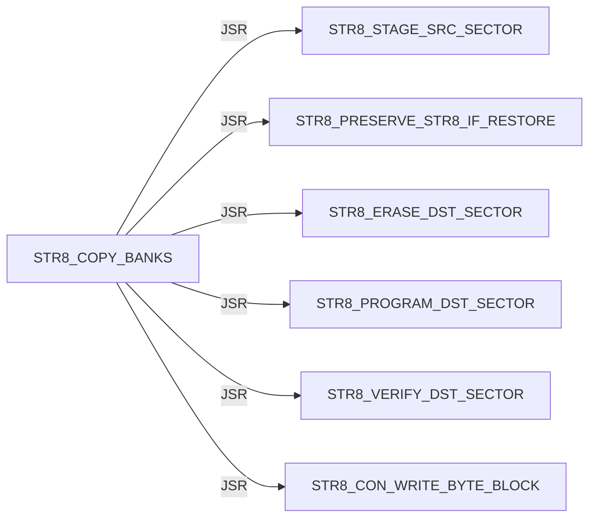

#### STR8 / DELAY


#### STR8 / DISPATCH

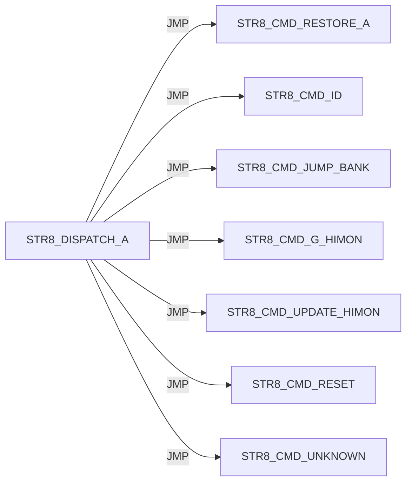

#### STR8 / ENTER

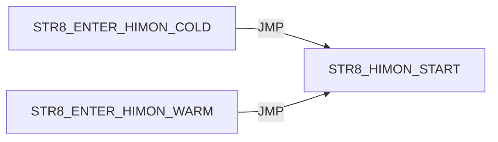

#### STR8 / ERASE

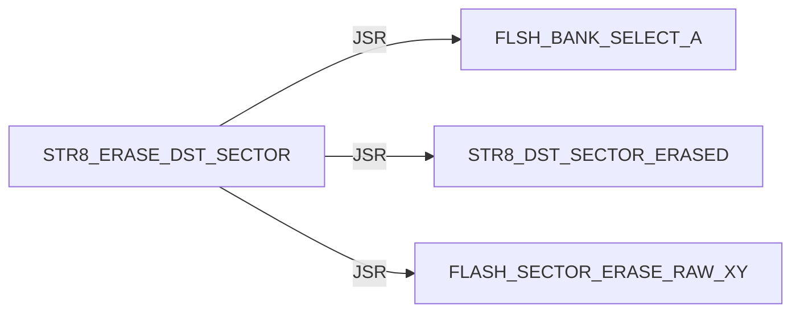

#### STR8 / INIT


#### STR8 / IVY

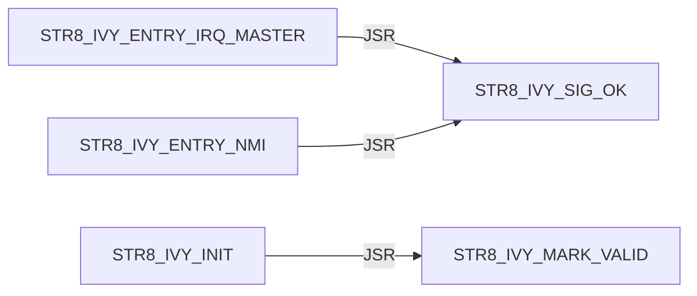

#### STR8 / JUMP

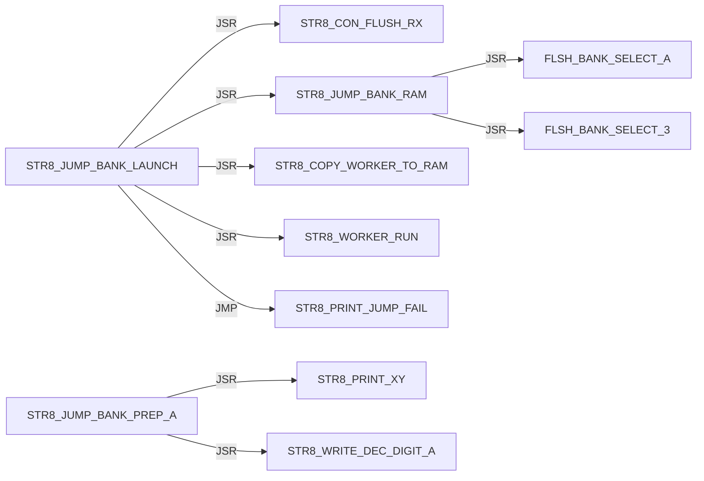

#### STR8 / PRESERVE


#### STR8 / PRINT

Panel 1 of 2: `STR8_PRINT_BANNER` through `STR8_PRINT_JUMP_FAIL`.

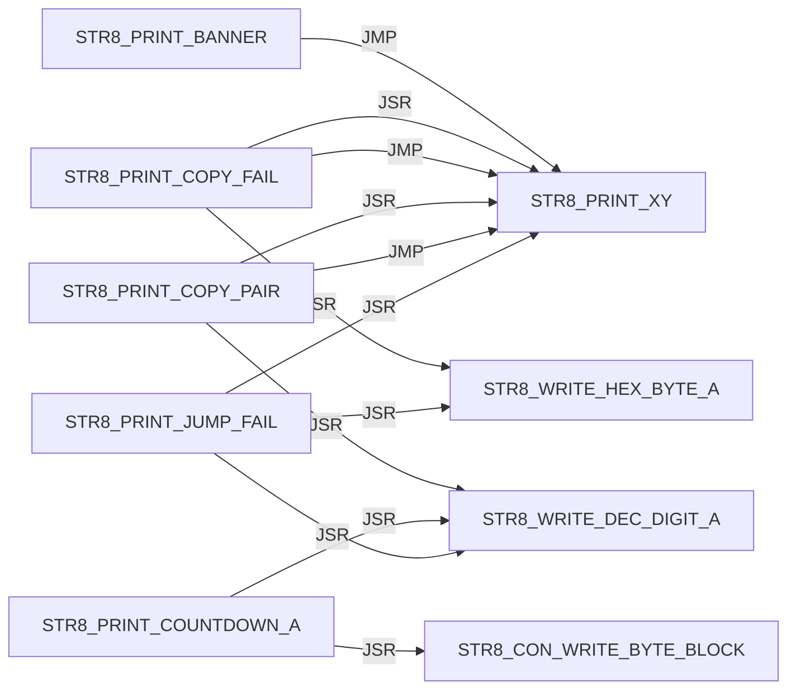

Panel 2 of 2: `STR8_PRINT_JUMP_FAIL` through `STR8_PRINT_XY`.

```mermaid
flowchart LR
    N0["STR8_PRINT_JUMP_FAIL"] -->|JMP| N1["STR8_PRINT_XY"]
    N2["STR8_PRINT_PROMPT"] -->|JMP| N1["STR8_PRINT_XY"]
    N3["STR8_PRINT_SCREEN"] -->|JSR| N1["STR8_PRINT_XY"]
    N3["STR8_PRINT_SCREEN"] -->|JMP| N1["STR8_PRINT_XY"]
    N1["STR8_PRINT_XY"] -->|JSR| N4["STR8_CON_WRITE_BYTE_BLOCK"]
    N1["STR8_PRINT_XY"] -->|JMP| N4["STR8_CON_WRITE_BYTE_BLOCK"]
```

#### STR8 / PROGRAM

```mermaid
flowchart LR
    N0["STR8_PROGRAM_DST_SECTOR"] -->|JSR| N1["FLSH_BANK_SELECT_A"]
    N0["STR8_PROGRAM_DST_SECTOR"] -->|JSR| N2["FLASH_WRITE_BYTE_RAW_AXY"]
    N3["STR8_PROGRAM_HIMON_SECTOR_AX"] -->|JSR| N4["STR8_COPY_WORKER_TO_RAM"]
    N3["STR8_PROGRAM_HIMON_SECTOR_AX"] -->|JSR| N5["STR8_WORKER_RUN"]
    N3["STR8_PROGRAM_HIMON_SECTOR_AX"] -->|JSR| N6["STR8_CON_WRITE_BYTE_BLOCK"]
    N7["STR8_PROGRAM_HIMON_UPDATE"] -->|JSR| N3["STR8_PROGRAM_HIMON_SECTOR_AX"]
```

#### STR8 / READ

```mermaid
flowchart LR
    N0["STR8_READ_COMMAND"] -->|JSR| N1["STR8_CON_READ_BYTE_BLOCK"]
    N0["STR8_READ_COMMAND"] -->|JSR| N2["STR8_TO_UPPER_A"]
    N0["STR8_READ_COMMAND"] -->|JSR| N3["STR8_CON_WRITE_BYTE_BLOCK"]
    N4["STR8_READ_HIMON_S19"] -->|JSR| N5["STR8_RECORD_SERVICE_BODY"]
    N4["STR8_READ_HIMON_S19"] -->|JSR| N6["STR8_STAGE_HIMON_RECORD"]
    N4["STR8_READ_HIMON_S19"] -->|JSR| N3["STR8_CON_WRITE_BYTE_BLOCK"]
```

#### STR8 / REC

Panel 1 of 3: `STR8_REC_APPLY_LF` through `STR8_REC_PARSE`.

```mermaid
flowchart LR
    N0["STR8_REC_APPLY_LF"] -->|JSR| N1["STR8_REC_CLEAR_FAILURE"]
    N0["STR8_REC_APPLY_LF"] -->|JMP| N2["STR8_REC_FAIL_A"]
    N0["STR8_REC_APPLY_LF"] -->|JMP| N3["STR8_REC_RETURN_OK"]
    N0["STR8_REC_APPLY_LF"] -->|JSR| N4["STR8_REC_LOAD_APPLY_POINTERS"]
    N0["STR8_REC_APPLY_LF"] -->|JSR| N5["STR8_REC_CAPTURE_APPLY_FAILURE"]
    N0["STR8_REC_APPLY_LF"] -->|JSR| N6["STR8_REC_ADVANCE_APPLY_POINTERS"]
    N0["STR8_REC_APPLY_LF"] -->|JSR| N7["STR8_COPY_WORKER_TO_RAM"]
    N0["STR8_REC_APPLY_LF"] -->|JSR| N8["STR8_WORKER_RUN"]
    N9["STR8_REC_FAIL_READ_X"] -->|JMP| N10["STR8_REC_RETURN_CURRENT_FAIL"]
    N9["STR8_REC_FAIL_READ_X"] -->|JMP| N2["STR8_REC_FAIL_A"]
    N11["STR8_REC_PARSE"] -->|JSR| N12["STR8_REC_CLEAR_RESULT"]
    N11["STR8_REC_PARSE"] -->|JMP| N2["STR8_REC_FAIL_A"]
```

Panel 2 of 3: `STR8_REC_PARSE` through `STR8_REC_READ_HEX_BYTE`.

```mermaid
flowchart LR
    N0["STR8_REC_PARSE"] -->|JSR| N1["STR8_REC_READ_CHAR"]
    N0["STR8_REC_PARSE"] -->|JMP| N2["STR8_REC_FAIL_READ_START"]
    N0["STR8_REC_PARSE"] -->|JMP| N3["STR8_REC_FAIL_READ_TYPE"]
    N4["STR8_REC_PARSE_BODY"] -->|JSR| N5["STR8_REC_READ_SUM_BYTE"]
    N4["STR8_REC_PARSE_BODY"] -->|JMP| N6["STR8_REC_FAIL_READ_HEX"]
    N4["STR8_REC_PARSE_BODY"] -->|JMP| N7["STR8_REC_FAIL_A"]
    N4["STR8_REC_PARSE_BODY"] -->|JSR| N1["STR8_REC_READ_CHAR"]
    N4["STR8_REC_PARSE_BODY"] -->|JMP| N8["STR8_REC_FAIL_READ_END"]
    N4["STR8_REC_PARSE_BODY"] -->|JMP| N9["STR8_REC_RETURN_OK"]
    N1["STR8_REC_READ_CHAR"] -->|JSR| N10["STR8_CON_READ_BYTE_BLOCK"]
    N11["STR8_REC_READ_HEX_BYTE"] -->|JSR| N1["STR8_REC_READ_CHAR"]
    N11["STR8_REC_READ_HEX_BYTE"] -->|JSR| N12["STR8_REC_HEX_ASCII_TO_NIBBLE"]
```

Panel 3 of 3: `STR8_REC_READ_SUM_BYTE` through `STR8_REC_READ_SUM_BYTE`.

```mermaid
flowchart LR
    N0["STR8_REC_READ_SUM_BYTE"] -->|JSR| N1["STR8_REC_READ_HEX_BYTE"]
```

#### STR8 / RECORD

```mermaid
flowchart LR
    N0["STR8_RECORD_SERVICE_BODY"] -->|JMP| N1["STR8_REC_APPLY_LF"]
    N0["STR8_RECORD_SERVICE_BODY"] -->|JMP| N2["STR8_REC_FAIL_A"]
    N3["STR8_RECORD_SERVICE_ENTRY"] -->|JMP| N0["STR8_RECORD_SERVICE_BODY"]
```

#### STR8 / RUN

```mermaid
flowchart LR
    N0["STR8_RUN_COPY"] -->|JSR| N1["STR8_PRINT_COPY_PAIR"]
    N0["STR8_RUN_COPY"] -->|JSR| N2["STR8_COPY_BANKS"]
    N0["STR8_RUN_COPY"] -->|JSR| N3["STR8_COPY_WORKER_TO_RAM"]
    N0["STR8_RUN_COPY"] -->|JSR| N4["STR8_WORKER_RUN"]
    N5["STR8_RUN_WORKER_SERVICE"] -->|JMP| N6["STR8_RUN_WORKER_SERVICE_BODY"]
    N6["STR8_RUN_WORKER_SERVICE_BODY"] -->|JSR| N3["STR8_COPY_WORKER_TO_RAM"]
    N6["STR8_RUN_WORKER_SERVICE_BODY"] -->|JSR| N4["STR8_WORKER_RUN"]
```

#### STR8 / SELECT

```mermaid
flowchart LR
    N0["STR8_SELECT_BANK_3"] -->|JSR| N1["FLSH_BANK_SELECT_3"]
```

#### STR8 / STAGE

```mermaid
flowchart LR
    N0["STR8_STAGE_B3_PROTECTED"] -->|JSR| N1["STR8_SELECT_BANK_3"]
    N2["STR8_STAGE_SRC_SECTOR"] -->|JSR| N3["FLSH_BANK_SELECT_A"]
```

#### STR8 / STARTUP

```mermaid
flowchart LR
    N0["STR8_STARTUP_DELAY"] -->|JSR| N1["STR8_PRINT_XY"]
    N0["STR8_STARTUP_DELAY"] -->|JSR| N2["STR8_BOOT_KEY_POLL_IF_ENABLED"]
    N0["STR8_STARTUP_DELAY"] -->|JSR| N3["STR8_PRINT_COUNTDOWN_A"]
    N0["STR8_STARTUP_DELAY"] -->|JSR| N4["STR8_DELAY_COUNTDOWN_TICK_A"]
```

#### STR8 / VERIFY

```mermaid
flowchart LR
    N0["STR8_VERIFY_DST_SECTOR"] -->|JSR| N1["FLSH_BANK_SELECT_A"]
```

#### STR8 / WRITE

```mermaid
flowchart LR
    N0["STR8_WRITE_DEC_DIGIT_A"] -->|JMP| N1["STR8_CON_WRITE_BYTE_BLOCK"]
    N2["STR8_WRITE_HEX_BYTE_A"] -->|JSR| N3["STR8_WRITE_HEX_NIBBLE_A"]
    N3["STR8_WRITE_HEX_NIBBLE_A"] -->|JMP| N1["STR8_CON_WRITE_BYTE_BLOCK"]
```

#### STR8 CMD / ABORT

```mermaid
flowchart LR
    N0["STR8_CMD_ABORT"] -->|JSR| N1["STR8_SELECT_BANK_3"]
    N0["STR8_CMD_ABORT"] -->|JMP| N2["STR8_PRINT_XY"]
```

#### STR8 CMD / BACKUP

```mermaid
flowchart LR
    N0["STR8_CMD_BACKUP"] -->|JSR| N1["STR8_PRINT_XY"]
    N0["STR8_CMD_BACKUP"] -->|JSR| N2["STR8_READ_COMMAND"]
    N0["STR8_CMD_BACKUP"] -->|JSR| N3["STR8_CONFIRM_Y"]
    N0["STR8_CMD_BACKUP"] -->|JSR| N4["STR8_RUN_COPY"]
    N0["STR8_CMD_BACKUP"] -->|JMP| N5["STR8_CMD_OK"]
    N0["STR8_CMD_BACKUP"] -->|JMP| N6["STR8_CMD_ABORT"]
    N0["STR8_CMD_BACKUP"] -->|JMP| N7["STR8_CMD_COPY_FAIL"]
```

#### STR8 CMD / COPY

```mermaid
flowchart LR
    N0["STR8_CMD_COPY_FAIL"] -->|JSR| N1["STR8_SELECT_BANK_3"]
    N0["STR8_CMD_COPY_FAIL"] -->|JMP| N2["STR8_PRINT_COPY_FAIL"]
```

#### STR8 CMD / G

```mermaid
flowchart LR
    N0["STR8_CMD_G_HIMON"] -->|JSR| N1["STR8_SELECT_BANK_3"]
    N0["STR8_CMD_G_HIMON"] -->|JSR| N2["STR8_PRINT_XY"]
    N0["STR8_CMD_G_HIMON"] -->|JMP| N3["STR8_ENTER_HIMON_WARM"]
```

#### STR8 CMD / ID

```mermaid
flowchart LR
    N0["STR8_CMD_ID"] -->|JMP| N1["STR8_PRINT_XY"]
```

#### STR8 CMD / JUMP

```mermaid
flowchart LR
    N0["STR8_CMD_JUMP_BANK"] -->|JSR| N1["STR8_READ_COMMAND"]
    N0["STR8_CMD_JUMP_BANK"] -->|JMP| N2["STR8_CMD_ABORT"]
    N0["STR8_CMD_JUMP_BANK"] -->|JSR| N3["STR8_JUMP_BANK_PREP_A"]
    N0["STR8_CMD_JUMP_BANK"] -->|JMP| N4["STR8_JUMP_BANK_LAUNCH"]
    N0["STR8_CMD_JUMP_BANK"] -->|JMP| N5["STR8_CMD_UNKNOWN"]
```

#### STR8 CMD / LOOP

```mermaid
flowchart LR
    N0["STR8_CMD_LOOP"] -->|JSR| N1["STR8_PRINT_PROMPT"]
    N0["STR8_CMD_LOOP"] -->|JSR| N2["STR8_READ_COMMAND"]
    N0["STR8_CMD_LOOP"] -->|JSR| N3["STR8_CMD_ABORT"]
    N0["STR8_CMD_LOOP"] -->|JSR| N4["STR8_DISPATCH_A"]
```

#### STR8 CMD / OK

```mermaid
flowchart LR
    N0["STR8_CMD_OK"] -->|JSR| N1["STR8_SELECT_BANK_3"]
    N0["STR8_CMD_OK"] -->|JMP| N2["STR8_PRINT_XY"]
```

#### STR8 CMD / RESET

```mermaid
flowchart LR
    N0["STR8_CMD_RESET"] -->|JSR| N1["STR8_SELECT_BANK_3"]
```

#### STR8 CMD / RESTORE

```mermaid
flowchart LR
    N0["STR8_CMD_RESTORE_A"] -->|JSR| N1["STR8_PRINT_XY"]
    N0["STR8_CMD_RESTORE_A"] -->|JSR| N2["STR8_WRITE_DEC_DIGIT_A"]
    N0["STR8_CMD_RESTORE_A"] -->|JSR| N3["STR8_CONFIRM_Y"]
    N0["STR8_CMD_RESTORE_A"] -->|JMP| N4["STR8_CMD_ABORT"]
    N0["STR8_CMD_RESTORE_A"] -->|JSR| N5["STR8_CON_FLUSH_RX"]
    N0["STR8_CMD_RESTORE_A"] -->|JSR| N6["STR8_RUN_COPY"]
    N0["STR8_CMD_RESTORE_A"] -->|JMP| N7["STR8_CMD_OK"]
```

#### STR8 CMD / UNKNOWN

```mermaid
flowchart LR
    N0["STR8_CMD_UNKNOWN"] -->|JMP| N1["STR8_PRINT_XY"]
```

#### STR8 CMD / UPDATE

```mermaid
flowchart LR
    N0["STR8_CMD_UPDATE_HIMON"] -->|JMP| N1["STR8_PRINT_XY"]
    N0["STR8_CMD_UPDATE_HIMON"] -->|JSR| N1["STR8_PRINT_XY"]
    N0["STR8_CMD_UPDATE_HIMON"] -->|JSR| N2["STR8_CONFIRM_Y"]
    N0["STR8_CMD_UPDATE_HIMON"] -->|JSR| N3["STR8_STAGE_HIMON_BLANK"]
    N0["STR8_CMD_UPDATE_HIMON"] -->|JSR| N4["STR8_UPD_INIT"]
    N0["STR8_CMD_UPDATE_HIMON"] -->|JSR| N5["STR8_READ_HIMON_S19"]
    N0["STR8_CMD_UPDATE_HIMON"] -->|JSR| N6["STR8_PROGRAM_HIMON_UPDATE"]
    N0["STR8_CMD_UPDATE_HIMON"] -->|JMP| N7["STR8_CMD_OK"]
    N8["STR8_CMD_UPDATE_NO_DATA"] -->|JMP| N1["STR8_PRINT_XY"]
    N9["STR8_CMD_UPDATE_S19_FAIL"] -->|JSR| N10["STR8_CON_FLUSH_RX"]
    N9["STR8_CMD_UPDATE_S19_FAIL"] -->|JMP| N1["STR8_PRINT_XY"]
```

## External Targets

These targets are not labels in this source file; most are `XREF` providers from sibling ROM modules.

```text
FLASH_SECTOR_ERASE_RAW_XY
FLASH_WRITE_BYTE_RAW_AXY
FLSH_BANK_SELECT_3
FLSH_BANK_SELECT_A
STR8_HIMON_START
STR8_WORKER_RUN
UTL_DELAY_AXY_8MHZ
```

## Unique Direct Edges By Source Label

Each block is one source label. Indented lines are outgoing direct edges.
Blank lines are source-level breaks; they do not imply call depth.

```text
START
    JMP STR8_BOOT_START

STR8_AP_IMPORT_LINK_SERVICE
    JMP STR8_AP_IMPORT_LINK_SERVICE_BODY

STR8_BOOT_INPUT_ARM
    JSR STR8_CON_FLUSH_RX

STR8_BOOT_JUMP_BANK_A
    JSR STR8_JUMP_BANK_PREP_A
    JSR STR8_CON_FLUSH_RX
    JSR STR8_PRINT_XY
    JSR STR8_DELAY_FIXED_A
    JMP STR8_JUMP_BANK_LAUNCH

STR8_BOOT_KEY_POLL
    JSR STR8_CON_READ_BYTE_NONBLOCK
    JSR STR8_TO_UPPER_A
    JSR STR8_CON_WRITE_BYTE_BLOCK

STR8_BOOT_KEY_POLL_IF_ENABLED
    JMP STR8_BOOT_KEY_POLL

STR8_BOOT_START
    JSR STR8_IVY_INIT
    JSR STR8_INIT
    JSR STR8_ATTACH_DELAY
    JSR STR8_BOOT_INPUT_ARM
    JSR STR8_PRINT_BANNER
    JSR STR8_STARTUP_DELAY
    JSR STR8_BOOT_JUMP_BANK_A
    JSR STR8_CON_FLUSH_RX
    JSR STR8_PRINT_XY
    JMP STR8_ENTER_HIMON_WARM
    JMP STR8_ENTER_HIMON_COLD
    JSR STR8_PRINT_SCREEN
    JMP STR8_CMD_LOOP

STR8_CMD_ABORT
    JSR STR8_SELECT_BANK_3
    JMP STR8_PRINT_XY

STR8_CMD_BACKUP
    JSR STR8_PRINT_XY
    JSR STR8_READ_COMMAND
    JSR STR8_CONFIRM_Y
    JSR STR8_RUN_COPY
    JMP STR8_CMD_OK
    JMP STR8_CMD_ABORT
    JMP STR8_CMD_COPY_FAIL

STR8_CMD_COPY_FAIL
    JSR STR8_SELECT_BANK_3
    JMP STR8_PRINT_COPY_FAIL

STR8_CMD_G_HIMON
    JSR STR8_SELECT_BANK_3
    JSR STR8_PRINT_XY
    JMP STR8_ENTER_HIMON_WARM

STR8_CMD_ID
    JMP STR8_PRINT_XY

STR8_CMD_JUMP_BANK
    JSR STR8_READ_COMMAND
    JMP STR8_CMD_ABORT
    JSR STR8_JUMP_BANK_PREP_A
    JMP STR8_JUMP_BANK_LAUNCH
    JMP STR8_CMD_UNKNOWN

STR8_CMD_LOOP
    JSR STR8_PRINT_PROMPT
    JSR STR8_READ_COMMAND
    JSR STR8_CMD_ABORT
    JSR STR8_DISPATCH_A

STR8_CMD_OK
    JSR STR8_SELECT_BANK_3
    JMP STR8_PRINT_XY

STR8_CMD_RESET
    JSR STR8_SELECT_BANK_3

STR8_CMD_RESTORE_A
    JSR STR8_PRINT_XY
    JSR STR8_WRITE_DEC_DIGIT_A
    JSR STR8_CONFIRM_Y
    JMP STR8_CMD_ABORT
    JSR STR8_CON_FLUSH_RX
    JSR STR8_RUN_COPY
    JMP STR8_CMD_OK

STR8_CMD_UNKNOWN
    JMP STR8_PRINT_XY

STR8_CMD_UPDATE_HIMON
    JMP STR8_PRINT_XY
    JSR STR8_PRINT_XY
    JSR STR8_CONFIRM_Y
    JSR STR8_STAGE_HIMON_BLANK
    JSR STR8_UPD_INIT
    JSR STR8_READ_HIMON_S19
    JSR STR8_PROGRAM_HIMON_UPDATE
    JMP STR8_CMD_OK

STR8_CMD_UPDATE_NO_DATA
    JMP STR8_PRINT_XY

STR8_CMD_UPDATE_S19_FAIL
    JSR STR8_CON_FLUSH_RX
    JMP STR8_PRINT_XY

STR8_CON_FLUSH_RX
    JSR STR8_CON_READ_BYTE_NONBLOCK

STR8_CON_READ_BYTE_BLOCK
    JSR STR8_CON_READ_BYTE_NONBLOCK

STR8_CON_WRITE_BYTE_BLOCK
    JSR STR8_CON_WRITE_BYTE_NONBLOCK

STR8_CONFIRM_Y
    JSR STR8_READ_COMMAND

STR8_COPY_BANKS
    JSR STR8_STAGE_SRC_SECTOR
    JSR STR8_PRESERVE_STR8_IF_RESTORE
    JSR STR8_ERASE_DST_SECTOR
    JSR STR8_PROGRAM_DST_SECTOR
    JSR STR8_VERIFY_DST_SECTOR
    JSR STR8_CON_WRITE_BYTE_BLOCK

STR8_DELAY_FIXED_A
    JMP UTL_DELAY_AXY_8MHZ

STR8_DISPATCH_A
    JMP STR8_CMD_RESTORE_A
    JMP STR8_CMD_ID
    JMP STR8_CMD_JUMP_BANK
    JMP STR8_CMD_G_HIMON
    JMP STR8_CMD_UPDATE_HIMON
    JMP STR8_CMD_RESET
    JMP STR8_CMD_UNKNOWN

STR8_ENTER_HIMON_COLD
    JMP STR8_HIMON_START

STR8_ENTER_HIMON_WARM
    JMP STR8_HIMON_START

STR8_ERASE_DST_SECTOR
    JSR FLSH_BANK_SELECT_A
    JSR STR8_DST_SECTOR_ERASED
    JSR FLASH_SECTOR_ERASE_RAW_XY

STR8_INIT
    JSR STR8_CON_INIT

STR8_IVY_ENTRY_IRQ_MASTER
    JSR STR8_IVY_SIG_OK

STR8_IVY_ENTRY_NMI
    JSR STR8_IVY_SIG_OK

STR8_IVY_INIT
    JSR STR8_IVY_MARK_VALID

STR8_JUMP_BANK_LAUNCH
    JSR STR8_CON_FLUSH_RX
    JSR STR8_JUMP_BANK_RAM
    JSR STR8_COPY_WORKER_TO_RAM
    JSR STR8_WORKER_RUN
    JMP STR8_PRINT_JUMP_FAIL

STR8_JUMP_BANK_PREP_A
    JSR STR8_PRINT_XY
    JSR STR8_WRITE_DEC_DIGIT_A

STR8_JUMP_BANK_RAM
    JSR FLSH_BANK_SELECT_A
    JSR FLSH_BANK_SELECT_3

STR8_PRESERVE_STR8_IF_RESTORE
    JSR STR8_STAGE_B3_PROTECTED

STR8_PRINT_BANNER
    JMP STR8_PRINT_XY

STR8_PRINT_COPY_FAIL
    JSR STR8_PRINT_XY
    JSR STR8_WRITE_HEX_BYTE_A
    JMP STR8_PRINT_XY

STR8_PRINT_COPY_PAIR
    JSR STR8_PRINT_XY
    JSR STR8_WRITE_DEC_DIGIT_A
    JMP STR8_PRINT_XY

STR8_PRINT_COUNTDOWN_A
    JSR STR8_WRITE_DEC_DIGIT_A
    JSR STR8_CON_WRITE_BYTE_BLOCK

STR8_PRINT_JUMP_FAIL
    JSR STR8_PRINT_XY
    JSR STR8_WRITE_DEC_DIGIT_A
    JSR STR8_WRITE_HEX_BYTE_A
    JMP STR8_PRINT_XY

STR8_PRINT_PROMPT
    JMP STR8_PRINT_XY

STR8_PRINT_SCREEN
    JSR STR8_PRINT_XY
    JMP STR8_PRINT_XY

STR8_PRINT_XY
    JSR STR8_CON_WRITE_BYTE_BLOCK
    JMP STR8_CON_WRITE_BYTE_BLOCK

STR8_PROGRAM_DST_SECTOR
    JSR FLSH_BANK_SELECT_A
    JSR FLASH_WRITE_BYTE_RAW_AXY

STR8_PROGRAM_HIMON_SECTOR_AX
    JSR STR8_COPY_WORKER_TO_RAM
    JSR STR8_WORKER_RUN
    JSR STR8_CON_WRITE_BYTE_BLOCK

STR8_PROGRAM_HIMON_UPDATE
    JSR STR8_PROGRAM_HIMON_SECTOR_AX

STR8_READ_COMMAND
    JSR STR8_CON_READ_BYTE_BLOCK
    JSR STR8_TO_UPPER_A
    JSR STR8_CON_WRITE_BYTE_BLOCK

STR8_READ_HIMON_S19
    JSR STR8_RECORD_SERVICE_BODY
    JSR STR8_STAGE_HIMON_RECORD
    JSR STR8_CON_WRITE_BYTE_BLOCK

STR8_REC_APPLY_LF
    JSR STR8_REC_CLEAR_FAILURE
    JMP STR8_REC_FAIL_A
    JMP STR8_REC_RETURN_OK
    JSR STR8_REC_LOAD_APPLY_POINTERS
    JSR STR8_REC_CAPTURE_APPLY_FAILURE
    JSR STR8_REC_ADVANCE_APPLY_POINTERS
    JSR STR8_COPY_WORKER_TO_RAM
    JSR STR8_WORKER_RUN

STR8_REC_FAIL_READ_X
    JMP STR8_REC_RETURN_CURRENT_FAIL
    JMP STR8_REC_FAIL_A

STR8_REC_PARSE
    JSR STR8_REC_CLEAR_RESULT
    JMP STR8_REC_FAIL_A
    JSR STR8_REC_READ_CHAR
    JMP STR8_REC_FAIL_READ_START
    JMP STR8_REC_FAIL_READ_TYPE

STR8_REC_PARSE_BODY
    JSR STR8_REC_READ_SUM_BYTE
    JMP STR8_REC_FAIL_READ_HEX
    JMP STR8_REC_FAIL_A
    JSR STR8_REC_READ_CHAR
    JMP STR8_REC_FAIL_READ_END
    JMP STR8_REC_RETURN_OK

STR8_REC_READ_CHAR
    JSR STR8_CON_READ_BYTE_BLOCK

STR8_REC_READ_HEX_BYTE
    JSR STR8_REC_READ_CHAR
    JSR STR8_REC_HEX_ASCII_TO_NIBBLE

STR8_REC_READ_SUM_BYTE
    JSR STR8_REC_READ_HEX_BYTE

STR8_RECORD_SERVICE_BODY
    JMP STR8_REC_APPLY_LF
    JMP STR8_REC_FAIL_A

STR8_RECORD_SERVICE_ENTRY
    JMP STR8_RECORD_SERVICE_BODY

STR8_RUN_COPY
    JSR STR8_PRINT_COPY_PAIR
    JSR STR8_COPY_BANKS
    JSR STR8_COPY_WORKER_TO_RAM
    JSR STR8_WORKER_RUN

STR8_RUN_WORKER_SERVICE
    JMP STR8_RUN_WORKER_SERVICE_BODY

STR8_RUN_WORKER_SERVICE_BODY
    JSR STR8_COPY_WORKER_TO_RAM
    JSR STR8_WORKER_RUN

STR8_SELECT_BANK_3
    JSR FLSH_BANK_SELECT_3

STR8_STAGE_B3_PROTECTED
    JSR STR8_SELECT_BANK_3

STR8_STAGE_SRC_SECTOR
    JSR FLSH_BANK_SELECT_A

STR8_STARTUP_DELAY
    JSR STR8_PRINT_XY
    JSR STR8_BOOT_KEY_POLL_IF_ENABLED
    JSR STR8_PRINT_COUNTDOWN_A
    JSR STR8_DELAY_COUNTDOWN_TICK_A

STR8_VERIFY_DST_SECTOR
    JSR FLSH_BANK_SELECT_A

STR8_WRITE_DEC_DIGIT_A
    JMP STR8_CON_WRITE_BYTE_BLOCK

STR8_WRITE_HEX_BYTE_A
    JSR STR8_WRITE_HEX_NIBBLE_A

STR8_WRITE_HEX_NIBBLE_A
    JMP STR8_CON_WRITE_BYTE_BLOCK

```

## Raw Direct Edge Sites By Source Label

Each line is a direct call/jump site with source line number.

```text
START
      154  JMP STR8_BOOT_START

STR8_AP_IMPORT_LINK_SERVICE
      162  JMP STR8_AP_IMPORT_LINK_SERVICE_BODY

STR8_BOOT_INPUT_ARM
      226  JSR STR8_CON_FLUSH_RX

STR8_BOOT_JUMP_BANK_A
      703  JSR STR8_JUMP_BANK_PREP_A
      704  JSR STR8_CON_FLUSH_RX
      707  JSR STR8_PRINT_XY
      709  JSR STR8_DELAY_FIXED_A
      710  JMP STR8_JUMP_BANK_LAUNCH

STR8_BOOT_KEY_POLL
      416  JSR STR8_CON_READ_BYTE_NONBLOCK
      418  JSR STR8_TO_UPPER_A
      419  JSR STR8_CON_WRITE_BYTE_BLOCK

STR8_BOOT_KEY_POLL_IF_ENABLED
      391  JMP STR8_BOOT_KEY_POLL

STR8_BOOT_START
      180  JSR STR8_IVY_INIT
      181  JSR STR8_INIT
      184  JSR STR8_ATTACH_DELAY
      185  JSR STR8_BOOT_INPUT_ARM
      186  JSR STR8_PRINT_BANNER
      187  JSR STR8_STARTUP_DELAY
      194  JSR STR8_BOOT_JUMP_BANK_A
      196  JSR STR8_CON_FLUSH_RX
      199  JSR STR8_PRINT_XY
      200  JMP STR8_ENTER_HIMON_WARM
      204  JSR STR8_PRINT_XY
      205  JMP STR8_ENTER_HIMON_COLD
      206  JSR STR8_CON_FLUSH_RX
      210  JSR STR8_PRINT_SCREEN
      211  JMP STR8_CMD_LOOP

STR8_CMD_ABORT
      683  JSR STR8_SELECT_BANK_3
      687  JMP STR8_PRINT_XY

STR8_CMD_BACKUP
      554  JSR STR8_PRINT_XY
      555  JSR STR8_READ_COMMAND
      567  JSR STR8_PRINT_XY
      568  JSR STR8_CONFIRM_Y
      570  JSR STR8_RUN_COPY
      572  JMP STR8_CMD_OK
      574  JMP STR8_CMD_ABORT
      576  JMP STR8_CMD_COPY_FAIL

STR8_CMD_COPY_FAIL
      691  JSR STR8_SELECT_BANK_3
      693  JMP STR8_PRINT_COPY_FAIL

STR8_CMD_G_HIMON
      655  JSR STR8_SELECT_BANK_3
      658  JSR STR8_PRINT_XY
      659  JMP STR8_ENTER_HIMON_WARM
      663  JSR STR8_PRINT_XY
      664  JMP STR8_ENTER_HIMON_WARM

STR8_CMD_ID
      528  JMP STR8_PRINT_XY

STR8_CMD_JUMP_BANK
      534  JSR STR8_READ_COMMAND
      537  JMP STR8_CMD_ABORT
      546  JSR STR8_JUMP_BANK_PREP_A
      547  JMP STR8_JUMP_BANK_LAUNCH
      549  JMP STR8_CMD_UNKNOWN

STR8_CMD_LOOP
      443  JSR STR8_PRINT_PROMPT
      444  JSR STR8_READ_COMMAND
      447  JSR STR8_CMD_ABORT
      450  JSR STR8_DISPATCH_A

STR8_CMD_OK
      675  JSR STR8_SELECT_BANK_3
      679  JMP STR8_PRINT_XY

STR8_CMD_RESET
      669  JSR STR8_SELECT_BANK_3

STR8_CMD_RESTORE_A
      584  JSR STR8_PRINT_XY
      586  JSR STR8_WRITE_DEC_DIGIT_A
      589  JSR STR8_PRINT_XY
      590  JSR STR8_CONFIRM_Y
      592  JMP STR8_CMD_ABORT
      594  JSR STR8_CON_FLUSH_RX
      597  JSR STR8_PRINT_XY
      598  JSR STR8_CONFIRM_Y
      606  JSR STR8_RUN_COPY
      608  JMP STR8_CMD_OK

STR8_CMD_UNKNOWN
      698  JMP STR8_PRINT_XY

STR8_CMD_UPDATE_HIMON
      615  JMP STR8_PRINT_XY
      619  JSR STR8_PRINT_XY
      620  JSR STR8_CONFIRM_Y
      622  JSR STR8_STAGE_HIMON_BLANK
      623  JSR STR8_UPD_INIT
      626  JSR STR8_PRINT_XY
      627  JSR STR8_READ_HIMON_S19
      633  JSR STR8_PRINT_XY
      634  JSR STR8_CONFIRM_Y
      636  JSR STR8_PROGRAM_HIMON_UPDATE
      638  JMP STR8_CMD_OK

STR8_CMD_UPDATE_NO_DATA
      650  JMP STR8_PRINT_XY

STR8_CMD_UPDATE_S19_FAIL
      642  JSR STR8_CON_FLUSH_RX
      645  JMP STR8_PRINT_XY

STR8_CON_FLUSH_RX
     1793  JSR STR8_CON_READ_BYTE_NONBLOCK

STR8_CON_READ_BYTE_BLOCK
     1807  JSR STR8_CON_READ_BYTE_NONBLOCK

STR8_CON_WRITE_BYTE_BLOCK
     1833  JSR STR8_CON_WRITE_BYTE_NONBLOCK

STR8_CONFIRM_Y
     1440  JSR STR8_READ_COMMAND

STR8_COPY_BANKS
     1255  JSR STR8_STAGE_SRC_SECTOR
     1256  JSR STR8_PRESERVE_STR8_IF_RESTORE
     1257  JSR STR8_ERASE_DST_SECTOR
     1259  JSR STR8_PROGRAM_DST_SECTOR
     1261  JSR STR8_VERIFY_DST_SECTOR
     1264  JSR STR8_CON_WRITE_BYTE_BLOCK

STR8_DELAY_FIXED_A
      350  JMP UTL_DELAY_AXY_8MHZ

STR8_DISPATCH_A
      498  JMP STR8_CMD_RESTORE_A
      502  JMP STR8_CMD_ID
      509  JMP STR8_CMD_JUMP_BANK
      513  JMP STR8_CMD_G_HIMON
      517  JMP STR8_CMD_UPDATE_HIMON
      521  JMP STR8_CMD_RESET
      523  JMP STR8_CMD_UNKNOWN

STR8_ENTER_HIMON_COLD
      330  JMP STR8_HIMON_START

STR8_ENTER_HIMON_WARM
      341  JMP STR8_HIMON_START

STR8_ERASE_DST_SECTOR
     1330  JSR FLSH_BANK_SELECT_A
     1331  JSR STR8_DST_SECTOR_ERASED
     1335  JSR FLASH_SECTOR_ERASE_RAW_XY
     1337  JSR STR8_DST_SECTOR_ERASED

STR8_INIT
      220  JSR STR8_CON_INIT

STR8_IVY_ENTRY_IRQ_MASTER
      302  JSR STR8_IVY_SIG_OK
      313  JSR STR8_IVY_SIG_OK

STR8_IVY_ENTRY_NMI
      285  JSR STR8_IVY_SIG_OK

STR8_IVY_INIT
      256  JSR STR8_IVY_MARK_VALID

STR8_JUMP_BANK_LAUNCH
      729  JSR STR8_CON_FLUSH_RX
      733  JSR STR8_JUMP_BANK_RAM
      735  JSR STR8_COPY_WORKER_TO_RAM
      736  JSR STR8_WORKER_RUN
      738  JMP STR8_PRINT_JUMP_FAIL

STR8_JUMP_BANK_PREP_A
      720  JSR STR8_PRINT_XY
      722  JSR STR8_WRITE_DEC_DIGIT_A
      725  JSR STR8_PRINT_XY

STR8_JUMP_BANK_RAM
     1715  JSR FLSH_BANK_SELECT_A
     1752  JSR FLSH_BANK_SELECT_3

STR8_PRESERVE_STR8_IF_RESTORE
     1304  JSR STR8_STAGE_B3_PROTECTED

STR8_PRINT_BANNER
      355  JMP STR8_PRINT_XY

STR8_PRINT_COPY_FAIL
     1650  JSR STR8_PRINT_XY
     1652  JSR STR8_WRITE_HEX_BYTE_A
     1654  JSR STR8_WRITE_HEX_BYTE_A
     1657  JMP STR8_PRINT_XY
     1661  JMP STR8_PRINT_XY

STR8_PRINT_COPY_PAIR
     1450  JSR STR8_PRINT_XY
     1452  JSR STR8_WRITE_DEC_DIGIT_A
     1455  JSR STR8_PRINT_XY
     1457  JSR STR8_WRITE_DEC_DIGIT_A
     1460  JMP STR8_PRINT_XY

STR8_PRINT_COUNTDOWN_A
      397  JSR STR8_WRITE_DEC_DIGIT_A
      402  JSR STR8_CON_WRITE_BYTE_BLOCK

STR8_PRINT_JUMP_FAIL
     1667  JSR STR8_PRINT_XY
     1669  JSR STR8_WRITE_DEC_DIGIT_A
     1672  JSR STR8_PRINT_XY
     1674  JSR STR8_WRITE_HEX_BYTE_A
     1676  JSR STR8_WRITE_HEX_BYTE_A
     1679  JMP STR8_PRINT_XY

STR8_PRINT_PROMPT
     1764  JMP STR8_PRINT_XY

STR8_PRINT_SCREEN
      437  JSR STR8_PRINT_XY
      440  JMP STR8_PRINT_XY

STR8_PRINT_XY
     1772  JSR STR8_CON_WRITE_BYTE_BLOCK
     1778  JMP STR8_CON_WRITE_BYTE_BLOCK

STR8_PROGRAM_DST_SECTOR
     1373  JSR FLSH_BANK_SELECT_A
     1390  JSR FLASH_WRITE_BYTE_RAW_AXY

STR8_PROGRAM_HIMON_SECTOR_AX
     1634  JSR STR8_COPY_WORKER_TO_RAM
     1635  JSR STR8_WORKER_RUN
     1638  JSR STR8_CON_WRITE_BYTE_BLOCK

STR8_PROGRAM_HIMON_UPDATE
     1611  JSR STR8_PROGRAM_HIMON_SECTOR_AX
     1615  JSR STR8_PROGRAM_HIMON_SECTOR_AX
     1619  JSR STR8_PROGRAM_HIMON_SECTOR_AX

STR8_READ_COMMAND
      458  JSR STR8_CON_READ_BYTE_BLOCK
      473  JSR STR8_TO_UPPER_A
      474  JSR STR8_CON_WRITE_BYTE_BLOCK

STR8_READ_HIMON_S19
     1536  JSR STR8_RECORD_SERVICE_BODY
     1547  JSR STR8_STAGE_HIMON_RECORD
     1550  JSR STR8_CON_WRITE_BYTE_BLOCK

STR8_REC_APPLY_LF
      978  JSR STR8_REC_CLEAR_FAILURE
      983  JMP STR8_REC_FAIL_A
      989  JMP STR8_REC_FAIL_A
      994  JMP STR8_REC_FAIL_A
     1004  JMP STR8_REC_FAIL_A
     1010  JMP STR8_REC_FAIL_A
     1014  JMP STR8_REC_RETURN_OK
     1033  JMP STR8_REC_FAIL_A
     1040  JMP STR8_REC_FAIL_A
     1043  JSR STR8_REC_LOAD_APPLY_POINTERS
     1052  JSR STR8_REC_CAPTURE_APPLY_FAILURE
     1054  JMP STR8_REC_FAIL_A
     1056  JSR STR8_REC_ADVANCE_APPLY_POINTERS
     1063  JMP STR8_REC_FAIL_A
     1069  JSR STR8_COPY_WORKER_TO_RAM
     1070  JSR STR8_WORKER_RUN
     1079  JMP STR8_REC_FAIL_A
     1083  JSR STR8_REC_LOAD_APPLY_POINTERS
     1090  JSR STR8_REC_CAPTURE_APPLY_FAILURE
     1092  JMP STR8_REC_FAIL_A
     1094  JSR STR8_REC_ADVANCE_APPLY_POINTERS
     1097  JMP STR8_REC_RETURN_OK

STR8_REC_FAIL_READ_X
      972  JMP STR8_REC_RETURN_CURRENT_FAIL
      975  JMP STR8_REC_FAIL_A

STR8_REC_PARSE
      784  JSR STR8_REC_CLEAR_RESULT
      789  JMP STR8_REC_FAIL_A
      795  JMP STR8_REC_FAIL_A
      819  JMP STR8_REC_FAIL_A
      822  JSR STR8_REC_READ_CHAR
      824  JMP STR8_REC_FAIL_READ_START
      832  JSR STR8_REC_READ_CHAR
      834  JMP STR8_REC_FAIL_READ_START
      840  JMP STR8_REC_FAIL_A
      842  JSR STR8_REC_READ_CHAR
      844  JMP STR8_REC_FAIL_READ_TYPE
      854  JMP STR8_REC_FAIL_A

STR8_REC_PARSE_BODY
      858  JSR STR8_REC_READ_SUM_BYTE
      860  JMP STR8_REC_FAIL_READ_HEX
      866  JMP STR8_REC_FAIL_A
      875  JMP STR8_REC_FAIL_A
      877  JSR STR8_REC_READ_SUM_BYTE
      879  JMP STR8_REC_FAIL_READ_HEX
      882  JSR STR8_REC_READ_SUM_BYTE
      884  JMP STR8_REC_FAIL_READ_HEX
      896  JSR STR8_REC_READ_SUM_BYTE
      898  JMP STR8_REC_FAIL_READ_HEX
      905  JSR STR8_REC_READ_SUM_BYTE
      907  JMP STR8_REC_FAIL_READ_HEX
      913  JMP STR8_REC_FAIL_A
      921  JMP STR8_REC_FAIL_A
      923  JSR STR8_REC_READ_CHAR
      925  JMP STR8_REC_FAIL_READ_END
      932  JMP STR8_REC_FAIL_A
      945  JMP STR8_REC_RETURN_OK
      955  JMP STR8_REC_RETURN_OK

STR8_REC_READ_CHAR
     1203  JSR STR8_CON_READ_BYTE_BLOCK

STR8_REC_READ_HEX_BYTE
     1161  JSR STR8_REC_READ_CHAR
     1163  JSR STR8_REC_HEX_ASCII_TO_NIBBLE
     1170  JSR STR8_REC_READ_CHAR
     1172  JSR STR8_REC_HEX_ASCII_TO_NIBBLE

STR8_REC_READ_SUM_BYTE
     1149  JSR STR8_REC_READ_HEX_BYTE

STR8_RECORD_SERVICE_BODY
      778  JMP STR8_REC_APPLY_LF
      781  JMP STR8_REC_FAIL_A

STR8_RECORD_SERVICE_ENTRY
      165  JMP STR8_RECORD_SERVICE_BODY

STR8_RUN_COPY
      741  JSR STR8_PRINT_COPY_PAIR
      743  JSR STR8_COPY_BANKS
      746  JSR STR8_COPY_WORKER_TO_RAM
      747  JSR STR8_WORKER_RUN

STR8_RUN_WORKER_SERVICE
      159  JMP STR8_RUN_WORKER_SERVICE_BODY

STR8_RUN_WORKER_SERVICE_BODY
      756  JSR STR8_COPY_WORKER_TO_RAM
      757  JSR STR8_WORKER_RUN

STR8_SELECT_BANK_3
     1435  JSR FLSH_BANK_SELECT_3

STR8_STAGE_B3_PROTECTED
     1308  JSR STR8_SELECT_BANK_3

STR8_STAGE_SRC_SECTOR
     1278  JSR FLSH_BANK_SELECT_A

STR8_STARTUP_DELAY
      363  JSR STR8_PRINT_XY
      367  JSR STR8_BOOT_KEY_POLL_IF_ENABLED
      371  JSR STR8_PRINT_COUNTDOWN_A
      374  JSR STR8_DELAY_COUNTDOWN_TICK_A
      375  JSR STR8_BOOT_KEY_POLL_IF_ENABLED

STR8_VERIFY_DST_SECTOR
     1407  JSR FLSH_BANK_SELECT_A

STR8_WRITE_DEC_DIGIT_A
     1685  JMP STR8_CON_WRITE_BYTE_BLOCK

STR8_WRITE_HEX_BYTE_A
     1693  JSR STR8_WRITE_HEX_NIBBLE_A

STR8_WRITE_HEX_NIBBLE_A
     1701  JMP STR8_CON_WRITE_BYTE_BLOCK
     1704  JMP STR8_CON_WRITE_BYTE_BLOCK

```
