# STR8 Edge Dump

Generated-style edge dump for `STR8/str8.asm`.

For the readable subsystem/capability view, see
[STR8.md](STR8.md).

Scope: direct `JSR target` and `JMP target` edges only. Relative branches, fallthrough, data labels, indirect calls, and computed jumps are not included. Source is the nearest preceding global label.

## Summary

```text
source file:     STR8/str8.asm
global labels:   175
raw call sites:  353
unique edges:    252
external targets:6
```

## Mermaid Direct-Edge Atlas

Every unique direct edge is present in this atlas. Source routines are grouped by command/subsystem stem, then split into independent Mermaid panels of at most 12 edges. The text sections below remain the complete audit-oriented evidence.

### Family Overview (part 1 of 3)


### Family Overview (part 2 of 3)


### Family Overview (part 3 of 3)


### Family Detail

#### ENTRY / unprefixed


#### STR8 / BANK

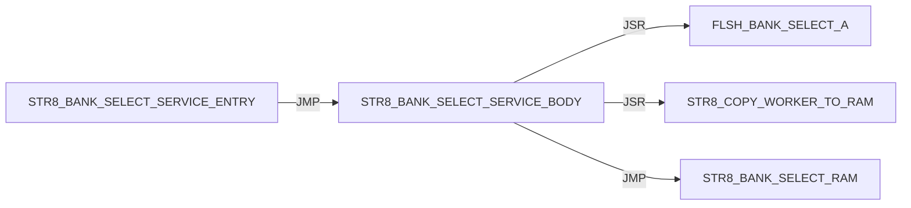

#### STR8 / BOOT

Panel 1 of 2: `STR8_BOOT_JUMP_BANK_A` through `STR8_BOOT_START`.


Panel 2 of 2: `STR8_BOOT_START` through `STR8_BOOT_START`.

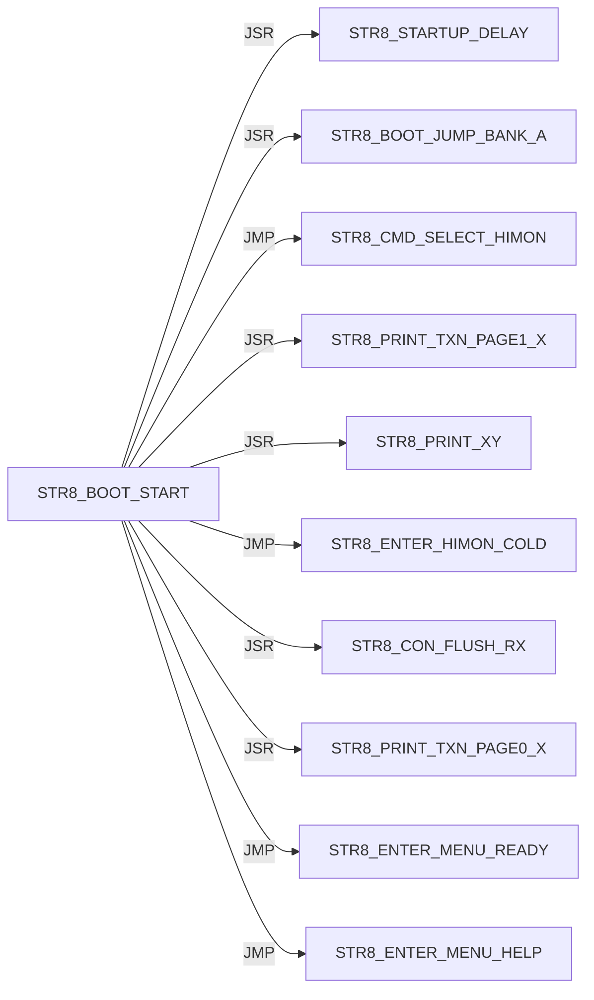

#### STR8 / CON

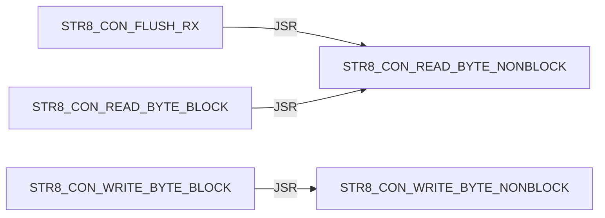

#### STR8 / CONFIRM

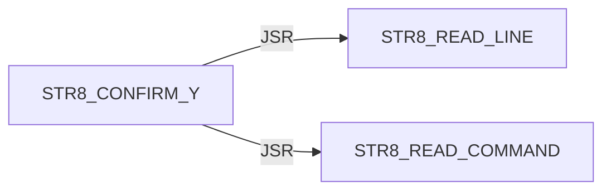

#### STR8 / DELAY


#### STR8 / DIR

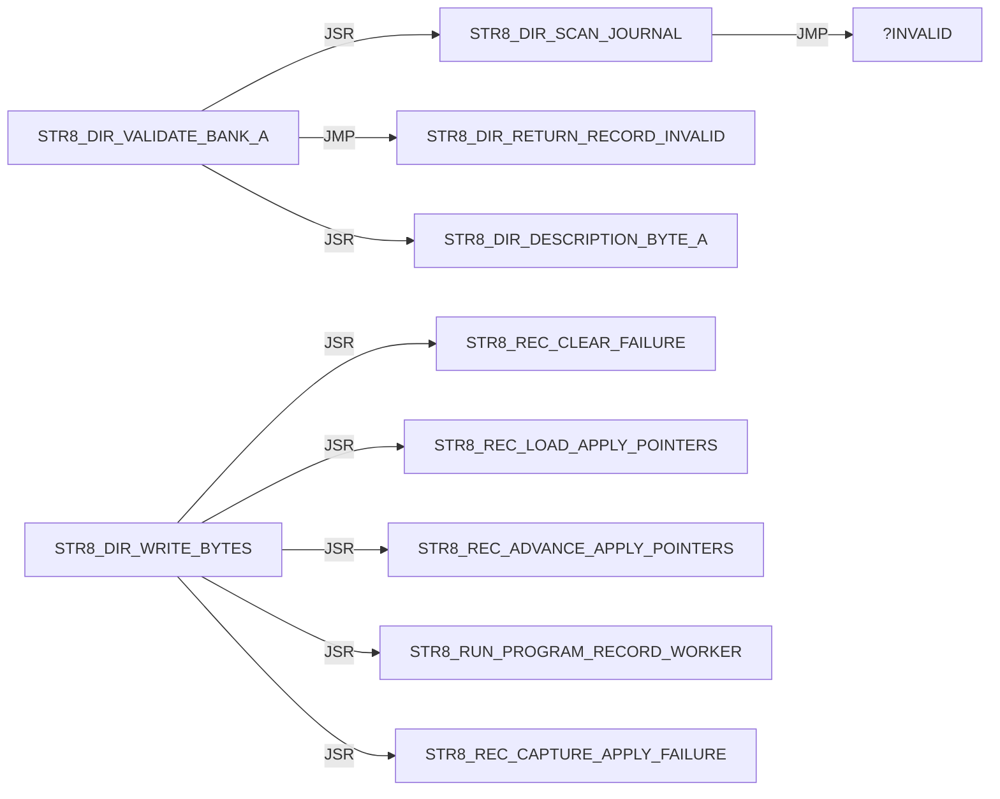

#### STR8 / DISPATCH

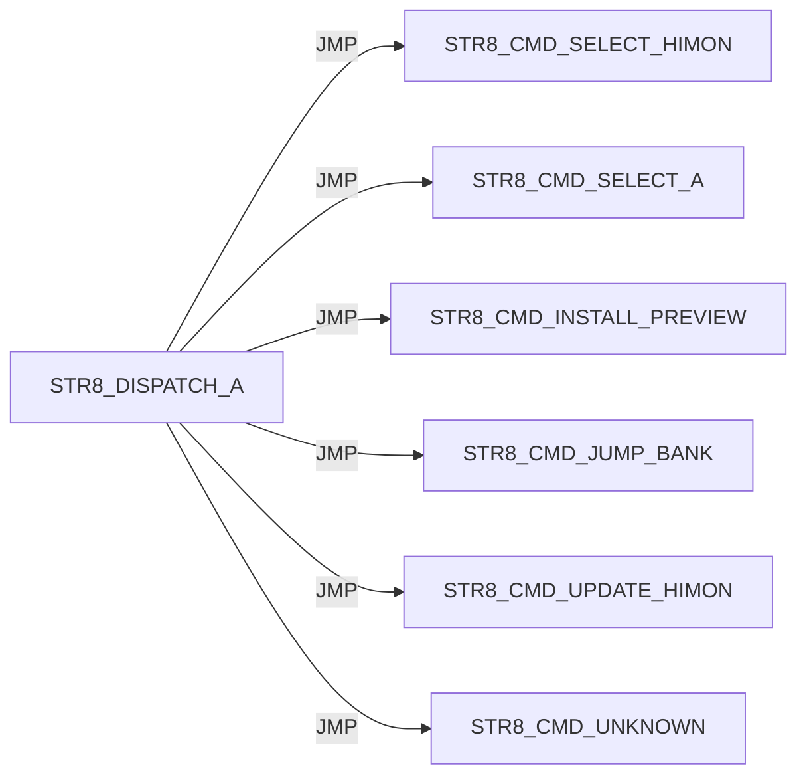

#### STR8 / ENTER

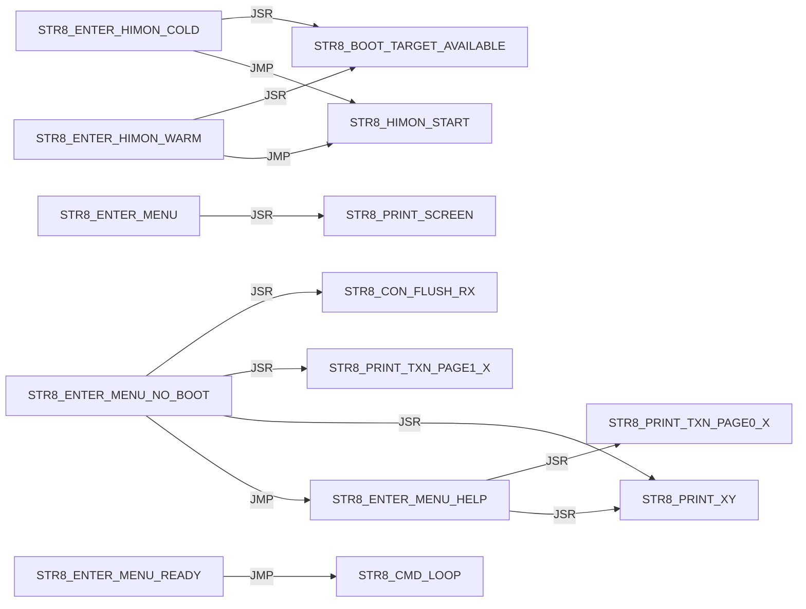

#### STR8 / I

Panel 1 of 5: `STR8_I_BEGIN_TRANSACTION` through `STR8_I_PRINT_SUMMARY`.

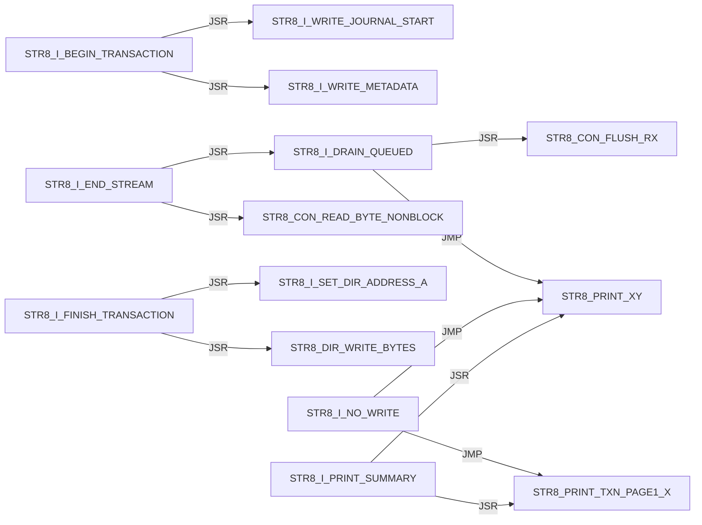

Panel 2 of 5: `STR8_I_PRINT_SUMMARY` through `STR8_I_READ_DESCRIPTION`.

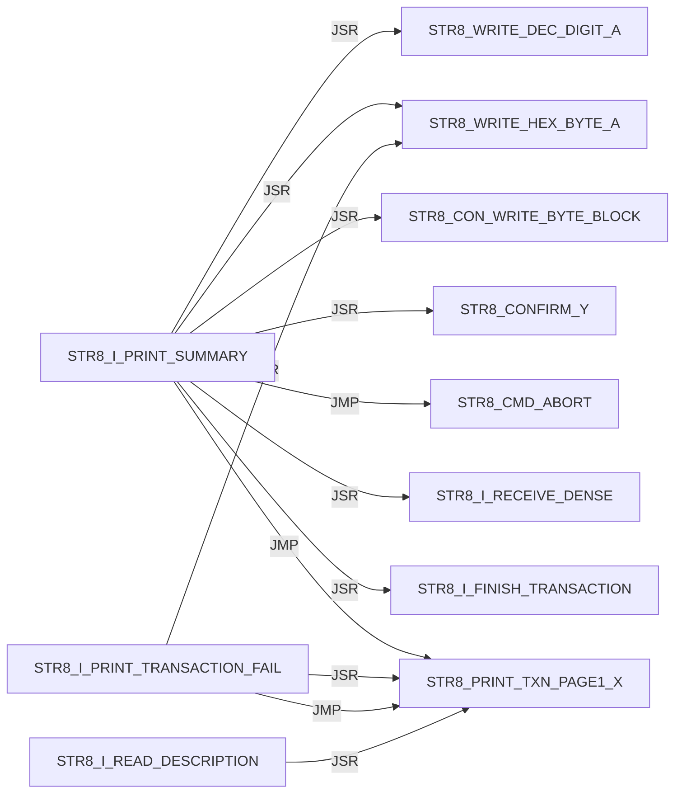

Panel 3 of 5: `STR8_I_READ_DESCRIPTION` through `STR8_I_RECEIVE_DENSE`.

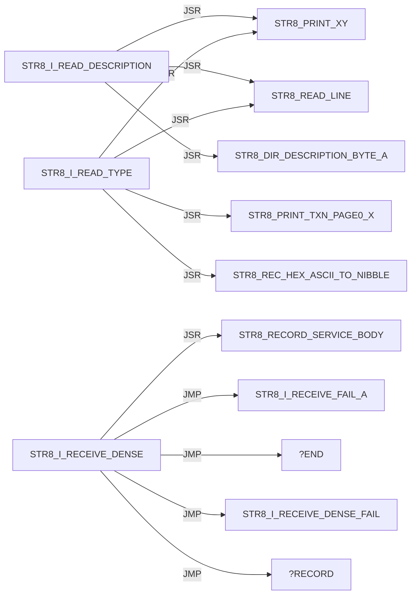

Panel 4 of 5: `STR8_I_RECEIVE_DENSE` through `STR8_I_WRITE_JOURNAL_MASK_A`.

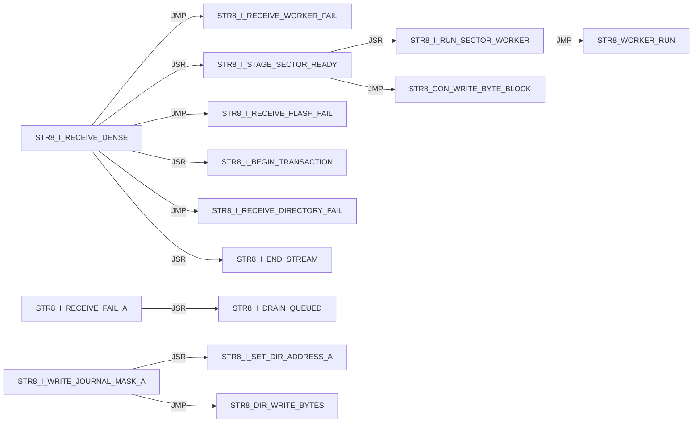

Panel 5 of 5: `STR8_I_WRITE_METADATA` through `STR8_I_WRITE_METADATA`.

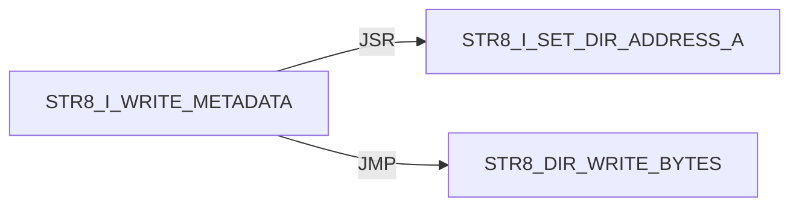

#### STR8 / INIT


#### STR8 / IVY

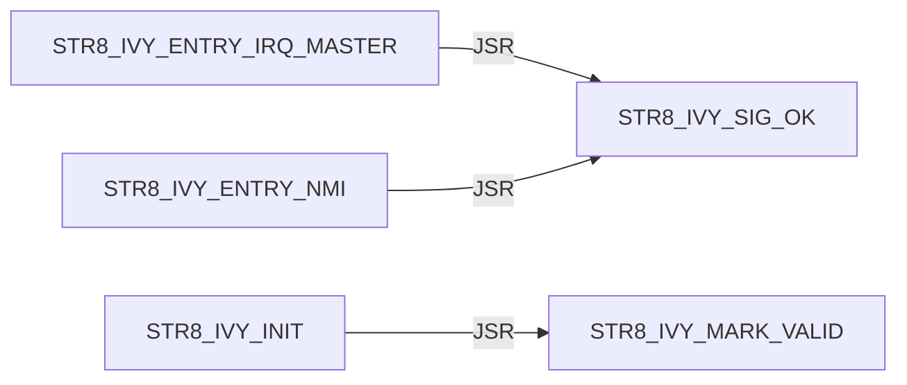

#### STR8 / JUMP

```mermaid
flowchart LR
    N0["STR8_JUMP_BANK_LAUNCH"] -->|JSR| N1["STR8_DIR_VALIDATE_BANK_A"]
    N0["STR8_JUMP_BANK_LAUNCH"] -->|JMP| N2["STR8_PRINT_JUMP_FAIL"]
    N0["STR8_JUMP_BANK_LAUNCH"] -->|JSR| N3["STR8_CON_FLUSH_RX"]
    N0["STR8_JUMP_BANK_LAUNCH"] -->|JSR| N4["STR8_JUMP_BANK_RAM"]
    N0["STR8_JUMP_BANK_LAUNCH"] -->|JSR| N5["STR8_COPY_WORKER_TO_RAM"]
    N0["STR8_JUMP_BANK_LAUNCH"] -->|JSR| N6["STR8_WORKER_RUN"]
    N7["STR8_JUMP_BANK_PREP_A"] -->|JSR| N8["STR8_PRINT_TXN_PAGE1_X"]
    N7["STR8_JUMP_BANK_PREP_A"] -->|JSR| N9["STR8_PRINT_XY"]
    N7["STR8_JUMP_BANK_PREP_A"] -->|JSR| N10["STR8_WRITE_DEC_DIGIT_A"]
    N4["STR8_JUMP_BANK_RAM"] -->|JSR| N11["FLSH_BANK_SELECT_A"]
    N4["STR8_JUMP_BANK_RAM"] -->|JSR| N12["FLSH_BANK_SELECT_3"]
```

#### STR8 / PRINT

Panel 1 of 2: `STR8_PRINT_BANNER` through `STR8_PRINT_PROMPT`.

```mermaid
flowchart LR
    N0["STR8_PRINT_BANNER"] -->|JMP| N1["STR8_PRINT_TXN_PAGE0_X"]
    N0["STR8_PRINT_BANNER"] -->|JMP| N2["STR8_PRINT_XY"]
    N3["STR8_PRINT_COPY_FAIL"] -->|JSR| N2["STR8_PRINT_XY"]
    N3["STR8_PRINT_COPY_FAIL"] -->|JSR| N4["STR8_WRITE_HEX_BYTE_A"]
    N3["STR8_PRINT_COPY_FAIL"] -->|JMP| N2["STR8_PRINT_XY"]
    N5["STR8_PRINT_JUMP_FAIL"] -->|JSR| N6["STR8_PRINT_TXN_PAGE1_X"]
    N5["STR8_PRINT_JUMP_FAIL"] -->|JSR| N2["STR8_PRINT_XY"]
    N5["STR8_PRINT_JUMP_FAIL"] -->|JSR| N7["STR8_WRITE_DEC_DIGIT_A"]
    N5["STR8_PRINT_JUMP_FAIL"] -->|JSR| N4["STR8_WRITE_HEX_BYTE_A"]
    N5["STR8_PRINT_JUMP_FAIL"] -->|JMP| N6["STR8_PRINT_TXN_PAGE1_X"]
    N5["STR8_PRINT_JUMP_FAIL"] -->|JMP| N2["STR8_PRINT_XY"]
    N8["STR8_PRINT_PROMPT"] -->|JMP| N1["STR8_PRINT_TXN_PAGE0_X"]
```

Panel 2 of 2: `STR8_PRINT_PROMPT` through `STR8_PRINT_XY`.

```mermaid
flowchart LR
    N0["STR8_PRINT_PROMPT"] -->|JMP| N1["STR8_PRINT_XY"]
    N2["STR8_PRINT_SCREEN"] -->|JSR| N1["STR8_PRINT_XY"]
    N2["STR8_PRINT_SCREEN"] -->|JMP| N1["STR8_PRINT_XY"]
    N1["STR8_PRINT_XY"] -->|JSR| N3["STR8_CON_WRITE_BYTE_BLOCK"]
    N1["STR8_PRINT_XY"] -->|JMP| N3["STR8_CON_WRITE_BYTE_BLOCK"]
```

#### STR8 / PROGRAM

```mermaid
flowchart LR
    N0["STR8_PROGRAM_HIMON_SECTOR_AX"] -->|JSR| N1["STR8_COPY_WORKER_TO_RAM"]
    N0["STR8_PROGRAM_HIMON_SECTOR_AX"] -->|JSR| N2["STR8_WORKER_RUN"]
    N0["STR8_PROGRAM_HIMON_SECTOR_AX"] -->|JSR| N3["STR8_CON_WRITE_BYTE_BLOCK"]
    N4["STR8_PROGRAM_HIMON_UPDATE"] -->|JSR| N0["STR8_PROGRAM_HIMON_SECTOR_AX"]
```

#### STR8 / READ

```mermaid
flowchart LR
    N0["STR8_READ_COMMAND"] -->|JSR| N1["STR8_CON_READ_BYTE_BLOCK"]
    N0["STR8_READ_COMMAND"] -->|JSR| N2["STR8_TO_UPPER_A"]
    N0["STR8_READ_COMMAND"] -->|JSR| N3["STR8_CON_WRITE_BYTE_BLOCK"]
    N4["STR8_READ_HIMON_S19"] -->|JSR| N5["STR8_RECORD_SERVICE_BODY"]
    N4["STR8_READ_HIMON_S19"] -->|JSR| N6["STR8_STAGE_HIMON_RECORD"]
    N4["STR8_READ_HIMON_S19"] -->|JSR| N3["STR8_CON_WRITE_BYTE_BLOCK"]
    N7["STR8_READ_LINE"] -->|JSR| N8["STR8_READ_TEXT_BYTE_BLOCK"]
    N7["STR8_READ_LINE"] -->|JSR| N2["STR8_TO_UPPER_A"]
    N7["STR8_READ_LINE"] -->|JSR| N3["STR8_CON_WRITE_BYTE_BLOCK"]
    N8["STR8_READ_TEXT_BYTE_BLOCK"] -->|JSR| N1["STR8_CON_READ_BYTE_BLOCK"]
```

#### STR8 / REC

Panel 1 of 3: `STR8_REC_APPLY_LF` through `STR8_REC_PARSE`.

```mermaid
flowchart LR
    N0["STR8_REC_APPLY_LF"] -->|JSR| N1["STR8_REC_CLEAR_FAILURE"]
    N0["STR8_REC_APPLY_LF"] -->|JMP| N2["STR8_REC_FAIL_A"]
    N0["STR8_REC_APPLY_LF"] -->|JMP| N3["STR8_REC_RETURN_OK"]
    N0["STR8_REC_APPLY_LF"] -->|JSR| N4["STR8_REC_LOAD_APPLY_POINTERS"]
    N0["STR8_REC_APPLY_LF"] -->|JSR| N5["STR8_REC_CAPTURE_APPLY_FAILURE"]
    N0["STR8_REC_APPLY_LF"] -->|JSR| N6["STR8_REC_ADVANCE_APPLY_POINTERS"]
    N0["STR8_REC_APPLY_LF"] -->|JSR| N7["STR8_RUN_PROGRAM_RECORD_WORKER"]
    N8["STR8_REC_FAIL_READ_X"] -->|JMP| N9["STR8_REC_RETURN_CURRENT_FAIL"]
    N8["STR8_REC_FAIL_READ_X"] -->|JMP| N2["STR8_REC_FAIL_A"]
    N10["STR8_REC_PARSE"] -->|JSR| N11["STR8_REC_CLEAR_RESULT"]
    N10["STR8_REC_PARSE"] -->|JMP| N2["STR8_REC_FAIL_A"]
    N10["STR8_REC_PARSE"] -->|JSR| N12["STR8_REC_READ_CHAR"]
```

Panel 2 of 3: `STR8_REC_PARSE` through `STR8_REC_READ_HEX_BYTE`.

```mermaid
flowchart LR
    N0["STR8_REC_PARSE"] -->|JMP| N1["STR8_REC_FAIL_READ_START"]
    N0["STR8_REC_PARSE"] -->|JMP| N2["STR8_REC_FAIL_READ_TYPE"]
    N3["STR8_REC_PARSE_BODY"] -->|JSR| N4["STR8_REC_READ_SUM_BYTE"]
    N3["STR8_REC_PARSE_BODY"] -->|JMP| N5["STR8_REC_FAIL_READ_HEX"]
    N3["STR8_REC_PARSE_BODY"] -->|JMP| N6["STR8_REC_FAIL_A"]
    N3["STR8_REC_PARSE_BODY"] -->|JSR| N7["STR8_REC_READ_CHAR"]
    N3["STR8_REC_PARSE_BODY"] -->|JMP| N8["STR8_REC_FAIL_READ_END"]
    N3["STR8_REC_PARSE_BODY"] -->|JMP| N9["STR8_REC_RETURN_OK"]
    N7["STR8_REC_READ_CHAR"] -->|JSR| N10["STR8_READ_TEXT_BYTE_BLOCK"]
    N7["STR8_REC_READ_CHAR"] -->|JSR| N11["STR8_CON_READ_BYTE_BLOCK"]
    N12["STR8_REC_READ_HEX_BYTE"] -->|JSR| N7["STR8_REC_READ_CHAR"]
    N12["STR8_REC_READ_HEX_BYTE"] -->|JSR| N13["STR8_REC_HEX_ASCII_TO_NIBBLE"]
```

Panel 3 of 3: `STR8_REC_READ_SUM_BYTE` through `STR8_REC_READ_SUM_BYTE`.

```mermaid
flowchart LR
    N0["STR8_REC_READ_SUM_BYTE"] -->|JSR| N1["STR8_REC_READ_HEX_BYTE"]
```

#### STR8 / RECORD

```mermaid
flowchart LR
    N0["STR8_RECORD_SERVICE_BODY"] -->|JMP| N1["STR8_REC_APPLY_LF"]
    N0["STR8_RECORD_SERVICE_BODY"] -->|JMP| N2["STR8_REC_FAIL_A"]
    N3["STR8_RECORD_SERVICE_ENTRY"] -->|JMP| N0["STR8_RECORD_SERVICE_BODY"]
```

#### STR8 / RUN

```mermaid
flowchart LR
    N0["STR8_RUN_PROGRAM_RECORD_WORKER"] -->|JSR| N1["STR8_COPY_WORKER_TO_RAM"]
    N0["STR8_RUN_PROGRAM_RECORD_WORKER"] -->|JSR| N2["STR8_WORKER_RUN"]
    N3["STR8_RUN_WORKER_SERVICE"] -->|JMP| N4["STR8_RUN_WORKER_SERVICE_BODY"]
    N4["STR8_RUN_WORKER_SERVICE_BODY"] -->|JSR| N1["STR8_COPY_WORKER_TO_RAM"]
    N4["STR8_RUN_WORKER_SERVICE_BODY"] -->|JSR| N2["STR8_WORKER_RUN"]
```

#### STR8 / SELECT

```mermaid
flowchart LR
    N0["STR8_SELECT_BANK_3"] -->|JSR| N1["FLSH_BANK_SELECT_3"]
```

#### STR8 / STARTUP

```mermaid
flowchart LR
    N0["STR8_STARTUP_DELAY"] -->|JSR| N1["STR8_CON_WRITE_BYTE_BLOCK"]
    N0["STR8_STARTUP_DELAY"] -->|JSR| N2["STR8_CON_FLUSH_RX"]
    N0["STR8_STARTUP_DELAY"] -->|JSR| N3["STR8_PRINT_TXN_PAGE1_X"]
    N0["STR8_STARTUP_DELAY"] -->|JSR| N4["STR8_PRINT_XY"]
    N0["STR8_STARTUP_DELAY"] -->|JSR| N5["STR8_PRINT_BANNER"]
    N0["STR8_STARTUP_DELAY"] -->|JSR| N6["STR8_PRINT_TXN_PAGE0_X"]
    N0["STR8_STARTUP_DELAY"] -->|JSR| N7["STR8_DELAY_FIXED_A"]
    N0["STR8_STARTUP_DELAY"] -->|JSR| N8["STR8_BOOT_KEY_POLL_IF_ENABLED"]
```

#### STR8 / WRITE

```mermaid
flowchart LR
    N0["STR8_WRITE_DEC_DIGIT_A"] -->|JMP| N1["STR8_CON_WRITE_BYTE_BLOCK"]
    N2["STR8_WRITE_HEX_BYTE_A"] -->|JSR| N3["STR8_WRITE_HEX_NIBBLE_A"]
    N3["STR8_WRITE_HEX_NIBBLE_A"] -->|JMP| N1["STR8_CON_WRITE_BYTE_BLOCK"]
```

#### STR8 CMD / ABORT

```mermaid
flowchart LR
    N0["STR8_CMD_ABORT"] -->|JSR| N1["STR8_SELECT_BANK_3"]
    N0["STR8_CMD_ABORT"] -->|JMP| N2["STR8_PRINT_TXN_PAGE0_X"]
    N0["STR8_CMD_ABORT"] -->|JMP| N3["STR8_PRINT_XY"]
```

#### STR8 CMD / COPY

```mermaid
flowchart LR
    N0["STR8_CMD_COPY_FAIL"] -->|JSR| N1["STR8_SELECT_BANK_3"]
    N0["STR8_CMD_COPY_FAIL"] -->|JMP| N2["STR8_PRINT_COPY_FAIL"]
```

#### STR8 CMD / INSTALL

```mermaid
flowchart LR
    N0["STR8_CMD_INSTALL_PREVIEW"] -->|JMP| N1["STR8_CMD_UNKNOWN"]
    N0["STR8_CMD_INSTALL_PREVIEW"] -->|JSR| N2["STR8_PRINT_TXN_PAGE0_X"]
    N0["STR8_CMD_INSTALL_PREVIEW"] -->|JSR| N3["STR8_PRINT_XY"]
    N0["STR8_CMD_INSTALL_PREVIEW"] -->|JSR| N4["STR8_READ_LINE"]
    N0["STR8_CMD_INSTALL_PREVIEW"] -->|JMP| N5["STR8_CMD_ABORT"]
    N0["STR8_CMD_INSTALL_PREVIEW"] -->|JSR| N6["STR8_DIR_VALIDATE_BANK_A"]
    N0["STR8_CMD_INSTALL_PREVIEW"] -->|JSR| N7["STR8_I_READ_TYPE"]
    N0["STR8_CMD_INSTALL_PREVIEW"] -->|JSR| N8["STR8_I_READ_DESCRIPTION"]
    N0["STR8_CMD_INSTALL_PREVIEW"] -->|JMP| N9["STR8_I_PRINT_SUMMARY"]
    N0["STR8_CMD_INSTALL_PREVIEW"] -->|JSR| N10["STR8_I_COPY_RECORD_METADATA"]
    N0["STR8_CMD_INSTALL_PREVIEW"] -->|JMP| N11["STR8_PRINT_TXN_PAGE1_X"]
    N0["STR8_CMD_INSTALL_PREVIEW"] -->|JMP| N3["STR8_PRINT_XY"]
```

#### STR8 CMD / JUMP

```mermaid
flowchart LR
    N0["STR8_CMD_JUMP_BANK"] -->|JSR| N1["STR8_READ_COMMAND"]
    N0["STR8_CMD_JUMP_BANK"] -->|JMP| N2["STR8_CMD_ABORT"]
    N0["STR8_CMD_JUMP_BANK"] -->|JSR| N3["STR8_JUMP_BANK_PREP_A"]
    N0["STR8_CMD_JUMP_BANK"] -->|JMP| N4["STR8_JUMP_BANK_LAUNCH"]
    N0["STR8_CMD_JUMP_BANK"] -->|JMP| N5["STR8_CMD_UNKNOWN"]
```

#### STR8 CMD / LOOP

```mermaid
flowchart LR
    N0["STR8_CMD_LOOP"] -->|JSR| N1["STR8_PRINT_PROMPT"]
    N0["STR8_CMD_LOOP"] -->|JSR| N2["STR8_READ_LINE"]
    N0["STR8_CMD_LOOP"] -->|JSR| N3["STR8_CMD_ABORT"]
    N0["STR8_CMD_LOOP"] -->|JSR| N4["STR8_READ_COMMAND"]
    N0["STR8_CMD_LOOP"] -->|JSR| N5["STR8_DISPATCH_A"]
```

#### STR8 CMD / OK

```mermaid
flowchart LR
    N0["STR8_CMD_OK"] -->|JSR| N1["STR8_SELECT_BANK_3"]
    N0["STR8_CMD_OK"] -->|JMP| N2["STR8_PRINT_XY"]
```

#### STR8 CMD / SELECT

```mermaid
flowchart LR
    N0["STR8_CMD_SELECT_A"] -->|JSR| N1["STR8_JUMP_BANK_PREP_A"]
    N0["STR8_CMD_SELECT_A"] -->|JMP| N2["STR8_JUMP_BANK_LAUNCH"]
    N3["STR8_CMD_SELECT_HIMON"] -->|JSR| N4["STR8_SELECT_BANK_3"]
    N3["STR8_CMD_SELECT_HIMON"] -->|JSR| N5["STR8_CON_FLUSH_RX"]
    N3["STR8_CMD_SELECT_HIMON"] -->|JSR| N6["STR8_PRINT_TXN_PAGE1_X"]
    N3["STR8_CMD_SELECT_HIMON"] -->|JSR| N7["STR8_PRINT_XY"]
    N3["STR8_CMD_SELECT_HIMON"] -->|JMP| N8["STR8_ENTER_HIMON_WARM"]
```

#### STR8 CMD / UNKNOWN

```mermaid
flowchart LR
    N0["STR8_CMD_UNKNOWN"] -->|JSR| N1["STR8_PRINT_TXN_PAGE1_X"]
    N0["STR8_CMD_UNKNOWN"] -->|JSR| N2["STR8_PRINT_XY"]
    N0["STR8_CMD_UNKNOWN"] -->|JMP| N3["STR8_PRINT_TXN_PAGE0_X"]
    N0["STR8_CMD_UNKNOWN"] -->|JMP| N2["STR8_PRINT_XY"]
```

#### STR8 CMD / UPDATE

```mermaid
flowchart LR
    N0["STR8_CMD_UPDATE_HIMON"] -->|JMP| N1["STR8_PRINT_XY"]
    N0["STR8_CMD_UPDATE_HIMON"] -->|JSR| N1["STR8_PRINT_XY"]
    N0["STR8_CMD_UPDATE_HIMON"] -->|JSR| N2["STR8_CONFIRM_Y"]
    N0["STR8_CMD_UPDATE_HIMON"] -->|JSR| N3["STR8_STAGE_HIMON_BLANK"]
    N0["STR8_CMD_UPDATE_HIMON"] -->|JSR| N4["STR8_UPD_INIT"]
    N0["STR8_CMD_UPDATE_HIMON"] -->|JSR| N5["STR8_READ_HIMON_S19"]
    N0["STR8_CMD_UPDATE_HIMON"] -->|JSR| N6["STR8_PROGRAM_HIMON_UPDATE"]
    N0["STR8_CMD_UPDATE_HIMON"] -->|JMP| N7["STR8_CMD_OK"]
    N8["STR8_CMD_UPDATE_NO_DATA"] -->|JMP| N1["STR8_PRINT_XY"]
    N9["STR8_CMD_UPDATE_S19_FAIL"] -->|JSR| N10["STR8_CON_FLUSH_RX"]
    N9["STR8_CMD_UPDATE_S19_FAIL"] -->|JMP| N1["STR8_PRINT_XY"]
```

## External Targets

These targets are not labels in this source file; most are `XREF` providers from sibling ROM modules.

```text
FLSH_BANK_SELECT_3
FLSH_BANK_SELECT_A
STR8_BANK_SELECT_RAM
STR8_HIMON_START
STR8_WORKER_RUN
UTL_DELAY_AXY_8MHZ
```

## Unique Direct Edges By Source Label

Each block is one source label. Indented lines are outgoing direct edges.
Blank lines are source-level breaks; they do not imply call depth.

```text
START
    JMP STR8_BOOT_START

STR8_BANK_SELECT_SERVICE_BODY
    JSR FLSH_BANK_SELECT_A
    JSR STR8_COPY_WORKER_TO_RAM
    JMP STR8_BANK_SELECT_RAM

STR8_BANK_SELECT_SERVICE_ENTRY
    JMP STR8_BANK_SELECT_SERVICE_BODY

STR8_BOOT_JUMP_BANK_A
    JSR STR8_JUMP_BANK_PREP_A
    JSR STR8_CON_FLUSH_RX
    JSR STR8_PRINT_TXN_PAGE0_X
    JSR STR8_PRINT_XY
    JSR STR8_DELAY_FIXED_A
    JMP STR8_JUMP_BANK_LAUNCH

STR8_BOOT_KEY_POLL
    JSR STR8_CON_READ_BYTE_NONBLOCK
    JSR STR8_TO_UPPER_A
    JSR STR8_CON_WRITE_BYTE_BLOCK

STR8_BOOT_KEY_POLL_IF_ENABLED
    JMP STR8_BOOT_KEY_POLL

STR8_BOOT_START
    JSR STR8_IVY_INIT
    JSR STR8_INIT
    JSR STR8_STARTUP_DELAY
    JSR STR8_BOOT_JUMP_BANK_A
    JMP STR8_CMD_SELECT_HIMON
    JSR STR8_PRINT_TXN_PAGE1_X
    JSR STR8_PRINT_XY
    JMP STR8_ENTER_HIMON_COLD
    JSR STR8_CON_FLUSH_RX
    JSR STR8_PRINT_TXN_PAGE0_X
    JMP STR8_ENTER_MENU_READY
    JMP STR8_ENTER_MENU_HELP

STR8_CMD_ABORT
    JSR STR8_SELECT_BANK_3
    JMP STR8_PRINT_TXN_PAGE0_X
    JMP STR8_PRINT_XY

STR8_CMD_COPY_FAIL
    JSR STR8_SELECT_BANK_3
    JMP STR8_PRINT_COPY_FAIL

STR8_CMD_INSTALL_PREVIEW
    JMP STR8_CMD_UNKNOWN
    JSR STR8_PRINT_TXN_PAGE0_X
    JSR STR8_PRINT_XY
    JSR STR8_READ_LINE
    JMP STR8_CMD_ABORT
    JSR STR8_DIR_VALIDATE_BANK_A
    JSR STR8_I_READ_TYPE
    JSR STR8_I_READ_DESCRIPTION
    JMP STR8_I_PRINT_SUMMARY
    JSR STR8_I_COPY_RECORD_METADATA
    JMP STR8_PRINT_TXN_PAGE1_X
    JMP STR8_PRINT_XY

STR8_CMD_JUMP_BANK
    JSR STR8_READ_COMMAND
    JMP STR8_CMD_ABORT
    JSR STR8_JUMP_BANK_PREP_A
    JMP STR8_JUMP_BANK_LAUNCH
    JMP STR8_CMD_UNKNOWN

STR8_CMD_LOOP
    JSR STR8_PRINT_PROMPT
    JSR STR8_READ_LINE
    JSR STR8_CMD_ABORT
    JSR STR8_READ_COMMAND
    JSR STR8_DISPATCH_A

STR8_CMD_OK
    JSR STR8_SELECT_BANK_3
    JMP STR8_PRINT_XY

STR8_CMD_SELECT_A
    JSR STR8_JUMP_BANK_PREP_A
    JMP STR8_JUMP_BANK_LAUNCH

STR8_CMD_SELECT_HIMON
    JSR STR8_SELECT_BANK_3
    JSR STR8_CON_FLUSH_RX
    JSR STR8_PRINT_TXN_PAGE1_X
    JSR STR8_PRINT_XY
    JMP STR8_ENTER_HIMON_WARM

STR8_CMD_UNKNOWN
    JSR STR8_PRINT_TXN_PAGE1_X
    JSR STR8_PRINT_XY
    JMP STR8_PRINT_TXN_PAGE0_X
    JMP STR8_PRINT_XY

STR8_CMD_UPDATE_HIMON
    JMP STR8_PRINT_XY
    JSR STR8_PRINT_XY
    JSR STR8_CONFIRM_Y
    JSR STR8_STAGE_HIMON_BLANK
    JSR STR8_UPD_INIT
    JSR STR8_READ_HIMON_S19
    JSR STR8_PROGRAM_HIMON_UPDATE
    JMP STR8_CMD_OK

STR8_CMD_UPDATE_NO_DATA
    JMP STR8_PRINT_XY

STR8_CMD_UPDATE_S19_FAIL
    JSR STR8_CON_FLUSH_RX
    JMP STR8_PRINT_XY

STR8_CON_FLUSH_RX
    JSR STR8_CON_READ_BYTE_NONBLOCK

STR8_CON_READ_BYTE_BLOCK
    JSR STR8_CON_READ_BYTE_NONBLOCK

STR8_CON_WRITE_BYTE_BLOCK
    JSR STR8_CON_WRITE_BYTE_NONBLOCK

STR8_CONFIRM_Y
    JSR STR8_READ_LINE
    JSR STR8_READ_COMMAND

STR8_DELAY_FIXED_A
    JMP UTL_DELAY_AXY_8MHZ

STR8_DIR_SCAN_JOURNAL
    JMP ?INVALID

STR8_DIR_VALIDATE_BANK_A
    JMP STR8_DIR_RETURN_RECORD_INVALID
    JSR STR8_DIR_DESCRIPTION_BYTE_A
    JSR STR8_DIR_SCAN_JOURNAL

STR8_DIR_WRITE_BYTES
    JSR STR8_REC_CLEAR_FAILURE
    JSR STR8_REC_LOAD_APPLY_POINTERS
    JSR STR8_REC_ADVANCE_APPLY_POINTERS
    JSR STR8_RUN_PROGRAM_RECORD_WORKER
    JSR STR8_REC_CAPTURE_APPLY_FAILURE

STR8_DISPATCH_A
    JMP STR8_CMD_SELECT_HIMON
    JMP STR8_CMD_SELECT_A
    JMP STR8_CMD_INSTALL_PREVIEW
    JMP STR8_CMD_JUMP_BANK
    JMP STR8_CMD_UPDATE_HIMON
    JMP STR8_CMD_UNKNOWN

STR8_ENTER_HIMON_COLD
    JSR STR8_BOOT_TARGET_AVAILABLE
    JMP STR8_HIMON_START

STR8_ENTER_HIMON_WARM
    JSR STR8_BOOT_TARGET_AVAILABLE
    JMP STR8_HIMON_START

STR8_ENTER_MENU
    JSR STR8_PRINT_SCREEN

STR8_ENTER_MENU_HELP
    JSR STR8_PRINT_TXN_PAGE0_X
    JSR STR8_PRINT_XY

STR8_ENTER_MENU_NO_BOOT
    JSR STR8_CON_FLUSH_RX
    JSR STR8_PRINT_TXN_PAGE1_X
    JSR STR8_PRINT_XY
    JMP STR8_ENTER_MENU_HELP

STR8_ENTER_MENU_READY
    JMP STR8_CMD_LOOP

STR8_I_BEGIN_TRANSACTION
    JSR STR8_I_WRITE_JOURNAL_START
    JSR STR8_I_WRITE_METADATA

STR8_I_DRAIN_QUEUED
    JSR STR8_CON_FLUSH_RX
    JMP STR8_PRINT_XY

STR8_I_END_STREAM
    JSR STR8_CON_READ_BYTE_NONBLOCK
    JSR STR8_I_DRAIN_QUEUED

STR8_I_FINISH_TRANSACTION
    JSR STR8_I_SET_DIR_ADDRESS_A
    JSR STR8_DIR_WRITE_BYTES

STR8_I_NO_WRITE
    JMP STR8_PRINT_TXN_PAGE1_X
    JMP STR8_PRINT_XY

STR8_I_PRINT_SUMMARY
    JSR STR8_PRINT_TXN_PAGE1_X
    JSR STR8_PRINT_XY
    JSR STR8_WRITE_DEC_DIGIT_A
    JSR STR8_WRITE_HEX_BYTE_A
    JSR STR8_CON_WRITE_BYTE_BLOCK
    JSR STR8_CONFIRM_Y
    JMP STR8_CMD_ABORT
    JSR STR8_I_RECEIVE_DENSE
    JSR STR8_I_FINISH_TRANSACTION
    JMP STR8_PRINT_TXN_PAGE1_X

STR8_I_PRINT_TRANSACTION_FAIL
    JSR STR8_PRINT_TXN_PAGE1_X
    JSR STR8_WRITE_HEX_BYTE_A
    JMP STR8_PRINT_TXN_PAGE1_X

STR8_I_READ_DESCRIPTION
    JSR STR8_PRINT_TXN_PAGE1_X
    JSR STR8_PRINT_XY
    JSR STR8_READ_LINE
    JSR STR8_DIR_DESCRIPTION_BYTE_A

STR8_I_READ_TYPE
    JSR STR8_PRINT_TXN_PAGE0_X
    JSR STR8_PRINT_XY
    JSR STR8_READ_LINE
    JSR STR8_REC_HEX_ASCII_TO_NIBBLE

STR8_I_RECEIVE_DENSE
    JSR STR8_RECORD_SERVICE_BODY
    JMP STR8_I_RECEIVE_FAIL_A
    JMP ?END
    JMP STR8_I_RECEIVE_DENSE_FAIL
    JMP ?RECORD
    JMP STR8_I_RECEIVE_WORKER_FAIL
    JSR STR8_I_STAGE_SECTOR_READY
    JMP STR8_I_RECEIVE_FLASH_FAIL
    JSR STR8_I_BEGIN_TRANSACTION
    JMP STR8_I_RECEIVE_DIRECTORY_FAIL
    JSR STR8_I_END_STREAM

STR8_I_RECEIVE_FAIL_A
    JSR STR8_I_DRAIN_QUEUED

STR8_I_RUN_SECTOR_WORKER
    JMP STR8_WORKER_RUN

STR8_I_STAGE_SECTOR_READY
    JSR STR8_I_RUN_SECTOR_WORKER
    JMP STR8_CON_WRITE_BYTE_BLOCK

STR8_I_WRITE_JOURNAL_MASK_A
    JSR STR8_I_SET_DIR_ADDRESS_A
    JMP STR8_DIR_WRITE_BYTES

STR8_I_WRITE_METADATA
    JSR STR8_I_SET_DIR_ADDRESS_A
    JMP STR8_DIR_WRITE_BYTES

STR8_INIT
    JMP STR8_CON_INIT

STR8_IVY_ENTRY_IRQ_MASTER
    JSR STR8_IVY_SIG_OK

STR8_IVY_ENTRY_NMI
    JSR STR8_IVY_SIG_OK

STR8_IVY_INIT
    JSR STR8_IVY_MARK_VALID

STR8_JUMP_BANK_LAUNCH
    JSR STR8_DIR_VALIDATE_BANK_A
    JMP STR8_PRINT_JUMP_FAIL
    JSR STR8_CON_FLUSH_RX
    JSR STR8_JUMP_BANK_RAM
    JSR STR8_COPY_WORKER_TO_RAM
    JSR STR8_WORKER_RUN

STR8_JUMP_BANK_PREP_A
    JSR STR8_PRINT_TXN_PAGE1_X
    JSR STR8_PRINT_XY
    JSR STR8_WRITE_DEC_DIGIT_A

STR8_JUMP_BANK_RAM
    JSR FLSH_BANK_SELECT_A
    JSR FLSH_BANK_SELECT_3

STR8_PRINT_BANNER
    JMP STR8_PRINT_TXN_PAGE0_X
    JMP STR8_PRINT_XY

STR8_PRINT_COPY_FAIL
    JSR STR8_PRINT_XY
    JSR STR8_WRITE_HEX_BYTE_A
    JMP STR8_PRINT_XY

STR8_PRINT_JUMP_FAIL
    JSR STR8_PRINT_TXN_PAGE1_X
    JSR STR8_PRINT_XY
    JSR STR8_WRITE_DEC_DIGIT_A
    JSR STR8_WRITE_HEX_BYTE_A
    JMP STR8_PRINT_TXN_PAGE1_X
    JMP STR8_PRINT_XY

STR8_PRINT_PROMPT
    JMP STR8_PRINT_TXN_PAGE0_X
    JMP STR8_PRINT_XY

STR8_PRINT_SCREEN
    JSR STR8_PRINT_XY
    JMP STR8_PRINT_XY

STR8_PRINT_XY
    JSR STR8_CON_WRITE_BYTE_BLOCK
    JMP STR8_CON_WRITE_BYTE_BLOCK

STR8_PROGRAM_HIMON_SECTOR_AX
    JSR STR8_COPY_WORKER_TO_RAM
    JSR STR8_WORKER_RUN
    JSR STR8_CON_WRITE_BYTE_BLOCK

STR8_PROGRAM_HIMON_UPDATE
    JSR STR8_PROGRAM_HIMON_SECTOR_AX

STR8_READ_COMMAND
    JSR STR8_CON_READ_BYTE_BLOCK
    JSR STR8_TO_UPPER_A
    JSR STR8_CON_WRITE_BYTE_BLOCK

STR8_READ_HIMON_S19
    JSR STR8_RECORD_SERVICE_BODY
    JSR STR8_STAGE_HIMON_RECORD
    JSR STR8_CON_WRITE_BYTE_BLOCK

STR8_READ_LINE
    JSR STR8_READ_TEXT_BYTE_BLOCK
    JSR STR8_TO_UPPER_A
    JSR STR8_CON_WRITE_BYTE_BLOCK

STR8_READ_TEXT_BYTE_BLOCK
    JSR STR8_CON_READ_BYTE_BLOCK

STR8_REC_APPLY_LF
    JSR STR8_REC_CLEAR_FAILURE
    JMP STR8_REC_FAIL_A
    JMP STR8_REC_RETURN_OK
    JSR STR8_REC_LOAD_APPLY_POINTERS
    JSR STR8_REC_CAPTURE_APPLY_FAILURE
    JSR STR8_REC_ADVANCE_APPLY_POINTERS
    JSR STR8_RUN_PROGRAM_RECORD_WORKER

STR8_REC_FAIL_READ_X
    JMP STR8_REC_RETURN_CURRENT_FAIL
    JMP STR8_REC_FAIL_A

STR8_REC_PARSE
    JSR STR8_REC_CLEAR_RESULT
    JMP STR8_REC_FAIL_A
    JSR STR8_REC_READ_CHAR
    JMP STR8_REC_FAIL_READ_START
    JMP STR8_REC_FAIL_READ_TYPE

STR8_REC_PARSE_BODY
    JSR STR8_REC_READ_SUM_BYTE
    JMP STR8_REC_FAIL_READ_HEX
    JMP STR8_REC_FAIL_A
    JSR STR8_REC_READ_CHAR
    JMP STR8_REC_FAIL_READ_END
    JMP STR8_REC_RETURN_OK

STR8_REC_READ_CHAR
    JSR STR8_READ_TEXT_BYTE_BLOCK
    JSR STR8_CON_READ_BYTE_BLOCK

STR8_REC_READ_HEX_BYTE
    JSR STR8_REC_READ_CHAR
    JSR STR8_REC_HEX_ASCII_TO_NIBBLE

STR8_REC_READ_SUM_BYTE
    JSR STR8_REC_READ_HEX_BYTE

STR8_RECORD_SERVICE_BODY
    JMP STR8_REC_APPLY_LF
    JMP STR8_REC_FAIL_A

STR8_RECORD_SERVICE_ENTRY
    JMP STR8_RECORD_SERVICE_BODY

STR8_RUN_PROGRAM_RECORD_WORKER
    JSR STR8_COPY_WORKER_TO_RAM
    JSR STR8_WORKER_RUN

STR8_RUN_WORKER_SERVICE
    JMP STR8_RUN_WORKER_SERVICE_BODY

STR8_RUN_WORKER_SERVICE_BODY
    JSR STR8_COPY_WORKER_TO_RAM
    JSR STR8_WORKER_RUN

STR8_SELECT_BANK_3
    JSR FLSH_BANK_SELECT_3

STR8_STARTUP_DELAY
    JSR STR8_CON_WRITE_BYTE_BLOCK
    JSR STR8_CON_FLUSH_RX
    JSR STR8_PRINT_TXN_PAGE1_X
    JSR STR8_PRINT_XY
    JSR STR8_PRINT_BANNER
    JSR STR8_PRINT_TXN_PAGE0_X
    JSR STR8_DELAY_FIXED_A
    JSR STR8_BOOT_KEY_POLL_IF_ENABLED

STR8_WRITE_DEC_DIGIT_A
    JMP STR8_CON_WRITE_BYTE_BLOCK

STR8_WRITE_HEX_BYTE_A
    JSR STR8_WRITE_HEX_NIBBLE_A

STR8_WRITE_HEX_NIBBLE_A
    JMP STR8_CON_WRITE_BYTE_BLOCK

```

## Raw Direct Edge Sites By Source Label

Each line is a direct call/jump site with source line number.

```text
START
      198  JMP STR8_BOOT_START

STR8_BANK_SELECT_SERVICE_BODY
     1709  JSR FLSH_BANK_SELECT_A
     1720  JSR STR8_COPY_WORKER_TO_RAM
     1722  JMP STR8_BANK_SELECT_RAM

STR8_BANK_SELECT_SERVICE_ENTRY
      227  JMP STR8_BANK_SELECT_SERVICE_BODY

STR8_BOOT_JUMP_BANK_A
     1630  JSR STR8_JUMP_BANK_PREP_A
     1631  JSR STR8_CON_FLUSH_RX
     1634  JSR STR8_PRINT_TXN_PAGE0_X
     1637  JSR STR8_PRINT_XY
     1640  JSR STR8_DELAY_FIXED_A
     1641  JMP STR8_JUMP_BANK_LAUNCH

STR8_BOOT_KEY_POLL
      518  JSR STR8_CON_READ_BYTE_NONBLOCK
      520  JSR STR8_TO_UPPER_A
      538  JSR STR8_CON_WRITE_BYTE_BLOCK

STR8_BOOT_KEY_POLL_IF_ENABLED
      512  JMP STR8_BOOT_KEY_POLL

STR8_BOOT_START
      234  JSR STR8_IVY_INIT
      235  JSR STR8_INIT
      238  JSR STR8_STARTUP_DELAY
      249  JSR STR8_BOOT_JUMP_BANK_A
      251  JMP STR8_CMD_SELECT_HIMON
      255  JSR STR8_PRINT_TXN_PAGE1_X
      258  JSR STR8_PRINT_XY
      260  JMP STR8_ENTER_HIMON_COLD
      261  JSR STR8_CON_FLUSH_RX
      264  JSR STR8_PRINT_TXN_PAGE0_X
      267  JSR STR8_PRINT_XY
      269  JMP STR8_ENTER_MENU_READY
      270  JMP STR8_ENTER_MENU_HELP

STR8_CMD_ABORT
     1592  JSR STR8_SELECT_BANK_3
     1596  JMP STR8_PRINT_TXN_PAGE0_X
     1599  JMP STR8_PRINT_XY

STR8_CMD_COPY_FAIL
     1606  JSR STR8_SELECT_BANK_3
     1608  JMP STR8_PRINT_COPY_FAIL

STR8_CMD_INSTALL_PREVIEW
      713  JMP STR8_CMD_UNKNOWN
      717  JSR STR8_PRINT_TXN_PAGE0_X
      720  JSR STR8_PRINT_XY
      723  JSR STR8_READ_LINE
      726  JMP STR8_CMD_ABORT
      735  JSR STR8_DIR_VALIDATE_BANK_A
      744  JSR STR8_I_READ_TYPE
      746  JSR STR8_I_READ_DESCRIPTION
      748  JMP STR8_I_PRINT_SUMMARY
      749  JSR STR8_I_COPY_RECORD_METADATA
      750  JMP STR8_I_PRINT_SUMMARY
      753  JMP STR8_PRINT_TXN_PAGE1_X
      756  JMP STR8_PRINT_XY
      758  JMP STR8_CMD_UNKNOWN

STR8_CMD_JUMP_BANK
     1487  JSR STR8_READ_COMMAND
     1490  JMP STR8_CMD_ABORT
     1500  JSR STR8_JUMP_BANK_PREP_A
     1501  JMP STR8_JUMP_BANK_LAUNCH
     1503  JMP STR8_CMD_UNKNOWN

STR8_CMD_LOOP
      555  JSR STR8_PRINT_PROMPT
      558  JSR STR8_READ_LINE
      562  JSR STR8_CMD_ABORT
      565  JSR STR8_READ_COMMAND
      568  JSR STR8_CMD_ABORT
      572  JSR STR8_DISPATCH_A

STR8_CMD_OK
     1583  JSR STR8_SELECT_BANK_3
     1587  JMP STR8_PRINT_XY

STR8_CMD_SELECT_A
     1512  JSR STR8_JUMP_BANK_PREP_A
     1513  JMP STR8_JUMP_BANK_LAUNCH

STR8_CMD_SELECT_HIMON
     1520  JSR STR8_SELECT_BANK_3
     1522  JSR STR8_CON_FLUSH_RX
     1525  JSR STR8_PRINT_TXN_PAGE1_X
     1528  JSR STR8_PRINT_XY
     1530  JMP STR8_ENTER_HIMON_WARM

STR8_CMD_UNKNOWN
     1614  JSR STR8_PRINT_TXN_PAGE1_X
     1617  JSR STR8_PRINT_XY
     1621  JMP STR8_PRINT_TXN_PAGE0_X
     1624  JMP STR8_PRINT_XY

STR8_CMD_UPDATE_HIMON
     1539  JMP STR8_PRINT_XY
     1543  JSR STR8_PRINT_XY
     1544  JSR STR8_CONFIRM_Y
     1546  JSR STR8_STAGE_HIMON_BLANK
     1547  JSR STR8_UPD_INIT
     1550  JSR STR8_PRINT_XY
     1551  JSR STR8_READ_HIMON_S19
     1557  JSR STR8_PRINT_XY
     1558  JSR STR8_CONFIRM_Y
     1560  JSR STR8_PROGRAM_HIMON_UPDATE
     1562  JMP STR8_CMD_OK

STR8_CMD_UPDATE_NO_DATA
     1574  JMP STR8_PRINT_XY

STR8_CMD_UPDATE_S19_FAIL
     1566  JSR STR8_CON_FLUSH_RX
     1569  JMP STR8_PRINT_XY

STR8_CON_FLUSH_RX
     2884  JSR STR8_CON_READ_BYTE_NONBLOCK

STR8_CON_READ_BYTE_BLOCK
     2898  JSR STR8_CON_READ_BYTE_NONBLOCK

STR8_CON_WRITE_BYTE_BLOCK
     2924  JSR STR8_CON_WRITE_BYTE_NONBLOCK

STR8_CONFIRM_Y
     2503  JSR STR8_READ_LINE
     2514  JSR STR8_READ_COMMAND

STR8_DELAY_FIXED_A
      507  JMP UTL_DELAY_AXY_8MHZ

STR8_DIR_SCAN_JOURNAL
     1878  JMP ?INVALID

STR8_DIR_VALIDATE_BANK_A
     1748  JMP STR8_DIR_RETURN_RECORD_INVALID
     1785  JSR STR8_DIR_DESCRIPTION_BYTE_A
     1824  JSR STR8_DIR_SCAN_JOURNAL

STR8_DIR_WRITE_BYTES
     1933  JSR STR8_REC_CLEAR_FAILURE
     1950  JSR STR8_REC_LOAD_APPLY_POINTERS
     1957  JSR STR8_REC_ADVANCE_APPLY_POINTERS
     1961  JSR STR8_RUN_PROGRAM_RECORD_WORKER
     1964  JSR STR8_REC_LOAD_APPLY_POINTERS
     1970  JSR STR8_REC_ADVANCE_APPLY_POINTERS
     1986  JSR STR8_REC_CAPTURE_APPLY_FAILURE
     1991  JSR STR8_REC_CAPTURE_APPLY_FAILURE

STR8_DISPATCH_A
      679  JMP STR8_CMD_SELECT_HIMON
      685  JMP STR8_CMD_SELECT_A
      691  JMP STR8_CMD_INSTALL_PREVIEW
      696  JMP STR8_CMD_JUMP_BANK
      702  JMP STR8_CMD_UPDATE_HIMON
      705  JMP STR8_CMD_UNKNOWN

STR8_ENTER_HIMON_COLD
      394  JSR STR8_BOOT_TARGET_AVAILABLE
      400  JMP STR8_HIMON_START

STR8_ENTER_HIMON_WARM
      403  JSR STR8_BOOT_TARGET_AVAILABLE
      413  JMP STR8_HIMON_START

STR8_ENTER_MENU
      276  JSR STR8_PRINT_SCREEN

STR8_ENTER_MENU_HELP
      283  JSR STR8_PRINT_TXN_PAGE0_X
      286  JSR STR8_PRINT_XY

STR8_ENTER_MENU_NO_BOOT
      431  JSR STR8_CON_FLUSH_RX
      434  JSR STR8_PRINT_TXN_PAGE1_X
      437  JSR STR8_PRINT_XY
      439  JMP STR8_ENTER_MENU_HELP

STR8_ENTER_MENU_READY
      290  JMP STR8_CMD_LOOP

STR8_I_BEGIN_TRANSACTION
     1027  JSR STR8_I_WRITE_JOURNAL_START
     1032  JSR STR8_I_WRITE_METADATA

STR8_I_DRAIN_QUEUED
     1464  JSR STR8_CON_FLUSH_RX
     1474  JMP STR8_PRINT_XY

STR8_I_END_STREAM
     1447  JSR STR8_CON_READ_BYTE_NONBLOCK
     1452  JSR STR8_CON_READ_BYTE_NONBLOCK
     1456  JSR STR8_I_DRAIN_QUEUED

STR8_I_FINISH_TRANSACTION
     1053  JSR STR8_I_SET_DIR_ADDRESS_A
     1056  JSR STR8_DIR_WRITE_BYTES
     1061  JSR STR8_I_SET_DIR_ADDRESS_A
     1064  JSR STR8_DIR_WRITE_BYTES

STR8_I_NO_WRITE
     1006  JMP STR8_PRINT_TXN_PAGE1_X
     1009  JMP STR8_PRINT_XY

STR8_I_PRINT_SUMMARY
      837  JSR STR8_PRINT_TXN_PAGE1_X
      840  JSR STR8_PRINT_XY
      843  JSR STR8_WRITE_DEC_DIGIT_A
      860  JSR STR8_PRINT_TXN_PAGE1_X
      862  JSR STR8_PRINT_XY
      866  JSR STR8_PRINT_TXN_PAGE1_X
      869  JSR STR8_PRINT_XY
      872  JSR STR8_WRITE_HEX_BYTE_A
      875  JSR STR8_PRINT_TXN_PAGE1_X
      878  JSR STR8_PRINT_XY
      882  JSR STR8_CON_WRITE_BYTE_BLOCK
      894  JSR STR8_PRINT_TXN_PAGE1_X
      897  JSR STR8_PRINT_XY
      900  JSR STR8_WRITE_HEX_BYTE_A
      902  JSR STR8_WRITE_HEX_BYTE_A
      936  JSR STR8_PRINT_TXN_PAGE1_X
      938  JSR STR8_PRINT_XY
      942  JSR STR8_PRINT_TXN_PAGE1_X
      945  JSR STR8_PRINT_XY
      948  JSR STR8_WRITE_HEX_BYTE_A
      955  JSR STR8_PRINT_TXN_PAGE1_X
      959  JSR STR8_PRINT_XY
      961  JSR STR8_CONFIRM_Y
      963  JMP STR8_CMD_ABORT
      967  JSR STR8_PRINT_TXN_PAGE1_X
      970  JSR STR8_PRINT_XY
      972  JSR STR8_I_RECEIVE_DENSE
      975  JSR STR8_I_FINISH_TRANSACTION
      978  JMP STR8_PRINT_TXN_PAGE1_X
      982  JSR STR8_PRINT_XY
      993  JSR STR8_PRINT_TXN_PAGE1_X
      996  JSR STR8_PRINT_XY
     1000  JSR STR8_WRITE_HEX_BYTE_A
     1002  JMP STR8_PRINT_TXN_PAGE1_X

STR8_I_PRINT_TRANSACTION_FAIL
     1017  JSR STR8_PRINT_TXN_PAGE1_X
     1019  JSR STR8_WRITE_HEX_BYTE_A
     1021  JMP STR8_PRINT_TXN_PAGE1_X

STR8_I_READ_DESCRIPTION
      793  JSR STR8_PRINT_TXN_PAGE1_X
      796  JSR STR8_PRINT_XY
      799  JSR STR8_READ_LINE
      804  JSR STR8_DIR_DESCRIPTION_BYTE_A

STR8_I_READ_TYPE
      763  JSR STR8_PRINT_TXN_PAGE0_X
      766  JSR STR8_PRINT_XY
      769  JSR STR8_READ_LINE
      773  JSR STR8_REC_HEX_ASCII_TO_NIBBLE
      781  JSR STR8_REC_HEX_ASCII_TO_NIBBLE

STR8_I_RECEIVE_DENSE
     1180  JSR STR8_RECORD_SERVICE_BODY
     1183  JMP STR8_I_RECEIVE_FAIL_A
     1192  JMP ?END
     1194  JMP STR8_I_RECEIVE_DENSE_FAIL
     1197  JMP STR8_I_RECEIVE_DENSE_FAIL
     1208  JMP STR8_I_RECEIVE_DENSE_FAIL
     1213  JMP STR8_I_RECEIVE_DENSE_FAIL
     1218  JMP STR8_I_RECEIVE_DENSE_FAIL
     1222  JMP STR8_I_RECEIVE_DENSE_FAIL
     1283  JMP ?RECORD
     1284  JMP STR8_I_RECEIVE_WORKER_FAIL
     1295  JSR STR8_I_STAGE_SECTOR_READY
     1297  JMP STR8_I_RECEIVE_FLASH_FAIL
     1313  JSR STR8_I_BEGIN_TRANSACTION
     1315  JMP STR8_I_RECEIVE_DIRECTORY_FAIL
     1318  JMP ?RECORD
     1321  JMP STR8_I_RECEIVE_DENSE_FAIL
     1329  JMP ?RECORD
     1338  JMP STR8_I_RECEIVE_DENSE_FAIL
     1376  JSR STR8_I_END_STREAM
     1378  JSR STR8_I_STAGE_SECTOR_READY
     1380  JMP STR8_I_RECEIVE_FLASH_FAIL

STR8_I_RECEIVE_FAIL_A
     1410  JSR STR8_I_DRAIN_QUEUED

STR8_I_RUN_SECTOR_WORKER
     1437  JMP STR8_WORKER_RUN

STR8_I_STAGE_SECTOR_READY
     1428  JSR STR8_I_RUN_SECTOR_WORKER
     1432  JMP STR8_CON_WRITE_BYTE_BLOCK

STR8_I_WRITE_JOURNAL_MASK_A
     1107  JSR STR8_I_SET_DIR_ADDRESS_A
     1114  JMP STR8_DIR_WRITE_BYTES

STR8_I_WRITE_METADATA
     1084  JSR STR8_I_SET_DIR_ADDRESS_A
     1087  JMP STR8_DIR_WRITE_BYTES

STR8_INIT
      298  JMP STR8_CON_INIT

STR8_IVY_ENTRY_IRQ_MASTER
      370  JSR STR8_IVY_SIG_OK
      381  JSR STR8_IVY_SIG_OK

STR8_IVY_ENTRY_NMI
      353  JSR STR8_IVY_SIG_OK

STR8_IVY_INIT
      324  JSR STR8_IVY_MARK_VALID

STR8_JUMP_BANK_LAUNCH
     1674  JSR STR8_DIR_VALIDATE_BANK_A
     1677  JMP STR8_PRINT_JUMP_FAIL
     1680  JSR STR8_CON_FLUSH_RX
     1684  JSR STR8_JUMP_BANK_RAM
     1686  JSR STR8_COPY_WORKER_TO_RAM
     1687  JSR STR8_WORKER_RUN
     1689  JMP STR8_PRINT_JUMP_FAIL

STR8_JUMP_BANK_PREP_A
     1651  JSR STR8_PRINT_TXN_PAGE1_X
     1654  JSR STR8_PRINT_XY
     1657  JSR STR8_WRITE_DEC_DIGIT_A
     1660  JSR STR8_PRINT_TXN_PAGE1_X
     1663  JSR STR8_PRINT_XY

STR8_JUMP_BANK_RAM
     2793  JSR FLSH_BANK_SELECT_A
     2830  JSR FLSH_BANK_SELECT_3

STR8_PRINT_BANNER
      446  JMP STR8_PRINT_TXN_PAGE0_X
      449  JMP STR8_PRINT_XY

STR8_PRINT_COPY_FAIL
     2715  JSR STR8_PRINT_XY
     2717  JSR STR8_WRITE_HEX_BYTE_A
     2719  JSR STR8_WRITE_HEX_BYTE_A
     2722  JMP STR8_PRINT_XY
     2726  JMP STR8_PRINT_XY

STR8_PRINT_JUMP_FAIL
     2733  JSR STR8_PRINT_TXN_PAGE1_X
     2736  JSR STR8_PRINT_XY
     2739  JSR STR8_WRITE_DEC_DIGIT_A
     2742  JSR STR8_PRINT_TXN_PAGE1_X
     2745  JSR STR8_PRINT_XY
     2748  JSR STR8_WRITE_HEX_BYTE_A
     2750  JSR STR8_WRITE_HEX_BYTE_A
     2753  JMP STR8_PRINT_TXN_PAGE1_X
     2756  JMP STR8_PRINT_XY

STR8_PRINT_PROMPT
     2842  JMP STR8_PRINT_TXN_PAGE0_X
     2845  JMP STR8_PRINT_XY

STR8_PRINT_SCREEN
      548  JSR STR8_PRINT_XY
      551  JMP STR8_PRINT_XY

STR8_PRINT_XY
     2863  JSR STR8_CON_WRITE_BYTE_BLOCK
     2869  JMP STR8_CON_WRITE_BYTE_BLOCK

STR8_PROGRAM_HIMON_SECTOR_AX
     2696  JSR STR8_COPY_WORKER_TO_RAM
     2697  JSR STR8_WORKER_RUN
     2700  JSR STR8_CON_WRITE_BYTE_BLOCK

STR8_PROGRAM_HIMON_UPDATE
     2673  JSR STR8_PROGRAM_HIMON_SECTOR_AX
     2677  JSR STR8_PROGRAM_HIMON_SECTOR_AX
     2681  JSR STR8_PROGRAM_HIMON_SECTOR_AX

STR8_READ_COMMAND
      638  JSR STR8_CON_READ_BYTE_BLOCK
      653  JSR STR8_TO_UPPER_A
      654  JSR STR8_CON_WRITE_BYTE_BLOCK

STR8_READ_HIMON_S19
     2598  JSR STR8_RECORD_SERVICE_BODY
     2609  JSR STR8_STAGE_HIMON_RECORD
     2612  JSR STR8_CON_WRITE_BYTE_BLOCK

STR8_READ_LINE
      584  JSR STR8_READ_TEXT_BYTE_BLOCK
      597  JSR STR8_TO_UPPER_A
      601  JSR STR8_CON_WRITE_BYTE_BLOCK
      608  JSR STR8_CON_WRITE_BYTE_BLOCK
      610  JSR STR8_CON_WRITE_BYTE_BLOCK
      612  JSR STR8_CON_WRITE_BYTE_BLOCK

STR8_READ_TEXT_BYTE_BLOCK
      621  JSR STR8_CON_READ_BYTE_BLOCK

STR8_REC_APPLY_LF
     2244  JSR STR8_REC_CLEAR_FAILURE
     2249  JMP STR8_REC_FAIL_A
     2255  JMP STR8_REC_FAIL_A
     2260  JMP STR8_REC_FAIL_A
     2270  JMP STR8_REC_FAIL_A
     2276  JMP STR8_REC_FAIL_A
     2280  JMP STR8_REC_RETURN_OK
     2299  JMP STR8_REC_FAIL_A
     2306  JMP STR8_REC_FAIL_A
     2309  JSR STR8_REC_LOAD_APPLY_POINTERS
     2318  JSR STR8_REC_CAPTURE_APPLY_FAILURE
     2320  JMP STR8_REC_FAIL_A
     2322  JSR STR8_REC_ADVANCE_APPLY_POINTERS
     2326  JSR STR8_RUN_PROGRAM_RECORD_WORKER
     2329  JMP STR8_REC_FAIL_A
     2332  JSR STR8_REC_LOAD_APPLY_POINTERS
     2339  JSR STR8_REC_CAPTURE_APPLY_FAILURE
     2341  JMP STR8_REC_FAIL_A
     2343  JSR STR8_REC_ADVANCE_APPLY_POINTERS
     2346  JMP STR8_REC_RETURN_OK

STR8_REC_FAIL_READ_X
     2238  JMP STR8_REC_RETURN_CURRENT_FAIL
     2241  JMP STR8_REC_FAIL_A

STR8_REC_PARSE
     2042  JSR STR8_REC_CLEAR_RESULT
     2047  JMP STR8_REC_FAIL_A
     2053  JMP STR8_REC_FAIL_A
     2077  JMP STR8_REC_FAIL_A
     2080  JSR STR8_REC_READ_CHAR
     2082  JMP STR8_REC_FAIL_READ_START
     2090  JSR STR8_REC_READ_CHAR
     2092  JMP STR8_REC_FAIL_READ_START
     2098  JMP STR8_REC_FAIL_A
     2100  JSR STR8_REC_READ_CHAR
     2102  JMP STR8_REC_FAIL_READ_TYPE
     2112  JMP STR8_REC_FAIL_A

STR8_REC_PARSE_BODY
     2116  JSR STR8_REC_READ_SUM_BYTE
     2118  JMP STR8_REC_FAIL_READ_HEX
     2124  JMP STR8_REC_FAIL_A
     2133  JMP STR8_REC_FAIL_A
     2135  JSR STR8_REC_READ_SUM_BYTE
     2137  JMP STR8_REC_FAIL_READ_HEX
     2140  JSR STR8_REC_READ_SUM_BYTE
     2142  JMP STR8_REC_FAIL_READ_HEX
     2154  JSR STR8_REC_READ_SUM_BYTE
     2156  JMP STR8_REC_FAIL_READ_HEX
     2163  JSR STR8_REC_READ_SUM_BYTE
     2165  JMP STR8_REC_FAIL_READ_HEX
     2171  JMP STR8_REC_FAIL_A
     2179  JMP STR8_REC_FAIL_A
     2181  JSR STR8_REC_READ_CHAR
     2183  JMP STR8_REC_FAIL_READ_END
     2198  JMP STR8_REC_FAIL_A
     2211  JMP STR8_REC_RETURN_OK
     2221  JMP STR8_REC_RETURN_OK

STR8_REC_READ_CHAR
     2453  JSR STR8_READ_TEXT_BYTE_BLOCK
     2455  JSR STR8_CON_READ_BYTE_BLOCK

STR8_REC_READ_HEX_BYTE
     2410  JSR STR8_REC_READ_CHAR
     2412  JSR STR8_REC_HEX_ASCII_TO_NIBBLE
     2419  JSR STR8_REC_READ_CHAR
     2421  JSR STR8_REC_HEX_ASCII_TO_NIBBLE

STR8_REC_READ_SUM_BYTE
     2398  JSR STR8_REC_READ_HEX_BYTE

STR8_RECORD_SERVICE_BODY
     2036  JMP STR8_REC_APPLY_LF
     2039  JMP STR8_REC_FAIL_A

STR8_RECORD_SERVICE_ENTRY
      213  JMP STR8_RECORD_SERVICE_BODY

STR8_RUN_PROGRAM_RECORD_WORKER
     2011  JSR STR8_COPY_WORKER_TO_RAM
     2013  JSR STR8_WORKER_RUN

STR8_RUN_WORKER_SERVICE
      203  JMP STR8_RUN_WORKER_SERVICE_BODY

STR8_RUN_WORKER_SERVICE_BODY
     1696  JSR STR8_COPY_WORKER_TO_RAM
     1697  JSR STR8_WORKER_RUN

STR8_SELECT_BANK_3
     2496  JSR FLSH_BANK_SELECT_3

STR8_STARTUP_DELAY
      461  JSR STR8_CON_WRITE_BYTE_BLOCK
      470  JSR STR8_CON_FLUSH_RX
      474  JSR STR8_PRINT_TXN_PAGE1_X
      477  JSR STR8_PRINT_XY
      479  JSR STR8_PRINT_BANNER
      482  JSR STR8_PRINT_TXN_PAGE0_X
      485  JSR STR8_PRINT_XY
      488  JSR STR8_DELAY_FIXED_A
      490  JSR STR8_CON_WRITE_BYTE_BLOCK
      491  JSR STR8_BOOT_KEY_POLL_IF_ENABLED

STR8_WRITE_DEC_DIGIT_A
     2763  JMP STR8_CON_WRITE_BYTE_BLOCK

STR8_WRITE_HEX_BYTE_A
     2771  JSR STR8_WRITE_HEX_NIBBLE_A

STR8_WRITE_HEX_NIBBLE_A
     2779  JMP STR8_CON_WRITE_BYTE_BLOCK
     2782  JMP STR8_CON_WRITE_BYTE_BLOCK

```
