# STR8 Edge Dump

Generated-style edge dump for `STR8/str8.asm`.

For the readable subsystem/capability view, see
[STR8.md](STR8.md).

Scope: direct `JSR target` and `JMP target` edges only. Relative branches, fallthrough, data labels, indirect calls, and computed jumps are not included. Source is the nearest preceding global label.

## Summary

```text
source file:     STR8/str8.asm
global labels:   180
raw call sites:  328
unique edges:    247
external targets:6
```

## Mermaid Direct-Edge Atlas

Every unique direct edge is present in this atlas. Source routines are grouped by command/subsystem stem, then split into independent Mermaid panels of at most 12 edges. The text sections below remain the complete audit-oriented evidence.

### Family Overview (part 1 of 3)


### Family Overview (part 2 of 3)

```mermaid
flowchart TD
    EDGE_ATLAS_ROOT_1["STR8 Edge Dump<br/>247 unique edges"] --> EDGE_FAMILY_1_0["STR8 / PRINT<br/>12 edges / 1 panel"]
    EDGE_ATLAS_ROOT_1["STR8 Edge Dump<br/>247 unique edges"] --> EDGE_FAMILY_1_1["STR8 / PROGRAM<br/>4 edges / 1 panel"]
    EDGE_ATLAS_ROOT_1["STR8 Edge Dump<br/>247 unique edges"] --> EDGE_FAMILY_1_2["STR8 / READ<br/>12 edges / 1 panel"]
    EDGE_ATLAS_ROOT_1["STR8 Edge Dump<br/>247 unique edges"] --> EDGE_FAMILY_1_3["STR8 / REC<br/>24 edges / 2 panels"]
    EDGE_ATLAS_ROOT_1["STR8 Edge Dump<br/>247 unique edges"] --> EDGE_FAMILY_1_4["STR8 / RECORD<br/>3 edges / 1 panel"]
    EDGE_ATLAS_ROOT_1["STR8 Edge Dump<br/>247 unique edges"] --> EDGE_FAMILY_1_5["STR8 / RUN<br/>5 edges / 1 panel"]
    EDGE_ATLAS_ROOT_1["STR8 Edge Dump<br/>247 unique edges"] --> EDGE_FAMILY_1_6["STR8 / SELECT<br/>1 edge / 1 panel"]
    EDGE_ATLAS_ROOT_1["STR8 Edge Dump<br/>247 unique edges"] --> EDGE_FAMILY_1_7["STR8 / STARTUP<br/>7 edges / 1 panel"]
    EDGE_ATLAS_ROOT_1["STR8 Edge Dump<br/>247 unique edges"] --> EDGE_FAMILY_1_8["STR8 / WRITE<br/>3 edges / 1 panel"]
    EDGE_ATLAS_ROOT_1["STR8 Edge Dump<br/>247 unique edges"] --> EDGE_FAMILY_1_9["STR8 CMD / ABORT<br/>3 edges / 1 panel"]
    EDGE_ATLAS_ROOT_1["STR8 Edge Dump<br/>247 unique edges"] --> EDGE_FAMILY_1_10["STR8 CMD / COPY<br/>2 edges / 1 panel"]
    EDGE_ATLAS_ROOT_1["STR8 Edge Dump<br/>247 unique edges"] --> EDGE_FAMILY_1_11["STR8 CMD / INSTALL<br/>13 edges / 2 panels"]
```

### Family Overview (part 3 of 3)

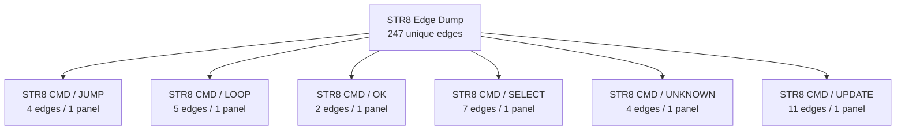

### Family Detail

#### ENTRY / unprefixed


#### STR8 / BANK

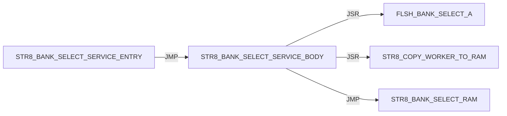

#### STR8 / BOOT

Panel 1 of 2: `STR8_BOOT_JUMP_BANK_A` through `STR8_BOOT_START`.

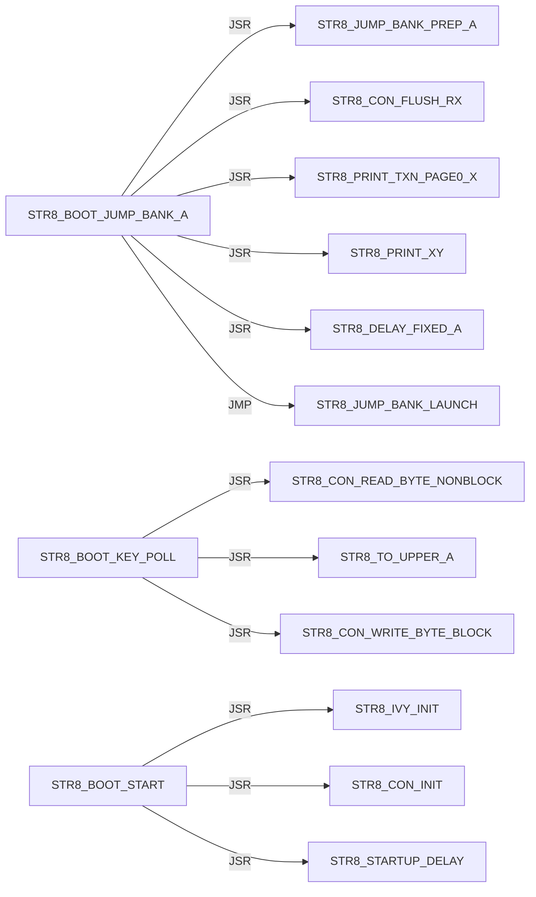

Panel 2 of 2: `STR8_BOOT_START` through `STR8_BOOT_START`.

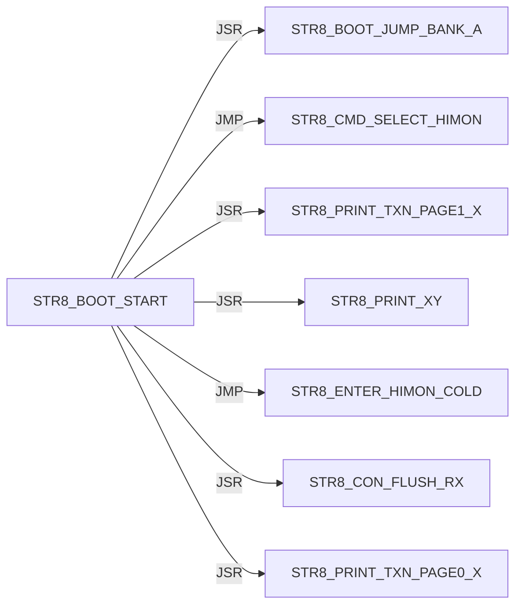

#### STR8 / CON

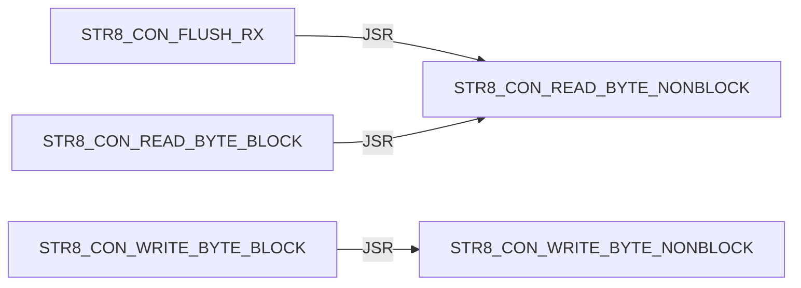

#### STR8 / CONFIRM

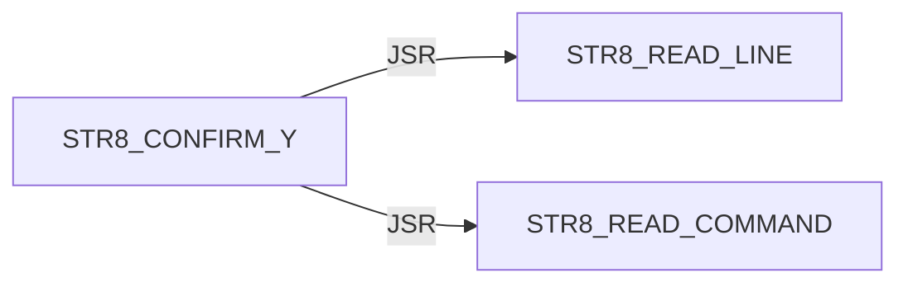

#### STR8 / DELAY


#### STR8 / DIR

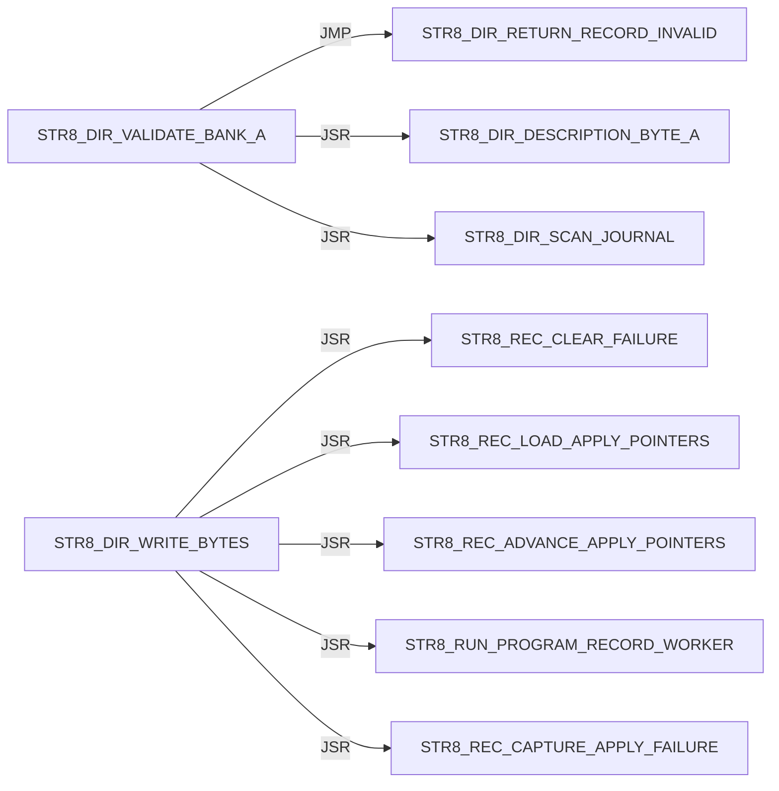

#### STR8 / DISPATCH

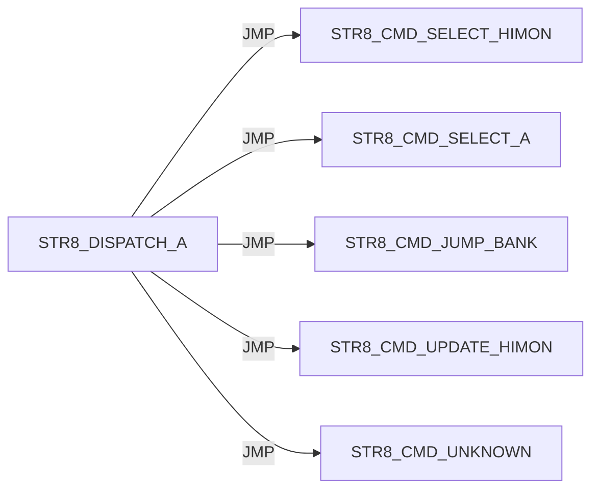

#### STR8 / ENTER

Panel 1 of 2: `STR8_ENTER_HIMON_COLD` through `STR8_ENTER_MENU_NO_TARGET_PRINT`.

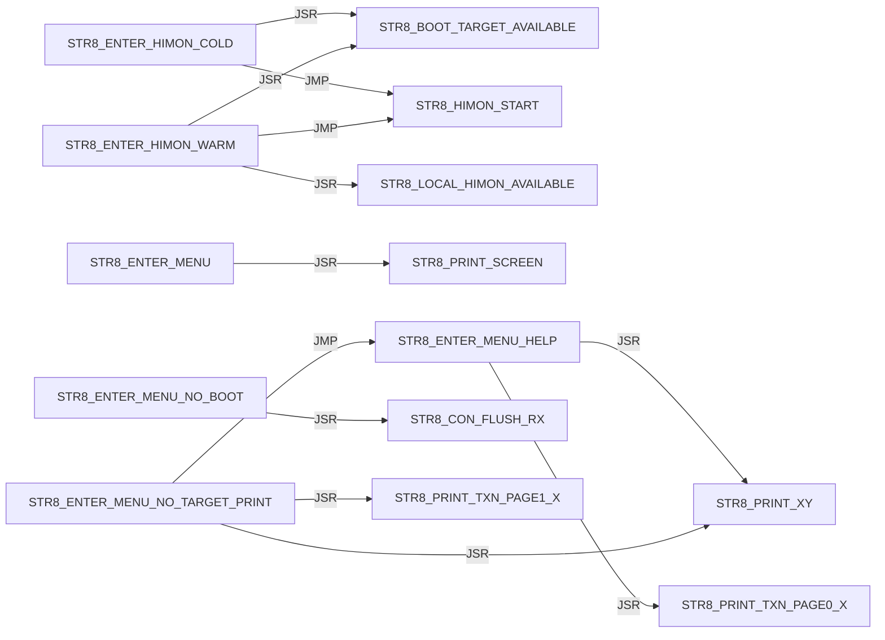

Panel 2 of 2: `STR8_ENTER_MENU_READY` through `STR8_ENTER_MENU_READY`.


#### STR8 / I

Panel 1 of 5: `STR8_I_BEGIN_TRANSACTION` through `STR8_I_PRINT_SUMMARY`.

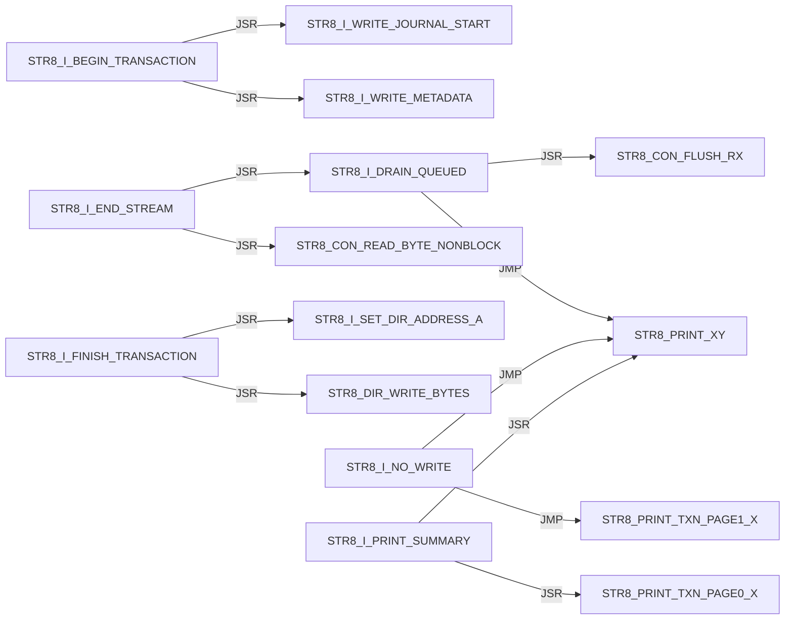

Panel 2 of 5: `STR8_I_PRINT_SUMMARY` through `STR8_I_PRINT_TRANSACTION_FAIL`.

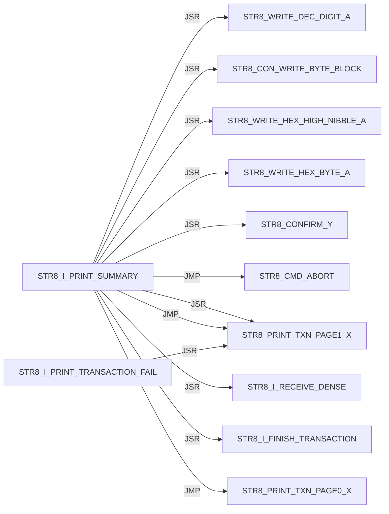

Panel 3 of 5: `STR8_I_PRINT_TRANSACTION_FAIL` through `STR8_I_READ_TYPE`.

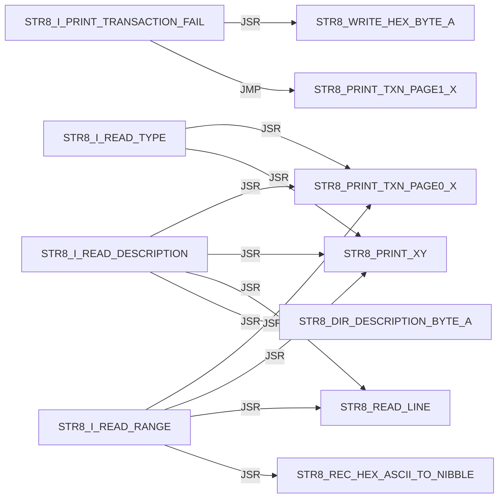

Panel 4 of 5: `STR8_I_READ_TYPE` through `STR8_I_RECEIVE_DENSE`.

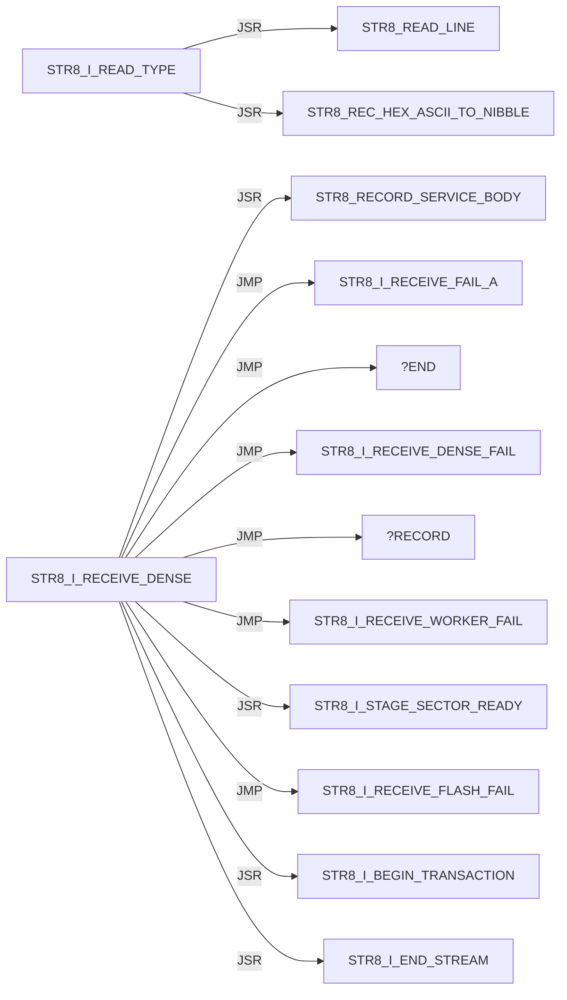

Panel 5 of 5: `STR8_I_RECEIVE_FAIL_A` through `STR8_I_WRITE_METADATA`.

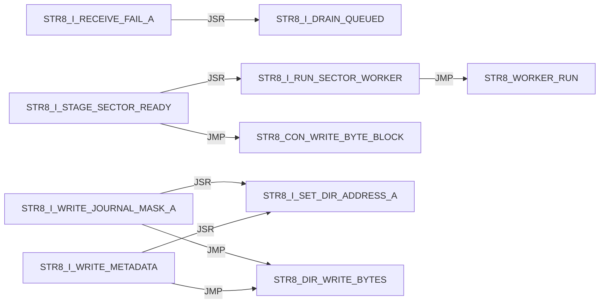

#### STR8 / IVY

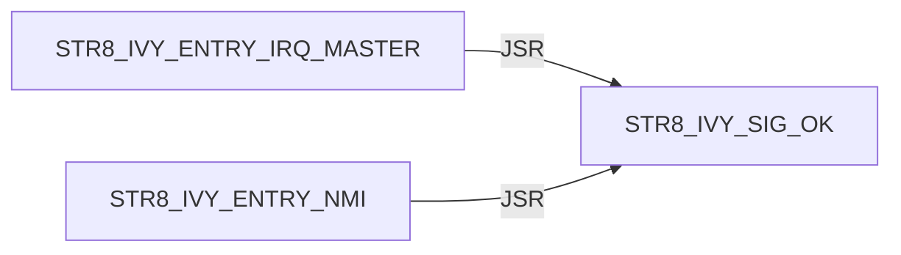

#### STR8 / JUMP

```mermaid
flowchart LR
    N0["STR8_JUMP_BANK_LAUNCH"] -->|JSR| N1["STR8_DIR_VALIDATE_BANK_A"]
    N0["STR8_JUMP_BANK_LAUNCH"] -->|JMP| N2["STR8_PRINT_JUMP_FAIL"]
    N0["STR8_JUMP_BANK_LAUNCH"] -->|JSR| N3["STR8_CON_FLUSH_RX"]
    N0["STR8_JUMP_BANK_LAUNCH"] -->|JSR| N4["STR8_JUMP_BANK_RAM"]
    N0["STR8_JUMP_BANK_LAUNCH"] -->|JSR| N5["STR8_COPY_WORKER_TO_RAM"]
    N0["STR8_JUMP_BANK_LAUNCH"] -->|JSR| N6["STR8_WORKER_RUN"]
    N7["STR8_JUMP_BANK_PREP_A"] -->|JSR| N8["STR8_PRINT_TXN_PAGE1_X"]
    N7["STR8_JUMP_BANK_PREP_A"] -->|JSR| N9["STR8_PRINT_XY"]
    N7["STR8_JUMP_BANK_PREP_A"] -->|JSR| N10["STR8_WRITE_DEC_DIGIT_A"]
    N4["STR8_JUMP_BANK_RAM"] -->|JSR| N11["FLSH_BANK_SELECT_A"]
    N4["STR8_JUMP_BANK_RAM"] -->|JSR| N12["FLSH_BANK_SELECT_3"]
```

#### STR8 / PRINT

```mermaid
flowchart LR
    N0["STR8_PRINT_COPY_FAIL"] -->|JSR| N1["STR8_PRINT_XY"]
    N0["STR8_PRINT_COPY_FAIL"] -->|JSR| N2["STR8_WRITE_HEX_BYTE_A"]
    N0["STR8_PRINT_COPY_FAIL"] -->|JMP| N1["STR8_PRINT_XY"]
    N3["STR8_PRINT_JUMP_FAIL"] -->|JSR| N4["STR8_PRINT_TXN_PAGE1_X"]
    N3["STR8_PRINT_JUMP_FAIL"] -->|JSR| N1["STR8_PRINT_XY"]
    N3["STR8_PRINT_JUMP_FAIL"] -->|JSR| N5["STR8_WRITE_DEC_DIGIT_A"]
    N3["STR8_PRINT_JUMP_FAIL"] -->|JSR| N2["STR8_WRITE_HEX_BYTE_A"]
    N3["STR8_PRINT_JUMP_FAIL"] -->|JMP| N1["STR8_PRINT_XY"]
    N6["STR8_PRINT_PROMPT"] -->|JMP| N1["STR8_PRINT_XY"]
    N7["STR8_PRINT_SCREEN"] -->|JSR| N1["STR8_PRINT_XY"]
    N7["STR8_PRINT_SCREEN"] -->|JMP| N1["STR8_PRINT_XY"]
    N1["STR8_PRINT_XY"] -->|JSR| N8["STR8_CON_WRITE_BYTE_BLOCK"]
```

#### STR8 / PROGRAM

```mermaid
flowchart LR
    N0["STR8_PROGRAM_HIMON_SECTOR_AX"] -->|JSR| N1["STR8_COPY_WORKER_TO_RAM"]
    N0["STR8_PROGRAM_HIMON_SECTOR_AX"] -->|JSR| N2["STR8_WORKER_RUN"]
    N0["STR8_PROGRAM_HIMON_SECTOR_AX"] -->|JSR| N3["STR8_CON_WRITE_BYTE_BLOCK"]
    N4["STR8_PROGRAM_HIMON_UPDATE"] -->|JSR| N0["STR8_PROGRAM_HIMON_SECTOR_AX"]
```

#### STR8 / READ

```mermaid
flowchart LR
    N0["STR8_READ_COMMAND"] -->|JSR| N1["STR8_CON_READ_BYTE_BLOCK"]
    N0["STR8_READ_COMMAND"] -->|JSR| N2["STR8_TO_UPPER_A"]
    N0["STR8_READ_COMMAND"] -->|JSR| N3["STR8_CON_WRITE_BYTE_BLOCK"]
    N4["STR8_READ_HIMON_S19"] -->|JSR| N5["STR8_RECORD_SERVICE_BODY"]
    N4["STR8_READ_HIMON_S19"] -->|JSR| N6["STR8_STAGE_HIMON_RECORD"]
    N4["STR8_READ_HIMON_S19"] -->|JSR| N3["STR8_CON_WRITE_BYTE_BLOCK"]
    N7["STR8_READ_LINE"] -->|JSR| N8["STR8_READ_TEXT_BYTE_BLOCK"]
    N7["STR8_READ_LINE"] -->|JSR| N2["STR8_TO_UPPER_A"]
    N7["STR8_READ_LINE"] -->|JSR| N3["STR8_CON_WRITE_BYTE_BLOCK"]
    N7["STR8_READ_LINE"] -->|JSR| N9["STR8_PRINT_TXN_PAGE1_X"]
    N7["STR8_READ_LINE"] -->|JSR| N10["STR8_PRINT_XY"]
    N8["STR8_READ_TEXT_BYTE_BLOCK"] -->|JSR| N1["STR8_CON_READ_BYTE_BLOCK"]
```

#### STR8 / REC

Panel 1 of 2: `STR8_REC_APPLY_LF` through `STR8_REC_PARSE`.

```mermaid
flowchart LR
    N0["STR8_REC_APPLY_LF"] -->|JSR| N1["STR8_REC_CLEAR_FAILURE"]
    N0["STR8_REC_APPLY_LF"] -->|JMP| N2["STR8_REC_FAIL_A"]
    N0["STR8_REC_APPLY_LF"] -->|JMP| N3["STR8_REC_RETURN_OK"]
    N0["STR8_REC_APPLY_LF"] -->|JSR| N4["STR8_REC_LOAD_APPLY_POINTERS"]
    N0["STR8_REC_APPLY_LF"] -->|JSR| N5["STR8_REC_CAPTURE_APPLY_FAILURE"]
    N0["STR8_REC_APPLY_LF"] -->|JSR| N6["STR8_REC_ADVANCE_APPLY_POINTERS"]
    N0["STR8_REC_APPLY_LF"] -->|JSR| N7["STR8_RUN_PROGRAM_RECORD_WORKER"]
    N8["STR8_REC_FAIL_READ_X"] -->|JMP| N9["STR8_REC_RETURN_CURRENT_FAIL"]
    N8["STR8_REC_FAIL_READ_X"] -->|JMP| N2["STR8_REC_FAIL_A"]
    N10["STR8_REC_PARSE"] -->|JSR| N11["STR8_REC_CLEAR_RESULT"]
    N10["STR8_REC_PARSE"] -->|JMP| N2["STR8_REC_FAIL_A"]
    N10["STR8_REC_PARSE"] -->|JSR| N12["STR8_REC_READ_CHAR"]
```

Panel 2 of 2: `STR8_REC_PARSE` through `STR8_REC_READ_SUM_BYTE`.

```mermaid
flowchart LR
    N0["STR8_REC_PARSE"] -->|JMP| N1["STR8_REC_FAIL_READ_START"]
    N0["STR8_REC_PARSE"] -->|JMP| N2["STR8_REC_FAIL_READ_TYPE"]
    N3["STR8_REC_PARSE_BODY"] -->|JSR| N4["STR8_REC_READ_SUM_BYTE"]
    N3["STR8_REC_PARSE_BODY"] -->|JMP| N5["STR8_REC_FAIL_A"]
    N3["STR8_REC_PARSE_BODY"] -->|JMP| N6["STR8_REC_FAIL_READ_HEX"]
    N3["STR8_REC_PARSE_BODY"] -->|JSR| N7["STR8_REC_READ_CHAR"]
    N3["STR8_REC_PARSE_BODY"] -->|JMP| N8["STR8_REC_RETURN_OK"]
    N7["STR8_REC_READ_CHAR"] -->|JSR| N9["STR8_READ_TEXT_BYTE_BLOCK"]
    N7["STR8_REC_READ_CHAR"] -->|JSR| N10["STR8_CON_READ_BYTE_BLOCK"]
    N11["STR8_REC_READ_HEX_BYTE"] -->|JSR| N7["STR8_REC_READ_CHAR"]
    N11["STR8_REC_READ_HEX_BYTE"] -->|JSR| N12["STR8_REC_HEX_ASCII_TO_NIBBLE"]
    N4["STR8_REC_READ_SUM_BYTE"] -->|JSR| N11["STR8_REC_READ_HEX_BYTE"]
```

#### STR8 / RECORD

```mermaid
flowchart LR
    N0["STR8_RECORD_SERVICE_BODY"] -->|JMP| N1["STR8_REC_APPLY_LF"]
    N0["STR8_RECORD_SERVICE_BODY"] -->|JMP| N2["STR8_REC_FAIL_A"]
    N3["STR8_RECORD_SERVICE_ENTRY"] -->|JMP| N0["STR8_RECORD_SERVICE_BODY"]
```

#### STR8 / RUN

```mermaid
flowchart LR
    N0["STR8_RUN_PROGRAM_RECORD_WORKER"] -->|JSR| N1["STR8_COPY_WORKER_TO_RAM"]
    N0["STR8_RUN_PROGRAM_RECORD_WORKER"] -->|JSR| N2["STR8_WORKER_RUN"]
    N3["STR8_RUN_WORKER_SERVICE"] -->|JMP| N4["STR8_RUN_WORKER_SERVICE_BODY"]
    N4["STR8_RUN_WORKER_SERVICE_BODY"] -->|JSR| N1["STR8_COPY_WORKER_TO_RAM"]
    N4["STR8_RUN_WORKER_SERVICE_BODY"] -->|JMP| N2["STR8_WORKER_RUN"]
```

#### STR8 / SELECT

```mermaid
flowchart LR
    N0["STR8_SELECT_BANK_3"] -->|JSR| N1["FLSH_BANK_SELECT_3"]
```

#### STR8 / STARTUP

```mermaid
flowchart LR
    N0["STR8_STARTUP_DELAY"] -->|JSR| N1["STR8_CON_WRITE_BYTE_BLOCK"]
    N0["STR8_STARTUP_DELAY"] -->|JSR| N2["STR8_PRINT_TXN_PAGE0_X"]
    N0["STR8_STARTUP_DELAY"] -->|JSR| N3["STR8_PRINT_XY"]
    N0["STR8_STARTUP_DELAY"] -->|JSR| N4["STR8_CON_FLUSH_RX"]
    N0["STR8_STARTUP_DELAY"] -->|JSR| N5["STR8_PRINT_TXN_PAGE1_X"]
    N0["STR8_STARTUP_DELAY"] -->|JSR| N6["STR8_DELAY_FIXED_A"]
    N0["STR8_STARTUP_DELAY"] -->|JSR| N7["STR8_BOOT_KEY_POLL_IF_ENABLED"]
```

#### STR8 / WRITE

```mermaid
flowchart LR
    N0["STR8_WRITE_DEC_DIGIT_A"] -->|JMP| N1["STR8_CON_WRITE_BYTE_BLOCK"]
    N2["STR8_WRITE_HEX_BYTE_A"] -->|JSR| N3["STR8_WRITE_HEX_NIBBLE_A"]
    N3["STR8_WRITE_HEX_NIBBLE_A"] -->|JMP| N1["STR8_CON_WRITE_BYTE_BLOCK"]
```

#### STR8 CMD / ABORT

```mermaid
flowchart LR
    N0["STR8_CMD_ABORT"] -->|JSR| N1["STR8_SELECT_BANK_3"]
    N0["STR8_CMD_ABORT"] -->|JMP| N2["STR8_PRINT_TXN_PAGE0_X"]
    N0["STR8_CMD_ABORT"] -->|JMP| N3["STR8_PRINT_XY"]
```

#### STR8 CMD / COPY

```mermaid
flowchart LR
    N0["STR8_CMD_COPY_FAIL"] -->|JSR| N1["STR8_SELECT_BANK_3"]
    N0["STR8_CMD_COPY_FAIL"] -->|JMP| N2["STR8_PRINT_COPY_FAIL"]
```

#### STR8 CMD / INSTALL

Panel 1 of 2: `STR8_CMD_INSTALL_PREVIEW` through `STR8_CMD_INSTALL_PREVIEW`.

```mermaid
flowchart LR
    N0["STR8_CMD_INSTALL_PREVIEW"] -->|JMP| N1["STR8_CMD_UNKNOWN"]
    N0["STR8_CMD_INSTALL_PREVIEW"] -->|JSR| N2["STR8_PRINT_TXN_PAGE0_X"]
    N0["STR8_CMD_INSTALL_PREVIEW"] -->|JSR| N3["STR8_PRINT_XY"]
    N0["STR8_CMD_INSTALL_PREVIEW"] -->|JSR| N4["STR8_READ_LINE"]
    N0["STR8_CMD_INSTALL_PREVIEW"] -->|JMP| N5["STR8_CMD_ABORT"]
    N0["STR8_CMD_INSTALL_PREVIEW"] -->|JSR| N6["STR8_I_READ_RANGE"]
    N0["STR8_CMD_INSTALL_PREVIEW"] -->|JSR| N7["STR8_DIR_VALIDATE_BANK_A"]
    N0["STR8_CMD_INSTALL_PREVIEW"] -->|JSR| N8["STR8_I_READ_TYPE"]
    N0["STR8_CMD_INSTALL_PREVIEW"] -->|JSR| N9["STR8_I_READ_DESCRIPTION"]
    N0["STR8_CMD_INSTALL_PREVIEW"] -->|JMP| N10["STR8_I_PRINT_SUMMARY"]
    N0["STR8_CMD_INSTALL_PREVIEW"] -->|JSR| N11["STR8_I_COPY_RECORD_METADATA"]
    N0["STR8_CMD_INSTALL_PREVIEW"] -->|JMP| N2["STR8_PRINT_TXN_PAGE0_X"]
```

Panel 2 of 2: `STR8_CMD_INSTALL_PREVIEW` through `STR8_CMD_INSTALL_PREVIEW`.

```mermaid
flowchart LR
    N0["STR8_CMD_INSTALL_PREVIEW"] -->|JMP| N1["STR8_PRINT_XY"]
```

#### STR8 CMD / JUMP

```mermaid
flowchart LR
    N0["STR8_CMD_JUMP_BANK"] -->|JSR| N1["STR8_READ_COMMAND"]
    N0["STR8_CMD_JUMP_BANK"] -->|JMP| N2["STR8_CMD_ABORT"]
    N0["STR8_CMD_JUMP_BANK"] -->|JSR| N3["STR8_JUMP_BANK_PREP_A"]
    N0["STR8_CMD_JUMP_BANK"] -->|JMP| N4["STR8_JUMP_BANK_LAUNCH"]
```

#### STR8 CMD / LOOP

```mermaid
flowchart LR
    N0["STR8_CMD_LOOP"] -->|JSR| N1["STR8_PRINT_PROMPT"]
    N0["STR8_CMD_LOOP"] -->|JSR| N2["STR8_READ_LINE"]
    N0["STR8_CMD_LOOP"] -->|JSR| N3["STR8_CMD_ABORT"]
    N0["STR8_CMD_LOOP"] -->|JSR| N4["STR8_READ_COMMAND"]
    N0["STR8_CMD_LOOP"] -->|JSR| N5["STR8_DISPATCH_A"]
```

#### STR8 CMD / OK

```mermaid
flowchart LR
    N0["STR8_CMD_OK"] -->|JSR| N1["STR8_SELECT_BANK_3"]
    N0["STR8_CMD_OK"] -->|JMP| N2["STR8_PRINT_XY"]
```

#### STR8 CMD / SELECT

```mermaid
flowchart LR
    N0["STR8_CMD_SELECT_A"] -->|JSR| N1["STR8_JUMP_BANK_PREP_A"]
    N0["STR8_CMD_SELECT_A"] -->|JMP| N2["STR8_JUMP_BANK_LAUNCH"]
    N3["STR8_CMD_SELECT_HIMON"] -->|JSR| N4["STR8_SELECT_BANK_3"]
    N3["STR8_CMD_SELECT_HIMON"] -->|JSR| N5["STR8_CON_FLUSH_RX"]
    N3["STR8_CMD_SELECT_HIMON"] -->|JSR| N6["STR8_PRINT_TXN_PAGE1_X"]
    N3["STR8_CMD_SELECT_HIMON"] -->|JSR| N7["STR8_PRINT_XY"]
    N3["STR8_CMD_SELECT_HIMON"] -->|JMP| N8["STR8_ENTER_HIMON_WARM"]
```

#### STR8 CMD / UNKNOWN

```mermaid
flowchart LR
    N0["STR8_CMD_UNKNOWN"] -->|JSR| N1["STR8_PRINT_TXN_PAGE1_X"]
    N0["STR8_CMD_UNKNOWN"] -->|JSR| N2["STR8_PRINT_XY"]
    N0["STR8_CMD_UNKNOWN"] -->|JMP| N3["STR8_PRINT_TXN_PAGE0_X"]
    N0["STR8_CMD_UNKNOWN"] -->|JMP| N2["STR8_PRINT_XY"]
```

#### STR8 CMD / UPDATE

```mermaid
flowchart LR
    N0["STR8_CMD_UPDATE_HIMON"] -->|JMP| N1["STR8_PRINT_XY"]
    N0["STR8_CMD_UPDATE_HIMON"] -->|JSR| N1["STR8_PRINT_XY"]
    N0["STR8_CMD_UPDATE_HIMON"] -->|JSR| N2["STR8_CONFIRM_Y"]
    N0["STR8_CMD_UPDATE_HIMON"] -->|JSR| N3["STR8_STAGE_HIMON_BLANK"]
    N0["STR8_CMD_UPDATE_HIMON"] -->|JSR| N4["STR8_UPD_INIT"]
    N0["STR8_CMD_UPDATE_HIMON"] -->|JSR| N5["STR8_READ_HIMON_S19"]
    N0["STR8_CMD_UPDATE_HIMON"] -->|JSR| N6["STR8_PROGRAM_HIMON_UPDATE"]
    N0["STR8_CMD_UPDATE_HIMON"] -->|JMP| N7["STR8_CMD_OK"]
    N8["STR8_CMD_UPDATE_NO_DATA"] -->|JMP| N1["STR8_PRINT_XY"]
    N9["STR8_CMD_UPDATE_S19_FAIL"] -->|JSR| N10["STR8_CON_FLUSH_RX"]
    N9["STR8_CMD_UPDATE_S19_FAIL"] -->|JMP| N1["STR8_PRINT_XY"]
```

## External Targets

These targets are not labels in this source file; most are `XREF` providers from sibling ROM modules.

```text
FLSH_BANK_SELECT_3
FLSH_BANK_SELECT_A
STR8_BANK_SELECT_RAM
STR8_HIMON_START
STR8_WORKER_RUN
UTL_DELAY_AXY_8MHZ
```

## Unique Direct Edges By Source Label

Each block is one source label. Indented lines are outgoing direct edges.
Blank lines are source-level breaks; they do not imply call depth.

```text
START
    JMP STR8_BOOT_START

STR8_BANK_SELECT_SERVICE_BODY
    JSR FLSH_BANK_SELECT_A
    JSR STR8_COPY_WORKER_TO_RAM
    JMP STR8_BANK_SELECT_RAM

STR8_BANK_SELECT_SERVICE_ENTRY
    JMP STR8_BANK_SELECT_SERVICE_BODY

STR8_BOOT_JUMP_BANK_A
    JSR STR8_JUMP_BANK_PREP_A
    JSR STR8_CON_FLUSH_RX
    JSR STR8_PRINT_TXN_PAGE0_X
    JSR STR8_PRINT_XY
    JSR STR8_DELAY_FIXED_A
    JMP STR8_JUMP_BANK_LAUNCH

STR8_BOOT_KEY_POLL
    JSR STR8_CON_READ_BYTE_NONBLOCK
    JSR STR8_TO_UPPER_A
    JSR STR8_CON_WRITE_BYTE_BLOCK

STR8_BOOT_START
    JSR STR8_IVY_INIT
    JSR STR8_CON_INIT
    JSR STR8_STARTUP_DELAY
    JSR STR8_BOOT_JUMP_BANK_A
    JMP STR8_CMD_SELECT_HIMON
    JSR STR8_PRINT_TXN_PAGE1_X
    JSR STR8_PRINT_XY
    JMP STR8_ENTER_HIMON_COLD
    JSR STR8_CON_FLUSH_RX
    JSR STR8_PRINT_TXN_PAGE0_X

STR8_CMD_ABORT
    JSR STR8_SELECT_BANK_3
    JMP STR8_PRINT_TXN_PAGE0_X
    JMP STR8_PRINT_XY

STR8_CMD_COPY_FAIL
    JSR STR8_SELECT_BANK_3
    JMP STR8_PRINT_COPY_FAIL

STR8_CMD_INSTALL_PREVIEW
    JMP STR8_CMD_UNKNOWN
    JSR STR8_PRINT_TXN_PAGE0_X
    JSR STR8_PRINT_XY
    JSR STR8_READ_LINE
    JMP STR8_CMD_ABORT
    JSR STR8_I_READ_RANGE
    JSR STR8_DIR_VALIDATE_BANK_A
    JSR STR8_I_READ_TYPE
    JSR STR8_I_READ_DESCRIPTION
    JMP STR8_I_PRINT_SUMMARY
    JSR STR8_I_COPY_RECORD_METADATA
    JMP STR8_PRINT_TXN_PAGE0_X
    JMP STR8_PRINT_XY

STR8_CMD_JUMP_BANK
    JSR STR8_READ_COMMAND
    JMP STR8_CMD_ABORT
    JSR STR8_JUMP_BANK_PREP_A
    JMP STR8_JUMP_BANK_LAUNCH

STR8_CMD_LOOP
    JSR STR8_PRINT_PROMPT
    JSR STR8_READ_LINE
    JSR STR8_CMD_ABORT
    JSR STR8_READ_COMMAND
    JSR STR8_DISPATCH_A

STR8_CMD_OK
    JSR STR8_SELECT_BANK_3
    JMP STR8_PRINT_XY

STR8_CMD_SELECT_A
    JSR STR8_JUMP_BANK_PREP_A
    JMP STR8_JUMP_BANK_LAUNCH

STR8_CMD_SELECT_HIMON
    JSR STR8_SELECT_BANK_3
    JSR STR8_CON_FLUSH_RX
    JSR STR8_PRINT_TXN_PAGE1_X
    JSR STR8_PRINT_XY
    JMP STR8_ENTER_HIMON_WARM

STR8_CMD_UNKNOWN
    JSR STR8_PRINT_TXN_PAGE1_X
    JSR STR8_PRINT_XY
    JMP STR8_PRINT_TXN_PAGE0_X
    JMP STR8_PRINT_XY

STR8_CMD_UPDATE_HIMON
    JMP STR8_PRINT_XY
    JSR STR8_PRINT_XY
    JSR STR8_CONFIRM_Y
    JSR STR8_STAGE_HIMON_BLANK
    JSR STR8_UPD_INIT
    JSR STR8_READ_HIMON_S19
    JSR STR8_PROGRAM_HIMON_UPDATE
    JMP STR8_CMD_OK

STR8_CMD_UPDATE_NO_DATA
    JMP STR8_PRINT_XY

STR8_CMD_UPDATE_S19_FAIL
    JSR STR8_CON_FLUSH_RX
    JMP STR8_PRINT_XY

STR8_CON_FLUSH_RX
    JSR STR8_CON_READ_BYTE_NONBLOCK

STR8_CON_READ_BYTE_BLOCK
    JSR STR8_CON_READ_BYTE_NONBLOCK

STR8_CON_WRITE_BYTE_BLOCK
    JSR STR8_CON_WRITE_BYTE_NONBLOCK

STR8_CONFIRM_Y
    JSR STR8_READ_LINE
    JSR STR8_READ_COMMAND

STR8_DELAY_FIXED_A
    JMP UTL_DELAY_AXY_8MHZ

STR8_DIR_VALIDATE_BANK_A
    JMP STR8_DIR_RETURN_RECORD_INVALID
    JSR STR8_DIR_DESCRIPTION_BYTE_A
    JSR STR8_DIR_SCAN_JOURNAL

STR8_DIR_WRITE_BYTES
    JSR STR8_REC_CLEAR_FAILURE
    JSR STR8_REC_LOAD_APPLY_POINTERS
    JSR STR8_REC_ADVANCE_APPLY_POINTERS
    JSR STR8_RUN_PROGRAM_RECORD_WORKER
    JSR STR8_REC_CAPTURE_APPLY_FAILURE

STR8_DISPATCH_A
    JMP STR8_CMD_SELECT_HIMON
    JMP STR8_CMD_SELECT_A
    JMP STR8_CMD_JUMP_BANK
    JMP STR8_CMD_UPDATE_HIMON
    JMP STR8_CMD_UNKNOWN

STR8_ENTER_HIMON_COLD
    JSR STR8_BOOT_TARGET_AVAILABLE
    JMP STR8_HIMON_START

STR8_ENTER_HIMON_WARM
    JSR STR8_LOCAL_HIMON_AVAILABLE
    JSR STR8_BOOT_TARGET_AVAILABLE
    JMP STR8_HIMON_START

STR8_ENTER_MENU
    JSR STR8_PRINT_SCREEN

STR8_ENTER_MENU_HELP
    JSR STR8_PRINT_TXN_PAGE0_X
    JSR STR8_PRINT_XY

STR8_ENTER_MENU_NO_BOOT
    JSR STR8_CON_FLUSH_RX

STR8_ENTER_MENU_NO_TARGET_PRINT
    JSR STR8_PRINT_TXN_PAGE1_X
    JSR STR8_PRINT_XY
    JMP STR8_ENTER_MENU_HELP

STR8_ENTER_MENU_READY
    JMP STR8_CMD_LOOP

STR8_I_BEGIN_TRANSACTION
    JSR STR8_I_WRITE_JOURNAL_START
    JSR STR8_I_WRITE_METADATA

STR8_I_DRAIN_QUEUED
    JSR STR8_CON_FLUSH_RX
    JMP STR8_PRINT_XY

STR8_I_END_STREAM
    JSR STR8_CON_READ_BYTE_NONBLOCK
    JSR STR8_I_DRAIN_QUEUED

STR8_I_FINISH_TRANSACTION
    JSR STR8_I_SET_DIR_ADDRESS_A
    JSR STR8_DIR_WRITE_BYTES

STR8_I_NO_WRITE
    JMP STR8_PRINT_TXN_PAGE1_X
    JMP STR8_PRINT_XY

STR8_I_PRINT_SUMMARY
    JSR STR8_PRINT_TXN_PAGE0_X
    JSR STR8_PRINT_XY
    JSR STR8_WRITE_DEC_DIGIT_A
    JSR STR8_CON_WRITE_BYTE_BLOCK
    JSR STR8_WRITE_HEX_HIGH_NIBBLE_A
    JSR STR8_WRITE_HEX_BYTE_A
    JSR STR8_CONFIRM_Y
    JMP STR8_CMD_ABORT
    JSR STR8_PRINT_TXN_PAGE1_X
    JSR STR8_I_RECEIVE_DENSE
    JSR STR8_I_FINISH_TRANSACTION
    JMP STR8_PRINT_TXN_PAGE0_X
    JMP STR8_PRINT_TXN_PAGE1_X

STR8_I_PRINT_TRANSACTION_FAIL
    JSR STR8_PRINT_TXN_PAGE1_X
    JSR STR8_WRITE_HEX_BYTE_A
    JMP STR8_PRINT_TXN_PAGE1_X

STR8_I_READ_DESCRIPTION
    JSR STR8_PRINT_TXN_PAGE0_X
    JSR STR8_PRINT_XY
    JSR STR8_READ_LINE
    JSR STR8_DIR_DESCRIPTION_BYTE_A

STR8_I_READ_RANGE
    JSR STR8_PRINT_TXN_PAGE0_X
    JSR STR8_PRINT_XY
    JSR STR8_READ_LINE
    JSR STR8_REC_HEX_ASCII_TO_NIBBLE

STR8_I_READ_TYPE
    JSR STR8_PRINT_TXN_PAGE0_X
    JSR STR8_PRINT_XY
    JSR STR8_READ_LINE
    JSR STR8_REC_HEX_ASCII_TO_NIBBLE

STR8_I_RECEIVE_DENSE
    JSR STR8_RECORD_SERVICE_BODY
    JMP STR8_I_RECEIVE_FAIL_A
    JMP ?END
    JMP STR8_I_RECEIVE_DENSE_FAIL
    JMP ?RECORD
    JMP STR8_I_RECEIVE_WORKER_FAIL
    JSR STR8_I_STAGE_SECTOR_READY
    JMP STR8_I_RECEIVE_FLASH_FAIL
    JSR STR8_I_BEGIN_TRANSACTION
    JSR STR8_I_END_STREAM

STR8_I_RECEIVE_FAIL_A
    JSR STR8_I_DRAIN_QUEUED

STR8_I_RUN_SECTOR_WORKER
    JMP STR8_WORKER_RUN

STR8_I_STAGE_SECTOR_READY
    JSR STR8_I_RUN_SECTOR_WORKER
    JMP STR8_CON_WRITE_BYTE_BLOCK

STR8_I_WRITE_JOURNAL_MASK_A
    JSR STR8_I_SET_DIR_ADDRESS_A
    JMP STR8_DIR_WRITE_BYTES

STR8_I_WRITE_METADATA
    JSR STR8_I_SET_DIR_ADDRESS_A
    JMP STR8_DIR_WRITE_BYTES

STR8_IVY_ENTRY_IRQ_MASTER
    JSR STR8_IVY_SIG_OK

STR8_IVY_ENTRY_NMI
    JSR STR8_IVY_SIG_OK

STR8_JUMP_BANK_LAUNCH
    JSR STR8_DIR_VALIDATE_BANK_A
    JMP STR8_PRINT_JUMP_FAIL
    JSR STR8_CON_FLUSH_RX
    JSR STR8_JUMP_BANK_RAM
    JSR STR8_COPY_WORKER_TO_RAM
    JSR STR8_WORKER_RUN

STR8_JUMP_BANK_PREP_A
    JSR STR8_PRINT_TXN_PAGE1_X
    JSR STR8_PRINT_XY
    JSR STR8_WRITE_DEC_DIGIT_A

STR8_JUMP_BANK_RAM
    JSR FLSH_BANK_SELECT_A
    JSR FLSH_BANK_SELECT_3

STR8_PRINT_COPY_FAIL
    JSR STR8_PRINT_XY
    JSR STR8_WRITE_HEX_BYTE_A
    JMP STR8_PRINT_XY

STR8_PRINT_JUMP_FAIL
    JSR STR8_PRINT_TXN_PAGE1_X
    JSR STR8_PRINT_XY
    JSR STR8_WRITE_DEC_DIGIT_A
    JSR STR8_WRITE_HEX_BYTE_A
    JMP STR8_PRINT_XY

STR8_PRINT_PROMPT
    JMP STR8_PRINT_XY

STR8_PRINT_SCREEN
    JSR STR8_PRINT_XY
    JMP STR8_PRINT_XY

STR8_PRINT_XY
    JSR STR8_CON_WRITE_BYTE_BLOCK

STR8_PROGRAM_HIMON_SECTOR_AX
    JSR STR8_COPY_WORKER_TO_RAM
    JSR STR8_WORKER_RUN
    JSR STR8_CON_WRITE_BYTE_BLOCK

STR8_PROGRAM_HIMON_UPDATE
    JSR STR8_PROGRAM_HIMON_SECTOR_AX

STR8_READ_COMMAND
    JSR STR8_CON_READ_BYTE_BLOCK
    JSR STR8_TO_UPPER_A
    JSR STR8_CON_WRITE_BYTE_BLOCK

STR8_READ_HIMON_S19
    JSR STR8_RECORD_SERVICE_BODY
    JSR STR8_STAGE_HIMON_RECORD
    JSR STR8_CON_WRITE_BYTE_BLOCK

STR8_READ_LINE
    JSR STR8_READ_TEXT_BYTE_BLOCK
    JSR STR8_TO_UPPER_A
    JSR STR8_CON_WRITE_BYTE_BLOCK
    JSR STR8_PRINT_TXN_PAGE1_X
    JSR STR8_PRINT_XY

STR8_READ_TEXT_BYTE_BLOCK
    JSR STR8_CON_READ_BYTE_BLOCK

STR8_REC_APPLY_LF
    JSR STR8_REC_CLEAR_FAILURE
    JMP STR8_REC_FAIL_A
    JMP STR8_REC_RETURN_OK
    JSR STR8_REC_LOAD_APPLY_POINTERS
    JSR STR8_REC_CAPTURE_APPLY_FAILURE
    JSR STR8_REC_ADVANCE_APPLY_POINTERS
    JSR STR8_RUN_PROGRAM_RECORD_WORKER

STR8_REC_FAIL_READ_X
    JMP STR8_REC_RETURN_CURRENT_FAIL
    JMP STR8_REC_FAIL_A

STR8_REC_PARSE
    JSR STR8_REC_CLEAR_RESULT
    JMP STR8_REC_FAIL_A
    JSR STR8_REC_READ_CHAR
    JMP STR8_REC_FAIL_READ_START
    JMP STR8_REC_FAIL_READ_TYPE

STR8_REC_PARSE_BODY
    JSR STR8_REC_READ_SUM_BYTE
    JMP STR8_REC_FAIL_A
    JMP STR8_REC_FAIL_READ_HEX
    JSR STR8_REC_READ_CHAR
    JMP STR8_REC_RETURN_OK

STR8_REC_READ_CHAR
    JSR STR8_READ_TEXT_BYTE_BLOCK
    JSR STR8_CON_READ_BYTE_BLOCK

STR8_REC_READ_HEX_BYTE
    JSR STR8_REC_READ_CHAR
    JSR STR8_REC_HEX_ASCII_TO_NIBBLE

STR8_REC_READ_SUM_BYTE
    JSR STR8_REC_READ_HEX_BYTE

STR8_RECORD_SERVICE_BODY
    JMP STR8_REC_APPLY_LF
    JMP STR8_REC_FAIL_A

STR8_RECORD_SERVICE_ENTRY
    JMP STR8_RECORD_SERVICE_BODY

STR8_RUN_PROGRAM_RECORD_WORKER
    JSR STR8_COPY_WORKER_TO_RAM
    JSR STR8_WORKER_RUN

STR8_RUN_WORKER_SERVICE
    JMP STR8_RUN_WORKER_SERVICE_BODY

STR8_RUN_WORKER_SERVICE_BODY
    JSR STR8_COPY_WORKER_TO_RAM
    JMP STR8_WORKER_RUN

STR8_SELECT_BANK_3
    JSR FLSH_BANK_SELECT_3

STR8_STARTUP_DELAY
    JSR STR8_CON_WRITE_BYTE_BLOCK
    JSR STR8_PRINT_TXN_PAGE0_X
    JSR STR8_PRINT_XY
    JSR STR8_CON_FLUSH_RX
    JSR STR8_PRINT_TXN_PAGE1_X
    JSR STR8_DELAY_FIXED_A
    JSR STR8_BOOT_KEY_POLL_IF_ENABLED

STR8_WRITE_DEC_DIGIT_A
    JMP STR8_CON_WRITE_BYTE_BLOCK

STR8_WRITE_HEX_BYTE_A
    JSR STR8_WRITE_HEX_NIBBLE_A

STR8_WRITE_HEX_NIBBLE_A
    JMP STR8_CON_WRITE_BYTE_BLOCK

```

## Raw Direct Edge Sites By Source Label

Each line is a direct call/jump site with source line number.

```text
START
      203  JMP STR8_BOOT_START

STR8_BANK_SELECT_SERVICE_BODY
     1757  JSR FLSH_BANK_SELECT_A
     1768  JSR STR8_COPY_WORKER_TO_RAM
     1770  JMP STR8_BANK_SELECT_RAM

STR8_BANK_SELECT_SERVICE_ENTRY
      232  JMP STR8_BANK_SELECT_SERVICE_BODY

STR8_BOOT_JUMP_BANK_A
     1675  JSR STR8_JUMP_BANK_PREP_A
     1676  JSR STR8_CON_FLUSH_RX
     1679  JSR STR8_PRINT_TXN_PAGE0_X
     1682  JSR STR8_PRINT_XY
     1685  JSR STR8_DELAY_FIXED_A
     1689  JMP STR8_JUMP_BANK_LAUNCH

STR8_BOOT_KEY_POLL
      550  JSR STR8_CON_READ_BYTE_NONBLOCK
      552  JSR STR8_TO_UPPER_A
      570  JSR STR8_CON_WRITE_BYTE_BLOCK

STR8_BOOT_START
      239  JSR STR8_IVY_INIT
      240  JSR STR8_CON_INIT
      243  JSR STR8_STARTUP_DELAY
      254  JSR STR8_BOOT_JUMP_BANK_A
      256  JMP STR8_CMD_SELECT_HIMON
      260  JSR STR8_PRINT_TXN_PAGE1_X
      263  JSR STR8_PRINT_XY
      265  JMP STR8_ENTER_HIMON_COLD
      266  JSR STR8_CON_FLUSH_RX
      269  JSR STR8_PRINT_TXN_PAGE0_X
      272  JSR STR8_PRINT_XY

STR8_CMD_ABORT
     1637  JSR STR8_SELECT_BANK_3
     1641  JMP STR8_PRINT_TXN_PAGE0_X
     1644  JMP STR8_PRINT_XY

STR8_CMD_COPY_FAIL
     1651  JSR STR8_SELECT_BANK_3
     1653  JMP STR8_PRINT_COPY_FAIL

STR8_CMD_INSTALL_PREVIEW
      748  JMP STR8_CMD_UNKNOWN
      752  JSR STR8_PRINT_TXN_PAGE0_X
      755  JSR STR8_PRINT_XY
      758  JSR STR8_READ_LINE
      761  JMP STR8_CMD_ABORT
      770  JSR STR8_I_READ_RANGE
      773  JSR STR8_DIR_VALIDATE_BANK_A
      782  JSR STR8_I_READ_TYPE
      784  JSR STR8_I_READ_DESCRIPTION
      786  JMP STR8_I_PRINT_SUMMARY
      787  JSR STR8_I_COPY_RECORD_METADATA
      788  JMP STR8_I_PRINT_SUMMARY
      791  JMP STR8_PRINT_TXN_PAGE0_X
      794  JMP STR8_PRINT_XY
      796  JMP STR8_CMD_UNKNOWN

STR8_CMD_JUMP_BANK
     1528  JSR STR8_READ_COMMAND
     1531  JMP STR8_CMD_ABORT
     1541  JSR STR8_JUMP_BANK_PREP_A
     1545  JMP STR8_JUMP_BANK_LAUNCH

STR8_CMD_LOOP
      587  JSR STR8_PRINT_PROMPT
      590  JSR STR8_READ_LINE
      594  JSR STR8_CMD_ABORT
      597  JSR STR8_READ_COMMAND
      600  JSR STR8_CMD_ABORT
      604  JSR STR8_DISPATCH_A

STR8_CMD_OK
     1628  JSR STR8_SELECT_BANK_3
     1632  JMP STR8_PRINT_XY

STR8_CMD_SELECT_A
     1557  JSR STR8_JUMP_BANK_PREP_A
     1558  JMP STR8_JUMP_BANK_LAUNCH

STR8_CMD_SELECT_HIMON
     1565  JSR STR8_SELECT_BANK_3
     1567  JSR STR8_CON_FLUSH_RX
     1570  JSR STR8_PRINT_TXN_PAGE1_X
     1573  JSR STR8_PRINT_XY
     1575  JMP STR8_ENTER_HIMON_WARM

STR8_CMD_UNKNOWN
     1659  JSR STR8_PRINT_TXN_PAGE1_X
     1662  JSR STR8_PRINT_XY
     1666  JMP STR8_PRINT_TXN_PAGE0_X
     1669  JMP STR8_PRINT_XY

STR8_CMD_UPDATE_HIMON
     1584  JMP STR8_PRINT_XY
     1588  JSR STR8_PRINT_XY
     1589  JSR STR8_CONFIRM_Y
     1591  JSR STR8_STAGE_HIMON_BLANK
     1592  JSR STR8_UPD_INIT
     1595  JSR STR8_PRINT_XY
     1596  JSR STR8_READ_HIMON_S19
     1602  JSR STR8_PRINT_XY
     1603  JSR STR8_CONFIRM_Y
     1605  JSR STR8_PROGRAM_HIMON_UPDATE
     1607  JMP STR8_CMD_OK

STR8_CMD_UPDATE_NO_DATA
     1619  JMP STR8_PRINT_XY

STR8_CMD_UPDATE_S19_FAIL
     1611  JSR STR8_CON_FLUSH_RX
     1614  JMP STR8_PRINT_XY

STR8_CON_FLUSH_RX
     2926  JSR STR8_CON_READ_BYTE_NONBLOCK

STR8_CON_READ_BYTE_BLOCK
     2936  JSR STR8_CON_READ_BYTE_NONBLOCK

STR8_CON_WRITE_BYTE_BLOCK
     2962  JSR STR8_CON_WRITE_BYTE_NONBLOCK

STR8_CONFIRM_Y
     2533  JSR STR8_READ_LINE
     2544  JSR STR8_READ_COMMAND

STR8_DELAY_FIXED_A
      539  JMP UTL_DELAY_AXY_8MHZ

STR8_DIR_VALIDATE_BANK_A
     1799  JMP STR8_DIR_RETURN_RECORD_INVALID
     1837  JSR STR8_DIR_DESCRIPTION_BYTE_A
     1864  JSR STR8_DIR_SCAN_JOURNAL

STR8_DIR_WRITE_BYTES
     1971  JSR STR8_REC_CLEAR_FAILURE
     1988  JSR STR8_REC_LOAD_APPLY_POINTERS
     1995  JSR STR8_REC_ADVANCE_APPLY_POINTERS
     1999  JSR STR8_RUN_PROGRAM_RECORD_WORKER
     2002  JSR STR8_REC_LOAD_APPLY_POINTERS
     2008  JSR STR8_REC_ADVANCE_APPLY_POINTERS
     2024  JSR STR8_REC_CAPTURE_APPLY_FAILURE
     2029  JSR STR8_REC_CAPTURE_APPLY_FAILURE

STR8_DISPATCH_A
      714  JMP STR8_CMD_SELECT_HIMON
      720  JMP STR8_CMD_SELECT_A
      731  JMP STR8_CMD_JUMP_BANK
      737  JMP STR8_CMD_UPDATE_HIMON
      740  JMP STR8_CMD_UNKNOWN

STR8_ENTER_HIMON_COLD
      384  JSR STR8_BOOT_TARGET_AVAILABLE
      390  JMP STR8_HIMON_START

STR8_ENTER_HIMON_WARM
      394  JSR STR8_LOCAL_HIMON_AVAILABLE
      402  JSR STR8_BOOT_TARGET_AVAILABLE
      413  JMP STR8_HIMON_START

STR8_ENTER_MENU
      281  JSR STR8_PRINT_SCREEN

STR8_ENTER_MENU_HELP
      288  JSR STR8_PRINT_TXN_PAGE0_X
      291  JSR STR8_PRINT_XY

STR8_ENTER_MENU_NO_BOOT
      456  JSR STR8_CON_FLUSH_RX

STR8_ENTER_MENU_NO_TARGET_PRINT
      460  JSR STR8_PRINT_TXN_PAGE1_X
      464  JSR STR8_PRINT_XY
      466  JMP STR8_ENTER_MENU_HELP

STR8_ENTER_MENU_READY
      295  JMP STR8_CMD_LOOP

STR8_I_BEGIN_TRANSACTION
     1099  JSR STR8_I_WRITE_JOURNAL_START
     1104  JSR STR8_I_WRITE_METADATA

STR8_I_DRAIN_QUEUED
     1505  JSR STR8_CON_FLUSH_RX
     1515  JMP STR8_PRINT_XY

STR8_I_END_STREAM
     1488  JSR STR8_CON_READ_BYTE_NONBLOCK
     1493  JSR STR8_CON_READ_BYTE_NONBLOCK
     1497  JSR STR8_I_DRAIN_QUEUED

STR8_I_FINISH_TRANSACTION
     1125  JSR STR8_I_SET_DIR_ADDRESS_A
     1128  JSR STR8_DIR_WRITE_BYTES
     1133  JSR STR8_I_SET_DIR_ADDRESS_A
     1136  JSR STR8_DIR_WRITE_BYTES

STR8_I_NO_WRITE
     1078  JMP STR8_PRINT_TXN_PAGE1_X
     1081  JMP STR8_PRINT_XY

STR8_I_PRINT_SUMMARY
      936  JSR STR8_PRINT_TXN_PAGE0_X
      939  JSR STR8_PRINT_XY
      942  JSR STR8_WRITE_DEC_DIGIT_A
      944  JSR STR8_CON_WRITE_BYTE_BLOCK
      946  JSR STR8_WRITE_HEX_HIGH_NIBBLE_A
      948  JSR STR8_CON_WRITE_BYTE_BLOCK
      952  JSR STR8_WRITE_HEX_HIGH_NIBBLE_A
      955  JSR STR8_PRINT_TXN_PAGE0_X
      958  JSR STR8_PRINT_XY
      961  JSR STR8_WRITE_HEX_BYTE_A
      964  JSR STR8_PRINT_TXN_PAGE0_X
      967  JSR STR8_PRINT_XY
      971  JSR STR8_CON_WRITE_BYTE_BLOCK
      983  JSR STR8_PRINT_TXN_PAGE0_X
      986  JSR STR8_PRINT_XY
      989  JSR STR8_WRITE_HEX_BYTE_A
      991  JSR STR8_WRITE_HEX_BYTE_A
     1008  JSR STR8_PRINT_TXN_PAGE0_X
     1010  JSR STR8_PRINT_XY
     1014  JSR STR8_PRINT_TXN_PAGE0_X
     1017  JSR STR8_PRINT_XY
     1020  JSR STR8_WRITE_HEX_BYTE_A
     1027  JSR STR8_PRINT_TXN_PAGE0_X
     1031  JSR STR8_PRINT_XY
     1033  JSR STR8_CONFIRM_Y
     1035  JMP STR8_CMD_ABORT
     1039  JSR STR8_PRINT_TXN_PAGE1_X
     1042  JSR STR8_PRINT_XY
     1044  JSR STR8_I_RECEIVE_DENSE
     1047  JSR STR8_I_FINISH_TRANSACTION
     1050  JMP STR8_PRINT_TXN_PAGE0_X
     1054  JSR STR8_PRINT_XY
     1065  JSR STR8_PRINT_TXN_PAGE1_X
     1068  JSR STR8_PRINT_XY
     1072  JSR STR8_WRITE_HEX_BYTE_A
     1074  JMP STR8_PRINT_TXN_PAGE1_X

STR8_I_PRINT_TRANSACTION_FAIL
     1089  JSR STR8_PRINT_TXN_PAGE1_X
     1091  JSR STR8_WRITE_HEX_BYTE_A
     1093  JMP STR8_PRINT_TXN_PAGE1_X

STR8_I_READ_DESCRIPTION
      892  JSR STR8_PRINT_TXN_PAGE0_X
      895  JSR STR8_PRINT_XY
      898  JSR STR8_READ_LINE
      903  JSR STR8_DIR_DESCRIPTION_BYTE_A

STR8_I_READ_RANGE
      834  JSR STR8_PRINT_TXN_PAGE0_X
      837  JSR STR8_PRINT_XY
      840  JSR STR8_READ_LINE
      850  JSR STR8_REC_HEX_ASCII_TO_NIBBLE
      854  JSR STR8_REC_HEX_ASCII_TO_NIBBLE

STR8_I_READ_TYPE
      801  JSR STR8_PRINT_TXN_PAGE0_X
      804  JSR STR8_PRINT_XY
      807  JSR STR8_READ_LINE
      811  JSR STR8_REC_HEX_ASCII_TO_NIBBLE
      819  JSR STR8_REC_HEX_ASCII_TO_NIBBLE

STR8_I_RECEIVE_DENSE
     1244  JSR STR8_RECORD_SERVICE_BODY
     1247  JMP STR8_I_RECEIVE_FAIL_A
     1256  JMP ?END
     1281  JMP STR8_I_RECEIVE_DENSE_FAIL
     1342  JMP ?RECORD
     1343  JMP STR8_I_RECEIVE_WORKER_FAIL
     1354  JSR STR8_I_STAGE_SECTOR_READY
     1356  JMP STR8_I_RECEIVE_FLASH_FAIL
     1372  JSR STR8_I_BEGIN_TRANSACTION
     1377  JMP ?RECORD
     1387  JMP ?RECORD
     1418  JSR STR8_I_END_STREAM
     1420  JSR STR8_I_STAGE_SECTOR_READY

STR8_I_RECEIVE_FAIL_A
     1451  JSR STR8_I_DRAIN_QUEUED

STR8_I_RUN_SECTOR_WORKER
     1478  JMP STR8_WORKER_RUN

STR8_I_STAGE_SECTOR_READY
     1469  JSR STR8_I_RUN_SECTOR_WORKER
     1473  JMP STR8_CON_WRITE_BYTE_BLOCK

STR8_I_WRITE_JOURNAL_MASK_A
     1179  JSR STR8_I_SET_DIR_ADDRESS_A
     1186  JMP STR8_DIR_WRITE_BYTES

STR8_I_WRITE_METADATA
     1156  JSR STR8_I_SET_DIR_ADDRESS_A
     1159  JMP STR8_DIR_WRITE_BYTES

STR8_IVY_ENTRY_IRQ_MASTER
      366  JSR STR8_IVY_SIG_OK

STR8_IVY_ENTRY_NMI
      346  JSR STR8_IVY_SIG_OK

STR8_JUMP_BANK_LAUNCH
     1723  JSR STR8_DIR_VALIDATE_BANK_A
     1726  JMP STR8_PRINT_JUMP_FAIL
     1729  JSR STR8_CON_FLUSH_RX
     1733  JSR STR8_JUMP_BANK_RAM
     1735  JSR STR8_COPY_WORKER_TO_RAM
     1736  JSR STR8_WORKER_RUN
     1738  JMP STR8_PRINT_JUMP_FAIL

STR8_JUMP_BANK_PREP_A
     1700  JSR STR8_PRINT_TXN_PAGE1_X
     1703  JSR STR8_PRINT_XY
     1706  JSR STR8_WRITE_DEC_DIGIT_A
     1709  JSR STR8_PRINT_TXN_PAGE1_X
     1712  JSR STR8_PRINT_XY

STR8_JUMP_BANK_RAM
     2839  JSR FLSH_BANK_SELECT_A
     2876  JSR FLSH_BANK_SELECT_3

STR8_PRINT_COPY_FAIL
     2745  JSR STR8_PRINT_XY
     2747  JSR STR8_WRITE_HEX_BYTE_A
     2749  JSR STR8_WRITE_HEX_BYTE_A
     2752  JMP STR8_PRINT_XY
     2756  JMP STR8_PRINT_XY

STR8_PRINT_JUMP_FAIL
     2763  JSR STR8_PRINT_TXN_PAGE1_X
     2766  JSR STR8_PRINT_XY
     2769  JSR STR8_WRITE_DEC_DIGIT_A
     2772  JSR STR8_PRINT_TXN_PAGE1_X
     2775  JSR STR8_PRINT_XY
     2778  JSR STR8_WRITE_HEX_BYTE_A
     2780  JSR STR8_WRITE_HEX_BYTE_A
     2786  JMP STR8_PRINT_XY

STR8_PRINT_PROMPT
     2891  JMP STR8_PRINT_XY

STR8_PRINT_SCREEN
      580  JSR STR8_PRINT_XY
      583  JMP STR8_PRINT_XY

STR8_PRINT_XY
     2909  JSR STR8_CON_WRITE_BYTE_BLOCK

STR8_PROGRAM_HIMON_SECTOR_AX
     2726  JSR STR8_COPY_WORKER_TO_RAM
     2727  JSR STR8_WORKER_RUN
     2730  JSR STR8_CON_WRITE_BYTE_BLOCK

STR8_PROGRAM_HIMON_UPDATE
     2703  JSR STR8_PROGRAM_HIMON_SECTOR_AX
     2707  JSR STR8_PROGRAM_HIMON_SECTOR_AX
     2711  JSR STR8_PROGRAM_HIMON_SECTOR_AX

STR8_READ_COMMAND
      673  JSR STR8_CON_READ_BYTE_BLOCK
      688  JSR STR8_TO_UPPER_A
      689  JSR STR8_CON_WRITE_BYTE_BLOCK

STR8_READ_HIMON_S19
     2628  JSR STR8_RECORD_SERVICE_BODY
     2639  JSR STR8_STAGE_HIMON_RECORD
     2642  JSR STR8_CON_WRITE_BYTE_BLOCK

STR8_READ_LINE
      616  JSR STR8_READ_TEXT_BYTE_BLOCK
      629  JSR STR8_TO_UPPER_A
      633  JSR STR8_CON_WRITE_BYTE_BLOCK
      642  JSR STR8_PRINT_TXN_PAGE1_X
      645  JSR STR8_PRINT_XY

STR8_READ_TEXT_BYTE_BLOCK
      656  JSR STR8_CON_READ_BYTE_BLOCK

STR8_REC_APPLY_LF
     2278  JSR STR8_REC_CLEAR_FAILURE
     2287  JMP STR8_REC_FAIL_A
     2292  JMP STR8_REC_FAIL_A
     2302  JMP STR8_REC_FAIL_A
     2308  JMP STR8_REC_FAIL_A
     2312  JMP STR8_REC_RETURN_OK
     2331  JMP STR8_REC_FAIL_A
     2338  JMP STR8_REC_FAIL_A
     2344  JSR STR8_REC_LOAD_APPLY_POINTERS
     2356  JSR STR8_REC_CAPTURE_APPLY_FAILURE
     2360  JMP STR8_REC_FAIL_A
     2362  JSR STR8_REC_ADVANCE_APPLY_POINTERS
     2368  JSR STR8_RUN_PROGRAM_RECORD_WORKER
     2371  JMP STR8_REC_FAIL_A
     2376  JMP STR8_REC_RETURN_OK

STR8_REC_FAIL_READ_X
     2272  JMP STR8_REC_RETURN_CURRENT_FAIL
     2275  JMP STR8_REC_FAIL_A

STR8_REC_PARSE
     2080  JSR STR8_REC_CLEAR_RESULT
     2085  JMP STR8_REC_FAIL_A
     2091  JMP STR8_REC_FAIL_A
     2115  JMP STR8_REC_FAIL_A
     2118  JSR STR8_REC_READ_CHAR
     2120  JMP STR8_REC_FAIL_READ_START
     2128  JSR STR8_REC_READ_CHAR
     2130  JMP STR8_REC_FAIL_READ_START
     2136  JMP STR8_REC_FAIL_A
     2138  JSR STR8_REC_READ_CHAR
     2140  JMP STR8_REC_FAIL_READ_TYPE
     2150  JMP STR8_REC_FAIL_A

STR8_REC_PARSE_BODY
     2154  JSR STR8_REC_READ_SUM_BYTE
     2169  JMP STR8_REC_FAIL_A
     2171  JSR STR8_REC_READ_SUM_BYTE
     2175  JSR STR8_REC_READ_SUM_BYTE
     2186  JMP STR8_REC_FAIL_READ_HEX
     2190  JSR STR8_REC_READ_SUM_BYTE
     2198  JSR STR8_REC_READ_SUM_BYTE
     2205  JMP STR8_REC_FAIL_A
     2213  JMP STR8_REC_FAIL_A
     2215  JSR STR8_REC_READ_CHAR
     2232  JMP STR8_REC_FAIL_A
     2245  JMP STR8_REC_RETURN_OK
     2255  JMP STR8_REC_RETURN_OK

STR8_REC_READ_CHAR
     2483  JSR STR8_READ_TEXT_BYTE_BLOCK
     2485  JSR STR8_CON_READ_BYTE_BLOCK

STR8_REC_READ_HEX_BYTE
     2440  JSR STR8_REC_READ_CHAR
     2442  JSR STR8_REC_HEX_ASCII_TO_NIBBLE
     2449  JSR STR8_REC_READ_CHAR
     2451  JSR STR8_REC_HEX_ASCII_TO_NIBBLE

STR8_REC_READ_SUM_BYTE
     2428  JSR STR8_REC_READ_HEX_BYTE

STR8_RECORD_SERVICE_BODY
     2074  JMP STR8_REC_APPLY_LF
     2077  JMP STR8_REC_FAIL_A

STR8_RECORD_SERVICE_ENTRY
      218  JMP STR8_RECORD_SERVICE_BODY

STR8_RUN_PROGRAM_RECORD_WORKER
     2049  JSR STR8_COPY_WORKER_TO_RAM
     2051  JSR STR8_WORKER_RUN

STR8_RUN_WORKER_SERVICE
      208  JMP STR8_RUN_WORKER_SERVICE_BODY

STR8_RUN_WORKER_SERVICE_BODY
     1745  JSR STR8_COPY_WORKER_TO_RAM
     1746  JMP STR8_WORKER_RUN

STR8_SELECT_BANK_3
     2526  JSR FLSH_BANK_SELECT_3

STR8_STARTUP_DELAY
      479  JSR STR8_CON_WRITE_BYTE_BLOCK
      486  JSR STR8_PRINT_TXN_PAGE0_X
      489  JSR STR8_PRINT_XY
      497  JSR STR8_CON_FLUSH_RX
      501  JSR STR8_PRINT_TXN_PAGE1_X
      504  JSR STR8_PRINT_XY
      510  JSR STR8_PRINT_XY
      514  JSR STR8_PRINT_TXN_PAGE0_X
      517  JSR STR8_PRINT_XY
      520  JSR STR8_DELAY_FIXED_A
      522  JSR STR8_CON_WRITE_BYTE_BLOCK
      523  JSR STR8_BOOT_KEY_POLL_IF_ENABLED

STR8_WRITE_DEC_DIGIT_A
     2793  JMP STR8_CON_WRITE_BYTE_BLOCK

STR8_WRITE_HEX_BYTE_A
     2804  JSR STR8_WRITE_HEX_NIBBLE_A

STR8_WRITE_HEX_NIBBLE_A
     2816  JMP STR8_CON_WRITE_BYTE_BLOCK

```
