# STR8 Edge Dump

Generated-style edge dump for `STR8/str8.asm`.

For the readable subsystem/capability view, see
[STR8.md](STR8.md).

Scope: direct `JSR target` and `JMP target` edges only. Relative branches, fallthrough, data labels, indirect calls, and computed jumps are not included. Source is the nearest preceding global label.

## Summary

```text
source file:     STR8/str8.asm
global labels:   180
raw call sites:  327
unique edges:    247
external targets:6
```

## Mermaid Direct-Edge Atlas

Every unique direct edge is present in this atlas. Source routines are grouped by command/subsystem stem, then split into independent Mermaid panels of at most 12 edges. The text sections below remain the complete audit-oriented evidence.

### Family Overview (part 1 of 3)


### Family Overview (part 2 of 3)

```mermaid
flowchart TD
    EDGE_ATLAS_ROOT_1["STR8 Edge Dump<br/>247 unique edges"] --> EDGE_FAMILY_1_0["STR8 / PRINT<br/>12 edges / 1 panel"]
    EDGE_ATLAS_ROOT_1["STR8 Edge Dump<br/>247 unique edges"] --> EDGE_FAMILY_1_1["STR8 / PROGRAM<br/>4 edges / 1 panel"]
    EDGE_ATLAS_ROOT_1["STR8 Edge Dump<br/>247 unique edges"] --> EDGE_FAMILY_1_2["STR8 / READ<br/>12 edges / 1 panel"]
    EDGE_ATLAS_ROOT_1["STR8 Edge Dump<br/>247 unique edges"] --> EDGE_FAMILY_1_3["STR8 / REC<br/>24 edges / 2 panels"]
    EDGE_ATLAS_ROOT_1["STR8 Edge Dump<br/>247 unique edges"] --> EDGE_FAMILY_1_4["STR8 / RECORD<br/>3 edges / 1 panel"]
    EDGE_ATLAS_ROOT_1["STR8 Edge Dump<br/>247 unique edges"] --> EDGE_FAMILY_1_5["STR8 / RUN<br/>5 edges / 1 panel"]
    EDGE_ATLAS_ROOT_1["STR8 Edge Dump<br/>247 unique edges"] --> EDGE_FAMILY_1_6["STR8 / SELECT<br/>1 edge / 1 panel"]
    EDGE_ATLAS_ROOT_1["STR8 Edge Dump<br/>247 unique edges"] --> EDGE_FAMILY_1_7["STR8 / STARTUP<br/>7 edges / 1 panel"]
    EDGE_ATLAS_ROOT_1["STR8 Edge Dump<br/>247 unique edges"] --> EDGE_FAMILY_1_8["STR8 / WRITE<br/>3 edges / 1 panel"]
    EDGE_ATLAS_ROOT_1["STR8 Edge Dump<br/>247 unique edges"] --> EDGE_FAMILY_1_9["STR8 CMD / ABORT<br/>3 edges / 1 panel"]
    EDGE_ATLAS_ROOT_1["STR8 Edge Dump<br/>247 unique edges"] --> EDGE_FAMILY_1_10["STR8 CMD / COPY<br/>2 edges / 1 panel"]
    EDGE_ATLAS_ROOT_1["STR8 Edge Dump<br/>247 unique edges"] --> EDGE_FAMILY_1_11["STR8 CMD / INSTALL<br/>13 edges / 2 panels"]
```

### Family Overview (part 3 of 3)

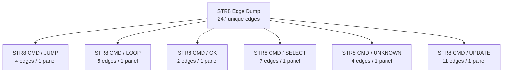

### Family Detail

#### ENTRY / unprefixed


#### STR8 / BANK

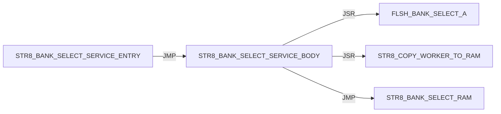

#### STR8 / BOOT

Panel 1 of 2: `STR8_BOOT_JUMP_BANK_A` through `STR8_BOOT_START`.

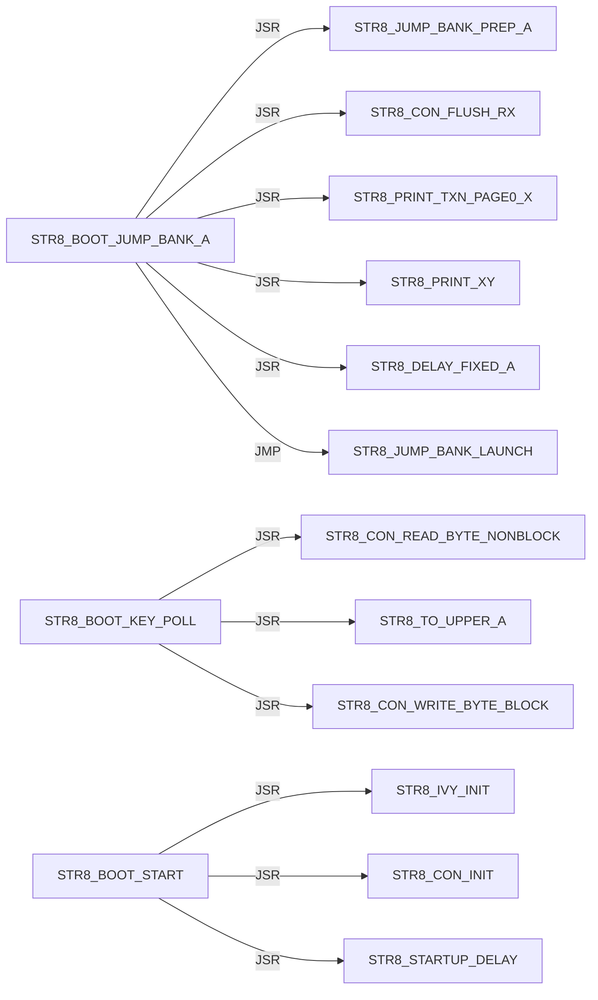

Panel 2 of 2: `STR8_BOOT_START` through `STR8_BOOT_START`.

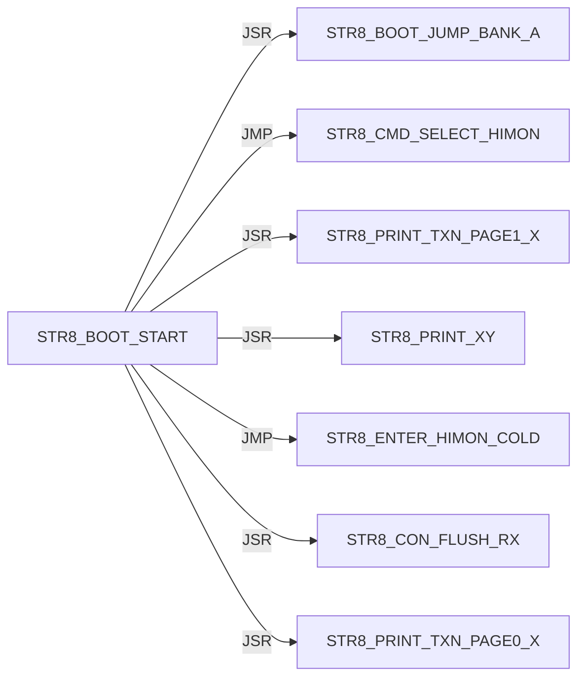

#### STR8 / CON

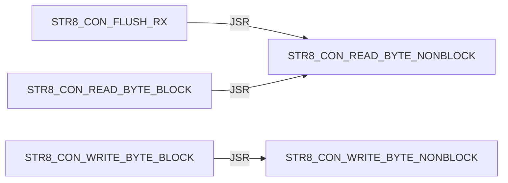

#### STR8 / CONFIRM

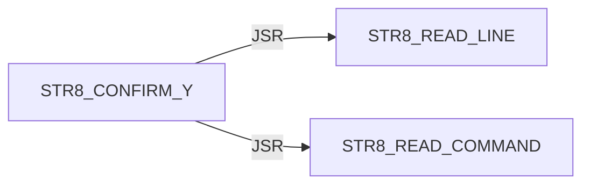

#### STR8 / DELAY


#### STR8 / DIR

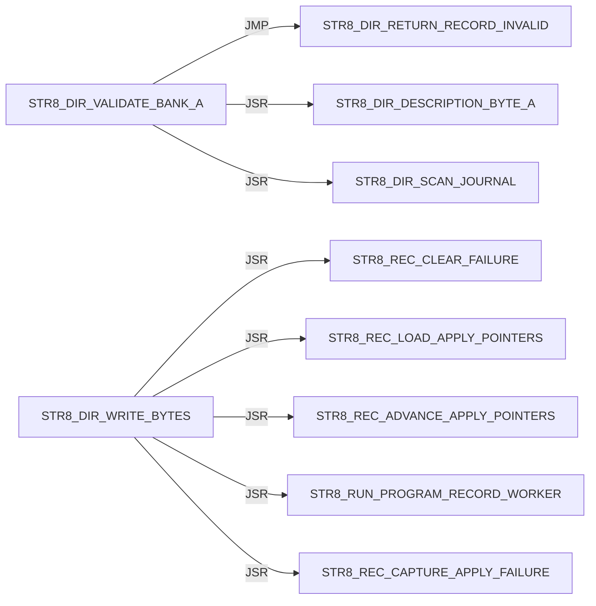

#### STR8 / DISPATCH

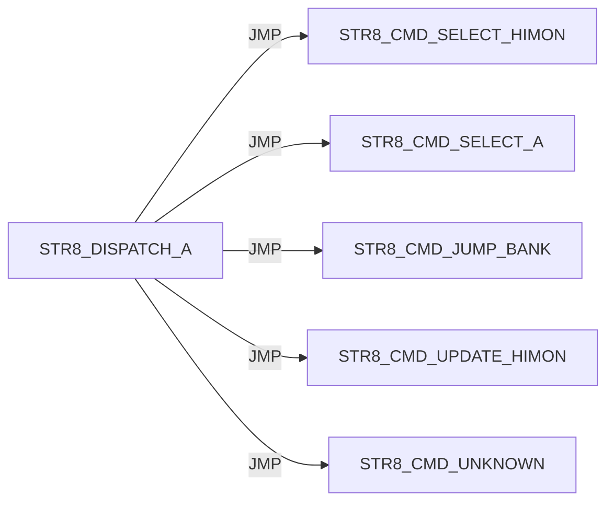

#### STR8 / ENTER

Panel 1 of 2: `STR8_ENTER_HIMON_COLD` through `STR8_ENTER_MENU_NO_TARGET_PRINT`.

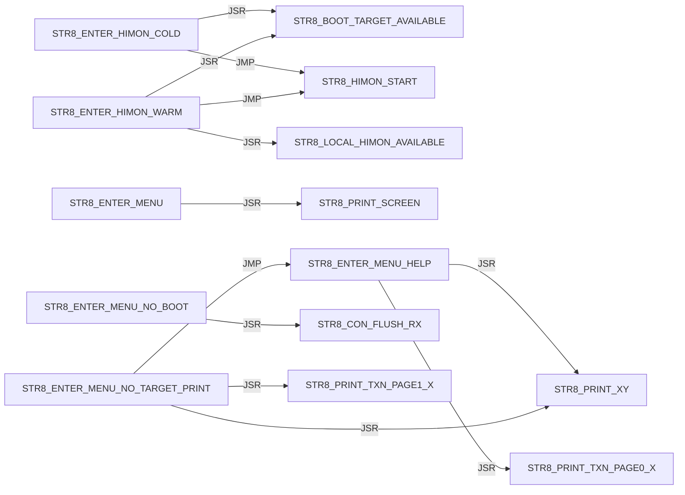

Panel 2 of 2: `STR8_ENTER_MENU_READY` through `STR8_ENTER_MENU_READY`.


#### STR8 / I

Panel 1 of 5: `STR8_I_BEGIN_TRANSACTION` through `STR8_I_PRINT_SUMMARY`.

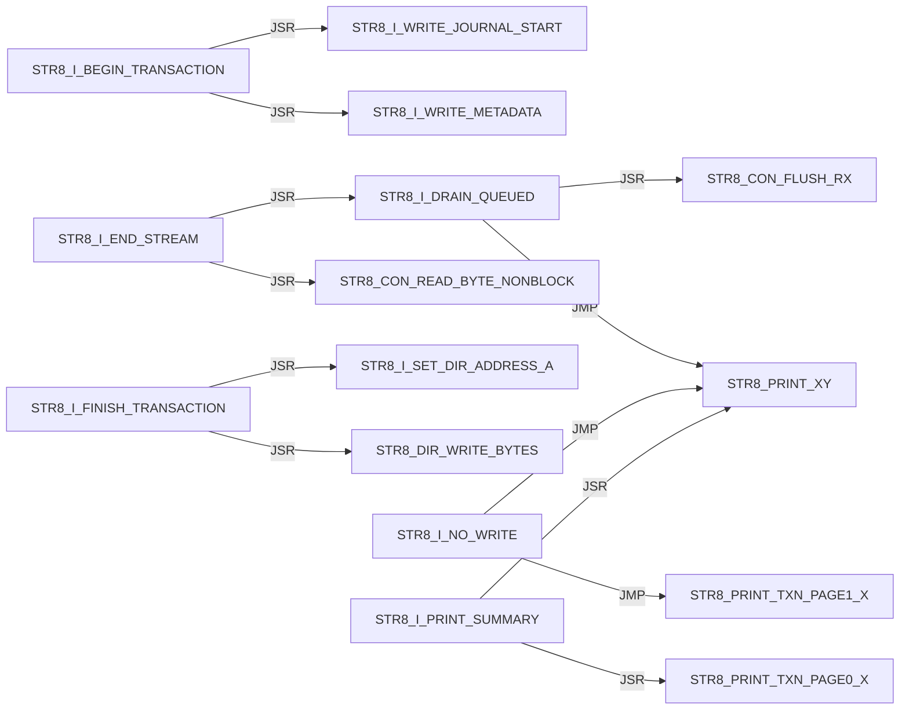

Panel 2 of 5: `STR8_I_PRINT_SUMMARY` through `STR8_I_PRINT_TRANSACTION_FAIL`.

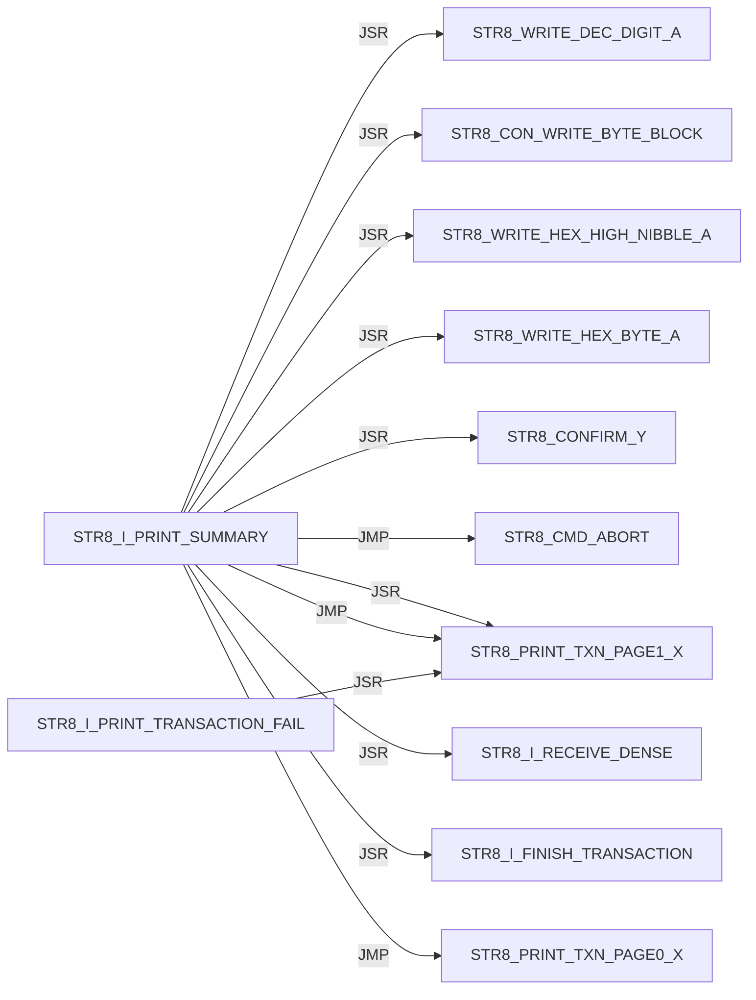

Panel 3 of 5: `STR8_I_PRINT_TRANSACTION_FAIL` through `STR8_I_READ_TYPE`.

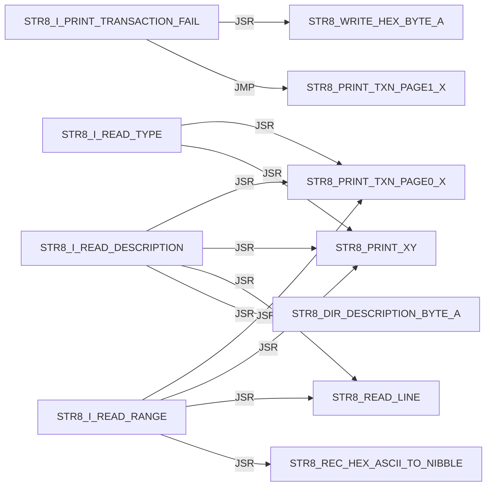

Panel 4 of 5: `STR8_I_READ_TYPE` through `STR8_I_RECEIVE_DENSE`.

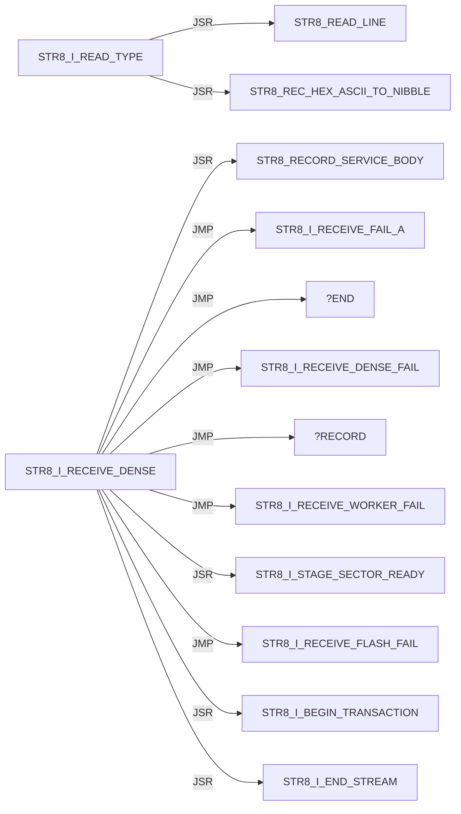

Panel 5 of 5: `STR8_I_RECEIVE_FAIL_A` through `STR8_I_WRITE_METADATA`.

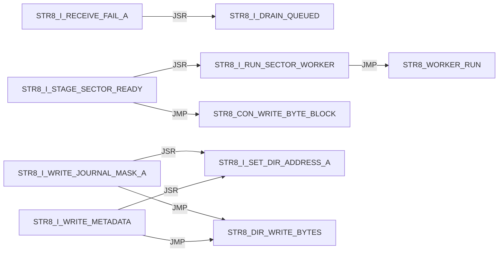

#### STR8 / IVY

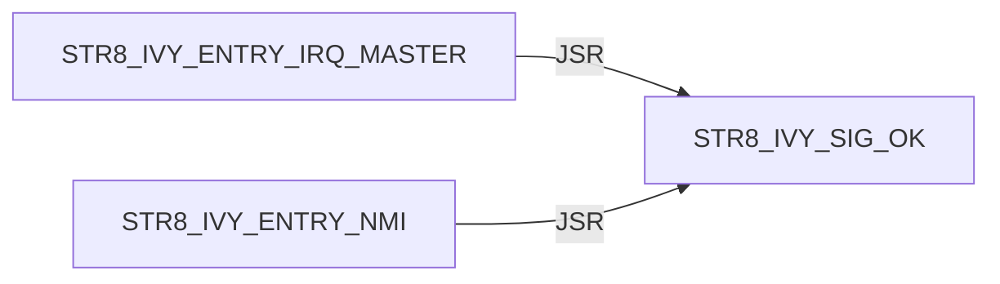

#### STR8 / JUMP

```mermaid
flowchart LR
    N0["STR8_JUMP_BANK_LAUNCH"] -->|JSR| N1["STR8_DIR_VALIDATE_BANK_A"]
    N0["STR8_JUMP_BANK_LAUNCH"] -->|JMP| N2["STR8_PRINT_JUMP_FAIL"]
    N0["STR8_JUMP_BANK_LAUNCH"] -->|JSR| N3["STR8_CON_FLUSH_RX"]
    N0["STR8_JUMP_BANK_LAUNCH"] -->|JSR| N4["STR8_JUMP_BANK_RAM"]
    N0["STR8_JUMP_BANK_LAUNCH"] -->|JSR| N5["STR8_COPY_WORKER_TO_RAM"]
    N0["STR8_JUMP_BANK_LAUNCH"] -->|JSR| N6["STR8_WORKER_RUN"]
    N7["STR8_JUMP_BANK_PREP_A"] -->|JSR| N8["STR8_PRINT_TXN_PAGE1_X"]
    N7["STR8_JUMP_BANK_PREP_A"] -->|JSR| N9["STR8_PRINT_XY"]
    N7["STR8_JUMP_BANK_PREP_A"] -->|JSR| N10["STR8_WRITE_DEC_DIGIT_A"]
    N4["STR8_JUMP_BANK_RAM"] -->|JSR| N11["FLSH_BANK_SELECT_A"]
    N4["STR8_JUMP_BANK_RAM"] -->|JSR| N12["FLSH_BANK_SELECT_3"]
```

#### STR8 / PRINT

```mermaid
flowchart LR
    N0["STR8_PRINT_COPY_FAIL"] -->|JSR| N1["STR8_PRINT_XY"]
    N0["STR8_PRINT_COPY_FAIL"] -->|JSR| N2["STR8_WRITE_HEX_BYTE_A"]
    N0["STR8_PRINT_COPY_FAIL"] -->|JMP| N1["STR8_PRINT_XY"]
    N3["STR8_PRINT_JUMP_FAIL"] -->|JSR| N4["STR8_PRINT_TXN_PAGE1_X"]
    N3["STR8_PRINT_JUMP_FAIL"] -->|JSR| N1["STR8_PRINT_XY"]
    N3["STR8_PRINT_JUMP_FAIL"] -->|JSR| N5["STR8_WRITE_DEC_DIGIT_A"]
    N3["STR8_PRINT_JUMP_FAIL"] -->|JSR| N2["STR8_WRITE_HEX_BYTE_A"]
    N3["STR8_PRINT_JUMP_FAIL"] -->|JMP| N1["STR8_PRINT_XY"]
    N6["STR8_PRINT_PROMPT"] -->|JMP| N1["STR8_PRINT_XY"]
    N7["STR8_PRINT_SCREEN"] -->|JSR| N1["STR8_PRINT_XY"]
    N7["STR8_PRINT_SCREEN"] -->|JMP| N1["STR8_PRINT_XY"]
    N1["STR8_PRINT_XY"] -->|JSR| N8["STR8_CON_WRITE_BYTE_BLOCK"]
```

#### STR8 / PROGRAM

```mermaid
flowchart LR
    N0["STR8_PROGRAM_HIMON_SECTOR_AX"] -->|JSR| N1["STR8_COPY_WORKER_TO_RAM"]
    N0["STR8_PROGRAM_HIMON_SECTOR_AX"] -->|JSR| N2["STR8_WORKER_RUN"]
    N0["STR8_PROGRAM_HIMON_SECTOR_AX"] -->|JSR| N3["STR8_CON_WRITE_BYTE_BLOCK"]
    N4["STR8_PROGRAM_HIMON_UPDATE"] -->|JSR| N0["STR8_PROGRAM_HIMON_SECTOR_AX"]
```

#### STR8 / READ

```mermaid
flowchart LR
    N0["STR8_READ_COMMAND"] -->|JSR| N1["STR8_CON_READ_BYTE_BLOCK"]
    N0["STR8_READ_COMMAND"] -->|JSR| N2["STR8_TO_UPPER_A"]
    N0["STR8_READ_COMMAND"] -->|JSR| N3["STR8_CON_WRITE_BYTE_BLOCK"]
    N4["STR8_READ_HIMON_S19"] -->|JSR| N5["STR8_RECORD_SERVICE_BODY"]
    N4["STR8_READ_HIMON_S19"] -->|JSR| N6["STR8_STAGE_HIMON_RECORD"]
    N4["STR8_READ_HIMON_S19"] -->|JSR| N3["STR8_CON_WRITE_BYTE_BLOCK"]
    N7["STR8_READ_LINE"] -->|JSR| N8["STR8_READ_TEXT_BYTE_BLOCK"]
    N7["STR8_READ_LINE"] -->|JSR| N2["STR8_TO_UPPER_A"]
    N7["STR8_READ_LINE"] -->|JSR| N3["STR8_CON_WRITE_BYTE_BLOCK"]
    N7["STR8_READ_LINE"] -->|JSR| N9["STR8_PRINT_TXN_PAGE1_X"]
    N7["STR8_READ_LINE"] -->|JSR| N10["STR8_PRINT_XY"]
    N8["STR8_READ_TEXT_BYTE_BLOCK"] -->|JSR| N1["STR8_CON_READ_BYTE_BLOCK"]
```

#### STR8 / REC

Panel 1 of 2: `STR8_REC_APPLY_LF` through `STR8_REC_PARSE`.

```mermaid
flowchart LR
    N0["STR8_REC_APPLY_LF"] -->|JSR| N1["STR8_REC_CLEAR_FAILURE"]
    N0["STR8_REC_APPLY_LF"] -->|JMP| N2["STR8_REC_FAIL_A"]
    N0["STR8_REC_APPLY_LF"] -->|JMP| N3["STR8_REC_RETURN_OK"]
    N0["STR8_REC_APPLY_LF"] -->|JSR| N4["STR8_REC_LOAD_APPLY_POINTERS"]
    N0["STR8_REC_APPLY_LF"] -->|JSR| N5["STR8_REC_CAPTURE_APPLY_FAILURE"]
    N0["STR8_REC_APPLY_LF"] -->|JSR| N6["STR8_REC_ADVANCE_APPLY_POINTERS"]
    N0["STR8_REC_APPLY_LF"] -->|JSR| N7["STR8_RUN_PROGRAM_RECORD_WORKER"]
    N8["STR8_REC_FAIL_READ_X"] -->|JMP| N9["STR8_REC_RETURN_CURRENT_FAIL"]
    N8["STR8_REC_FAIL_READ_X"] -->|JMP| N2["STR8_REC_FAIL_A"]
    N10["STR8_REC_PARSE"] -->|JSR| N11["STR8_REC_CLEAR_RESULT"]
    N10["STR8_REC_PARSE"] -->|JMP| N2["STR8_REC_FAIL_A"]
    N10["STR8_REC_PARSE"] -->|JSR| N12["STR8_REC_READ_CHAR"]
```

Panel 2 of 2: `STR8_REC_PARSE` through `STR8_REC_READ_SUM_BYTE`.

```mermaid
flowchart LR
    N0["STR8_REC_PARSE"] -->|JMP| N1["STR8_REC_FAIL_READ_START"]
    N0["STR8_REC_PARSE"] -->|JMP| N2["STR8_REC_FAIL_READ_TYPE"]
    N3["STR8_REC_PARSE_BODY"] -->|JSR| N4["STR8_REC_READ_SUM_BYTE"]
    N3["STR8_REC_PARSE_BODY"] -->|JMP| N5["STR8_REC_FAIL_A"]
    N3["STR8_REC_PARSE_BODY"] -->|JMP| N6["STR8_REC_FAIL_READ_HEX"]
    N3["STR8_REC_PARSE_BODY"] -->|JSR| N7["STR8_REC_READ_CHAR"]
    N3["STR8_REC_PARSE_BODY"] -->|JMP| N8["STR8_REC_RETURN_OK"]
    N7["STR8_REC_READ_CHAR"] -->|JSR| N9["STR8_READ_TEXT_BYTE_BLOCK"]
    N7["STR8_REC_READ_CHAR"] -->|JSR| N10["STR8_CON_READ_BYTE_BLOCK"]
    N11["STR8_REC_READ_HEX_BYTE"] -->|JSR| N7["STR8_REC_READ_CHAR"]
    N11["STR8_REC_READ_HEX_BYTE"] -->|JSR| N12["STR8_REC_HEX_ASCII_TO_NIBBLE"]
    N4["STR8_REC_READ_SUM_BYTE"] -->|JSR| N11["STR8_REC_READ_HEX_BYTE"]
```

#### STR8 / RECORD

```mermaid
flowchart LR
    N0["STR8_RECORD_SERVICE_BODY"] -->|JMP| N1["STR8_REC_APPLY_LF"]
    N0["STR8_RECORD_SERVICE_BODY"] -->|JMP| N2["STR8_REC_FAIL_A"]
    N3["STR8_RECORD_SERVICE_ENTRY"] -->|JMP| N0["STR8_RECORD_SERVICE_BODY"]
```

#### STR8 / RUN

```mermaid
flowchart LR
    N0["STR8_RUN_PROGRAM_RECORD_WORKER"] -->|JSR| N1["STR8_COPY_WORKER_TO_RAM"]
    N0["STR8_RUN_PROGRAM_RECORD_WORKER"] -->|JSR| N2["STR8_WORKER_RUN"]
    N3["STR8_RUN_WORKER_SERVICE"] -->|JMP| N4["STR8_RUN_WORKER_SERVICE_BODY"]
    N4["STR8_RUN_WORKER_SERVICE_BODY"] -->|JSR| N1["STR8_COPY_WORKER_TO_RAM"]
    N4["STR8_RUN_WORKER_SERVICE_BODY"] -->|JMP| N2["STR8_WORKER_RUN"]
```

#### STR8 / SELECT

```mermaid
flowchart LR
    N0["STR8_SELECT_BANK_3"] -->|JSR| N1["FLSH_BANK_SELECT_3"]
```

#### STR8 / STARTUP

```mermaid
flowchart LR
    N0["STR8_STARTUP_DELAY"] -->|JSR| N1["STR8_CON_WRITE_BYTE_BLOCK"]
    N0["STR8_STARTUP_DELAY"] -->|JSR| N2["STR8_CON_FLUSH_RX"]
    N0["STR8_STARTUP_DELAY"] -->|JSR| N3["STR8_PRINT_TXN_PAGE1_X"]
    N0["STR8_STARTUP_DELAY"] -->|JSR| N4["STR8_PRINT_XY"]
    N0["STR8_STARTUP_DELAY"] -->|JSR| N5["STR8_PRINT_TXN_PAGE0_X"]
    N0["STR8_STARTUP_DELAY"] -->|JSR| N6["STR8_DELAY_FIXED_A"]
    N0["STR8_STARTUP_DELAY"] -->|JSR| N7["STR8_BOOT_KEY_POLL_IF_ENABLED"]
```

#### STR8 / WRITE

```mermaid
flowchart LR
    N0["STR8_WRITE_DEC_DIGIT_A"] -->|JMP| N1["STR8_CON_WRITE_BYTE_BLOCK"]
    N2["STR8_WRITE_HEX_BYTE_A"] -->|JSR| N3["STR8_WRITE_HEX_NIBBLE_A"]
    N3["STR8_WRITE_HEX_NIBBLE_A"] -->|JMP| N1["STR8_CON_WRITE_BYTE_BLOCK"]
```

#### STR8 CMD / ABORT

```mermaid
flowchart LR
    N0["STR8_CMD_ABORT"] -->|JSR| N1["STR8_SELECT_BANK_3"]
    N0["STR8_CMD_ABORT"] -->|JMP| N2["STR8_PRINT_TXN_PAGE0_X"]
    N0["STR8_CMD_ABORT"] -->|JMP| N3["STR8_PRINT_XY"]
```

#### STR8 CMD / COPY

```mermaid
flowchart LR
    N0["STR8_CMD_COPY_FAIL"] -->|JSR| N1["STR8_SELECT_BANK_3"]
    N0["STR8_CMD_COPY_FAIL"] -->|JMP| N2["STR8_PRINT_COPY_FAIL"]
```

#### STR8 CMD / INSTALL

Panel 1 of 2: `STR8_CMD_INSTALL_PREVIEW` through `STR8_CMD_INSTALL_PREVIEW`.

```mermaid
flowchart LR
    N0["STR8_CMD_INSTALL_PREVIEW"] -->|JMP| N1["STR8_CMD_UNKNOWN"]
    N0["STR8_CMD_INSTALL_PREVIEW"] -->|JSR| N2["STR8_PRINT_TXN_PAGE0_X"]
    N0["STR8_CMD_INSTALL_PREVIEW"] -->|JSR| N3["STR8_PRINT_XY"]
    N0["STR8_CMD_INSTALL_PREVIEW"] -->|JSR| N4["STR8_READ_LINE"]
    N0["STR8_CMD_INSTALL_PREVIEW"] -->|JMP| N5["STR8_CMD_ABORT"]
    N0["STR8_CMD_INSTALL_PREVIEW"] -->|JSR| N6["STR8_I_READ_RANGE"]
    N0["STR8_CMD_INSTALL_PREVIEW"] -->|JSR| N7["STR8_DIR_VALIDATE_BANK_A"]
    N0["STR8_CMD_INSTALL_PREVIEW"] -->|JSR| N8["STR8_I_READ_TYPE"]
    N0["STR8_CMD_INSTALL_PREVIEW"] -->|JSR| N9["STR8_I_READ_DESCRIPTION"]
    N0["STR8_CMD_INSTALL_PREVIEW"] -->|JMP| N10["STR8_I_PRINT_SUMMARY"]
    N0["STR8_CMD_INSTALL_PREVIEW"] -->|JSR| N11["STR8_I_COPY_RECORD_METADATA"]
    N0["STR8_CMD_INSTALL_PREVIEW"] -->|JMP| N2["STR8_PRINT_TXN_PAGE0_X"]
```

Panel 2 of 2: `STR8_CMD_INSTALL_PREVIEW` through `STR8_CMD_INSTALL_PREVIEW`.

```mermaid
flowchart LR
    N0["STR8_CMD_INSTALL_PREVIEW"] -->|JMP| N1["STR8_PRINT_XY"]
```

#### STR8 CMD / JUMP

```mermaid
flowchart LR
    N0["STR8_CMD_JUMP_BANK"] -->|JSR| N1["STR8_READ_COMMAND"]
    N0["STR8_CMD_JUMP_BANK"] -->|JMP| N2["STR8_CMD_ABORT"]
    N0["STR8_CMD_JUMP_BANK"] -->|JSR| N3["STR8_JUMP_BANK_PREP_A"]
    N0["STR8_CMD_JUMP_BANK"] -->|JMP| N4["STR8_JUMP_BANK_LAUNCH"]
```

#### STR8 CMD / LOOP

```mermaid
flowchart LR
    N0["STR8_CMD_LOOP"] -->|JSR| N1["STR8_PRINT_PROMPT"]
    N0["STR8_CMD_LOOP"] -->|JSR| N2["STR8_READ_LINE"]
    N0["STR8_CMD_LOOP"] -->|JSR| N3["STR8_CMD_ABORT"]
    N0["STR8_CMD_LOOP"] -->|JSR| N4["STR8_READ_COMMAND"]
    N0["STR8_CMD_LOOP"] -->|JSR| N5["STR8_DISPATCH_A"]
```

#### STR8 CMD / OK

```mermaid
flowchart LR
    N0["STR8_CMD_OK"] -->|JSR| N1["STR8_SELECT_BANK_3"]
    N0["STR8_CMD_OK"] -->|JMP| N2["STR8_PRINT_XY"]
```

#### STR8 CMD / SELECT

```mermaid
flowchart LR
    N0["STR8_CMD_SELECT_A"] -->|JSR| N1["STR8_JUMP_BANK_PREP_A"]
    N0["STR8_CMD_SELECT_A"] -->|JMP| N2["STR8_JUMP_BANK_LAUNCH"]
    N3["STR8_CMD_SELECT_HIMON"] -->|JSR| N4["STR8_SELECT_BANK_3"]
    N3["STR8_CMD_SELECT_HIMON"] -->|JSR| N5["STR8_CON_FLUSH_RX"]
    N3["STR8_CMD_SELECT_HIMON"] -->|JSR| N6["STR8_PRINT_TXN_PAGE1_X"]
    N3["STR8_CMD_SELECT_HIMON"] -->|JSR| N7["STR8_PRINT_XY"]
    N3["STR8_CMD_SELECT_HIMON"] -->|JMP| N8["STR8_ENTER_HIMON_WARM"]
```

#### STR8 CMD / UNKNOWN

```mermaid
flowchart LR
    N0["STR8_CMD_UNKNOWN"] -->|JSR| N1["STR8_PRINT_TXN_PAGE1_X"]
    N0["STR8_CMD_UNKNOWN"] -->|JSR| N2["STR8_PRINT_XY"]
    N0["STR8_CMD_UNKNOWN"] -->|JMP| N3["STR8_PRINT_TXN_PAGE0_X"]
    N0["STR8_CMD_UNKNOWN"] -->|JMP| N2["STR8_PRINT_XY"]
```

#### STR8 CMD / UPDATE

```mermaid
flowchart LR
    N0["STR8_CMD_UPDATE_HIMON"] -->|JMP| N1["STR8_PRINT_XY"]
    N0["STR8_CMD_UPDATE_HIMON"] -->|JSR| N1["STR8_PRINT_XY"]
    N0["STR8_CMD_UPDATE_HIMON"] -->|JSR| N2["STR8_CONFIRM_Y"]
    N0["STR8_CMD_UPDATE_HIMON"] -->|JSR| N3["STR8_STAGE_HIMON_BLANK"]
    N0["STR8_CMD_UPDATE_HIMON"] -->|JSR| N4["STR8_UPD_INIT"]
    N0["STR8_CMD_UPDATE_HIMON"] -->|JSR| N5["STR8_READ_HIMON_S19"]
    N0["STR8_CMD_UPDATE_HIMON"] -->|JSR| N6["STR8_PROGRAM_HIMON_UPDATE"]
    N0["STR8_CMD_UPDATE_HIMON"] -->|JMP| N7["STR8_CMD_OK"]
    N8["STR8_CMD_UPDATE_NO_DATA"] -->|JMP| N1["STR8_PRINT_XY"]
    N9["STR8_CMD_UPDATE_S19_FAIL"] -->|JSR| N10["STR8_CON_FLUSH_RX"]
    N9["STR8_CMD_UPDATE_S19_FAIL"] -->|JMP| N1["STR8_PRINT_XY"]
```

## External Targets

These targets are not labels in this source file; most are `XREF` providers from sibling ROM modules.

```text
FLSH_BANK_SELECT_3
FLSH_BANK_SELECT_A
STR8_BANK_SELECT_RAM
STR8_HIMON_START
STR8_WORKER_RUN
UTL_DELAY_AXY_8MHZ
```

## Unique Direct Edges By Source Label

Each block is one source label. Indented lines are outgoing direct edges.
Blank lines are source-level breaks; they do not imply call depth.

```text
START
    JMP STR8_BOOT_START

STR8_BANK_SELECT_SERVICE_BODY
    JSR FLSH_BANK_SELECT_A
    JSR STR8_COPY_WORKER_TO_RAM
    JMP STR8_BANK_SELECT_RAM

STR8_BANK_SELECT_SERVICE_ENTRY
    JMP STR8_BANK_SELECT_SERVICE_BODY

STR8_BOOT_JUMP_BANK_A
    JSR STR8_JUMP_BANK_PREP_A
    JSR STR8_CON_FLUSH_RX
    JSR STR8_PRINT_TXN_PAGE0_X
    JSR STR8_PRINT_XY
    JSR STR8_DELAY_FIXED_A
    JMP STR8_JUMP_BANK_LAUNCH

STR8_BOOT_KEY_POLL
    JSR STR8_CON_READ_BYTE_NONBLOCK
    JSR STR8_TO_UPPER_A
    JSR STR8_CON_WRITE_BYTE_BLOCK

STR8_BOOT_START
    JSR STR8_IVY_INIT
    JSR STR8_CON_INIT
    JSR STR8_STARTUP_DELAY
    JSR STR8_BOOT_JUMP_BANK_A
    JMP STR8_CMD_SELECT_HIMON
    JSR STR8_PRINT_TXN_PAGE1_X
    JSR STR8_PRINT_XY
    JMP STR8_ENTER_HIMON_COLD
    JSR STR8_CON_FLUSH_RX
    JSR STR8_PRINT_TXN_PAGE0_X

STR8_CMD_ABORT
    JSR STR8_SELECT_BANK_3
    JMP STR8_PRINT_TXN_PAGE0_X
    JMP STR8_PRINT_XY

STR8_CMD_COPY_FAIL
    JSR STR8_SELECT_BANK_3
    JMP STR8_PRINT_COPY_FAIL

STR8_CMD_INSTALL_PREVIEW
    JMP STR8_CMD_UNKNOWN
    JSR STR8_PRINT_TXN_PAGE0_X
    JSR STR8_PRINT_XY
    JSR STR8_READ_LINE
    JMP STR8_CMD_ABORT
    JSR STR8_I_READ_RANGE
    JSR STR8_DIR_VALIDATE_BANK_A
    JSR STR8_I_READ_TYPE
    JSR STR8_I_READ_DESCRIPTION
    JMP STR8_I_PRINT_SUMMARY
    JSR STR8_I_COPY_RECORD_METADATA
    JMP STR8_PRINT_TXN_PAGE0_X
    JMP STR8_PRINT_XY

STR8_CMD_JUMP_BANK
    JSR STR8_READ_COMMAND
    JMP STR8_CMD_ABORT
    JSR STR8_JUMP_BANK_PREP_A
    JMP STR8_JUMP_BANK_LAUNCH

STR8_CMD_LOOP
    JSR STR8_PRINT_PROMPT
    JSR STR8_READ_LINE
    JSR STR8_CMD_ABORT
    JSR STR8_READ_COMMAND
    JSR STR8_DISPATCH_A

STR8_CMD_OK
    JSR STR8_SELECT_BANK_3
    JMP STR8_PRINT_XY

STR8_CMD_SELECT_A
    JSR STR8_JUMP_BANK_PREP_A
    JMP STR8_JUMP_BANK_LAUNCH

STR8_CMD_SELECT_HIMON
    JSR STR8_SELECT_BANK_3
    JSR STR8_CON_FLUSH_RX
    JSR STR8_PRINT_TXN_PAGE1_X
    JSR STR8_PRINT_XY
    JMP STR8_ENTER_HIMON_WARM

STR8_CMD_UNKNOWN
    JSR STR8_PRINT_TXN_PAGE1_X
    JSR STR8_PRINT_XY
    JMP STR8_PRINT_TXN_PAGE0_X
    JMP STR8_PRINT_XY

STR8_CMD_UPDATE_HIMON
    JMP STR8_PRINT_XY
    JSR STR8_PRINT_XY
    JSR STR8_CONFIRM_Y
    JSR STR8_STAGE_HIMON_BLANK
    JSR STR8_UPD_INIT
    JSR STR8_READ_HIMON_S19
    JSR STR8_PROGRAM_HIMON_UPDATE
    JMP STR8_CMD_OK

STR8_CMD_UPDATE_NO_DATA
    JMP STR8_PRINT_XY

STR8_CMD_UPDATE_S19_FAIL
    JSR STR8_CON_FLUSH_RX
    JMP STR8_PRINT_XY

STR8_CON_FLUSH_RX
    JSR STR8_CON_READ_BYTE_NONBLOCK

STR8_CON_READ_BYTE_BLOCK
    JSR STR8_CON_READ_BYTE_NONBLOCK

STR8_CON_WRITE_BYTE_BLOCK
    JSR STR8_CON_WRITE_BYTE_NONBLOCK

STR8_CONFIRM_Y
    JSR STR8_READ_LINE
    JSR STR8_READ_COMMAND

STR8_DELAY_FIXED_A
    JMP UTL_DELAY_AXY_8MHZ

STR8_DIR_VALIDATE_BANK_A
    JMP STR8_DIR_RETURN_RECORD_INVALID
    JSR STR8_DIR_DESCRIPTION_BYTE_A
    JSR STR8_DIR_SCAN_JOURNAL

STR8_DIR_WRITE_BYTES
    JSR STR8_REC_CLEAR_FAILURE
    JSR STR8_REC_LOAD_APPLY_POINTERS
    JSR STR8_REC_ADVANCE_APPLY_POINTERS
    JSR STR8_RUN_PROGRAM_RECORD_WORKER
    JSR STR8_REC_CAPTURE_APPLY_FAILURE

STR8_DISPATCH_A
    JMP STR8_CMD_SELECT_HIMON
    JMP STR8_CMD_SELECT_A
    JMP STR8_CMD_JUMP_BANK
    JMP STR8_CMD_UPDATE_HIMON
    JMP STR8_CMD_UNKNOWN

STR8_ENTER_HIMON_COLD
    JSR STR8_BOOT_TARGET_AVAILABLE
    JMP STR8_HIMON_START

STR8_ENTER_HIMON_WARM
    JSR STR8_LOCAL_HIMON_AVAILABLE
    JSR STR8_BOOT_TARGET_AVAILABLE
    JMP STR8_HIMON_START

STR8_ENTER_MENU
    JSR STR8_PRINT_SCREEN

STR8_ENTER_MENU_HELP
    JSR STR8_PRINT_TXN_PAGE0_X
    JSR STR8_PRINT_XY

STR8_ENTER_MENU_NO_BOOT
    JSR STR8_CON_FLUSH_RX

STR8_ENTER_MENU_NO_TARGET_PRINT
    JSR STR8_PRINT_TXN_PAGE1_X
    JSR STR8_PRINT_XY
    JMP STR8_ENTER_MENU_HELP

STR8_ENTER_MENU_READY
    JMP STR8_CMD_LOOP

STR8_I_BEGIN_TRANSACTION
    JSR STR8_I_WRITE_JOURNAL_START
    JSR STR8_I_WRITE_METADATA

STR8_I_DRAIN_QUEUED
    JSR STR8_CON_FLUSH_RX
    JMP STR8_PRINT_XY

STR8_I_END_STREAM
    JSR STR8_CON_READ_BYTE_NONBLOCK
    JSR STR8_I_DRAIN_QUEUED

STR8_I_FINISH_TRANSACTION
    JSR STR8_I_SET_DIR_ADDRESS_A
    JSR STR8_DIR_WRITE_BYTES

STR8_I_NO_WRITE
    JMP STR8_PRINT_TXN_PAGE1_X
    JMP STR8_PRINT_XY

STR8_I_PRINT_SUMMARY
    JSR STR8_PRINT_TXN_PAGE0_X
    JSR STR8_PRINT_XY
    JSR STR8_WRITE_DEC_DIGIT_A
    JSR STR8_CON_WRITE_BYTE_BLOCK
    JSR STR8_WRITE_HEX_HIGH_NIBBLE_A
    JSR STR8_WRITE_HEX_BYTE_A
    JSR STR8_CONFIRM_Y
    JMP STR8_CMD_ABORT
    JSR STR8_PRINT_TXN_PAGE1_X
    JSR STR8_I_RECEIVE_DENSE
    JSR STR8_I_FINISH_TRANSACTION
    JMP STR8_PRINT_TXN_PAGE0_X
    JMP STR8_PRINT_TXN_PAGE1_X

STR8_I_PRINT_TRANSACTION_FAIL
    JSR STR8_PRINT_TXN_PAGE1_X
    JSR STR8_WRITE_HEX_BYTE_A
    JMP STR8_PRINT_TXN_PAGE1_X

STR8_I_READ_DESCRIPTION
    JSR STR8_PRINT_TXN_PAGE0_X
    JSR STR8_PRINT_XY
    JSR STR8_READ_LINE
    JSR STR8_DIR_DESCRIPTION_BYTE_A

STR8_I_READ_RANGE
    JSR STR8_PRINT_TXN_PAGE0_X
    JSR STR8_PRINT_XY
    JSR STR8_READ_LINE
    JSR STR8_REC_HEX_ASCII_TO_NIBBLE

STR8_I_READ_TYPE
    JSR STR8_PRINT_TXN_PAGE0_X
    JSR STR8_PRINT_XY
    JSR STR8_READ_LINE
    JSR STR8_REC_HEX_ASCII_TO_NIBBLE

STR8_I_RECEIVE_DENSE
    JSR STR8_RECORD_SERVICE_BODY
    JMP STR8_I_RECEIVE_FAIL_A
    JMP ?END
    JMP STR8_I_RECEIVE_DENSE_FAIL
    JMP ?RECORD
    JMP STR8_I_RECEIVE_WORKER_FAIL
    JSR STR8_I_STAGE_SECTOR_READY
    JMP STR8_I_RECEIVE_FLASH_FAIL
    JSR STR8_I_BEGIN_TRANSACTION
    JSR STR8_I_END_STREAM

STR8_I_RECEIVE_FAIL_A
    JSR STR8_I_DRAIN_QUEUED

STR8_I_RUN_SECTOR_WORKER
    JMP STR8_WORKER_RUN

STR8_I_STAGE_SECTOR_READY
    JSR STR8_I_RUN_SECTOR_WORKER
    JMP STR8_CON_WRITE_BYTE_BLOCK

STR8_I_WRITE_JOURNAL_MASK_A
    JSR STR8_I_SET_DIR_ADDRESS_A
    JMP STR8_DIR_WRITE_BYTES

STR8_I_WRITE_METADATA
    JSR STR8_I_SET_DIR_ADDRESS_A
    JMP STR8_DIR_WRITE_BYTES

STR8_IVY_ENTRY_IRQ_MASTER
    JSR STR8_IVY_SIG_OK

STR8_IVY_ENTRY_NMI
    JSR STR8_IVY_SIG_OK

STR8_JUMP_BANK_LAUNCH
    JSR STR8_DIR_VALIDATE_BANK_A
    JMP STR8_PRINT_JUMP_FAIL
    JSR STR8_CON_FLUSH_RX
    JSR STR8_JUMP_BANK_RAM
    JSR STR8_COPY_WORKER_TO_RAM
    JSR STR8_WORKER_RUN

STR8_JUMP_BANK_PREP_A
    JSR STR8_PRINT_TXN_PAGE1_X
    JSR STR8_PRINT_XY
    JSR STR8_WRITE_DEC_DIGIT_A

STR8_JUMP_BANK_RAM
    JSR FLSH_BANK_SELECT_A
    JSR FLSH_BANK_SELECT_3

STR8_PRINT_COPY_FAIL
    JSR STR8_PRINT_XY
    JSR STR8_WRITE_HEX_BYTE_A
    JMP STR8_PRINT_XY

STR8_PRINT_JUMP_FAIL
    JSR STR8_PRINT_TXN_PAGE1_X
    JSR STR8_PRINT_XY
    JSR STR8_WRITE_DEC_DIGIT_A
    JSR STR8_WRITE_HEX_BYTE_A
    JMP STR8_PRINT_XY

STR8_PRINT_PROMPT
    JMP STR8_PRINT_XY

STR8_PRINT_SCREEN
    JSR STR8_PRINT_XY
    JMP STR8_PRINT_XY

STR8_PRINT_XY
    JSR STR8_CON_WRITE_BYTE_BLOCK

STR8_PROGRAM_HIMON_SECTOR_AX
    JSR STR8_COPY_WORKER_TO_RAM
    JSR STR8_WORKER_RUN
    JSR STR8_CON_WRITE_BYTE_BLOCK

STR8_PROGRAM_HIMON_UPDATE
    JSR STR8_PROGRAM_HIMON_SECTOR_AX

STR8_READ_COMMAND
    JSR STR8_CON_READ_BYTE_BLOCK
    JSR STR8_TO_UPPER_A
    JSR STR8_CON_WRITE_BYTE_BLOCK

STR8_READ_HIMON_S19
    JSR STR8_RECORD_SERVICE_BODY
    JSR STR8_STAGE_HIMON_RECORD
    JSR STR8_CON_WRITE_BYTE_BLOCK

STR8_READ_LINE
    JSR STR8_READ_TEXT_BYTE_BLOCK
    JSR STR8_TO_UPPER_A
    JSR STR8_CON_WRITE_BYTE_BLOCK
    JSR STR8_PRINT_TXN_PAGE1_X
    JSR STR8_PRINT_XY

STR8_READ_TEXT_BYTE_BLOCK
    JSR STR8_CON_READ_BYTE_BLOCK

STR8_REC_APPLY_LF
    JSR STR8_REC_CLEAR_FAILURE
    JMP STR8_REC_FAIL_A
    JMP STR8_REC_RETURN_OK
    JSR STR8_REC_LOAD_APPLY_POINTERS
    JSR STR8_REC_CAPTURE_APPLY_FAILURE
    JSR STR8_REC_ADVANCE_APPLY_POINTERS
    JSR STR8_RUN_PROGRAM_RECORD_WORKER

STR8_REC_FAIL_READ_X
    JMP STR8_REC_RETURN_CURRENT_FAIL
    JMP STR8_REC_FAIL_A

STR8_REC_PARSE
    JSR STR8_REC_CLEAR_RESULT
    JMP STR8_REC_FAIL_A
    JSR STR8_REC_READ_CHAR
    JMP STR8_REC_FAIL_READ_START
    JMP STR8_REC_FAIL_READ_TYPE

STR8_REC_PARSE_BODY
    JSR STR8_REC_READ_SUM_BYTE
    JMP STR8_REC_FAIL_A
    JMP STR8_REC_FAIL_READ_HEX
    JSR STR8_REC_READ_CHAR
    JMP STR8_REC_RETURN_OK

STR8_REC_READ_CHAR
    JSR STR8_READ_TEXT_BYTE_BLOCK
    JSR STR8_CON_READ_BYTE_BLOCK

STR8_REC_READ_HEX_BYTE
    JSR STR8_REC_READ_CHAR
    JSR STR8_REC_HEX_ASCII_TO_NIBBLE

STR8_REC_READ_SUM_BYTE
    JSR STR8_REC_READ_HEX_BYTE

STR8_RECORD_SERVICE_BODY
    JMP STR8_REC_APPLY_LF
    JMP STR8_REC_FAIL_A

STR8_RECORD_SERVICE_ENTRY
    JMP STR8_RECORD_SERVICE_BODY

STR8_RUN_PROGRAM_RECORD_WORKER
    JSR STR8_COPY_WORKER_TO_RAM
    JSR STR8_WORKER_RUN

STR8_RUN_WORKER_SERVICE
    JMP STR8_RUN_WORKER_SERVICE_BODY

STR8_RUN_WORKER_SERVICE_BODY
    JSR STR8_COPY_WORKER_TO_RAM
    JMP STR8_WORKER_RUN

STR8_SELECT_BANK_3
    JSR FLSH_BANK_SELECT_3

STR8_STARTUP_DELAY
    JSR STR8_CON_WRITE_BYTE_BLOCK
    JSR STR8_CON_FLUSH_RX
    JSR STR8_PRINT_TXN_PAGE1_X
    JSR STR8_PRINT_XY
    JSR STR8_PRINT_TXN_PAGE0_X
    JSR STR8_DELAY_FIXED_A
    JSR STR8_BOOT_KEY_POLL_IF_ENABLED

STR8_WRITE_DEC_DIGIT_A
    JMP STR8_CON_WRITE_BYTE_BLOCK

STR8_WRITE_HEX_BYTE_A
    JSR STR8_WRITE_HEX_NIBBLE_A

STR8_WRITE_HEX_NIBBLE_A
    JMP STR8_CON_WRITE_BYTE_BLOCK

```

## Raw Direct Edge Sites By Source Label

Each line is a direct call/jump site with source line number.

```text
START
      203  JMP STR8_BOOT_START

STR8_BANK_SELECT_SERVICE_BODY
     1749  JSR FLSH_BANK_SELECT_A
     1760  JSR STR8_COPY_WORKER_TO_RAM
     1762  JMP STR8_BANK_SELECT_RAM

STR8_BANK_SELECT_SERVICE_ENTRY
      232  JMP STR8_BANK_SELECT_SERVICE_BODY

STR8_BOOT_JUMP_BANK_A
     1667  JSR STR8_JUMP_BANK_PREP_A
     1668  JSR STR8_CON_FLUSH_RX
     1671  JSR STR8_PRINT_TXN_PAGE0_X
     1674  JSR STR8_PRINT_XY
     1677  JSR STR8_DELAY_FIXED_A
     1681  JMP STR8_JUMP_BANK_LAUNCH

STR8_BOOT_KEY_POLL
      542  JSR STR8_CON_READ_BYTE_NONBLOCK
      544  JSR STR8_TO_UPPER_A
      562  JSR STR8_CON_WRITE_BYTE_BLOCK

STR8_BOOT_START
      239  JSR STR8_IVY_INIT
      240  JSR STR8_CON_INIT
      243  JSR STR8_STARTUP_DELAY
      254  JSR STR8_BOOT_JUMP_BANK_A
      256  JMP STR8_CMD_SELECT_HIMON
      260  JSR STR8_PRINT_TXN_PAGE1_X
      263  JSR STR8_PRINT_XY
      265  JMP STR8_ENTER_HIMON_COLD
      266  JSR STR8_CON_FLUSH_RX
      269  JSR STR8_PRINT_TXN_PAGE0_X
      272  JSR STR8_PRINT_XY

STR8_CMD_ABORT
     1629  JSR STR8_SELECT_BANK_3
     1633  JMP STR8_PRINT_TXN_PAGE0_X
     1636  JMP STR8_PRINT_XY

STR8_CMD_COPY_FAIL
     1643  JSR STR8_SELECT_BANK_3
     1645  JMP STR8_PRINT_COPY_FAIL

STR8_CMD_INSTALL_PREVIEW
      740  JMP STR8_CMD_UNKNOWN
      744  JSR STR8_PRINT_TXN_PAGE0_X
      747  JSR STR8_PRINT_XY
      750  JSR STR8_READ_LINE
      753  JMP STR8_CMD_ABORT
      762  JSR STR8_I_READ_RANGE
      765  JSR STR8_DIR_VALIDATE_BANK_A
      774  JSR STR8_I_READ_TYPE
      776  JSR STR8_I_READ_DESCRIPTION
      778  JMP STR8_I_PRINT_SUMMARY
      779  JSR STR8_I_COPY_RECORD_METADATA
      780  JMP STR8_I_PRINT_SUMMARY
      783  JMP STR8_PRINT_TXN_PAGE0_X
      786  JMP STR8_PRINT_XY
      788  JMP STR8_CMD_UNKNOWN

STR8_CMD_JUMP_BANK
     1520  JSR STR8_READ_COMMAND
     1523  JMP STR8_CMD_ABORT
     1533  JSR STR8_JUMP_BANK_PREP_A
     1537  JMP STR8_JUMP_BANK_LAUNCH

STR8_CMD_LOOP
      579  JSR STR8_PRINT_PROMPT
      582  JSR STR8_READ_LINE
      586  JSR STR8_CMD_ABORT
      589  JSR STR8_READ_COMMAND
      592  JSR STR8_CMD_ABORT
      596  JSR STR8_DISPATCH_A

STR8_CMD_OK
     1620  JSR STR8_SELECT_BANK_3
     1624  JMP STR8_PRINT_XY

STR8_CMD_SELECT_A
     1549  JSR STR8_JUMP_BANK_PREP_A
     1550  JMP STR8_JUMP_BANK_LAUNCH

STR8_CMD_SELECT_HIMON
     1557  JSR STR8_SELECT_BANK_3
     1559  JSR STR8_CON_FLUSH_RX
     1562  JSR STR8_PRINT_TXN_PAGE1_X
     1565  JSR STR8_PRINT_XY
     1567  JMP STR8_ENTER_HIMON_WARM

STR8_CMD_UNKNOWN
     1651  JSR STR8_PRINT_TXN_PAGE1_X
     1654  JSR STR8_PRINT_XY
     1658  JMP STR8_PRINT_TXN_PAGE0_X
     1661  JMP STR8_PRINT_XY

STR8_CMD_UPDATE_HIMON
     1576  JMP STR8_PRINT_XY
     1580  JSR STR8_PRINT_XY
     1581  JSR STR8_CONFIRM_Y
     1583  JSR STR8_STAGE_HIMON_BLANK
     1584  JSR STR8_UPD_INIT
     1587  JSR STR8_PRINT_XY
     1588  JSR STR8_READ_HIMON_S19
     1594  JSR STR8_PRINT_XY
     1595  JSR STR8_CONFIRM_Y
     1597  JSR STR8_PROGRAM_HIMON_UPDATE
     1599  JMP STR8_CMD_OK

STR8_CMD_UPDATE_NO_DATA
     1611  JMP STR8_PRINT_XY

STR8_CMD_UPDATE_S19_FAIL
     1603  JSR STR8_CON_FLUSH_RX
     1606  JMP STR8_PRINT_XY

STR8_CON_FLUSH_RX
     2918  JSR STR8_CON_READ_BYTE_NONBLOCK

STR8_CON_READ_BYTE_BLOCK
     2928  JSR STR8_CON_READ_BYTE_NONBLOCK

STR8_CON_WRITE_BYTE_BLOCK
     2954  JSR STR8_CON_WRITE_BYTE_NONBLOCK

STR8_CONFIRM_Y
     2525  JSR STR8_READ_LINE
     2536  JSR STR8_READ_COMMAND

STR8_DELAY_FIXED_A
      531  JMP UTL_DELAY_AXY_8MHZ

STR8_DIR_VALIDATE_BANK_A
     1791  JMP STR8_DIR_RETURN_RECORD_INVALID
     1829  JSR STR8_DIR_DESCRIPTION_BYTE_A
     1856  JSR STR8_DIR_SCAN_JOURNAL

STR8_DIR_WRITE_BYTES
     1963  JSR STR8_REC_CLEAR_FAILURE
     1980  JSR STR8_REC_LOAD_APPLY_POINTERS
     1987  JSR STR8_REC_ADVANCE_APPLY_POINTERS
     1991  JSR STR8_RUN_PROGRAM_RECORD_WORKER
     1994  JSR STR8_REC_LOAD_APPLY_POINTERS
     2000  JSR STR8_REC_ADVANCE_APPLY_POINTERS
     2016  JSR STR8_REC_CAPTURE_APPLY_FAILURE
     2021  JSR STR8_REC_CAPTURE_APPLY_FAILURE

STR8_DISPATCH_A
      706  JMP STR8_CMD_SELECT_HIMON
      712  JMP STR8_CMD_SELECT_A
      723  JMP STR8_CMD_JUMP_BANK
      729  JMP STR8_CMD_UPDATE_HIMON
      732  JMP STR8_CMD_UNKNOWN

STR8_ENTER_HIMON_COLD
      384  JSR STR8_BOOT_TARGET_AVAILABLE
      390  JMP STR8_HIMON_START

STR8_ENTER_HIMON_WARM
      394  JSR STR8_LOCAL_HIMON_AVAILABLE
      402  JSR STR8_BOOT_TARGET_AVAILABLE
      413  JMP STR8_HIMON_START

STR8_ENTER_MENU
      281  JSR STR8_PRINT_SCREEN

STR8_ENTER_MENU_HELP
      288  JSR STR8_PRINT_TXN_PAGE0_X
      291  JSR STR8_PRINT_XY

STR8_ENTER_MENU_NO_BOOT
      456  JSR STR8_CON_FLUSH_RX

STR8_ENTER_MENU_NO_TARGET_PRINT
      460  JSR STR8_PRINT_TXN_PAGE1_X
      464  JSR STR8_PRINT_XY
      466  JMP STR8_ENTER_MENU_HELP

STR8_ENTER_MENU_READY
      295  JMP STR8_CMD_LOOP

STR8_I_BEGIN_TRANSACTION
     1091  JSR STR8_I_WRITE_JOURNAL_START
     1096  JSR STR8_I_WRITE_METADATA

STR8_I_DRAIN_QUEUED
     1497  JSR STR8_CON_FLUSH_RX
     1507  JMP STR8_PRINT_XY

STR8_I_END_STREAM
     1480  JSR STR8_CON_READ_BYTE_NONBLOCK
     1485  JSR STR8_CON_READ_BYTE_NONBLOCK
     1489  JSR STR8_I_DRAIN_QUEUED

STR8_I_FINISH_TRANSACTION
     1117  JSR STR8_I_SET_DIR_ADDRESS_A
     1120  JSR STR8_DIR_WRITE_BYTES
     1125  JSR STR8_I_SET_DIR_ADDRESS_A
     1128  JSR STR8_DIR_WRITE_BYTES

STR8_I_NO_WRITE
     1070  JMP STR8_PRINT_TXN_PAGE1_X
     1073  JMP STR8_PRINT_XY

STR8_I_PRINT_SUMMARY
      928  JSR STR8_PRINT_TXN_PAGE0_X
      931  JSR STR8_PRINT_XY
      934  JSR STR8_WRITE_DEC_DIGIT_A
      936  JSR STR8_CON_WRITE_BYTE_BLOCK
      938  JSR STR8_WRITE_HEX_HIGH_NIBBLE_A
      940  JSR STR8_CON_WRITE_BYTE_BLOCK
      944  JSR STR8_WRITE_HEX_HIGH_NIBBLE_A
      947  JSR STR8_PRINT_TXN_PAGE0_X
      950  JSR STR8_PRINT_XY
      953  JSR STR8_WRITE_HEX_BYTE_A
      956  JSR STR8_PRINT_TXN_PAGE0_X
      959  JSR STR8_PRINT_XY
      963  JSR STR8_CON_WRITE_BYTE_BLOCK
      975  JSR STR8_PRINT_TXN_PAGE0_X
      978  JSR STR8_PRINT_XY
      981  JSR STR8_WRITE_HEX_BYTE_A
      983  JSR STR8_WRITE_HEX_BYTE_A
     1000  JSR STR8_PRINT_TXN_PAGE0_X
     1002  JSR STR8_PRINT_XY
     1006  JSR STR8_PRINT_TXN_PAGE0_X
     1009  JSR STR8_PRINT_XY
     1012  JSR STR8_WRITE_HEX_BYTE_A
     1019  JSR STR8_PRINT_TXN_PAGE0_X
     1023  JSR STR8_PRINT_XY
     1025  JSR STR8_CONFIRM_Y
     1027  JMP STR8_CMD_ABORT
     1031  JSR STR8_PRINT_TXN_PAGE1_X
     1034  JSR STR8_PRINT_XY
     1036  JSR STR8_I_RECEIVE_DENSE
     1039  JSR STR8_I_FINISH_TRANSACTION
     1042  JMP STR8_PRINT_TXN_PAGE0_X
     1046  JSR STR8_PRINT_XY
     1057  JSR STR8_PRINT_TXN_PAGE1_X
     1060  JSR STR8_PRINT_XY
     1064  JSR STR8_WRITE_HEX_BYTE_A
     1066  JMP STR8_PRINT_TXN_PAGE1_X

STR8_I_PRINT_TRANSACTION_FAIL
     1081  JSR STR8_PRINT_TXN_PAGE1_X
     1083  JSR STR8_WRITE_HEX_BYTE_A
     1085  JMP STR8_PRINT_TXN_PAGE1_X

STR8_I_READ_DESCRIPTION
      884  JSR STR8_PRINT_TXN_PAGE0_X
      887  JSR STR8_PRINT_XY
      890  JSR STR8_READ_LINE
      895  JSR STR8_DIR_DESCRIPTION_BYTE_A

STR8_I_READ_RANGE
      826  JSR STR8_PRINT_TXN_PAGE0_X
      829  JSR STR8_PRINT_XY
      832  JSR STR8_READ_LINE
      842  JSR STR8_REC_HEX_ASCII_TO_NIBBLE
      846  JSR STR8_REC_HEX_ASCII_TO_NIBBLE

STR8_I_READ_TYPE
      793  JSR STR8_PRINT_TXN_PAGE0_X
      796  JSR STR8_PRINT_XY
      799  JSR STR8_READ_LINE
      803  JSR STR8_REC_HEX_ASCII_TO_NIBBLE
      811  JSR STR8_REC_HEX_ASCII_TO_NIBBLE

STR8_I_RECEIVE_DENSE
     1236  JSR STR8_RECORD_SERVICE_BODY
     1239  JMP STR8_I_RECEIVE_FAIL_A
     1248  JMP ?END
     1273  JMP STR8_I_RECEIVE_DENSE_FAIL
     1334  JMP ?RECORD
     1335  JMP STR8_I_RECEIVE_WORKER_FAIL
     1346  JSR STR8_I_STAGE_SECTOR_READY
     1348  JMP STR8_I_RECEIVE_FLASH_FAIL
     1364  JSR STR8_I_BEGIN_TRANSACTION
     1369  JMP ?RECORD
     1379  JMP ?RECORD
     1410  JSR STR8_I_END_STREAM
     1412  JSR STR8_I_STAGE_SECTOR_READY

STR8_I_RECEIVE_FAIL_A
     1443  JSR STR8_I_DRAIN_QUEUED

STR8_I_RUN_SECTOR_WORKER
     1470  JMP STR8_WORKER_RUN

STR8_I_STAGE_SECTOR_READY
     1461  JSR STR8_I_RUN_SECTOR_WORKER
     1465  JMP STR8_CON_WRITE_BYTE_BLOCK

STR8_I_WRITE_JOURNAL_MASK_A
     1171  JSR STR8_I_SET_DIR_ADDRESS_A
     1178  JMP STR8_DIR_WRITE_BYTES

STR8_I_WRITE_METADATA
     1148  JSR STR8_I_SET_DIR_ADDRESS_A
     1151  JMP STR8_DIR_WRITE_BYTES

STR8_IVY_ENTRY_IRQ_MASTER
      366  JSR STR8_IVY_SIG_OK

STR8_IVY_ENTRY_NMI
      346  JSR STR8_IVY_SIG_OK

STR8_JUMP_BANK_LAUNCH
     1715  JSR STR8_DIR_VALIDATE_BANK_A
     1718  JMP STR8_PRINT_JUMP_FAIL
     1721  JSR STR8_CON_FLUSH_RX
     1725  JSR STR8_JUMP_BANK_RAM
     1727  JSR STR8_COPY_WORKER_TO_RAM
     1728  JSR STR8_WORKER_RUN
     1730  JMP STR8_PRINT_JUMP_FAIL

STR8_JUMP_BANK_PREP_A
     1692  JSR STR8_PRINT_TXN_PAGE1_X
     1695  JSR STR8_PRINT_XY
     1698  JSR STR8_WRITE_DEC_DIGIT_A
     1701  JSR STR8_PRINT_TXN_PAGE1_X
     1704  JSR STR8_PRINT_XY

STR8_JUMP_BANK_RAM
     2831  JSR FLSH_BANK_SELECT_A
     2868  JSR FLSH_BANK_SELECT_3

STR8_PRINT_COPY_FAIL
     2737  JSR STR8_PRINT_XY
     2739  JSR STR8_WRITE_HEX_BYTE_A
     2741  JSR STR8_WRITE_HEX_BYTE_A
     2744  JMP STR8_PRINT_XY
     2748  JMP STR8_PRINT_XY

STR8_PRINT_JUMP_FAIL
     2755  JSR STR8_PRINT_TXN_PAGE1_X
     2758  JSR STR8_PRINT_XY
     2761  JSR STR8_WRITE_DEC_DIGIT_A
     2764  JSR STR8_PRINT_TXN_PAGE1_X
     2767  JSR STR8_PRINT_XY
     2770  JSR STR8_WRITE_HEX_BYTE_A
     2772  JSR STR8_WRITE_HEX_BYTE_A
     2778  JMP STR8_PRINT_XY

STR8_PRINT_PROMPT
     2883  JMP STR8_PRINT_XY

STR8_PRINT_SCREEN
      572  JSR STR8_PRINT_XY
      575  JMP STR8_PRINT_XY

STR8_PRINT_XY
     2901  JSR STR8_CON_WRITE_BYTE_BLOCK

STR8_PROGRAM_HIMON_SECTOR_AX
     2718  JSR STR8_COPY_WORKER_TO_RAM
     2719  JSR STR8_WORKER_RUN
     2722  JSR STR8_CON_WRITE_BYTE_BLOCK

STR8_PROGRAM_HIMON_UPDATE
     2695  JSR STR8_PROGRAM_HIMON_SECTOR_AX
     2699  JSR STR8_PROGRAM_HIMON_SECTOR_AX
     2703  JSR STR8_PROGRAM_HIMON_SECTOR_AX

STR8_READ_COMMAND
      665  JSR STR8_CON_READ_BYTE_BLOCK
      680  JSR STR8_TO_UPPER_A
      681  JSR STR8_CON_WRITE_BYTE_BLOCK

STR8_READ_HIMON_S19
     2620  JSR STR8_RECORD_SERVICE_BODY
     2631  JSR STR8_STAGE_HIMON_RECORD
     2634  JSR STR8_CON_WRITE_BYTE_BLOCK

STR8_READ_LINE
      608  JSR STR8_READ_TEXT_BYTE_BLOCK
      621  JSR STR8_TO_UPPER_A
      625  JSR STR8_CON_WRITE_BYTE_BLOCK
      634  JSR STR8_PRINT_TXN_PAGE1_X
      637  JSR STR8_PRINT_XY

STR8_READ_TEXT_BYTE_BLOCK
      648  JSR STR8_CON_READ_BYTE_BLOCK

STR8_REC_APPLY_LF
     2270  JSR STR8_REC_CLEAR_FAILURE
     2279  JMP STR8_REC_FAIL_A
     2284  JMP STR8_REC_FAIL_A
     2294  JMP STR8_REC_FAIL_A
     2300  JMP STR8_REC_FAIL_A
     2304  JMP STR8_REC_RETURN_OK
     2323  JMP STR8_REC_FAIL_A
     2330  JMP STR8_REC_FAIL_A
     2336  JSR STR8_REC_LOAD_APPLY_POINTERS
     2348  JSR STR8_REC_CAPTURE_APPLY_FAILURE
     2352  JMP STR8_REC_FAIL_A
     2354  JSR STR8_REC_ADVANCE_APPLY_POINTERS
     2360  JSR STR8_RUN_PROGRAM_RECORD_WORKER
     2363  JMP STR8_REC_FAIL_A
     2368  JMP STR8_REC_RETURN_OK

STR8_REC_FAIL_READ_X
     2264  JMP STR8_REC_RETURN_CURRENT_FAIL
     2267  JMP STR8_REC_FAIL_A

STR8_REC_PARSE
     2072  JSR STR8_REC_CLEAR_RESULT
     2077  JMP STR8_REC_FAIL_A
     2083  JMP STR8_REC_FAIL_A
     2107  JMP STR8_REC_FAIL_A
     2110  JSR STR8_REC_READ_CHAR
     2112  JMP STR8_REC_FAIL_READ_START
     2120  JSR STR8_REC_READ_CHAR
     2122  JMP STR8_REC_FAIL_READ_START
     2128  JMP STR8_REC_FAIL_A
     2130  JSR STR8_REC_READ_CHAR
     2132  JMP STR8_REC_FAIL_READ_TYPE
     2142  JMP STR8_REC_FAIL_A

STR8_REC_PARSE_BODY
     2146  JSR STR8_REC_READ_SUM_BYTE
     2161  JMP STR8_REC_FAIL_A
     2163  JSR STR8_REC_READ_SUM_BYTE
     2167  JSR STR8_REC_READ_SUM_BYTE
     2178  JMP STR8_REC_FAIL_READ_HEX
     2182  JSR STR8_REC_READ_SUM_BYTE
     2190  JSR STR8_REC_READ_SUM_BYTE
     2197  JMP STR8_REC_FAIL_A
     2205  JMP STR8_REC_FAIL_A
     2207  JSR STR8_REC_READ_CHAR
     2224  JMP STR8_REC_FAIL_A
     2237  JMP STR8_REC_RETURN_OK
     2247  JMP STR8_REC_RETURN_OK

STR8_REC_READ_CHAR
     2475  JSR STR8_READ_TEXT_BYTE_BLOCK
     2477  JSR STR8_CON_READ_BYTE_BLOCK

STR8_REC_READ_HEX_BYTE
     2432  JSR STR8_REC_READ_CHAR
     2434  JSR STR8_REC_HEX_ASCII_TO_NIBBLE
     2441  JSR STR8_REC_READ_CHAR
     2443  JSR STR8_REC_HEX_ASCII_TO_NIBBLE

STR8_REC_READ_SUM_BYTE
     2420  JSR STR8_REC_READ_HEX_BYTE

STR8_RECORD_SERVICE_BODY
     2066  JMP STR8_REC_APPLY_LF
     2069  JMP STR8_REC_FAIL_A

STR8_RECORD_SERVICE_ENTRY
      218  JMP STR8_RECORD_SERVICE_BODY

STR8_RUN_PROGRAM_RECORD_WORKER
     2041  JSR STR8_COPY_WORKER_TO_RAM
     2043  JSR STR8_WORKER_RUN

STR8_RUN_WORKER_SERVICE
      208  JMP STR8_RUN_WORKER_SERVICE_BODY

STR8_RUN_WORKER_SERVICE_BODY
     1737  JSR STR8_COPY_WORKER_TO_RAM
     1738  JMP STR8_WORKER_RUN

STR8_SELECT_BANK_3
     2518  JSR FLSH_BANK_SELECT_3

STR8_STARTUP_DELAY
      479  JSR STR8_CON_WRITE_BYTE_BLOCK
      488  JSR STR8_CON_FLUSH_RX
      492  JSR STR8_PRINT_TXN_PAGE1_X
      495  JSR STR8_PRINT_XY
      499  JSR STR8_PRINT_TXN_PAGE0_X
      502  JSR STR8_PRINT_XY
      506  JSR STR8_PRINT_TXN_PAGE0_X
      509  JSR STR8_PRINT_XY
      512  JSR STR8_DELAY_FIXED_A
      514  JSR STR8_CON_WRITE_BYTE_BLOCK
      515  JSR STR8_BOOT_KEY_POLL_IF_ENABLED

STR8_WRITE_DEC_DIGIT_A
     2785  JMP STR8_CON_WRITE_BYTE_BLOCK

STR8_WRITE_HEX_BYTE_A
     2796  JSR STR8_WRITE_HEX_NIBBLE_A

STR8_WRITE_HEX_NIBBLE_A
     2808  JMP STR8_CON_WRITE_BYTE_BLOCK

```
