# STR8 Edge Dump

Generated-style edge dump for `STR8/str8.asm`.

For the readable subsystem/capability view, see
[STR8.md](STR8.md).

Scope: direct `JSR target` and `JMP target` edges only. Relative branches, fallthrough, data labels, indirect calls, and computed jumps are not included. Source is the nearest preceding global label.

## Summary

```text
source file:     STR8/str8.asm
global labels:   124
raw call sites:  230
unique edges:    172
external targets:7
```

## Mermaid Direct-Edge Atlas

Every unique direct edge is present in this atlas. Source routines are grouped by command/subsystem stem, then split into independent Mermaid panels of at most 12 edges. The text sections below remain the complete audit-oriented evidence.

### Family Overview (part 1 of 4)

```mermaid
flowchart TD
    EDGE_ATLAS_ROOT_0["STR8 Edge Dump<br/>172 unique edges"] --> EDGE_FAMILY_0_0["ENTRY / unprefixed<br/>1 edge / 1 panel"]
    EDGE_ATLAS_ROOT_0["STR8 Edge Dump<br/>172 unique edges"] --> EDGE_FAMILY_0_1["STR8 / AP<br/>1 edge / 1 panel"]
    EDGE_ATLAS_ROOT_0["STR8 Edge Dump<br/>172 unique edges"] --> EDGE_FAMILY_0_2["STR8 / BOOT<br/>11 edges / 1 panel"]
    EDGE_ATLAS_ROOT_0["STR8 Edge Dump<br/>172 unique edges"] --> EDGE_FAMILY_0_3["STR8 / CON<br/>3 edges / 1 panel"]
    EDGE_ATLAS_ROOT_0["STR8 Edge Dump<br/>172 unique edges"] --> EDGE_FAMILY_0_4["STR8 / CONFIRM<br/>2 edges / 1 panel"]
    EDGE_ATLAS_ROOT_0["STR8 Edge Dump<br/>172 unique edges"] --> EDGE_FAMILY_0_5["STR8 / COPY<br/>6 edges / 1 panel"]
    EDGE_ATLAS_ROOT_0["STR8 Edge Dump<br/>172 unique edges"] --> EDGE_FAMILY_0_6["STR8 / DELAY<br/>1 edge / 1 panel"]
    EDGE_ATLAS_ROOT_0["STR8 Edge Dump<br/>172 unique edges"] --> EDGE_FAMILY_0_7["STR8 / DISPATCH<br/>8 edges / 1 panel"]
    EDGE_ATLAS_ROOT_0["STR8 Edge Dump<br/>172 unique edges"] --> EDGE_FAMILY_0_8["STR8 / ENTER<br/>2 edges / 1 panel"]
    EDGE_ATLAS_ROOT_0["STR8 Edge Dump<br/>172 unique edges"] --> EDGE_FAMILY_0_9["STR8 / ERASE<br/>3 edges / 1 panel"]
    EDGE_ATLAS_ROOT_0["STR8 Edge Dump<br/>172 unique edges"] --> EDGE_FAMILY_0_10["STR8 / INIT<br/>2 edges / 1 panel"]
    EDGE_ATLAS_ROOT_0["STR8 Edge Dump<br/>172 unique edges"] --> EDGE_FAMILY_0_11["STR8 / IVY<br/>3 edges / 1 panel"]
```

### Family Overview (part 2 of 4)

```mermaid
flowchart TD
    EDGE_ATLAS_ROOT_1["STR8 Edge Dump<br/>172 unique edges"] --> EDGE_FAMILY_1_0["STR8 / JUMP<br/>2 edges / 1 panel"]
    EDGE_ATLAS_ROOT_1["STR8 Edge Dump<br/>172 unique edges"] --> EDGE_FAMILY_1_1["STR8 / PRESERVE<br/>1 edge / 1 panel"]
    EDGE_ATLAS_ROOT_1["STR8 Edge Dump<br/>172 unique edges"] --> EDGE_FAMILY_1_2["STR8 / PRINT<br/>18 edges / 2 panels"]
    EDGE_ATLAS_ROOT_1["STR8 Edge Dump<br/>172 unique edges"] --> EDGE_FAMILY_1_3["STR8 / PROGRAM<br/>6 edges / 1 panel"]
    EDGE_ATLAS_ROOT_1["STR8 Edge Dump<br/>172 unique edges"] --> EDGE_FAMILY_1_4["STR8 / READ<br/>4 edges / 1 panel"]
    EDGE_ATLAS_ROOT_1["STR8 Edge Dump<br/>172 unique edges"] --> EDGE_FAMILY_1_5["STR8 / REC<br/>25 edges / 3 panels"]
    EDGE_ATLAS_ROOT_1["STR8 Edge Dump<br/>172 unique edges"] --> EDGE_FAMILY_1_6["STR8 / RECORD<br/>3 edges / 1 panel"]
    EDGE_ATLAS_ROOT_1["STR8 Edge Dump<br/>172 unique edges"] --> EDGE_FAMILY_1_7["STR8 / RUN<br/>7 edges / 1 panel"]
    EDGE_ATLAS_ROOT_1["STR8 Edge Dump<br/>172 unique edges"] --> EDGE_FAMILY_1_8["STR8 / SELECT<br/>1 edge / 1 panel"]
    EDGE_ATLAS_ROOT_1["STR8 Edge Dump<br/>172 unique edges"] --> EDGE_FAMILY_1_9["STR8 / SPLASH<br/>1 edge / 1 panel"]
    EDGE_ATLAS_ROOT_1["STR8 Edge Dump<br/>172 unique edges"] --> EDGE_FAMILY_1_10["STR8 / STAGE<br/>2 edges / 1 panel"]
    EDGE_ATLAS_ROOT_1["STR8 Edge Dump<br/>172 unique edges"] --> EDGE_FAMILY_1_11["STR8 / STARTUP<br/>4 edges / 1 panel"]
```

### Family Overview (part 3 of 4)

```mermaid
flowchart TD
    EDGE_ATLAS_ROOT_2["STR8 Edge Dump<br/>172 unique edges"] --> EDGE_FAMILY_2_0["STR8 / VERIFY<br/>1 edge / 1 panel"]
    EDGE_ATLAS_ROOT_2["STR8 Edge Dump<br/>172 unique edges"] --> EDGE_FAMILY_2_1["STR8 / WRITE<br/>3 edges / 1 panel"]
    EDGE_ATLAS_ROOT_2["STR8 Edge Dump<br/>172 unique edges"] --> EDGE_FAMILY_2_2["STR8 CMD / ABORT<br/>2 edges / 1 panel"]
    EDGE_ATLAS_ROOT_2["STR8 Edge Dump<br/>172 unique edges"] --> EDGE_FAMILY_2_3["STR8 CMD / BACKUP<br/>8 edges / 1 panel"]
    EDGE_ATLAS_ROOT_2["STR8 Edge Dump<br/>172 unique edges"] --> EDGE_FAMILY_2_4["STR8 CMD / COPY<br/>2 edges / 1 panel"]
    EDGE_ATLAS_ROOT_2["STR8 Edge Dump<br/>172 unique edges"] --> EDGE_FAMILY_2_5["STR8 CMD / G<br/>3 edges / 1 panel"]
    EDGE_ATLAS_ROOT_2["STR8 Edge Dump<br/>172 unique edges"] --> EDGE_FAMILY_2_6["STR8 CMD / ID<br/>1 edge / 1 panel"]
    EDGE_ATLAS_ROOT_2["STR8 Edge Dump<br/>172 unique edges"] --> EDGE_FAMILY_2_7["STR8 CMD / JUMP<br/>10 edges / 1 panel"]
    EDGE_ATLAS_ROOT_2["STR8 Edge Dump<br/>172 unique edges"] --> EDGE_FAMILY_2_8["STR8 CMD / LOOP<br/>3 edges / 1 panel"]
    EDGE_ATLAS_ROOT_2["STR8 Edge Dump<br/>172 unique edges"] --> EDGE_FAMILY_2_9["STR8 CMD / OK<br/>2 edges / 1 panel"]
    EDGE_ATLAS_ROOT_2["STR8 Edge Dump<br/>172 unique edges"] --> EDGE_FAMILY_2_10["STR8 CMD / RESET<br/>1 edge / 1 panel"]
    EDGE_ATLAS_ROOT_2["STR8 Edge Dump<br/>172 unique edges"] --> EDGE_FAMILY_2_11["STR8 CMD / RESTORE<br/>7 edges / 1 panel"]
```

### Family Overview (part 4 of 4)

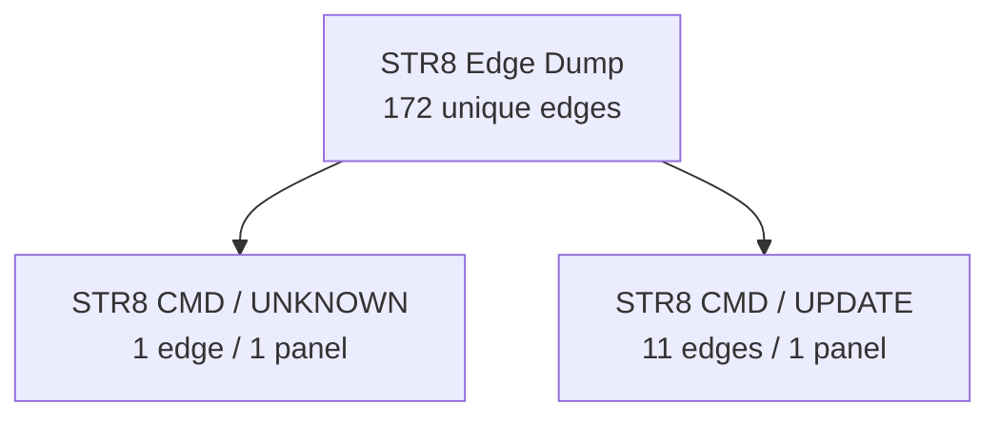

### Family Detail

#### ENTRY / unprefixed


#### STR8 / AP


#### STR8 / BOOT

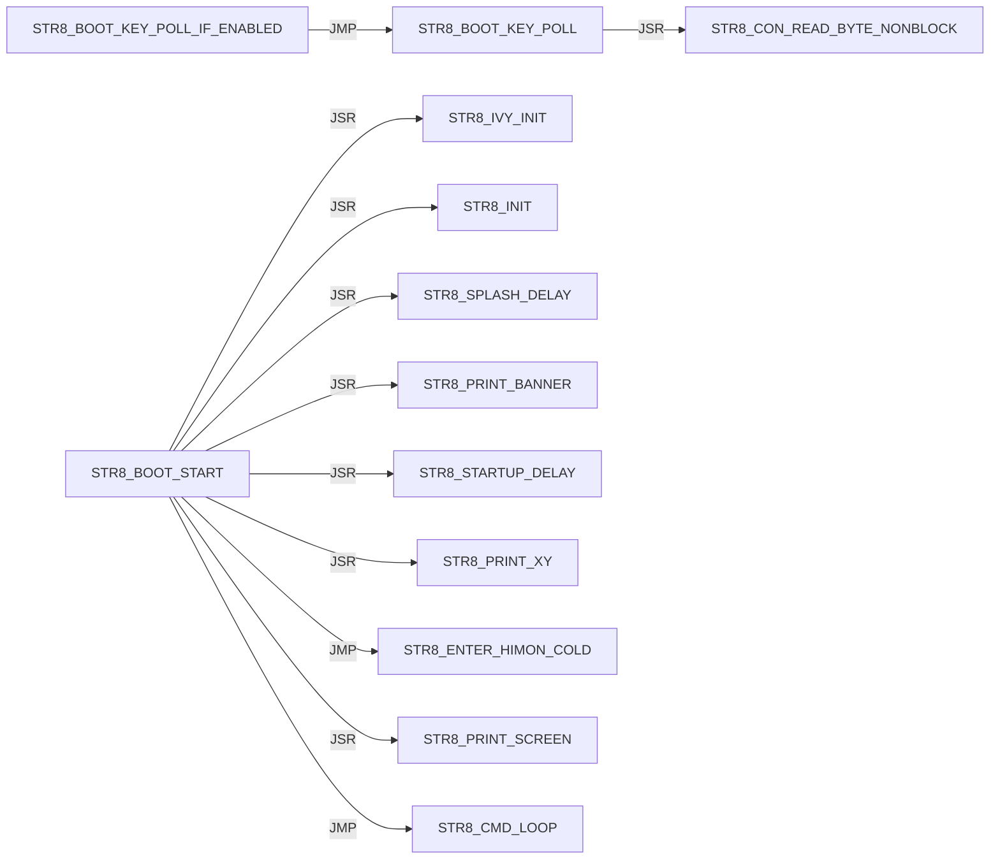

#### STR8 / CON

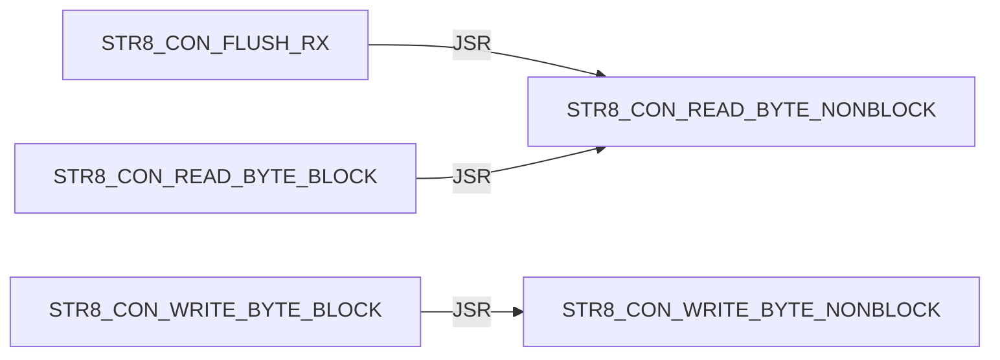

#### STR8 / CONFIRM

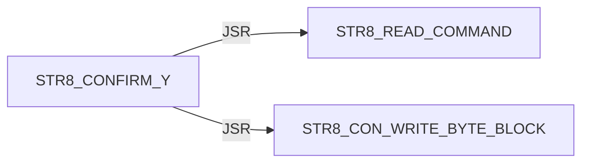

#### STR8 / COPY

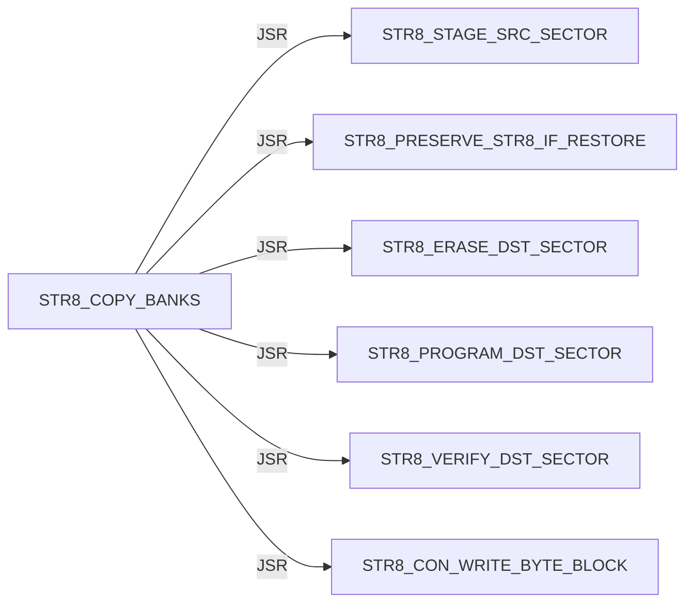

#### STR8 / DELAY


#### STR8 / DISPATCH

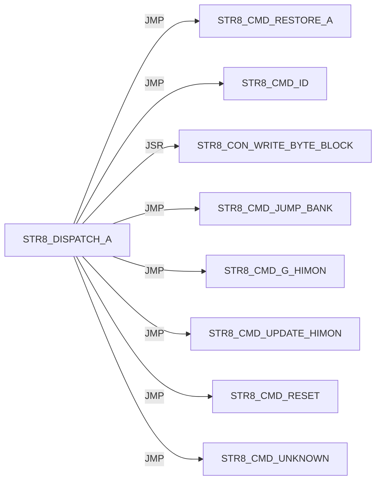

#### STR8 / ENTER

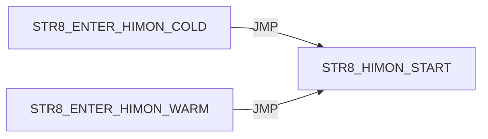

#### STR8 / ERASE

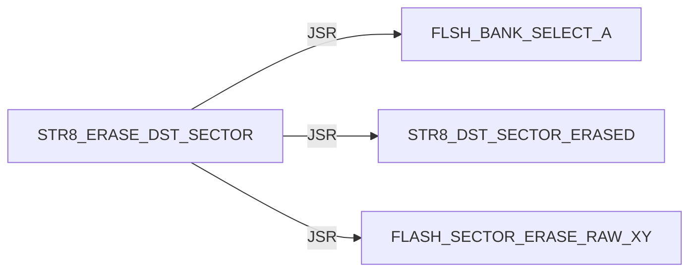

#### STR8 / INIT

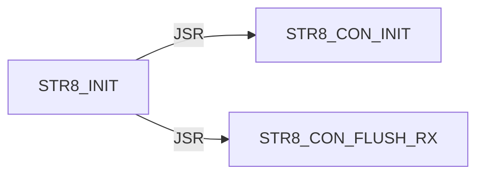

#### STR8 / IVY

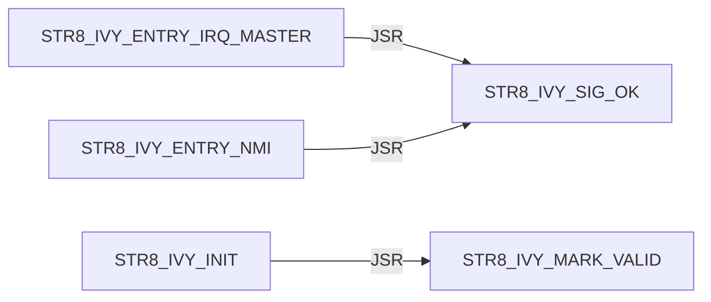

#### STR8 / JUMP

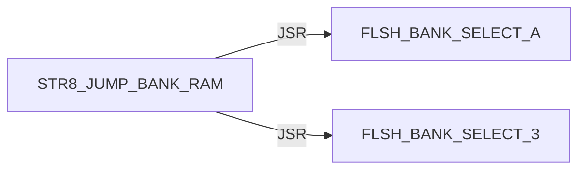

#### STR8 / PRESERVE


#### STR8 / PRINT

Panel 1 of 2: `STR8_PRINT_BANNER` through `STR8_PRINT_JUMP_FAIL`.

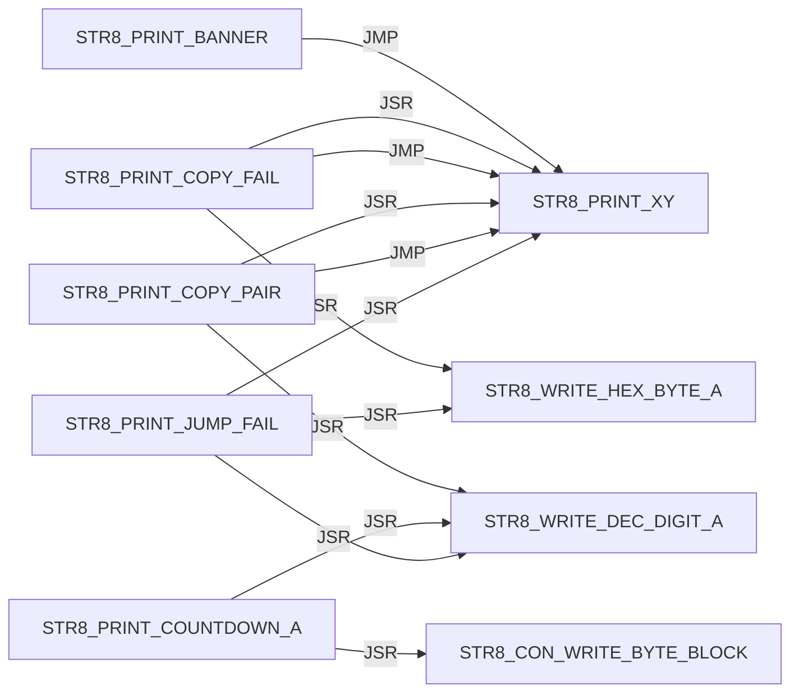

Panel 2 of 2: `STR8_PRINT_JUMP_FAIL` through `STR8_PRINT_XY`.

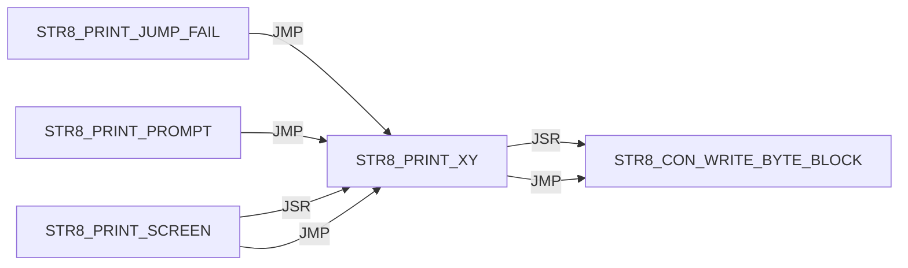

#### STR8 / PROGRAM

```mermaid
flowchart LR
    N0["STR8_PROGRAM_DST_SECTOR"] -->|JSR| N1["FLSH_BANK_SELECT_A"]
    N0["STR8_PROGRAM_DST_SECTOR"] -->|JSR| N2["FLASH_WRITE_BYTE_RAW_AXY"]
    N3["STR8_PROGRAM_HIMON_SECTOR_AX"] -->|JSR| N4["STR8_COPY_WORKER_TO_RAM"]
    N3["STR8_PROGRAM_HIMON_SECTOR_AX"] -->|JSR| N5["STR8_WORKER_RUN"]
    N3["STR8_PROGRAM_HIMON_SECTOR_AX"] -->|JSR| N6["STR8_CON_WRITE_BYTE_BLOCK"]
    N7["STR8_PROGRAM_HIMON_UPDATE"] -->|JSR| N3["STR8_PROGRAM_HIMON_SECTOR_AX"]
```

#### STR8 / READ

```mermaid
flowchart LR
    N0["STR8_READ_COMMAND"] -->|JSR| N1["STR8_CON_READ_BYTE_BLOCK"]
    N2["STR8_READ_HIMON_S19"] -->|JSR| N3["STR8_RECORD_SERVICE_BODY"]
    N2["STR8_READ_HIMON_S19"] -->|JSR| N4["STR8_STAGE_HIMON_RECORD"]
    N2["STR8_READ_HIMON_S19"] -->|JSR| N5["STR8_CON_WRITE_BYTE_BLOCK"]
```

#### STR8 / REC

Panel 1 of 3: `STR8_REC_APPLY_LF` through `STR8_REC_PARSE`.

```mermaid
flowchart LR
    N0["STR8_REC_APPLY_LF"] -->|JSR| N1["STR8_REC_CLEAR_FAILURE"]
    N0["STR8_REC_APPLY_LF"] -->|JMP| N2["STR8_REC_FAIL_A"]
    N0["STR8_REC_APPLY_LF"] -->|JMP| N3["STR8_REC_RETURN_OK"]
    N0["STR8_REC_APPLY_LF"] -->|JSR| N4["STR8_REC_LOAD_APPLY_POINTERS"]
    N0["STR8_REC_APPLY_LF"] -->|JSR| N5["STR8_REC_CAPTURE_APPLY_FAILURE"]
    N0["STR8_REC_APPLY_LF"] -->|JSR| N6["STR8_REC_ADVANCE_APPLY_POINTERS"]
    N0["STR8_REC_APPLY_LF"] -->|JSR| N7["STR8_COPY_WORKER_TO_RAM"]
    N0["STR8_REC_APPLY_LF"] -->|JSR| N8["STR8_WORKER_RUN"]
    N9["STR8_REC_FAIL_READ_X"] -->|JMP| N10["STR8_REC_RETURN_CURRENT_FAIL"]
    N9["STR8_REC_FAIL_READ_X"] -->|JMP| N2["STR8_REC_FAIL_A"]
    N11["STR8_REC_PARSE"] -->|JSR| N12["STR8_REC_CLEAR_RESULT"]
    N11["STR8_REC_PARSE"] -->|JMP| N2["STR8_REC_FAIL_A"]
```

Panel 2 of 3: `STR8_REC_PARSE` through `STR8_REC_READ_HEX_BYTE`.

```mermaid
flowchart LR
    N0["STR8_REC_PARSE"] -->|JSR| N1["STR8_REC_READ_CHAR"]
    N0["STR8_REC_PARSE"] -->|JMP| N2["STR8_REC_FAIL_READ_START"]
    N0["STR8_REC_PARSE"] -->|JMP| N3["STR8_REC_FAIL_READ_TYPE"]
    N4["STR8_REC_PARSE_BODY"] -->|JSR| N5["STR8_REC_READ_SUM_BYTE"]
    N4["STR8_REC_PARSE_BODY"] -->|JMP| N6["STR8_REC_FAIL_READ_HEX"]
    N4["STR8_REC_PARSE_BODY"] -->|JMP| N7["STR8_REC_FAIL_A"]
    N4["STR8_REC_PARSE_BODY"] -->|JSR| N1["STR8_REC_READ_CHAR"]
    N4["STR8_REC_PARSE_BODY"] -->|JMP| N8["STR8_REC_FAIL_READ_END"]
    N4["STR8_REC_PARSE_BODY"] -->|JMP| N9["STR8_REC_RETURN_OK"]
    N1["STR8_REC_READ_CHAR"] -->|JSR| N10["STR8_CON_READ_BYTE_BLOCK"]
    N11["STR8_REC_READ_HEX_BYTE"] -->|JSR| N1["STR8_REC_READ_CHAR"]
    N11["STR8_REC_READ_HEX_BYTE"] -->|JSR| N12["STR8_REC_HEX_ASCII_TO_NIBBLE"]
```

Panel 3 of 3: `STR8_REC_READ_SUM_BYTE` through `STR8_REC_READ_SUM_BYTE`.

```mermaid
flowchart LR
    N0["STR8_REC_READ_SUM_BYTE"] -->|JSR| N1["STR8_REC_READ_HEX_BYTE"]
```

#### STR8 / RECORD

```mermaid
flowchart LR
    N0["STR8_RECORD_SERVICE_BODY"] -->|JMP| N1["STR8_REC_APPLY_LF"]
    N0["STR8_RECORD_SERVICE_BODY"] -->|JMP| N2["STR8_REC_FAIL_A"]
    N3["STR8_RECORD_SERVICE_ENTRY"] -->|JMP| N0["STR8_RECORD_SERVICE_BODY"]
```

#### STR8 / RUN

```mermaid
flowchart LR
    N0["STR8_RUN_COPY"] -->|JSR| N1["STR8_PRINT_COPY_PAIR"]
    N0["STR8_RUN_COPY"] -->|JSR| N2["STR8_COPY_BANKS"]
    N0["STR8_RUN_COPY"] -->|JSR| N3["STR8_COPY_WORKER_TO_RAM"]
    N0["STR8_RUN_COPY"] -->|JSR| N4["STR8_WORKER_RUN"]
    N5["STR8_RUN_WORKER_SERVICE"] -->|JMP| N6["STR8_RUN_WORKER_SERVICE_BODY"]
    N6["STR8_RUN_WORKER_SERVICE_BODY"] -->|JSR| N3["STR8_COPY_WORKER_TO_RAM"]
    N6["STR8_RUN_WORKER_SERVICE_BODY"] -->|JSR| N4["STR8_WORKER_RUN"]
```

#### STR8 / SELECT

```mermaid
flowchart LR
    N0["STR8_SELECT_BANK_3"] -->|JSR| N1["FLSH_BANK_SELECT_3"]
```

#### STR8 / SPLASH

```mermaid
flowchart LR
    N0["STR8_SPLASH_DELAY"] -->|JMP| N1["UTL_DELAY_AXY_8MHZ"]
```

#### STR8 / STAGE

```mermaid
flowchart LR
    N0["STR8_STAGE_B3_PROTECTED"] -->|JSR| N1["STR8_SELECT_BANK_3"]
    N2["STR8_STAGE_SRC_SECTOR"] -->|JSR| N3["FLSH_BANK_SELECT_A"]
```

#### STR8 / STARTUP

```mermaid
flowchart LR
    N0["STR8_STARTUP_DELAY"] -->|JSR| N1["STR8_PRINT_XY"]
    N0["STR8_STARTUP_DELAY"] -->|JSR| N2["STR8_BOOT_KEY_POLL_IF_ENABLED"]
    N0["STR8_STARTUP_DELAY"] -->|JSR| N3["STR8_PRINT_COUNTDOWN_A"]
    N0["STR8_STARTUP_DELAY"] -->|JSR| N4["STR8_DELAY_COUNTDOWN_TICK_A"]
```

#### STR8 / VERIFY

```mermaid
flowchart LR
    N0["STR8_VERIFY_DST_SECTOR"] -->|JSR| N1["FLSH_BANK_SELECT_A"]
```

#### STR8 / WRITE

```mermaid
flowchart LR
    N0["STR8_WRITE_DEC_DIGIT_A"] -->|JMP| N1["STR8_CON_WRITE_BYTE_BLOCK"]
    N2["STR8_WRITE_HEX_BYTE_A"] -->|JSR| N3["STR8_WRITE_HEX_NIBBLE_A"]
    N3["STR8_WRITE_HEX_NIBBLE_A"] -->|JMP| N1["STR8_CON_WRITE_BYTE_BLOCK"]
```

#### STR8 CMD / ABORT

```mermaid
flowchart LR
    N0["STR8_CMD_ABORT"] -->|JSR| N1["STR8_SELECT_BANK_3"]
    N0["STR8_CMD_ABORT"] -->|JMP| N2["STR8_PRINT_XY"]
```

#### STR8 CMD / BACKUP

```mermaid
flowchart LR
    N0["STR8_CMD_BACKUP"] -->|JSR| N1["STR8_PRINT_XY"]
    N0["STR8_CMD_BACKUP"] -->|JSR| N2["STR8_READ_COMMAND"]
    N0["STR8_CMD_BACKUP"] -->|JSR| N3["STR8_CON_WRITE_BYTE_BLOCK"]
    N0["STR8_CMD_BACKUP"] -->|JSR| N4["STR8_CONFIRM_Y"]
    N0["STR8_CMD_BACKUP"] -->|JSR| N5["STR8_RUN_COPY"]
    N0["STR8_CMD_BACKUP"] -->|JMP| N6["STR8_CMD_OK"]
    N0["STR8_CMD_BACKUP"] -->|JMP| N7["STR8_CMD_ABORT"]
    N0["STR8_CMD_BACKUP"] -->|JMP| N8["STR8_CMD_COPY_FAIL"]
```

#### STR8 CMD / COPY

```mermaid
flowchart LR
    N0["STR8_CMD_COPY_FAIL"] -->|JSR| N1["STR8_SELECT_BANK_3"]
    N0["STR8_CMD_COPY_FAIL"] -->|JMP| N2["STR8_PRINT_COPY_FAIL"]
```

#### STR8 CMD / G

```mermaid
flowchart LR
    N0["STR8_CMD_G_HIMON"] -->|JSR| N1["STR8_SELECT_BANK_3"]
    N0["STR8_CMD_G_HIMON"] -->|JSR| N2["STR8_PRINT_XY"]
    N0["STR8_CMD_G_HIMON"] -->|JMP| N3["STR8_ENTER_HIMON_WARM"]
```

#### STR8 CMD / ID

```mermaid
flowchart LR
    N0["STR8_CMD_ID"] -->|JMP| N1["STR8_PRINT_XY"]
```

#### STR8 CMD / JUMP

```mermaid
flowchart LR
    N0["STR8_CMD_JUMP_BANK"] -->|JSR| N1["STR8_READ_COMMAND"]
    N0["STR8_CMD_JUMP_BANK"] -->|JSR| N2["STR8_CON_WRITE_BYTE_BLOCK"]
    N0["STR8_CMD_JUMP_BANK"] -->|JSR| N3["STR8_PRINT_XY"]
    N0["STR8_CMD_JUMP_BANK"] -->|JSR| N4["STR8_WRITE_DEC_DIGIT_A"]
    N0["STR8_CMD_JUMP_BANK"] -->|JSR| N5["STR8_CON_FLUSH_RX"]
    N0["STR8_CMD_JUMP_BANK"] -->|JSR| N6["STR8_JUMP_BANK_RAM"]
    N0["STR8_CMD_JUMP_BANK"] -->|JSR| N7["STR8_COPY_WORKER_TO_RAM"]
    N0["STR8_CMD_JUMP_BANK"] -->|JSR| N8["STR8_WORKER_RUN"]
    N0["STR8_CMD_JUMP_BANK"] -->|JMP| N9["STR8_PRINT_JUMP_FAIL"]
    N0["STR8_CMD_JUMP_BANK"] -->|JMP| N10["STR8_CMD_UNKNOWN"]
```

#### STR8 CMD / LOOP

```mermaid
flowchart LR
    N0["STR8_CMD_LOOP"] -->|JSR| N1["STR8_PRINT_PROMPT"]
    N0["STR8_CMD_LOOP"] -->|JSR| N2["STR8_READ_COMMAND"]
    N0["STR8_CMD_LOOP"] -->|JSR| N3["STR8_DISPATCH_A"]
```

#### STR8 CMD / OK

```mermaid
flowchart LR
    N0["STR8_CMD_OK"] -->|JSR| N1["STR8_SELECT_BANK_3"]
    N0["STR8_CMD_OK"] -->|JMP| N2["STR8_PRINT_XY"]
```

#### STR8 CMD / RESET

```mermaid
flowchart LR
    N0["STR8_CMD_RESET"] -->|JSR| N1["STR8_SELECT_BANK_3"]
```

#### STR8 CMD / RESTORE

```mermaid
flowchart LR
    N0["STR8_CMD_RESTORE_A"] -->|JSR| N1["STR8_PRINT_XY"]
    N0["STR8_CMD_RESTORE_A"] -->|JSR| N2["STR8_WRITE_DEC_DIGIT_A"]
    N0["STR8_CMD_RESTORE_A"] -->|JSR| N3["STR8_CONFIRM_Y"]
    N0["STR8_CMD_RESTORE_A"] -->|JMP| N4["STR8_CMD_ABORT"]
    N0["STR8_CMD_RESTORE_A"] -->|JSR| N5["STR8_CON_FLUSH_RX"]
    N0["STR8_CMD_RESTORE_A"] -->|JSR| N6["STR8_RUN_COPY"]
    N0["STR8_CMD_RESTORE_A"] -->|JMP| N7["STR8_CMD_OK"]
```

#### STR8 CMD / UNKNOWN

```mermaid
flowchart LR
    N0["STR8_CMD_UNKNOWN"] -->|JMP| N1["STR8_PRINT_XY"]
```

#### STR8 CMD / UPDATE

```mermaid
flowchart LR
    N0["STR8_CMD_UPDATE_HIMON"] -->|JMP| N1["STR8_PRINT_XY"]
    N0["STR8_CMD_UPDATE_HIMON"] -->|JSR| N1["STR8_PRINT_XY"]
    N0["STR8_CMD_UPDATE_HIMON"] -->|JSR| N2["STR8_CONFIRM_Y"]
    N0["STR8_CMD_UPDATE_HIMON"] -->|JSR| N3["STR8_STAGE_HIMON_BLANK"]
    N0["STR8_CMD_UPDATE_HIMON"] -->|JSR| N4["STR8_UPD_INIT"]
    N0["STR8_CMD_UPDATE_HIMON"] -->|JSR| N5["STR8_READ_HIMON_S19"]
    N0["STR8_CMD_UPDATE_HIMON"] -->|JSR| N6["STR8_PROGRAM_HIMON_UPDATE"]
    N0["STR8_CMD_UPDATE_HIMON"] -->|JMP| N7["STR8_CMD_OK"]
    N8["STR8_CMD_UPDATE_NO_DATA"] -->|JMP| N1["STR8_PRINT_XY"]
    N9["STR8_CMD_UPDATE_S19_FAIL"] -->|JSR| N10["STR8_CON_FLUSH_RX"]
    N9["STR8_CMD_UPDATE_S19_FAIL"] -->|JMP| N1["STR8_PRINT_XY"]
```

## External Targets

These targets are not labels in this source file; most are `XREF` providers from sibling ROM modules.

```text
FLASH_SECTOR_ERASE_RAW_XY
FLASH_WRITE_BYTE_RAW_AXY
FLSH_BANK_SELECT_3
FLSH_BANK_SELECT_A
STR8_HIMON_START
STR8_WORKER_RUN
UTL_DELAY_AXY_8MHZ
```

## Unique Direct Edges By Source Label

Each block is one source label. Indented lines are outgoing direct edges.
Blank lines are source-level breaks; they do not imply call depth.

```text
START
    JMP STR8_BOOT_START

STR8_AP_IMPORT_LINK_SERVICE
    JMP STR8_AP_IMPORT_LINK_SERVICE_BODY

STR8_BOOT_KEY_POLL
    JSR STR8_CON_READ_BYTE_NONBLOCK

STR8_BOOT_KEY_POLL_IF_ENABLED
    JMP STR8_BOOT_KEY_POLL

STR8_BOOT_START
    JSR STR8_IVY_INIT
    JSR STR8_INIT
    JSR STR8_SPLASH_DELAY
    JSR STR8_PRINT_BANNER
    JSR STR8_STARTUP_DELAY
    JSR STR8_PRINT_XY
    JMP STR8_ENTER_HIMON_COLD
    JSR STR8_PRINT_SCREEN
    JMP STR8_CMD_LOOP

STR8_CMD_ABORT
    JSR STR8_SELECT_BANK_3
    JMP STR8_PRINT_XY

STR8_CMD_BACKUP
    JSR STR8_PRINT_XY
    JSR STR8_READ_COMMAND
    JSR STR8_CON_WRITE_BYTE_BLOCK
    JSR STR8_CONFIRM_Y
    JSR STR8_RUN_COPY
    JMP STR8_CMD_OK
    JMP STR8_CMD_ABORT
    JMP STR8_CMD_COPY_FAIL

STR8_CMD_COPY_FAIL
    JSR STR8_SELECT_BANK_3
    JMP STR8_PRINT_COPY_FAIL

STR8_CMD_G_HIMON
    JSR STR8_SELECT_BANK_3
    JSR STR8_PRINT_XY
    JMP STR8_ENTER_HIMON_WARM

STR8_CMD_ID
    JMP STR8_PRINT_XY

STR8_CMD_JUMP_BANK
    JSR STR8_READ_COMMAND
    JSR STR8_CON_WRITE_BYTE_BLOCK
    JSR STR8_PRINT_XY
    JSR STR8_WRITE_DEC_DIGIT_A
    JSR STR8_CON_FLUSH_RX
    JSR STR8_JUMP_BANK_RAM
    JSR STR8_COPY_WORKER_TO_RAM
    JSR STR8_WORKER_RUN
    JMP STR8_PRINT_JUMP_FAIL
    JMP STR8_CMD_UNKNOWN

STR8_CMD_LOOP
    JSR STR8_PRINT_PROMPT
    JSR STR8_READ_COMMAND
    JSR STR8_DISPATCH_A

STR8_CMD_OK
    JSR STR8_SELECT_BANK_3
    JMP STR8_PRINT_XY

STR8_CMD_RESET
    JSR STR8_SELECT_BANK_3

STR8_CMD_RESTORE_A
    JSR STR8_PRINT_XY
    JSR STR8_WRITE_DEC_DIGIT_A
    JSR STR8_CONFIRM_Y
    JMP STR8_CMD_ABORT
    JSR STR8_CON_FLUSH_RX
    JSR STR8_RUN_COPY
    JMP STR8_CMD_OK

STR8_CMD_UNKNOWN
    JMP STR8_PRINT_XY

STR8_CMD_UPDATE_HIMON
    JMP STR8_PRINT_XY
    JSR STR8_PRINT_XY
    JSR STR8_CONFIRM_Y
    JSR STR8_STAGE_HIMON_BLANK
    JSR STR8_UPD_INIT
    JSR STR8_READ_HIMON_S19
    JSR STR8_PROGRAM_HIMON_UPDATE
    JMP STR8_CMD_OK

STR8_CMD_UPDATE_NO_DATA
    JMP STR8_PRINT_XY

STR8_CMD_UPDATE_S19_FAIL
    JSR STR8_CON_FLUSH_RX
    JMP STR8_PRINT_XY

STR8_CON_FLUSH_RX
    JSR STR8_CON_READ_BYTE_NONBLOCK

STR8_CON_READ_BYTE_BLOCK
    JSR STR8_CON_READ_BYTE_NONBLOCK

STR8_CON_WRITE_BYTE_BLOCK
    JSR STR8_CON_WRITE_BYTE_NONBLOCK

STR8_CONFIRM_Y
    JSR STR8_READ_COMMAND
    JSR STR8_CON_WRITE_BYTE_BLOCK

STR8_COPY_BANKS
    JSR STR8_STAGE_SRC_SECTOR
    JSR STR8_PRESERVE_STR8_IF_RESTORE
    JSR STR8_ERASE_DST_SECTOR
    JSR STR8_PROGRAM_DST_SECTOR
    JSR STR8_VERIFY_DST_SECTOR
    JSR STR8_CON_WRITE_BYTE_BLOCK

STR8_DELAY_COUNTDOWN_TICK_A
    JMP UTL_DELAY_AXY_8MHZ

STR8_DISPATCH_A
    JMP STR8_CMD_RESTORE_A
    JMP STR8_CMD_ID
    JSR STR8_CON_WRITE_BYTE_BLOCK
    JMP STR8_CMD_JUMP_BANK
    JMP STR8_CMD_G_HIMON
    JMP STR8_CMD_UPDATE_HIMON
    JMP STR8_CMD_RESET
    JMP STR8_CMD_UNKNOWN

STR8_ENTER_HIMON_COLD
    JMP STR8_HIMON_START

STR8_ENTER_HIMON_WARM
    JMP STR8_HIMON_START

STR8_ERASE_DST_SECTOR
    JSR FLSH_BANK_SELECT_A
    JSR STR8_DST_SECTOR_ERASED
    JSR FLASH_SECTOR_ERASE_RAW_XY

STR8_INIT
    JSR STR8_CON_INIT
    JSR STR8_CON_FLUSH_RX

STR8_IVY_ENTRY_IRQ_MASTER
    JSR STR8_IVY_SIG_OK

STR8_IVY_ENTRY_NMI
    JSR STR8_IVY_SIG_OK

STR8_IVY_INIT
    JSR STR8_IVY_MARK_VALID

STR8_JUMP_BANK_RAM
    JSR FLSH_BANK_SELECT_A
    JSR FLSH_BANK_SELECT_3

STR8_PRESERVE_STR8_IF_RESTORE
    JSR STR8_STAGE_B3_PROTECTED

STR8_PRINT_BANNER
    JMP STR8_PRINT_XY

STR8_PRINT_COPY_FAIL
    JSR STR8_PRINT_XY
    JSR STR8_WRITE_HEX_BYTE_A
    JMP STR8_PRINT_XY

STR8_PRINT_COPY_PAIR
    JSR STR8_PRINT_XY
    JSR STR8_WRITE_DEC_DIGIT_A
    JMP STR8_PRINT_XY

STR8_PRINT_COUNTDOWN_A
    JSR STR8_WRITE_DEC_DIGIT_A
    JSR STR8_CON_WRITE_BYTE_BLOCK

STR8_PRINT_JUMP_FAIL
    JSR STR8_PRINT_XY
    JSR STR8_WRITE_DEC_DIGIT_A
    JSR STR8_WRITE_HEX_BYTE_A
    JMP STR8_PRINT_XY

STR8_PRINT_PROMPT
    JMP STR8_PRINT_XY

STR8_PRINT_SCREEN
    JSR STR8_PRINT_XY
    JMP STR8_PRINT_XY

STR8_PRINT_XY
    JSR STR8_CON_WRITE_BYTE_BLOCK
    JMP STR8_CON_WRITE_BYTE_BLOCK

STR8_PROGRAM_DST_SECTOR
    JSR FLSH_BANK_SELECT_A
    JSR FLASH_WRITE_BYTE_RAW_AXY

STR8_PROGRAM_HIMON_SECTOR_AX
    JSR STR8_COPY_WORKER_TO_RAM
    JSR STR8_WORKER_RUN
    JSR STR8_CON_WRITE_BYTE_BLOCK

STR8_PROGRAM_HIMON_UPDATE
    JSR STR8_PROGRAM_HIMON_SECTOR_AX

STR8_READ_COMMAND
    JSR STR8_CON_READ_BYTE_BLOCK

STR8_READ_HIMON_S19
    JSR STR8_RECORD_SERVICE_BODY
    JSR STR8_STAGE_HIMON_RECORD
    JSR STR8_CON_WRITE_BYTE_BLOCK

STR8_REC_APPLY_LF
    JSR STR8_REC_CLEAR_FAILURE
    JMP STR8_REC_FAIL_A
    JMP STR8_REC_RETURN_OK
    JSR STR8_REC_LOAD_APPLY_POINTERS
    JSR STR8_REC_CAPTURE_APPLY_FAILURE
    JSR STR8_REC_ADVANCE_APPLY_POINTERS
    JSR STR8_COPY_WORKER_TO_RAM
    JSR STR8_WORKER_RUN

STR8_REC_FAIL_READ_X
    JMP STR8_REC_RETURN_CURRENT_FAIL
    JMP STR8_REC_FAIL_A

STR8_REC_PARSE
    JSR STR8_REC_CLEAR_RESULT
    JMP STR8_REC_FAIL_A
    JSR STR8_REC_READ_CHAR
    JMP STR8_REC_FAIL_READ_START
    JMP STR8_REC_FAIL_READ_TYPE

STR8_REC_PARSE_BODY
    JSR STR8_REC_READ_SUM_BYTE
    JMP STR8_REC_FAIL_READ_HEX
    JMP STR8_REC_FAIL_A
    JSR STR8_REC_READ_CHAR
    JMP STR8_REC_FAIL_READ_END
    JMP STR8_REC_RETURN_OK

STR8_REC_READ_CHAR
    JSR STR8_CON_READ_BYTE_BLOCK

STR8_REC_READ_HEX_BYTE
    JSR STR8_REC_READ_CHAR
    JSR STR8_REC_HEX_ASCII_TO_NIBBLE

STR8_REC_READ_SUM_BYTE
    JSR STR8_REC_READ_HEX_BYTE

STR8_RECORD_SERVICE_BODY
    JMP STR8_REC_APPLY_LF
    JMP STR8_REC_FAIL_A

STR8_RECORD_SERVICE_ENTRY
    JMP STR8_RECORD_SERVICE_BODY

STR8_RUN_COPY
    JSR STR8_PRINT_COPY_PAIR
    JSR STR8_COPY_BANKS
    JSR STR8_COPY_WORKER_TO_RAM
    JSR STR8_WORKER_RUN

STR8_RUN_WORKER_SERVICE
    JMP STR8_RUN_WORKER_SERVICE_BODY

STR8_RUN_WORKER_SERVICE_BODY
    JSR STR8_COPY_WORKER_TO_RAM
    JSR STR8_WORKER_RUN

STR8_SELECT_BANK_3
    JSR FLSH_BANK_SELECT_3

STR8_SPLASH_DELAY
    JMP UTL_DELAY_AXY_8MHZ

STR8_STAGE_B3_PROTECTED
    JSR STR8_SELECT_BANK_3

STR8_STAGE_SRC_SECTOR
    JSR FLSH_BANK_SELECT_A

STR8_STARTUP_DELAY
    JSR STR8_PRINT_XY
    JSR STR8_BOOT_KEY_POLL_IF_ENABLED
    JSR STR8_PRINT_COUNTDOWN_A
    JSR STR8_DELAY_COUNTDOWN_TICK_A

STR8_VERIFY_DST_SECTOR
    JSR FLSH_BANK_SELECT_A

STR8_WRITE_DEC_DIGIT_A
    JMP STR8_CON_WRITE_BYTE_BLOCK

STR8_WRITE_HEX_BYTE_A
    JSR STR8_WRITE_HEX_NIBBLE_A

STR8_WRITE_HEX_NIBBLE_A
    JMP STR8_CON_WRITE_BYTE_BLOCK

```

## Raw Direct Edge Sites By Source Label

Each line is a direct call/jump site with source line number.

```text
START
      147  JMP STR8_BOOT_START

STR8_AP_IMPORT_LINK_SERVICE
      155  JMP STR8_AP_IMPORT_LINK_SERVICE_BODY

STR8_BOOT_KEY_POLL
      386  JSR STR8_CON_READ_BYTE_NONBLOCK

STR8_BOOT_KEY_POLL_IF_ENABLED
      360  JMP STR8_BOOT_KEY_POLL

STR8_BOOT_START
      173  JSR STR8_IVY_INIT
      174  JSR STR8_INIT
      177  JSR STR8_SPLASH_DELAY
      178  JSR STR8_PRINT_BANNER
      179  JSR STR8_STARTUP_DELAY
      183  JSR STR8_PRINT_XY
      184  JMP STR8_ENTER_HIMON_COLD
      187  JSR STR8_PRINT_SCREEN
      188  JMP STR8_CMD_LOOP

STR8_CMD_ABORT
      633  JSR STR8_SELECT_BANK_3
      637  JMP STR8_PRINT_XY

STR8_CMD_BACKUP
      503  JSR STR8_PRINT_XY
      504  JSR STR8_READ_COMMAND
      509  JSR STR8_CON_WRITE_BYTE_BLOCK
      517  JSR STR8_PRINT_XY
      518  JSR STR8_CONFIRM_Y
      520  JSR STR8_RUN_COPY
      522  JMP STR8_CMD_OK
      524  JMP STR8_CMD_ABORT
      526  JMP STR8_CMD_COPY_FAIL

STR8_CMD_COPY_FAIL
      641  JSR STR8_SELECT_BANK_3
      643  JMP STR8_PRINT_COPY_FAIL

STR8_CMD_G_HIMON
      605  JSR STR8_SELECT_BANK_3
      608  JSR STR8_PRINT_XY
      609  JMP STR8_ENTER_HIMON_WARM
      613  JSR STR8_PRINT_XY
      614  JMP STR8_ENTER_HIMON_WARM

STR8_CMD_ID
      460  JMP STR8_PRINT_XY

STR8_CMD_JUMP_BANK
      466  JSR STR8_READ_COMMAND
      467  JSR STR8_CON_WRITE_BYTE_BLOCK
      481  JSR STR8_PRINT_XY
      483  JSR STR8_WRITE_DEC_DIGIT_A
      486  JSR STR8_PRINT_XY
      487  JSR STR8_CON_FLUSH_RX
      491  JSR STR8_JUMP_BANK_RAM
      493  JSR STR8_COPY_WORKER_TO_RAM
      494  JSR STR8_WORKER_RUN
      496  JMP STR8_PRINT_JUMP_FAIL
      498  JMP STR8_CMD_UNKNOWN

STR8_CMD_LOOP
      406  JSR STR8_PRINT_PROMPT
      407  JSR STR8_READ_COMMAND
      408  JSR STR8_DISPATCH_A

STR8_CMD_OK
      625  JSR STR8_SELECT_BANK_3
      629  JMP STR8_PRINT_XY

STR8_CMD_RESET
      619  JSR STR8_SELECT_BANK_3

STR8_CMD_RESTORE_A
      534  JSR STR8_PRINT_XY
      536  JSR STR8_WRITE_DEC_DIGIT_A
      539  JSR STR8_PRINT_XY
      540  JSR STR8_CONFIRM_Y
      542  JMP STR8_CMD_ABORT
      544  JSR STR8_CON_FLUSH_RX
      547  JSR STR8_PRINT_XY
      548  JSR STR8_CONFIRM_Y
      556  JSR STR8_RUN_COPY
      558  JMP STR8_CMD_OK

STR8_CMD_UNKNOWN
      648  JMP STR8_PRINT_XY

STR8_CMD_UPDATE_HIMON
      565  JMP STR8_PRINT_XY
      569  JSR STR8_PRINT_XY
      570  JSR STR8_CONFIRM_Y
      572  JSR STR8_STAGE_HIMON_BLANK
      573  JSR STR8_UPD_INIT
      576  JSR STR8_PRINT_XY
      577  JSR STR8_READ_HIMON_S19
      583  JSR STR8_PRINT_XY
      584  JSR STR8_CONFIRM_Y
      586  JSR STR8_PROGRAM_HIMON_UPDATE
      588  JMP STR8_CMD_OK

STR8_CMD_UPDATE_NO_DATA
      600  JMP STR8_PRINT_XY

STR8_CMD_UPDATE_S19_FAIL
      592  JSR STR8_CON_FLUSH_RX
      595  JMP STR8_PRINT_XY

STR8_CON_FLUSH_RX
     1700  JSR STR8_CON_READ_BYTE_NONBLOCK

STR8_CON_READ_BYTE_BLOCK
     1714  JSR STR8_CON_READ_BYTE_NONBLOCK

STR8_CON_WRITE_BYTE_BLOCK
     1740  JSR STR8_CON_WRITE_BYTE_NONBLOCK

STR8_CONFIRM_Y
     1350  JSR STR8_READ_COMMAND
     1352  JSR STR8_CON_WRITE_BYTE_BLOCK

STR8_COPY_BANKS
     1165  JSR STR8_STAGE_SRC_SECTOR
     1166  JSR STR8_PRESERVE_STR8_IF_RESTORE
     1167  JSR STR8_ERASE_DST_SECTOR
     1169  JSR STR8_PROGRAM_DST_SECTOR
     1171  JSR STR8_VERIFY_DST_SECTOR
     1174  JSR STR8_CON_WRITE_BYTE_BLOCK

STR8_DELAY_COUNTDOWN_TICK_A
      383  JMP UTL_DELAY_AXY_8MHZ

STR8_DISPATCH_A
      428  JMP STR8_CMD_RESTORE_A
      432  JMP STR8_CMD_ID
      440  JSR STR8_CON_WRITE_BYTE_BLOCK
      441  JMP STR8_CMD_JUMP_BANK
      445  JMP STR8_CMD_G_HIMON
      449  JMP STR8_CMD_UPDATE_HIMON
      453  JMP STR8_CMD_RESET
      455  JMP STR8_CMD_UNKNOWN

STR8_ENTER_HIMON_COLD
      303  JMP STR8_HIMON_START

STR8_ENTER_HIMON_WARM
      314  JMP STR8_HIMON_START

STR8_ERASE_DST_SECTOR
     1240  JSR FLSH_BANK_SELECT_A
     1241  JSR STR8_DST_SECTOR_ERASED
     1245  JSR FLASH_SECTOR_ERASE_RAW_XY
     1247  JSR STR8_DST_SECTOR_ERASED

STR8_INIT
      196  JSR STR8_CON_INIT
      197  JSR STR8_CON_FLUSH_RX

STR8_IVY_ENTRY_IRQ_MASTER
      275  JSR STR8_IVY_SIG_OK
      286  JSR STR8_IVY_SIG_OK

STR8_IVY_ENTRY_NMI
      258  JSR STR8_IVY_SIG_OK

STR8_IVY_INIT
      229  JSR STR8_IVY_MARK_VALID

STR8_JUMP_BANK_RAM
     1629  JSR FLSH_BANK_SELECT_A
     1659  JSR FLSH_BANK_SELECT_3

STR8_PRESERVE_STR8_IF_RESTORE
     1214  JSR STR8_STAGE_B3_PROTECTED

STR8_PRINT_BANNER
      327  JMP STR8_PRINT_XY

STR8_PRINT_COPY_FAIL
     1564  JSR STR8_PRINT_XY
     1566  JSR STR8_WRITE_HEX_BYTE_A
     1568  JSR STR8_WRITE_HEX_BYTE_A
     1571  JMP STR8_PRINT_XY
     1575  JMP STR8_PRINT_XY

STR8_PRINT_COPY_PAIR
     1364  JSR STR8_PRINT_XY
     1366  JSR STR8_WRITE_DEC_DIGIT_A
     1369  JSR STR8_PRINT_XY
     1371  JSR STR8_WRITE_DEC_DIGIT_A
     1374  JMP STR8_PRINT_XY

STR8_PRINT_COUNTDOWN_A
      366  JSR STR8_WRITE_DEC_DIGIT_A
      371  JSR STR8_CON_WRITE_BYTE_BLOCK

STR8_PRINT_JUMP_FAIL
     1581  JSR STR8_PRINT_XY
     1583  JSR STR8_WRITE_DEC_DIGIT_A
     1586  JSR STR8_PRINT_XY
     1588  JSR STR8_WRITE_HEX_BYTE_A
     1590  JSR STR8_WRITE_HEX_BYTE_A
     1593  JMP STR8_PRINT_XY

STR8_PRINT_PROMPT
     1671  JMP STR8_PRINT_XY

STR8_PRINT_SCREEN
      400  JSR STR8_PRINT_XY
      403  JMP STR8_PRINT_XY

STR8_PRINT_XY
     1679  JSR STR8_CON_WRITE_BYTE_BLOCK
     1685  JMP STR8_CON_WRITE_BYTE_BLOCK

STR8_PROGRAM_DST_SECTOR
     1283  JSR FLSH_BANK_SELECT_A
     1300  JSR FLASH_WRITE_BYTE_RAW_AXY

STR8_PROGRAM_HIMON_SECTOR_AX
     1548  JSR STR8_COPY_WORKER_TO_RAM
     1549  JSR STR8_WORKER_RUN
     1552  JSR STR8_CON_WRITE_BYTE_BLOCK

STR8_PROGRAM_HIMON_UPDATE
     1525  JSR STR8_PROGRAM_HIMON_SECTOR_AX
     1529  JSR STR8_PROGRAM_HIMON_SECTOR_AX
     1533  JSR STR8_PROGRAM_HIMON_SECTOR_AX

STR8_READ_COMMAND
      412  JSR STR8_CON_READ_BYTE_BLOCK

STR8_READ_HIMON_S19
     1450  JSR STR8_RECORD_SERVICE_BODY
     1461  JSR STR8_STAGE_HIMON_RECORD
     1464  JSR STR8_CON_WRITE_BYTE_BLOCK

STR8_REC_APPLY_LF
      888  JSR STR8_REC_CLEAR_FAILURE
      893  JMP STR8_REC_FAIL_A
      899  JMP STR8_REC_FAIL_A
      904  JMP STR8_REC_FAIL_A
      914  JMP STR8_REC_FAIL_A
      920  JMP STR8_REC_FAIL_A
      924  JMP STR8_REC_RETURN_OK
      943  JMP STR8_REC_FAIL_A
      950  JMP STR8_REC_FAIL_A
      953  JSR STR8_REC_LOAD_APPLY_POINTERS
      962  JSR STR8_REC_CAPTURE_APPLY_FAILURE
      964  JMP STR8_REC_FAIL_A
      966  JSR STR8_REC_ADVANCE_APPLY_POINTERS
      973  JMP STR8_REC_FAIL_A
      979  JSR STR8_COPY_WORKER_TO_RAM
      980  JSR STR8_WORKER_RUN
      989  JMP STR8_REC_FAIL_A
      993  JSR STR8_REC_LOAD_APPLY_POINTERS
     1000  JSR STR8_REC_CAPTURE_APPLY_FAILURE
     1002  JMP STR8_REC_FAIL_A
     1004  JSR STR8_REC_ADVANCE_APPLY_POINTERS
     1007  JMP STR8_REC_RETURN_OK

STR8_REC_FAIL_READ_X
      882  JMP STR8_REC_RETURN_CURRENT_FAIL
      885  JMP STR8_REC_FAIL_A

STR8_REC_PARSE
      694  JSR STR8_REC_CLEAR_RESULT
      699  JMP STR8_REC_FAIL_A
      705  JMP STR8_REC_FAIL_A
      729  JMP STR8_REC_FAIL_A
      732  JSR STR8_REC_READ_CHAR
      734  JMP STR8_REC_FAIL_READ_START
      742  JSR STR8_REC_READ_CHAR
      744  JMP STR8_REC_FAIL_READ_START
      750  JMP STR8_REC_FAIL_A
      752  JSR STR8_REC_READ_CHAR
      754  JMP STR8_REC_FAIL_READ_TYPE
      764  JMP STR8_REC_FAIL_A

STR8_REC_PARSE_BODY
      768  JSR STR8_REC_READ_SUM_BYTE
      770  JMP STR8_REC_FAIL_READ_HEX
      776  JMP STR8_REC_FAIL_A
      785  JMP STR8_REC_FAIL_A
      787  JSR STR8_REC_READ_SUM_BYTE
      789  JMP STR8_REC_FAIL_READ_HEX
      792  JSR STR8_REC_READ_SUM_BYTE
      794  JMP STR8_REC_FAIL_READ_HEX
      806  JSR STR8_REC_READ_SUM_BYTE
      808  JMP STR8_REC_FAIL_READ_HEX
      815  JSR STR8_REC_READ_SUM_BYTE
      817  JMP STR8_REC_FAIL_READ_HEX
      823  JMP STR8_REC_FAIL_A
      831  JMP STR8_REC_FAIL_A
      833  JSR STR8_REC_READ_CHAR
      835  JMP STR8_REC_FAIL_READ_END
      842  JMP STR8_REC_FAIL_A
      855  JMP STR8_REC_RETURN_OK
      865  JMP STR8_REC_RETURN_OK

STR8_REC_READ_CHAR
     1113  JSR STR8_CON_READ_BYTE_BLOCK

STR8_REC_READ_HEX_BYTE
     1071  JSR STR8_REC_READ_CHAR
     1073  JSR STR8_REC_HEX_ASCII_TO_NIBBLE
     1080  JSR STR8_REC_READ_CHAR
     1082  JSR STR8_REC_HEX_ASCII_TO_NIBBLE

STR8_REC_READ_SUM_BYTE
     1059  JSR STR8_REC_READ_HEX_BYTE

STR8_RECORD_SERVICE_BODY
      688  JMP STR8_REC_APPLY_LF
      691  JMP STR8_REC_FAIL_A

STR8_RECORD_SERVICE_ENTRY
      158  JMP STR8_RECORD_SERVICE_BODY

STR8_RUN_COPY
      651  JSR STR8_PRINT_COPY_PAIR
      653  JSR STR8_COPY_BANKS
      656  JSR STR8_COPY_WORKER_TO_RAM
      657  JSR STR8_WORKER_RUN

STR8_RUN_WORKER_SERVICE
      152  JMP STR8_RUN_WORKER_SERVICE_BODY

STR8_RUN_WORKER_SERVICE_BODY
      666  JSR STR8_COPY_WORKER_TO_RAM
      667  JSR STR8_WORKER_RUN

STR8_SELECT_BANK_3
     1345  JSR FLSH_BANK_SELECT_3

STR8_SPLASH_DELAY
      322  JMP UTL_DELAY_AXY_8MHZ

STR8_STAGE_B3_PROTECTED
     1218  JSR STR8_SELECT_BANK_3

STR8_STAGE_SRC_SECTOR
     1188  JSR FLSH_BANK_SELECT_A

STR8_STARTUP_DELAY
      334  JSR STR8_PRINT_XY
      338  JSR STR8_BOOT_KEY_POLL_IF_ENABLED
      342  JSR STR8_PRINT_COUNTDOWN_A
      345  JSR STR8_DELAY_COUNTDOWN_TICK_A
      346  JSR STR8_BOOT_KEY_POLL_IF_ENABLED

STR8_VERIFY_DST_SECTOR
     1317  JSR FLSH_BANK_SELECT_A

STR8_WRITE_DEC_DIGIT_A
     1599  JMP STR8_CON_WRITE_BYTE_BLOCK

STR8_WRITE_HEX_BYTE_A
     1607  JSR STR8_WRITE_HEX_NIBBLE_A

STR8_WRITE_HEX_NIBBLE_A
     1615  JMP STR8_CON_WRITE_BYTE_BLOCK
     1618  JMP STR8_CON_WRITE_BYTE_BLOCK

```
