# STR8 Edge Dump

Generated-style edge dump for `STR8/str8.asm`.

For the readable subsystem/capability view, see
[STR8.md](STR8.md).

Scope: direct `JSR target` and `JMP target` edges only. Relative branches, fallthrough, data labels, indirect calls, and computed jumps are not included. Source is the nearest preceding global label.

## Summary

```text
source file:     STR8/str8.asm
global labels:   175
raw call sites:  353
unique edges:    251
external targets:6
```

## Mermaid Direct-Edge Atlas

Every unique direct edge is present in this atlas. Source routines are grouped by command/subsystem stem, then split into independent Mermaid panels of at most 12 edges. The text sections below remain the complete audit-oriented evidence.

### Family Overview (part 1 of 3)

```mermaid
flowchart TD
    EDGE_ATLAS_ROOT_0["STR8 Edge Dump<br/>251 unique edges"] --> EDGE_FAMILY_0_0["ENTRY / unprefixed<br/>1 edge / 1 panel"]
    EDGE_ATLAS_ROOT_0["STR8 Edge Dump<br/>251 unique edges"] --> EDGE_FAMILY_0_1["STR8 / BANK<br/>4 edges / 1 panel"]
    EDGE_ATLAS_ROOT_0["STR8 Edge Dump<br/>251 unique edges"] --> EDGE_FAMILY_0_2["STR8 / BOOT<br/>22 edges / 2 panels"]
    EDGE_ATLAS_ROOT_0["STR8 Edge Dump<br/>251 unique edges"] --> EDGE_FAMILY_0_3["STR8 / CON<br/>3 edges / 1 panel"]
    EDGE_ATLAS_ROOT_0["STR8 Edge Dump<br/>251 unique edges"] --> EDGE_FAMILY_0_4["STR8 / CONFIRM<br/>2 edges / 1 panel"]
    EDGE_ATLAS_ROOT_0["STR8 Edge Dump<br/>251 unique edges"] --> EDGE_FAMILY_0_5["STR8 / DELAY<br/>1 edge / 1 panel"]
    EDGE_ATLAS_ROOT_0["STR8 Edge Dump<br/>251 unique edges"] --> EDGE_FAMILY_0_6["STR8 / DIR<br/>9 edges / 1 panel"]
    EDGE_ATLAS_ROOT_0["STR8 Edge Dump<br/>251 unique edges"] --> EDGE_FAMILY_0_7["STR8 / DISPATCH<br/>5 edges / 1 panel"]
    EDGE_ATLAS_ROOT_0["STR8 Edge Dump<br/>251 unique edges"] --> EDGE_FAMILY_0_8["STR8 / ENTER<br/>12 edges / 1 panel"]
    EDGE_ATLAS_ROOT_0["STR8 Edge Dump<br/>251 unique edges"] --> EDGE_FAMILY_0_9["STR8 / I<br/>50 edges / 5 panels"]
    EDGE_ATLAS_ROOT_0["STR8 Edge Dump<br/>251 unique edges"] --> EDGE_FAMILY_0_10["STR8 / INIT<br/>1 edge / 1 panel"]
    EDGE_ATLAS_ROOT_0["STR8 Edge Dump<br/>251 unique edges"] --> EDGE_FAMILY_0_11["STR8 / IVY<br/>3 edges / 1 panel"]
```

### Family Overview (part 2 of 3)

```mermaid
flowchart TD
    EDGE_ATLAS_ROOT_1["STR8 Edge Dump<br/>251 unique edges"] --> EDGE_FAMILY_1_0["STR8 / JUMP<br/>11 edges / 1 panel"]
    EDGE_ATLAS_ROOT_1["STR8 Edge Dump<br/>251 unique edges"] --> EDGE_FAMILY_1_1["STR8 / PRINT<br/>17 edges / 2 panels"]
    EDGE_ATLAS_ROOT_1["STR8 Edge Dump<br/>251 unique edges"] --> EDGE_FAMILY_1_2["STR8 / PROGRAM<br/>4 edges / 1 panel"]
    EDGE_ATLAS_ROOT_1["STR8 Edge Dump<br/>251 unique edges"] --> EDGE_FAMILY_1_3["STR8 / READ<br/>10 edges / 1 panel"]
    EDGE_ATLAS_ROOT_1["STR8 Edge Dump<br/>251 unique edges"] --> EDGE_FAMILY_1_4["STR8 / REC<br/>25 edges / 3 panels"]
    EDGE_ATLAS_ROOT_1["STR8 Edge Dump<br/>251 unique edges"] --> EDGE_FAMILY_1_5["STR8 / RECORD<br/>3 edges / 1 panel"]
    EDGE_ATLAS_ROOT_1["STR8 Edge Dump<br/>251 unique edges"] --> EDGE_FAMILY_1_6["STR8 / RUN<br/>5 edges / 1 panel"]
    EDGE_ATLAS_ROOT_1["STR8 Edge Dump<br/>251 unique edges"] --> EDGE_FAMILY_1_7["STR8 / SELECT<br/>1 edge / 1 panel"]
    EDGE_ATLAS_ROOT_1["STR8 Edge Dump<br/>251 unique edges"] --> EDGE_FAMILY_1_8["STR8 / STARTUP<br/>8 edges / 1 panel"]
    EDGE_ATLAS_ROOT_1["STR8 Edge Dump<br/>251 unique edges"] --> EDGE_FAMILY_1_9["STR8 / WRITE<br/>3 edges / 1 panel"]
    EDGE_ATLAS_ROOT_1["STR8 Edge Dump<br/>251 unique edges"] --> EDGE_FAMILY_1_10["STR8 CMD / ABORT<br/>3 edges / 1 panel"]
    EDGE_ATLAS_ROOT_1["STR8 Edge Dump<br/>251 unique edges"] --> EDGE_FAMILY_1_11["STR8 CMD / COPY<br/>2 edges / 1 panel"]
```

### Family Overview (part 3 of 3)

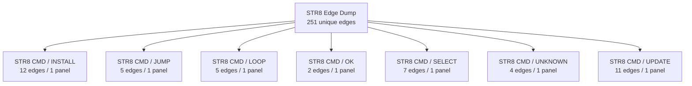

### Family Detail

#### ENTRY / unprefixed


#### STR8 / BANK

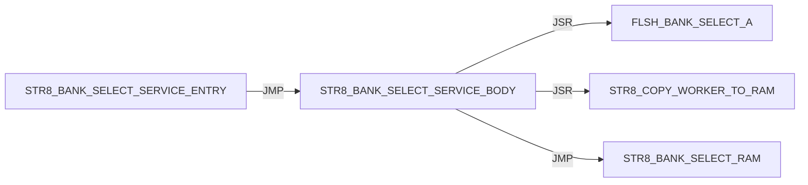

#### STR8 / BOOT

Panel 1 of 2: `STR8_BOOT_JUMP_BANK_A` through `STR8_BOOT_START`.


Panel 2 of 2: `STR8_BOOT_START` through `STR8_BOOT_START`.

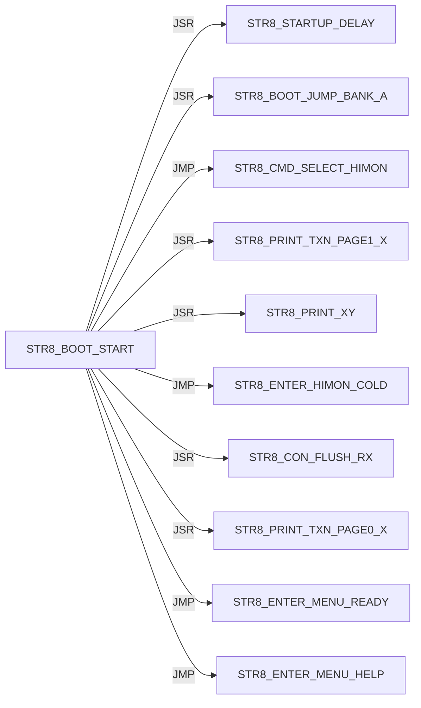

#### STR8 / CON

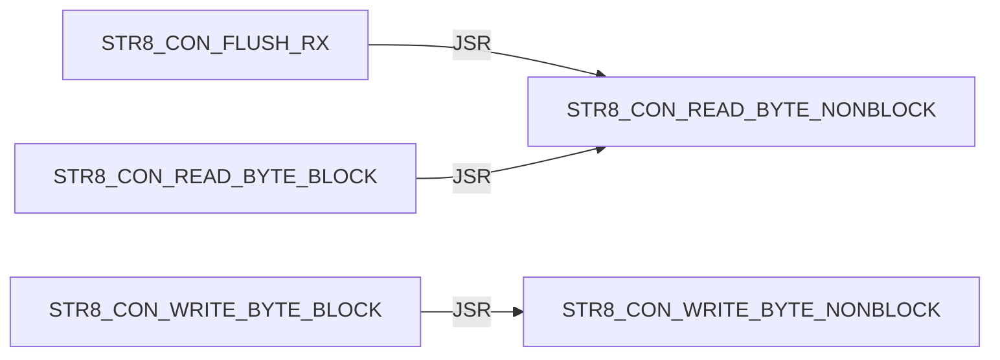

#### STR8 / CONFIRM

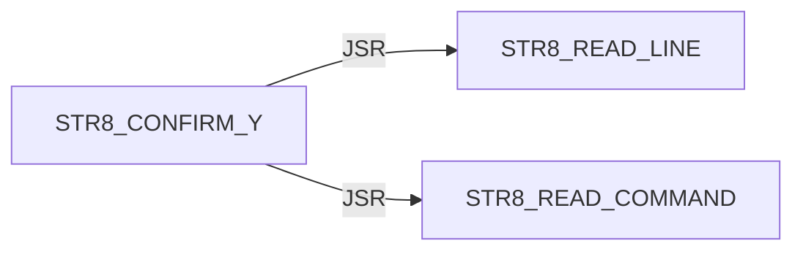

#### STR8 / DELAY


#### STR8 / DIR

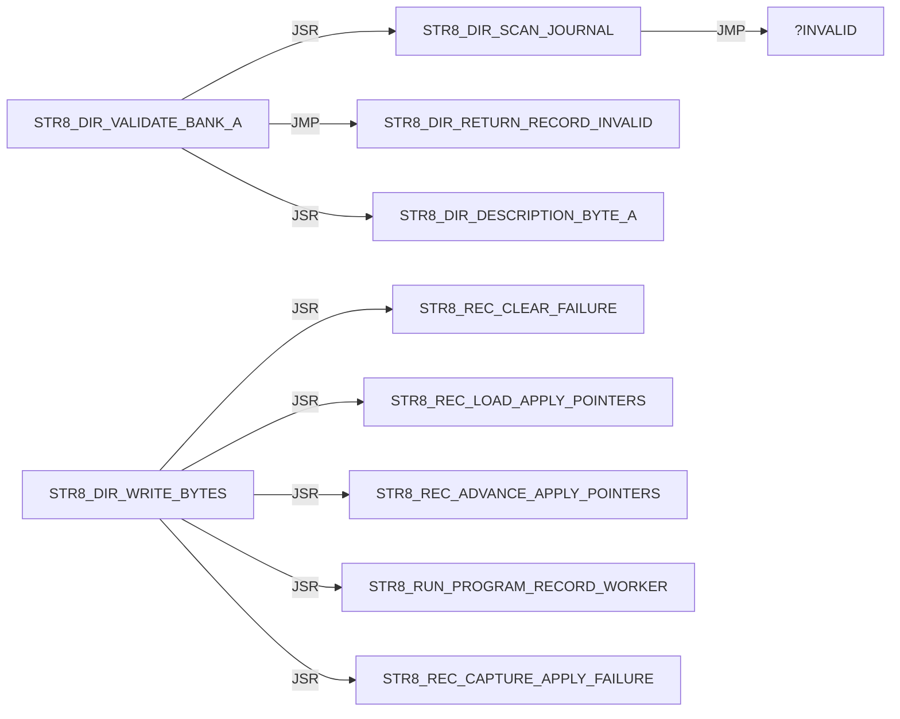

#### STR8 / DISPATCH

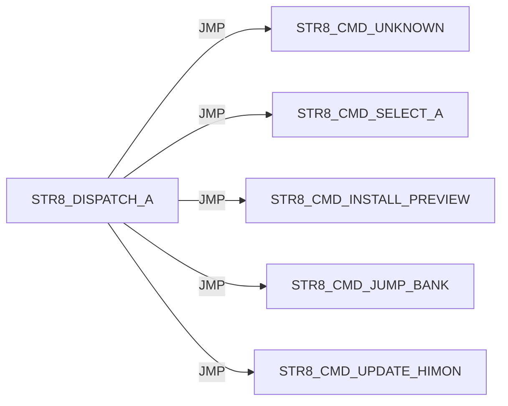

#### STR8 / ENTER

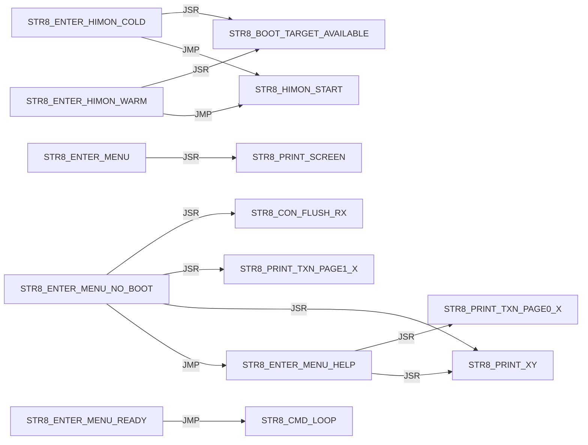

#### STR8 / I

Panel 1 of 5: `STR8_I_BEGIN_TRANSACTION` through `STR8_I_PRINT_SUMMARY`.

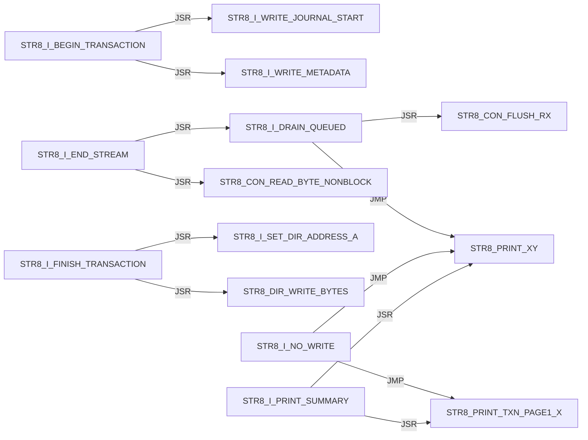

Panel 2 of 5: `STR8_I_PRINT_SUMMARY` through `STR8_I_READ_DESCRIPTION`.

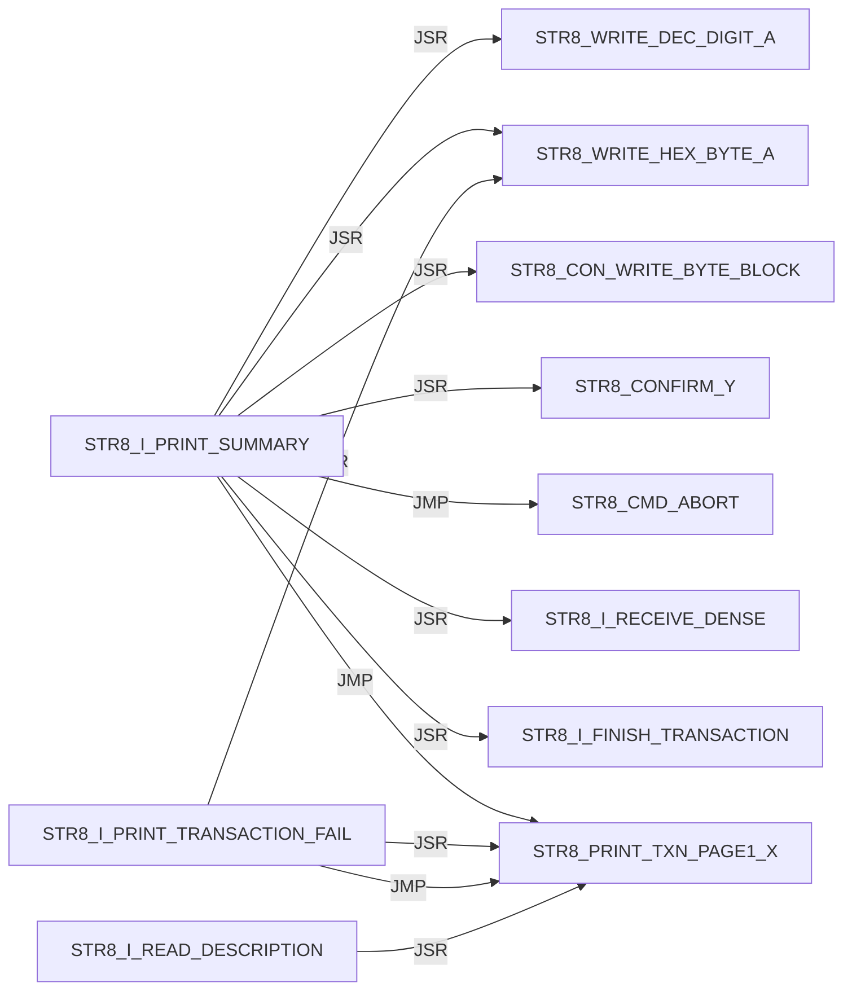

Panel 3 of 5: `STR8_I_READ_DESCRIPTION` through `STR8_I_RECEIVE_DENSE`.


Panel 4 of 5: `STR8_I_RECEIVE_DENSE` through `STR8_I_WRITE_JOURNAL_MASK_A`.

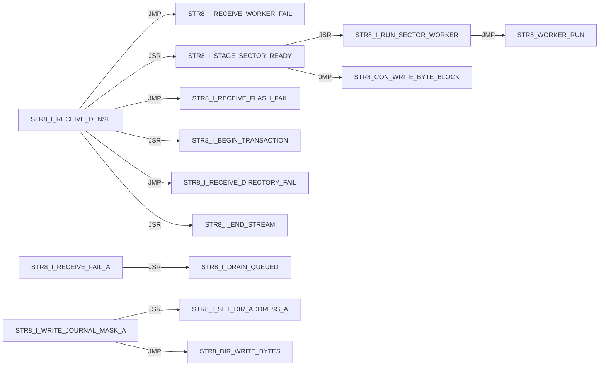

Panel 5 of 5: `STR8_I_WRITE_METADATA` through `STR8_I_WRITE_METADATA`.

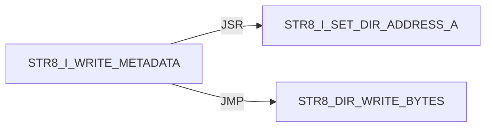

#### STR8 / INIT


#### STR8 / IVY

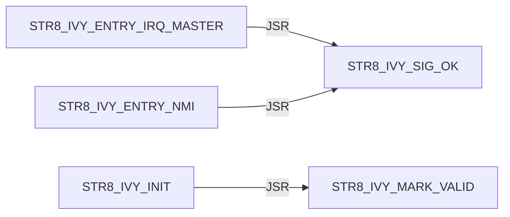

#### STR8 / JUMP

```mermaid
flowchart LR
    N0["STR8_JUMP_BANK_LAUNCH"] -->|JSR| N1["STR8_DIR_VALIDATE_BANK_A"]
    N0["STR8_JUMP_BANK_LAUNCH"] -->|JMP| N2["STR8_PRINT_JUMP_FAIL"]
    N0["STR8_JUMP_BANK_LAUNCH"] -->|JSR| N3["STR8_CON_FLUSH_RX"]
    N0["STR8_JUMP_BANK_LAUNCH"] -->|JSR| N4["STR8_JUMP_BANK_RAM"]
    N0["STR8_JUMP_BANK_LAUNCH"] -->|JSR| N5["STR8_COPY_WORKER_TO_RAM"]
    N0["STR8_JUMP_BANK_LAUNCH"] -->|JSR| N6["STR8_WORKER_RUN"]
    N7["STR8_JUMP_BANK_PREP_A"] -->|JSR| N8["STR8_PRINT_TXN_PAGE1_X"]
    N7["STR8_JUMP_BANK_PREP_A"] -->|JSR| N9["STR8_PRINT_XY"]
    N7["STR8_JUMP_BANK_PREP_A"] -->|JSR| N10["STR8_WRITE_DEC_DIGIT_A"]
    N4["STR8_JUMP_BANK_RAM"] -->|JSR| N11["FLSH_BANK_SELECT_A"]
    N4["STR8_JUMP_BANK_RAM"] -->|JSR| N12["FLSH_BANK_SELECT_3"]
```

#### STR8 / PRINT

Panel 1 of 2: `STR8_PRINT_BANNER` through `STR8_PRINT_PROMPT`.

```mermaid
flowchart LR
    N0["STR8_PRINT_BANNER"] -->|JMP| N1["STR8_PRINT_TXN_PAGE0_X"]
    N0["STR8_PRINT_BANNER"] -->|JMP| N2["STR8_PRINT_XY"]
    N3["STR8_PRINT_COPY_FAIL"] -->|JSR| N2["STR8_PRINT_XY"]
    N3["STR8_PRINT_COPY_FAIL"] -->|JSR| N4["STR8_WRITE_HEX_BYTE_A"]
    N3["STR8_PRINT_COPY_FAIL"] -->|JMP| N2["STR8_PRINT_XY"]
    N5["STR8_PRINT_JUMP_FAIL"] -->|JSR| N6["STR8_PRINT_TXN_PAGE1_X"]
    N5["STR8_PRINT_JUMP_FAIL"] -->|JSR| N2["STR8_PRINT_XY"]
    N5["STR8_PRINT_JUMP_FAIL"] -->|JSR| N7["STR8_WRITE_DEC_DIGIT_A"]
    N5["STR8_PRINT_JUMP_FAIL"] -->|JSR| N4["STR8_WRITE_HEX_BYTE_A"]
    N5["STR8_PRINT_JUMP_FAIL"] -->|JMP| N6["STR8_PRINT_TXN_PAGE1_X"]
    N5["STR8_PRINT_JUMP_FAIL"] -->|JMP| N2["STR8_PRINT_XY"]
    N8["STR8_PRINT_PROMPT"] -->|JMP| N1["STR8_PRINT_TXN_PAGE0_X"]
```

Panel 2 of 2: `STR8_PRINT_PROMPT` through `STR8_PRINT_XY`.

```mermaid
flowchart LR
    N0["STR8_PRINT_PROMPT"] -->|JMP| N1["STR8_PRINT_XY"]
    N2["STR8_PRINT_SCREEN"] -->|JSR| N1["STR8_PRINT_XY"]
    N2["STR8_PRINT_SCREEN"] -->|JMP| N1["STR8_PRINT_XY"]
    N1["STR8_PRINT_XY"] -->|JSR| N3["STR8_CON_WRITE_BYTE_BLOCK"]
    N1["STR8_PRINT_XY"] -->|JMP| N3["STR8_CON_WRITE_BYTE_BLOCK"]
```

#### STR8 / PROGRAM

```mermaid
flowchart LR
    N0["STR8_PROGRAM_HIMON_SECTOR_AX"] -->|JSR| N1["STR8_COPY_WORKER_TO_RAM"]
    N0["STR8_PROGRAM_HIMON_SECTOR_AX"] -->|JSR| N2["STR8_WORKER_RUN"]
    N0["STR8_PROGRAM_HIMON_SECTOR_AX"] -->|JSR| N3["STR8_CON_WRITE_BYTE_BLOCK"]
    N4["STR8_PROGRAM_HIMON_UPDATE"] -->|JSR| N0["STR8_PROGRAM_HIMON_SECTOR_AX"]
```

#### STR8 / READ

```mermaid
flowchart LR
    N0["STR8_READ_COMMAND"] -->|JSR| N1["STR8_CON_READ_BYTE_BLOCK"]
    N0["STR8_READ_COMMAND"] -->|JSR| N2["STR8_TO_UPPER_A"]
    N0["STR8_READ_COMMAND"] -->|JSR| N3["STR8_CON_WRITE_BYTE_BLOCK"]
    N4["STR8_READ_HIMON_S19"] -->|JSR| N5["STR8_RECORD_SERVICE_BODY"]
    N4["STR8_READ_HIMON_S19"] -->|JSR| N6["STR8_STAGE_HIMON_RECORD"]
    N4["STR8_READ_HIMON_S19"] -->|JSR| N3["STR8_CON_WRITE_BYTE_BLOCK"]
    N7["STR8_READ_LINE"] -->|JSR| N8["STR8_READ_TEXT_BYTE_BLOCK"]
    N7["STR8_READ_LINE"] -->|JSR| N2["STR8_TO_UPPER_A"]
    N7["STR8_READ_LINE"] -->|JSR| N3["STR8_CON_WRITE_BYTE_BLOCK"]
    N8["STR8_READ_TEXT_BYTE_BLOCK"] -->|JSR| N1["STR8_CON_READ_BYTE_BLOCK"]
```

#### STR8 / REC

Panel 1 of 3: `STR8_REC_APPLY_LF` through `STR8_REC_PARSE`.

```mermaid
flowchart LR
    N0["STR8_REC_APPLY_LF"] -->|JSR| N1["STR8_REC_CLEAR_FAILURE"]
    N0["STR8_REC_APPLY_LF"] -->|JMP| N2["STR8_REC_FAIL_A"]
    N0["STR8_REC_APPLY_LF"] -->|JMP| N3["STR8_REC_RETURN_OK"]
    N0["STR8_REC_APPLY_LF"] -->|JSR| N4["STR8_REC_LOAD_APPLY_POINTERS"]
    N0["STR8_REC_APPLY_LF"] -->|JSR| N5["STR8_REC_CAPTURE_APPLY_FAILURE"]
    N0["STR8_REC_APPLY_LF"] -->|JSR| N6["STR8_REC_ADVANCE_APPLY_POINTERS"]
    N0["STR8_REC_APPLY_LF"] -->|JSR| N7["STR8_RUN_PROGRAM_RECORD_WORKER"]
    N8["STR8_REC_FAIL_READ_X"] -->|JMP| N9["STR8_REC_RETURN_CURRENT_FAIL"]
    N8["STR8_REC_FAIL_READ_X"] -->|JMP| N2["STR8_REC_FAIL_A"]
    N10["STR8_REC_PARSE"] -->|JSR| N11["STR8_REC_CLEAR_RESULT"]
    N10["STR8_REC_PARSE"] -->|JMP| N2["STR8_REC_FAIL_A"]
    N10["STR8_REC_PARSE"] -->|JSR| N12["STR8_REC_READ_CHAR"]
```

Panel 2 of 3: `STR8_REC_PARSE` through `STR8_REC_READ_HEX_BYTE`.

```mermaid
flowchart LR
    N0["STR8_REC_PARSE"] -->|JMP| N1["STR8_REC_FAIL_READ_START"]
    N0["STR8_REC_PARSE"] -->|JMP| N2["STR8_REC_FAIL_READ_TYPE"]
    N3["STR8_REC_PARSE_BODY"] -->|JSR| N4["STR8_REC_READ_SUM_BYTE"]
    N3["STR8_REC_PARSE_BODY"] -->|JMP| N5["STR8_REC_FAIL_READ_HEX"]
    N3["STR8_REC_PARSE_BODY"] -->|JMP| N6["STR8_REC_FAIL_A"]
    N3["STR8_REC_PARSE_BODY"] -->|JSR| N7["STR8_REC_READ_CHAR"]
    N3["STR8_REC_PARSE_BODY"] -->|JMP| N8["STR8_REC_FAIL_READ_END"]
    N3["STR8_REC_PARSE_BODY"] -->|JMP| N9["STR8_REC_RETURN_OK"]
    N7["STR8_REC_READ_CHAR"] -->|JSR| N10["STR8_READ_TEXT_BYTE_BLOCK"]
    N7["STR8_REC_READ_CHAR"] -->|JSR| N11["STR8_CON_READ_BYTE_BLOCK"]
    N12["STR8_REC_READ_HEX_BYTE"] -->|JSR| N7["STR8_REC_READ_CHAR"]
    N12["STR8_REC_READ_HEX_BYTE"] -->|JSR| N13["STR8_REC_HEX_ASCII_TO_NIBBLE"]
```

Panel 3 of 3: `STR8_REC_READ_SUM_BYTE` through `STR8_REC_READ_SUM_BYTE`.

```mermaid
flowchart LR
    N0["STR8_REC_READ_SUM_BYTE"] -->|JSR| N1["STR8_REC_READ_HEX_BYTE"]
```

#### STR8 / RECORD

```mermaid
flowchart LR
    N0["STR8_RECORD_SERVICE_BODY"] -->|JMP| N1["STR8_REC_APPLY_LF"]
    N0["STR8_RECORD_SERVICE_BODY"] -->|JMP| N2["STR8_REC_FAIL_A"]
    N3["STR8_RECORD_SERVICE_ENTRY"] -->|JMP| N0["STR8_RECORD_SERVICE_BODY"]
```

#### STR8 / RUN

```mermaid
flowchart LR
    N0["STR8_RUN_PROGRAM_RECORD_WORKER"] -->|JSR| N1["STR8_COPY_WORKER_TO_RAM"]
    N0["STR8_RUN_PROGRAM_RECORD_WORKER"] -->|JSR| N2["STR8_WORKER_RUN"]
    N3["STR8_RUN_WORKER_SERVICE"] -->|JMP| N4["STR8_RUN_WORKER_SERVICE_BODY"]
    N4["STR8_RUN_WORKER_SERVICE_BODY"] -->|JSR| N1["STR8_COPY_WORKER_TO_RAM"]
    N4["STR8_RUN_WORKER_SERVICE_BODY"] -->|JSR| N2["STR8_WORKER_RUN"]
```

#### STR8 / SELECT

```mermaid
flowchart LR
    N0["STR8_SELECT_BANK_3"] -->|JSR| N1["FLSH_BANK_SELECT_3"]
```

#### STR8 / STARTUP

```mermaid
flowchart LR
    N0["STR8_STARTUP_DELAY"] -->|JSR| N1["STR8_CON_WRITE_BYTE_BLOCK"]
    N0["STR8_STARTUP_DELAY"] -->|JSR| N2["STR8_CON_FLUSH_RX"]
    N0["STR8_STARTUP_DELAY"] -->|JSR| N3["STR8_PRINT_TXN_PAGE1_X"]
    N0["STR8_STARTUP_DELAY"] -->|JSR| N4["STR8_PRINT_XY"]
    N0["STR8_STARTUP_DELAY"] -->|JSR| N5["STR8_PRINT_BANNER"]
    N0["STR8_STARTUP_DELAY"] -->|JSR| N6["STR8_PRINT_TXN_PAGE0_X"]
    N0["STR8_STARTUP_DELAY"] -->|JSR| N7["STR8_DELAY_FIXED_A"]
    N0["STR8_STARTUP_DELAY"] -->|JSR| N8["STR8_BOOT_KEY_POLL_IF_ENABLED"]
```

#### STR8 / WRITE

```mermaid
flowchart LR
    N0["STR8_WRITE_DEC_DIGIT_A"] -->|JMP| N1["STR8_CON_WRITE_BYTE_BLOCK"]
    N2["STR8_WRITE_HEX_BYTE_A"] -->|JSR| N3["STR8_WRITE_HEX_NIBBLE_A"]
    N3["STR8_WRITE_HEX_NIBBLE_A"] -->|JMP| N1["STR8_CON_WRITE_BYTE_BLOCK"]
```

#### STR8 CMD / ABORT

```mermaid
flowchart LR
    N0["STR8_CMD_ABORT"] -->|JSR| N1["STR8_SELECT_BANK_3"]
    N0["STR8_CMD_ABORT"] -->|JMP| N2["STR8_PRINT_TXN_PAGE0_X"]
    N0["STR8_CMD_ABORT"] -->|JMP| N3["STR8_PRINT_XY"]
```

#### STR8 CMD / COPY

```mermaid
flowchart LR
    N0["STR8_CMD_COPY_FAIL"] -->|JSR| N1["STR8_SELECT_BANK_3"]
    N0["STR8_CMD_COPY_FAIL"] -->|JMP| N2["STR8_PRINT_COPY_FAIL"]
```

#### STR8 CMD / INSTALL

```mermaid
flowchart LR
    N0["STR8_CMD_INSTALL_PREVIEW"] -->|JMP| N1["STR8_CMD_UNKNOWN"]
    N0["STR8_CMD_INSTALL_PREVIEW"] -->|JSR| N2["STR8_PRINT_TXN_PAGE1_X"]
    N0["STR8_CMD_INSTALL_PREVIEW"] -->|JSR| N3["STR8_PRINT_XY"]
    N0["STR8_CMD_INSTALL_PREVIEW"] -->|JSR| N4["STR8_READ_LINE"]
    N0["STR8_CMD_INSTALL_PREVIEW"] -->|JMP| N5["STR8_CMD_ABORT"]
    N0["STR8_CMD_INSTALL_PREVIEW"] -->|JSR| N6["STR8_DIR_VALIDATE_BANK_A"]
    N0["STR8_CMD_INSTALL_PREVIEW"] -->|JSR| N7["STR8_I_READ_TYPE"]
    N0["STR8_CMD_INSTALL_PREVIEW"] -->|JSR| N8["STR8_I_READ_DESCRIPTION"]
    N0["STR8_CMD_INSTALL_PREVIEW"] -->|JMP| N9["STR8_I_PRINT_SUMMARY"]
    N0["STR8_CMD_INSTALL_PREVIEW"] -->|JSR| N10["STR8_I_COPY_RECORD_METADATA"]
    N0["STR8_CMD_INSTALL_PREVIEW"] -->|JMP| N2["STR8_PRINT_TXN_PAGE1_X"]
    N0["STR8_CMD_INSTALL_PREVIEW"] -->|JMP| N3["STR8_PRINT_XY"]
```

#### STR8 CMD / JUMP

```mermaid
flowchart LR
    N0["STR8_CMD_JUMP_BANK"] -->|JSR| N1["STR8_READ_COMMAND"]
    N0["STR8_CMD_JUMP_BANK"] -->|JMP| N2["STR8_CMD_ABORT"]
    N0["STR8_CMD_JUMP_BANK"] -->|JSR| N3["STR8_JUMP_BANK_PREP_A"]
    N0["STR8_CMD_JUMP_BANK"] -->|JMP| N4["STR8_JUMP_BANK_LAUNCH"]
    N0["STR8_CMD_JUMP_BANK"] -->|JMP| N5["STR8_CMD_UNKNOWN"]
```

#### STR8 CMD / LOOP

```mermaid
flowchart LR
    N0["STR8_CMD_LOOP"] -->|JSR| N1["STR8_PRINT_PROMPT"]
    N0["STR8_CMD_LOOP"] -->|JSR| N2["STR8_READ_LINE"]
    N0["STR8_CMD_LOOP"] -->|JSR| N3["STR8_CMD_ABORT"]
    N0["STR8_CMD_LOOP"] -->|JSR| N4["STR8_READ_COMMAND"]
    N0["STR8_CMD_LOOP"] -->|JSR| N5["STR8_DISPATCH_A"]
```

#### STR8 CMD / OK

```mermaid
flowchart LR
    N0["STR8_CMD_OK"] -->|JSR| N1["STR8_SELECT_BANK_3"]
    N0["STR8_CMD_OK"] -->|JMP| N2["STR8_PRINT_XY"]
```

#### STR8 CMD / SELECT

```mermaid
flowchart LR
    N0["STR8_CMD_SELECT_A"] -->|JSR| N1["STR8_JUMP_BANK_PREP_A"]
    N0["STR8_CMD_SELECT_A"] -->|JMP| N2["STR8_JUMP_BANK_LAUNCH"]
    N3["STR8_CMD_SELECT_HIMON"] -->|JSR| N4["STR8_SELECT_BANK_3"]
    N3["STR8_CMD_SELECT_HIMON"] -->|JSR| N5["STR8_CON_FLUSH_RX"]
    N3["STR8_CMD_SELECT_HIMON"] -->|JSR| N6["STR8_PRINT_TXN_PAGE1_X"]
    N3["STR8_CMD_SELECT_HIMON"] -->|JSR| N7["STR8_PRINT_XY"]
    N3["STR8_CMD_SELECT_HIMON"] -->|JMP| N8["STR8_ENTER_HIMON_WARM"]
```

#### STR8 CMD / UNKNOWN

```mermaid
flowchart LR
    N0["STR8_CMD_UNKNOWN"] -->|JSR| N1["STR8_PRINT_TXN_PAGE1_X"]
    N0["STR8_CMD_UNKNOWN"] -->|JSR| N2["STR8_PRINT_XY"]
    N0["STR8_CMD_UNKNOWN"] -->|JMP| N3["STR8_PRINT_TXN_PAGE0_X"]
    N0["STR8_CMD_UNKNOWN"] -->|JMP| N2["STR8_PRINT_XY"]
```

#### STR8 CMD / UPDATE

```mermaid
flowchart LR
    N0["STR8_CMD_UPDATE_HIMON"] -->|JMP| N1["STR8_PRINT_XY"]
    N0["STR8_CMD_UPDATE_HIMON"] -->|JSR| N1["STR8_PRINT_XY"]
    N0["STR8_CMD_UPDATE_HIMON"] -->|JSR| N2["STR8_CONFIRM_Y"]
    N0["STR8_CMD_UPDATE_HIMON"] -->|JSR| N3["STR8_STAGE_HIMON_BLANK"]
    N0["STR8_CMD_UPDATE_HIMON"] -->|JSR| N4["STR8_UPD_INIT"]
    N0["STR8_CMD_UPDATE_HIMON"] -->|JSR| N5["STR8_READ_HIMON_S19"]
    N0["STR8_CMD_UPDATE_HIMON"] -->|JSR| N6["STR8_PROGRAM_HIMON_UPDATE"]
    N0["STR8_CMD_UPDATE_HIMON"] -->|JMP| N7["STR8_CMD_OK"]
    N8["STR8_CMD_UPDATE_NO_DATA"] -->|JMP| N1["STR8_PRINT_XY"]
    N9["STR8_CMD_UPDATE_S19_FAIL"] -->|JSR| N10["STR8_CON_FLUSH_RX"]
    N9["STR8_CMD_UPDATE_S19_FAIL"] -->|JMP| N1["STR8_PRINT_XY"]
```

## External Targets

These targets are not labels in this source file; most are `XREF` providers from sibling ROM modules.

```text
FLSH_BANK_SELECT_3
FLSH_BANK_SELECT_A
STR8_BANK_SELECT_RAM
STR8_HIMON_START
STR8_WORKER_RUN
UTL_DELAY_AXY_8MHZ
```

## Unique Direct Edges By Source Label

Each block is one source label. Indented lines are outgoing direct edges.
Blank lines are source-level breaks; they do not imply call depth.

```text
START
    JMP STR8_BOOT_START

STR8_BANK_SELECT_SERVICE_BODY
    JSR FLSH_BANK_SELECT_A
    JSR STR8_COPY_WORKER_TO_RAM
    JMP STR8_BANK_SELECT_RAM

STR8_BANK_SELECT_SERVICE_ENTRY
    JMP STR8_BANK_SELECT_SERVICE_BODY

STR8_BOOT_JUMP_BANK_A
    JSR STR8_JUMP_BANK_PREP_A
    JSR STR8_CON_FLUSH_RX
    JSR STR8_PRINT_TXN_PAGE0_X
    JSR STR8_PRINT_XY
    JSR STR8_DELAY_FIXED_A
    JMP STR8_JUMP_BANK_LAUNCH

STR8_BOOT_KEY_POLL
    JSR STR8_CON_READ_BYTE_NONBLOCK
    JSR STR8_TO_UPPER_A
    JSR STR8_CON_WRITE_BYTE_BLOCK

STR8_BOOT_KEY_POLL_IF_ENABLED
    JMP STR8_BOOT_KEY_POLL

STR8_BOOT_START
    JSR STR8_IVY_INIT
    JSR STR8_INIT
    JSR STR8_STARTUP_DELAY
    JSR STR8_BOOT_JUMP_BANK_A
    JMP STR8_CMD_SELECT_HIMON
    JSR STR8_PRINT_TXN_PAGE1_X
    JSR STR8_PRINT_XY
    JMP STR8_ENTER_HIMON_COLD
    JSR STR8_CON_FLUSH_RX
    JSR STR8_PRINT_TXN_PAGE0_X
    JMP STR8_ENTER_MENU_READY
    JMP STR8_ENTER_MENU_HELP

STR8_CMD_ABORT
    JSR STR8_SELECT_BANK_3
    JMP STR8_PRINT_TXN_PAGE0_X
    JMP STR8_PRINT_XY

STR8_CMD_COPY_FAIL
    JSR STR8_SELECT_BANK_3
    JMP STR8_PRINT_COPY_FAIL

STR8_CMD_INSTALL_PREVIEW
    JMP STR8_CMD_UNKNOWN
    JSR STR8_PRINT_TXN_PAGE1_X
    JSR STR8_PRINT_XY
    JSR STR8_READ_LINE
    JMP STR8_CMD_ABORT
    JSR STR8_DIR_VALIDATE_BANK_A
    JSR STR8_I_READ_TYPE
    JSR STR8_I_READ_DESCRIPTION
    JMP STR8_I_PRINT_SUMMARY
    JSR STR8_I_COPY_RECORD_METADATA
    JMP STR8_PRINT_TXN_PAGE1_X
    JMP STR8_PRINT_XY

STR8_CMD_JUMP_BANK
    JSR STR8_READ_COMMAND
    JMP STR8_CMD_ABORT
    JSR STR8_JUMP_BANK_PREP_A
    JMP STR8_JUMP_BANK_LAUNCH
    JMP STR8_CMD_UNKNOWN

STR8_CMD_LOOP
    JSR STR8_PRINT_PROMPT
    JSR STR8_READ_LINE
    JSR STR8_CMD_ABORT
    JSR STR8_READ_COMMAND
    JSR STR8_DISPATCH_A

STR8_CMD_OK
    JSR STR8_SELECT_BANK_3
    JMP STR8_PRINT_XY

STR8_CMD_SELECT_A
    JSR STR8_JUMP_BANK_PREP_A
    JMP STR8_JUMP_BANK_LAUNCH

STR8_CMD_SELECT_HIMON
    JSR STR8_SELECT_BANK_3
    JSR STR8_CON_FLUSH_RX
    JSR STR8_PRINT_TXN_PAGE1_X
    JSR STR8_PRINT_XY
    JMP STR8_ENTER_HIMON_WARM

STR8_CMD_UNKNOWN
    JSR STR8_PRINT_TXN_PAGE1_X
    JSR STR8_PRINT_XY
    JMP STR8_PRINT_TXN_PAGE0_X
    JMP STR8_PRINT_XY

STR8_CMD_UPDATE_HIMON
    JMP STR8_PRINT_XY
    JSR STR8_PRINT_XY
    JSR STR8_CONFIRM_Y
    JSR STR8_STAGE_HIMON_BLANK
    JSR STR8_UPD_INIT
    JSR STR8_READ_HIMON_S19
    JSR STR8_PROGRAM_HIMON_UPDATE
    JMP STR8_CMD_OK

STR8_CMD_UPDATE_NO_DATA
    JMP STR8_PRINT_XY

STR8_CMD_UPDATE_S19_FAIL
    JSR STR8_CON_FLUSH_RX
    JMP STR8_PRINT_XY

STR8_CON_FLUSH_RX
    JSR STR8_CON_READ_BYTE_NONBLOCK

STR8_CON_READ_BYTE_BLOCK
    JSR STR8_CON_READ_BYTE_NONBLOCK

STR8_CON_WRITE_BYTE_BLOCK
    JSR STR8_CON_WRITE_BYTE_NONBLOCK

STR8_CONFIRM_Y
    JSR STR8_READ_LINE
    JSR STR8_READ_COMMAND

STR8_DELAY_FIXED_A
    JMP UTL_DELAY_AXY_8MHZ

STR8_DIR_SCAN_JOURNAL
    JMP ?INVALID

STR8_DIR_VALIDATE_BANK_A
    JMP STR8_DIR_RETURN_RECORD_INVALID
    JSR STR8_DIR_DESCRIPTION_BYTE_A
    JSR STR8_DIR_SCAN_JOURNAL

STR8_DIR_WRITE_BYTES
    JSR STR8_REC_CLEAR_FAILURE
    JSR STR8_REC_LOAD_APPLY_POINTERS
    JSR STR8_REC_ADVANCE_APPLY_POINTERS
    JSR STR8_RUN_PROGRAM_RECORD_WORKER
    JSR STR8_REC_CAPTURE_APPLY_FAILURE

STR8_DISPATCH_A
    JMP STR8_CMD_UNKNOWN
    JMP STR8_CMD_SELECT_A
    JMP STR8_CMD_INSTALL_PREVIEW
    JMP STR8_CMD_JUMP_BANK
    JMP STR8_CMD_UPDATE_HIMON

STR8_ENTER_HIMON_COLD
    JSR STR8_BOOT_TARGET_AVAILABLE
    JMP STR8_HIMON_START

STR8_ENTER_HIMON_WARM
    JSR STR8_BOOT_TARGET_AVAILABLE
    JMP STR8_HIMON_START

STR8_ENTER_MENU
    JSR STR8_PRINT_SCREEN

STR8_ENTER_MENU_HELP
    JSR STR8_PRINT_TXN_PAGE0_X
    JSR STR8_PRINT_XY

STR8_ENTER_MENU_NO_BOOT
    JSR STR8_CON_FLUSH_RX
    JSR STR8_PRINT_TXN_PAGE1_X
    JSR STR8_PRINT_XY
    JMP STR8_ENTER_MENU_HELP

STR8_ENTER_MENU_READY
    JMP STR8_CMD_LOOP

STR8_I_BEGIN_TRANSACTION
    JSR STR8_I_WRITE_JOURNAL_START
    JSR STR8_I_WRITE_METADATA

STR8_I_DRAIN_QUEUED
    JSR STR8_CON_FLUSH_RX
    JMP STR8_PRINT_XY

STR8_I_END_STREAM
    JSR STR8_CON_READ_BYTE_NONBLOCK
    JSR STR8_I_DRAIN_QUEUED

STR8_I_FINISH_TRANSACTION
    JSR STR8_I_SET_DIR_ADDRESS_A
    JSR STR8_DIR_WRITE_BYTES

STR8_I_NO_WRITE
    JMP STR8_PRINT_TXN_PAGE1_X
    JMP STR8_PRINT_XY

STR8_I_PRINT_SUMMARY
    JSR STR8_PRINT_TXN_PAGE1_X
    JSR STR8_PRINT_XY
    JSR STR8_WRITE_DEC_DIGIT_A
    JSR STR8_WRITE_HEX_BYTE_A
    JSR STR8_CON_WRITE_BYTE_BLOCK
    JSR STR8_CONFIRM_Y
    JMP STR8_CMD_ABORT
    JSR STR8_I_RECEIVE_DENSE
    JSR STR8_I_FINISH_TRANSACTION
    JMP STR8_PRINT_TXN_PAGE1_X

STR8_I_PRINT_TRANSACTION_FAIL
    JSR STR8_PRINT_TXN_PAGE1_X
    JSR STR8_WRITE_HEX_BYTE_A
    JMP STR8_PRINT_TXN_PAGE1_X

STR8_I_READ_DESCRIPTION
    JSR STR8_PRINT_TXN_PAGE1_X
    JSR STR8_PRINT_XY
    JSR STR8_READ_LINE
    JSR STR8_DIR_DESCRIPTION_BYTE_A

STR8_I_READ_TYPE
    JSR STR8_PRINT_TXN_PAGE1_X
    JSR STR8_PRINT_XY
    JSR STR8_READ_LINE
    JSR STR8_REC_HEX_ASCII_TO_NIBBLE

STR8_I_RECEIVE_DENSE
    JSR STR8_RECORD_SERVICE_BODY
    JMP STR8_I_RECEIVE_FAIL_A
    JMP ?END
    JMP STR8_I_RECEIVE_DENSE_FAIL
    JMP ?RECORD
    JMP STR8_I_RECEIVE_WORKER_FAIL
    JSR STR8_I_STAGE_SECTOR_READY
    JMP STR8_I_RECEIVE_FLASH_FAIL
    JSR STR8_I_BEGIN_TRANSACTION
    JMP STR8_I_RECEIVE_DIRECTORY_FAIL
    JSR STR8_I_END_STREAM

STR8_I_RECEIVE_FAIL_A
    JSR STR8_I_DRAIN_QUEUED

STR8_I_RUN_SECTOR_WORKER
    JMP STR8_WORKER_RUN

STR8_I_STAGE_SECTOR_READY
    JSR STR8_I_RUN_SECTOR_WORKER
    JMP STR8_CON_WRITE_BYTE_BLOCK

STR8_I_WRITE_JOURNAL_MASK_A
    JSR STR8_I_SET_DIR_ADDRESS_A
    JMP STR8_DIR_WRITE_BYTES

STR8_I_WRITE_METADATA
    JSR STR8_I_SET_DIR_ADDRESS_A
    JMP STR8_DIR_WRITE_BYTES

STR8_INIT
    JMP STR8_CON_INIT

STR8_IVY_ENTRY_IRQ_MASTER
    JSR STR8_IVY_SIG_OK

STR8_IVY_ENTRY_NMI
    JSR STR8_IVY_SIG_OK

STR8_IVY_INIT
    JSR STR8_IVY_MARK_VALID

STR8_JUMP_BANK_LAUNCH
    JSR STR8_DIR_VALIDATE_BANK_A
    JMP STR8_PRINT_JUMP_FAIL
    JSR STR8_CON_FLUSH_RX
    JSR STR8_JUMP_BANK_RAM
    JSR STR8_COPY_WORKER_TO_RAM
    JSR STR8_WORKER_RUN

STR8_JUMP_BANK_PREP_A
    JSR STR8_PRINT_TXN_PAGE1_X
    JSR STR8_PRINT_XY
    JSR STR8_WRITE_DEC_DIGIT_A

STR8_JUMP_BANK_RAM
    JSR FLSH_BANK_SELECT_A
    JSR FLSH_BANK_SELECT_3

STR8_PRINT_BANNER
    JMP STR8_PRINT_TXN_PAGE0_X
    JMP STR8_PRINT_XY

STR8_PRINT_COPY_FAIL
    JSR STR8_PRINT_XY
    JSR STR8_WRITE_HEX_BYTE_A
    JMP STR8_PRINT_XY

STR8_PRINT_JUMP_FAIL
    JSR STR8_PRINT_TXN_PAGE1_X
    JSR STR8_PRINT_XY
    JSR STR8_WRITE_DEC_DIGIT_A
    JSR STR8_WRITE_HEX_BYTE_A
    JMP STR8_PRINT_TXN_PAGE1_X
    JMP STR8_PRINT_XY

STR8_PRINT_PROMPT
    JMP STR8_PRINT_TXN_PAGE0_X
    JMP STR8_PRINT_XY

STR8_PRINT_SCREEN
    JSR STR8_PRINT_XY
    JMP STR8_PRINT_XY

STR8_PRINT_XY
    JSR STR8_CON_WRITE_BYTE_BLOCK
    JMP STR8_CON_WRITE_BYTE_BLOCK

STR8_PROGRAM_HIMON_SECTOR_AX
    JSR STR8_COPY_WORKER_TO_RAM
    JSR STR8_WORKER_RUN
    JSR STR8_CON_WRITE_BYTE_BLOCK

STR8_PROGRAM_HIMON_UPDATE
    JSR STR8_PROGRAM_HIMON_SECTOR_AX

STR8_READ_COMMAND
    JSR STR8_CON_READ_BYTE_BLOCK
    JSR STR8_TO_UPPER_A
    JSR STR8_CON_WRITE_BYTE_BLOCK

STR8_READ_HIMON_S19
    JSR STR8_RECORD_SERVICE_BODY
    JSR STR8_STAGE_HIMON_RECORD
    JSR STR8_CON_WRITE_BYTE_BLOCK

STR8_READ_LINE
    JSR STR8_READ_TEXT_BYTE_BLOCK
    JSR STR8_TO_UPPER_A
    JSR STR8_CON_WRITE_BYTE_BLOCK

STR8_READ_TEXT_BYTE_BLOCK
    JSR STR8_CON_READ_BYTE_BLOCK

STR8_REC_APPLY_LF
    JSR STR8_REC_CLEAR_FAILURE
    JMP STR8_REC_FAIL_A
    JMP STR8_REC_RETURN_OK
    JSR STR8_REC_LOAD_APPLY_POINTERS
    JSR STR8_REC_CAPTURE_APPLY_FAILURE
    JSR STR8_REC_ADVANCE_APPLY_POINTERS
    JSR STR8_RUN_PROGRAM_RECORD_WORKER

STR8_REC_FAIL_READ_X
    JMP STR8_REC_RETURN_CURRENT_FAIL
    JMP STR8_REC_FAIL_A

STR8_REC_PARSE
    JSR STR8_REC_CLEAR_RESULT
    JMP STR8_REC_FAIL_A
    JSR STR8_REC_READ_CHAR
    JMP STR8_REC_FAIL_READ_START
    JMP STR8_REC_FAIL_READ_TYPE

STR8_REC_PARSE_BODY
    JSR STR8_REC_READ_SUM_BYTE
    JMP STR8_REC_FAIL_READ_HEX
    JMP STR8_REC_FAIL_A
    JSR STR8_REC_READ_CHAR
    JMP STR8_REC_FAIL_READ_END
    JMP STR8_REC_RETURN_OK

STR8_REC_READ_CHAR
    JSR STR8_READ_TEXT_BYTE_BLOCK
    JSR STR8_CON_READ_BYTE_BLOCK

STR8_REC_READ_HEX_BYTE
    JSR STR8_REC_READ_CHAR
    JSR STR8_REC_HEX_ASCII_TO_NIBBLE

STR8_REC_READ_SUM_BYTE
    JSR STR8_REC_READ_HEX_BYTE

STR8_RECORD_SERVICE_BODY
    JMP STR8_REC_APPLY_LF
    JMP STR8_REC_FAIL_A

STR8_RECORD_SERVICE_ENTRY
    JMP STR8_RECORD_SERVICE_BODY

STR8_RUN_PROGRAM_RECORD_WORKER
    JSR STR8_COPY_WORKER_TO_RAM
    JSR STR8_WORKER_RUN

STR8_RUN_WORKER_SERVICE
    JMP STR8_RUN_WORKER_SERVICE_BODY

STR8_RUN_WORKER_SERVICE_BODY
    JSR STR8_COPY_WORKER_TO_RAM
    JSR STR8_WORKER_RUN

STR8_SELECT_BANK_3
    JSR FLSH_BANK_SELECT_3

STR8_STARTUP_DELAY
    JSR STR8_CON_WRITE_BYTE_BLOCK
    JSR STR8_CON_FLUSH_RX
    JSR STR8_PRINT_TXN_PAGE1_X
    JSR STR8_PRINT_XY
    JSR STR8_PRINT_BANNER
    JSR STR8_PRINT_TXN_PAGE0_X
    JSR STR8_DELAY_FIXED_A
    JSR STR8_BOOT_KEY_POLL_IF_ENABLED

STR8_WRITE_DEC_DIGIT_A
    JMP STR8_CON_WRITE_BYTE_BLOCK

STR8_WRITE_HEX_BYTE_A
    JSR STR8_WRITE_HEX_NIBBLE_A

STR8_WRITE_HEX_NIBBLE_A
    JMP STR8_CON_WRITE_BYTE_BLOCK

```

## Raw Direct Edge Sites By Source Label

Each line is a direct call/jump site with source line number.

```text
START
      199  JMP STR8_BOOT_START

STR8_BANK_SELECT_SERVICE_BODY
     1693  JSR FLSH_BANK_SELECT_A
     1704  JSR STR8_COPY_WORKER_TO_RAM
     1706  JMP STR8_BANK_SELECT_RAM

STR8_BANK_SELECT_SERVICE_ENTRY
      228  JMP STR8_BANK_SELECT_SERVICE_BODY

STR8_BOOT_JUMP_BANK_A
     1614  JSR STR8_JUMP_BANK_PREP_A
     1615  JSR STR8_CON_FLUSH_RX
     1618  JSR STR8_PRINT_TXN_PAGE0_X
     1621  JSR STR8_PRINT_XY
     1624  JSR STR8_DELAY_FIXED_A
     1625  JMP STR8_JUMP_BANK_LAUNCH

STR8_BOOT_KEY_POLL
      515  JSR STR8_CON_READ_BYTE_NONBLOCK
      517  JSR STR8_TO_UPPER_A
      528  JSR STR8_CON_WRITE_BYTE_BLOCK

STR8_BOOT_KEY_POLL_IF_ENABLED
      509  JMP STR8_BOOT_KEY_POLL

STR8_BOOT_START
      235  JSR STR8_IVY_INIT
      236  JSR STR8_INIT
      239  JSR STR8_STARTUP_DELAY
      246  JSR STR8_BOOT_JUMP_BANK_A
      248  JMP STR8_CMD_SELECT_HIMON
      252  JSR STR8_PRINT_TXN_PAGE1_X
      255  JSR STR8_PRINT_XY
      257  JMP STR8_ENTER_HIMON_COLD
      258  JSR STR8_CON_FLUSH_RX
      261  JSR STR8_PRINT_TXN_PAGE0_X
      264  JSR STR8_PRINT_XY
      266  JMP STR8_ENTER_MENU_READY
      267  JMP STR8_ENTER_MENU_HELP

STR8_CMD_ABORT
     1576  JSR STR8_SELECT_BANK_3
     1580  JMP STR8_PRINT_TXN_PAGE0_X
     1583  JMP STR8_PRINT_XY

STR8_CMD_COPY_FAIL
     1590  JSR STR8_SELECT_BANK_3
     1592  JMP STR8_PRINT_COPY_FAIL

STR8_CMD_INSTALL_PREVIEW
      701  JMP STR8_CMD_UNKNOWN
      705  JSR STR8_PRINT_TXN_PAGE1_X
      708  JSR STR8_PRINT_XY
      711  JSR STR8_READ_LINE
      714  JMP STR8_CMD_ABORT
      723  JSR STR8_DIR_VALIDATE_BANK_A
      732  JSR STR8_I_READ_TYPE
      734  JSR STR8_I_READ_DESCRIPTION
      736  JMP STR8_I_PRINT_SUMMARY
      737  JSR STR8_I_COPY_RECORD_METADATA
      738  JMP STR8_I_PRINT_SUMMARY
      741  JMP STR8_PRINT_TXN_PAGE1_X
      744  JMP STR8_PRINT_XY
      746  JMP STR8_CMD_UNKNOWN

STR8_CMD_JUMP_BANK
     1475  JSR STR8_READ_COMMAND
     1478  JMP STR8_CMD_ABORT
     1488  JSR STR8_JUMP_BANK_PREP_A
     1489  JMP STR8_JUMP_BANK_LAUNCH
     1491  JMP STR8_CMD_UNKNOWN

STR8_CMD_LOOP
      545  JSR STR8_PRINT_PROMPT
      548  JSR STR8_READ_LINE
      552  JSR STR8_CMD_ABORT
      555  JSR STR8_READ_COMMAND
      558  JSR STR8_CMD_ABORT
      562  JSR STR8_DISPATCH_A

STR8_CMD_OK
     1567  JSR STR8_SELECT_BANK_3
     1571  JMP STR8_PRINT_XY

STR8_CMD_SELECT_A
     1499  JSR STR8_JUMP_BANK_PREP_A
     1500  JMP STR8_JUMP_BANK_LAUNCH

STR8_CMD_SELECT_HIMON
     1504  JSR STR8_SELECT_BANK_3
     1506  JSR STR8_CON_FLUSH_RX
     1509  JSR STR8_PRINT_TXN_PAGE1_X
     1512  JSR STR8_PRINT_XY
     1514  JMP STR8_ENTER_HIMON_WARM

STR8_CMD_UNKNOWN
     1598  JSR STR8_PRINT_TXN_PAGE1_X
     1601  JSR STR8_PRINT_XY
     1605  JMP STR8_PRINT_TXN_PAGE0_X
     1608  JMP STR8_PRINT_XY

STR8_CMD_UPDATE_HIMON
     1523  JMP STR8_PRINT_XY
     1527  JSR STR8_PRINT_XY
     1528  JSR STR8_CONFIRM_Y
     1530  JSR STR8_STAGE_HIMON_BLANK
     1531  JSR STR8_UPD_INIT
     1534  JSR STR8_PRINT_XY
     1535  JSR STR8_READ_HIMON_S19
     1541  JSR STR8_PRINT_XY
     1542  JSR STR8_CONFIRM_Y
     1544  JSR STR8_PROGRAM_HIMON_UPDATE
     1546  JMP STR8_CMD_OK

STR8_CMD_UPDATE_NO_DATA
     1558  JMP STR8_PRINT_XY

STR8_CMD_UPDATE_S19_FAIL
     1550  JSR STR8_CON_FLUSH_RX
     1553  JMP STR8_PRINT_XY

STR8_CON_FLUSH_RX
     2868  JSR STR8_CON_READ_BYTE_NONBLOCK

STR8_CON_READ_BYTE_BLOCK
     2882  JSR STR8_CON_READ_BYTE_NONBLOCK

STR8_CON_WRITE_BYTE_BLOCK
     2908  JSR STR8_CON_WRITE_BYTE_NONBLOCK

STR8_CONFIRM_Y
     2487  JSR STR8_READ_LINE
     2498  JSR STR8_READ_COMMAND

STR8_DELAY_FIXED_A
      504  JMP UTL_DELAY_AXY_8MHZ

STR8_DIR_SCAN_JOURNAL
     1862  JMP ?INVALID

STR8_DIR_VALIDATE_BANK_A
     1732  JMP STR8_DIR_RETURN_RECORD_INVALID
     1769  JSR STR8_DIR_DESCRIPTION_BYTE_A
     1808  JSR STR8_DIR_SCAN_JOURNAL

STR8_DIR_WRITE_BYTES
     1917  JSR STR8_REC_CLEAR_FAILURE
     1934  JSR STR8_REC_LOAD_APPLY_POINTERS
     1941  JSR STR8_REC_ADVANCE_APPLY_POINTERS
     1945  JSR STR8_RUN_PROGRAM_RECORD_WORKER
     1948  JSR STR8_REC_LOAD_APPLY_POINTERS
     1954  JSR STR8_REC_ADVANCE_APPLY_POINTERS
     1970  JSR STR8_REC_CAPTURE_APPLY_FAILURE
     1975  JSR STR8_REC_CAPTURE_APPLY_FAILURE

STR8_DISPATCH_A
      671  JMP STR8_CMD_UNKNOWN
      674  JMP STR8_CMD_SELECT_A
      679  JMP STR8_CMD_INSTALL_PREVIEW
      684  JMP STR8_CMD_JUMP_BANK
      690  JMP STR8_CMD_UPDATE_HIMON
      693  JMP STR8_CMD_UNKNOWN

STR8_ENTER_HIMON_COLD
      391  JSR STR8_BOOT_TARGET_AVAILABLE
      397  JMP STR8_HIMON_START

STR8_ENTER_HIMON_WARM
      400  JSR STR8_BOOT_TARGET_AVAILABLE
      410  JMP STR8_HIMON_START

STR8_ENTER_MENU
      273  JSR STR8_PRINT_SCREEN

STR8_ENTER_MENU_HELP
      280  JSR STR8_PRINT_TXN_PAGE0_X
      283  JSR STR8_PRINT_XY

STR8_ENTER_MENU_NO_BOOT
      428  JSR STR8_CON_FLUSH_RX
      431  JSR STR8_PRINT_TXN_PAGE1_X
      434  JSR STR8_PRINT_XY
      436  JMP STR8_ENTER_MENU_HELP

STR8_ENTER_MENU_READY
      287  JMP STR8_CMD_LOOP

STR8_I_BEGIN_TRANSACTION
     1015  JSR STR8_I_WRITE_JOURNAL_START
     1020  JSR STR8_I_WRITE_METADATA

STR8_I_DRAIN_QUEUED
     1452  JSR STR8_CON_FLUSH_RX
     1462  JMP STR8_PRINT_XY

STR8_I_END_STREAM
     1435  JSR STR8_CON_READ_BYTE_NONBLOCK
     1440  JSR STR8_CON_READ_BYTE_NONBLOCK
     1444  JSR STR8_I_DRAIN_QUEUED

STR8_I_FINISH_TRANSACTION
     1041  JSR STR8_I_SET_DIR_ADDRESS_A
     1044  JSR STR8_DIR_WRITE_BYTES
     1049  JSR STR8_I_SET_DIR_ADDRESS_A
     1052  JSR STR8_DIR_WRITE_BYTES

STR8_I_NO_WRITE
      994  JMP STR8_PRINT_TXN_PAGE1_X
      997  JMP STR8_PRINT_XY

STR8_I_PRINT_SUMMARY
      825  JSR STR8_PRINT_TXN_PAGE1_X
      828  JSR STR8_PRINT_XY
      831  JSR STR8_WRITE_DEC_DIGIT_A
      848  JSR STR8_PRINT_TXN_PAGE1_X
      850  JSR STR8_PRINT_XY
      854  JSR STR8_PRINT_TXN_PAGE1_X
      857  JSR STR8_PRINT_XY
      860  JSR STR8_WRITE_HEX_BYTE_A
      863  JSR STR8_PRINT_TXN_PAGE1_X
      866  JSR STR8_PRINT_XY
      870  JSR STR8_CON_WRITE_BYTE_BLOCK
      882  JSR STR8_PRINT_TXN_PAGE1_X
      885  JSR STR8_PRINT_XY
      888  JSR STR8_WRITE_HEX_BYTE_A
      890  JSR STR8_WRITE_HEX_BYTE_A
      924  JSR STR8_PRINT_TXN_PAGE1_X
      926  JSR STR8_PRINT_XY
      930  JSR STR8_PRINT_TXN_PAGE1_X
      933  JSR STR8_PRINT_XY
      936  JSR STR8_WRITE_HEX_BYTE_A
      943  JSR STR8_PRINT_TXN_PAGE1_X
      947  JSR STR8_PRINT_XY
      949  JSR STR8_CONFIRM_Y
      951  JMP STR8_CMD_ABORT
      955  JSR STR8_PRINT_TXN_PAGE1_X
      958  JSR STR8_PRINT_XY
      960  JSR STR8_I_RECEIVE_DENSE
      963  JSR STR8_I_FINISH_TRANSACTION
      966  JMP STR8_PRINT_TXN_PAGE1_X
      970  JSR STR8_PRINT_XY
      981  JSR STR8_PRINT_TXN_PAGE1_X
      984  JSR STR8_PRINT_XY
      988  JSR STR8_WRITE_HEX_BYTE_A
      990  JMP STR8_PRINT_TXN_PAGE1_X

STR8_I_PRINT_TRANSACTION_FAIL
     1005  JSR STR8_PRINT_TXN_PAGE1_X
     1007  JSR STR8_WRITE_HEX_BYTE_A
     1009  JMP STR8_PRINT_TXN_PAGE1_X

STR8_I_READ_DESCRIPTION
      781  JSR STR8_PRINT_TXN_PAGE1_X
      784  JSR STR8_PRINT_XY
      787  JSR STR8_READ_LINE
      792  JSR STR8_DIR_DESCRIPTION_BYTE_A

STR8_I_READ_TYPE
      751  JSR STR8_PRINT_TXN_PAGE1_X
      754  JSR STR8_PRINT_XY
      757  JSR STR8_READ_LINE
      761  JSR STR8_REC_HEX_ASCII_TO_NIBBLE
      769  JSR STR8_REC_HEX_ASCII_TO_NIBBLE

STR8_I_RECEIVE_DENSE
     1168  JSR STR8_RECORD_SERVICE_BODY
     1171  JMP STR8_I_RECEIVE_FAIL_A
     1180  JMP ?END
     1182  JMP STR8_I_RECEIVE_DENSE_FAIL
     1185  JMP STR8_I_RECEIVE_DENSE_FAIL
     1196  JMP STR8_I_RECEIVE_DENSE_FAIL
     1201  JMP STR8_I_RECEIVE_DENSE_FAIL
     1206  JMP STR8_I_RECEIVE_DENSE_FAIL
     1210  JMP STR8_I_RECEIVE_DENSE_FAIL
     1271  JMP ?RECORD
     1272  JMP STR8_I_RECEIVE_WORKER_FAIL
     1283  JSR STR8_I_STAGE_SECTOR_READY
     1285  JMP STR8_I_RECEIVE_FLASH_FAIL
     1301  JSR STR8_I_BEGIN_TRANSACTION
     1303  JMP STR8_I_RECEIVE_DIRECTORY_FAIL
     1306  JMP ?RECORD
     1309  JMP STR8_I_RECEIVE_DENSE_FAIL
     1317  JMP ?RECORD
     1326  JMP STR8_I_RECEIVE_DENSE_FAIL
     1364  JSR STR8_I_END_STREAM
     1366  JSR STR8_I_STAGE_SECTOR_READY
     1368  JMP STR8_I_RECEIVE_FLASH_FAIL

STR8_I_RECEIVE_FAIL_A
     1398  JSR STR8_I_DRAIN_QUEUED

STR8_I_RUN_SECTOR_WORKER
     1425  JMP STR8_WORKER_RUN

STR8_I_STAGE_SECTOR_READY
     1416  JSR STR8_I_RUN_SECTOR_WORKER
     1420  JMP STR8_CON_WRITE_BYTE_BLOCK

STR8_I_WRITE_JOURNAL_MASK_A
     1095  JSR STR8_I_SET_DIR_ADDRESS_A
     1102  JMP STR8_DIR_WRITE_BYTES

STR8_I_WRITE_METADATA
     1072  JSR STR8_I_SET_DIR_ADDRESS_A
     1075  JMP STR8_DIR_WRITE_BYTES

STR8_INIT
      295  JMP STR8_CON_INIT

STR8_IVY_ENTRY_IRQ_MASTER
      367  JSR STR8_IVY_SIG_OK
      378  JSR STR8_IVY_SIG_OK

STR8_IVY_ENTRY_NMI
      350  JSR STR8_IVY_SIG_OK

STR8_IVY_INIT
      321  JSR STR8_IVY_MARK_VALID

STR8_JUMP_BANK_LAUNCH
     1658  JSR STR8_DIR_VALIDATE_BANK_A
     1661  JMP STR8_PRINT_JUMP_FAIL
     1664  JSR STR8_CON_FLUSH_RX
     1668  JSR STR8_JUMP_BANK_RAM
     1670  JSR STR8_COPY_WORKER_TO_RAM
     1671  JSR STR8_WORKER_RUN
     1673  JMP STR8_PRINT_JUMP_FAIL

STR8_JUMP_BANK_PREP_A
     1635  JSR STR8_PRINT_TXN_PAGE1_X
     1638  JSR STR8_PRINT_XY
     1641  JSR STR8_WRITE_DEC_DIGIT_A
     1644  JSR STR8_PRINT_TXN_PAGE1_X
     1647  JSR STR8_PRINT_XY

STR8_JUMP_BANK_RAM
     2777  JSR FLSH_BANK_SELECT_A
     2814  JSR FLSH_BANK_SELECT_3

STR8_PRINT_BANNER
      443  JMP STR8_PRINT_TXN_PAGE0_X
      446  JMP STR8_PRINT_XY

STR8_PRINT_COPY_FAIL
     2699  JSR STR8_PRINT_XY
     2701  JSR STR8_WRITE_HEX_BYTE_A
     2703  JSR STR8_WRITE_HEX_BYTE_A
     2706  JMP STR8_PRINT_XY
     2710  JMP STR8_PRINT_XY

STR8_PRINT_JUMP_FAIL
     2717  JSR STR8_PRINT_TXN_PAGE1_X
     2720  JSR STR8_PRINT_XY
     2723  JSR STR8_WRITE_DEC_DIGIT_A
     2726  JSR STR8_PRINT_TXN_PAGE1_X
     2729  JSR STR8_PRINT_XY
     2732  JSR STR8_WRITE_HEX_BYTE_A
     2734  JSR STR8_WRITE_HEX_BYTE_A
     2737  JMP STR8_PRINT_TXN_PAGE1_X
     2740  JMP STR8_PRINT_XY

STR8_PRINT_PROMPT
     2826  JMP STR8_PRINT_TXN_PAGE0_X
     2829  JMP STR8_PRINT_XY

STR8_PRINT_SCREEN
      538  JSR STR8_PRINT_XY
      541  JMP STR8_PRINT_XY

STR8_PRINT_XY
     2847  JSR STR8_CON_WRITE_BYTE_BLOCK
     2853  JMP STR8_CON_WRITE_BYTE_BLOCK

STR8_PROGRAM_HIMON_SECTOR_AX
     2680  JSR STR8_COPY_WORKER_TO_RAM
     2681  JSR STR8_WORKER_RUN
     2684  JSR STR8_CON_WRITE_BYTE_BLOCK

STR8_PROGRAM_HIMON_UPDATE
     2657  JSR STR8_PROGRAM_HIMON_SECTOR_AX
     2661  JSR STR8_PROGRAM_HIMON_SECTOR_AX
     2665  JSR STR8_PROGRAM_HIMON_SECTOR_AX

STR8_READ_COMMAND
      628  JSR STR8_CON_READ_BYTE_BLOCK
      643  JSR STR8_TO_UPPER_A
      644  JSR STR8_CON_WRITE_BYTE_BLOCK

STR8_READ_HIMON_S19
     2582  JSR STR8_RECORD_SERVICE_BODY
     2593  JSR STR8_STAGE_HIMON_RECORD
     2596  JSR STR8_CON_WRITE_BYTE_BLOCK

STR8_READ_LINE
      574  JSR STR8_READ_TEXT_BYTE_BLOCK
      587  JSR STR8_TO_UPPER_A
      591  JSR STR8_CON_WRITE_BYTE_BLOCK
      598  JSR STR8_CON_WRITE_BYTE_BLOCK
      600  JSR STR8_CON_WRITE_BYTE_BLOCK
      602  JSR STR8_CON_WRITE_BYTE_BLOCK

STR8_READ_TEXT_BYTE_BLOCK
      611  JSR STR8_CON_READ_BYTE_BLOCK

STR8_REC_APPLY_LF
     2228  JSR STR8_REC_CLEAR_FAILURE
     2233  JMP STR8_REC_FAIL_A
     2239  JMP STR8_REC_FAIL_A
     2244  JMP STR8_REC_FAIL_A
     2254  JMP STR8_REC_FAIL_A
     2260  JMP STR8_REC_FAIL_A
     2264  JMP STR8_REC_RETURN_OK
     2283  JMP STR8_REC_FAIL_A
     2290  JMP STR8_REC_FAIL_A
     2293  JSR STR8_REC_LOAD_APPLY_POINTERS
     2302  JSR STR8_REC_CAPTURE_APPLY_FAILURE
     2304  JMP STR8_REC_FAIL_A
     2306  JSR STR8_REC_ADVANCE_APPLY_POINTERS
     2310  JSR STR8_RUN_PROGRAM_RECORD_WORKER
     2313  JMP STR8_REC_FAIL_A
     2316  JSR STR8_REC_LOAD_APPLY_POINTERS
     2323  JSR STR8_REC_CAPTURE_APPLY_FAILURE
     2325  JMP STR8_REC_FAIL_A
     2327  JSR STR8_REC_ADVANCE_APPLY_POINTERS
     2330  JMP STR8_REC_RETURN_OK

STR8_REC_FAIL_READ_X
     2222  JMP STR8_REC_RETURN_CURRENT_FAIL
     2225  JMP STR8_REC_FAIL_A

STR8_REC_PARSE
     2026  JSR STR8_REC_CLEAR_RESULT
     2031  JMP STR8_REC_FAIL_A
     2037  JMP STR8_REC_FAIL_A
     2061  JMP STR8_REC_FAIL_A
     2064  JSR STR8_REC_READ_CHAR
     2066  JMP STR8_REC_FAIL_READ_START
     2074  JSR STR8_REC_READ_CHAR
     2076  JMP STR8_REC_FAIL_READ_START
     2082  JMP STR8_REC_FAIL_A
     2084  JSR STR8_REC_READ_CHAR
     2086  JMP STR8_REC_FAIL_READ_TYPE
     2096  JMP STR8_REC_FAIL_A

STR8_REC_PARSE_BODY
     2100  JSR STR8_REC_READ_SUM_BYTE
     2102  JMP STR8_REC_FAIL_READ_HEX
     2108  JMP STR8_REC_FAIL_A
     2117  JMP STR8_REC_FAIL_A
     2119  JSR STR8_REC_READ_SUM_BYTE
     2121  JMP STR8_REC_FAIL_READ_HEX
     2124  JSR STR8_REC_READ_SUM_BYTE
     2126  JMP STR8_REC_FAIL_READ_HEX
     2138  JSR STR8_REC_READ_SUM_BYTE
     2140  JMP STR8_REC_FAIL_READ_HEX
     2147  JSR STR8_REC_READ_SUM_BYTE
     2149  JMP STR8_REC_FAIL_READ_HEX
     2155  JMP STR8_REC_FAIL_A
     2163  JMP STR8_REC_FAIL_A
     2165  JSR STR8_REC_READ_CHAR
     2167  JMP STR8_REC_FAIL_READ_END
     2182  JMP STR8_REC_FAIL_A
     2195  JMP STR8_REC_RETURN_OK
     2205  JMP STR8_REC_RETURN_OK

STR8_REC_READ_CHAR
     2437  JSR STR8_READ_TEXT_BYTE_BLOCK
     2439  JSR STR8_CON_READ_BYTE_BLOCK

STR8_REC_READ_HEX_BYTE
     2394  JSR STR8_REC_READ_CHAR
     2396  JSR STR8_REC_HEX_ASCII_TO_NIBBLE
     2403  JSR STR8_REC_READ_CHAR
     2405  JSR STR8_REC_HEX_ASCII_TO_NIBBLE

STR8_REC_READ_SUM_BYTE
     2382  JSR STR8_REC_READ_HEX_BYTE

STR8_RECORD_SERVICE_BODY
     2020  JMP STR8_REC_APPLY_LF
     2023  JMP STR8_REC_FAIL_A

STR8_RECORD_SERVICE_ENTRY
      214  JMP STR8_RECORD_SERVICE_BODY

STR8_RUN_PROGRAM_RECORD_WORKER
     1995  JSR STR8_COPY_WORKER_TO_RAM
     1997  JSR STR8_WORKER_RUN

STR8_RUN_WORKER_SERVICE
      204  JMP STR8_RUN_WORKER_SERVICE_BODY

STR8_RUN_WORKER_SERVICE_BODY
     1680  JSR STR8_COPY_WORKER_TO_RAM
     1681  JSR STR8_WORKER_RUN

STR8_SELECT_BANK_3
     2480  JSR FLSH_BANK_SELECT_3

STR8_STARTUP_DELAY
      458  JSR STR8_CON_WRITE_BYTE_BLOCK
      467  JSR STR8_CON_FLUSH_RX
      471  JSR STR8_PRINT_TXN_PAGE1_X
      474  JSR STR8_PRINT_XY
      476  JSR STR8_PRINT_BANNER
      479  JSR STR8_PRINT_TXN_PAGE0_X
      482  JSR STR8_PRINT_XY
      485  JSR STR8_DELAY_FIXED_A
      487  JSR STR8_CON_WRITE_BYTE_BLOCK
      488  JSR STR8_BOOT_KEY_POLL_IF_ENABLED

STR8_WRITE_DEC_DIGIT_A
     2747  JMP STR8_CON_WRITE_BYTE_BLOCK

STR8_WRITE_HEX_BYTE_A
     2755  JSR STR8_WRITE_HEX_NIBBLE_A

STR8_WRITE_HEX_NIBBLE_A
     2763  JMP STR8_CON_WRITE_BYTE_BLOCK
     2766  JMP STR8_CON_WRITE_BYTE_BLOCK

```
