# STR8 Edge Dump

Generated-style edge dump for `STR8/str8.asm`.

For the readable subsystem/capability view, see
[STR8.md](STR8.md).

Scope: direct `JSR target` and `JMP target` edges only. Relative branches, fallthrough, data labels, indirect calls, and computed jumps are not included. Source is the nearest preceding global label.

## Summary

```text
source file:     STR8/str8.asm
global labels:   178
raw call sites:  335
unique edges:    252
external targets:6
```

## Mermaid Direct-Edge Atlas

Every unique direct edge is present in this atlas. Source routines are grouped by command/subsystem stem, then split into independent Mermaid panels of at most 12 edges. The text sections below remain the complete audit-oriented evidence.

### Family Overview (part 1 of 3)

```mermaid
flowchart TD
    EDGE_ATLAS_ROOT_0["STR8 Edge Dump<br/>252 unique edges"] --> EDGE_FAMILY_0_0["ENTRY / unprefixed<br/>1 edge / 1 panel"]
    EDGE_ATLAS_ROOT_0["STR8 Edge Dump<br/>252 unique edges"] --> EDGE_FAMILY_0_1["STR8 / BANK<br/>4 edges / 1 panel"]
    EDGE_ATLAS_ROOT_0["STR8 Edge Dump<br/>252 unique edges"] --> EDGE_FAMILY_0_2["STR8 / BOOT<br/>22 edges / 2 panels"]
    EDGE_ATLAS_ROOT_0["STR8 Edge Dump<br/>252 unique edges"] --> EDGE_FAMILY_0_3["STR8 / CON<br/>3 edges / 1 panel"]
    EDGE_ATLAS_ROOT_0["STR8 Edge Dump<br/>252 unique edges"] --> EDGE_FAMILY_0_4["STR8 / CONFIRM<br/>2 edges / 1 panel"]
    EDGE_ATLAS_ROOT_0["STR8 Edge Dump<br/>252 unique edges"] --> EDGE_FAMILY_0_5["STR8 / DELAY<br/>1 edge / 1 panel"]
    EDGE_ATLAS_ROOT_0["STR8 Edge Dump<br/>252 unique edges"] --> EDGE_FAMILY_0_6["STR8 / DIR<br/>9 edges / 1 panel"]
    EDGE_ATLAS_ROOT_0["STR8 Edge Dump<br/>252 unique edges"] --> EDGE_FAMILY_0_7["STR8 / DISPATCH<br/>6 edges / 1 panel"]
    EDGE_ATLAS_ROOT_0["STR8 Edge Dump<br/>252 unique edges"] --> EDGE_FAMILY_0_8["STR8 / ENTER<br/>13 edges / 2 panels"]
    EDGE_ATLAS_ROOT_0["STR8 Edge Dump<br/>252 unique edges"] --> EDGE_FAMILY_0_9["STR8 / I<br/>52 edges / 5 panels"]
    EDGE_ATLAS_ROOT_0["STR8 Edge Dump<br/>252 unique edges"] --> EDGE_FAMILY_0_10["STR8 / IVY<br/>2 edges / 1 panel"]
    EDGE_ATLAS_ROOT_0["STR8 Edge Dump<br/>252 unique edges"] --> EDGE_FAMILY_0_11["STR8 / JUMP<br/>11 edges / 1 panel"]
```

### Family Overview (part 2 of 3)

```mermaid
flowchart TD
    EDGE_ATLAS_ROOT_1["STR8 Edge Dump<br/>252 unique edges"] --> EDGE_FAMILY_1_0["STR8 / PRINT<br/>15 edges / 2 panels"]
    EDGE_ATLAS_ROOT_1["STR8 Edge Dump<br/>252 unique edges"] --> EDGE_FAMILY_1_1["STR8 / PROGRAM<br/>4 edges / 1 panel"]
    EDGE_ATLAS_ROOT_1["STR8 Edge Dump<br/>252 unique edges"] --> EDGE_FAMILY_1_2["STR8 / READ<br/>12 edges / 1 panel"]
    EDGE_ATLAS_ROOT_1["STR8 Edge Dump<br/>252 unique edges"] --> EDGE_FAMILY_1_3["STR8 / REC<br/>25 edges / 3 panels"]
    EDGE_ATLAS_ROOT_1["STR8 Edge Dump<br/>252 unique edges"] --> EDGE_FAMILY_1_4["STR8 / RECORD<br/>3 edges / 1 panel"]
    EDGE_ATLAS_ROOT_1["STR8 Edge Dump<br/>252 unique edges"] --> EDGE_FAMILY_1_5["STR8 / RUN<br/>5 edges / 1 panel"]
    EDGE_ATLAS_ROOT_1["STR8 Edge Dump<br/>252 unique edges"] --> EDGE_FAMILY_1_6["STR8 / SELECT<br/>1 edge / 1 panel"]
    EDGE_ATLAS_ROOT_1["STR8 Edge Dump<br/>252 unique edges"] --> EDGE_FAMILY_1_7["STR8 / STARTUP<br/>7 edges / 1 panel"]
    EDGE_ATLAS_ROOT_1["STR8 Edge Dump<br/>252 unique edges"] --> EDGE_FAMILY_1_8["STR8 / WRITE<br/>3 edges / 1 panel"]
    EDGE_ATLAS_ROOT_1["STR8 Edge Dump<br/>252 unique edges"] --> EDGE_FAMILY_1_9["STR8 CMD / ABORT<br/>3 edges / 1 panel"]
    EDGE_ATLAS_ROOT_1["STR8 Edge Dump<br/>252 unique edges"] --> EDGE_FAMILY_1_10["STR8 CMD / COPY<br/>2 edges / 1 panel"]
    EDGE_ATLAS_ROOT_1["STR8 Edge Dump<br/>252 unique edges"] --> EDGE_FAMILY_1_11["STR8 CMD / INSTALL<br/>12 edges / 1 panel"]
```

### Family Overview (part 3 of 3)


### Family Detail

#### ENTRY / unprefixed


#### STR8 / BANK

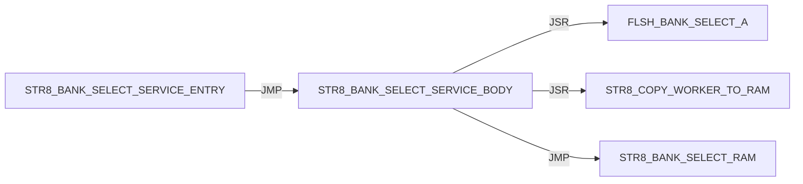

#### STR8 / BOOT

Panel 1 of 2: `STR8_BOOT_JUMP_BANK_A` through `STR8_BOOT_START`.

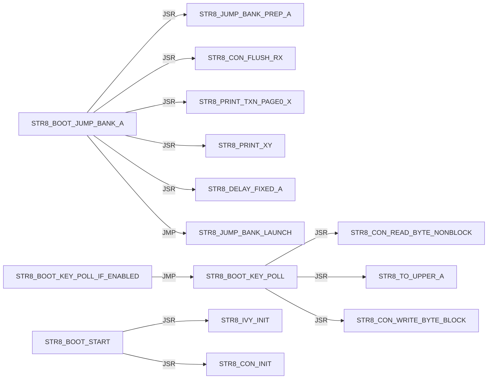

Panel 2 of 2: `STR8_BOOT_START` through `STR8_BOOT_START`.

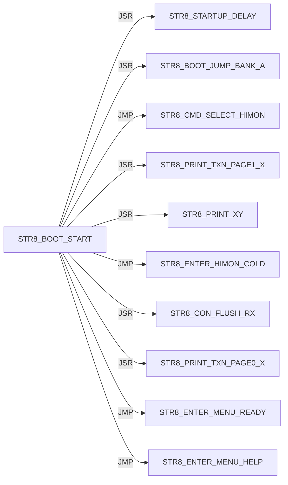

#### STR8 / CON

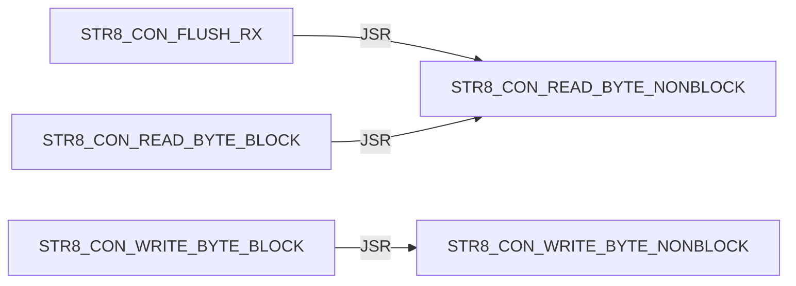

#### STR8 / CONFIRM

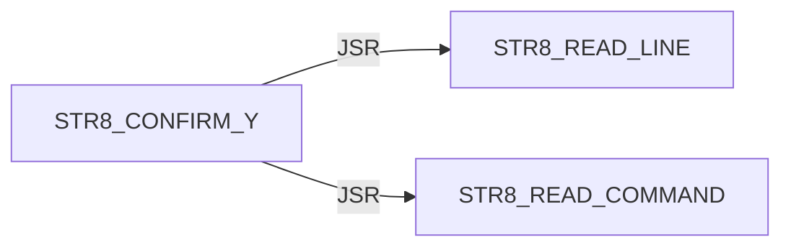

#### STR8 / DELAY


#### STR8 / DIR

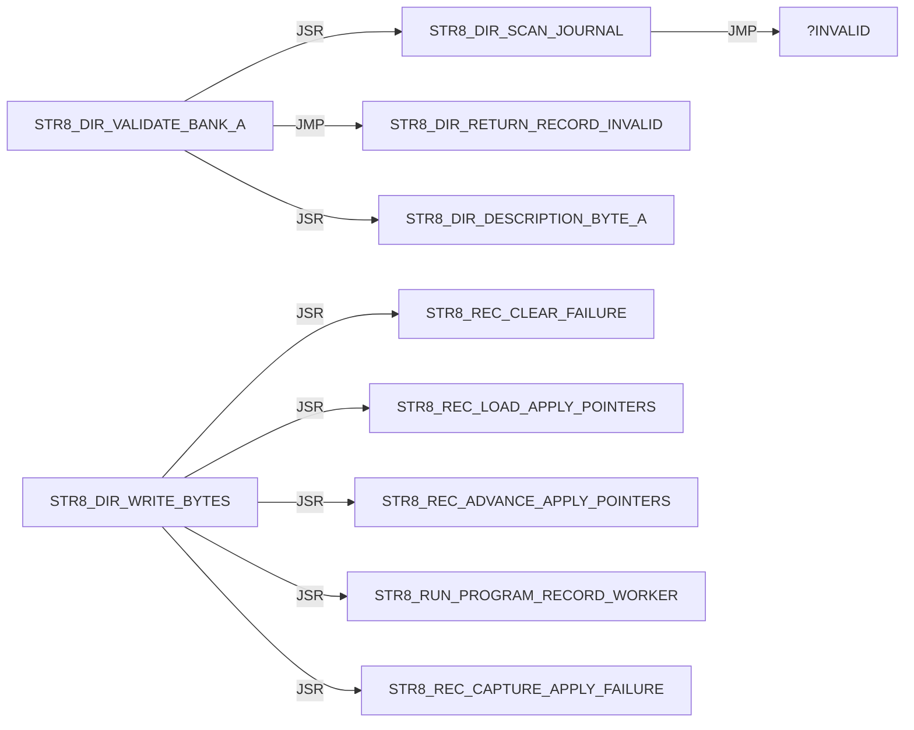

#### STR8 / DISPATCH

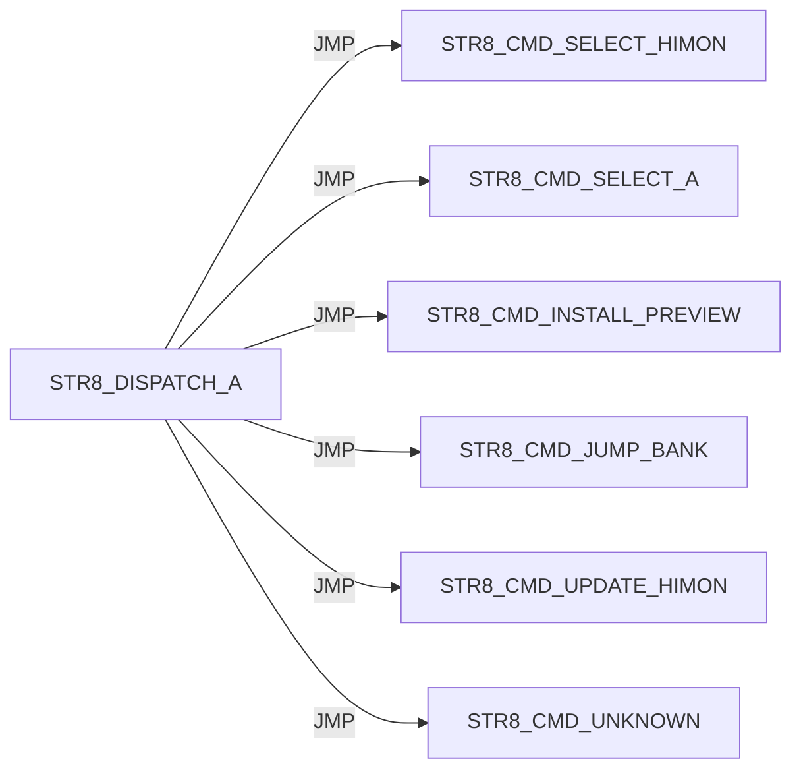

#### STR8 / ENTER

Panel 1 of 2: `STR8_ENTER_HIMON_COLD` through `STR8_ENTER_MENU_NO_TARGET_PRINT`.

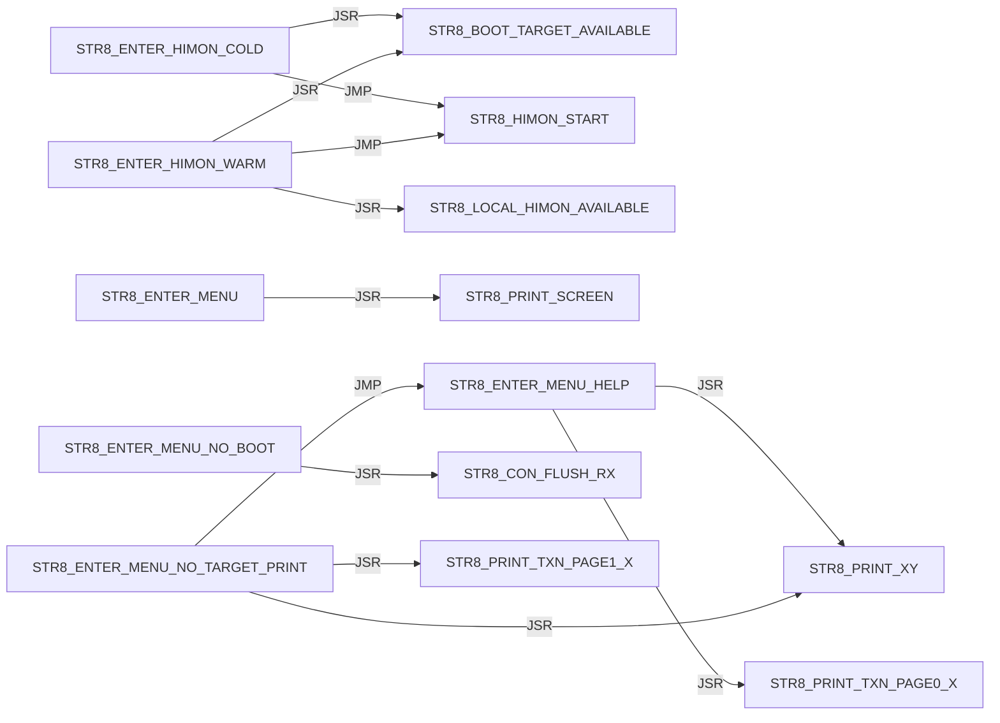

Panel 2 of 2: `STR8_ENTER_MENU_READY` through `STR8_ENTER_MENU_READY`.


#### STR8 / I

Panel 1 of 5: `STR8_I_BEGIN_TRANSACTION` through `STR8_I_PRINT_SUMMARY`.

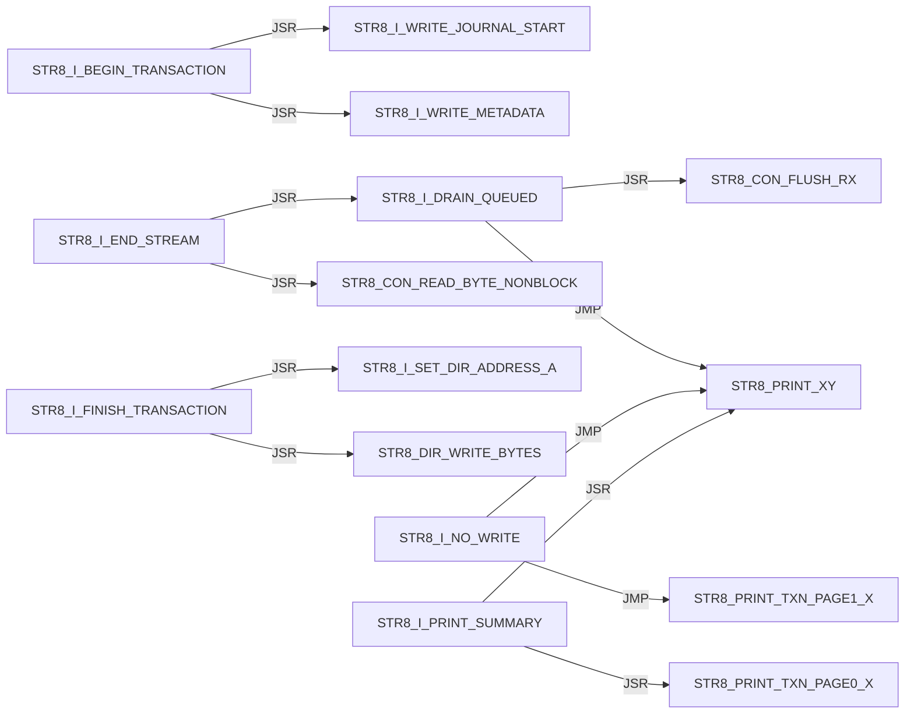

Panel 2 of 5: `STR8_I_PRINT_SUMMARY` through `STR8_I_PRINT_TRANSACTION_FAIL`.

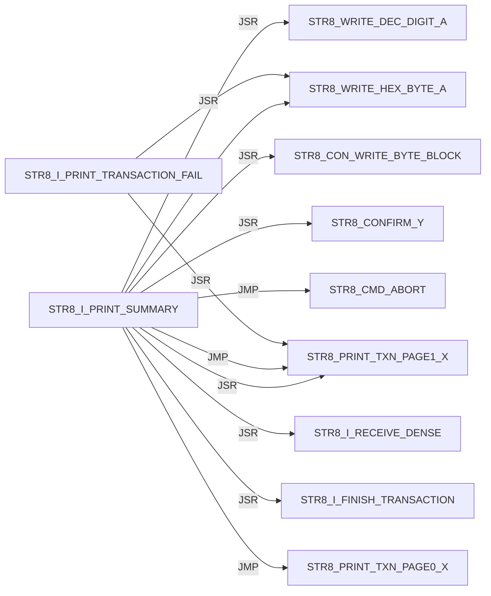

Panel 3 of 5: `STR8_I_PRINT_TRANSACTION_FAIL` through `STR8_I_RECEIVE_DENSE`.

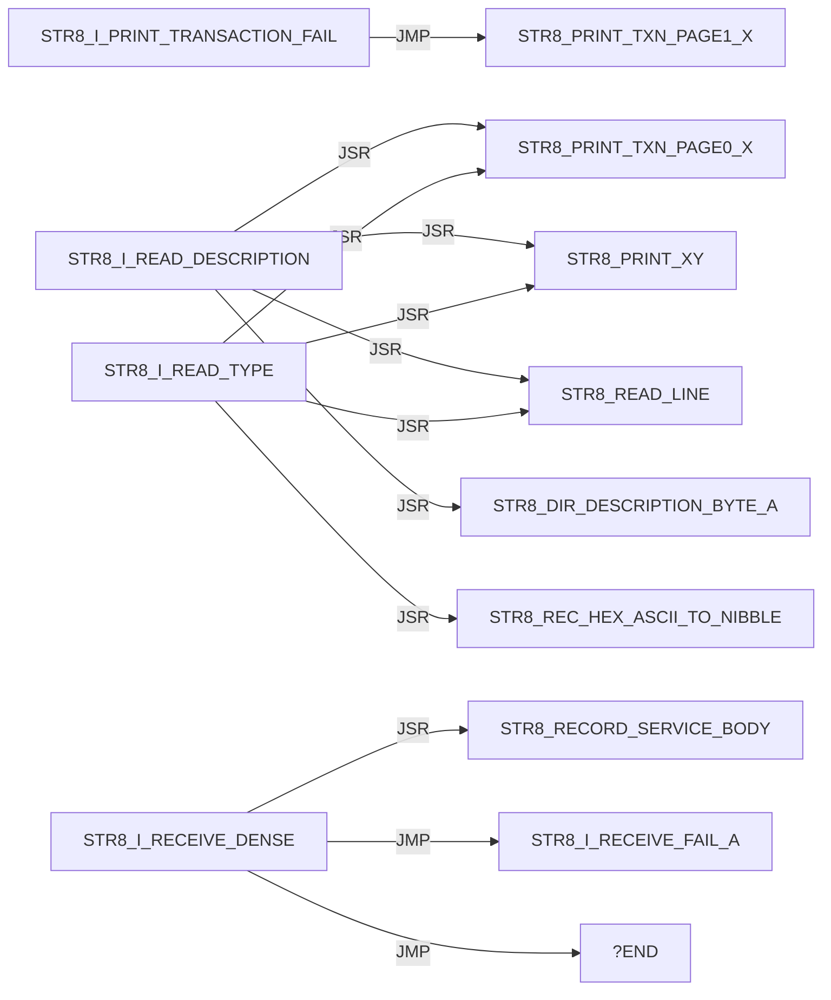

Panel 4 of 5: `STR8_I_RECEIVE_DENSE` through `STR8_I_STAGE_SECTOR_READY`.

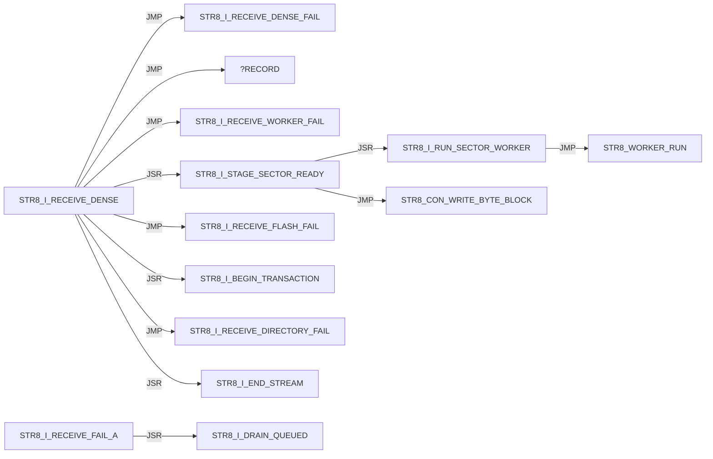

Panel 5 of 5: `STR8_I_WRITE_JOURNAL_MASK_A` through `STR8_I_WRITE_METADATA`.

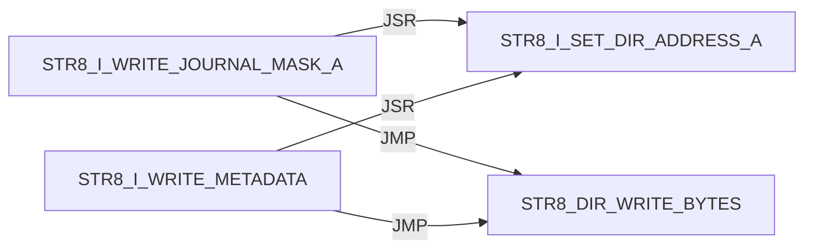

#### STR8 / IVY

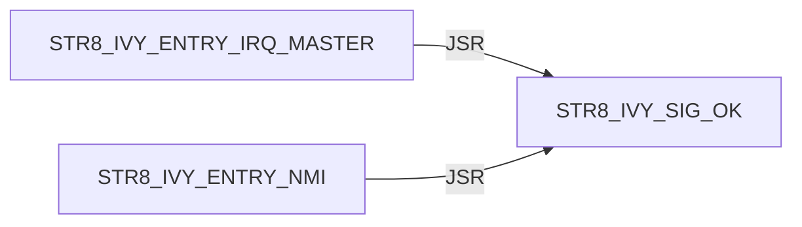

#### STR8 / JUMP

```mermaid
flowchart LR
    N0["STR8_JUMP_BANK_LAUNCH"] -->|JSR| N1["STR8_DIR_VALIDATE_BANK_A"]
    N0["STR8_JUMP_BANK_LAUNCH"] -->|JMP| N2["STR8_PRINT_JUMP_FAIL"]
    N0["STR8_JUMP_BANK_LAUNCH"] -->|JSR| N3["STR8_CON_FLUSH_RX"]
    N0["STR8_JUMP_BANK_LAUNCH"] -->|JSR| N4["STR8_JUMP_BANK_RAM"]
    N0["STR8_JUMP_BANK_LAUNCH"] -->|JSR| N5["STR8_COPY_WORKER_TO_RAM"]
    N0["STR8_JUMP_BANK_LAUNCH"] -->|JSR| N6["STR8_WORKER_RUN"]
    N7["STR8_JUMP_BANK_PREP_A"] -->|JSR| N8["STR8_PRINT_TXN_PAGE1_X"]
    N7["STR8_JUMP_BANK_PREP_A"] -->|JSR| N9["STR8_PRINT_XY"]
    N7["STR8_JUMP_BANK_PREP_A"] -->|JSR| N10["STR8_WRITE_DEC_DIGIT_A"]
    N4["STR8_JUMP_BANK_RAM"] -->|JSR| N11["FLSH_BANK_SELECT_A"]
    N4["STR8_JUMP_BANK_RAM"] -->|JSR| N12["FLSH_BANK_SELECT_3"]
```

#### STR8 / PRINT

Panel 1 of 2: `STR8_PRINT_COPY_FAIL` through `STR8_PRINT_SCREEN`.

```mermaid
flowchart LR
    N0["STR8_PRINT_COPY_FAIL"] -->|JSR| N1["STR8_PRINT_XY"]
    N0["STR8_PRINT_COPY_FAIL"] -->|JSR| N2["STR8_WRITE_HEX_BYTE_A"]
    N0["STR8_PRINT_COPY_FAIL"] -->|JMP| N1["STR8_PRINT_XY"]
    N3["STR8_PRINT_JUMP_FAIL"] -->|JSR| N4["STR8_PRINT_TXN_PAGE1_X"]
    N3["STR8_PRINT_JUMP_FAIL"] -->|JSR| N1["STR8_PRINT_XY"]
    N3["STR8_PRINT_JUMP_FAIL"] -->|JSR| N5["STR8_WRITE_DEC_DIGIT_A"]
    N3["STR8_PRINT_JUMP_FAIL"] -->|JSR| N2["STR8_WRITE_HEX_BYTE_A"]
    N3["STR8_PRINT_JUMP_FAIL"] -->|JMP| N4["STR8_PRINT_TXN_PAGE1_X"]
    N3["STR8_PRINT_JUMP_FAIL"] -->|JMP| N1["STR8_PRINT_XY"]
    N6["STR8_PRINT_PROMPT"] -->|JMP| N7["STR8_PRINT_TXN_PAGE0_X"]
    N6["STR8_PRINT_PROMPT"] -->|JMP| N1["STR8_PRINT_XY"]
    N8["STR8_PRINT_SCREEN"] -->|JSR| N1["STR8_PRINT_XY"]
```

Panel 2 of 2: `STR8_PRINT_SCREEN` through `STR8_PRINT_XY`.

```mermaid
flowchart LR
    N0["STR8_PRINT_SCREEN"] -->|JMP| N1["STR8_PRINT_XY"]
    N1["STR8_PRINT_XY"] -->|JSR| N2["STR8_CON_WRITE_BYTE_BLOCK"]
    N1["STR8_PRINT_XY"] -->|JMP| N2["STR8_CON_WRITE_BYTE_BLOCK"]
```

#### STR8 / PROGRAM

```mermaid
flowchart LR
    N0["STR8_PROGRAM_HIMON_SECTOR_AX"] -->|JSR| N1["STR8_COPY_WORKER_TO_RAM"]
    N0["STR8_PROGRAM_HIMON_SECTOR_AX"] -->|JSR| N2["STR8_WORKER_RUN"]
    N0["STR8_PROGRAM_HIMON_SECTOR_AX"] -->|JSR| N3["STR8_CON_WRITE_BYTE_BLOCK"]
    N4["STR8_PROGRAM_HIMON_UPDATE"] -->|JSR| N0["STR8_PROGRAM_HIMON_SECTOR_AX"]
```

#### STR8 / READ

```mermaid
flowchart LR
    N0["STR8_READ_COMMAND"] -->|JSR| N1["STR8_CON_READ_BYTE_BLOCK"]
    N0["STR8_READ_COMMAND"] -->|JSR| N2["STR8_TO_UPPER_A"]
    N0["STR8_READ_COMMAND"] -->|JSR| N3["STR8_CON_WRITE_BYTE_BLOCK"]
    N4["STR8_READ_HIMON_S19"] -->|JSR| N5["STR8_RECORD_SERVICE_BODY"]
    N4["STR8_READ_HIMON_S19"] -->|JSR| N6["STR8_STAGE_HIMON_RECORD"]
    N4["STR8_READ_HIMON_S19"] -->|JSR| N3["STR8_CON_WRITE_BYTE_BLOCK"]
    N7["STR8_READ_LINE"] -->|JSR| N8["STR8_READ_TEXT_BYTE_BLOCK"]
    N7["STR8_READ_LINE"] -->|JSR| N2["STR8_TO_UPPER_A"]
    N7["STR8_READ_LINE"] -->|JSR| N3["STR8_CON_WRITE_BYTE_BLOCK"]
    N7["STR8_READ_LINE"] -->|JSR| N9["STR8_PRINT_TXN_PAGE1_X"]
    N7["STR8_READ_LINE"] -->|JSR| N10["STR8_PRINT_XY"]
    N8["STR8_READ_TEXT_BYTE_BLOCK"] -->|JSR| N1["STR8_CON_READ_BYTE_BLOCK"]
```

#### STR8 / REC

Panel 1 of 3: `STR8_REC_APPLY_LF` through `STR8_REC_PARSE`.

```mermaid
flowchart LR
    N0["STR8_REC_APPLY_LF"] -->|JSR| N1["STR8_REC_CLEAR_FAILURE"]
    N0["STR8_REC_APPLY_LF"] -->|JMP| N2["STR8_REC_FAIL_A"]
    N0["STR8_REC_APPLY_LF"] -->|JMP| N3["STR8_REC_RETURN_OK"]
    N0["STR8_REC_APPLY_LF"] -->|JSR| N4["STR8_REC_LOAD_APPLY_POINTERS"]
    N0["STR8_REC_APPLY_LF"] -->|JSR| N5["STR8_REC_CAPTURE_APPLY_FAILURE"]
    N0["STR8_REC_APPLY_LF"] -->|JSR| N6["STR8_REC_ADVANCE_APPLY_POINTERS"]
    N0["STR8_REC_APPLY_LF"] -->|JSR| N7["STR8_RUN_PROGRAM_RECORD_WORKER"]
    N8["STR8_REC_FAIL_READ_X"] -->|JMP| N9["STR8_REC_RETURN_CURRENT_FAIL"]
    N8["STR8_REC_FAIL_READ_X"] -->|JMP| N2["STR8_REC_FAIL_A"]
    N10["STR8_REC_PARSE"] -->|JSR| N11["STR8_REC_CLEAR_RESULT"]
    N10["STR8_REC_PARSE"] -->|JMP| N2["STR8_REC_FAIL_A"]
    N10["STR8_REC_PARSE"] -->|JSR| N12["STR8_REC_READ_CHAR"]
```

Panel 2 of 3: `STR8_REC_PARSE` through `STR8_REC_READ_HEX_BYTE`.

```mermaid
flowchart LR
    N0["STR8_REC_PARSE"] -->|JMP| N1["STR8_REC_FAIL_READ_START"]
    N0["STR8_REC_PARSE"] -->|JMP| N2["STR8_REC_FAIL_READ_TYPE"]
    N3["STR8_REC_PARSE_BODY"] -->|JSR| N4["STR8_REC_READ_SUM_BYTE"]
    N3["STR8_REC_PARSE_BODY"] -->|JMP| N5["STR8_REC_FAIL_A"]
    N3["STR8_REC_PARSE_BODY"] -->|JMP| N6["STR8_REC_FAIL_READ_HEX"]
    N3["STR8_REC_PARSE_BODY"] -->|JSR| N7["STR8_REC_READ_CHAR"]
    N3["STR8_REC_PARSE_BODY"] -->|JMP| N8["STR8_REC_FAIL_READ_END"]
    N3["STR8_REC_PARSE_BODY"] -->|JMP| N9["STR8_REC_RETURN_OK"]
    N7["STR8_REC_READ_CHAR"] -->|JSR| N10["STR8_READ_TEXT_BYTE_BLOCK"]
    N7["STR8_REC_READ_CHAR"] -->|JSR| N11["STR8_CON_READ_BYTE_BLOCK"]
    N12["STR8_REC_READ_HEX_BYTE"] -->|JSR| N7["STR8_REC_READ_CHAR"]
    N12["STR8_REC_READ_HEX_BYTE"] -->|JSR| N13["STR8_REC_HEX_ASCII_TO_NIBBLE"]
```

Panel 3 of 3: `STR8_REC_READ_SUM_BYTE` through `STR8_REC_READ_SUM_BYTE`.

```mermaid
flowchart LR
    N0["STR8_REC_READ_SUM_BYTE"] -->|JSR| N1["STR8_REC_READ_HEX_BYTE"]
```

#### STR8 / RECORD

```mermaid
flowchart LR
    N0["STR8_RECORD_SERVICE_BODY"] -->|JMP| N1["STR8_REC_APPLY_LF"]
    N0["STR8_RECORD_SERVICE_BODY"] -->|JMP| N2["STR8_REC_FAIL_A"]
    N3["STR8_RECORD_SERVICE_ENTRY"] -->|JMP| N0["STR8_RECORD_SERVICE_BODY"]
```

#### STR8 / RUN

```mermaid
flowchart LR
    N0["STR8_RUN_PROGRAM_RECORD_WORKER"] -->|JSR| N1["STR8_COPY_WORKER_TO_RAM"]
    N0["STR8_RUN_PROGRAM_RECORD_WORKER"] -->|JSR| N2["STR8_WORKER_RUN"]
    N3["STR8_RUN_WORKER_SERVICE"] -->|JMP| N4["STR8_RUN_WORKER_SERVICE_BODY"]
    N4["STR8_RUN_WORKER_SERVICE_BODY"] -->|JSR| N1["STR8_COPY_WORKER_TO_RAM"]
    N4["STR8_RUN_WORKER_SERVICE_BODY"] -->|JSR| N2["STR8_WORKER_RUN"]
```

#### STR8 / SELECT

```mermaid
flowchart LR
    N0["STR8_SELECT_BANK_3"] -->|JSR| N1["FLSH_BANK_SELECT_3"]
```

#### STR8 / STARTUP

```mermaid
flowchart LR
    N0["STR8_STARTUP_DELAY"] -->|JSR| N1["STR8_CON_WRITE_BYTE_BLOCK"]
    N0["STR8_STARTUP_DELAY"] -->|JSR| N2["STR8_CON_FLUSH_RX"]
    N0["STR8_STARTUP_DELAY"] -->|JSR| N3["STR8_PRINT_TXN_PAGE1_X"]
    N0["STR8_STARTUP_DELAY"] -->|JSR| N4["STR8_PRINT_XY"]
    N0["STR8_STARTUP_DELAY"] -->|JSR| N5["STR8_PRINT_TXN_PAGE0_X"]
    N0["STR8_STARTUP_DELAY"] -->|JSR| N6["STR8_DELAY_FIXED_A"]
    N0["STR8_STARTUP_DELAY"] -->|JSR| N7["STR8_BOOT_KEY_POLL_IF_ENABLED"]
```

#### STR8 / WRITE

```mermaid
flowchart LR
    N0["STR8_WRITE_DEC_DIGIT_A"] -->|JMP| N1["STR8_CON_WRITE_BYTE_BLOCK"]
    N2["STR8_WRITE_HEX_BYTE_A"] -->|JSR| N3["STR8_WRITE_HEX_NIBBLE_A"]
    N3["STR8_WRITE_HEX_NIBBLE_A"] -->|JMP| N1["STR8_CON_WRITE_BYTE_BLOCK"]
```

#### STR8 CMD / ABORT

```mermaid
flowchart LR
    N0["STR8_CMD_ABORT"] -->|JSR| N1["STR8_SELECT_BANK_3"]
    N0["STR8_CMD_ABORT"] -->|JMP| N2["STR8_PRINT_TXN_PAGE0_X"]
    N0["STR8_CMD_ABORT"] -->|JMP| N3["STR8_PRINT_XY"]
```

#### STR8 CMD / COPY

```mermaid
flowchart LR
    N0["STR8_CMD_COPY_FAIL"] -->|JSR| N1["STR8_SELECT_BANK_3"]
    N0["STR8_CMD_COPY_FAIL"] -->|JMP| N2["STR8_PRINT_COPY_FAIL"]
```

#### STR8 CMD / INSTALL

```mermaid
flowchart LR
    N0["STR8_CMD_INSTALL_PREVIEW"] -->|JMP| N1["STR8_CMD_UNKNOWN"]
    N0["STR8_CMD_INSTALL_PREVIEW"] -->|JSR| N2["STR8_PRINT_TXN_PAGE0_X"]
    N0["STR8_CMD_INSTALL_PREVIEW"] -->|JSR| N3["STR8_PRINT_XY"]
    N0["STR8_CMD_INSTALL_PREVIEW"] -->|JSR| N4["STR8_READ_LINE"]
    N0["STR8_CMD_INSTALL_PREVIEW"] -->|JMP| N5["STR8_CMD_ABORT"]
    N0["STR8_CMD_INSTALL_PREVIEW"] -->|JSR| N6["STR8_DIR_VALIDATE_BANK_A"]
    N0["STR8_CMD_INSTALL_PREVIEW"] -->|JSR| N7["STR8_I_READ_TYPE"]
    N0["STR8_CMD_INSTALL_PREVIEW"] -->|JSR| N8["STR8_I_READ_DESCRIPTION"]
    N0["STR8_CMD_INSTALL_PREVIEW"] -->|JMP| N9["STR8_I_PRINT_SUMMARY"]
    N0["STR8_CMD_INSTALL_PREVIEW"] -->|JSR| N10["STR8_I_COPY_RECORD_METADATA"]
    N0["STR8_CMD_INSTALL_PREVIEW"] -->|JMP| N2["STR8_PRINT_TXN_PAGE0_X"]
    N0["STR8_CMD_INSTALL_PREVIEW"] -->|JMP| N3["STR8_PRINT_XY"]
```

#### STR8 CMD / JUMP

```mermaid
flowchart LR
    N0["STR8_CMD_JUMP_BANK"] -->|JSR| N1["STR8_READ_COMMAND"]
    N0["STR8_CMD_JUMP_BANK"] -->|JMP| N2["STR8_CMD_ABORT"]
    N0["STR8_CMD_JUMP_BANK"] -->|JSR| N3["STR8_JUMP_BANK_PREP_A"]
    N0["STR8_CMD_JUMP_BANK"] -->|JMP| N4["STR8_JUMP_BANK_LAUNCH"]
    N0["STR8_CMD_JUMP_BANK"] -->|JMP| N5["STR8_CMD_UNKNOWN"]
```

#### STR8 CMD / LOOP

```mermaid
flowchart LR
    N0["STR8_CMD_LOOP"] -->|JSR| N1["STR8_PRINT_PROMPT"]
    N0["STR8_CMD_LOOP"] -->|JSR| N2["STR8_READ_LINE"]
    N0["STR8_CMD_LOOP"] -->|JSR| N3["STR8_CMD_ABORT"]
    N0["STR8_CMD_LOOP"] -->|JSR| N4["STR8_READ_COMMAND"]
    N0["STR8_CMD_LOOP"] -->|JSR| N5["STR8_DISPATCH_A"]
```

#### STR8 CMD / OK

```mermaid
flowchart LR
    N0["STR8_CMD_OK"] -->|JSR| N1["STR8_SELECT_BANK_3"]
    N0["STR8_CMD_OK"] -->|JMP| N2["STR8_PRINT_XY"]
```

#### STR8 CMD / SELECT

```mermaid
flowchart LR
    N0["STR8_CMD_SELECT_A"] -->|JSR| N1["STR8_JUMP_BANK_PREP_A"]
    N0["STR8_CMD_SELECT_A"] -->|JMP| N2["STR8_JUMP_BANK_LAUNCH"]
    N3["STR8_CMD_SELECT_HIMON"] -->|JSR| N4["STR8_SELECT_BANK_3"]
    N3["STR8_CMD_SELECT_HIMON"] -->|JSR| N5["STR8_CON_FLUSH_RX"]
    N3["STR8_CMD_SELECT_HIMON"] -->|JSR| N6["STR8_PRINT_TXN_PAGE1_X"]
    N3["STR8_CMD_SELECT_HIMON"] -->|JSR| N7["STR8_PRINT_XY"]
    N3["STR8_CMD_SELECT_HIMON"] -->|JMP| N8["STR8_ENTER_HIMON_WARM"]
```

#### STR8 CMD / UNKNOWN

```mermaid
flowchart LR
    N0["STR8_CMD_UNKNOWN"] -->|JSR| N1["STR8_PRINT_TXN_PAGE1_X"]
    N0["STR8_CMD_UNKNOWN"] -->|JSR| N2["STR8_PRINT_XY"]
    N0["STR8_CMD_UNKNOWN"] -->|JMP| N3["STR8_PRINT_TXN_PAGE0_X"]
    N0["STR8_CMD_UNKNOWN"] -->|JMP| N2["STR8_PRINT_XY"]
```

#### STR8 CMD / UPDATE

```mermaid
flowchart LR
    N0["STR8_CMD_UPDATE_HIMON"] -->|JMP| N1["STR8_PRINT_XY"]
    N0["STR8_CMD_UPDATE_HIMON"] -->|JSR| N1["STR8_PRINT_XY"]
    N0["STR8_CMD_UPDATE_HIMON"] -->|JSR| N2["STR8_CONFIRM_Y"]
    N0["STR8_CMD_UPDATE_HIMON"] -->|JSR| N3["STR8_STAGE_HIMON_BLANK"]
    N0["STR8_CMD_UPDATE_HIMON"] -->|JSR| N4["STR8_UPD_INIT"]
    N0["STR8_CMD_UPDATE_HIMON"] -->|JSR| N5["STR8_READ_HIMON_S19"]
    N0["STR8_CMD_UPDATE_HIMON"] -->|JSR| N6["STR8_PROGRAM_HIMON_UPDATE"]
    N0["STR8_CMD_UPDATE_HIMON"] -->|JMP| N7["STR8_CMD_OK"]
    N8["STR8_CMD_UPDATE_NO_DATA"] -->|JMP| N1["STR8_PRINT_XY"]
    N9["STR8_CMD_UPDATE_S19_FAIL"] -->|JSR| N10["STR8_CON_FLUSH_RX"]
    N9["STR8_CMD_UPDATE_S19_FAIL"] -->|JMP| N1["STR8_PRINT_XY"]
```

## External Targets

These targets are not labels in this source file; most are `XREF` providers from sibling ROM modules.

```text
FLSH_BANK_SELECT_3
FLSH_BANK_SELECT_A
STR8_BANK_SELECT_RAM
STR8_HIMON_START
STR8_WORKER_RUN
UTL_DELAY_AXY_8MHZ
```

## Unique Direct Edges By Source Label

Each block is one source label. Indented lines are outgoing direct edges.
Blank lines are source-level breaks; they do not imply call depth.

```text
START
    JMP STR8_BOOT_START

STR8_BANK_SELECT_SERVICE_BODY
    JSR FLSH_BANK_SELECT_A
    JSR STR8_COPY_WORKER_TO_RAM
    JMP STR8_BANK_SELECT_RAM

STR8_BANK_SELECT_SERVICE_ENTRY
    JMP STR8_BANK_SELECT_SERVICE_BODY

STR8_BOOT_JUMP_BANK_A
    JSR STR8_JUMP_BANK_PREP_A
    JSR STR8_CON_FLUSH_RX
    JSR STR8_PRINT_TXN_PAGE0_X
    JSR STR8_PRINT_XY
    JSR STR8_DELAY_FIXED_A
    JMP STR8_JUMP_BANK_LAUNCH

STR8_BOOT_KEY_POLL
    JSR STR8_CON_READ_BYTE_NONBLOCK
    JSR STR8_TO_UPPER_A
    JSR STR8_CON_WRITE_BYTE_BLOCK

STR8_BOOT_KEY_POLL_IF_ENABLED
    JMP STR8_BOOT_KEY_POLL

STR8_BOOT_START
    JSR STR8_IVY_INIT
    JSR STR8_CON_INIT
    JSR STR8_STARTUP_DELAY
    JSR STR8_BOOT_JUMP_BANK_A
    JMP STR8_CMD_SELECT_HIMON
    JSR STR8_PRINT_TXN_PAGE1_X
    JSR STR8_PRINT_XY
    JMP STR8_ENTER_HIMON_COLD
    JSR STR8_CON_FLUSH_RX
    JSR STR8_PRINT_TXN_PAGE0_X
    JMP STR8_ENTER_MENU_READY
    JMP STR8_ENTER_MENU_HELP

STR8_CMD_ABORT
    JSR STR8_SELECT_BANK_3
    JMP STR8_PRINT_TXN_PAGE0_X
    JMP STR8_PRINT_XY

STR8_CMD_COPY_FAIL
    JSR STR8_SELECT_BANK_3
    JMP STR8_PRINT_COPY_FAIL

STR8_CMD_INSTALL_PREVIEW
    JMP STR8_CMD_UNKNOWN
    JSR STR8_PRINT_TXN_PAGE0_X
    JSR STR8_PRINT_XY
    JSR STR8_READ_LINE
    JMP STR8_CMD_ABORT
    JSR STR8_DIR_VALIDATE_BANK_A
    JSR STR8_I_READ_TYPE
    JSR STR8_I_READ_DESCRIPTION
    JMP STR8_I_PRINT_SUMMARY
    JSR STR8_I_COPY_RECORD_METADATA
    JMP STR8_PRINT_TXN_PAGE0_X
    JMP STR8_PRINT_XY

STR8_CMD_JUMP_BANK
    JSR STR8_READ_COMMAND
    JMP STR8_CMD_ABORT
    JSR STR8_JUMP_BANK_PREP_A
    JMP STR8_JUMP_BANK_LAUNCH
    JMP STR8_CMD_UNKNOWN

STR8_CMD_LOOP
    JSR STR8_PRINT_PROMPT
    JSR STR8_READ_LINE
    JSR STR8_CMD_ABORT
    JSR STR8_READ_COMMAND
    JSR STR8_DISPATCH_A

STR8_CMD_OK
    JSR STR8_SELECT_BANK_3
    JMP STR8_PRINT_XY

STR8_CMD_SELECT_A
    JSR STR8_JUMP_BANK_PREP_A
    JMP STR8_JUMP_BANK_LAUNCH

STR8_CMD_SELECT_HIMON
    JSR STR8_SELECT_BANK_3
    JSR STR8_CON_FLUSH_RX
    JSR STR8_PRINT_TXN_PAGE1_X
    JSR STR8_PRINT_XY
    JMP STR8_ENTER_HIMON_WARM

STR8_CMD_UNKNOWN
    JSR STR8_PRINT_TXN_PAGE1_X
    JSR STR8_PRINT_XY
    JMP STR8_PRINT_TXN_PAGE0_X
    JMP STR8_PRINT_XY

STR8_CMD_UPDATE_HIMON
    JMP STR8_PRINT_XY
    JSR STR8_PRINT_XY
    JSR STR8_CONFIRM_Y
    JSR STR8_STAGE_HIMON_BLANK
    JSR STR8_UPD_INIT
    JSR STR8_READ_HIMON_S19
    JSR STR8_PROGRAM_HIMON_UPDATE
    JMP STR8_CMD_OK

STR8_CMD_UPDATE_NO_DATA
    JMP STR8_PRINT_XY

STR8_CMD_UPDATE_S19_FAIL
    JSR STR8_CON_FLUSH_RX
    JMP STR8_PRINT_XY

STR8_CON_FLUSH_RX
    JSR STR8_CON_READ_BYTE_NONBLOCK

STR8_CON_READ_BYTE_BLOCK
    JSR STR8_CON_READ_BYTE_NONBLOCK

STR8_CON_WRITE_BYTE_BLOCK
    JSR STR8_CON_WRITE_BYTE_NONBLOCK

STR8_CONFIRM_Y
    JSR STR8_READ_LINE
    JSR STR8_READ_COMMAND

STR8_DELAY_FIXED_A
    JMP UTL_DELAY_AXY_8MHZ

STR8_DIR_SCAN_JOURNAL
    JMP ?INVALID

STR8_DIR_VALIDATE_BANK_A
    JMP STR8_DIR_RETURN_RECORD_INVALID
    JSR STR8_DIR_DESCRIPTION_BYTE_A
    JSR STR8_DIR_SCAN_JOURNAL

STR8_DIR_WRITE_BYTES
    JSR STR8_REC_CLEAR_FAILURE
    JSR STR8_REC_LOAD_APPLY_POINTERS
    JSR STR8_REC_ADVANCE_APPLY_POINTERS
    JSR STR8_RUN_PROGRAM_RECORD_WORKER
    JSR STR8_REC_CAPTURE_APPLY_FAILURE

STR8_DISPATCH_A
    JMP STR8_CMD_SELECT_HIMON
    JMP STR8_CMD_SELECT_A
    JMP STR8_CMD_INSTALL_PREVIEW
    JMP STR8_CMD_JUMP_BANK
    JMP STR8_CMD_UPDATE_HIMON
    JMP STR8_CMD_UNKNOWN

STR8_ENTER_HIMON_COLD
    JSR STR8_BOOT_TARGET_AVAILABLE
    JMP STR8_HIMON_START

STR8_ENTER_HIMON_WARM
    JSR STR8_LOCAL_HIMON_AVAILABLE
    JSR STR8_BOOT_TARGET_AVAILABLE
    JMP STR8_HIMON_START

STR8_ENTER_MENU
    JSR STR8_PRINT_SCREEN

STR8_ENTER_MENU_HELP
    JSR STR8_PRINT_TXN_PAGE0_X
    JSR STR8_PRINT_XY

STR8_ENTER_MENU_NO_BOOT
    JSR STR8_CON_FLUSH_RX

STR8_ENTER_MENU_NO_TARGET_PRINT
    JSR STR8_PRINT_TXN_PAGE1_X
    JSR STR8_PRINT_XY
    JMP STR8_ENTER_MENU_HELP

STR8_ENTER_MENU_READY
    JMP STR8_CMD_LOOP

STR8_I_BEGIN_TRANSACTION
    JSR STR8_I_WRITE_JOURNAL_START
    JSR STR8_I_WRITE_METADATA

STR8_I_DRAIN_QUEUED
    JSR STR8_CON_FLUSH_RX
    JMP STR8_PRINT_XY

STR8_I_END_STREAM
    JSR STR8_CON_READ_BYTE_NONBLOCK
    JSR STR8_I_DRAIN_QUEUED

STR8_I_FINISH_TRANSACTION
    JSR STR8_I_SET_DIR_ADDRESS_A
    JSR STR8_DIR_WRITE_BYTES

STR8_I_NO_WRITE
    JMP STR8_PRINT_TXN_PAGE1_X
    JMP STR8_PRINT_XY

STR8_I_PRINT_SUMMARY
    JSR STR8_PRINT_TXN_PAGE0_X
    JSR STR8_PRINT_XY
    JSR STR8_WRITE_DEC_DIGIT_A
    JSR STR8_WRITE_HEX_BYTE_A
    JSR STR8_CON_WRITE_BYTE_BLOCK
    JSR STR8_CONFIRM_Y
    JMP STR8_CMD_ABORT
    JSR STR8_PRINT_TXN_PAGE1_X
    JSR STR8_I_RECEIVE_DENSE
    JSR STR8_I_FINISH_TRANSACTION
    JMP STR8_PRINT_TXN_PAGE0_X
    JMP STR8_PRINT_TXN_PAGE1_X

STR8_I_PRINT_TRANSACTION_FAIL
    JSR STR8_PRINT_TXN_PAGE1_X
    JSR STR8_WRITE_HEX_BYTE_A
    JMP STR8_PRINT_TXN_PAGE1_X

STR8_I_READ_DESCRIPTION
    JSR STR8_PRINT_TXN_PAGE0_X
    JSR STR8_PRINT_XY
    JSR STR8_READ_LINE
    JSR STR8_DIR_DESCRIPTION_BYTE_A

STR8_I_READ_TYPE
    JSR STR8_PRINT_TXN_PAGE0_X
    JSR STR8_PRINT_XY
    JSR STR8_READ_LINE
    JSR STR8_REC_HEX_ASCII_TO_NIBBLE

STR8_I_RECEIVE_DENSE
    JSR STR8_RECORD_SERVICE_BODY
    JMP STR8_I_RECEIVE_FAIL_A
    JMP ?END
    JMP STR8_I_RECEIVE_DENSE_FAIL
    JMP ?RECORD
    JMP STR8_I_RECEIVE_WORKER_FAIL
    JSR STR8_I_STAGE_SECTOR_READY
    JMP STR8_I_RECEIVE_FLASH_FAIL
    JSR STR8_I_BEGIN_TRANSACTION
    JMP STR8_I_RECEIVE_DIRECTORY_FAIL
    JSR STR8_I_END_STREAM

STR8_I_RECEIVE_FAIL_A
    JSR STR8_I_DRAIN_QUEUED

STR8_I_RUN_SECTOR_WORKER
    JMP STR8_WORKER_RUN

STR8_I_STAGE_SECTOR_READY
    JSR STR8_I_RUN_SECTOR_WORKER
    JMP STR8_CON_WRITE_BYTE_BLOCK

STR8_I_WRITE_JOURNAL_MASK_A
    JSR STR8_I_SET_DIR_ADDRESS_A
    JMP STR8_DIR_WRITE_BYTES

STR8_I_WRITE_METADATA
    JSR STR8_I_SET_DIR_ADDRESS_A
    JMP STR8_DIR_WRITE_BYTES

STR8_IVY_ENTRY_IRQ_MASTER
    JSR STR8_IVY_SIG_OK

STR8_IVY_ENTRY_NMI
    JSR STR8_IVY_SIG_OK

STR8_JUMP_BANK_LAUNCH
    JSR STR8_DIR_VALIDATE_BANK_A
    JMP STR8_PRINT_JUMP_FAIL
    JSR STR8_CON_FLUSH_RX
    JSR STR8_JUMP_BANK_RAM
    JSR STR8_COPY_WORKER_TO_RAM
    JSR STR8_WORKER_RUN

STR8_JUMP_BANK_PREP_A
    JSR STR8_PRINT_TXN_PAGE1_X
    JSR STR8_PRINT_XY
    JSR STR8_WRITE_DEC_DIGIT_A

STR8_JUMP_BANK_RAM
    JSR FLSH_BANK_SELECT_A
    JSR FLSH_BANK_SELECT_3

STR8_PRINT_COPY_FAIL
    JSR STR8_PRINT_XY
    JSR STR8_WRITE_HEX_BYTE_A
    JMP STR8_PRINT_XY

STR8_PRINT_JUMP_FAIL
    JSR STR8_PRINT_TXN_PAGE1_X
    JSR STR8_PRINT_XY
    JSR STR8_WRITE_DEC_DIGIT_A
    JSR STR8_WRITE_HEX_BYTE_A
    JMP STR8_PRINT_TXN_PAGE1_X
    JMP STR8_PRINT_XY

STR8_PRINT_PROMPT
    JMP STR8_PRINT_TXN_PAGE0_X
    JMP STR8_PRINT_XY

STR8_PRINT_SCREEN
    JSR STR8_PRINT_XY
    JMP STR8_PRINT_XY

STR8_PRINT_XY
    JSR STR8_CON_WRITE_BYTE_BLOCK
    JMP STR8_CON_WRITE_BYTE_BLOCK

STR8_PROGRAM_HIMON_SECTOR_AX
    JSR STR8_COPY_WORKER_TO_RAM
    JSR STR8_WORKER_RUN
    JSR STR8_CON_WRITE_BYTE_BLOCK

STR8_PROGRAM_HIMON_UPDATE
    JSR STR8_PROGRAM_HIMON_SECTOR_AX

STR8_READ_COMMAND
    JSR STR8_CON_READ_BYTE_BLOCK
    JSR STR8_TO_UPPER_A
    JSR STR8_CON_WRITE_BYTE_BLOCK

STR8_READ_HIMON_S19
    JSR STR8_RECORD_SERVICE_BODY
    JSR STR8_STAGE_HIMON_RECORD
    JSR STR8_CON_WRITE_BYTE_BLOCK

STR8_READ_LINE
    JSR STR8_READ_TEXT_BYTE_BLOCK
    JSR STR8_TO_UPPER_A
    JSR STR8_CON_WRITE_BYTE_BLOCK
    JSR STR8_PRINT_TXN_PAGE1_X
    JSR STR8_PRINT_XY

STR8_READ_TEXT_BYTE_BLOCK
    JSR STR8_CON_READ_BYTE_BLOCK

STR8_REC_APPLY_LF
    JSR STR8_REC_CLEAR_FAILURE
    JMP STR8_REC_FAIL_A
    JMP STR8_REC_RETURN_OK
    JSR STR8_REC_LOAD_APPLY_POINTERS
    JSR STR8_REC_CAPTURE_APPLY_FAILURE
    JSR STR8_REC_ADVANCE_APPLY_POINTERS
    JSR STR8_RUN_PROGRAM_RECORD_WORKER

STR8_REC_FAIL_READ_X
    JMP STR8_REC_RETURN_CURRENT_FAIL
    JMP STR8_REC_FAIL_A

STR8_REC_PARSE
    JSR STR8_REC_CLEAR_RESULT
    JMP STR8_REC_FAIL_A
    JSR STR8_REC_READ_CHAR
    JMP STR8_REC_FAIL_READ_START
    JMP STR8_REC_FAIL_READ_TYPE

STR8_REC_PARSE_BODY
    JSR STR8_REC_READ_SUM_BYTE
    JMP STR8_REC_FAIL_A
    JMP STR8_REC_FAIL_READ_HEX
    JSR STR8_REC_READ_CHAR
    JMP STR8_REC_FAIL_READ_END
    JMP STR8_REC_RETURN_OK

STR8_REC_READ_CHAR
    JSR STR8_READ_TEXT_BYTE_BLOCK
    JSR STR8_CON_READ_BYTE_BLOCK

STR8_REC_READ_HEX_BYTE
    JSR STR8_REC_READ_CHAR
    JSR STR8_REC_HEX_ASCII_TO_NIBBLE

STR8_REC_READ_SUM_BYTE
    JSR STR8_REC_READ_HEX_BYTE

STR8_RECORD_SERVICE_BODY
    JMP STR8_REC_APPLY_LF
    JMP STR8_REC_FAIL_A

STR8_RECORD_SERVICE_ENTRY
    JMP STR8_RECORD_SERVICE_BODY

STR8_RUN_PROGRAM_RECORD_WORKER
    JSR STR8_COPY_WORKER_TO_RAM
    JSR STR8_WORKER_RUN

STR8_RUN_WORKER_SERVICE
    JMP STR8_RUN_WORKER_SERVICE_BODY

STR8_RUN_WORKER_SERVICE_BODY
    JSR STR8_COPY_WORKER_TO_RAM
    JSR STR8_WORKER_RUN

STR8_SELECT_BANK_3
    JSR FLSH_BANK_SELECT_3

STR8_STARTUP_DELAY
    JSR STR8_CON_WRITE_BYTE_BLOCK
    JSR STR8_CON_FLUSH_RX
    JSR STR8_PRINT_TXN_PAGE1_X
    JSR STR8_PRINT_XY
    JSR STR8_PRINT_TXN_PAGE0_X
    JSR STR8_DELAY_FIXED_A
    JSR STR8_BOOT_KEY_POLL_IF_ENABLED

STR8_WRITE_DEC_DIGIT_A
    JMP STR8_CON_WRITE_BYTE_BLOCK

STR8_WRITE_HEX_BYTE_A
    JSR STR8_WRITE_HEX_NIBBLE_A

STR8_WRITE_HEX_NIBBLE_A
    JMP STR8_CON_WRITE_BYTE_BLOCK

```

## Raw Direct Edge Sites By Source Label

Each line is a direct call/jump site with source line number.

```text
START
      199  JMP STR8_BOOT_START

STR8_BANK_SELECT_SERVICE_BODY
     1725  JSR FLSH_BANK_SELECT_A
     1736  JSR STR8_COPY_WORKER_TO_RAM
     1738  JMP STR8_BANK_SELECT_RAM

STR8_BANK_SELECT_SERVICE_ENTRY
      228  JMP STR8_BANK_SELECT_SERVICE_BODY

STR8_BOOT_JUMP_BANK_A
     1646  JSR STR8_JUMP_BANK_PREP_A
     1647  JSR STR8_CON_FLUSH_RX
     1650  JSR STR8_PRINT_TXN_PAGE0_X
     1653  JSR STR8_PRINT_XY
     1656  JSR STR8_DELAY_FIXED_A
     1657  JMP STR8_JUMP_BANK_LAUNCH

STR8_BOOT_KEY_POLL
      538  JSR STR8_CON_READ_BYTE_NONBLOCK
      540  JSR STR8_TO_UPPER_A
      558  JSR STR8_CON_WRITE_BYTE_BLOCK

STR8_BOOT_KEY_POLL_IF_ENABLED
      532  JMP STR8_BOOT_KEY_POLL

STR8_BOOT_START
      235  JSR STR8_IVY_INIT
      236  JSR STR8_CON_INIT
      239  JSR STR8_STARTUP_DELAY
      250  JSR STR8_BOOT_JUMP_BANK_A
      252  JMP STR8_CMD_SELECT_HIMON
      256  JSR STR8_PRINT_TXN_PAGE1_X
      259  JSR STR8_PRINT_XY
      261  JMP STR8_ENTER_HIMON_COLD
      262  JSR STR8_CON_FLUSH_RX
      265  JSR STR8_PRINT_TXN_PAGE0_X
      268  JSR STR8_PRINT_XY
      270  JMP STR8_ENTER_MENU_READY
      271  JMP STR8_ENTER_MENU_HELP

STR8_CMD_ABORT
     1608  JSR STR8_SELECT_BANK_3
     1612  JMP STR8_PRINT_TXN_PAGE0_X
     1615  JMP STR8_PRINT_XY

STR8_CMD_COPY_FAIL
     1622  JSR STR8_SELECT_BANK_3
     1624  JMP STR8_PRINT_COPY_FAIL

STR8_CMD_INSTALL_PREVIEW
      736  JMP STR8_CMD_UNKNOWN
      740  JSR STR8_PRINT_TXN_PAGE0_X
      743  JSR STR8_PRINT_XY
      746  JSR STR8_READ_LINE
      749  JMP STR8_CMD_ABORT
      758  JSR STR8_DIR_VALIDATE_BANK_A
      767  JSR STR8_I_READ_TYPE
      769  JSR STR8_I_READ_DESCRIPTION
      771  JMP STR8_I_PRINT_SUMMARY
      772  JSR STR8_I_COPY_RECORD_METADATA
      773  JMP STR8_I_PRINT_SUMMARY
      776  JMP STR8_PRINT_TXN_PAGE0_X
      779  JMP STR8_PRINT_XY
      781  JMP STR8_CMD_UNKNOWN

STR8_CMD_JUMP_BANK
     1503  JSR STR8_READ_COMMAND
     1506  JMP STR8_CMD_ABORT
     1516  JSR STR8_JUMP_BANK_PREP_A
     1517  JMP STR8_JUMP_BANK_LAUNCH
     1519  JMP STR8_CMD_UNKNOWN

STR8_CMD_LOOP
      575  JSR STR8_PRINT_PROMPT
      578  JSR STR8_READ_LINE
      582  JSR STR8_CMD_ABORT
      585  JSR STR8_READ_COMMAND
      588  JSR STR8_CMD_ABORT
      592  JSR STR8_DISPATCH_A

STR8_CMD_OK
     1599  JSR STR8_SELECT_BANK_3
     1603  JMP STR8_PRINT_XY

STR8_CMD_SELECT_A
     1528  JSR STR8_JUMP_BANK_PREP_A
     1529  JMP STR8_JUMP_BANK_LAUNCH

STR8_CMD_SELECT_HIMON
     1536  JSR STR8_SELECT_BANK_3
     1538  JSR STR8_CON_FLUSH_RX
     1541  JSR STR8_PRINT_TXN_PAGE1_X
     1544  JSR STR8_PRINT_XY
     1546  JMP STR8_ENTER_HIMON_WARM

STR8_CMD_UNKNOWN
     1630  JSR STR8_PRINT_TXN_PAGE1_X
     1633  JSR STR8_PRINT_XY
     1637  JMP STR8_PRINT_TXN_PAGE0_X
     1640  JMP STR8_PRINT_XY

STR8_CMD_UPDATE_HIMON
     1555  JMP STR8_PRINT_XY
     1559  JSR STR8_PRINT_XY
     1560  JSR STR8_CONFIRM_Y
     1562  JSR STR8_STAGE_HIMON_BLANK
     1563  JSR STR8_UPD_INIT
     1566  JSR STR8_PRINT_XY
     1567  JSR STR8_READ_HIMON_S19
     1573  JSR STR8_PRINT_XY
     1574  JSR STR8_CONFIRM_Y
     1576  JSR STR8_PROGRAM_HIMON_UPDATE
     1578  JMP STR8_CMD_OK

STR8_CMD_UPDATE_NO_DATA
     1590  JMP STR8_PRINT_XY

STR8_CMD_UPDATE_S19_FAIL
     1582  JSR STR8_CON_FLUSH_RX
     1585  JMP STR8_PRINT_XY

STR8_CON_FLUSH_RX
     2885  JSR STR8_CON_READ_BYTE_NONBLOCK

STR8_CON_READ_BYTE_BLOCK
     2895  JSR STR8_CON_READ_BYTE_NONBLOCK

STR8_CON_WRITE_BYTE_BLOCK
     2921  JSR STR8_CON_WRITE_BYTE_NONBLOCK

STR8_CONFIRM_Y
     2507  JSR STR8_READ_LINE
     2519  JSR STR8_READ_COMMAND

STR8_DELAY_FIXED_A
      527  JMP UTL_DELAY_AXY_8MHZ

STR8_DIR_SCAN_JOURNAL
     1888  JMP ?INVALID

STR8_DIR_VALIDATE_BANK_A
     1764  JMP STR8_DIR_RETURN_RECORD_INVALID
     1801  JSR STR8_DIR_DESCRIPTION_BYTE_A
     1836  JSR STR8_DIR_SCAN_JOURNAL

STR8_DIR_WRITE_BYTES
     1943  JSR STR8_REC_CLEAR_FAILURE
     1960  JSR STR8_REC_LOAD_APPLY_POINTERS
     1967  JSR STR8_REC_ADVANCE_APPLY_POINTERS
     1971  JSR STR8_RUN_PROGRAM_RECORD_WORKER
     1974  JSR STR8_REC_LOAD_APPLY_POINTERS
     1980  JSR STR8_REC_ADVANCE_APPLY_POINTERS
     1996  JSR STR8_REC_CAPTURE_APPLY_FAILURE
     2001  JSR STR8_REC_CAPTURE_APPLY_FAILURE

STR8_DISPATCH_A
      702  JMP STR8_CMD_SELECT_HIMON
      708  JMP STR8_CMD_SELECT_A
      714  JMP STR8_CMD_INSTALL_PREVIEW
      719  JMP STR8_CMD_JUMP_BANK
      725  JMP STR8_CMD_UPDATE_HIMON
      728  JMP STR8_CMD_UNKNOWN

STR8_ENTER_HIMON_COLD
      380  JSR STR8_BOOT_TARGET_AVAILABLE
      386  JMP STR8_HIMON_START

STR8_ENTER_HIMON_WARM
      390  JSR STR8_LOCAL_HIMON_AVAILABLE
      398  JSR STR8_BOOT_TARGET_AVAILABLE
      409  JMP STR8_HIMON_START

STR8_ENTER_MENU
      277  JSR STR8_PRINT_SCREEN

STR8_ENTER_MENU_HELP
      284  JSR STR8_PRINT_TXN_PAGE0_X
      287  JSR STR8_PRINT_XY

STR8_ENTER_MENU_NO_BOOT
      452  JSR STR8_CON_FLUSH_RX

STR8_ENTER_MENU_NO_TARGET_PRINT
      456  JSR STR8_PRINT_TXN_PAGE1_X
      460  JSR STR8_PRINT_XY
      462  JMP STR8_ENTER_MENU_HELP

STR8_ENTER_MENU_READY
      291  JMP STR8_CMD_LOOP

STR8_I_BEGIN_TRANSACTION
     1050  JSR STR8_I_WRITE_JOURNAL_START
     1055  JSR STR8_I_WRITE_METADATA

STR8_I_DRAIN_QUEUED
     1480  JSR STR8_CON_FLUSH_RX
     1490  JMP STR8_PRINT_XY

STR8_I_END_STREAM
     1463  JSR STR8_CON_READ_BYTE_NONBLOCK
     1468  JSR STR8_CON_READ_BYTE_NONBLOCK
     1472  JSR STR8_I_DRAIN_QUEUED

STR8_I_FINISH_TRANSACTION
     1076  JSR STR8_I_SET_DIR_ADDRESS_A
     1079  JSR STR8_DIR_WRITE_BYTES
     1084  JSR STR8_I_SET_DIR_ADDRESS_A
     1087  JSR STR8_DIR_WRITE_BYTES

STR8_I_NO_WRITE
     1029  JMP STR8_PRINT_TXN_PAGE1_X
     1032  JMP STR8_PRINT_XY

STR8_I_PRINT_SUMMARY
      860  JSR STR8_PRINT_TXN_PAGE0_X
      863  JSR STR8_PRINT_XY
      866  JSR STR8_WRITE_DEC_DIGIT_A
      883  JSR STR8_PRINT_TXN_PAGE0_X
      885  JSR STR8_PRINT_XY
      889  JSR STR8_PRINT_TXN_PAGE0_X
      892  JSR STR8_PRINT_XY
      895  JSR STR8_WRITE_HEX_BYTE_A
      898  JSR STR8_PRINT_TXN_PAGE0_X
      901  JSR STR8_PRINT_XY
      905  JSR STR8_CON_WRITE_BYTE_BLOCK
      917  JSR STR8_PRINT_TXN_PAGE0_X
      920  JSR STR8_PRINT_XY
      923  JSR STR8_WRITE_HEX_BYTE_A
      925  JSR STR8_WRITE_HEX_BYTE_A
      959  JSR STR8_PRINT_TXN_PAGE0_X
      961  JSR STR8_PRINT_XY
      965  JSR STR8_PRINT_TXN_PAGE0_X
      968  JSR STR8_PRINT_XY
      971  JSR STR8_WRITE_HEX_BYTE_A
      978  JSR STR8_PRINT_TXN_PAGE0_X
      982  JSR STR8_PRINT_XY
      984  JSR STR8_CONFIRM_Y
      986  JMP STR8_CMD_ABORT
      990  JSR STR8_PRINT_TXN_PAGE1_X
      993  JSR STR8_PRINT_XY
      995  JSR STR8_I_RECEIVE_DENSE
      998  JSR STR8_I_FINISH_TRANSACTION
     1001  JMP STR8_PRINT_TXN_PAGE0_X
     1005  JSR STR8_PRINT_XY
     1016  JSR STR8_PRINT_TXN_PAGE1_X
     1019  JSR STR8_PRINT_XY
     1023  JSR STR8_WRITE_HEX_BYTE_A
     1025  JMP STR8_PRINT_TXN_PAGE1_X

STR8_I_PRINT_TRANSACTION_FAIL
     1040  JSR STR8_PRINT_TXN_PAGE1_X
     1042  JSR STR8_WRITE_HEX_BYTE_A
     1044  JMP STR8_PRINT_TXN_PAGE1_X

STR8_I_READ_DESCRIPTION
      816  JSR STR8_PRINT_TXN_PAGE0_X
      819  JSR STR8_PRINT_XY
      822  JSR STR8_READ_LINE
      827  JSR STR8_DIR_DESCRIPTION_BYTE_A

STR8_I_READ_TYPE
      786  JSR STR8_PRINT_TXN_PAGE0_X
      789  JSR STR8_PRINT_XY
      792  JSR STR8_READ_LINE
      796  JSR STR8_REC_HEX_ASCII_TO_NIBBLE
      804  JSR STR8_REC_HEX_ASCII_TO_NIBBLE

STR8_I_RECEIVE_DENSE
     1203  JSR STR8_RECORD_SERVICE_BODY
     1206  JMP STR8_I_RECEIVE_FAIL_A
     1215  JMP ?END
     1241  JMP STR8_I_RECEIVE_DENSE_FAIL
     1302  JMP ?RECORD
     1303  JMP STR8_I_RECEIVE_WORKER_FAIL
     1314  JSR STR8_I_STAGE_SECTOR_READY
     1316  JMP STR8_I_RECEIVE_FLASH_FAIL
     1332  JSR STR8_I_BEGIN_TRANSACTION
     1334  JMP STR8_I_RECEIVE_DIRECTORY_FAIL
     1337  JMP ?RECORD
     1347  JMP ?RECORD
     1393  JSR STR8_I_END_STREAM
     1395  JSR STR8_I_STAGE_SECTOR_READY

STR8_I_RECEIVE_FAIL_A
     1426  JSR STR8_I_DRAIN_QUEUED

STR8_I_RUN_SECTOR_WORKER
     1453  JMP STR8_WORKER_RUN

STR8_I_STAGE_SECTOR_READY
     1444  JSR STR8_I_RUN_SECTOR_WORKER
     1448  JMP STR8_CON_WRITE_BYTE_BLOCK

STR8_I_WRITE_JOURNAL_MASK_A
     1130  JSR STR8_I_SET_DIR_ADDRESS_A
     1137  JMP STR8_DIR_WRITE_BYTES

STR8_I_WRITE_METADATA
     1107  JSR STR8_I_SET_DIR_ADDRESS_A
     1110  JMP STR8_DIR_WRITE_BYTES

STR8_IVY_ENTRY_IRQ_MASTER
      362  JSR STR8_IVY_SIG_OK

STR8_IVY_ENTRY_NMI
      342  JSR STR8_IVY_SIG_OK

STR8_JUMP_BANK_LAUNCH
     1690  JSR STR8_DIR_VALIDATE_BANK_A
     1693  JMP STR8_PRINT_JUMP_FAIL
     1696  JSR STR8_CON_FLUSH_RX
     1700  JSR STR8_JUMP_BANK_RAM
     1702  JSR STR8_COPY_WORKER_TO_RAM
     1703  JSR STR8_WORKER_RUN
     1705  JMP STR8_PRINT_JUMP_FAIL

STR8_JUMP_BANK_PREP_A
     1667  JSR STR8_PRINT_TXN_PAGE1_X
     1670  JSR STR8_PRINT_XY
     1673  JSR STR8_WRITE_DEC_DIGIT_A
     1676  JSR STR8_PRINT_TXN_PAGE1_X
     1679  JSR STR8_PRINT_XY

STR8_JUMP_BANK_RAM
     2798  JSR FLSH_BANK_SELECT_A
     2835  JSR FLSH_BANK_SELECT_3

STR8_PRINT_COPY_FAIL
     2720  JSR STR8_PRINT_XY
     2722  JSR STR8_WRITE_HEX_BYTE_A
     2724  JSR STR8_WRITE_HEX_BYTE_A
     2727  JMP STR8_PRINT_XY
     2731  JMP STR8_PRINT_XY

STR8_PRINT_JUMP_FAIL
     2738  JSR STR8_PRINT_TXN_PAGE1_X
     2741  JSR STR8_PRINT_XY
     2744  JSR STR8_WRITE_DEC_DIGIT_A
     2747  JSR STR8_PRINT_TXN_PAGE1_X
     2750  JSR STR8_PRINT_XY
     2753  JSR STR8_WRITE_HEX_BYTE_A
     2755  JSR STR8_WRITE_HEX_BYTE_A
     2758  JMP STR8_PRINT_TXN_PAGE1_X
     2761  JMP STR8_PRINT_XY

STR8_PRINT_PROMPT
     2847  JMP STR8_PRINT_TXN_PAGE0_X
     2850  JMP STR8_PRINT_XY

STR8_PRINT_SCREEN
      568  JSR STR8_PRINT_XY
      571  JMP STR8_PRINT_XY

STR8_PRINT_XY
     2868  JSR STR8_CON_WRITE_BYTE_BLOCK
     2874  JMP STR8_CON_WRITE_BYTE_BLOCK

STR8_PROGRAM_HIMON_SECTOR_AX
     2701  JSR STR8_COPY_WORKER_TO_RAM
     2702  JSR STR8_WORKER_RUN
     2705  JSR STR8_CON_WRITE_BYTE_BLOCK

STR8_PROGRAM_HIMON_UPDATE
     2678  JSR STR8_PROGRAM_HIMON_SECTOR_AX
     2682  JSR STR8_PROGRAM_HIMON_SECTOR_AX
     2686  JSR STR8_PROGRAM_HIMON_SECTOR_AX

STR8_READ_COMMAND
      661  JSR STR8_CON_READ_BYTE_BLOCK
      676  JSR STR8_TO_UPPER_A
      677  JSR STR8_CON_WRITE_BYTE_BLOCK

STR8_READ_HIMON_S19
     2603  JSR STR8_RECORD_SERVICE_BODY
     2614  JSR STR8_STAGE_HIMON_RECORD
     2617  JSR STR8_CON_WRITE_BYTE_BLOCK

STR8_READ_LINE
      604  JSR STR8_READ_TEXT_BYTE_BLOCK
      617  JSR STR8_TO_UPPER_A
      621  JSR STR8_CON_WRITE_BYTE_BLOCK
      630  JSR STR8_PRINT_TXN_PAGE1_X
      633  JSR STR8_PRINT_XY

STR8_READ_TEXT_BYTE_BLOCK
      644  JSR STR8_CON_READ_BYTE_BLOCK

STR8_REC_APPLY_LF
     2250  JSR STR8_REC_CLEAR_FAILURE
     2259  JMP STR8_REC_FAIL_A
     2264  JMP STR8_REC_FAIL_A
     2274  JMP STR8_REC_FAIL_A
     2280  JMP STR8_REC_FAIL_A
     2284  JMP STR8_REC_RETURN_OK
     2303  JMP STR8_REC_FAIL_A
     2310  JMP STR8_REC_FAIL_A
     2313  JSR STR8_REC_LOAD_APPLY_POINTERS
     2322  JSR STR8_REC_CAPTURE_APPLY_FAILURE
     2324  JMP STR8_REC_FAIL_A
     2326  JSR STR8_REC_ADVANCE_APPLY_POINTERS
     2330  JSR STR8_RUN_PROGRAM_RECORD_WORKER
     2333  JMP STR8_REC_FAIL_A
     2336  JSR STR8_REC_LOAD_APPLY_POINTERS
     2343  JSR STR8_REC_CAPTURE_APPLY_FAILURE
     2345  JMP STR8_REC_FAIL_A
     2347  JSR STR8_REC_ADVANCE_APPLY_POINTERS
     2350  JMP STR8_REC_RETURN_OK

STR8_REC_FAIL_READ_X
     2244  JMP STR8_REC_RETURN_CURRENT_FAIL
     2247  JMP STR8_REC_FAIL_A

STR8_REC_PARSE
     2052  JSR STR8_REC_CLEAR_RESULT
     2057  JMP STR8_REC_FAIL_A
     2063  JMP STR8_REC_FAIL_A
     2087  JMP STR8_REC_FAIL_A
     2090  JSR STR8_REC_READ_CHAR
     2092  JMP STR8_REC_FAIL_READ_START
     2100  JSR STR8_REC_READ_CHAR
     2102  JMP STR8_REC_FAIL_READ_START
     2108  JMP STR8_REC_FAIL_A
     2110  JSR STR8_REC_READ_CHAR
     2112  JMP STR8_REC_FAIL_READ_TYPE
     2122  JMP STR8_REC_FAIL_A

STR8_REC_PARSE_BODY
     2126  JSR STR8_REC_READ_SUM_BYTE
     2141  JMP STR8_REC_FAIL_A
     2143  JSR STR8_REC_READ_SUM_BYTE
     2147  JSR STR8_REC_READ_SUM_BYTE
     2158  JMP STR8_REC_FAIL_READ_HEX
     2162  JSR STR8_REC_READ_SUM_BYTE
     2170  JSR STR8_REC_READ_SUM_BYTE
     2177  JMP STR8_REC_FAIL_A
     2185  JMP STR8_REC_FAIL_A
     2187  JSR STR8_REC_READ_CHAR
     2189  JMP STR8_REC_FAIL_READ_END
     2204  JMP STR8_REC_FAIL_A
     2217  JMP STR8_REC_RETURN_OK
     2227  JMP STR8_REC_RETURN_OK

STR8_REC_READ_CHAR
     2457  JSR STR8_READ_TEXT_BYTE_BLOCK
     2459  JSR STR8_CON_READ_BYTE_BLOCK

STR8_REC_READ_HEX_BYTE
     2414  JSR STR8_REC_READ_CHAR
     2416  JSR STR8_REC_HEX_ASCII_TO_NIBBLE
     2423  JSR STR8_REC_READ_CHAR
     2425  JSR STR8_REC_HEX_ASCII_TO_NIBBLE

STR8_REC_READ_SUM_BYTE
     2402  JSR STR8_REC_READ_HEX_BYTE

STR8_RECORD_SERVICE_BODY
     2046  JMP STR8_REC_APPLY_LF
     2049  JMP STR8_REC_FAIL_A

STR8_RECORD_SERVICE_ENTRY
      214  JMP STR8_RECORD_SERVICE_BODY

STR8_RUN_PROGRAM_RECORD_WORKER
     2021  JSR STR8_COPY_WORKER_TO_RAM
     2023  JSR STR8_WORKER_RUN

STR8_RUN_WORKER_SERVICE
      204  JMP STR8_RUN_WORKER_SERVICE_BODY

STR8_RUN_WORKER_SERVICE_BODY
     1712  JSR STR8_COPY_WORKER_TO_RAM
     1713  JSR STR8_WORKER_RUN

STR8_SELECT_BANK_3
     2500  JSR FLSH_BANK_SELECT_3

STR8_STARTUP_DELAY
      475  JSR STR8_CON_WRITE_BYTE_BLOCK
      484  JSR STR8_CON_FLUSH_RX
      488  JSR STR8_PRINT_TXN_PAGE1_X
      491  JSR STR8_PRINT_XY
      495  JSR STR8_PRINT_TXN_PAGE0_X
      498  JSR STR8_PRINT_XY
      502  JSR STR8_PRINT_TXN_PAGE0_X
      505  JSR STR8_PRINT_XY
      508  JSR STR8_DELAY_FIXED_A
      510  JSR STR8_CON_WRITE_BYTE_BLOCK
      511  JSR STR8_BOOT_KEY_POLL_IF_ENABLED

STR8_WRITE_DEC_DIGIT_A
     2768  JMP STR8_CON_WRITE_BYTE_BLOCK

STR8_WRITE_HEX_BYTE_A
     2776  JSR STR8_WRITE_HEX_NIBBLE_A

STR8_WRITE_HEX_NIBBLE_A
     2784  JMP STR8_CON_WRITE_BYTE_BLOCK
     2787  JMP STR8_CON_WRITE_BYTE_BLOCK

```
