# STR8 Edge Dump

Generated-style edge dump for `STR8/str8.asm`.

For the readable subsystem/capability view, see
[STR8.md](STR8.md).

Scope: direct `JSR target` and `JMP target` edges only. Relative branches, fallthrough, data labels, indirect calls, and computed jumps are not included. Source is the nearest preceding global label.

## Summary

```text
source file:     STR8/str8.asm
global labels:   175
raw call sites:  351
unique edges:    250
external targets:6
```

## Mermaid Direct-Edge Atlas

Every unique direct edge is present in this atlas. Source routines are grouped by command/subsystem stem, then split into independent Mermaid panels of at most 12 edges. The text sections below remain the complete audit-oriented evidence.

### Family Overview (part 1 of 3)


### Family Overview (part 2 of 3)

```mermaid
flowchart TD
    EDGE_ATLAS_ROOT_1["STR8 Edge Dump<br/>250 unique edges"] --> EDGE_FAMILY_1_0["STR8 / JUMP<br/>10 edges / 1 panel"]
    EDGE_ATLAS_ROOT_1["STR8 Edge Dump<br/>250 unique edges"] --> EDGE_FAMILY_1_1["STR8 / PRINT<br/>17 edges / 2 panels"]
    EDGE_ATLAS_ROOT_1["STR8 Edge Dump<br/>250 unique edges"] --> EDGE_FAMILY_1_2["STR8 / PROGRAM<br/>4 edges / 1 panel"]
    EDGE_ATLAS_ROOT_1["STR8 Edge Dump<br/>250 unique edges"] --> EDGE_FAMILY_1_3["STR8 / READ<br/>10 edges / 1 panel"]
    EDGE_ATLAS_ROOT_1["STR8 Edge Dump<br/>250 unique edges"] --> EDGE_FAMILY_1_4["STR8 / REC<br/>25 edges / 3 panels"]
    EDGE_ATLAS_ROOT_1["STR8 Edge Dump<br/>250 unique edges"] --> EDGE_FAMILY_1_5["STR8 / RECORD<br/>3 edges / 1 panel"]
    EDGE_ATLAS_ROOT_1["STR8 Edge Dump<br/>250 unique edges"] --> EDGE_FAMILY_1_6["STR8 / RUN<br/>5 edges / 1 panel"]
    EDGE_ATLAS_ROOT_1["STR8 Edge Dump<br/>250 unique edges"] --> EDGE_FAMILY_1_7["STR8 / SELECT<br/>1 edge / 1 panel"]
    EDGE_ATLAS_ROOT_1["STR8 Edge Dump<br/>250 unique edges"] --> EDGE_FAMILY_1_8["STR8 / STARTUP<br/>8 edges / 1 panel"]
    EDGE_ATLAS_ROOT_1["STR8 Edge Dump<br/>250 unique edges"] --> EDGE_FAMILY_1_9["STR8 / WRITE<br/>3 edges / 1 panel"]
    EDGE_ATLAS_ROOT_1["STR8 Edge Dump<br/>250 unique edges"] --> EDGE_FAMILY_1_10["STR8 CMD / ABORT<br/>3 edges / 1 panel"]
    EDGE_ATLAS_ROOT_1["STR8 Edge Dump<br/>250 unique edges"] --> EDGE_FAMILY_1_11["STR8 CMD / COPY<br/>2 edges / 1 panel"]
```

### Family Overview (part 3 of 3)


### Family Detail

#### ENTRY / unprefixed


#### STR8 / BANK

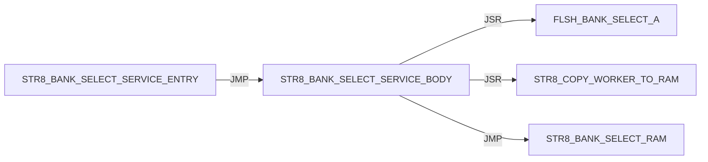

#### STR8 / BOOT

Panel 1 of 2: `STR8_BOOT_JUMP_BANK_A` through `STR8_BOOT_START`.


Panel 2 of 2: `STR8_BOOT_START` through `STR8_BOOT_START`.

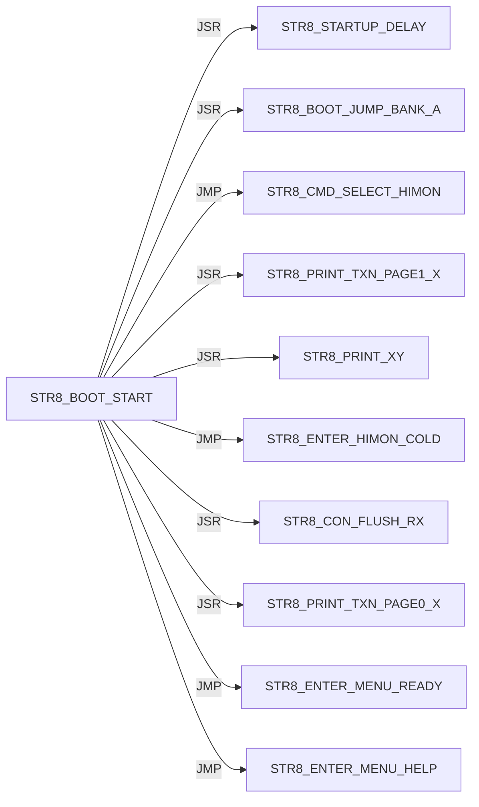

#### STR8 / CON

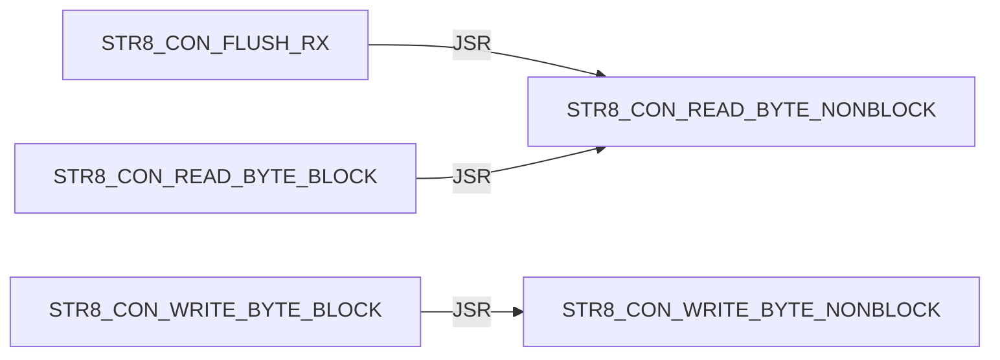

#### STR8 / CONFIRM

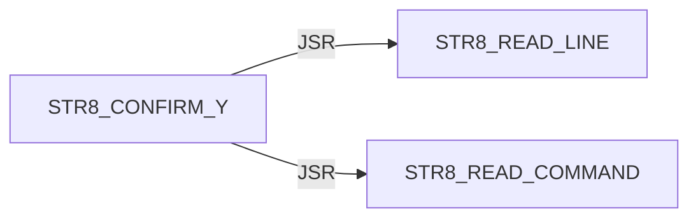

#### STR8 / DELAY


#### STR8 / DIR

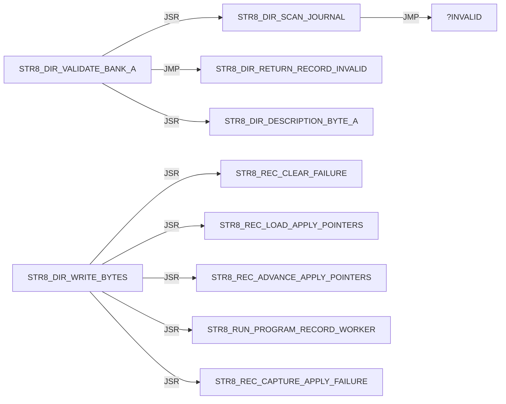

#### STR8 / DISPATCH

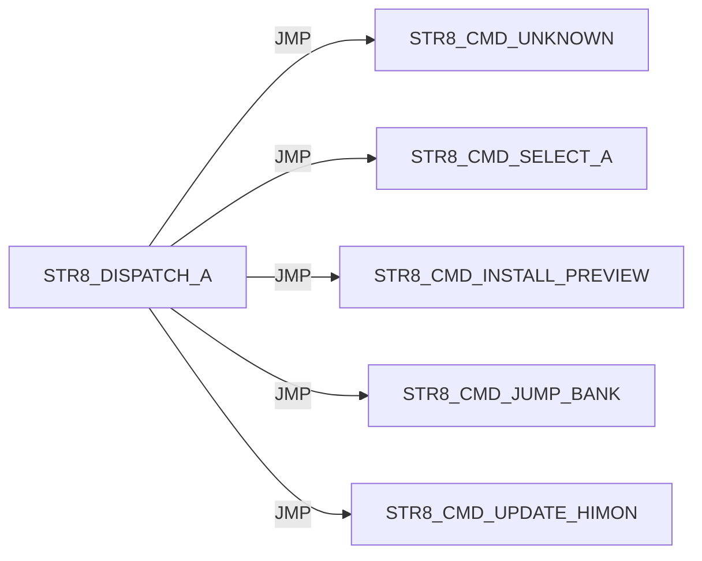

#### STR8 / ENTER

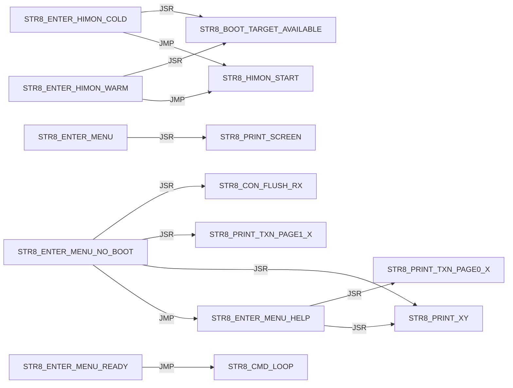

#### STR8 / I

Panel 1 of 5: `STR8_I_BEGIN_TRANSACTION` through `STR8_I_PRINT_SUMMARY`.

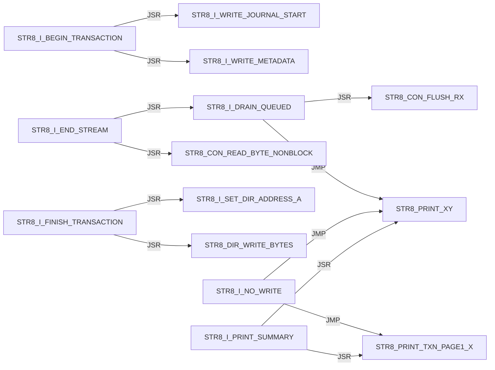

Panel 2 of 5: `STR8_I_PRINT_SUMMARY` through `STR8_I_READ_DESCRIPTION`.

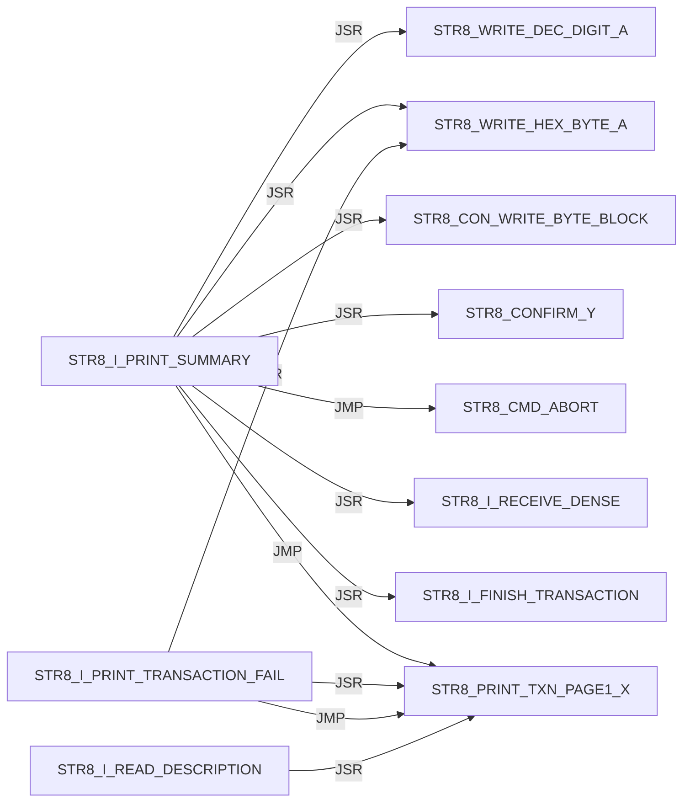

Panel 3 of 5: `STR8_I_READ_DESCRIPTION` through `STR8_I_RECEIVE_DENSE`.

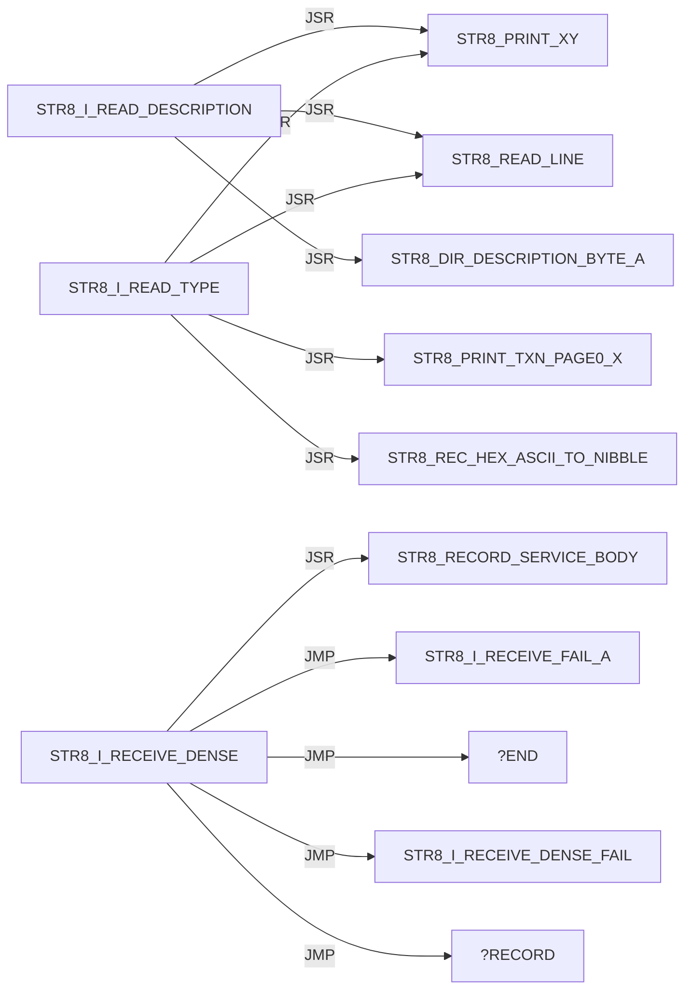

Panel 4 of 5: `STR8_I_RECEIVE_DENSE` through `STR8_I_WRITE_JOURNAL_MASK_A`.

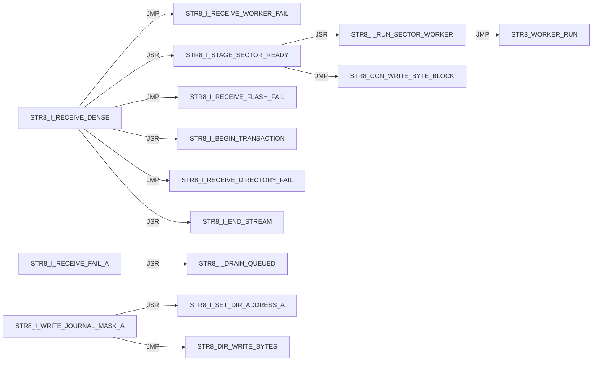

Panel 5 of 5: `STR8_I_WRITE_METADATA` through `STR8_I_WRITE_METADATA`.

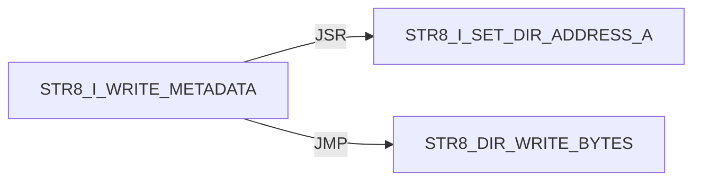

#### STR8 / INIT


#### STR8 / IVY

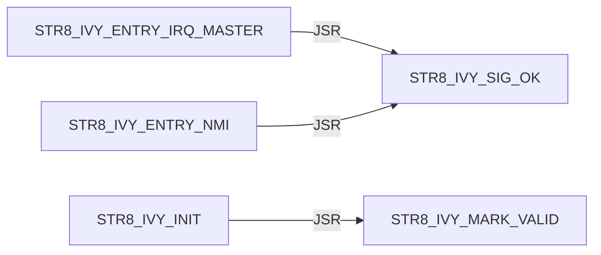

#### STR8 / JUMP

```mermaid
flowchart LR
    N0["STR8_JUMP_BANK_LAUNCH"] -->|JSR| N1["STR8_CON_FLUSH_RX"]
    N0["STR8_JUMP_BANK_LAUNCH"] -->|JSR| N2["STR8_JUMP_BANK_RAM"]
    N0["STR8_JUMP_BANK_LAUNCH"] -->|JSR| N3["STR8_COPY_WORKER_TO_RAM"]
    N0["STR8_JUMP_BANK_LAUNCH"] -->|JSR| N4["STR8_WORKER_RUN"]
    N0["STR8_JUMP_BANK_LAUNCH"] -->|JMP| N5["STR8_PRINT_JUMP_FAIL"]
    N6["STR8_JUMP_BANK_PREP_A"] -->|JSR| N7["STR8_PRINT_TXN_PAGE1_X"]
    N6["STR8_JUMP_BANK_PREP_A"] -->|JSR| N8["STR8_PRINT_XY"]
    N6["STR8_JUMP_BANK_PREP_A"] -->|JSR| N9["STR8_WRITE_DEC_DIGIT_A"]
    N2["STR8_JUMP_BANK_RAM"] -->|JSR| N10["FLSH_BANK_SELECT_A"]
    N2["STR8_JUMP_BANK_RAM"] -->|JSR| N11["FLSH_BANK_SELECT_3"]
```

#### STR8 / PRINT

Panel 1 of 2: `STR8_PRINT_BANNER` through `STR8_PRINT_PROMPT`.

```mermaid
flowchart LR
    N0["STR8_PRINT_BANNER"] -->|JMP| N1["STR8_PRINT_TXN_PAGE0_X"]
    N0["STR8_PRINT_BANNER"] -->|JMP| N2["STR8_PRINT_XY"]
    N3["STR8_PRINT_COPY_FAIL"] -->|JSR| N2["STR8_PRINT_XY"]
    N3["STR8_PRINT_COPY_FAIL"] -->|JSR| N4["STR8_WRITE_HEX_BYTE_A"]
    N3["STR8_PRINT_COPY_FAIL"] -->|JMP| N2["STR8_PRINT_XY"]
    N5["STR8_PRINT_JUMP_FAIL"] -->|JSR| N6["STR8_PRINT_TXN_PAGE1_X"]
    N5["STR8_PRINT_JUMP_FAIL"] -->|JSR| N2["STR8_PRINT_XY"]
    N5["STR8_PRINT_JUMP_FAIL"] -->|JSR| N7["STR8_WRITE_DEC_DIGIT_A"]
    N5["STR8_PRINT_JUMP_FAIL"] -->|JSR| N4["STR8_WRITE_HEX_BYTE_A"]
    N5["STR8_PRINT_JUMP_FAIL"] -->|JMP| N6["STR8_PRINT_TXN_PAGE1_X"]
    N5["STR8_PRINT_JUMP_FAIL"] -->|JMP| N2["STR8_PRINT_XY"]
    N8["STR8_PRINT_PROMPT"] -->|JMP| N1["STR8_PRINT_TXN_PAGE0_X"]
```

Panel 2 of 2: `STR8_PRINT_PROMPT` through `STR8_PRINT_XY`.

```mermaid
flowchart LR
    N0["STR8_PRINT_PROMPT"] -->|JMP| N1["STR8_PRINT_XY"]
    N2["STR8_PRINT_SCREEN"] -->|JSR| N1["STR8_PRINT_XY"]
    N2["STR8_PRINT_SCREEN"] -->|JMP| N1["STR8_PRINT_XY"]
    N1["STR8_PRINT_XY"] -->|JSR| N3["STR8_CON_WRITE_BYTE_BLOCK"]
    N1["STR8_PRINT_XY"] -->|JMP| N3["STR8_CON_WRITE_BYTE_BLOCK"]
```

#### STR8 / PROGRAM

```mermaid
flowchart LR
    N0["STR8_PROGRAM_HIMON_SECTOR_AX"] -->|JSR| N1["STR8_COPY_WORKER_TO_RAM"]
    N0["STR8_PROGRAM_HIMON_SECTOR_AX"] -->|JSR| N2["STR8_WORKER_RUN"]
    N0["STR8_PROGRAM_HIMON_SECTOR_AX"] -->|JSR| N3["STR8_CON_WRITE_BYTE_BLOCK"]
    N4["STR8_PROGRAM_HIMON_UPDATE"] -->|JSR| N0["STR8_PROGRAM_HIMON_SECTOR_AX"]
```

#### STR8 / READ

```mermaid
flowchart LR
    N0["STR8_READ_COMMAND"] -->|JSR| N1["STR8_CON_READ_BYTE_BLOCK"]
    N0["STR8_READ_COMMAND"] -->|JSR| N2["STR8_TO_UPPER_A"]
    N0["STR8_READ_COMMAND"] -->|JSR| N3["STR8_CON_WRITE_BYTE_BLOCK"]
    N4["STR8_READ_HIMON_S19"] -->|JSR| N5["STR8_RECORD_SERVICE_BODY"]
    N4["STR8_READ_HIMON_S19"] -->|JSR| N6["STR8_STAGE_HIMON_RECORD"]
    N4["STR8_READ_HIMON_S19"] -->|JSR| N3["STR8_CON_WRITE_BYTE_BLOCK"]
    N7["STR8_READ_LINE"] -->|JSR| N8["STR8_READ_TEXT_BYTE_BLOCK"]
    N7["STR8_READ_LINE"] -->|JSR| N2["STR8_TO_UPPER_A"]
    N7["STR8_READ_LINE"] -->|JSR| N3["STR8_CON_WRITE_BYTE_BLOCK"]
    N8["STR8_READ_TEXT_BYTE_BLOCK"] -->|JSR| N1["STR8_CON_READ_BYTE_BLOCK"]
```

#### STR8 / REC

Panel 1 of 3: `STR8_REC_APPLY_LF` through `STR8_REC_PARSE`.

```mermaid
flowchart LR
    N0["STR8_REC_APPLY_LF"] -->|JSR| N1["STR8_REC_CLEAR_FAILURE"]
    N0["STR8_REC_APPLY_LF"] -->|JMP| N2["STR8_REC_FAIL_A"]
    N0["STR8_REC_APPLY_LF"] -->|JMP| N3["STR8_REC_RETURN_OK"]
    N0["STR8_REC_APPLY_LF"] -->|JSR| N4["STR8_REC_LOAD_APPLY_POINTERS"]
    N0["STR8_REC_APPLY_LF"] -->|JSR| N5["STR8_REC_CAPTURE_APPLY_FAILURE"]
    N0["STR8_REC_APPLY_LF"] -->|JSR| N6["STR8_REC_ADVANCE_APPLY_POINTERS"]
    N0["STR8_REC_APPLY_LF"] -->|JSR| N7["STR8_RUN_PROGRAM_RECORD_WORKER"]
    N8["STR8_REC_FAIL_READ_X"] -->|JMP| N9["STR8_REC_RETURN_CURRENT_FAIL"]
    N8["STR8_REC_FAIL_READ_X"] -->|JMP| N2["STR8_REC_FAIL_A"]
    N10["STR8_REC_PARSE"] -->|JSR| N11["STR8_REC_CLEAR_RESULT"]
    N10["STR8_REC_PARSE"] -->|JMP| N2["STR8_REC_FAIL_A"]
    N10["STR8_REC_PARSE"] -->|JSR| N12["STR8_REC_READ_CHAR"]
```

Panel 2 of 3: `STR8_REC_PARSE` through `STR8_REC_READ_HEX_BYTE`.

```mermaid
flowchart LR
    N0["STR8_REC_PARSE"] -->|JMP| N1["STR8_REC_FAIL_READ_START"]
    N0["STR8_REC_PARSE"] -->|JMP| N2["STR8_REC_FAIL_READ_TYPE"]
    N3["STR8_REC_PARSE_BODY"] -->|JSR| N4["STR8_REC_READ_SUM_BYTE"]
    N3["STR8_REC_PARSE_BODY"] -->|JMP| N5["STR8_REC_FAIL_READ_HEX"]
    N3["STR8_REC_PARSE_BODY"] -->|JMP| N6["STR8_REC_FAIL_A"]
    N3["STR8_REC_PARSE_BODY"] -->|JSR| N7["STR8_REC_READ_CHAR"]
    N3["STR8_REC_PARSE_BODY"] -->|JMP| N8["STR8_REC_FAIL_READ_END"]
    N3["STR8_REC_PARSE_BODY"] -->|JMP| N9["STR8_REC_RETURN_OK"]
    N7["STR8_REC_READ_CHAR"] -->|JSR| N10["STR8_READ_TEXT_BYTE_BLOCK"]
    N7["STR8_REC_READ_CHAR"] -->|JSR| N11["STR8_CON_READ_BYTE_BLOCK"]
    N12["STR8_REC_READ_HEX_BYTE"] -->|JSR| N7["STR8_REC_READ_CHAR"]
    N12["STR8_REC_READ_HEX_BYTE"] -->|JSR| N13["STR8_REC_HEX_ASCII_TO_NIBBLE"]
```

Panel 3 of 3: `STR8_REC_READ_SUM_BYTE` through `STR8_REC_READ_SUM_BYTE`.

```mermaid
flowchart LR
    N0["STR8_REC_READ_SUM_BYTE"] -->|JSR| N1["STR8_REC_READ_HEX_BYTE"]
```

#### STR8 / RECORD

```mermaid
flowchart LR
    N0["STR8_RECORD_SERVICE_BODY"] -->|JMP| N1["STR8_REC_APPLY_LF"]
    N0["STR8_RECORD_SERVICE_BODY"] -->|JMP| N2["STR8_REC_FAIL_A"]
    N3["STR8_RECORD_SERVICE_ENTRY"] -->|JMP| N0["STR8_RECORD_SERVICE_BODY"]
```

#### STR8 / RUN

```mermaid
flowchart LR
    N0["STR8_RUN_PROGRAM_RECORD_WORKER"] -->|JSR| N1["STR8_COPY_WORKER_TO_RAM"]
    N0["STR8_RUN_PROGRAM_RECORD_WORKER"] -->|JSR| N2["STR8_WORKER_RUN"]
    N3["STR8_RUN_WORKER_SERVICE"] -->|JMP| N4["STR8_RUN_WORKER_SERVICE_BODY"]
    N4["STR8_RUN_WORKER_SERVICE_BODY"] -->|JSR| N1["STR8_COPY_WORKER_TO_RAM"]
    N4["STR8_RUN_WORKER_SERVICE_BODY"] -->|JSR| N2["STR8_WORKER_RUN"]
```

#### STR8 / SELECT

```mermaid
flowchart LR
    N0["STR8_SELECT_BANK_3"] -->|JSR| N1["FLSH_BANK_SELECT_3"]
```

#### STR8 / STARTUP

```mermaid
flowchart LR
    N0["STR8_STARTUP_DELAY"] -->|JSR| N1["STR8_CON_WRITE_BYTE_BLOCK"]
    N0["STR8_STARTUP_DELAY"] -->|JSR| N2["STR8_CON_FLUSH_RX"]
    N0["STR8_STARTUP_DELAY"] -->|JSR| N3["STR8_PRINT_TXN_PAGE1_X"]
    N0["STR8_STARTUP_DELAY"] -->|JSR| N4["STR8_PRINT_XY"]
    N0["STR8_STARTUP_DELAY"] -->|JSR| N5["STR8_PRINT_BANNER"]
    N0["STR8_STARTUP_DELAY"] -->|JSR| N6["STR8_PRINT_TXN_PAGE0_X"]
    N0["STR8_STARTUP_DELAY"] -->|JSR| N7["STR8_DELAY_FIXED_A"]
    N0["STR8_STARTUP_DELAY"] -->|JSR| N8["STR8_BOOT_KEY_POLL_IF_ENABLED"]
```

#### STR8 / WRITE

```mermaid
flowchart LR
    N0["STR8_WRITE_DEC_DIGIT_A"] -->|JMP| N1["STR8_CON_WRITE_BYTE_BLOCK"]
    N2["STR8_WRITE_HEX_BYTE_A"] -->|JSR| N3["STR8_WRITE_HEX_NIBBLE_A"]
    N3["STR8_WRITE_HEX_NIBBLE_A"] -->|JMP| N1["STR8_CON_WRITE_BYTE_BLOCK"]
```

#### STR8 CMD / ABORT

```mermaid
flowchart LR
    N0["STR8_CMD_ABORT"] -->|JSR| N1["STR8_SELECT_BANK_3"]
    N0["STR8_CMD_ABORT"] -->|JMP| N2["STR8_PRINT_TXN_PAGE0_X"]
    N0["STR8_CMD_ABORT"] -->|JMP| N3["STR8_PRINT_XY"]
```

#### STR8 CMD / COPY

```mermaid
flowchart LR
    N0["STR8_CMD_COPY_FAIL"] -->|JSR| N1["STR8_SELECT_BANK_3"]
    N0["STR8_CMD_COPY_FAIL"] -->|JMP| N2["STR8_PRINT_COPY_FAIL"]
```

#### STR8 CMD / INSTALL

```mermaid
flowchart LR
    N0["STR8_CMD_INSTALL_PREVIEW"] -->|JMP| N1["STR8_CMD_UNKNOWN"]
    N0["STR8_CMD_INSTALL_PREVIEW"] -->|JSR| N2["STR8_PRINT_TXN_PAGE0_X"]
    N0["STR8_CMD_INSTALL_PREVIEW"] -->|JSR| N3["STR8_PRINT_XY"]
    N0["STR8_CMD_INSTALL_PREVIEW"] -->|JSR| N4["STR8_READ_LINE"]
    N0["STR8_CMD_INSTALL_PREVIEW"] -->|JMP| N5["STR8_CMD_ABORT"]
    N0["STR8_CMD_INSTALL_PREVIEW"] -->|JSR| N6["STR8_DIR_VALIDATE_BANK_A"]
    N0["STR8_CMD_INSTALL_PREVIEW"] -->|JSR| N7["STR8_I_READ_TYPE"]
    N0["STR8_CMD_INSTALL_PREVIEW"] -->|JSR| N8["STR8_I_READ_DESCRIPTION"]
    N0["STR8_CMD_INSTALL_PREVIEW"] -->|JMP| N9["STR8_I_PRINT_SUMMARY"]
    N0["STR8_CMD_INSTALL_PREVIEW"] -->|JSR| N10["STR8_I_COPY_RECORD_METADATA"]
    N0["STR8_CMD_INSTALL_PREVIEW"] -->|JMP| N11["STR8_PRINT_TXN_PAGE1_X"]
    N0["STR8_CMD_INSTALL_PREVIEW"] -->|JMP| N3["STR8_PRINT_XY"]
```

#### STR8 CMD / JUMP

```mermaid
flowchart LR
    N0["STR8_CMD_JUMP_BANK"] -->|JSR| N1["STR8_READ_COMMAND"]
    N0["STR8_CMD_JUMP_BANK"] -->|JMP| N2["STR8_CMD_ABORT"]
    N0["STR8_CMD_JUMP_BANK"] -->|JSR| N3["STR8_JUMP_BANK_PREP_A"]
    N0["STR8_CMD_JUMP_BANK"] -->|JMP| N4["STR8_JUMP_BANK_LAUNCH"]
    N0["STR8_CMD_JUMP_BANK"] -->|JMP| N5["STR8_CMD_UNKNOWN"]
```

#### STR8 CMD / LOOP

```mermaid
flowchart LR
    N0["STR8_CMD_LOOP"] -->|JSR| N1["STR8_PRINT_PROMPT"]
    N0["STR8_CMD_LOOP"] -->|JSR| N2["STR8_READ_LINE"]
    N0["STR8_CMD_LOOP"] -->|JSR| N3["STR8_CMD_ABORT"]
    N0["STR8_CMD_LOOP"] -->|JSR| N4["STR8_READ_COMMAND"]
    N0["STR8_CMD_LOOP"] -->|JSR| N5["STR8_DISPATCH_A"]
```

#### STR8 CMD / OK

```mermaid
flowchart LR
    N0["STR8_CMD_OK"] -->|JSR| N1["STR8_SELECT_BANK_3"]
    N0["STR8_CMD_OK"] -->|JMP| N2["STR8_PRINT_XY"]
```

#### STR8 CMD / SELECT

```mermaid
flowchart LR
    N0["STR8_CMD_SELECT_A"] -->|JSR| N1["STR8_JUMP_BANK_PREP_A"]
    N0["STR8_CMD_SELECT_A"] -->|JMP| N2["STR8_JUMP_BANK_LAUNCH"]
    N3["STR8_CMD_SELECT_HIMON"] -->|JSR| N4["STR8_SELECT_BANK_3"]
    N3["STR8_CMD_SELECT_HIMON"] -->|JSR| N5["STR8_CON_FLUSH_RX"]
    N3["STR8_CMD_SELECT_HIMON"] -->|JSR| N6["STR8_PRINT_TXN_PAGE1_X"]
    N3["STR8_CMD_SELECT_HIMON"] -->|JSR| N7["STR8_PRINT_XY"]
    N3["STR8_CMD_SELECT_HIMON"] -->|JMP| N8["STR8_ENTER_HIMON_WARM"]
```

#### STR8 CMD / UNKNOWN

```mermaid
flowchart LR
    N0["STR8_CMD_UNKNOWN"] -->|JSR| N1["STR8_PRINT_TXN_PAGE1_X"]
    N0["STR8_CMD_UNKNOWN"] -->|JSR| N2["STR8_PRINT_XY"]
    N0["STR8_CMD_UNKNOWN"] -->|JMP| N3["STR8_PRINT_TXN_PAGE0_X"]
    N0["STR8_CMD_UNKNOWN"] -->|JMP| N2["STR8_PRINT_XY"]
```

#### STR8 CMD / UPDATE

```mermaid
flowchart LR
    N0["STR8_CMD_UPDATE_HIMON"] -->|JMP| N1["STR8_PRINT_XY"]
    N0["STR8_CMD_UPDATE_HIMON"] -->|JSR| N1["STR8_PRINT_XY"]
    N0["STR8_CMD_UPDATE_HIMON"] -->|JSR| N2["STR8_CONFIRM_Y"]
    N0["STR8_CMD_UPDATE_HIMON"] -->|JSR| N3["STR8_STAGE_HIMON_BLANK"]
    N0["STR8_CMD_UPDATE_HIMON"] -->|JSR| N4["STR8_UPD_INIT"]
    N0["STR8_CMD_UPDATE_HIMON"] -->|JSR| N5["STR8_READ_HIMON_S19"]
    N0["STR8_CMD_UPDATE_HIMON"] -->|JSR| N6["STR8_PROGRAM_HIMON_UPDATE"]
    N0["STR8_CMD_UPDATE_HIMON"] -->|JMP| N7["STR8_CMD_OK"]
    N8["STR8_CMD_UPDATE_NO_DATA"] -->|JMP| N1["STR8_PRINT_XY"]
    N9["STR8_CMD_UPDATE_S19_FAIL"] -->|JSR| N10["STR8_CON_FLUSH_RX"]
    N9["STR8_CMD_UPDATE_S19_FAIL"] -->|JMP| N1["STR8_PRINT_XY"]
```

## External Targets

These targets are not labels in this source file; most are `XREF` providers from sibling ROM modules.

```text
FLSH_BANK_SELECT_3
FLSH_BANK_SELECT_A
STR8_BANK_SELECT_RAM
STR8_HIMON_START
STR8_WORKER_RUN
UTL_DELAY_AXY_8MHZ
```

## Unique Direct Edges By Source Label

Each block is one source label. Indented lines are outgoing direct edges.
Blank lines are source-level breaks; they do not imply call depth.

```text
START
    JMP STR8_BOOT_START

STR8_BANK_SELECT_SERVICE_BODY
    JSR FLSH_BANK_SELECT_A
    JSR STR8_COPY_WORKER_TO_RAM
    JMP STR8_BANK_SELECT_RAM

STR8_BANK_SELECT_SERVICE_ENTRY
    JMP STR8_BANK_SELECT_SERVICE_BODY

STR8_BOOT_JUMP_BANK_A
    JSR STR8_JUMP_BANK_PREP_A
    JSR STR8_CON_FLUSH_RX
    JSR STR8_PRINT_TXN_PAGE0_X
    JSR STR8_PRINT_XY
    JSR STR8_DELAY_FIXED_A
    JMP STR8_JUMP_BANK_LAUNCH

STR8_BOOT_KEY_POLL
    JSR STR8_CON_READ_BYTE_NONBLOCK
    JSR STR8_TO_UPPER_A
    JSR STR8_CON_WRITE_BYTE_BLOCK

STR8_BOOT_KEY_POLL_IF_ENABLED
    JMP STR8_BOOT_KEY_POLL

STR8_BOOT_START
    JSR STR8_IVY_INIT
    JSR STR8_INIT
    JSR STR8_STARTUP_DELAY
    JSR STR8_BOOT_JUMP_BANK_A
    JMP STR8_CMD_SELECT_HIMON
    JSR STR8_PRINT_TXN_PAGE1_X
    JSR STR8_PRINT_XY
    JMP STR8_ENTER_HIMON_COLD
    JSR STR8_CON_FLUSH_RX
    JSR STR8_PRINT_TXN_PAGE0_X
    JMP STR8_ENTER_MENU_READY
    JMP STR8_ENTER_MENU_HELP

STR8_CMD_ABORT
    JSR STR8_SELECT_BANK_3
    JMP STR8_PRINT_TXN_PAGE0_X
    JMP STR8_PRINT_XY

STR8_CMD_COPY_FAIL
    JSR STR8_SELECT_BANK_3
    JMP STR8_PRINT_COPY_FAIL

STR8_CMD_INSTALL_PREVIEW
    JMP STR8_CMD_UNKNOWN
    JSR STR8_PRINT_TXN_PAGE0_X
    JSR STR8_PRINT_XY
    JSR STR8_READ_LINE
    JMP STR8_CMD_ABORT
    JSR STR8_DIR_VALIDATE_BANK_A
    JSR STR8_I_READ_TYPE
    JSR STR8_I_READ_DESCRIPTION
    JMP STR8_I_PRINT_SUMMARY
    JSR STR8_I_COPY_RECORD_METADATA
    JMP STR8_PRINT_TXN_PAGE1_X
    JMP STR8_PRINT_XY

STR8_CMD_JUMP_BANK
    JSR STR8_READ_COMMAND
    JMP STR8_CMD_ABORT
    JSR STR8_JUMP_BANK_PREP_A
    JMP STR8_JUMP_BANK_LAUNCH
    JMP STR8_CMD_UNKNOWN

STR8_CMD_LOOP
    JSR STR8_PRINT_PROMPT
    JSR STR8_READ_LINE
    JSR STR8_CMD_ABORT
    JSR STR8_READ_COMMAND
    JSR STR8_DISPATCH_A

STR8_CMD_OK
    JSR STR8_SELECT_BANK_3
    JMP STR8_PRINT_XY

STR8_CMD_SELECT_A
    JSR STR8_JUMP_BANK_PREP_A
    JMP STR8_JUMP_BANK_LAUNCH

STR8_CMD_SELECT_HIMON
    JSR STR8_SELECT_BANK_3
    JSR STR8_CON_FLUSH_RX
    JSR STR8_PRINT_TXN_PAGE1_X
    JSR STR8_PRINT_XY
    JMP STR8_ENTER_HIMON_WARM

STR8_CMD_UNKNOWN
    JSR STR8_PRINT_TXN_PAGE1_X
    JSR STR8_PRINT_XY
    JMP STR8_PRINT_TXN_PAGE0_X
    JMP STR8_PRINT_XY

STR8_CMD_UPDATE_HIMON
    JMP STR8_PRINT_XY
    JSR STR8_PRINT_XY
    JSR STR8_CONFIRM_Y
    JSR STR8_STAGE_HIMON_BLANK
    JSR STR8_UPD_INIT
    JSR STR8_READ_HIMON_S19
    JSR STR8_PROGRAM_HIMON_UPDATE
    JMP STR8_CMD_OK

STR8_CMD_UPDATE_NO_DATA
    JMP STR8_PRINT_XY

STR8_CMD_UPDATE_S19_FAIL
    JSR STR8_CON_FLUSH_RX
    JMP STR8_PRINT_XY

STR8_CON_FLUSH_RX
    JSR STR8_CON_READ_BYTE_NONBLOCK

STR8_CON_READ_BYTE_BLOCK
    JSR STR8_CON_READ_BYTE_NONBLOCK

STR8_CON_WRITE_BYTE_BLOCK
    JSR STR8_CON_WRITE_BYTE_NONBLOCK

STR8_CONFIRM_Y
    JSR STR8_READ_LINE
    JSR STR8_READ_COMMAND

STR8_DELAY_FIXED_A
    JMP UTL_DELAY_AXY_8MHZ

STR8_DIR_SCAN_JOURNAL
    JMP ?INVALID

STR8_DIR_VALIDATE_BANK_A
    JMP STR8_DIR_RETURN_RECORD_INVALID
    JSR STR8_DIR_DESCRIPTION_BYTE_A
    JSR STR8_DIR_SCAN_JOURNAL

STR8_DIR_WRITE_BYTES
    JSR STR8_REC_CLEAR_FAILURE
    JSR STR8_REC_LOAD_APPLY_POINTERS
    JSR STR8_REC_ADVANCE_APPLY_POINTERS
    JSR STR8_RUN_PROGRAM_RECORD_WORKER
    JSR STR8_REC_CAPTURE_APPLY_FAILURE

STR8_DISPATCH_A
    JMP STR8_CMD_UNKNOWN
    JMP STR8_CMD_SELECT_A
    JMP STR8_CMD_INSTALL_PREVIEW
    JMP STR8_CMD_JUMP_BANK
    JMP STR8_CMD_UPDATE_HIMON

STR8_ENTER_HIMON_COLD
    JSR STR8_BOOT_TARGET_AVAILABLE
    JMP STR8_HIMON_START

STR8_ENTER_HIMON_WARM
    JSR STR8_BOOT_TARGET_AVAILABLE
    JMP STR8_HIMON_START

STR8_ENTER_MENU
    JSR STR8_PRINT_SCREEN

STR8_ENTER_MENU_HELP
    JSR STR8_PRINT_TXN_PAGE0_X
    JSR STR8_PRINT_XY

STR8_ENTER_MENU_NO_BOOT
    JSR STR8_CON_FLUSH_RX
    JSR STR8_PRINT_TXN_PAGE1_X
    JSR STR8_PRINT_XY
    JMP STR8_ENTER_MENU_HELP

STR8_ENTER_MENU_READY
    JMP STR8_CMD_LOOP

STR8_I_BEGIN_TRANSACTION
    JSR STR8_I_WRITE_JOURNAL_START
    JSR STR8_I_WRITE_METADATA

STR8_I_DRAIN_QUEUED
    JSR STR8_CON_FLUSH_RX
    JMP STR8_PRINT_XY

STR8_I_END_STREAM
    JSR STR8_CON_READ_BYTE_NONBLOCK
    JSR STR8_I_DRAIN_QUEUED

STR8_I_FINISH_TRANSACTION
    JSR STR8_I_SET_DIR_ADDRESS_A
    JSR STR8_DIR_WRITE_BYTES

STR8_I_NO_WRITE
    JMP STR8_PRINT_TXN_PAGE1_X
    JMP STR8_PRINT_XY

STR8_I_PRINT_SUMMARY
    JSR STR8_PRINT_TXN_PAGE1_X
    JSR STR8_PRINT_XY
    JSR STR8_WRITE_DEC_DIGIT_A
    JSR STR8_WRITE_HEX_BYTE_A
    JSR STR8_CON_WRITE_BYTE_BLOCK
    JSR STR8_CONFIRM_Y
    JMP STR8_CMD_ABORT
    JSR STR8_I_RECEIVE_DENSE
    JSR STR8_I_FINISH_TRANSACTION
    JMP STR8_PRINT_TXN_PAGE1_X

STR8_I_PRINT_TRANSACTION_FAIL
    JSR STR8_PRINT_TXN_PAGE1_X
    JSR STR8_WRITE_HEX_BYTE_A
    JMP STR8_PRINT_TXN_PAGE1_X

STR8_I_READ_DESCRIPTION
    JSR STR8_PRINT_TXN_PAGE1_X
    JSR STR8_PRINT_XY
    JSR STR8_READ_LINE
    JSR STR8_DIR_DESCRIPTION_BYTE_A

STR8_I_READ_TYPE
    JSR STR8_PRINT_TXN_PAGE0_X
    JSR STR8_PRINT_XY
    JSR STR8_READ_LINE
    JSR STR8_REC_HEX_ASCII_TO_NIBBLE

STR8_I_RECEIVE_DENSE
    JSR STR8_RECORD_SERVICE_BODY
    JMP STR8_I_RECEIVE_FAIL_A
    JMP ?END
    JMP STR8_I_RECEIVE_DENSE_FAIL
    JMP ?RECORD
    JMP STR8_I_RECEIVE_WORKER_FAIL
    JSR STR8_I_STAGE_SECTOR_READY
    JMP STR8_I_RECEIVE_FLASH_FAIL
    JSR STR8_I_BEGIN_TRANSACTION
    JMP STR8_I_RECEIVE_DIRECTORY_FAIL
    JSR STR8_I_END_STREAM

STR8_I_RECEIVE_FAIL_A
    JSR STR8_I_DRAIN_QUEUED

STR8_I_RUN_SECTOR_WORKER
    JMP STR8_WORKER_RUN

STR8_I_STAGE_SECTOR_READY
    JSR STR8_I_RUN_SECTOR_WORKER
    JMP STR8_CON_WRITE_BYTE_BLOCK

STR8_I_WRITE_JOURNAL_MASK_A
    JSR STR8_I_SET_DIR_ADDRESS_A
    JMP STR8_DIR_WRITE_BYTES

STR8_I_WRITE_METADATA
    JSR STR8_I_SET_DIR_ADDRESS_A
    JMP STR8_DIR_WRITE_BYTES

STR8_INIT
    JMP STR8_CON_INIT

STR8_IVY_ENTRY_IRQ_MASTER
    JSR STR8_IVY_SIG_OK

STR8_IVY_ENTRY_NMI
    JSR STR8_IVY_SIG_OK

STR8_IVY_INIT
    JSR STR8_IVY_MARK_VALID

STR8_JUMP_BANK_LAUNCH
    JSR STR8_CON_FLUSH_RX
    JSR STR8_JUMP_BANK_RAM
    JSR STR8_COPY_WORKER_TO_RAM
    JSR STR8_WORKER_RUN
    JMP STR8_PRINT_JUMP_FAIL

STR8_JUMP_BANK_PREP_A
    JSR STR8_PRINT_TXN_PAGE1_X
    JSR STR8_PRINT_XY
    JSR STR8_WRITE_DEC_DIGIT_A

STR8_JUMP_BANK_RAM
    JSR FLSH_BANK_SELECT_A
    JSR FLSH_BANK_SELECT_3

STR8_PRINT_BANNER
    JMP STR8_PRINT_TXN_PAGE0_X
    JMP STR8_PRINT_XY

STR8_PRINT_COPY_FAIL
    JSR STR8_PRINT_XY
    JSR STR8_WRITE_HEX_BYTE_A
    JMP STR8_PRINT_XY

STR8_PRINT_JUMP_FAIL
    JSR STR8_PRINT_TXN_PAGE1_X
    JSR STR8_PRINT_XY
    JSR STR8_WRITE_DEC_DIGIT_A
    JSR STR8_WRITE_HEX_BYTE_A
    JMP STR8_PRINT_TXN_PAGE1_X
    JMP STR8_PRINT_XY

STR8_PRINT_PROMPT
    JMP STR8_PRINT_TXN_PAGE0_X
    JMP STR8_PRINT_XY

STR8_PRINT_SCREEN
    JSR STR8_PRINT_XY
    JMP STR8_PRINT_XY

STR8_PRINT_XY
    JSR STR8_CON_WRITE_BYTE_BLOCK
    JMP STR8_CON_WRITE_BYTE_BLOCK

STR8_PROGRAM_HIMON_SECTOR_AX
    JSR STR8_COPY_WORKER_TO_RAM
    JSR STR8_WORKER_RUN
    JSR STR8_CON_WRITE_BYTE_BLOCK

STR8_PROGRAM_HIMON_UPDATE
    JSR STR8_PROGRAM_HIMON_SECTOR_AX

STR8_READ_COMMAND
    JSR STR8_CON_READ_BYTE_BLOCK
    JSR STR8_TO_UPPER_A
    JSR STR8_CON_WRITE_BYTE_BLOCK

STR8_READ_HIMON_S19
    JSR STR8_RECORD_SERVICE_BODY
    JSR STR8_STAGE_HIMON_RECORD
    JSR STR8_CON_WRITE_BYTE_BLOCK

STR8_READ_LINE
    JSR STR8_READ_TEXT_BYTE_BLOCK
    JSR STR8_TO_UPPER_A
    JSR STR8_CON_WRITE_BYTE_BLOCK

STR8_READ_TEXT_BYTE_BLOCK
    JSR STR8_CON_READ_BYTE_BLOCK

STR8_REC_APPLY_LF
    JSR STR8_REC_CLEAR_FAILURE
    JMP STR8_REC_FAIL_A
    JMP STR8_REC_RETURN_OK
    JSR STR8_REC_LOAD_APPLY_POINTERS
    JSR STR8_REC_CAPTURE_APPLY_FAILURE
    JSR STR8_REC_ADVANCE_APPLY_POINTERS
    JSR STR8_RUN_PROGRAM_RECORD_WORKER

STR8_REC_FAIL_READ_X
    JMP STR8_REC_RETURN_CURRENT_FAIL
    JMP STR8_REC_FAIL_A

STR8_REC_PARSE
    JSR STR8_REC_CLEAR_RESULT
    JMP STR8_REC_FAIL_A
    JSR STR8_REC_READ_CHAR
    JMP STR8_REC_FAIL_READ_START
    JMP STR8_REC_FAIL_READ_TYPE

STR8_REC_PARSE_BODY
    JSR STR8_REC_READ_SUM_BYTE
    JMP STR8_REC_FAIL_READ_HEX
    JMP STR8_REC_FAIL_A
    JSR STR8_REC_READ_CHAR
    JMP STR8_REC_FAIL_READ_END
    JMP STR8_REC_RETURN_OK

STR8_REC_READ_CHAR
    JSR STR8_READ_TEXT_BYTE_BLOCK
    JSR STR8_CON_READ_BYTE_BLOCK

STR8_REC_READ_HEX_BYTE
    JSR STR8_REC_READ_CHAR
    JSR STR8_REC_HEX_ASCII_TO_NIBBLE

STR8_REC_READ_SUM_BYTE
    JSR STR8_REC_READ_HEX_BYTE

STR8_RECORD_SERVICE_BODY
    JMP STR8_REC_APPLY_LF
    JMP STR8_REC_FAIL_A

STR8_RECORD_SERVICE_ENTRY
    JMP STR8_RECORD_SERVICE_BODY

STR8_RUN_PROGRAM_RECORD_WORKER
    JSR STR8_COPY_WORKER_TO_RAM
    JSR STR8_WORKER_RUN

STR8_RUN_WORKER_SERVICE
    JMP STR8_RUN_WORKER_SERVICE_BODY

STR8_RUN_WORKER_SERVICE_BODY
    JSR STR8_COPY_WORKER_TO_RAM
    JSR STR8_WORKER_RUN

STR8_SELECT_BANK_3
    JSR FLSH_BANK_SELECT_3

STR8_STARTUP_DELAY
    JSR STR8_CON_WRITE_BYTE_BLOCK
    JSR STR8_CON_FLUSH_RX
    JSR STR8_PRINT_TXN_PAGE1_X
    JSR STR8_PRINT_XY
    JSR STR8_PRINT_BANNER
    JSR STR8_PRINT_TXN_PAGE0_X
    JSR STR8_DELAY_FIXED_A
    JSR STR8_BOOT_KEY_POLL_IF_ENABLED

STR8_WRITE_DEC_DIGIT_A
    JMP STR8_CON_WRITE_BYTE_BLOCK

STR8_WRITE_HEX_BYTE_A
    JSR STR8_WRITE_HEX_NIBBLE_A

STR8_WRITE_HEX_NIBBLE_A
    JMP STR8_CON_WRITE_BYTE_BLOCK

```

## Raw Direct Edge Sites By Source Label

Each line is a direct call/jump site with source line number.

```text
START
      198  JMP STR8_BOOT_START

STR8_BANK_SELECT_SERVICE_BODY
     1680  JSR FLSH_BANK_SELECT_A
     1691  JSR STR8_COPY_WORKER_TO_RAM
     1693  JMP STR8_BANK_SELECT_RAM

STR8_BANK_SELECT_SERVICE_ENTRY
      227  JMP STR8_BANK_SELECT_SERVICE_BODY

STR8_BOOT_JUMP_BANK_A
     1613  JSR STR8_JUMP_BANK_PREP_A
     1614  JSR STR8_CON_FLUSH_RX
     1617  JSR STR8_PRINT_TXN_PAGE0_X
     1620  JSR STR8_PRINT_XY
     1623  JSR STR8_DELAY_FIXED_A
     1624  JMP STR8_JUMP_BANK_LAUNCH

STR8_BOOT_KEY_POLL
      514  JSR STR8_CON_READ_BYTE_NONBLOCK
      516  JSR STR8_TO_UPPER_A
      527  JSR STR8_CON_WRITE_BYTE_BLOCK

STR8_BOOT_KEY_POLL_IF_ENABLED
      508  JMP STR8_BOOT_KEY_POLL

STR8_BOOT_START
      234  JSR STR8_IVY_INIT
      235  JSR STR8_INIT
      238  JSR STR8_STARTUP_DELAY
      245  JSR STR8_BOOT_JUMP_BANK_A
      247  JMP STR8_CMD_SELECT_HIMON
      251  JSR STR8_PRINT_TXN_PAGE1_X
      254  JSR STR8_PRINT_XY
      256  JMP STR8_ENTER_HIMON_COLD
      257  JSR STR8_CON_FLUSH_RX
      260  JSR STR8_PRINT_TXN_PAGE0_X
      263  JSR STR8_PRINT_XY
      265  JMP STR8_ENTER_MENU_READY
      266  JMP STR8_ENTER_MENU_HELP

STR8_CMD_ABORT
     1575  JSR STR8_SELECT_BANK_3
     1579  JMP STR8_PRINT_TXN_PAGE0_X
     1582  JMP STR8_PRINT_XY

STR8_CMD_COPY_FAIL
     1589  JSR STR8_SELECT_BANK_3
     1591  JMP STR8_PRINT_COPY_FAIL

STR8_CMD_INSTALL_PREVIEW
      700  JMP STR8_CMD_UNKNOWN
      704  JSR STR8_PRINT_TXN_PAGE0_X
      707  JSR STR8_PRINT_XY
      710  JSR STR8_READ_LINE
      713  JMP STR8_CMD_ABORT
      722  JSR STR8_DIR_VALIDATE_BANK_A
      731  JSR STR8_I_READ_TYPE
      733  JSR STR8_I_READ_DESCRIPTION
      735  JMP STR8_I_PRINT_SUMMARY
      736  JSR STR8_I_COPY_RECORD_METADATA
      737  JMP STR8_I_PRINT_SUMMARY
      740  JMP STR8_PRINT_TXN_PAGE1_X
      743  JMP STR8_PRINT_XY
      745  JMP STR8_CMD_UNKNOWN

STR8_CMD_JUMP_BANK
     1474  JSR STR8_READ_COMMAND
     1477  JMP STR8_CMD_ABORT
     1487  JSR STR8_JUMP_BANK_PREP_A
     1488  JMP STR8_JUMP_BANK_LAUNCH
     1490  JMP STR8_CMD_UNKNOWN

STR8_CMD_LOOP
      544  JSR STR8_PRINT_PROMPT
      547  JSR STR8_READ_LINE
      551  JSR STR8_CMD_ABORT
      554  JSR STR8_READ_COMMAND
      557  JSR STR8_CMD_ABORT
      561  JSR STR8_DISPATCH_A

STR8_CMD_OK
     1566  JSR STR8_SELECT_BANK_3
     1570  JMP STR8_PRINT_XY

STR8_CMD_SELECT_A
     1498  JSR STR8_JUMP_BANK_PREP_A
     1499  JMP STR8_JUMP_BANK_LAUNCH

STR8_CMD_SELECT_HIMON
     1503  JSR STR8_SELECT_BANK_3
     1505  JSR STR8_CON_FLUSH_RX
     1508  JSR STR8_PRINT_TXN_PAGE1_X
     1511  JSR STR8_PRINT_XY
     1513  JMP STR8_ENTER_HIMON_WARM

STR8_CMD_UNKNOWN
     1597  JSR STR8_PRINT_TXN_PAGE1_X
     1600  JSR STR8_PRINT_XY
     1604  JMP STR8_PRINT_TXN_PAGE0_X
     1607  JMP STR8_PRINT_XY

STR8_CMD_UPDATE_HIMON
     1522  JMP STR8_PRINT_XY
     1526  JSR STR8_PRINT_XY
     1527  JSR STR8_CONFIRM_Y
     1529  JSR STR8_STAGE_HIMON_BLANK
     1530  JSR STR8_UPD_INIT
     1533  JSR STR8_PRINT_XY
     1534  JSR STR8_READ_HIMON_S19
     1540  JSR STR8_PRINT_XY
     1541  JSR STR8_CONFIRM_Y
     1543  JSR STR8_PROGRAM_HIMON_UPDATE
     1545  JMP STR8_CMD_OK

STR8_CMD_UPDATE_NO_DATA
     1557  JMP STR8_PRINT_XY

STR8_CMD_UPDATE_S19_FAIL
     1549  JSR STR8_CON_FLUSH_RX
     1552  JMP STR8_PRINT_XY

STR8_CON_FLUSH_RX
     2855  JSR STR8_CON_READ_BYTE_NONBLOCK

STR8_CON_READ_BYTE_BLOCK
     2869  JSR STR8_CON_READ_BYTE_NONBLOCK

STR8_CON_WRITE_BYTE_BLOCK
     2895  JSR STR8_CON_WRITE_BYTE_NONBLOCK

STR8_CONFIRM_Y
     2474  JSR STR8_READ_LINE
     2485  JSR STR8_READ_COMMAND

STR8_DELAY_FIXED_A
      503  JMP UTL_DELAY_AXY_8MHZ

STR8_DIR_SCAN_JOURNAL
     1849  JMP ?INVALID

STR8_DIR_VALIDATE_BANK_A
     1719  JMP STR8_DIR_RETURN_RECORD_INVALID
     1756  JSR STR8_DIR_DESCRIPTION_BYTE_A
     1795  JSR STR8_DIR_SCAN_JOURNAL

STR8_DIR_WRITE_BYTES
     1904  JSR STR8_REC_CLEAR_FAILURE
     1921  JSR STR8_REC_LOAD_APPLY_POINTERS
     1928  JSR STR8_REC_ADVANCE_APPLY_POINTERS
     1932  JSR STR8_RUN_PROGRAM_RECORD_WORKER
     1935  JSR STR8_REC_LOAD_APPLY_POINTERS
     1941  JSR STR8_REC_ADVANCE_APPLY_POINTERS
     1957  JSR STR8_REC_CAPTURE_APPLY_FAILURE
     1962  JSR STR8_REC_CAPTURE_APPLY_FAILURE

STR8_DISPATCH_A
      670  JMP STR8_CMD_UNKNOWN
      673  JMP STR8_CMD_SELECT_A
      678  JMP STR8_CMD_INSTALL_PREVIEW
      683  JMP STR8_CMD_JUMP_BANK
      689  JMP STR8_CMD_UPDATE_HIMON
      692  JMP STR8_CMD_UNKNOWN

STR8_ENTER_HIMON_COLD
      390  JSR STR8_BOOT_TARGET_AVAILABLE
      396  JMP STR8_HIMON_START

STR8_ENTER_HIMON_WARM
      399  JSR STR8_BOOT_TARGET_AVAILABLE
      409  JMP STR8_HIMON_START

STR8_ENTER_MENU
      272  JSR STR8_PRINT_SCREEN

STR8_ENTER_MENU_HELP
      279  JSR STR8_PRINT_TXN_PAGE0_X
      282  JSR STR8_PRINT_XY

STR8_ENTER_MENU_NO_BOOT
      427  JSR STR8_CON_FLUSH_RX
      430  JSR STR8_PRINT_TXN_PAGE1_X
      433  JSR STR8_PRINT_XY
      435  JMP STR8_ENTER_MENU_HELP

STR8_ENTER_MENU_READY
      286  JMP STR8_CMD_LOOP

STR8_I_BEGIN_TRANSACTION
     1014  JSR STR8_I_WRITE_JOURNAL_START
     1019  JSR STR8_I_WRITE_METADATA

STR8_I_DRAIN_QUEUED
     1451  JSR STR8_CON_FLUSH_RX
     1461  JMP STR8_PRINT_XY

STR8_I_END_STREAM
     1434  JSR STR8_CON_READ_BYTE_NONBLOCK
     1439  JSR STR8_CON_READ_BYTE_NONBLOCK
     1443  JSR STR8_I_DRAIN_QUEUED

STR8_I_FINISH_TRANSACTION
     1040  JSR STR8_I_SET_DIR_ADDRESS_A
     1043  JSR STR8_DIR_WRITE_BYTES
     1048  JSR STR8_I_SET_DIR_ADDRESS_A
     1051  JSR STR8_DIR_WRITE_BYTES

STR8_I_NO_WRITE
      993  JMP STR8_PRINT_TXN_PAGE1_X
      996  JMP STR8_PRINT_XY

STR8_I_PRINT_SUMMARY
      824  JSR STR8_PRINT_TXN_PAGE1_X
      827  JSR STR8_PRINT_XY
      830  JSR STR8_WRITE_DEC_DIGIT_A
      847  JSR STR8_PRINT_TXN_PAGE1_X
      849  JSR STR8_PRINT_XY
      853  JSR STR8_PRINT_TXN_PAGE1_X
      856  JSR STR8_PRINT_XY
      859  JSR STR8_WRITE_HEX_BYTE_A
      862  JSR STR8_PRINT_TXN_PAGE1_X
      865  JSR STR8_PRINT_XY
      869  JSR STR8_CON_WRITE_BYTE_BLOCK
      881  JSR STR8_PRINT_TXN_PAGE1_X
      884  JSR STR8_PRINT_XY
      887  JSR STR8_WRITE_HEX_BYTE_A
      889  JSR STR8_WRITE_HEX_BYTE_A
      923  JSR STR8_PRINT_TXN_PAGE1_X
      925  JSR STR8_PRINT_XY
      929  JSR STR8_PRINT_TXN_PAGE1_X
      932  JSR STR8_PRINT_XY
      935  JSR STR8_WRITE_HEX_BYTE_A
      942  JSR STR8_PRINT_TXN_PAGE1_X
      946  JSR STR8_PRINT_XY
      948  JSR STR8_CONFIRM_Y
      950  JMP STR8_CMD_ABORT
      954  JSR STR8_PRINT_TXN_PAGE1_X
      957  JSR STR8_PRINT_XY
      959  JSR STR8_I_RECEIVE_DENSE
      962  JSR STR8_I_FINISH_TRANSACTION
      965  JMP STR8_PRINT_TXN_PAGE1_X
      969  JSR STR8_PRINT_XY
      980  JSR STR8_PRINT_TXN_PAGE1_X
      983  JSR STR8_PRINT_XY
      987  JSR STR8_WRITE_HEX_BYTE_A
      989  JMP STR8_PRINT_TXN_PAGE1_X

STR8_I_PRINT_TRANSACTION_FAIL
     1004  JSR STR8_PRINT_TXN_PAGE1_X
     1006  JSR STR8_WRITE_HEX_BYTE_A
     1008  JMP STR8_PRINT_TXN_PAGE1_X

STR8_I_READ_DESCRIPTION
      780  JSR STR8_PRINT_TXN_PAGE1_X
      783  JSR STR8_PRINT_XY
      786  JSR STR8_READ_LINE
      791  JSR STR8_DIR_DESCRIPTION_BYTE_A

STR8_I_READ_TYPE
      750  JSR STR8_PRINT_TXN_PAGE0_X
      753  JSR STR8_PRINT_XY
      756  JSR STR8_READ_LINE
      760  JSR STR8_REC_HEX_ASCII_TO_NIBBLE
      768  JSR STR8_REC_HEX_ASCII_TO_NIBBLE

STR8_I_RECEIVE_DENSE
     1167  JSR STR8_RECORD_SERVICE_BODY
     1170  JMP STR8_I_RECEIVE_FAIL_A
     1179  JMP ?END
     1181  JMP STR8_I_RECEIVE_DENSE_FAIL
     1184  JMP STR8_I_RECEIVE_DENSE_FAIL
     1195  JMP STR8_I_RECEIVE_DENSE_FAIL
     1200  JMP STR8_I_RECEIVE_DENSE_FAIL
     1205  JMP STR8_I_RECEIVE_DENSE_FAIL
     1209  JMP STR8_I_RECEIVE_DENSE_FAIL
     1270  JMP ?RECORD
     1271  JMP STR8_I_RECEIVE_WORKER_FAIL
     1282  JSR STR8_I_STAGE_SECTOR_READY
     1284  JMP STR8_I_RECEIVE_FLASH_FAIL
     1300  JSR STR8_I_BEGIN_TRANSACTION
     1302  JMP STR8_I_RECEIVE_DIRECTORY_FAIL
     1305  JMP ?RECORD
     1308  JMP STR8_I_RECEIVE_DENSE_FAIL
     1316  JMP ?RECORD
     1325  JMP STR8_I_RECEIVE_DENSE_FAIL
     1363  JSR STR8_I_END_STREAM
     1365  JSR STR8_I_STAGE_SECTOR_READY
     1367  JMP STR8_I_RECEIVE_FLASH_FAIL

STR8_I_RECEIVE_FAIL_A
     1397  JSR STR8_I_DRAIN_QUEUED

STR8_I_RUN_SECTOR_WORKER
     1424  JMP STR8_WORKER_RUN

STR8_I_STAGE_SECTOR_READY
     1415  JSR STR8_I_RUN_SECTOR_WORKER
     1419  JMP STR8_CON_WRITE_BYTE_BLOCK

STR8_I_WRITE_JOURNAL_MASK_A
     1094  JSR STR8_I_SET_DIR_ADDRESS_A
     1101  JMP STR8_DIR_WRITE_BYTES

STR8_I_WRITE_METADATA
     1071  JSR STR8_I_SET_DIR_ADDRESS_A
     1074  JMP STR8_DIR_WRITE_BYTES

STR8_INIT
      294  JMP STR8_CON_INIT

STR8_IVY_ENTRY_IRQ_MASTER
      366  JSR STR8_IVY_SIG_OK
      377  JSR STR8_IVY_SIG_OK

STR8_IVY_ENTRY_NMI
      349  JSR STR8_IVY_SIG_OK

STR8_IVY_INIT
      320  JSR STR8_IVY_MARK_VALID

STR8_JUMP_BANK_LAUNCH
     1651  JSR STR8_CON_FLUSH_RX
     1655  JSR STR8_JUMP_BANK_RAM
     1657  JSR STR8_COPY_WORKER_TO_RAM
     1658  JSR STR8_WORKER_RUN
     1660  JMP STR8_PRINT_JUMP_FAIL

STR8_JUMP_BANK_PREP_A
     1634  JSR STR8_PRINT_TXN_PAGE1_X
     1637  JSR STR8_PRINT_XY
     1640  JSR STR8_WRITE_DEC_DIGIT_A
     1643  JSR STR8_PRINT_TXN_PAGE1_X
     1646  JSR STR8_PRINT_XY

STR8_JUMP_BANK_RAM
     2764  JSR FLSH_BANK_SELECT_A
     2801  JSR FLSH_BANK_SELECT_3

STR8_PRINT_BANNER
      442  JMP STR8_PRINT_TXN_PAGE0_X
      445  JMP STR8_PRINT_XY

STR8_PRINT_COPY_FAIL
     2686  JSR STR8_PRINT_XY
     2688  JSR STR8_WRITE_HEX_BYTE_A
     2690  JSR STR8_WRITE_HEX_BYTE_A
     2693  JMP STR8_PRINT_XY
     2697  JMP STR8_PRINT_XY

STR8_PRINT_JUMP_FAIL
     2704  JSR STR8_PRINT_TXN_PAGE1_X
     2707  JSR STR8_PRINT_XY
     2710  JSR STR8_WRITE_DEC_DIGIT_A
     2713  JSR STR8_PRINT_TXN_PAGE1_X
     2716  JSR STR8_PRINT_XY
     2719  JSR STR8_WRITE_HEX_BYTE_A
     2721  JSR STR8_WRITE_HEX_BYTE_A
     2724  JMP STR8_PRINT_TXN_PAGE1_X
     2727  JMP STR8_PRINT_XY

STR8_PRINT_PROMPT
     2813  JMP STR8_PRINT_TXN_PAGE0_X
     2816  JMP STR8_PRINT_XY

STR8_PRINT_SCREEN
      537  JSR STR8_PRINT_XY
      540  JMP STR8_PRINT_XY

STR8_PRINT_XY
     2834  JSR STR8_CON_WRITE_BYTE_BLOCK
     2840  JMP STR8_CON_WRITE_BYTE_BLOCK

STR8_PROGRAM_HIMON_SECTOR_AX
     2667  JSR STR8_COPY_WORKER_TO_RAM
     2668  JSR STR8_WORKER_RUN
     2671  JSR STR8_CON_WRITE_BYTE_BLOCK

STR8_PROGRAM_HIMON_UPDATE
     2644  JSR STR8_PROGRAM_HIMON_SECTOR_AX
     2648  JSR STR8_PROGRAM_HIMON_SECTOR_AX
     2652  JSR STR8_PROGRAM_HIMON_SECTOR_AX

STR8_READ_COMMAND
      627  JSR STR8_CON_READ_BYTE_BLOCK
      642  JSR STR8_TO_UPPER_A
      643  JSR STR8_CON_WRITE_BYTE_BLOCK

STR8_READ_HIMON_S19
     2569  JSR STR8_RECORD_SERVICE_BODY
     2580  JSR STR8_STAGE_HIMON_RECORD
     2583  JSR STR8_CON_WRITE_BYTE_BLOCK

STR8_READ_LINE
      573  JSR STR8_READ_TEXT_BYTE_BLOCK
      586  JSR STR8_TO_UPPER_A
      590  JSR STR8_CON_WRITE_BYTE_BLOCK
      597  JSR STR8_CON_WRITE_BYTE_BLOCK
      599  JSR STR8_CON_WRITE_BYTE_BLOCK
      601  JSR STR8_CON_WRITE_BYTE_BLOCK

STR8_READ_TEXT_BYTE_BLOCK
      610  JSR STR8_CON_READ_BYTE_BLOCK

STR8_REC_APPLY_LF
     2215  JSR STR8_REC_CLEAR_FAILURE
     2220  JMP STR8_REC_FAIL_A
     2226  JMP STR8_REC_FAIL_A
     2231  JMP STR8_REC_FAIL_A
     2241  JMP STR8_REC_FAIL_A
     2247  JMP STR8_REC_FAIL_A
     2251  JMP STR8_REC_RETURN_OK
     2270  JMP STR8_REC_FAIL_A
     2277  JMP STR8_REC_FAIL_A
     2280  JSR STR8_REC_LOAD_APPLY_POINTERS
     2289  JSR STR8_REC_CAPTURE_APPLY_FAILURE
     2291  JMP STR8_REC_FAIL_A
     2293  JSR STR8_REC_ADVANCE_APPLY_POINTERS
     2297  JSR STR8_RUN_PROGRAM_RECORD_WORKER
     2300  JMP STR8_REC_FAIL_A
     2303  JSR STR8_REC_LOAD_APPLY_POINTERS
     2310  JSR STR8_REC_CAPTURE_APPLY_FAILURE
     2312  JMP STR8_REC_FAIL_A
     2314  JSR STR8_REC_ADVANCE_APPLY_POINTERS
     2317  JMP STR8_REC_RETURN_OK

STR8_REC_FAIL_READ_X
     2209  JMP STR8_REC_RETURN_CURRENT_FAIL
     2212  JMP STR8_REC_FAIL_A

STR8_REC_PARSE
     2013  JSR STR8_REC_CLEAR_RESULT
     2018  JMP STR8_REC_FAIL_A
     2024  JMP STR8_REC_FAIL_A
     2048  JMP STR8_REC_FAIL_A
     2051  JSR STR8_REC_READ_CHAR
     2053  JMP STR8_REC_FAIL_READ_START
     2061  JSR STR8_REC_READ_CHAR
     2063  JMP STR8_REC_FAIL_READ_START
     2069  JMP STR8_REC_FAIL_A
     2071  JSR STR8_REC_READ_CHAR
     2073  JMP STR8_REC_FAIL_READ_TYPE
     2083  JMP STR8_REC_FAIL_A

STR8_REC_PARSE_BODY
     2087  JSR STR8_REC_READ_SUM_BYTE
     2089  JMP STR8_REC_FAIL_READ_HEX
     2095  JMP STR8_REC_FAIL_A
     2104  JMP STR8_REC_FAIL_A
     2106  JSR STR8_REC_READ_SUM_BYTE
     2108  JMP STR8_REC_FAIL_READ_HEX
     2111  JSR STR8_REC_READ_SUM_BYTE
     2113  JMP STR8_REC_FAIL_READ_HEX
     2125  JSR STR8_REC_READ_SUM_BYTE
     2127  JMP STR8_REC_FAIL_READ_HEX
     2134  JSR STR8_REC_READ_SUM_BYTE
     2136  JMP STR8_REC_FAIL_READ_HEX
     2142  JMP STR8_REC_FAIL_A
     2150  JMP STR8_REC_FAIL_A
     2152  JSR STR8_REC_READ_CHAR
     2154  JMP STR8_REC_FAIL_READ_END
     2169  JMP STR8_REC_FAIL_A
     2182  JMP STR8_REC_RETURN_OK
     2192  JMP STR8_REC_RETURN_OK

STR8_REC_READ_CHAR
     2424  JSR STR8_READ_TEXT_BYTE_BLOCK
     2426  JSR STR8_CON_READ_BYTE_BLOCK

STR8_REC_READ_HEX_BYTE
     2381  JSR STR8_REC_READ_CHAR
     2383  JSR STR8_REC_HEX_ASCII_TO_NIBBLE
     2390  JSR STR8_REC_READ_CHAR
     2392  JSR STR8_REC_HEX_ASCII_TO_NIBBLE

STR8_REC_READ_SUM_BYTE
     2369  JSR STR8_REC_READ_HEX_BYTE

STR8_RECORD_SERVICE_BODY
     2007  JMP STR8_REC_APPLY_LF
     2010  JMP STR8_REC_FAIL_A

STR8_RECORD_SERVICE_ENTRY
      213  JMP STR8_RECORD_SERVICE_BODY

STR8_RUN_PROGRAM_RECORD_WORKER
     1982  JSR STR8_COPY_WORKER_TO_RAM
     1984  JSR STR8_WORKER_RUN

STR8_RUN_WORKER_SERVICE
      203  JMP STR8_RUN_WORKER_SERVICE_BODY

STR8_RUN_WORKER_SERVICE_BODY
     1667  JSR STR8_COPY_WORKER_TO_RAM
     1668  JSR STR8_WORKER_RUN

STR8_SELECT_BANK_3
     2467  JSR FLSH_BANK_SELECT_3

STR8_STARTUP_DELAY
      457  JSR STR8_CON_WRITE_BYTE_BLOCK
      466  JSR STR8_CON_FLUSH_RX
      470  JSR STR8_PRINT_TXN_PAGE1_X
      473  JSR STR8_PRINT_XY
      475  JSR STR8_PRINT_BANNER
      478  JSR STR8_PRINT_TXN_PAGE0_X
      481  JSR STR8_PRINT_XY
      484  JSR STR8_DELAY_FIXED_A
      486  JSR STR8_CON_WRITE_BYTE_BLOCK
      487  JSR STR8_BOOT_KEY_POLL_IF_ENABLED

STR8_WRITE_DEC_DIGIT_A
     2734  JMP STR8_CON_WRITE_BYTE_BLOCK

STR8_WRITE_HEX_BYTE_A
     2742  JSR STR8_WRITE_HEX_NIBBLE_A

STR8_WRITE_HEX_NIBBLE_A
     2750  JMP STR8_CON_WRITE_BYTE_BLOCK
     2753  JMP STR8_CON_WRITE_BYTE_BLOCK

```
