# STR8 Edge Dump

Generated-style edge dump for `STR8/str8.asm`.

For the readable subsystem/capability view, see
[STR8.md](STR8.md).

Scope: direct `JSR target` and `JMP target` edges only. Relative branches, fallthrough, data labels, indirect calls, and computed jumps are not included. Source is the nearest preceding global label.

## Summary

```text
source file:     STR8/str8.asm
global labels:   179
raw call sites:  343
unique edges:    256
external targets:6
```

## Mermaid Direct-Edge Atlas

Every unique direct edge is present in this atlas. Source routines are grouped by command/subsystem stem, then split into independent Mermaid panels of at most 12 edges. The text sections below remain the complete audit-oriented evidence.

### Family Overview (part 1 of 3)


### Family Overview (part 2 of 3)

```mermaid
flowchart TD
    EDGE_ATLAS_ROOT_1["STR8 Edge Dump<br/>256 unique edges"] --> EDGE_FAMILY_1_0["STR8 / PRINT<br/>15 edges / 2 panels"]
    EDGE_ATLAS_ROOT_1["STR8 Edge Dump<br/>256 unique edges"] --> EDGE_FAMILY_1_1["STR8 / PROGRAM<br/>4 edges / 1 panel"]
    EDGE_ATLAS_ROOT_1["STR8 Edge Dump<br/>256 unique edges"] --> EDGE_FAMILY_1_2["STR8 / READ<br/>12 edges / 1 panel"]
    EDGE_ATLAS_ROOT_1["STR8 Edge Dump<br/>256 unique edges"] --> EDGE_FAMILY_1_3["STR8 / REC<br/>25 edges / 3 panels"]
    EDGE_ATLAS_ROOT_1["STR8 Edge Dump<br/>256 unique edges"] --> EDGE_FAMILY_1_4["STR8 / RECORD<br/>3 edges / 1 panel"]
    EDGE_ATLAS_ROOT_1["STR8 Edge Dump<br/>256 unique edges"] --> EDGE_FAMILY_1_5["STR8 / RUN<br/>5 edges / 1 panel"]
    EDGE_ATLAS_ROOT_1["STR8 Edge Dump<br/>256 unique edges"] --> EDGE_FAMILY_1_6["STR8 / SELECT<br/>1 edge / 1 panel"]
    EDGE_ATLAS_ROOT_1["STR8 Edge Dump<br/>256 unique edges"] --> EDGE_FAMILY_1_7["STR8 / STARTUP<br/>7 edges / 1 panel"]
    EDGE_ATLAS_ROOT_1["STR8 Edge Dump<br/>256 unique edges"] --> EDGE_FAMILY_1_8["STR8 / WRITE<br/>3 edges / 1 panel"]
    EDGE_ATLAS_ROOT_1["STR8 Edge Dump<br/>256 unique edges"] --> EDGE_FAMILY_1_9["STR8 CMD / ABORT<br/>3 edges / 1 panel"]
    EDGE_ATLAS_ROOT_1["STR8 Edge Dump<br/>256 unique edges"] --> EDGE_FAMILY_1_10["STR8 CMD / COPY<br/>2 edges / 1 panel"]
    EDGE_ATLAS_ROOT_1["STR8 Edge Dump<br/>256 unique edges"] --> EDGE_FAMILY_1_11["STR8 CMD / INSTALL<br/>13 edges / 2 panels"]
```

### Family Overview (part 3 of 3)


### Family Detail

#### ENTRY / unprefixed


#### STR8 / BANK

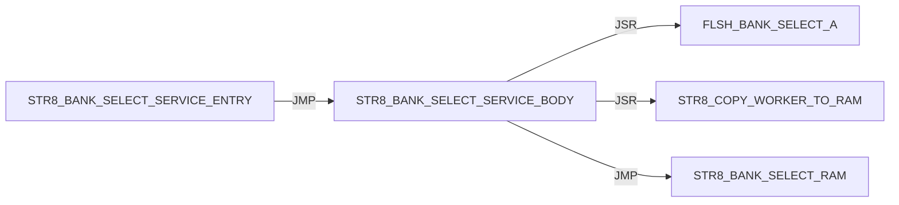

#### STR8 / BOOT

Panel 1 of 2: `STR8_BOOT_JUMP_BANK_A` through `STR8_BOOT_START`.


Panel 2 of 2: `STR8_BOOT_START` through `STR8_BOOT_START`.

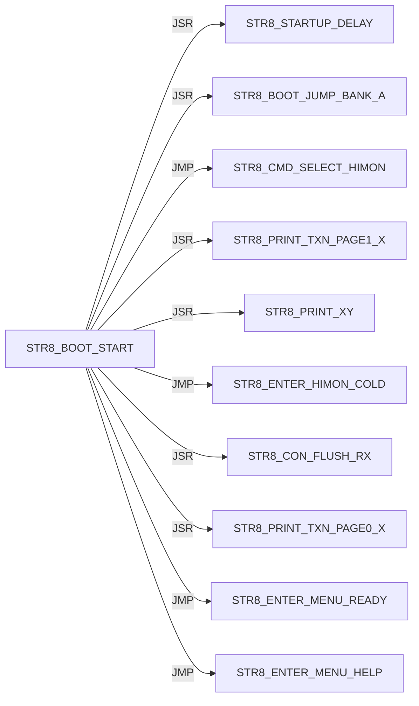

#### STR8 / CON

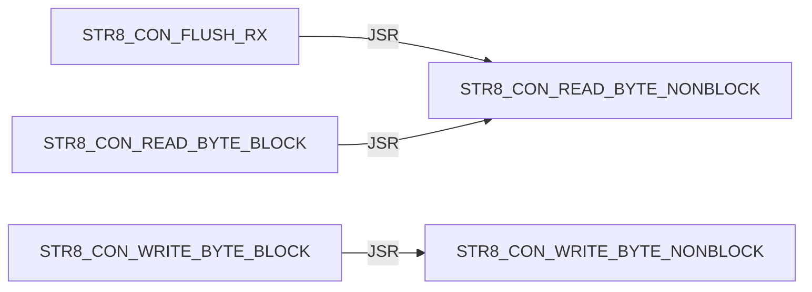

#### STR8 / CONFIRM

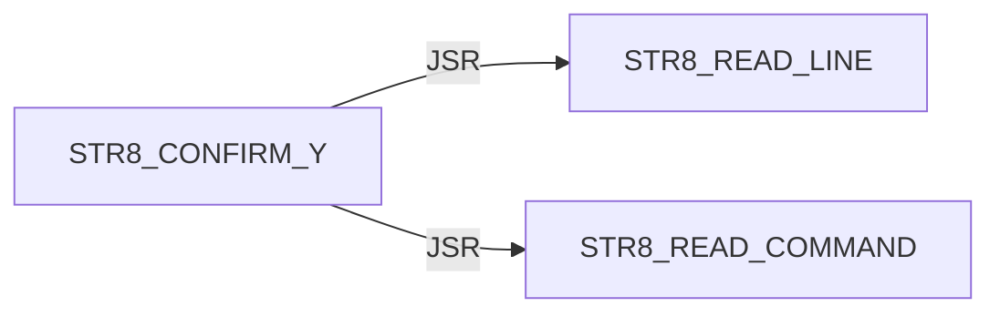

#### STR8 / DELAY


#### STR8 / DIR

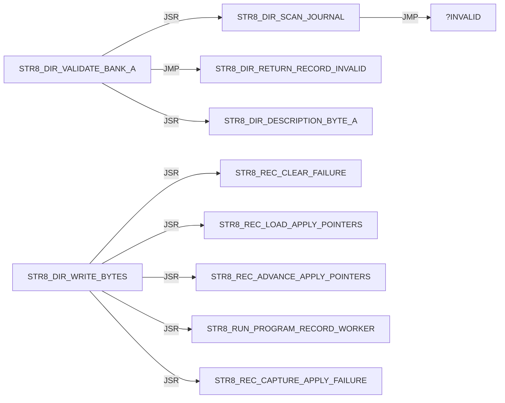

#### STR8 / DISPATCH

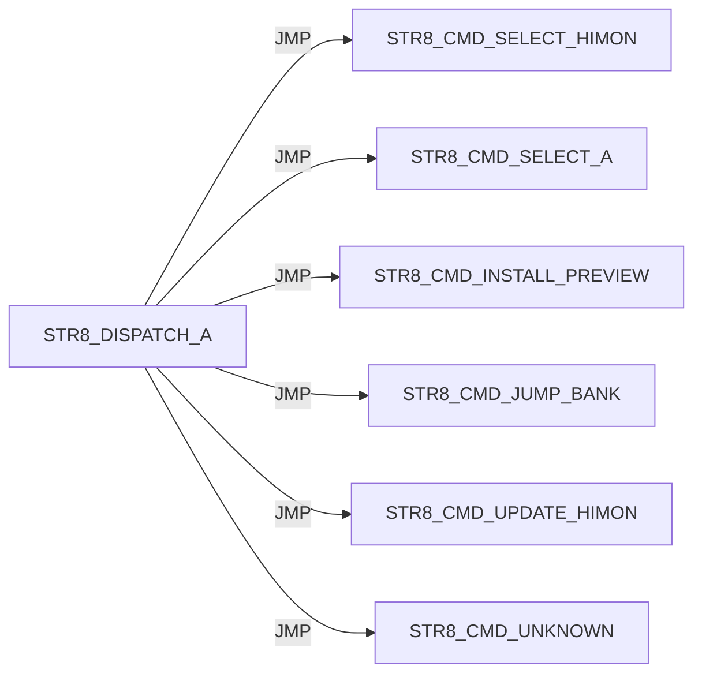

#### STR8 / ENTER

Panel 1 of 2: `STR8_ENTER_HIMON_COLD` through `STR8_ENTER_MENU_NO_TARGET_PRINT`.

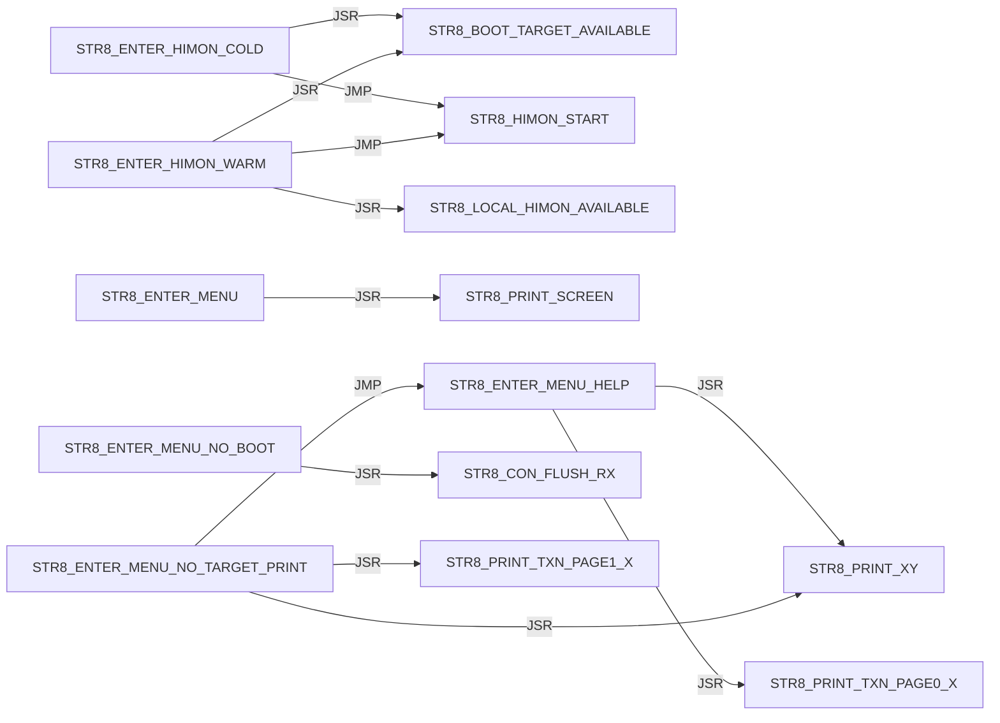

Panel 2 of 2: `STR8_ENTER_MENU_READY` through `STR8_ENTER_MENU_READY`.


#### STR8 / I

Panel 1 of 5: `STR8_I_BEGIN_TRANSACTION` through `STR8_I_PRINT_SUMMARY`.

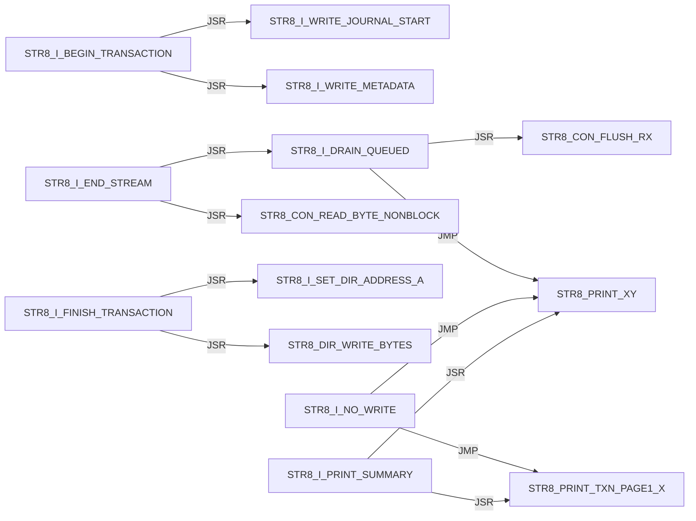

Panel 2 of 5: `STR8_I_PRINT_SUMMARY` through `STR8_I_PRINT_TRANSACTION_FAIL`.

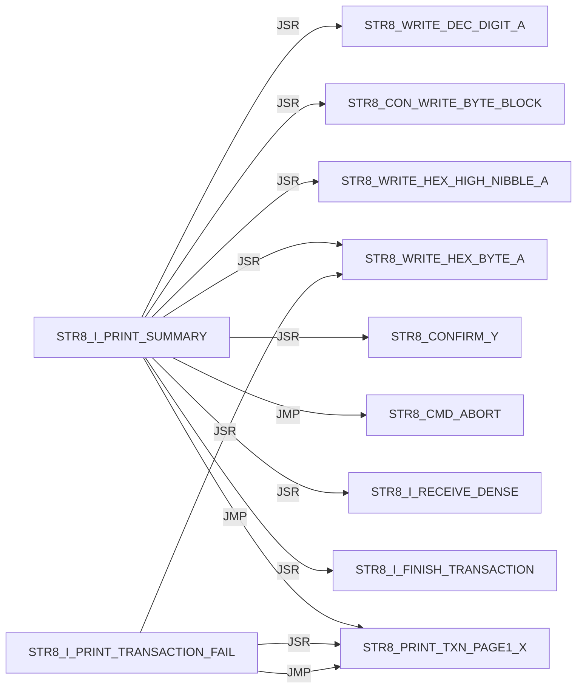

Panel 3 of 5: `STR8_I_READ_DESCRIPTION` through `STR8_I_READ_TYPE`.

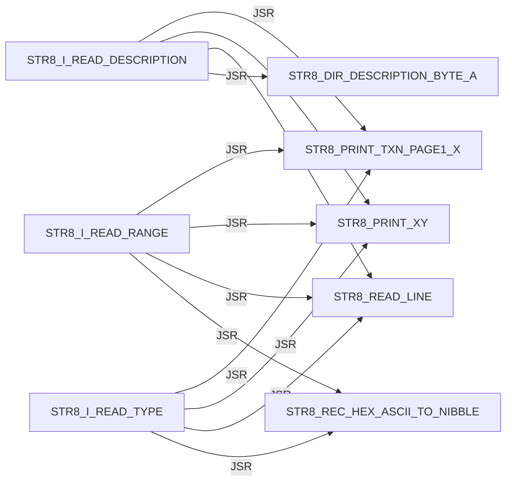

Panel 4 of 5: `STR8_I_RECEIVE_DENSE` through `STR8_I_RECEIVE_FAIL_A`.

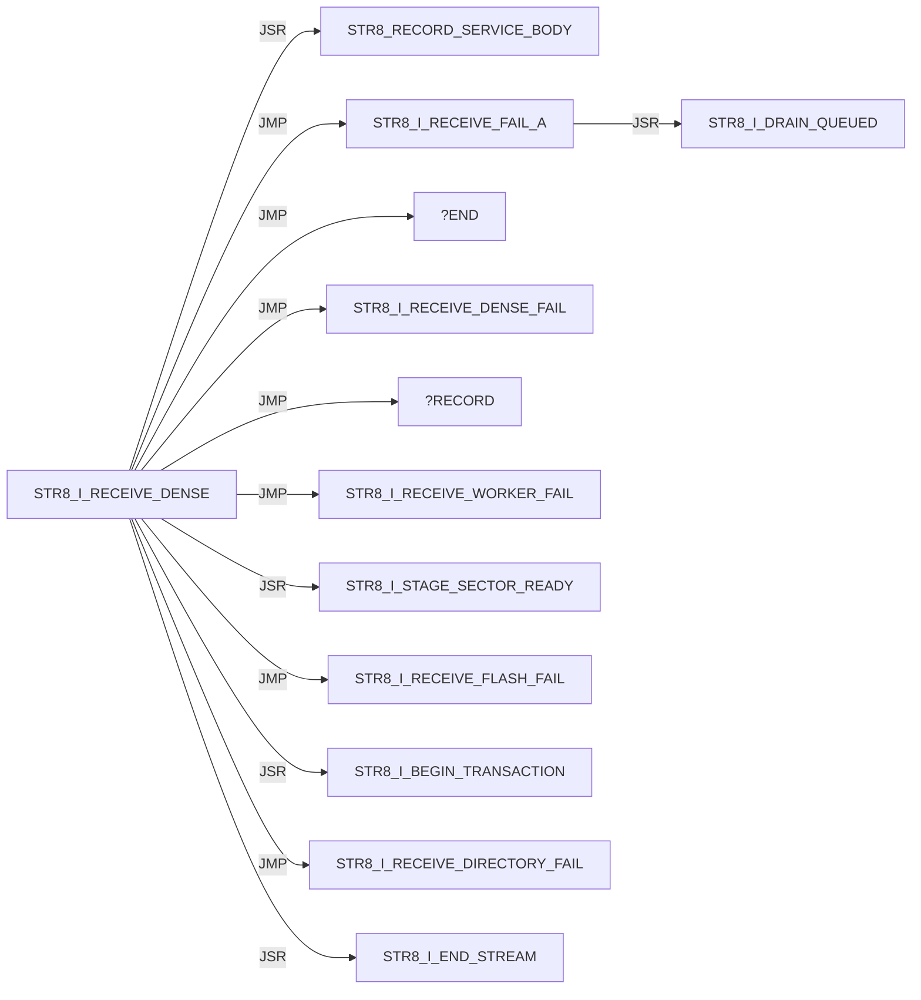

Panel 5 of 5: `STR8_I_RUN_SECTOR_WORKER` through `STR8_I_WRITE_METADATA`.

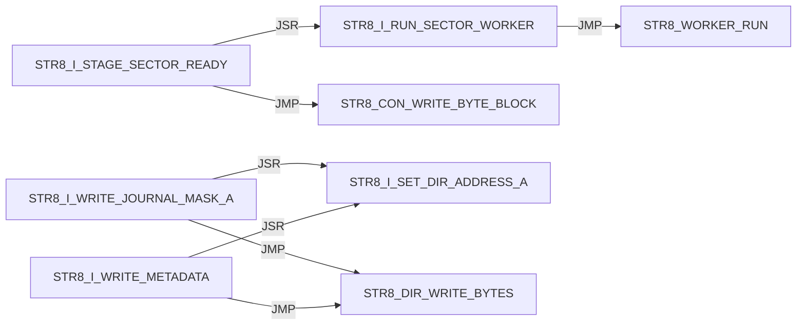

#### STR8 / IVY

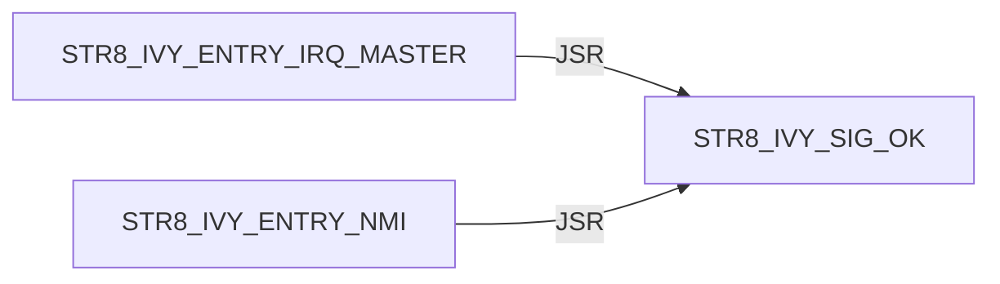

#### STR8 / JUMP

```mermaid
flowchart LR
    N0["STR8_JUMP_BANK_LAUNCH"] -->|JSR| N1["STR8_DIR_VALIDATE_BANK_A"]
    N0["STR8_JUMP_BANK_LAUNCH"] -->|JMP| N2["STR8_PRINT_JUMP_FAIL"]
    N0["STR8_JUMP_BANK_LAUNCH"] -->|JSR| N3["STR8_CON_FLUSH_RX"]
    N0["STR8_JUMP_BANK_LAUNCH"] -->|JSR| N4["STR8_JUMP_BANK_RAM"]
    N0["STR8_JUMP_BANK_LAUNCH"] -->|JSR| N5["STR8_COPY_WORKER_TO_RAM"]
    N0["STR8_JUMP_BANK_LAUNCH"] -->|JSR| N6["STR8_WORKER_RUN"]
    N7["STR8_JUMP_BANK_PREP_A"] -->|JSR| N8["STR8_PRINT_TXN_PAGE1_X"]
    N7["STR8_JUMP_BANK_PREP_A"] -->|JSR| N9["STR8_PRINT_XY"]
    N7["STR8_JUMP_BANK_PREP_A"] -->|JSR| N10["STR8_WRITE_DEC_DIGIT_A"]
    N4["STR8_JUMP_BANK_RAM"] -->|JSR| N11["FLSH_BANK_SELECT_A"]
    N4["STR8_JUMP_BANK_RAM"] -->|JSR| N12["FLSH_BANK_SELECT_3"]
```

#### STR8 / PRINT

Panel 1 of 2: `STR8_PRINT_COPY_FAIL` through `STR8_PRINT_SCREEN`.

```mermaid
flowchart LR
    N0["STR8_PRINT_COPY_FAIL"] -->|JSR| N1["STR8_PRINT_XY"]
    N0["STR8_PRINT_COPY_FAIL"] -->|JSR| N2["STR8_WRITE_HEX_BYTE_A"]
    N0["STR8_PRINT_COPY_FAIL"] -->|JMP| N1["STR8_PRINT_XY"]
    N3["STR8_PRINT_JUMP_FAIL"] -->|JSR| N4["STR8_PRINT_TXN_PAGE1_X"]
    N3["STR8_PRINT_JUMP_FAIL"] -->|JSR| N1["STR8_PRINT_XY"]
    N3["STR8_PRINT_JUMP_FAIL"] -->|JSR| N5["STR8_WRITE_DEC_DIGIT_A"]
    N3["STR8_PRINT_JUMP_FAIL"] -->|JSR| N2["STR8_WRITE_HEX_BYTE_A"]
    N3["STR8_PRINT_JUMP_FAIL"] -->|JMP| N4["STR8_PRINT_TXN_PAGE1_X"]
    N3["STR8_PRINT_JUMP_FAIL"] -->|JMP| N1["STR8_PRINT_XY"]
    N6["STR8_PRINT_PROMPT"] -->|JMP| N7["STR8_PRINT_TXN_PAGE0_X"]
    N6["STR8_PRINT_PROMPT"] -->|JMP| N1["STR8_PRINT_XY"]
    N8["STR8_PRINT_SCREEN"] -->|JSR| N1["STR8_PRINT_XY"]
```

Panel 2 of 2: `STR8_PRINT_SCREEN` through `STR8_PRINT_XY`.

```mermaid
flowchart LR
    N0["STR8_PRINT_SCREEN"] -->|JMP| N1["STR8_PRINT_XY"]
    N1["STR8_PRINT_XY"] -->|JSR| N2["STR8_CON_WRITE_BYTE_BLOCK"]
    N1["STR8_PRINT_XY"] -->|JMP| N2["STR8_CON_WRITE_BYTE_BLOCK"]
```

#### STR8 / PROGRAM

```mermaid
flowchart LR
    N0["STR8_PROGRAM_HIMON_SECTOR_AX"] -->|JSR| N1["STR8_COPY_WORKER_TO_RAM"]
    N0["STR8_PROGRAM_HIMON_SECTOR_AX"] -->|JSR| N2["STR8_WORKER_RUN"]
    N0["STR8_PROGRAM_HIMON_SECTOR_AX"] -->|JSR| N3["STR8_CON_WRITE_BYTE_BLOCK"]
    N4["STR8_PROGRAM_HIMON_UPDATE"] -->|JSR| N0["STR8_PROGRAM_HIMON_SECTOR_AX"]
```

#### STR8 / READ

```mermaid
flowchart LR
    N0["STR8_READ_COMMAND"] -->|JSR| N1["STR8_CON_READ_BYTE_BLOCK"]
    N0["STR8_READ_COMMAND"] -->|JSR| N2["STR8_TO_UPPER_A"]
    N0["STR8_READ_COMMAND"] -->|JSR| N3["STR8_CON_WRITE_BYTE_BLOCK"]
    N4["STR8_READ_HIMON_S19"] -->|JSR| N5["STR8_RECORD_SERVICE_BODY"]
    N4["STR8_READ_HIMON_S19"] -->|JSR| N6["STR8_STAGE_HIMON_RECORD"]
    N4["STR8_READ_HIMON_S19"] -->|JSR| N3["STR8_CON_WRITE_BYTE_BLOCK"]
    N7["STR8_READ_LINE"] -->|JSR| N8["STR8_READ_TEXT_BYTE_BLOCK"]
    N7["STR8_READ_LINE"] -->|JSR| N2["STR8_TO_UPPER_A"]
    N7["STR8_READ_LINE"] -->|JSR| N3["STR8_CON_WRITE_BYTE_BLOCK"]
    N7["STR8_READ_LINE"] -->|JSR| N9["STR8_PRINT_TXN_PAGE1_X"]
    N7["STR8_READ_LINE"] -->|JSR| N10["STR8_PRINT_XY"]
    N8["STR8_READ_TEXT_BYTE_BLOCK"] -->|JSR| N1["STR8_CON_READ_BYTE_BLOCK"]
```

#### STR8 / REC

Panel 1 of 3: `STR8_REC_APPLY_LF` through `STR8_REC_PARSE`.

```mermaid
flowchart LR
    N0["STR8_REC_APPLY_LF"] -->|JSR| N1["STR8_REC_CLEAR_FAILURE"]
    N0["STR8_REC_APPLY_LF"] -->|JMP| N2["STR8_REC_FAIL_A"]
    N0["STR8_REC_APPLY_LF"] -->|JMP| N3["STR8_REC_RETURN_OK"]
    N0["STR8_REC_APPLY_LF"] -->|JSR| N4["STR8_REC_LOAD_APPLY_POINTERS"]
    N0["STR8_REC_APPLY_LF"] -->|JSR| N5["STR8_REC_CAPTURE_APPLY_FAILURE"]
    N0["STR8_REC_APPLY_LF"] -->|JSR| N6["STR8_REC_ADVANCE_APPLY_POINTERS"]
    N0["STR8_REC_APPLY_LF"] -->|JSR| N7["STR8_RUN_PROGRAM_RECORD_WORKER"]
    N8["STR8_REC_FAIL_READ_X"] -->|JMP| N9["STR8_REC_RETURN_CURRENT_FAIL"]
    N8["STR8_REC_FAIL_READ_X"] -->|JMP| N2["STR8_REC_FAIL_A"]
    N10["STR8_REC_PARSE"] -->|JSR| N11["STR8_REC_CLEAR_RESULT"]
    N10["STR8_REC_PARSE"] -->|JMP| N2["STR8_REC_FAIL_A"]
    N10["STR8_REC_PARSE"] -->|JSR| N12["STR8_REC_READ_CHAR"]
```

Panel 2 of 3: `STR8_REC_PARSE` through `STR8_REC_READ_HEX_BYTE`.

```mermaid
flowchart LR
    N0["STR8_REC_PARSE"] -->|JMP| N1["STR8_REC_FAIL_READ_START"]
    N0["STR8_REC_PARSE"] -->|JMP| N2["STR8_REC_FAIL_READ_TYPE"]
    N3["STR8_REC_PARSE_BODY"] -->|JSR| N4["STR8_REC_READ_SUM_BYTE"]
    N3["STR8_REC_PARSE_BODY"] -->|JMP| N5["STR8_REC_FAIL_A"]
    N3["STR8_REC_PARSE_BODY"] -->|JMP| N6["STR8_REC_FAIL_READ_HEX"]
    N3["STR8_REC_PARSE_BODY"] -->|JSR| N7["STR8_REC_READ_CHAR"]
    N3["STR8_REC_PARSE_BODY"] -->|JMP| N8["STR8_REC_FAIL_READ_END"]
    N3["STR8_REC_PARSE_BODY"] -->|JMP| N9["STR8_REC_RETURN_OK"]
    N7["STR8_REC_READ_CHAR"] -->|JSR| N10["STR8_READ_TEXT_BYTE_BLOCK"]
    N7["STR8_REC_READ_CHAR"] -->|JSR| N11["STR8_CON_READ_BYTE_BLOCK"]
    N12["STR8_REC_READ_HEX_BYTE"] -->|JSR| N7["STR8_REC_READ_CHAR"]
    N12["STR8_REC_READ_HEX_BYTE"] -->|JSR| N13["STR8_REC_HEX_ASCII_TO_NIBBLE"]
```

Panel 3 of 3: `STR8_REC_READ_SUM_BYTE` through `STR8_REC_READ_SUM_BYTE`.

```mermaid
flowchart LR
    N0["STR8_REC_READ_SUM_BYTE"] -->|JSR| N1["STR8_REC_READ_HEX_BYTE"]
```

#### STR8 / RECORD

```mermaid
flowchart LR
    N0["STR8_RECORD_SERVICE_BODY"] -->|JMP| N1["STR8_REC_APPLY_LF"]
    N0["STR8_RECORD_SERVICE_BODY"] -->|JMP| N2["STR8_REC_FAIL_A"]
    N3["STR8_RECORD_SERVICE_ENTRY"] -->|JMP| N0["STR8_RECORD_SERVICE_BODY"]
```

#### STR8 / RUN

```mermaid
flowchart LR
    N0["STR8_RUN_PROGRAM_RECORD_WORKER"] -->|JSR| N1["STR8_COPY_WORKER_TO_RAM"]
    N0["STR8_RUN_PROGRAM_RECORD_WORKER"] -->|JSR| N2["STR8_WORKER_RUN"]
    N3["STR8_RUN_WORKER_SERVICE"] -->|JMP| N4["STR8_RUN_WORKER_SERVICE_BODY"]
    N4["STR8_RUN_WORKER_SERVICE_BODY"] -->|JSR| N1["STR8_COPY_WORKER_TO_RAM"]
    N4["STR8_RUN_WORKER_SERVICE_BODY"] -->|JSR| N2["STR8_WORKER_RUN"]
```

#### STR8 / SELECT

```mermaid
flowchart LR
    N0["STR8_SELECT_BANK_3"] -->|JSR| N1["FLSH_BANK_SELECT_3"]
```

#### STR8 / STARTUP

```mermaid
flowchart LR
    N0["STR8_STARTUP_DELAY"] -->|JSR| N1["STR8_CON_WRITE_BYTE_BLOCK"]
    N0["STR8_STARTUP_DELAY"] -->|JSR| N2["STR8_CON_FLUSH_RX"]
    N0["STR8_STARTUP_DELAY"] -->|JSR| N3["STR8_PRINT_TXN_PAGE1_X"]
    N0["STR8_STARTUP_DELAY"] -->|JSR| N4["STR8_PRINT_XY"]
    N0["STR8_STARTUP_DELAY"] -->|JSR| N5["STR8_PRINT_TXN_PAGE0_X"]
    N0["STR8_STARTUP_DELAY"] -->|JSR| N6["STR8_DELAY_FIXED_A"]
    N0["STR8_STARTUP_DELAY"] -->|JSR| N7["STR8_BOOT_KEY_POLL_IF_ENABLED"]
```

#### STR8 / WRITE

```mermaid
flowchart LR
    N0["STR8_WRITE_DEC_DIGIT_A"] -->|JMP| N1["STR8_CON_WRITE_BYTE_BLOCK"]
    N2["STR8_WRITE_HEX_BYTE_A"] -->|JSR| N3["STR8_WRITE_HEX_NIBBLE_A"]
    N3["STR8_WRITE_HEX_NIBBLE_A"] -->|JMP| N1["STR8_CON_WRITE_BYTE_BLOCK"]
```

#### STR8 CMD / ABORT

```mermaid
flowchart LR
    N0["STR8_CMD_ABORT"] -->|JSR| N1["STR8_SELECT_BANK_3"]
    N0["STR8_CMD_ABORT"] -->|JMP| N2["STR8_PRINT_TXN_PAGE1_X"]
    N0["STR8_CMD_ABORT"] -->|JMP| N3["STR8_PRINT_XY"]
```

#### STR8 CMD / COPY

```mermaid
flowchart LR
    N0["STR8_CMD_COPY_FAIL"] -->|JSR| N1["STR8_SELECT_BANK_3"]
    N0["STR8_CMD_COPY_FAIL"] -->|JMP| N2["STR8_PRINT_COPY_FAIL"]
```

#### STR8 CMD / INSTALL

Panel 1 of 2: `STR8_CMD_INSTALL_PREVIEW` through `STR8_CMD_INSTALL_PREVIEW`.

```mermaid
flowchart LR
    N0["STR8_CMD_INSTALL_PREVIEW"] -->|JMP| N1["STR8_CMD_UNKNOWN"]
    N0["STR8_CMD_INSTALL_PREVIEW"] -->|JSR| N2["STR8_PRINT_TXN_PAGE1_X"]
    N0["STR8_CMD_INSTALL_PREVIEW"] -->|JSR| N3["STR8_PRINT_XY"]
    N0["STR8_CMD_INSTALL_PREVIEW"] -->|JSR| N4["STR8_READ_LINE"]
    N0["STR8_CMD_INSTALL_PREVIEW"] -->|JMP| N5["STR8_CMD_ABORT"]
    N0["STR8_CMD_INSTALL_PREVIEW"] -->|JSR| N6["STR8_I_READ_RANGE"]
    N0["STR8_CMD_INSTALL_PREVIEW"] -->|JSR| N7["STR8_DIR_VALIDATE_BANK_A"]
    N0["STR8_CMD_INSTALL_PREVIEW"] -->|JSR| N8["STR8_I_READ_TYPE"]
    N0["STR8_CMD_INSTALL_PREVIEW"] -->|JSR| N9["STR8_I_READ_DESCRIPTION"]
    N0["STR8_CMD_INSTALL_PREVIEW"] -->|JMP| N10["STR8_I_PRINT_SUMMARY"]
    N0["STR8_CMD_INSTALL_PREVIEW"] -->|JSR| N11["STR8_I_COPY_RECORD_METADATA"]
    N0["STR8_CMD_INSTALL_PREVIEW"] -->|JMP| N2["STR8_PRINT_TXN_PAGE1_X"]
```

Panel 2 of 2: `STR8_CMD_INSTALL_PREVIEW` through `STR8_CMD_INSTALL_PREVIEW`.

```mermaid
flowchart LR
    N0["STR8_CMD_INSTALL_PREVIEW"] -->|JMP| N1["STR8_PRINT_XY"]
```

#### STR8 CMD / JUMP

```mermaid
flowchart LR
    N0["STR8_CMD_JUMP_BANK"] -->|JSR| N1["STR8_READ_COMMAND"]
    N0["STR8_CMD_JUMP_BANK"] -->|JMP| N2["STR8_CMD_ABORT"]
    N0["STR8_CMD_JUMP_BANK"] -->|JSR| N3["STR8_JUMP_BANK_PREP_A"]
    N0["STR8_CMD_JUMP_BANK"] -->|JMP| N4["STR8_JUMP_BANK_LAUNCH"]
    N0["STR8_CMD_JUMP_BANK"] -->|JMP| N5["STR8_CMD_UNKNOWN"]
```

#### STR8 CMD / LOOP

```mermaid
flowchart LR
    N0["STR8_CMD_LOOP"] -->|JSR| N1["STR8_PRINT_PROMPT"]
    N0["STR8_CMD_LOOP"] -->|JSR| N2["STR8_READ_LINE"]
    N0["STR8_CMD_LOOP"] -->|JSR| N3["STR8_CMD_ABORT"]
    N0["STR8_CMD_LOOP"] -->|JSR| N4["STR8_READ_COMMAND"]
    N0["STR8_CMD_LOOP"] -->|JSR| N5["STR8_DISPATCH_A"]
```

#### STR8 CMD / OK

```mermaid
flowchart LR
    N0["STR8_CMD_OK"] -->|JSR| N1["STR8_SELECT_BANK_3"]
    N0["STR8_CMD_OK"] -->|JMP| N2["STR8_PRINT_XY"]
```

#### STR8 CMD / SELECT

```mermaid
flowchart LR
    N0["STR8_CMD_SELECT_A"] -->|JSR| N1["STR8_JUMP_BANK_PREP_A"]
    N0["STR8_CMD_SELECT_A"] -->|JMP| N2["STR8_JUMP_BANK_LAUNCH"]
    N3["STR8_CMD_SELECT_HIMON"] -->|JSR| N4["STR8_SELECT_BANK_3"]
    N3["STR8_CMD_SELECT_HIMON"] -->|JSR| N5["STR8_CON_FLUSH_RX"]
    N3["STR8_CMD_SELECT_HIMON"] -->|JSR| N6["STR8_PRINT_TXN_PAGE1_X"]
    N3["STR8_CMD_SELECT_HIMON"] -->|JSR| N7["STR8_PRINT_XY"]
    N3["STR8_CMD_SELECT_HIMON"] -->|JMP| N8["STR8_ENTER_HIMON_WARM"]
```

#### STR8 CMD / UNKNOWN

```mermaid
flowchart LR
    N0["STR8_CMD_UNKNOWN"] -->|JSR| N1["STR8_PRINT_TXN_PAGE1_X"]
    N0["STR8_CMD_UNKNOWN"] -->|JSR| N2["STR8_PRINT_XY"]
    N0["STR8_CMD_UNKNOWN"] -->|JMP| N3["STR8_PRINT_TXN_PAGE0_X"]
    N0["STR8_CMD_UNKNOWN"] -->|JMP| N2["STR8_PRINT_XY"]
```

#### STR8 CMD / UPDATE

```mermaid
flowchart LR
    N0["STR8_CMD_UPDATE_HIMON"] -->|JMP| N1["STR8_PRINT_XY"]
    N0["STR8_CMD_UPDATE_HIMON"] -->|JSR| N1["STR8_PRINT_XY"]
    N0["STR8_CMD_UPDATE_HIMON"] -->|JSR| N2["STR8_CONFIRM_Y"]
    N0["STR8_CMD_UPDATE_HIMON"] -->|JSR| N3["STR8_STAGE_HIMON_BLANK"]
    N0["STR8_CMD_UPDATE_HIMON"] -->|JSR| N4["STR8_UPD_INIT"]
    N0["STR8_CMD_UPDATE_HIMON"] -->|JSR| N5["STR8_READ_HIMON_S19"]
    N0["STR8_CMD_UPDATE_HIMON"] -->|JSR| N6["STR8_PROGRAM_HIMON_UPDATE"]
    N0["STR8_CMD_UPDATE_HIMON"] -->|JMP| N7["STR8_CMD_OK"]
    N8["STR8_CMD_UPDATE_NO_DATA"] -->|JMP| N1["STR8_PRINT_XY"]
    N9["STR8_CMD_UPDATE_S19_FAIL"] -->|JSR| N10["STR8_CON_FLUSH_RX"]
    N9["STR8_CMD_UPDATE_S19_FAIL"] -->|JMP| N1["STR8_PRINT_XY"]
```

## External Targets

These targets are not labels in this source file; most are `XREF` providers from sibling ROM modules.

```text
FLSH_BANK_SELECT_3
FLSH_BANK_SELECT_A
STR8_BANK_SELECT_RAM
STR8_HIMON_START
STR8_WORKER_RUN
UTL_DELAY_AXY_8MHZ
```

## Unique Direct Edges By Source Label

Each block is one source label. Indented lines are outgoing direct edges.
Blank lines are source-level breaks; they do not imply call depth.

```text
START
    JMP STR8_BOOT_START

STR8_BANK_SELECT_SERVICE_BODY
    JSR FLSH_BANK_SELECT_A
    JSR STR8_COPY_WORKER_TO_RAM
    JMP STR8_BANK_SELECT_RAM

STR8_BANK_SELECT_SERVICE_ENTRY
    JMP STR8_BANK_SELECT_SERVICE_BODY

STR8_BOOT_JUMP_BANK_A
    JSR STR8_JUMP_BANK_PREP_A
    JSR STR8_CON_FLUSH_RX
    JSR STR8_PRINT_TXN_PAGE1_X
    JSR STR8_PRINT_XY
    JSR STR8_DELAY_FIXED_A
    JMP STR8_JUMP_BANK_LAUNCH

STR8_BOOT_KEY_POLL
    JSR STR8_CON_READ_BYTE_NONBLOCK
    JSR STR8_TO_UPPER_A
    JSR STR8_CON_WRITE_BYTE_BLOCK

STR8_BOOT_KEY_POLL_IF_ENABLED
    JMP STR8_BOOT_KEY_POLL

STR8_BOOT_START
    JSR STR8_IVY_INIT
    JSR STR8_CON_INIT
    JSR STR8_STARTUP_DELAY
    JSR STR8_BOOT_JUMP_BANK_A
    JMP STR8_CMD_SELECT_HIMON
    JSR STR8_PRINT_TXN_PAGE1_X
    JSR STR8_PRINT_XY
    JMP STR8_ENTER_HIMON_COLD
    JSR STR8_CON_FLUSH_RX
    JSR STR8_PRINT_TXN_PAGE0_X
    JMP STR8_ENTER_MENU_READY
    JMP STR8_ENTER_MENU_HELP

STR8_CMD_ABORT
    JSR STR8_SELECT_BANK_3
    JMP STR8_PRINT_TXN_PAGE1_X
    JMP STR8_PRINT_XY

STR8_CMD_COPY_FAIL
    JSR STR8_SELECT_BANK_3
    JMP STR8_PRINT_COPY_FAIL

STR8_CMD_INSTALL_PREVIEW
    JMP STR8_CMD_UNKNOWN
    JSR STR8_PRINT_TXN_PAGE1_X
    JSR STR8_PRINT_XY
    JSR STR8_READ_LINE
    JMP STR8_CMD_ABORT
    JSR STR8_I_READ_RANGE
    JSR STR8_DIR_VALIDATE_BANK_A
    JSR STR8_I_READ_TYPE
    JSR STR8_I_READ_DESCRIPTION
    JMP STR8_I_PRINT_SUMMARY
    JSR STR8_I_COPY_RECORD_METADATA
    JMP STR8_PRINT_TXN_PAGE1_X
    JMP STR8_PRINT_XY

STR8_CMD_JUMP_BANK
    JSR STR8_READ_COMMAND
    JMP STR8_CMD_ABORT
    JSR STR8_JUMP_BANK_PREP_A
    JMP STR8_JUMP_BANK_LAUNCH
    JMP STR8_CMD_UNKNOWN

STR8_CMD_LOOP
    JSR STR8_PRINT_PROMPT
    JSR STR8_READ_LINE
    JSR STR8_CMD_ABORT
    JSR STR8_READ_COMMAND
    JSR STR8_DISPATCH_A

STR8_CMD_OK
    JSR STR8_SELECT_BANK_3
    JMP STR8_PRINT_XY

STR8_CMD_SELECT_A
    JSR STR8_JUMP_BANK_PREP_A
    JMP STR8_JUMP_BANK_LAUNCH

STR8_CMD_SELECT_HIMON
    JSR STR8_SELECT_BANK_3
    JSR STR8_CON_FLUSH_RX
    JSR STR8_PRINT_TXN_PAGE1_X
    JSR STR8_PRINT_XY
    JMP STR8_ENTER_HIMON_WARM

STR8_CMD_UNKNOWN
    JSR STR8_PRINT_TXN_PAGE1_X
    JSR STR8_PRINT_XY
    JMP STR8_PRINT_TXN_PAGE0_X
    JMP STR8_PRINT_XY

STR8_CMD_UPDATE_HIMON
    JMP STR8_PRINT_XY
    JSR STR8_PRINT_XY
    JSR STR8_CONFIRM_Y
    JSR STR8_STAGE_HIMON_BLANK
    JSR STR8_UPD_INIT
    JSR STR8_READ_HIMON_S19
    JSR STR8_PROGRAM_HIMON_UPDATE
    JMP STR8_CMD_OK

STR8_CMD_UPDATE_NO_DATA
    JMP STR8_PRINT_XY

STR8_CMD_UPDATE_S19_FAIL
    JSR STR8_CON_FLUSH_RX
    JMP STR8_PRINT_XY

STR8_CON_FLUSH_RX
    JSR STR8_CON_READ_BYTE_NONBLOCK

STR8_CON_READ_BYTE_BLOCK
    JSR STR8_CON_READ_BYTE_NONBLOCK

STR8_CON_WRITE_BYTE_BLOCK
    JSR STR8_CON_WRITE_BYTE_NONBLOCK

STR8_CONFIRM_Y
    JSR STR8_READ_LINE
    JSR STR8_READ_COMMAND

STR8_DELAY_FIXED_A
    JMP UTL_DELAY_AXY_8MHZ

STR8_DIR_SCAN_JOURNAL
    JMP ?INVALID

STR8_DIR_VALIDATE_BANK_A
    JMP STR8_DIR_RETURN_RECORD_INVALID
    JSR STR8_DIR_DESCRIPTION_BYTE_A
    JSR STR8_DIR_SCAN_JOURNAL

STR8_DIR_WRITE_BYTES
    JSR STR8_REC_CLEAR_FAILURE
    JSR STR8_REC_LOAD_APPLY_POINTERS
    JSR STR8_REC_ADVANCE_APPLY_POINTERS
    JSR STR8_RUN_PROGRAM_RECORD_WORKER
    JSR STR8_REC_CAPTURE_APPLY_FAILURE

STR8_DISPATCH_A
    JMP STR8_CMD_SELECT_HIMON
    JMP STR8_CMD_SELECT_A
    JMP STR8_CMD_INSTALL_PREVIEW
    JMP STR8_CMD_JUMP_BANK
    JMP STR8_CMD_UPDATE_HIMON
    JMP STR8_CMD_UNKNOWN

STR8_ENTER_HIMON_COLD
    JSR STR8_BOOT_TARGET_AVAILABLE
    JMP STR8_HIMON_START

STR8_ENTER_HIMON_WARM
    JSR STR8_LOCAL_HIMON_AVAILABLE
    JSR STR8_BOOT_TARGET_AVAILABLE
    JMP STR8_HIMON_START

STR8_ENTER_MENU
    JSR STR8_PRINT_SCREEN

STR8_ENTER_MENU_HELP
    JSR STR8_PRINT_TXN_PAGE0_X
    JSR STR8_PRINT_XY

STR8_ENTER_MENU_NO_BOOT
    JSR STR8_CON_FLUSH_RX

STR8_ENTER_MENU_NO_TARGET_PRINT
    JSR STR8_PRINT_TXN_PAGE1_X
    JSR STR8_PRINT_XY
    JMP STR8_ENTER_MENU_HELP

STR8_ENTER_MENU_READY
    JMP STR8_CMD_LOOP

STR8_I_BEGIN_TRANSACTION
    JSR STR8_I_WRITE_JOURNAL_START
    JSR STR8_I_WRITE_METADATA

STR8_I_DRAIN_QUEUED
    JSR STR8_CON_FLUSH_RX
    JMP STR8_PRINT_XY

STR8_I_END_STREAM
    JSR STR8_CON_READ_BYTE_NONBLOCK
    JSR STR8_I_DRAIN_QUEUED

STR8_I_FINISH_TRANSACTION
    JSR STR8_I_SET_DIR_ADDRESS_A
    JSR STR8_DIR_WRITE_BYTES

STR8_I_NO_WRITE
    JMP STR8_PRINT_TXN_PAGE1_X
    JMP STR8_PRINT_XY

STR8_I_PRINT_SUMMARY
    JSR STR8_PRINT_TXN_PAGE1_X
    JSR STR8_PRINT_XY
    JSR STR8_WRITE_DEC_DIGIT_A
    JSR STR8_CON_WRITE_BYTE_BLOCK
    JSR STR8_WRITE_HEX_HIGH_NIBBLE_A
    JSR STR8_WRITE_HEX_BYTE_A
    JSR STR8_CONFIRM_Y
    JMP STR8_CMD_ABORT
    JSR STR8_I_RECEIVE_DENSE
    JSR STR8_I_FINISH_TRANSACTION
    JMP STR8_PRINT_TXN_PAGE1_X

STR8_I_PRINT_TRANSACTION_FAIL
    JSR STR8_PRINT_TXN_PAGE1_X
    JSR STR8_WRITE_HEX_BYTE_A
    JMP STR8_PRINT_TXN_PAGE1_X

STR8_I_READ_DESCRIPTION
    JSR STR8_PRINT_TXN_PAGE1_X
    JSR STR8_PRINT_XY
    JSR STR8_READ_LINE
    JSR STR8_DIR_DESCRIPTION_BYTE_A

STR8_I_READ_RANGE
    JSR STR8_PRINT_TXN_PAGE1_X
    JSR STR8_PRINT_XY
    JSR STR8_READ_LINE
    JSR STR8_REC_HEX_ASCII_TO_NIBBLE

STR8_I_READ_TYPE
    JSR STR8_PRINT_TXN_PAGE1_X
    JSR STR8_PRINT_XY
    JSR STR8_READ_LINE
    JSR STR8_REC_HEX_ASCII_TO_NIBBLE

STR8_I_RECEIVE_DENSE
    JSR STR8_RECORD_SERVICE_BODY
    JMP STR8_I_RECEIVE_FAIL_A
    JMP ?END
    JMP STR8_I_RECEIVE_DENSE_FAIL
    JMP ?RECORD
    JMP STR8_I_RECEIVE_WORKER_FAIL
    JSR STR8_I_STAGE_SECTOR_READY
    JMP STR8_I_RECEIVE_FLASH_FAIL
    JSR STR8_I_BEGIN_TRANSACTION
    JMP STR8_I_RECEIVE_DIRECTORY_FAIL
    JSR STR8_I_END_STREAM

STR8_I_RECEIVE_FAIL_A
    JSR STR8_I_DRAIN_QUEUED

STR8_I_RUN_SECTOR_WORKER
    JMP STR8_WORKER_RUN

STR8_I_STAGE_SECTOR_READY
    JSR STR8_I_RUN_SECTOR_WORKER
    JMP STR8_CON_WRITE_BYTE_BLOCK

STR8_I_WRITE_JOURNAL_MASK_A
    JSR STR8_I_SET_DIR_ADDRESS_A
    JMP STR8_DIR_WRITE_BYTES

STR8_I_WRITE_METADATA
    JSR STR8_I_SET_DIR_ADDRESS_A
    JMP STR8_DIR_WRITE_BYTES

STR8_IVY_ENTRY_IRQ_MASTER
    JSR STR8_IVY_SIG_OK

STR8_IVY_ENTRY_NMI
    JSR STR8_IVY_SIG_OK

STR8_JUMP_BANK_LAUNCH
    JSR STR8_DIR_VALIDATE_BANK_A
    JMP STR8_PRINT_JUMP_FAIL
    JSR STR8_CON_FLUSH_RX
    JSR STR8_JUMP_BANK_RAM
    JSR STR8_COPY_WORKER_TO_RAM
    JSR STR8_WORKER_RUN

STR8_JUMP_BANK_PREP_A
    JSR STR8_PRINT_TXN_PAGE1_X
    JSR STR8_PRINT_XY
    JSR STR8_WRITE_DEC_DIGIT_A

STR8_JUMP_BANK_RAM
    JSR FLSH_BANK_SELECT_A
    JSR FLSH_BANK_SELECT_3

STR8_PRINT_COPY_FAIL
    JSR STR8_PRINT_XY
    JSR STR8_WRITE_HEX_BYTE_A
    JMP STR8_PRINT_XY

STR8_PRINT_JUMP_FAIL
    JSR STR8_PRINT_TXN_PAGE1_X
    JSR STR8_PRINT_XY
    JSR STR8_WRITE_DEC_DIGIT_A
    JSR STR8_WRITE_HEX_BYTE_A
    JMP STR8_PRINT_TXN_PAGE1_X
    JMP STR8_PRINT_XY

STR8_PRINT_PROMPT
    JMP STR8_PRINT_TXN_PAGE0_X
    JMP STR8_PRINT_XY

STR8_PRINT_SCREEN
    JSR STR8_PRINT_XY
    JMP STR8_PRINT_XY

STR8_PRINT_XY
    JSR STR8_CON_WRITE_BYTE_BLOCK
    JMP STR8_CON_WRITE_BYTE_BLOCK

STR8_PROGRAM_HIMON_SECTOR_AX
    JSR STR8_COPY_WORKER_TO_RAM
    JSR STR8_WORKER_RUN
    JSR STR8_CON_WRITE_BYTE_BLOCK

STR8_PROGRAM_HIMON_UPDATE
    JSR STR8_PROGRAM_HIMON_SECTOR_AX

STR8_READ_COMMAND
    JSR STR8_CON_READ_BYTE_BLOCK
    JSR STR8_TO_UPPER_A
    JSR STR8_CON_WRITE_BYTE_BLOCK

STR8_READ_HIMON_S19
    JSR STR8_RECORD_SERVICE_BODY
    JSR STR8_STAGE_HIMON_RECORD
    JSR STR8_CON_WRITE_BYTE_BLOCK

STR8_READ_LINE
    JSR STR8_READ_TEXT_BYTE_BLOCK
    JSR STR8_TO_UPPER_A
    JSR STR8_CON_WRITE_BYTE_BLOCK
    JSR STR8_PRINT_TXN_PAGE1_X
    JSR STR8_PRINT_XY

STR8_READ_TEXT_BYTE_BLOCK
    JSR STR8_CON_READ_BYTE_BLOCK

STR8_REC_APPLY_LF
    JSR STR8_REC_CLEAR_FAILURE
    JMP STR8_REC_FAIL_A
    JMP STR8_REC_RETURN_OK
    JSR STR8_REC_LOAD_APPLY_POINTERS
    JSR STR8_REC_CAPTURE_APPLY_FAILURE
    JSR STR8_REC_ADVANCE_APPLY_POINTERS
    JSR STR8_RUN_PROGRAM_RECORD_WORKER

STR8_REC_FAIL_READ_X
    JMP STR8_REC_RETURN_CURRENT_FAIL
    JMP STR8_REC_FAIL_A

STR8_REC_PARSE
    JSR STR8_REC_CLEAR_RESULT
    JMP STR8_REC_FAIL_A
    JSR STR8_REC_READ_CHAR
    JMP STR8_REC_FAIL_READ_START
    JMP STR8_REC_FAIL_READ_TYPE

STR8_REC_PARSE_BODY
    JSR STR8_REC_READ_SUM_BYTE
    JMP STR8_REC_FAIL_A
    JMP STR8_REC_FAIL_READ_HEX
    JSR STR8_REC_READ_CHAR
    JMP STR8_REC_FAIL_READ_END
    JMP STR8_REC_RETURN_OK

STR8_REC_READ_CHAR
    JSR STR8_READ_TEXT_BYTE_BLOCK
    JSR STR8_CON_READ_BYTE_BLOCK

STR8_REC_READ_HEX_BYTE
    JSR STR8_REC_READ_CHAR
    JSR STR8_REC_HEX_ASCII_TO_NIBBLE

STR8_REC_READ_SUM_BYTE
    JSR STR8_REC_READ_HEX_BYTE

STR8_RECORD_SERVICE_BODY
    JMP STR8_REC_APPLY_LF
    JMP STR8_REC_FAIL_A

STR8_RECORD_SERVICE_ENTRY
    JMP STR8_RECORD_SERVICE_BODY

STR8_RUN_PROGRAM_RECORD_WORKER
    JSR STR8_COPY_WORKER_TO_RAM
    JSR STR8_WORKER_RUN

STR8_RUN_WORKER_SERVICE
    JMP STR8_RUN_WORKER_SERVICE_BODY

STR8_RUN_WORKER_SERVICE_BODY
    JSR STR8_COPY_WORKER_TO_RAM
    JSR STR8_WORKER_RUN

STR8_SELECT_BANK_3
    JSR FLSH_BANK_SELECT_3

STR8_STARTUP_DELAY
    JSR STR8_CON_WRITE_BYTE_BLOCK
    JSR STR8_CON_FLUSH_RX
    JSR STR8_PRINT_TXN_PAGE1_X
    JSR STR8_PRINT_XY
    JSR STR8_PRINT_TXN_PAGE0_X
    JSR STR8_DELAY_FIXED_A
    JSR STR8_BOOT_KEY_POLL_IF_ENABLED

STR8_WRITE_DEC_DIGIT_A
    JMP STR8_CON_WRITE_BYTE_BLOCK

STR8_WRITE_HEX_BYTE_A
    JSR STR8_WRITE_HEX_NIBBLE_A

STR8_WRITE_HEX_NIBBLE_A
    JMP STR8_CON_WRITE_BYTE_BLOCK

```

## Raw Direct Edge Sites By Source Label

Each line is a direct call/jump site with source line number.

```text
START
      204  JMP STR8_BOOT_START

STR8_BANK_SELECT_SERVICE_BODY
     1793  JSR FLSH_BANK_SELECT_A
     1804  JSR STR8_COPY_WORKER_TO_RAM
     1806  JMP STR8_BANK_SELECT_RAM

STR8_BANK_SELECT_SERVICE_ENTRY
      233  JMP STR8_BANK_SELECT_SERVICE_BODY

STR8_BOOT_JUMP_BANK_A
     1714  JSR STR8_JUMP_BANK_PREP_A
     1715  JSR STR8_CON_FLUSH_RX
     1718  JSR STR8_PRINT_TXN_PAGE1_X
     1721  JSR STR8_PRINT_XY
     1724  JSR STR8_DELAY_FIXED_A
     1725  JMP STR8_JUMP_BANK_LAUNCH

STR8_BOOT_KEY_POLL
      543  JSR STR8_CON_READ_BYTE_NONBLOCK
      545  JSR STR8_TO_UPPER_A
      563  JSR STR8_CON_WRITE_BYTE_BLOCK

STR8_BOOT_KEY_POLL_IF_ENABLED
      537  JMP STR8_BOOT_KEY_POLL

STR8_BOOT_START
      240  JSR STR8_IVY_INIT
      241  JSR STR8_CON_INIT
      244  JSR STR8_STARTUP_DELAY
      255  JSR STR8_BOOT_JUMP_BANK_A
      257  JMP STR8_CMD_SELECT_HIMON
      261  JSR STR8_PRINT_TXN_PAGE1_X
      264  JSR STR8_PRINT_XY
      266  JMP STR8_ENTER_HIMON_COLD
      267  JSR STR8_CON_FLUSH_RX
      270  JSR STR8_PRINT_TXN_PAGE0_X
      273  JSR STR8_PRINT_XY
      275  JMP STR8_ENTER_MENU_READY
      276  JMP STR8_ENTER_MENU_HELP

STR8_CMD_ABORT
     1676  JSR STR8_SELECT_BANK_3
     1680  JMP STR8_PRINT_TXN_PAGE1_X
     1683  JMP STR8_PRINT_XY

STR8_CMD_COPY_FAIL
     1690  JSR STR8_SELECT_BANK_3
     1692  JMP STR8_PRINT_COPY_FAIL

STR8_CMD_INSTALL_PREVIEW
      741  JMP STR8_CMD_UNKNOWN
      745  JSR STR8_PRINT_TXN_PAGE1_X
      748  JSR STR8_PRINT_XY
      751  JSR STR8_READ_LINE
      754  JMP STR8_CMD_ABORT
      763  JSR STR8_I_READ_RANGE
      766  JSR STR8_DIR_VALIDATE_BANK_A
      775  JSR STR8_I_READ_TYPE
      777  JSR STR8_I_READ_DESCRIPTION
      779  JMP STR8_I_PRINT_SUMMARY
      780  JSR STR8_I_COPY_RECORD_METADATA
      781  JMP STR8_I_PRINT_SUMMARY
      784  JMP STR8_PRINT_TXN_PAGE1_X
      787  JMP STR8_PRINT_XY
      789  JMP STR8_CMD_UNKNOWN

STR8_CMD_JUMP_BANK
     1571  JSR STR8_READ_COMMAND
     1574  JMP STR8_CMD_ABORT
     1584  JSR STR8_JUMP_BANK_PREP_A
     1585  JMP STR8_JUMP_BANK_LAUNCH
     1587  JMP STR8_CMD_UNKNOWN

STR8_CMD_LOOP
      580  JSR STR8_PRINT_PROMPT
      583  JSR STR8_READ_LINE
      587  JSR STR8_CMD_ABORT
      590  JSR STR8_READ_COMMAND
      593  JSR STR8_CMD_ABORT
      597  JSR STR8_DISPATCH_A

STR8_CMD_OK
     1667  JSR STR8_SELECT_BANK_3
     1671  JMP STR8_PRINT_XY

STR8_CMD_SELECT_A
     1596  JSR STR8_JUMP_BANK_PREP_A
     1597  JMP STR8_JUMP_BANK_LAUNCH

STR8_CMD_SELECT_HIMON
     1604  JSR STR8_SELECT_BANK_3
     1606  JSR STR8_CON_FLUSH_RX
     1609  JSR STR8_PRINT_TXN_PAGE1_X
     1612  JSR STR8_PRINT_XY
     1614  JMP STR8_ENTER_HIMON_WARM

STR8_CMD_UNKNOWN
     1698  JSR STR8_PRINT_TXN_PAGE1_X
     1701  JSR STR8_PRINT_XY
     1705  JMP STR8_PRINT_TXN_PAGE0_X
     1708  JMP STR8_PRINT_XY

STR8_CMD_UPDATE_HIMON
     1623  JMP STR8_PRINT_XY
     1627  JSR STR8_PRINT_XY
     1628  JSR STR8_CONFIRM_Y
     1630  JSR STR8_STAGE_HIMON_BLANK
     1631  JSR STR8_UPD_INIT
     1634  JSR STR8_PRINT_XY
     1635  JSR STR8_READ_HIMON_S19
     1641  JSR STR8_PRINT_XY
     1642  JSR STR8_CONFIRM_Y
     1644  JSR STR8_PROGRAM_HIMON_UPDATE
     1646  JMP STR8_CMD_OK

STR8_CMD_UPDATE_NO_DATA
     1658  JMP STR8_PRINT_XY

STR8_CMD_UPDATE_S19_FAIL
     1650  JSR STR8_CON_FLUSH_RX
     1653  JMP STR8_PRINT_XY

STR8_CON_FLUSH_RX
     2962  JSR STR8_CON_READ_BYTE_NONBLOCK

STR8_CON_READ_BYTE_BLOCK
     2972  JSR STR8_CON_READ_BYTE_NONBLOCK

STR8_CON_WRITE_BYTE_BLOCK
     2998  JSR STR8_CON_WRITE_BYTE_NONBLOCK

STR8_CONFIRM_Y
     2575  JSR STR8_READ_LINE
     2587  JSR STR8_READ_COMMAND

STR8_DELAY_FIXED_A
      532  JMP UTL_DELAY_AXY_8MHZ

STR8_DIR_SCAN_JOURNAL
     1956  JMP ?INVALID

STR8_DIR_VALIDATE_BANK_A
     1832  JMP STR8_DIR_RETURN_RECORD_INVALID
     1869  JSR STR8_DIR_DESCRIPTION_BYTE_A
     1904  JSR STR8_DIR_SCAN_JOURNAL

STR8_DIR_WRITE_BYTES
     2011  JSR STR8_REC_CLEAR_FAILURE
     2028  JSR STR8_REC_LOAD_APPLY_POINTERS
     2035  JSR STR8_REC_ADVANCE_APPLY_POINTERS
     2039  JSR STR8_RUN_PROGRAM_RECORD_WORKER
     2042  JSR STR8_REC_LOAD_APPLY_POINTERS
     2048  JSR STR8_REC_ADVANCE_APPLY_POINTERS
     2064  JSR STR8_REC_CAPTURE_APPLY_FAILURE
     2069  JSR STR8_REC_CAPTURE_APPLY_FAILURE

STR8_DISPATCH_A
      707  JMP STR8_CMD_SELECT_HIMON
      713  JMP STR8_CMD_SELECT_A
      719  JMP STR8_CMD_INSTALL_PREVIEW
      724  JMP STR8_CMD_JUMP_BANK
      730  JMP STR8_CMD_UPDATE_HIMON
      733  JMP STR8_CMD_UNKNOWN

STR8_ENTER_HIMON_COLD
      385  JSR STR8_BOOT_TARGET_AVAILABLE
      391  JMP STR8_HIMON_START

STR8_ENTER_HIMON_WARM
      395  JSR STR8_LOCAL_HIMON_AVAILABLE
      403  JSR STR8_BOOT_TARGET_AVAILABLE
      414  JMP STR8_HIMON_START

STR8_ENTER_MENU
      282  JSR STR8_PRINT_SCREEN

STR8_ENTER_MENU_HELP
      289  JSR STR8_PRINT_TXN_PAGE0_X
      292  JSR STR8_PRINT_XY

STR8_ENTER_MENU_NO_BOOT
      457  JSR STR8_CON_FLUSH_RX

STR8_ENTER_MENU_NO_TARGET_PRINT
      461  JSR STR8_PRINT_TXN_PAGE1_X
      465  JSR STR8_PRINT_XY
      467  JMP STR8_ENTER_MENU_HELP

STR8_ENTER_MENU_READY
      296  JMP STR8_CMD_LOOP

STR8_I_BEGIN_TRANSACTION
     1118  JSR STR8_I_WRITE_JOURNAL_START
     1123  JSR STR8_I_WRITE_METADATA

STR8_I_DRAIN_QUEUED
     1548  JSR STR8_CON_FLUSH_RX
     1558  JMP STR8_PRINT_XY

STR8_I_END_STREAM
     1531  JSR STR8_CON_READ_BYTE_NONBLOCK
     1536  JSR STR8_CON_READ_BYTE_NONBLOCK
     1540  JSR STR8_I_DRAIN_QUEUED

STR8_I_FINISH_TRANSACTION
     1144  JSR STR8_I_SET_DIR_ADDRESS_A
     1147  JSR STR8_DIR_WRITE_BYTES
     1152  JSR STR8_I_SET_DIR_ADDRESS_A
     1155  JSR STR8_DIR_WRITE_BYTES

STR8_I_NO_WRITE
     1097  JMP STR8_PRINT_TXN_PAGE1_X
     1100  JMP STR8_PRINT_XY

STR8_I_PRINT_SUMMARY
      929  JSR STR8_PRINT_TXN_PAGE1_X
      932  JSR STR8_PRINT_XY
      935  JSR STR8_WRITE_DEC_DIGIT_A
      937  JSR STR8_CON_WRITE_BYTE_BLOCK
      939  JSR STR8_WRITE_HEX_HIGH_NIBBLE_A
      941  JSR STR8_CON_WRITE_BYTE_BLOCK
      945  JSR STR8_WRITE_HEX_HIGH_NIBBLE_A
      948  JSR STR8_PRINT_TXN_PAGE1_X
      951  JSR STR8_PRINT_XY
      954  JSR STR8_WRITE_HEX_BYTE_A
      957  JSR STR8_PRINT_TXN_PAGE1_X
      960  JSR STR8_PRINT_XY
      964  JSR STR8_CON_WRITE_BYTE_BLOCK
      976  JSR STR8_PRINT_TXN_PAGE1_X
      979  JSR STR8_PRINT_XY
      982  JSR STR8_WRITE_HEX_BYTE_A
      984  JSR STR8_WRITE_HEX_BYTE_A
     1018  JSR STR8_PRINT_TXN_PAGE1_X
     1020  JSR STR8_PRINT_XY
     1024  JSR STR8_PRINT_TXN_PAGE1_X
     1027  JSR STR8_PRINT_XY
     1030  JSR STR8_WRITE_HEX_BYTE_A
     1046  JSR STR8_PRINT_TXN_PAGE1_X
     1050  JSR STR8_PRINT_XY
     1052  JSR STR8_CONFIRM_Y
     1054  JMP STR8_CMD_ABORT
     1058  JSR STR8_PRINT_TXN_PAGE1_X
     1061  JSR STR8_PRINT_XY
     1063  JSR STR8_I_RECEIVE_DENSE
     1066  JSR STR8_I_FINISH_TRANSACTION
     1069  JMP STR8_PRINT_TXN_PAGE1_X
     1073  JSR STR8_PRINT_XY
     1084  JSR STR8_PRINT_TXN_PAGE1_X
     1087  JSR STR8_PRINT_XY
     1091  JSR STR8_WRITE_HEX_BYTE_A
     1093  JMP STR8_PRINT_TXN_PAGE1_X

STR8_I_PRINT_TRANSACTION_FAIL
     1108  JSR STR8_PRINT_TXN_PAGE1_X
     1110  JSR STR8_WRITE_HEX_BYTE_A
     1112  JMP STR8_PRINT_TXN_PAGE1_X

STR8_I_READ_DESCRIPTION
      885  JSR STR8_PRINT_TXN_PAGE1_X
      888  JSR STR8_PRINT_XY
      891  JSR STR8_READ_LINE
      896  JSR STR8_DIR_DESCRIPTION_BYTE_A

STR8_I_READ_RANGE
      827  JSR STR8_PRINT_TXN_PAGE1_X
      830  JSR STR8_PRINT_XY
      833  JSR STR8_READ_LINE
      843  JSR STR8_REC_HEX_ASCII_TO_NIBBLE
      847  JSR STR8_REC_HEX_ASCII_TO_NIBBLE

STR8_I_READ_TYPE
      794  JSR STR8_PRINT_TXN_PAGE1_X
      797  JSR STR8_PRINT_XY
      800  JSR STR8_READ_LINE
      804  JSR STR8_REC_HEX_ASCII_TO_NIBBLE
      812  JSR STR8_REC_HEX_ASCII_TO_NIBBLE

STR8_I_RECEIVE_DENSE
     1271  JSR STR8_RECORD_SERVICE_BODY
     1274  JMP STR8_I_RECEIVE_FAIL_A
     1283  JMP ?END
     1309  JMP STR8_I_RECEIVE_DENSE_FAIL
     1370  JMP ?RECORD
     1371  JMP STR8_I_RECEIVE_WORKER_FAIL
     1382  JSR STR8_I_STAGE_SECTOR_READY
     1384  JMP STR8_I_RECEIVE_FLASH_FAIL
     1400  JSR STR8_I_BEGIN_TRANSACTION
     1402  JMP STR8_I_RECEIVE_DIRECTORY_FAIL
     1405  JMP ?RECORD
     1415  JMP ?RECORD
     1461  JSR STR8_I_END_STREAM
     1463  JSR STR8_I_STAGE_SECTOR_READY

STR8_I_RECEIVE_FAIL_A
     1494  JSR STR8_I_DRAIN_QUEUED

STR8_I_RUN_SECTOR_WORKER
     1521  JMP STR8_WORKER_RUN

STR8_I_STAGE_SECTOR_READY
     1512  JSR STR8_I_RUN_SECTOR_WORKER
     1516  JMP STR8_CON_WRITE_BYTE_BLOCK

STR8_I_WRITE_JOURNAL_MASK_A
     1198  JSR STR8_I_SET_DIR_ADDRESS_A
     1205  JMP STR8_DIR_WRITE_BYTES

STR8_I_WRITE_METADATA
     1175  JSR STR8_I_SET_DIR_ADDRESS_A
     1178  JMP STR8_DIR_WRITE_BYTES

STR8_IVY_ENTRY_IRQ_MASTER
      367  JSR STR8_IVY_SIG_OK

STR8_IVY_ENTRY_NMI
      347  JSR STR8_IVY_SIG_OK

STR8_JUMP_BANK_LAUNCH
     1758  JSR STR8_DIR_VALIDATE_BANK_A
     1761  JMP STR8_PRINT_JUMP_FAIL
     1764  JSR STR8_CON_FLUSH_RX
     1768  JSR STR8_JUMP_BANK_RAM
     1770  JSR STR8_COPY_WORKER_TO_RAM
     1771  JSR STR8_WORKER_RUN
     1773  JMP STR8_PRINT_JUMP_FAIL

STR8_JUMP_BANK_PREP_A
     1735  JSR STR8_PRINT_TXN_PAGE1_X
     1738  JSR STR8_PRINT_XY
     1741  JSR STR8_WRITE_DEC_DIGIT_A
     1744  JSR STR8_PRINT_TXN_PAGE1_X
     1747  JSR STR8_PRINT_XY

STR8_JUMP_BANK_RAM
     2875  JSR FLSH_BANK_SELECT_A
     2912  JSR FLSH_BANK_SELECT_3

STR8_PRINT_COPY_FAIL
     2788  JSR STR8_PRINT_XY
     2790  JSR STR8_WRITE_HEX_BYTE_A
     2792  JSR STR8_WRITE_HEX_BYTE_A
     2795  JMP STR8_PRINT_XY
     2799  JMP STR8_PRINT_XY

STR8_PRINT_JUMP_FAIL
     2806  JSR STR8_PRINT_TXN_PAGE1_X
     2809  JSR STR8_PRINT_XY
     2812  JSR STR8_WRITE_DEC_DIGIT_A
     2815  JSR STR8_PRINT_TXN_PAGE1_X
     2818  JSR STR8_PRINT_XY
     2821  JSR STR8_WRITE_HEX_BYTE_A
     2823  JSR STR8_WRITE_HEX_BYTE_A
     2826  JMP STR8_PRINT_TXN_PAGE1_X
     2829  JMP STR8_PRINT_XY

STR8_PRINT_PROMPT
     2924  JMP STR8_PRINT_TXN_PAGE0_X
     2927  JMP STR8_PRINT_XY

STR8_PRINT_SCREEN
      573  JSR STR8_PRINT_XY
      576  JMP STR8_PRINT_XY

STR8_PRINT_XY
     2945  JSR STR8_CON_WRITE_BYTE_BLOCK
     2951  JMP STR8_CON_WRITE_BYTE_BLOCK

STR8_PROGRAM_HIMON_SECTOR_AX
     2769  JSR STR8_COPY_WORKER_TO_RAM
     2770  JSR STR8_WORKER_RUN
     2773  JSR STR8_CON_WRITE_BYTE_BLOCK

STR8_PROGRAM_HIMON_UPDATE
     2746  JSR STR8_PROGRAM_HIMON_SECTOR_AX
     2750  JSR STR8_PROGRAM_HIMON_SECTOR_AX
     2754  JSR STR8_PROGRAM_HIMON_SECTOR_AX

STR8_READ_COMMAND
      666  JSR STR8_CON_READ_BYTE_BLOCK
      681  JSR STR8_TO_UPPER_A
      682  JSR STR8_CON_WRITE_BYTE_BLOCK

STR8_READ_HIMON_S19
     2671  JSR STR8_RECORD_SERVICE_BODY
     2682  JSR STR8_STAGE_HIMON_RECORD
     2685  JSR STR8_CON_WRITE_BYTE_BLOCK

STR8_READ_LINE
      609  JSR STR8_READ_TEXT_BYTE_BLOCK
      622  JSR STR8_TO_UPPER_A
      626  JSR STR8_CON_WRITE_BYTE_BLOCK
      635  JSR STR8_PRINT_TXN_PAGE1_X
      638  JSR STR8_PRINT_XY

STR8_READ_TEXT_BYTE_BLOCK
      649  JSR STR8_CON_READ_BYTE_BLOCK

STR8_REC_APPLY_LF
     2318  JSR STR8_REC_CLEAR_FAILURE
     2327  JMP STR8_REC_FAIL_A
     2332  JMP STR8_REC_FAIL_A
     2342  JMP STR8_REC_FAIL_A
     2348  JMP STR8_REC_FAIL_A
     2352  JMP STR8_REC_RETURN_OK
     2371  JMP STR8_REC_FAIL_A
     2378  JMP STR8_REC_FAIL_A
     2381  JSR STR8_REC_LOAD_APPLY_POINTERS
     2390  JSR STR8_REC_CAPTURE_APPLY_FAILURE
     2392  JMP STR8_REC_FAIL_A
     2394  JSR STR8_REC_ADVANCE_APPLY_POINTERS
     2398  JSR STR8_RUN_PROGRAM_RECORD_WORKER
     2401  JMP STR8_REC_FAIL_A
     2404  JSR STR8_REC_LOAD_APPLY_POINTERS
     2411  JSR STR8_REC_CAPTURE_APPLY_FAILURE
     2413  JMP STR8_REC_FAIL_A
     2415  JSR STR8_REC_ADVANCE_APPLY_POINTERS
     2418  JMP STR8_REC_RETURN_OK

STR8_REC_FAIL_READ_X
     2312  JMP STR8_REC_RETURN_CURRENT_FAIL
     2315  JMP STR8_REC_FAIL_A

STR8_REC_PARSE
     2120  JSR STR8_REC_CLEAR_RESULT
     2125  JMP STR8_REC_FAIL_A
     2131  JMP STR8_REC_FAIL_A
     2155  JMP STR8_REC_FAIL_A
     2158  JSR STR8_REC_READ_CHAR
     2160  JMP STR8_REC_FAIL_READ_START
     2168  JSR STR8_REC_READ_CHAR
     2170  JMP STR8_REC_FAIL_READ_START
     2176  JMP STR8_REC_FAIL_A
     2178  JSR STR8_REC_READ_CHAR
     2180  JMP STR8_REC_FAIL_READ_TYPE
     2190  JMP STR8_REC_FAIL_A

STR8_REC_PARSE_BODY
     2194  JSR STR8_REC_READ_SUM_BYTE
     2209  JMP STR8_REC_FAIL_A
     2211  JSR STR8_REC_READ_SUM_BYTE
     2215  JSR STR8_REC_READ_SUM_BYTE
     2226  JMP STR8_REC_FAIL_READ_HEX
     2230  JSR STR8_REC_READ_SUM_BYTE
     2238  JSR STR8_REC_READ_SUM_BYTE
     2245  JMP STR8_REC_FAIL_A
     2253  JMP STR8_REC_FAIL_A
     2255  JSR STR8_REC_READ_CHAR
     2257  JMP STR8_REC_FAIL_READ_END
     2272  JMP STR8_REC_FAIL_A
     2285  JMP STR8_REC_RETURN_OK
     2295  JMP STR8_REC_RETURN_OK

STR8_REC_READ_CHAR
     2525  JSR STR8_READ_TEXT_BYTE_BLOCK
     2527  JSR STR8_CON_READ_BYTE_BLOCK

STR8_REC_READ_HEX_BYTE
     2482  JSR STR8_REC_READ_CHAR
     2484  JSR STR8_REC_HEX_ASCII_TO_NIBBLE
     2491  JSR STR8_REC_READ_CHAR
     2493  JSR STR8_REC_HEX_ASCII_TO_NIBBLE

STR8_REC_READ_SUM_BYTE
     2470  JSR STR8_REC_READ_HEX_BYTE

STR8_RECORD_SERVICE_BODY
     2114  JMP STR8_REC_APPLY_LF
     2117  JMP STR8_REC_FAIL_A

STR8_RECORD_SERVICE_ENTRY
      219  JMP STR8_RECORD_SERVICE_BODY

STR8_RUN_PROGRAM_RECORD_WORKER
     2089  JSR STR8_COPY_WORKER_TO_RAM
     2091  JSR STR8_WORKER_RUN

STR8_RUN_WORKER_SERVICE
      209  JMP STR8_RUN_WORKER_SERVICE_BODY

STR8_RUN_WORKER_SERVICE_BODY
     1780  JSR STR8_COPY_WORKER_TO_RAM
     1781  JSR STR8_WORKER_RUN

STR8_SELECT_BANK_3
     2568  JSR FLSH_BANK_SELECT_3

STR8_STARTUP_DELAY
      480  JSR STR8_CON_WRITE_BYTE_BLOCK
      489  JSR STR8_CON_FLUSH_RX
      493  JSR STR8_PRINT_TXN_PAGE1_X
      496  JSR STR8_PRINT_XY
      500  JSR STR8_PRINT_TXN_PAGE0_X
      503  JSR STR8_PRINT_XY
      507  JSR STR8_PRINT_TXN_PAGE0_X
      510  JSR STR8_PRINT_XY
      513  JSR STR8_DELAY_FIXED_A
      515  JSR STR8_CON_WRITE_BYTE_BLOCK
      516  JSR STR8_BOOT_KEY_POLL_IF_ENABLED

STR8_WRITE_DEC_DIGIT_A
     2836  JMP STR8_CON_WRITE_BYTE_BLOCK

STR8_WRITE_HEX_BYTE_A
     2844  JSR STR8_WRITE_HEX_NIBBLE_A

STR8_WRITE_HEX_NIBBLE_A
     2852  JMP STR8_CON_WRITE_BYTE_BLOCK
     2855  JMP STR8_CON_WRITE_BYTE_BLOCK

```
