# STR8 Edge Dump

Generated-style edge dump for `STR8/str8.asm`.

For the readable subsystem/capability view, see
[STR8.md](STR8.md).

Scope: direct `JSR target` and `JMP target` edges only. Relative branches, fallthrough, data labels, indirect calls, and computed jumps are not included. Source is the nearest preceding global label.

## Summary

```text
source file:     STR8/str8.asm
global labels:   110
raw call sites:  203
unique edges:    150
external targets:5
```

## Mermaid Direct-Edge Atlas

Every unique direct edge is present in this atlas. Source routines are grouped by command/subsystem stem, then split into independent Mermaid panels of at most 12 edges. The text sections below remain the complete audit-oriented evidence.

### Family Overview (part 1 of 3)

```mermaid
flowchart TD
    EDGE_ATLAS_ROOT_0["STR8 Edge Dump<br/>150 unique edges"] --> EDGE_FAMILY_0_0["ENTRY / unprefixed<br/>1 edge / 1 panel"]
    EDGE_ATLAS_ROOT_0["STR8 Edge Dump<br/>150 unique edges"] --> EDGE_FAMILY_0_1["STR8 / AP<br/>1 edge / 1 panel"]
    EDGE_ATLAS_ROOT_0["STR8 Edge Dump<br/>150 unique edges"] --> EDGE_FAMILY_0_2["STR8 / ATTACH<br/>3 edges / 1 panel"]
    EDGE_ATLAS_ROOT_0["STR8 Edge Dump<br/>150 unique edges"] --> EDGE_FAMILY_0_3["STR8 / BOOT<br/>23 edges / 2 panels"]
    EDGE_ATLAS_ROOT_0["STR8 Edge Dump<br/>150 unique edges"] --> EDGE_FAMILY_0_4["STR8 / CON<br/>3 edges / 1 panel"]
    EDGE_ATLAS_ROOT_0["STR8 Edge Dump<br/>150 unique edges"] --> EDGE_FAMILY_0_5["STR8 / CONFIRM<br/>1 edge / 1 panel"]
    EDGE_ATLAS_ROOT_0["STR8 Edge Dump<br/>150 unique edges"] --> EDGE_FAMILY_0_6["STR8 / DELAY<br/>1 edge / 1 panel"]
    EDGE_ATLAS_ROOT_0["STR8 Edge Dump<br/>150 unique edges"] --> EDGE_FAMILY_0_7["STR8 / DISPATCH<br/>6 edges / 1 panel"]
    EDGE_ATLAS_ROOT_0["STR8 Edge Dump<br/>150 unique edges"] --> EDGE_FAMILY_0_8["STR8 / ENTER<br/>2 edges / 1 panel"]
    EDGE_ATLAS_ROOT_0["STR8 Edge Dump<br/>150 unique edges"] --> EDGE_FAMILY_0_9["STR8 / INIT<br/>1 edge / 1 panel"]
    EDGE_ATLAS_ROOT_0["STR8 Edge Dump<br/>150 unique edges"] --> EDGE_FAMILY_0_10["STR8 / IVY<br/>3 edges / 1 panel"]
    EDGE_ATLAS_ROOT_0["STR8 Edge Dump<br/>150 unique edges"] --> EDGE_FAMILY_0_11["STR8 / JUMP<br/>9 edges / 1 panel"]
```

### Family Overview (part 2 of 3)

```mermaid
flowchart TD
    EDGE_ATLAS_ROOT_1["STR8 Edge Dump<br/>150 unique edges"] --> EDGE_FAMILY_1_0["STR8 / PRINT<br/>15 edges / 2 panels"]
    EDGE_ATLAS_ROOT_1["STR8 Edge Dump<br/>150 unique edges"] --> EDGE_FAMILY_1_1["STR8 / PROGRAM<br/>4 edges / 1 panel"]
    EDGE_ATLAS_ROOT_1["STR8 Edge Dump<br/>150 unique edges"] --> EDGE_FAMILY_1_2["STR8 / READ<br/>6 edges / 1 panel"]
    EDGE_ATLAS_ROOT_1["STR8 Edge Dump<br/>150 unique edges"] --> EDGE_FAMILY_1_3["STR8 / REC<br/>25 edges / 3 panels"]
    EDGE_ATLAS_ROOT_1["STR8 Edge Dump<br/>150 unique edges"] --> EDGE_FAMILY_1_4["STR8 / RECORD<br/>3 edges / 1 panel"]
    EDGE_ATLAS_ROOT_1["STR8 Edge Dump<br/>150 unique edges"] --> EDGE_FAMILY_1_5["STR8 / RUN<br/>3 edges / 1 panel"]
    EDGE_ATLAS_ROOT_1["STR8 Edge Dump<br/>150 unique edges"] --> EDGE_FAMILY_1_6["STR8 / SELECT<br/>1 edge / 1 panel"]
    EDGE_ATLAS_ROOT_1["STR8 Edge Dump<br/>150 unique edges"] --> EDGE_FAMILY_1_7["STR8 / STARTUP<br/>4 edges / 1 panel"]
    EDGE_ATLAS_ROOT_1["STR8 Edge Dump<br/>150 unique edges"] --> EDGE_FAMILY_1_8["STR8 / WRITE<br/>3 edges / 1 panel"]
    EDGE_ATLAS_ROOT_1["STR8 Edge Dump<br/>150 unique edges"] --> EDGE_FAMILY_1_9["STR8 CMD / ABORT<br/>2 edges / 1 panel"]
    EDGE_ATLAS_ROOT_1["STR8 Edge Dump<br/>150 unique edges"] --> EDGE_FAMILY_1_10["STR8 CMD / COPY<br/>2 edges / 1 panel"]
    EDGE_ATLAS_ROOT_1["STR8 Edge Dump<br/>150 unique edges"] --> EDGE_FAMILY_1_11["STR8 CMD / G<br/>3 edges / 1 panel"]
```

### Family Overview (part 3 of 3)

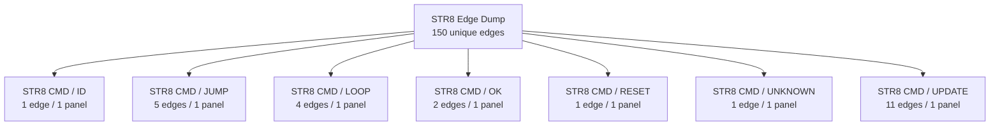

### Family Detail

#### ENTRY / unprefixed


#### STR8 / AP


#### STR8 / ATTACH

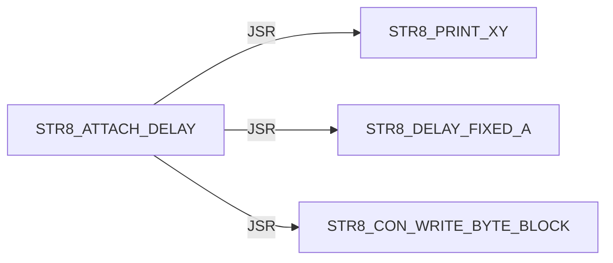

#### STR8 / BOOT

Panel 1 of 2: `STR8_BOOT_INPUT_ARM` through `STR8_BOOT_START`.

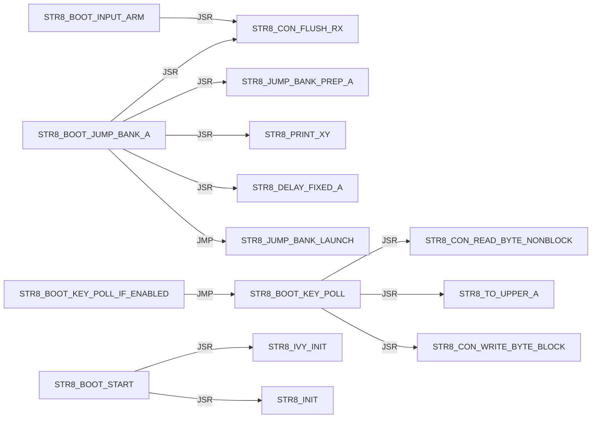

Panel 2 of 2: `STR8_BOOT_START` through `STR8_BOOT_START`.

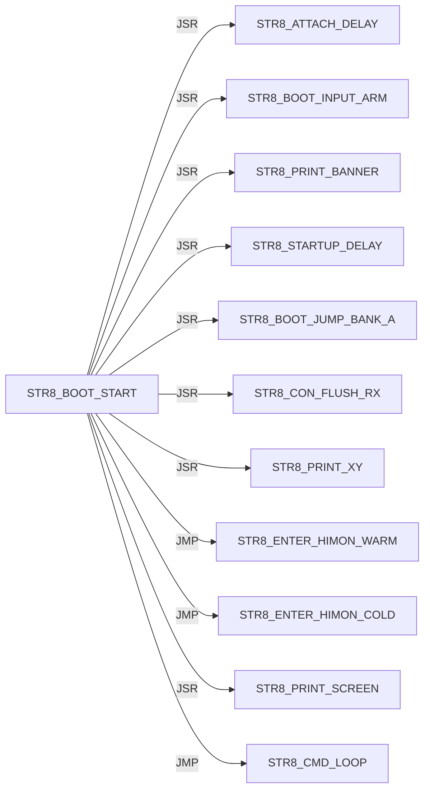

#### STR8 / CON

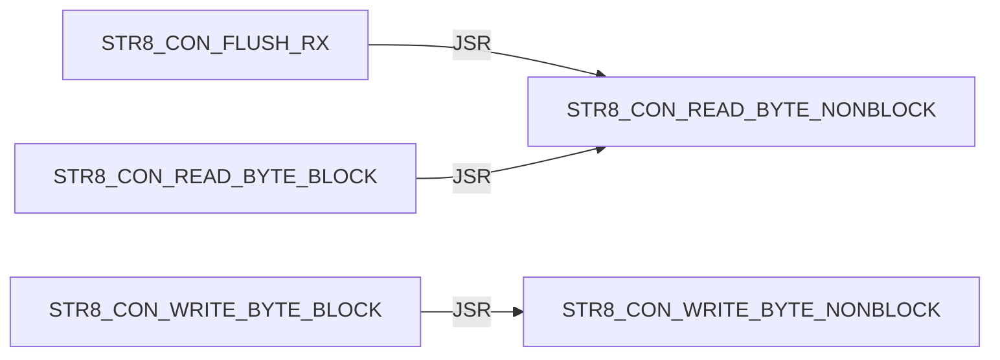

#### STR8 / CONFIRM


#### STR8 / DELAY


#### STR8 / DISPATCH

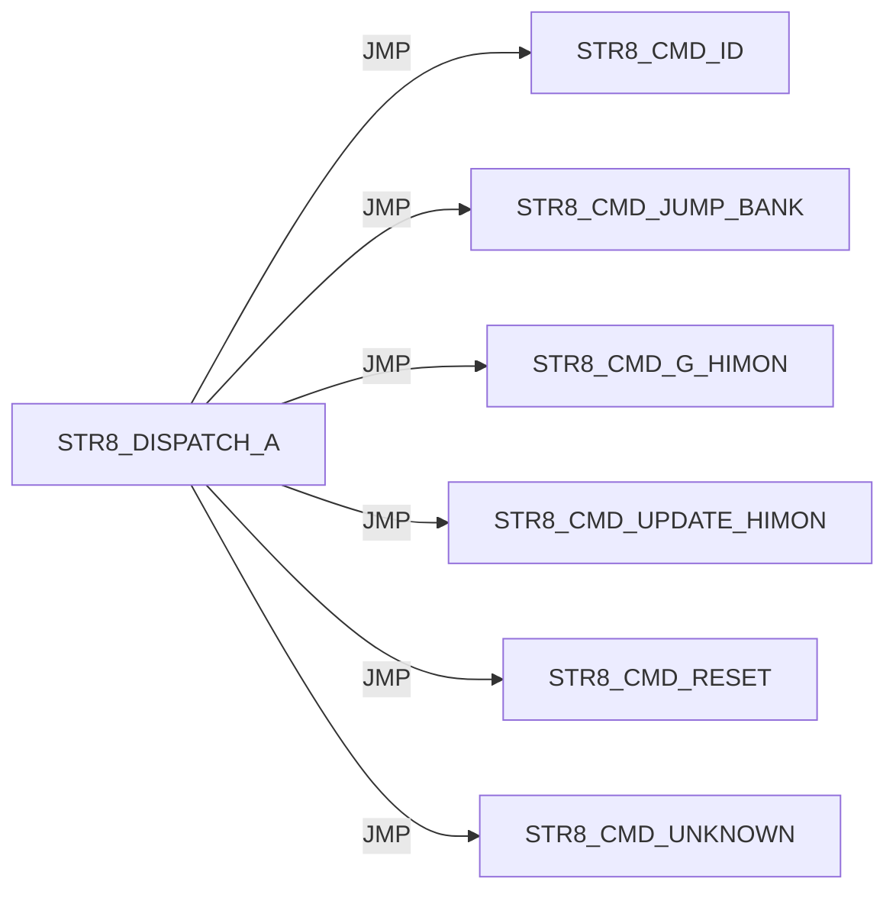

#### STR8 / ENTER

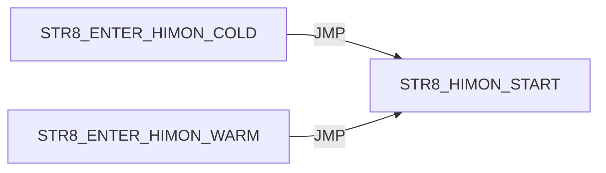

#### STR8 / INIT


#### STR8 / IVY

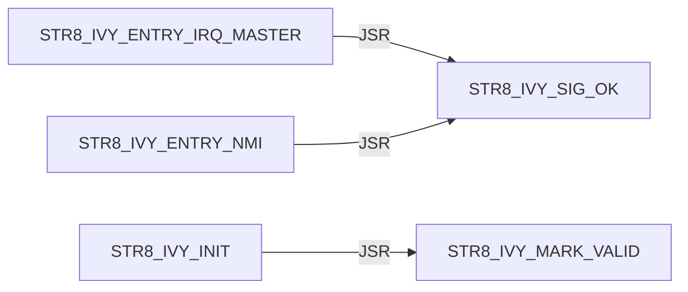

#### STR8 / JUMP

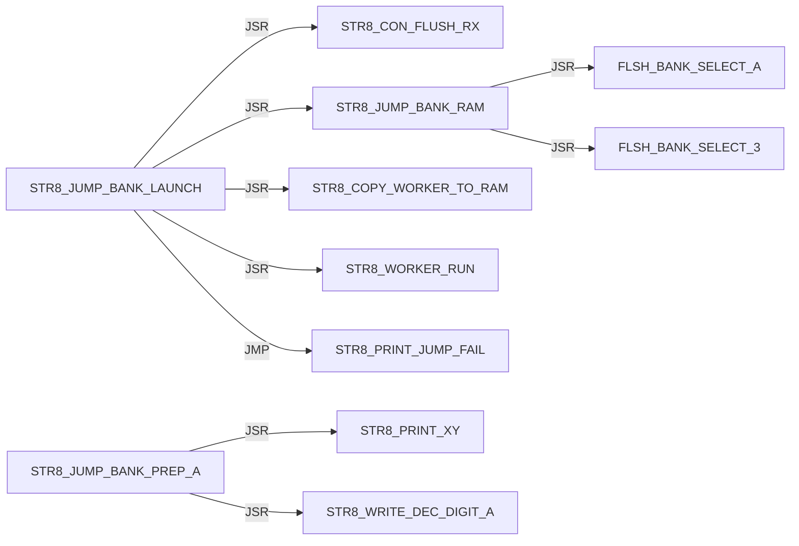

#### STR8 / PRINT

Panel 1 of 2: `STR8_PRINT_BANNER` through `STR8_PRINT_SCREEN`.

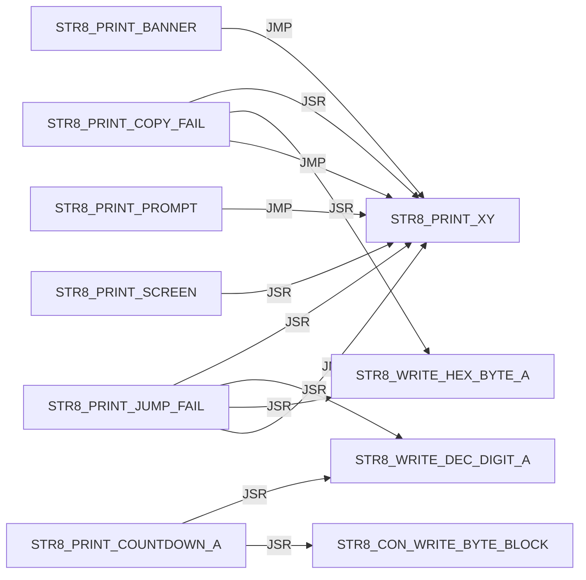

Panel 2 of 2: `STR8_PRINT_SCREEN` through `STR8_PRINT_XY`.

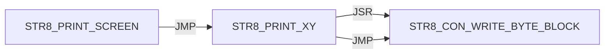

#### STR8 / PROGRAM

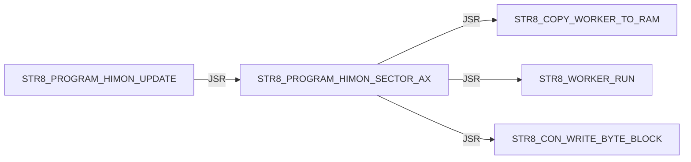

#### STR8 / READ

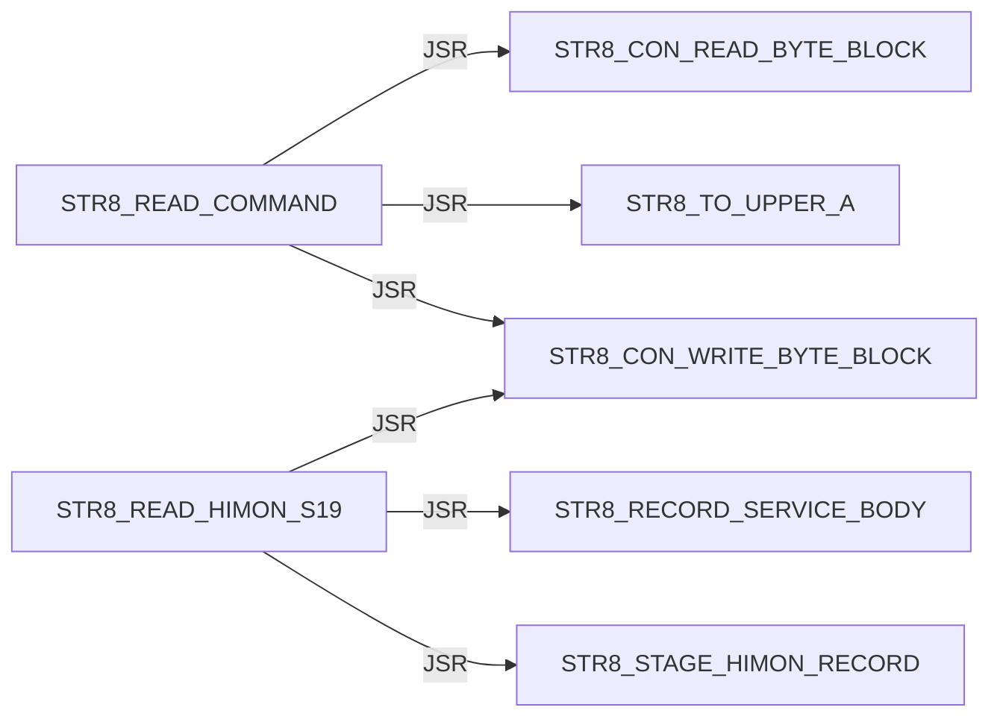

#### STR8 / REC

Panel 1 of 3: `STR8_REC_APPLY_LF` through `STR8_REC_PARSE`.

```mermaid
flowchart LR
    N0["STR8_REC_APPLY_LF"] -->|JSR| N1["STR8_REC_CLEAR_FAILURE"]
    N0["STR8_REC_APPLY_LF"] -->|JMP| N2["STR8_REC_FAIL_A"]
    N0["STR8_REC_APPLY_LF"] -->|JMP| N3["STR8_REC_RETURN_OK"]
    N0["STR8_REC_APPLY_LF"] -->|JSR| N4["STR8_REC_LOAD_APPLY_POINTERS"]
    N0["STR8_REC_APPLY_LF"] -->|JSR| N5["STR8_REC_CAPTURE_APPLY_FAILURE"]
    N0["STR8_REC_APPLY_LF"] -->|JSR| N6["STR8_REC_ADVANCE_APPLY_POINTERS"]
    N0["STR8_REC_APPLY_LF"] -->|JSR| N7["STR8_COPY_WORKER_TO_RAM"]
    N0["STR8_REC_APPLY_LF"] -->|JSR| N8["STR8_WORKER_RUN"]
    N9["STR8_REC_FAIL_READ_X"] -->|JMP| N10["STR8_REC_RETURN_CURRENT_FAIL"]
    N9["STR8_REC_FAIL_READ_X"] -->|JMP| N2["STR8_REC_FAIL_A"]
    N11["STR8_REC_PARSE"] -->|JSR| N12["STR8_REC_CLEAR_RESULT"]
    N11["STR8_REC_PARSE"] -->|JMP| N2["STR8_REC_FAIL_A"]
```

Panel 2 of 3: `STR8_REC_PARSE` through `STR8_REC_READ_HEX_BYTE`.

```mermaid
flowchart LR
    N0["STR8_REC_PARSE"] -->|JSR| N1["STR8_REC_READ_CHAR"]
    N0["STR8_REC_PARSE"] -->|JMP| N2["STR8_REC_FAIL_READ_START"]
    N0["STR8_REC_PARSE"] -->|JMP| N3["STR8_REC_FAIL_READ_TYPE"]
    N4["STR8_REC_PARSE_BODY"] -->|JSR| N5["STR8_REC_READ_SUM_BYTE"]
    N4["STR8_REC_PARSE_BODY"] -->|JMP| N6["STR8_REC_FAIL_READ_HEX"]
    N4["STR8_REC_PARSE_BODY"] -->|JMP| N7["STR8_REC_FAIL_A"]
    N4["STR8_REC_PARSE_BODY"] -->|JSR| N1["STR8_REC_READ_CHAR"]
    N4["STR8_REC_PARSE_BODY"] -->|JMP| N8["STR8_REC_FAIL_READ_END"]
    N4["STR8_REC_PARSE_BODY"] -->|JMP| N9["STR8_REC_RETURN_OK"]
    N1["STR8_REC_READ_CHAR"] -->|JSR| N10["STR8_CON_READ_BYTE_BLOCK"]
    N11["STR8_REC_READ_HEX_BYTE"] -->|JSR| N1["STR8_REC_READ_CHAR"]
    N11["STR8_REC_READ_HEX_BYTE"] -->|JSR| N12["STR8_REC_HEX_ASCII_TO_NIBBLE"]
```

Panel 3 of 3: `STR8_REC_READ_SUM_BYTE` through `STR8_REC_READ_SUM_BYTE`.

```mermaid
flowchart LR
    N0["STR8_REC_READ_SUM_BYTE"] -->|JSR| N1["STR8_REC_READ_HEX_BYTE"]
```

#### STR8 / RECORD

```mermaid
flowchart LR
    N0["STR8_RECORD_SERVICE_BODY"] -->|JMP| N1["STR8_REC_APPLY_LF"]
    N0["STR8_RECORD_SERVICE_BODY"] -->|JMP| N2["STR8_REC_FAIL_A"]
    N3["STR8_RECORD_SERVICE_ENTRY"] -->|JMP| N0["STR8_RECORD_SERVICE_BODY"]
```

#### STR8 / RUN

```mermaid
flowchart LR
    N0["STR8_RUN_WORKER_SERVICE"] -->|JMP| N1["STR8_RUN_WORKER_SERVICE_BODY"]
    N1["STR8_RUN_WORKER_SERVICE_BODY"] -->|JSR| N2["STR8_COPY_WORKER_TO_RAM"]
    N1["STR8_RUN_WORKER_SERVICE_BODY"] -->|JSR| N3["STR8_WORKER_RUN"]
```

#### STR8 / SELECT

```mermaid
flowchart LR
    N0["STR8_SELECT_BANK_3"] -->|JSR| N1["FLSH_BANK_SELECT_3"]
```

#### STR8 / STARTUP

```mermaid
flowchart LR
    N0["STR8_STARTUP_DELAY"] -->|JSR| N1["STR8_PRINT_XY"]
    N0["STR8_STARTUP_DELAY"] -->|JSR| N2["STR8_BOOT_KEY_POLL_IF_ENABLED"]
    N0["STR8_STARTUP_DELAY"] -->|JSR| N3["STR8_PRINT_COUNTDOWN_A"]
    N0["STR8_STARTUP_DELAY"] -->|JSR| N4["STR8_DELAY_COUNTDOWN_TICK_A"]
```

#### STR8 / WRITE

```mermaid
flowchart LR
    N0["STR8_WRITE_DEC_DIGIT_A"] -->|JMP| N1["STR8_CON_WRITE_BYTE_BLOCK"]
    N2["STR8_WRITE_HEX_BYTE_A"] -->|JSR| N3["STR8_WRITE_HEX_NIBBLE_A"]
    N3["STR8_WRITE_HEX_NIBBLE_A"] -->|JMP| N1["STR8_CON_WRITE_BYTE_BLOCK"]
```

#### STR8 CMD / ABORT

```mermaid
flowchart LR
    N0["STR8_CMD_ABORT"] -->|JSR| N1["STR8_SELECT_BANK_3"]
    N0["STR8_CMD_ABORT"] -->|JMP| N2["STR8_PRINT_XY"]
```

#### STR8 CMD / COPY

```mermaid
flowchart LR
    N0["STR8_CMD_COPY_FAIL"] -->|JSR| N1["STR8_SELECT_BANK_3"]
    N0["STR8_CMD_COPY_FAIL"] -->|JMP| N2["STR8_PRINT_COPY_FAIL"]
```

#### STR8 CMD / G

```mermaid
flowchart LR
    N0["STR8_CMD_G_HIMON"] -->|JSR| N1["STR8_SELECT_BANK_3"]
    N0["STR8_CMD_G_HIMON"] -->|JSR| N2["STR8_PRINT_XY"]
    N0["STR8_CMD_G_HIMON"] -->|JMP| N3["STR8_ENTER_HIMON_WARM"]
```

#### STR8 CMD / ID

```mermaid
flowchart LR
    N0["STR8_CMD_ID"] -->|JMP| N1["STR8_PRINT_XY"]
```

#### STR8 CMD / JUMP

```mermaid
flowchart LR
    N0["STR8_CMD_JUMP_BANK"] -->|JSR| N1["STR8_READ_COMMAND"]
    N0["STR8_CMD_JUMP_BANK"] -->|JMP| N2["STR8_CMD_ABORT"]
    N0["STR8_CMD_JUMP_BANK"] -->|JSR| N3["STR8_JUMP_BANK_PREP_A"]
    N0["STR8_CMD_JUMP_BANK"] -->|JMP| N4["STR8_JUMP_BANK_LAUNCH"]
    N0["STR8_CMD_JUMP_BANK"] -->|JMP| N5["STR8_CMD_UNKNOWN"]
```

#### STR8 CMD / LOOP

```mermaid
flowchart LR
    N0["STR8_CMD_LOOP"] -->|JSR| N1["STR8_PRINT_PROMPT"]
    N0["STR8_CMD_LOOP"] -->|JSR| N2["STR8_READ_COMMAND"]
    N0["STR8_CMD_LOOP"] -->|JSR| N3["STR8_CMD_ABORT"]
    N0["STR8_CMD_LOOP"] -->|JSR| N4["STR8_DISPATCH_A"]
```

#### STR8 CMD / OK

```mermaid
flowchart LR
    N0["STR8_CMD_OK"] -->|JSR| N1["STR8_SELECT_BANK_3"]
    N0["STR8_CMD_OK"] -->|JMP| N2["STR8_PRINT_XY"]
```

#### STR8 CMD / RESET

```mermaid
flowchart LR
    N0["STR8_CMD_RESET"] -->|JSR| N1["STR8_SELECT_BANK_3"]
```

#### STR8 CMD / UNKNOWN

```mermaid
flowchart LR
    N0["STR8_CMD_UNKNOWN"] -->|JMP| N1["STR8_PRINT_XY"]
```

#### STR8 CMD / UPDATE

```mermaid
flowchart LR
    N0["STR8_CMD_UPDATE_HIMON"] -->|JMP| N1["STR8_PRINT_XY"]
    N0["STR8_CMD_UPDATE_HIMON"] -->|JSR| N1["STR8_PRINT_XY"]
    N0["STR8_CMD_UPDATE_HIMON"] -->|JSR| N2["STR8_CONFIRM_Y"]
    N0["STR8_CMD_UPDATE_HIMON"] -->|JSR| N3["STR8_STAGE_HIMON_BLANK"]
    N0["STR8_CMD_UPDATE_HIMON"] -->|JSR| N4["STR8_UPD_INIT"]
    N0["STR8_CMD_UPDATE_HIMON"] -->|JSR| N5["STR8_READ_HIMON_S19"]
    N0["STR8_CMD_UPDATE_HIMON"] -->|JSR| N6["STR8_PROGRAM_HIMON_UPDATE"]
    N0["STR8_CMD_UPDATE_HIMON"] -->|JMP| N7["STR8_CMD_OK"]
    N8["STR8_CMD_UPDATE_NO_DATA"] -->|JMP| N1["STR8_PRINT_XY"]
    N9["STR8_CMD_UPDATE_S19_FAIL"] -->|JSR| N10["STR8_CON_FLUSH_RX"]
    N9["STR8_CMD_UPDATE_S19_FAIL"] -->|JMP| N1["STR8_PRINT_XY"]
```

## External Targets

These targets are not labels in this source file; most are `XREF` providers from sibling ROM modules.

```text
FLSH_BANK_SELECT_3
FLSH_BANK_SELECT_A
STR8_HIMON_START
STR8_WORKER_RUN
UTL_DELAY_AXY_8MHZ
```

## Unique Direct Edges By Source Label

Each block is one source label. Indented lines are outgoing direct edges.
Blank lines are source-level breaks; they do not imply call depth.

```text
START
    JMP STR8_BOOT_START

STR8_AP_IMPORT_LINK_SERVICE
    JMP STR8_AP_IMPORT_LINK_SERVICE_BODY

STR8_ATTACH_DELAY
    JSR STR8_PRINT_XY
    JSR STR8_DELAY_FIXED_A
    JSR STR8_CON_WRITE_BYTE_BLOCK

STR8_BOOT_INPUT_ARM
    JSR STR8_CON_FLUSH_RX

STR8_BOOT_JUMP_BANK_A
    JSR STR8_JUMP_BANK_PREP_A
    JSR STR8_CON_FLUSH_RX
    JSR STR8_PRINT_XY
    JSR STR8_DELAY_FIXED_A
    JMP STR8_JUMP_BANK_LAUNCH

STR8_BOOT_KEY_POLL
    JSR STR8_CON_READ_BYTE_NONBLOCK
    JSR STR8_TO_UPPER_A
    JSR STR8_CON_WRITE_BYTE_BLOCK

STR8_BOOT_KEY_POLL_IF_ENABLED
    JMP STR8_BOOT_KEY_POLL

STR8_BOOT_START
    JSR STR8_IVY_INIT
    JSR STR8_INIT
    JSR STR8_ATTACH_DELAY
    JSR STR8_BOOT_INPUT_ARM
    JSR STR8_PRINT_BANNER
    JSR STR8_STARTUP_DELAY
    JSR STR8_BOOT_JUMP_BANK_A
    JSR STR8_CON_FLUSH_RX
    JSR STR8_PRINT_XY
    JMP STR8_ENTER_HIMON_WARM
    JMP STR8_ENTER_HIMON_COLD
    JSR STR8_PRINT_SCREEN
    JMP STR8_CMD_LOOP

STR8_CMD_ABORT
    JSR STR8_SELECT_BANK_3
    JMP STR8_PRINT_XY

STR8_CMD_COPY_FAIL
    JSR STR8_SELECT_BANK_3
    JMP STR8_PRINT_COPY_FAIL

STR8_CMD_G_HIMON
    JSR STR8_SELECT_BANK_3
    JSR STR8_PRINT_XY
    JMP STR8_ENTER_HIMON_WARM

STR8_CMD_ID
    JMP STR8_PRINT_XY

STR8_CMD_JUMP_BANK
    JSR STR8_READ_COMMAND
    JMP STR8_CMD_ABORT
    JSR STR8_JUMP_BANK_PREP_A
    JMP STR8_JUMP_BANK_LAUNCH
    JMP STR8_CMD_UNKNOWN

STR8_CMD_LOOP
    JSR STR8_PRINT_PROMPT
    JSR STR8_READ_COMMAND
    JSR STR8_CMD_ABORT
    JSR STR8_DISPATCH_A

STR8_CMD_OK
    JSR STR8_SELECT_BANK_3
    JMP STR8_PRINT_XY

STR8_CMD_RESET
    JSR STR8_SELECT_BANK_3

STR8_CMD_UNKNOWN
    JMP STR8_PRINT_XY

STR8_CMD_UPDATE_HIMON
    JMP STR8_PRINT_XY
    JSR STR8_PRINT_XY
    JSR STR8_CONFIRM_Y
    JSR STR8_STAGE_HIMON_BLANK
    JSR STR8_UPD_INIT
    JSR STR8_READ_HIMON_S19
    JSR STR8_PROGRAM_HIMON_UPDATE
    JMP STR8_CMD_OK

STR8_CMD_UPDATE_NO_DATA
    JMP STR8_PRINT_XY

STR8_CMD_UPDATE_S19_FAIL
    JSR STR8_CON_FLUSH_RX
    JMP STR8_PRINT_XY

STR8_CON_FLUSH_RX
    JSR STR8_CON_READ_BYTE_NONBLOCK

STR8_CON_READ_BYTE_BLOCK
    JSR STR8_CON_READ_BYTE_NONBLOCK

STR8_CON_WRITE_BYTE_BLOCK
    JSR STR8_CON_WRITE_BYTE_NONBLOCK

STR8_CONFIRM_Y
    JSR STR8_READ_COMMAND

STR8_DELAY_FIXED_A
    JMP UTL_DELAY_AXY_8MHZ

STR8_DISPATCH_A
    JMP STR8_CMD_ID
    JMP STR8_CMD_JUMP_BANK
    JMP STR8_CMD_G_HIMON
    JMP STR8_CMD_UPDATE_HIMON
    JMP STR8_CMD_RESET
    JMP STR8_CMD_UNKNOWN

STR8_ENTER_HIMON_COLD
    JMP STR8_HIMON_START

STR8_ENTER_HIMON_WARM
    JMP STR8_HIMON_START

STR8_INIT
    JMP STR8_CON_INIT

STR8_IVY_ENTRY_IRQ_MASTER
    JSR STR8_IVY_SIG_OK

STR8_IVY_ENTRY_NMI
    JSR STR8_IVY_SIG_OK

STR8_IVY_INIT
    JSR STR8_IVY_MARK_VALID

STR8_JUMP_BANK_LAUNCH
    JSR STR8_CON_FLUSH_RX
    JSR STR8_JUMP_BANK_RAM
    JSR STR8_COPY_WORKER_TO_RAM
    JSR STR8_WORKER_RUN
    JMP STR8_PRINT_JUMP_FAIL

STR8_JUMP_BANK_PREP_A
    JSR STR8_PRINT_XY
    JSR STR8_WRITE_DEC_DIGIT_A

STR8_JUMP_BANK_RAM
    JSR FLSH_BANK_SELECT_A
    JSR FLSH_BANK_SELECT_3

STR8_PRINT_BANNER
    JMP STR8_PRINT_XY

STR8_PRINT_COPY_FAIL
    JSR STR8_PRINT_XY
    JSR STR8_WRITE_HEX_BYTE_A
    JMP STR8_PRINT_XY

STR8_PRINT_COUNTDOWN_A
    JSR STR8_WRITE_DEC_DIGIT_A
    JSR STR8_CON_WRITE_BYTE_BLOCK

STR8_PRINT_JUMP_FAIL
    JSR STR8_PRINT_XY
    JSR STR8_WRITE_DEC_DIGIT_A
    JSR STR8_WRITE_HEX_BYTE_A
    JMP STR8_PRINT_XY

STR8_PRINT_PROMPT
    JMP STR8_PRINT_XY

STR8_PRINT_SCREEN
    JSR STR8_PRINT_XY
    JMP STR8_PRINT_XY

STR8_PRINT_XY
    JSR STR8_CON_WRITE_BYTE_BLOCK
    JMP STR8_CON_WRITE_BYTE_BLOCK

STR8_PROGRAM_HIMON_SECTOR_AX
    JSR STR8_COPY_WORKER_TO_RAM
    JSR STR8_WORKER_RUN
    JSR STR8_CON_WRITE_BYTE_BLOCK

STR8_PROGRAM_HIMON_UPDATE
    JSR STR8_PROGRAM_HIMON_SECTOR_AX

STR8_READ_COMMAND
    JSR STR8_CON_READ_BYTE_BLOCK
    JSR STR8_TO_UPPER_A
    JSR STR8_CON_WRITE_BYTE_BLOCK

STR8_READ_HIMON_S19
    JSR STR8_RECORD_SERVICE_BODY
    JSR STR8_STAGE_HIMON_RECORD
    JSR STR8_CON_WRITE_BYTE_BLOCK

STR8_REC_APPLY_LF
    JSR STR8_REC_CLEAR_FAILURE
    JMP STR8_REC_FAIL_A
    JMP STR8_REC_RETURN_OK
    JSR STR8_REC_LOAD_APPLY_POINTERS
    JSR STR8_REC_CAPTURE_APPLY_FAILURE
    JSR STR8_REC_ADVANCE_APPLY_POINTERS
    JSR STR8_COPY_WORKER_TO_RAM
    JSR STR8_WORKER_RUN

STR8_REC_FAIL_READ_X
    JMP STR8_REC_RETURN_CURRENT_FAIL
    JMP STR8_REC_FAIL_A

STR8_REC_PARSE
    JSR STR8_REC_CLEAR_RESULT
    JMP STR8_REC_FAIL_A
    JSR STR8_REC_READ_CHAR
    JMP STR8_REC_FAIL_READ_START
    JMP STR8_REC_FAIL_READ_TYPE

STR8_REC_PARSE_BODY
    JSR STR8_REC_READ_SUM_BYTE
    JMP STR8_REC_FAIL_READ_HEX
    JMP STR8_REC_FAIL_A
    JSR STR8_REC_READ_CHAR
    JMP STR8_REC_FAIL_READ_END
    JMP STR8_REC_RETURN_OK

STR8_REC_READ_CHAR
    JSR STR8_CON_READ_BYTE_BLOCK

STR8_REC_READ_HEX_BYTE
    JSR STR8_REC_READ_CHAR
    JSR STR8_REC_HEX_ASCII_TO_NIBBLE

STR8_REC_READ_SUM_BYTE
    JSR STR8_REC_READ_HEX_BYTE

STR8_RECORD_SERVICE_BODY
    JMP STR8_REC_APPLY_LF
    JMP STR8_REC_FAIL_A

STR8_RECORD_SERVICE_ENTRY
    JMP STR8_RECORD_SERVICE_BODY

STR8_RUN_WORKER_SERVICE
    JMP STR8_RUN_WORKER_SERVICE_BODY

STR8_RUN_WORKER_SERVICE_BODY
    JSR STR8_COPY_WORKER_TO_RAM
    JSR STR8_WORKER_RUN

STR8_SELECT_BANK_3
    JSR FLSH_BANK_SELECT_3

STR8_STARTUP_DELAY
    JSR STR8_PRINT_XY
    JSR STR8_BOOT_KEY_POLL_IF_ENABLED
    JSR STR8_PRINT_COUNTDOWN_A
    JSR STR8_DELAY_COUNTDOWN_TICK_A

STR8_WRITE_DEC_DIGIT_A
    JMP STR8_CON_WRITE_BYTE_BLOCK

STR8_WRITE_HEX_BYTE_A
    JSR STR8_WRITE_HEX_NIBBLE_A

STR8_WRITE_HEX_NIBBLE_A
    JMP STR8_CON_WRITE_BYTE_BLOCK

```

## Raw Direct Edge Sites By Source Label

Each line is a direct call/jump site with source line number.

```text
START
      146  JMP STR8_BOOT_START

STR8_AP_IMPORT_LINK_SERVICE
      154  JMP STR8_AP_IMPORT_LINK_SERVICE_BODY

STR8_ATTACH_DELAY
      338  JSR STR8_PRINT_XY
      348  JSR STR8_DELAY_FIXED_A
      350  JSR STR8_CON_WRITE_BYTE_BLOCK

STR8_BOOT_INPUT_ARM
      215  JSR STR8_CON_FLUSH_RX

STR8_BOOT_JUMP_BANK_A
      642  JSR STR8_JUMP_BANK_PREP_A
      643  JSR STR8_CON_FLUSH_RX
      646  JSR STR8_PRINT_XY
      648  JSR STR8_DELAY_FIXED_A
      649  JMP STR8_JUMP_BANK_LAUNCH

STR8_BOOT_KEY_POLL
      424  JSR STR8_CON_READ_BYTE_NONBLOCK
      426  JSR STR8_TO_UPPER_A
      427  JSR STR8_CON_WRITE_BYTE_BLOCK

STR8_BOOT_KEY_POLL_IF_ENABLED
      399  JMP STR8_BOOT_KEY_POLL

STR8_BOOT_START
      172  JSR STR8_IVY_INIT
      173  JSR STR8_INIT
      176  JSR STR8_ATTACH_DELAY
      177  JSR STR8_BOOT_INPUT_ARM
      178  JSR STR8_PRINT_BANNER
      179  JSR STR8_STARTUP_DELAY
      186  JSR STR8_BOOT_JUMP_BANK_A
      188  JSR STR8_CON_FLUSH_RX
      191  JSR STR8_PRINT_XY
      192  JMP STR8_ENTER_HIMON_WARM
      196  JSR STR8_PRINT_XY
      197  JMP STR8_ENTER_HIMON_COLD
      198  JSR STR8_CON_FLUSH_RX
      202  JSR STR8_PRINT_SCREEN
      203  JMP STR8_CMD_LOOP

STR8_CMD_ABORT
      622  JSR STR8_SELECT_BANK_3
      626  JMP STR8_PRINT_XY

STR8_CMD_COPY_FAIL
      630  JSR STR8_SELECT_BANK_3
      632  JMP STR8_PRINT_COPY_FAIL

STR8_CMD_G_HIMON
      594  JSR STR8_SELECT_BANK_3
      597  JSR STR8_PRINT_XY
      598  JMP STR8_ENTER_HIMON_WARM
      602  JSR STR8_PRINT_XY
      603  JMP STR8_ENTER_HIMON_WARM

STR8_CMD_ID
      526  JMP STR8_PRINT_XY

STR8_CMD_JUMP_BANK
      532  JSR STR8_READ_COMMAND
      535  JMP STR8_CMD_ABORT
      544  JSR STR8_JUMP_BANK_PREP_A
      545  JMP STR8_JUMP_BANK_LAUNCH
      547  JMP STR8_CMD_UNKNOWN

STR8_CMD_LOOP
      451  JSR STR8_PRINT_PROMPT
      452  JSR STR8_READ_COMMAND
      455  JSR STR8_CMD_ABORT
      458  JSR STR8_DISPATCH_A

STR8_CMD_OK
      614  JSR STR8_SELECT_BANK_3
      618  JMP STR8_PRINT_XY

STR8_CMD_RESET
      608  JSR STR8_SELECT_BANK_3

STR8_CMD_UNKNOWN
      637  JMP STR8_PRINT_XY

STR8_CMD_UPDATE_HIMON
      554  JMP STR8_PRINT_XY
      558  JSR STR8_PRINT_XY
      559  JSR STR8_CONFIRM_Y
      561  JSR STR8_STAGE_HIMON_BLANK
      562  JSR STR8_UPD_INIT
      565  JSR STR8_PRINT_XY
      566  JSR STR8_READ_HIMON_S19
      572  JSR STR8_PRINT_XY
      573  JSR STR8_CONFIRM_Y
      575  JSR STR8_PROGRAM_HIMON_UPDATE
      577  JMP STR8_CMD_OK

STR8_CMD_UPDATE_NO_DATA
      589  JMP STR8_PRINT_XY

STR8_CMD_UPDATE_S19_FAIL
      581  JSR STR8_CON_FLUSH_RX
      584  JMP STR8_PRINT_XY

STR8_CON_FLUSH_RX
     1514  JSR STR8_CON_READ_BYTE_NONBLOCK

STR8_CON_READ_BYTE_BLOCK
     1528  JSR STR8_CON_READ_BYTE_NONBLOCK

STR8_CON_WRITE_BYTE_BLOCK
     1554  JSR STR8_CON_WRITE_BYTE_NONBLOCK

STR8_CONFIRM_Y
     1176  JSR STR8_READ_COMMAND

STR8_DELAY_FIXED_A
      358  JMP UTL_DELAY_AXY_8MHZ

STR8_DISPATCH_A
      503  JMP STR8_CMD_ID
      507  JMP STR8_CMD_JUMP_BANK
      511  JMP STR8_CMD_G_HIMON
      515  JMP STR8_CMD_UPDATE_HIMON
      519  JMP STR8_CMD_RESET
      521  JMP STR8_CMD_UNKNOWN

STR8_ENTER_HIMON_COLD
      319  JMP STR8_HIMON_START

STR8_ENTER_HIMON_WARM
      330  JMP STR8_HIMON_START

STR8_INIT
      212  JMP STR8_CON_INIT

STR8_IVY_ENTRY_IRQ_MASTER
      291  JSR STR8_IVY_SIG_OK
      302  JSR STR8_IVY_SIG_OK

STR8_IVY_ENTRY_NMI
      274  JSR STR8_IVY_SIG_OK

STR8_IVY_INIT
      245  JSR STR8_IVY_MARK_VALID

STR8_JUMP_BANK_LAUNCH
      668  JSR STR8_CON_FLUSH_RX
      672  JSR STR8_JUMP_BANK_RAM
      674  JSR STR8_COPY_WORKER_TO_RAM
      675  JSR STR8_WORKER_RUN
      677  JMP STR8_PRINT_JUMP_FAIL

STR8_JUMP_BANK_PREP_A
      659  JSR STR8_PRINT_XY
      661  JSR STR8_WRITE_DEC_DIGIT_A
      664  JSR STR8_PRINT_XY

STR8_JUMP_BANK_RAM
     1436  JSR FLSH_BANK_SELECT_A
     1473  JSR FLSH_BANK_SELECT_3

STR8_PRINT_BANNER
      363  JMP STR8_PRINT_XY

STR8_PRINT_COPY_FAIL
     1371  JSR STR8_PRINT_XY
     1373  JSR STR8_WRITE_HEX_BYTE_A
     1375  JSR STR8_WRITE_HEX_BYTE_A
     1378  JMP STR8_PRINT_XY
     1382  JMP STR8_PRINT_XY

STR8_PRINT_COUNTDOWN_A
      405  JSR STR8_WRITE_DEC_DIGIT_A
      410  JSR STR8_CON_WRITE_BYTE_BLOCK

STR8_PRINT_JUMP_FAIL
     1388  JSR STR8_PRINT_XY
     1390  JSR STR8_WRITE_DEC_DIGIT_A
     1393  JSR STR8_PRINT_XY
     1395  JSR STR8_WRITE_HEX_BYTE_A
     1397  JSR STR8_WRITE_HEX_BYTE_A
     1400  JMP STR8_PRINT_XY

STR8_PRINT_PROMPT
     1485  JMP STR8_PRINT_XY

STR8_PRINT_SCREEN
      445  JSR STR8_PRINT_XY
      448  JMP STR8_PRINT_XY

STR8_PRINT_XY
     1493  JSR STR8_CON_WRITE_BYTE_BLOCK
     1499  JMP STR8_CON_WRITE_BYTE_BLOCK

STR8_PROGRAM_HIMON_SECTOR_AX
     1355  JSR STR8_COPY_WORKER_TO_RAM
     1356  JSR STR8_WORKER_RUN
     1359  JSR STR8_CON_WRITE_BYTE_BLOCK

STR8_PROGRAM_HIMON_UPDATE
     1332  JSR STR8_PROGRAM_HIMON_SECTOR_AX
     1336  JSR STR8_PROGRAM_HIMON_SECTOR_AX
     1340  JSR STR8_PROGRAM_HIMON_SECTOR_AX

STR8_READ_COMMAND
      466  JSR STR8_CON_READ_BYTE_BLOCK
      481  JSR STR8_TO_UPPER_A
      482  JSR STR8_CON_WRITE_BYTE_BLOCK

STR8_READ_HIMON_S19
     1257  JSR STR8_RECORD_SERVICE_BODY
     1268  JSR STR8_STAGE_HIMON_RECORD
     1271  JSR STR8_CON_WRITE_BYTE_BLOCK

STR8_REC_APPLY_LF
      906  JSR STR8_REC_CLEAR_FAILURE
      911  JMP STR8_REC_FAIL_A
      917  JMP STR8_REC_FAIL_A
      922  JMP STR8_REC_FAIL_A
      932  JMP STR8_REC_FAIL_A
      938  JMP STR8_REC_FAIL_A
      942  JMP STR8_REC_RETURN_OK
      961  JMP STR8_REC_FAIL_A
      968  JMP STR8_REC_FAIL_A
      971  JSR STR8_REC_LOAD_APPLY_POINTERS
      980  JSR STR8_REC_CAPTURE_APPLY_FAILURE
      982  JMP STR8_REC_FAIL_A
      984  JSR STR8_REC_ADVANCE_APPLY_POINTERS
      991  JMP STR8_REC_FAIL_A
      997  JSR STR8_COPY_WORKER_TO_RAM
      998  JSR STR8_WORKER_RUN
     1007  JMP STR8_REC_FAIL_A
     1011  JSR STR8_REC_LOAD_APPLY_POINTERS
     1018  JSR STR8_REC_CAPTURE_APPLY_FAILURE
     1020  JMP STR8_REC_FAIL_A
     1022  JSR STR8_REC_ADVANCE_APPLY_POINTERS
     1025  JMP STR8_REC_RETURN_OK

STR8_REC_FAIL_READ_X
      900  JMP STR8_REC_RETURN_CURRENT_FAIL
      903  JMP STR8_REC_FAIL_A

STR8_REC_PARSE
      712  JSR STR8_REC_CLEAR_RESULT
      717  JMP STR8_REC_FAIL_A
      723  JMP STR8_REC_FAIL_A
      747  JMP STR8_REC_FAIL_A
      750  JSR STR8_REC_READ_CHAR
      752  JMP STR8_REC_FAIL_READ_START
      760  JSR STR8_REC_READ_CHAR
      762  JMP STR8_REC_FAIL_READ_START
      768  JMP STR8_REC_FAIL_A
      770  JSR STR8_REC_READ_CHAR
      772  JMP STR8_REC_FAIL_READ_TYPE
      782  JMP STR8_REC_FAIL_A

STR8_REC_PARSE_BODY
      786  JSR STR8_REC_READ_SUM_BYTE
      788  JMP STR8_REC_FAIL_READ_HEX
      794  JMP STR8_REC_FAIL_A
      803  JMP STR8_REC_FAIL_A
      805  JSR STR8_REC_READ_SUM_BYTE
      807  JMP STR8_REC_FAIL_READ_HEX
      810  JSR STR8_REC_READ_SUM_BYTE
      812  JMP STR8_REC_FAIL_READ_HEX
      824  JSR STR8_REC_READ_SUM_BYTE
      826  JMP STR8_REC_FAIL_READ_HEX
      833  JSR STR8_REC_READ_SUM_BYTE
      835  JMP STR8_REC_FAIL_READ_HEX
      841  JMP STR8_REC_FAIL_A
      849  JMP STR8_REC_FAIL_A
      851  JSR STR8_REC_READ_CHAR
      853  JMP STR8_REC_FAIL_READ_END
      860  JMP STR8_REC_FAIL_A
      873  JMP STR8_REC_RETURN_OK
      883  JMP STR8_REC_RETURN_OK

STR8_REC_READ_CHAR
     1131  JSR STR8_CON_READ_BYTE_BLOCK

STR8_REC_READ_HEX_BYTE
     1089  JSR STR8_REC_READ_CHAR
     1091  JSR STR8_REC_HEX_ASCII_TO_NIBBLE
     1098  JSR STR8_REC_READ_CHAR
     1100  JSR STR8_REC_HEX_ASCII_TO_NIBBLE

STR8_REC_READ_SUM_BYTE
     1077  JSR STR8_REC_READ_HEX_BYTE

STR8_RECORD_SERVICE_BODY
      706  JMP STR8_REC_APPLY_LF
      709  JMP STR8_REC_FAIL_A

STR8_RECORD_SERVICE_ENTRY
      157  JMP STR8_RECORD_SERVICE_BODY

STR8_RUN_WORKER_SERVICE
      151  JMP STR8_RUN_WORKER_SERVICE_BODY

STR8_RUN_WORKER_SERVICE_BODY
      684  JSR STR8_COPY_WORKER_TO_RAM
      685  JSR STR8_WORKER_RUN

STR8_SELECT_BANK_3
     1171  JSR FLSH_BANK_SELECT_3

STR8_STARTUP_DELAY
      371  JSR STR8_PRINT_XY
      375  JSR STR8_BOOT_KEY_POLL_IF_ENABLED
      379  JSR STR8_PRINT_COUNTDOWN_A
      382  JSR STR8_DELAY_COUNTDOWN_TICK_A
      383  JSR STR8_BOOT_KEY_POLL_IF_ENABLED

STR8_WRITE_DEC_DIGIT_A
     1406  JMP STR8_CON_WRITE_BYTE_BLOCK

STR8_WRITE_HEX_BYTE_A
     1414  JSR STR8_WRITE_HEX_NIBBLE_A

STR8_WRITE_HEX_NIBBLE_A
     1422  JMP STR8_CON_WRITE_BYTE_BLOCK
     1425  JMP STR8_CON_WRITE_BYTE_BLOCK

```
