# STR8 Edge Dump

Generated-style edge dump for `STR8/str8.asm`.

For the readable subsystem/capability view, see
[STR8.md](STR8.md).

Scope: direct `JSR target` and `JMP target` edges only. Relative branches, fallthrough, data labels, indirect calls, and computed jumps are not included. Source is the nearest preceding global label.

## Summary

```text
source file:     STR8/str8.asm
global labels:   180
raw call sites:  328
unique edges:    247
external targets:6
```

## Mermaid Direct-Edge Atlas

Every unique direct edge is present in this atlas. Source routines are grouped by command/subsystem stem, then split into independent Mermaid panels of at most 12 edges. The text sections below remain the complete audit-oriented evidence.

### Family Overview (part 1 of 3)


### Family Overview (part 2 of 3)

```mermaid
flowchart TD
    EDGE_ATLAS_ROOT_1["STR8 Edge Dump<br/>247 unique edges"] --> EDGE_FAMILY_1_0["STR8 / PRINT<br/>12 edges / 1 panel"]
    EDGE_ATLAS_ROOT_1["STR8 Edge Dump<br/>247 unique edges"] --> EDGE_FAMILY_1_1["STR8 / PROGRAM<br/>4 edges / 1 panel"]
    EDGE_ATLAS_ROOT_1["STR8 Edge Dump<br/>247 unique edges"] --> EDGE_FAMILY_1_2["STR8 / READ<br/>12 edges / 1 panel"]
    EDGE_ATLAS_ROOT_1["STR8 Edge Dump<br/>247 unique edges"] --> EDGE_FAMILY_1_3["STR8 / REC<br/>24 edges / 2 panels"]
    EDGE_ATLAS_ROOT_1["STR8 Edge Dump<br/>247 unique edges"] --> EDGE_FAMILY_1_4["STR8 / RECORD<br/>3 edges / 1 panel"]
    EDGE_ATLAS_ROOT_1["STR8 Edge Dump<br/>247 unique edges"] --> EDGE_FAMILY_1_5["STR8 / RUN<br/>5 edges / 1 panel"]
    EDGE_ATLAS_ROOT_1["STR8 Edge Dump<br/>247 unique edges"] --> EDGE_FAMILY_1_6["STR8 / SELECT<br/>1 edge / 1 panel"]
    EDGE_ATLAS_ROOT_1["STR8 Edge Dump<br/>247 unique edges"] --> EDGE_FAMILY_1_7["STR8 / STARTUP<br/>7 edges / 1 panel"]
    EDGE_ATLAS_ROOT_1["STR8 Edge Dump<br/>247 unique edges"] --> EDGE_FAMILY_1_8["STR8 / WRITE<br/>3 edges / 1 panel"]
    EDGE_ATLAS_ROOT_1["STR8 Edge Dump<br/>247 unique edges"] --> EDGE_FAMILY_1_9["STR8 CMD / ABORT<br/>3 edges / 1 panel"]
    EDGE_ATLAS_ROOT_1["STR8 Edge Dump<br/>247 unique edges"] --> EDGE_FAMILY_1_10["STR8 CMD / COPY<br/>2 edges / 1 panel"]
    EDGE_ATLAS_ROOT_1["STR8 Edge Dump<br/>247 unique edges"] --> EDGE_FAMILY_1_11["STR8 CMD / INSTALL<br/>13 edges / 2 panels"]
```

### Family Overview (part 3 of 3)

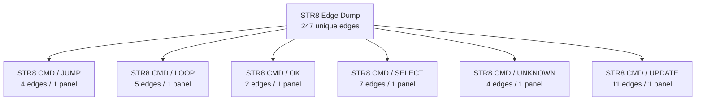

### Family Detail

#### ENTRY / unprefixed


#### STR8 / BANK

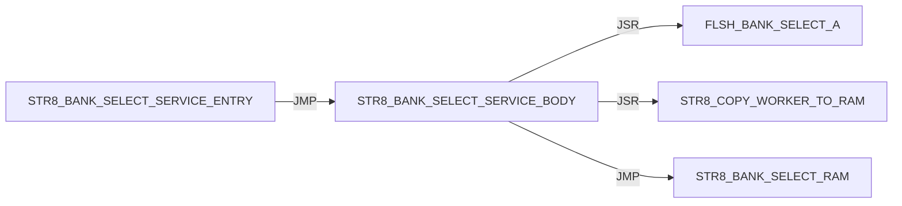

#### STR8 / BOOT

Panel 1 of 2: `STR8_BOOT_JUMP_BANK_A` through `STR8_BOOT_START`.

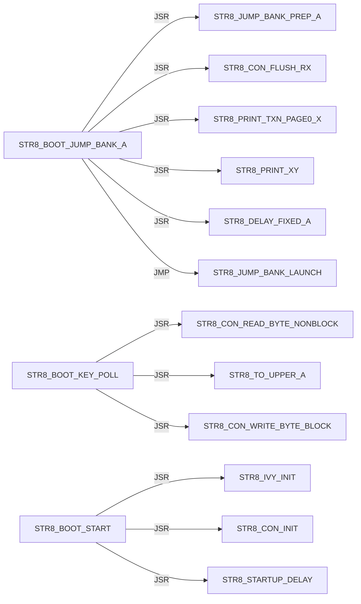

Panel 2 of 2: `STR8_BOOT_START` through `STR8_BOOT_START`.

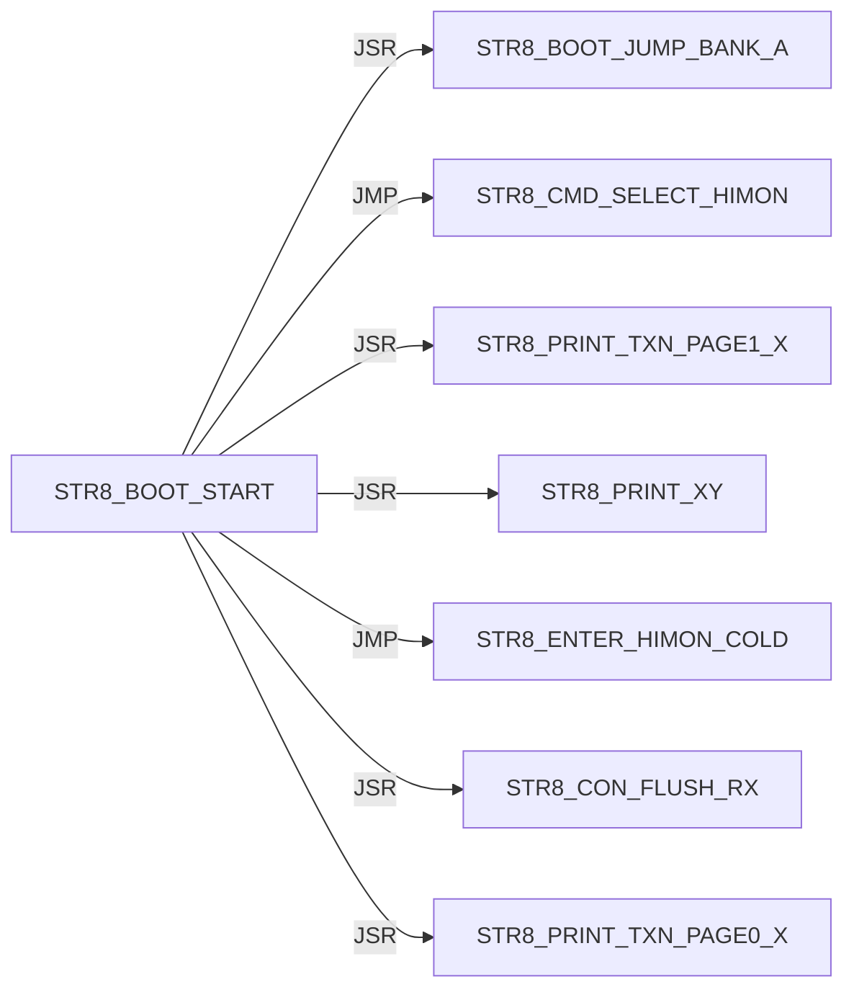

#### STR8 / CON

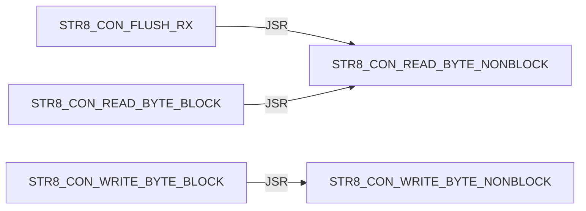

#### STR8 / CONFIRM

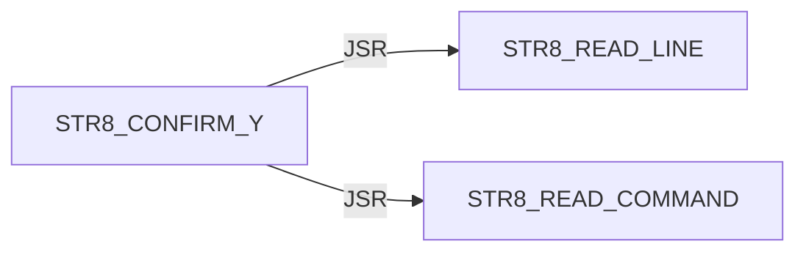

#### STR8 / DELAY


#### STR8 / DIR

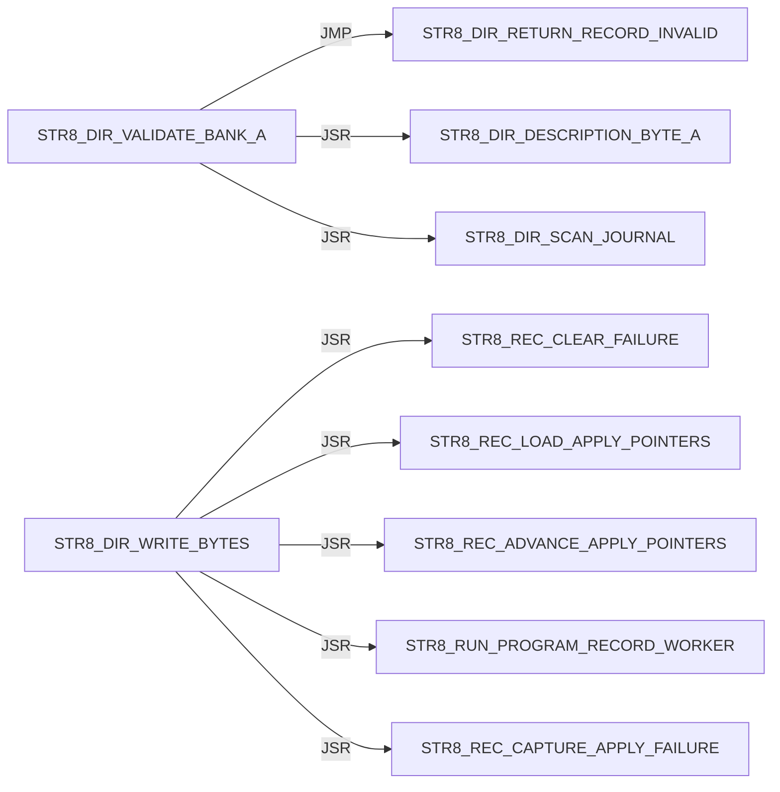

#### STR8 / DISPATCH

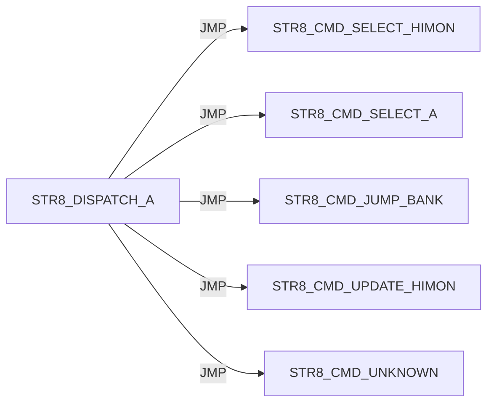

#### STR8 / ENTER

Panel 1 of 2: `STR8_ENTER_HIMON_COLD` through `STR8_ENTER_MENU_NO_TARGET_PRINT`.

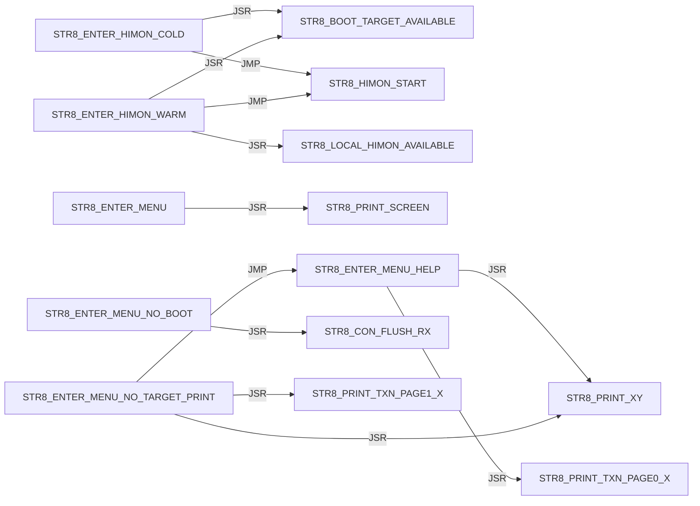

Panel 2 of 2: `STR8_ENTER_MENU_READY` through `STR8_ENTER_MENU_READY`.


#### STR8 / I

Panel 1 of 5: `STR8_I_BEGIN_TRANSACTION` through `STR8_I_PRINT_SUMMARY`.

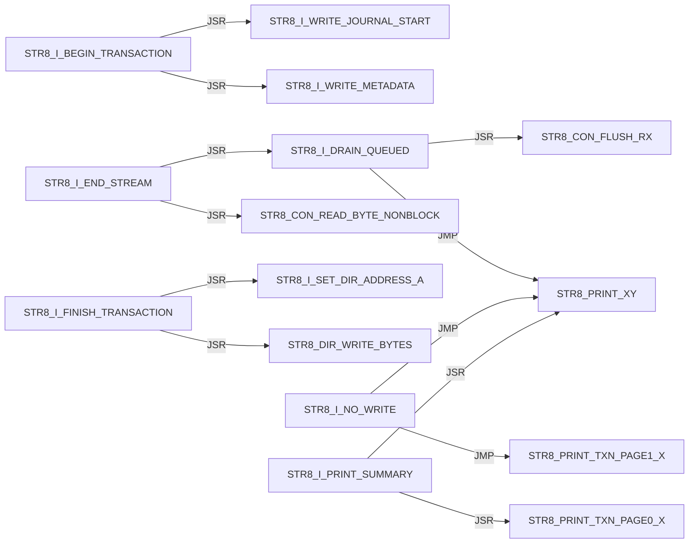

Panel 2 of 5: `STR8_I_PRINT_SUMMARY` through `STR8_I_PRINT_TRANSACTION_FAIL`.

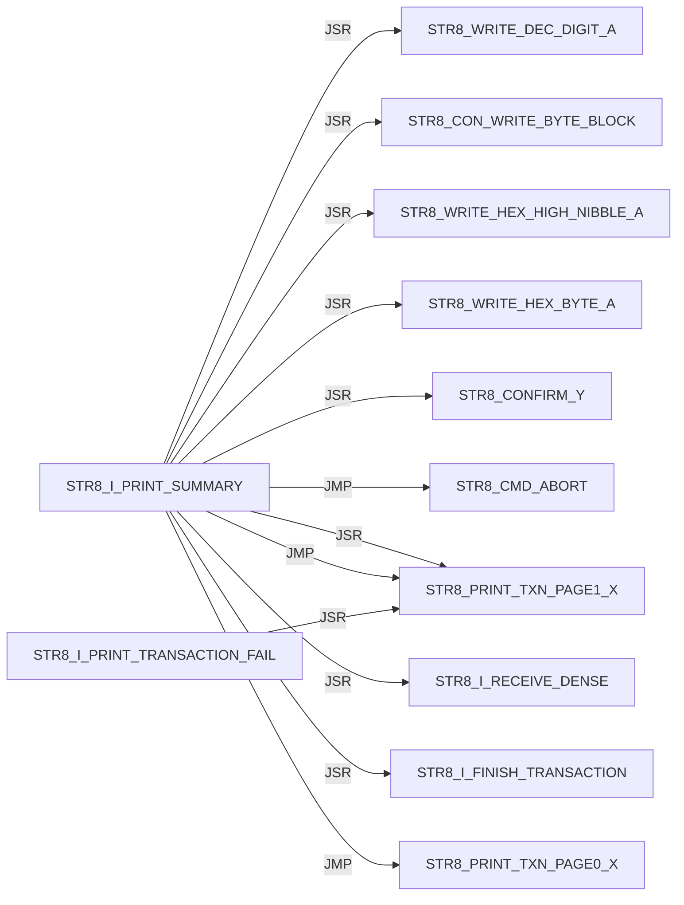

Panel 3 of 5: `STR8_I_PRINT_TRANSACTION_FAIL` through `STR8_I_READ_TYPE`.

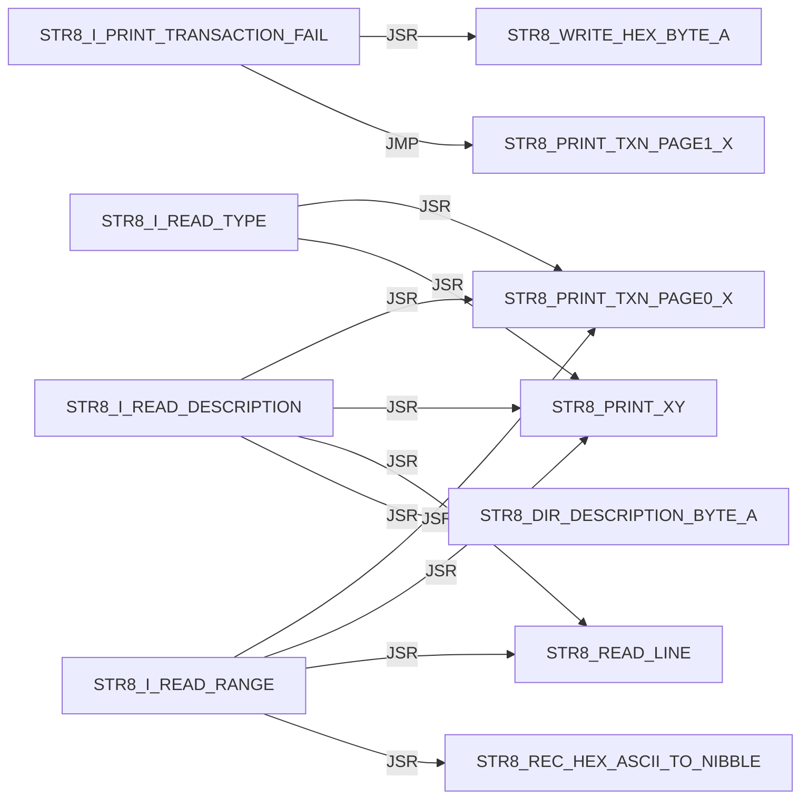

Panel 4 of 5: `STR8_I_READ_TYPE` through `STR8_I_RECEIVE_DENSE`.

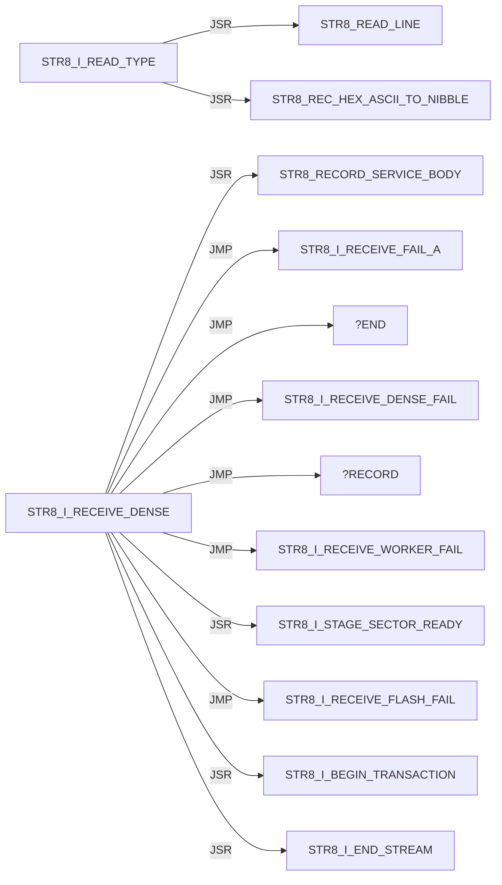

Panel 5 of 5: `STR8_I_RECEIVE_FAIL_A` through `STR8_I_WRITE_METADATA`.

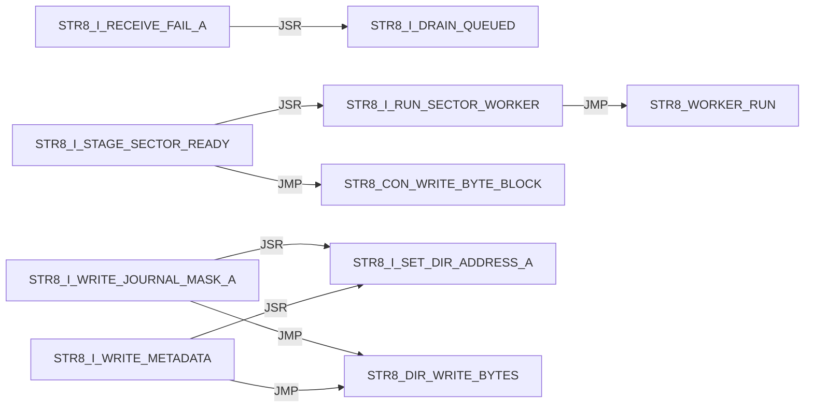

#### STR8 / IVY

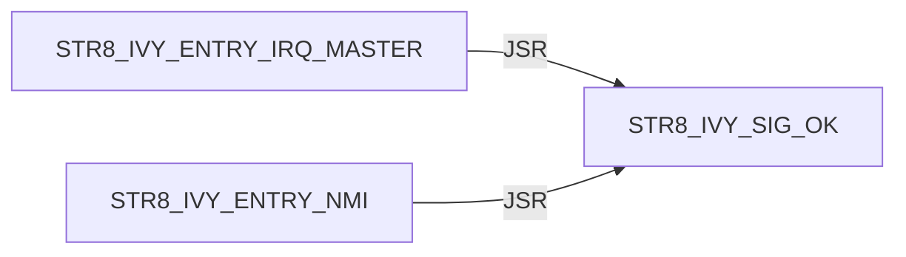

#### STR8 / JUMP

```mermaid
flowchart LR
    N0["STR8_JUMP_BANK_LAUNCH"] -->|JSR| N1["STR8_DIR_VALIDATE_BANK_A"]
    N0["STR8_JUMP_BANK_LAUNCH"] -->|JMP| N2["STR8_PRINT_JUMP_FAIL"]
    N0["STR8_JUMP_BANK_LAUNCH"] -->|JSR| N3["STR8_CON_FLUSH_RX"]
    N0["STR8_JUMP_BANK_LAUNCH"] -->|JSR| N4["STR8_JUMP_BANK_RAM"]
    N0["STR8_JUMP_BANK_LAUNCH"] -->|JSR| N5["STR8_COPY_WORKER_TO_RAM"]
    N0["STR8_JUMP_BANK_LAUNCH"] -->|JSR| N6["STR8_WORKER_RUN"]
    N7["STR8_JUMP_BANK_PREP_A"] -->|JSR| N8["STR8_PRINT_TXN_PAGE1_X"]
    N7["STR8_JUMP_BANK_PREP_A"] -->|JSR| N9["STR8_PRINT_XY"]
    N7["STR8_JUMP_BANK_PREP_A"] -->|JSR| N10["STR8_WRITE_DEC_DIGIT_A"]
    N4["STR8_JUMP_BANK_RAM"] -->|JSR| N11["FLSH_BANK_SELECT_A"]
    N4["STR8_JUMP_BANK_RAM"] -->|JSR| N12["FLSH_BANK_SELECT_3"]
```

#### STR8 / PRINT

```mermaid
flowchart LR
    N0["STR8_PRINT_COPY_FAIL"] -->|JSR| N1["STR8_PRINT_XY"]
    N0["STR8_PRINT_COPY_FAIL"] -->|JSR| N2["STR8_WRITE_HEX_BYTE_A"]
    N0["STR8_PRINT_COPY_FAIL"] -->|JMP| N1["STR8_PRINT_XY"]
    N3["STR8_PRINT_JUMP_FAIL"] -->|JSR| N4["STR8_PRINT_TXN_PAGE1_X"]
    N3["STR8_PRINT_JUMP_FAIL"] -->|JSR| N1["STR8_PRINT_XY"]
    N3["STR8_PRINT_JUMP_FAIL"] -->|JSR| N5["STR8_WRITE_DEC_DIGIT_A"]
    N3["STR8_PRINT_JUMP_FAIL"] -->|JSR| N2["STR8_WRITE_HEX_BYTE_A"]
    N3["STR8_PRINT_JUMP_FAIL"] -->|JMP| N1["STR8_PRINT_XY"]
    N6["STR8_PRINT_PROMPT"] -->|JMP| N1["STR8_PRINT_XY"]
    N7["STR8_PRINT_SCREEN"] -->|JSR| N1["STR8_PRINT_XY"]
    N7["STR8_PRINT_SCREEN"] -->|JMP| N1["STR8_PRINT_XY"]
    N1["STR8_PRINT_XY"] -->|JSR| N8["STR8_CON_WRITE_BYTE_BLOCK"]
```

#### STR8 / PROGRAM

```mermaid
flowchart LR
    N0["STR8_PROGRAM_HIMON_SECTOR_AX"] -->|JSR| N1["STR8_COPY_WORKER_TO_RAM"]
    N0["STR8_PROGRAM_HIMON_SECTOR_AX"] -->|JSR| N2["STR8_WORKER_RUN"]
    N0["STR8_PROGRAM_HIMON_SECTOR_AX"] -->|JSR| N3["STR8_CON_WRITE_BYTE_BLOCK"]
    N4["STR8_PROGRAM_HIMON_UPDATE"] -->|JSR| N0["STR8_PROGRAM_HIMON_SECTOR_AX"]
```

#### STR8 / READ

```mermaid
flowchart LR
    N0["STR8_READ_COMMAND"] -->|JSR| N1["STR8_CON_READ_BYTE_BLOCK"]
    N0["STR8_READ_COMMAND"] -->|JSR| N2["STR8_TO_UPPER_A"]
    N0["STR8_READ_COMMAND"] -->|JSR| N3["STR8_CON_WRITE_BYTE_BLOCK"]
    N4["STR8_READ_HIMON_S19"] -->|JSR| N5["STR8_RECORD_SERVICE_BODY"]
    N4["STR8_READ_HIMON_S19"] -->|JSR| N6["STR8_STAGE_HIMON_RECORD"]
    N4["STR8_READ_HIMON_S19"] -->|JSR| N3["STR8_CON_WRITE_BYTE_BLOCK"]
    N7["STR8_READ_LINE"] -->|JSR| N8["STR8_READ_TEXT_BYTE_BLOCK"]
    N7["STR8_READ_LINE"] -->|JSR| N2["STR8_TO_UPPER_A"]
    N7["STR8_READ_LINE"] -->|JSR| N3["STR8_CON_WRITE_BYTE_BLOCK"]
    N7["STR8_READ_LINE"] -->|JSR| N9["STR8_PRINT_TXN_PAGE1_X"]
    N7["STR8_READ_LINE"] -->|JSR| N10["STR8_PRINT_XY"]
    N8["STR8_READ_TEXT_BYTE_BLOCK"] -->|JSR| N1["STR8_CON_READ_BYTE_BLOCK"]
```

#### STR8 / REC

Panel 1 of 2: `STR8_REC_APPLY_LF` through `STR8_REC_PARSE`.

```mermaid
flowchart LR
    N0["STR8_REC_APPLY_LF"] -->|JSR| N1["STR8_REC_CLEAR_FAILURE"]
    N0["STR8_REC_APPLY_LF"] -->|JMP| N2["STR8_REC_FAIL_A"]
    N0["STR8_REC_APPLY_LF"] -->|JMP| N3["STR8_REC_RETURN_OK"]
    N0["STR8_REC_APPLY_LF"] -->|JSR| N4["STR8_REC_LOAD_APPLY_POINTERS"]
    N0["STR8_REC_APPLY_LF"] -->|JSR| N5["STR8_REC_CAPTURE_APPLY_FAILURE"]
    N0["STR8_REC_APPLY_LF"] -->|JSR| N6["STR8_REC_ADVANCE_APPLY_POINTERS"]
    N0["STR8_REC_APPLY_LF"] -->|JSR| N7["STR8_RUN_PROGRAM_RECORD_WORKER"]
    N8["STR8_REC_FAIL_READ_X"] -->|JMP| N9["STR8_REC_RETURN_CURRENT_FAIL"]
    N8["STR8_REC_FAIL_READ_X"] -->|JMP| N2["STR8_REC_FAIL_A"]
    N10["STR8_REC_PARSE"] -->|JSR| N11["STR8_REC_CLEAR_RESULT"]
    N10["STR8_REC_PARSE"] -->|JMP| N2["STR8_REC_FAIL_A"]
    N10["STR8_REC_PARSE"] -->|JSR| N12["STR8_REC_READ_CHAR"]
```

Panel 2 of 2: `STR8_REC_PARSE` through `STR8_REC_READ_SUM_BYTE`.

```mermaid
flowchart LR
    N0["STR8_REC_PARSE"] -->|JMP| N1["STR8_REC_FAIL_READ_START"]
    N0["STR8_REC_PARSE"] -->|JMP| N2["STR8_REC_FAIL_READ_TYPE"]
    N3["STR8_REC_PARSE_BODY"] -->|JSR| N4["STR8_REC_READ_SUM_BYTE"]
    N3["STR8_REC_PARSE_BODY"] -->|JMP| N5["STR8_REC_FAIL_A"]
    N3["STR8_REC_PARSE_BODY"] -->|JMP| N6["STR8_REC_FAIL_READ_HEX"]
    N3["STR8_REC_PARSE_BODY"] -->|JSR| N7["STR8_REC_READ_CHAR"]
    N3["STR8_REC_PARSE_BODY"] -->|JMP| N8["STR8_REC_RETURN_OK"]
    N7["STR8_REC_READ_CHAR"] -->|JSR| N9["STR8_READ_TEXT_BYTE_BLOCK"]
    N7["STR8_REC_READ_CHAR"] -->|JSR| N10["STR8_CON_READ_BYTE_BLOCK"]
    N11["STR8_REC_READ_HEX_BYTE"] -->|JSR| N7["STR8_REC_READ_CHAR"]
    N11["STR8_REC_READ_HEX_BYTE"] -->|JSR| N12["STR8_REC_HEX_ASCII_TO_NIBBLE"]
    N4["STR8_REC_READ_SUM_BYTE"] -->|JSR| N11["STR8_REC_READ_HEX_BYTE"]
```

#### STR8 / RECORD

```mermaid
flowchart LR
    N0["STR8_RECORD_SERVICE_BODY"] -->|JMP| N1["STR8_REC_APPLY_LF"]
    N0["STR8_RECORD_SERVICE_BODY"] -->|JMP| N2["STR8_REC_FAIL_A"]
    N3["STR8_RECORD_SERVICE_ENTRY"] -->|JMP| N0["STR8_RECORD_SERVICE_BODY"]
```

#### STR8 / RUN

```mermaid
flowchart LR
    N0["STR8_RUN_PROGRAM_RECORD_WORKER"] -->|JSR| N1["STR8_COPY_WORKER_TO_RAM"]
    N0["STR8_RUN_PROGRAM_RECORD_WORKER"] -->|JSR| N2["STR8_WORKER_RUN"]
    N3["STR8_RUN_WORKER_SERVICE"] -->|JMP| N4["STR8_RUN_WORKER_SERVICE_BODY"]
    N4["STR8_RUN_WORKER_SERVICE_BODY"] -->|JSR| N1["STR8_COPY_WORKER_TO_RAM"]
    N4["STR8_RUN_WORKER_SERVICE_BODY"] -->|JMP| N2["STR8_WORKER_RUN"]
```

#### STR8 / SELECT

```mermaid
flowchart LR
    N0["STR8_SELECT_BANK_3"] -->|JSR| N1["FLSH_BANK_SELECT_3"]
```

#### STR8 / STARTUP

```mermaid
flowchart LR
    N0["STR8_STARTUP_DELAY"] -->|JSR| N1["STR8_CON_WRITE_BYTE_BLOCK"]
    N0["STR8_STARTUP_DELAY"] -->|JSR| N2["STR8_PRINT_TXN_PAGE0_X"]
    N0["STR8_STARTUP_DELAY"] -->|JSR| N3["STR8_PRINT_XY"]
    N0["STR8_STARTUP_DELAY"] -->|JSR| N4["STR8_CON_FLUSH_RX"]
    N0["STR8_STARTUP_DELAY"] -->|JSR| N5["STR8_PRINT_TXN_PAGE1_X"]
    N0["STR8_STARTUP_DELAY"] -->|JSR| N6["STR8_DELAY_FIXED_A"]
    N0["STR8_STARTUP_DELAY"] -->|JSR| N7["STR8_BOOT_KEY_POLL_IF_ENABLED"]
```

#### STR8 / WRITE

```mermaid
flowchart LR
    N0["STR8_WRITE_DEC_DIGIT_A"] -->|JMP| N1["STR8_CON_WRITE_BYTE_BLOCK"]
    N2["STR8_WRITE_HEX_BYTE_A"] -->|JSR| N3["STR8_WRITE_HEX_NIBBLE_A"]
    N3["STR8_WRITE_HEX_NIBBLE_A"] -->|JMP| N1["STR8_CON_WRITE_BYTE_BLOCK"]
```

#### STR8 CMD / ABORT

```mermaid
flowchart LR
    N0["STR8_CMD_ABORT"] -->|JSR| N1["STR8_SELECT_BANK_3"]
    N0["STR8_CMD_ABORT"] -->|JMP| N2["STR8_PRINT_TXN_PAGE0_X"]
    N0["STR8_CMD_ABORT"] -->|JMP| N3["STR8_PRINT_XY"]
```

#### STR8 CMD / COPY

```mermaid
flowchart LR
    N0["STR8_CMD_COPY_FAIL"] -->|JSR| N1["STR8_SELECT_BANK_3"]
    N0["STR8_CMD_COPY_FAIL"] -->|JMP| N2["STR8_PRINT_COPY_FAIL"]
```

#### STR8 CMD / INSTALL

Panel 1 of 2: `STR8_CMD_INSTALL_PREVIEW` through `STR8_CMD_INSTALL_PREVIEW`.

```mermaid
flowchart LR
    N0["STR8_CMD_INSTALL_PREVIEW"] -->|JMP| N1["STR8_CMD_UNKNOWN"]
    N0["STR8_CMD_INSTALL_PREVIEW"] -->|JSR| N2["STR8_PRINT_TXN_PAGE0_X"]
    N0["STR8_CMD_INSTALL_PREVIEW"] -->|JSR| N3["STR8_PRINT_XY"]
    N0["STR8_CMD_INSTALL_PREVIEW"] -->|JSR| N4["STR8_READ_LINE"]
    N0["STR8_CMD_INSTALL_PREVIEW"] -->|JMP| N5["STR8_CMD_ABORT"]
    N0["STR8_CMD_INSTALL_PREVIEW"] -->|JSR| N6["STR8_I_READ_RANGE"]
    N0["STR8_CMD_INSTALL_PREVIEW"] -->|JSR| N7["STR8_DIR_VALIDATE_BANK_A"]
    N0["STR8_CMD_INSTALL_PREVIEW"] -->|JSR| N8["STR8_I_READ_TYPE"]
    N0["STR8_CMD_INSTALL_PREVIEW"] -->|JSR| N9["STR8_I_READ_DESCRIPTION"]
    N0["STR8_CMD_INSTALL_PREVIEW"] -->|JMP| N10["STR8_I_PRINT_SUMMARY"]
    N0["STR8_CMD_INSTALL_PREVIEW"] -->|JSR| N11["STR8_I_COPY_RECORD_METADATA"]
    N0["STR8_CMD_INSTALL_PREVIEW"] -->|JMP| N2["STR8_PRINT_TXN_PAGE0_X"]
```

Panel 2 of 2: `STR8_CMD_INSTALL_PREVIEW` through `STR8_CMD_INSTALL_PREVIEW`.

```mermaid
flowchart LR
    N0["STR8_CMD_INSTALL_PREVIEW"] -->|JMP| N1["STR8_PRINT_XY"]
```

#### STR8 CMD / JUMP

```mermaid
flowchart LR
    N0["STR8_CMD_JUMP_BANK"] -->|JSR| N1["STR8_READ_COMMAND"]
    N0["STR8_CMD_JUMP_BANK"] -->|JMP| N2["STR8_CMD_ABORT"]
    N0["STR8_CMD_JUMP_BANK"] -->|JSR| N3["STR8_JUMP_BANK_PREP_A"]
    N0["STR8_CMD_JUMP_BANK"] -->|JMP| N4["STR8_JUMP_BANK_LAUNCH"]
```

#### STR8 CMD / LOOP

```mermaid
flowchart LR
    N0["STR8_CMD_LOOP"] -->|JSR| N1["STR8_PRINT_PROMPT"]
    N0["STR8_CMD_LOOP"] -->|JSR| N2["STR8_READ_LINE"]
    N0["STR8_CMD_LOOP"] -->|JSR| N3["STR8_CMD_ABORT"]
    N0["STR8_CMD_LOOP"] -->|JSR| N4["STR8_READ_COMMAND"]
    N0["STR8_CMD_LOOP"] -->|JSR| N5["STR8_DISPATCH_A"]
```

#### STR8 CMD / OK

```mermaid
flowchart LR
    N0["STR8_CMD_OK"] -->|JSR| N1["STR8_SELECT_BANK_3"]
    N0["STR8_CMD_OK"] -->|JMP| N2["STR8_PRINT_XY"]
```

#### STR8 CMD / SELECT

```mermaid
flowchart LR
    N0["STR8_CMD_SELECT_A"] -->|JSR| N1["STR8_JUMP_BANK_PREP_A"]
    N0["STR8_CMD_SELECT_A"] -->|JMP| N2["STR8_JUMP_BANK_LAUNCH"]
    N3["STR8_CMD_SELECT_HIMON"] -->|JSR| N4["STR8_SELECT_BANK_3"]
    N3["STR8_CMD_SELECT_HIMON"] -->|JSR| N5["STR8_CON_FLUSH_RX"]
    N3["STR8_CMD_SELECT_HIMON"] -->|JSR| N6["STR8_PRINT_TXN_PAGE1_X"]
    N3["STR8_CMD_SELECT_HIMON"] -->|JSR| N7["STR8_PRINT_XY"]
    N3["STR8_CMD_SELECT_HIMON"] -->|JMP| N8["STR8_ENTER_HIMON_WARM"]
```

#### STR8 CMD / UNKNOWN

```mermaid
flowchart LR
    N0["STR8_CMD_UNKNOWN"] -->|JSR| N1["STR8_PRINT_TXN_PAGE1_X"]
    N0["STR8_CMD_UNKNOWN"] -->|JSR| N2["STR8_PRINT_XY"]
    N0["STR8_CMD_UNKNOWN"] -->|JMP| N3["STR8_PRINT_TXN_PAGE0_X"]
    N0["STR8_CMD_UNKNOWN"] -->|JMP| N2["STR8_PRINT_XY"]
```

#### STR8 CMD / UPDATE

```mermaid
flowchart LR
    N0["STR8_CMD_UPDATE_HIMON"] -->|JMP| N1["STR8_PRINT_XY"]
    N0["STR8_CMD_UPDATE_HIMON"] -->|JSR| N1["STR8_PRINT_XY"]
    N0["STR8_CMD_UPDATE_HIMON"] -->|JSR| N2["STR8_CONFIRM_Y"]
    N0["STR8_CMD_UPDATE_HIMON"] -->|JSR| N3["STR8_STAGE_HIMON_BLANK"]
    N0["STR8_CMD_UPDATE_HIMON"] -->|JSR| N4["STR8_UPD_INIT"]
    N0["STR8_CMD_UPDATE_HIMON"] -->|JSR| N5["STR8_READ_HIMON_S19"]
    N0["STR8_CMD_UPDATE_HIMON"] -->|JSR| N6["STR8_PROGRAM_HIMON_UPDATE"]
    N0["STR8_CMD_UPDATE_HIMON"] -->|JMP| N7["STR8_CMD_OK"]
    N8["STR8_CMD_UPDATE_NO_DATA"] -->|JMP| N1["STR8_PRINT_XY"]
    N9["STR8_CMD_UPDATE_S19_FAIL"] -->|JSR| N10["STR8_CON_FLUSH_RX"]
    N9["STR8_CMD_UPDATE_S19_FAIL"] -->|JMP| N1["STR8_PRINT_XY"]
```

## External Targets

These targets are not labels in this source file; most are `XREF` providers from sibling ROM modules.

```text
FLSH_BANK_SELECT_3
FLSH_BANK_SELECT_A
STR8_BANK_SELECT_RAM
STR8_HIMON_START
STR8_WORKER_RUN
UTL_DELAY_AXY_8MHZ
```

## Unique Direct Edges By Source Label

Each block is one source label. Indented lines are outgoing direct edges.
Blank lines are source-level breaks; they do not imply call depth.

```text
START
    JMP STR8_BOOT_START

STR8_BANK_SELECT_SERVICE_BODY
    JSR FLSH_BANK_SELECT_A
    JSR STR8_COPY_WORKER_TO_RAM
    JMP STR8_BANK_SELECT_RAM

STR8_BANK_SELECT_SERVICE_ENTRY
    JMP STR8_BANK_SELECT_SERVICE_BODY

STR8_BOOT_JUMP_BANK_A
    JSR STR8_JUMP_BANK_PREP_A
    JSR STR8_CON_FLUSH_RX
    JSR STR8_PRINT_TXN_PAGE0_X
    JSR STR8_PRINT_XY
    JSR STR8_DELAY_FIXED_A
    JMP STR8_JUMP_BANK_LAUNCH

STR8_BOOT_KEY_POLL
    JSR STR8_CON_READ_BYTE_NONBLOCK
    JSR STR8_TO_UPPER_A
    JSR STR8_CON_WRITE_BYTE_BLOCK

STR8_BOOT_START
    JSR STR8_IVY_INIT
    JSR STR8_CON_INIT
    JSR STR8_STARTUP_DELAY
    JSR STR8_BOOT_JUMP_BANK_A
    JMP STR8_CMD_SELECT_HIMON
    JSR STR8_PRINT_TXN_PAGE1_X
    JSR STR8_PRINT_XY
    JMP STR8_ENTER_HIMON_COLD
    JSR STR8_CON_FLUSH_RX
    JSR STR8_PRINT_TXN_PAGE0_X

STR8_CMD_ABORT
    JSR STR8_SELECT_BANK_3
    JMP STR8_PRINT_TXN_PAGE0_X
    JMP STR8_PRINT_XY

STR8_CMD_COPY_FAIL
    JSR STR8_SELECT_BANK_3
    JMP STR8_PRINT_COPY_FAIL

STR8_CMD_INSTALL_PREVIEW
    JMP STR8_CMD_UNKNOWN
    JSR STR8_PRINT_TXN_PAGE0_X
    JSR STR8_PRINT_XY
    JSR STR8_READ_LINE
    JMP STR8_CMD_ABORT
    JSR STR8_I_READ_RANGE
    JSR STR8_DIR_VALIDATE_BANK_A
    JSR STR8_I_READ_TYPE
    JSR STR8_I_READ_DESCRIPTION
    JMP STR8_I_PRINT_SUMMARY
    JSR STR8_I_COPY_RECORD_METADATA
    JMP STR8_PRINT_TXN_PAGE0_X
    JMP STR8_PRINT_XY

STR8_CMD_JUMP_BANK
    JSR STR8_READ_COMMAND
    JMP STR8_CMD_ABORT
    JSR STR8_JUMP_BANK_PREP_A
    JMP STR8_JUMP_BANK_LAUNCH

STR8_CMD_LOOP
    JSR STR8_PRINT_PROMPT
    JSR STR8_READ_LINE
    JSR STR8_CMD_ABORT
    JSR STR8_READ_COMMAND
    JSR STR8_DISPATCH_A

STR8_CMD_OK
    JSR STR8_SELECT_BANK_3
    JMP STR8_PRINT_XY

STR8_CMD_SELECT_A
    JSR STR8_JUMP_BANK_PREP_A
    JMP STR8_JUMP_BANK_LAUNCH

STR8_CMD_SELECT_HIMON
    JSR STR8_SELECT_BANK_3
    JSR STR8_CON_FLUSH_RX
    JSR STR8_PRINT_TXN_PAGE1_X
    JSR STR8_PRINT_XY
    JMP STR8_ENTER_HIMON_WARM

STR8_CMD_UNKNOWN
    JSR STR8_PRINT_TXN_PAGE1_X
    JSR STR8_PRINT_XY
    JMP STR8_PRINT_TXN_PAGE0_X
    JMP STR8_PRINT_XY

STR8_CMD_UPDATE_HIMON
    JMP STR8_PRINT_XY
    JSR STR8_PRINT_XY
    JSR STR8_CONFIRM_Y
    JSR STR8_STAGE_HIMON_BLANK
    JSR STR8_UPD_INIT
    JSR STR8_READ_HIMON_S19
    JSR STR8_PROGRAM_HIMON_UPDATE
    JMP STR8_CMD_OK

STR8_CMD_UPDATE_NO_DATA
    JMP STR8_PRINT_XY

STR8_CMD_UPDATE_S19_FAIL
    JSR STR8_CON_FLUSH_RX
    JMP STR8_PRINT_XY

STR8_CON_FLUSH_RX
    JSR STR8_CON_READ_BYTE_NONBLOCK

STR8_CON_READ_BYTE_BLOCK
    JSR STR8_CON_READ_BYTE_NONBLOCK

STR8_CON_WRITE_BYTE_BLOCK
    JSR STR8_CON_WRITE_BYTE_NONBLOCK

STR8_CONFIRM_Y
    JSR STR8_READ_LINE
    JSR STR8_READ_COMMAND

STR8_DELAY_FIXED_A
    JMP UTL_DELAY_AXY_8MHZ

STR8_DIR_VALIDATE_BANK_A
    JMP STR8_DIR_RETURN_RECORD_INVALID
    JSR STR8_DIR_DESCRIPTION_BYTE_A
    JSR STR8_DIR_SCAN_JOURNAL

STR8_DIR_WRITE_BYTES
    JSR STR8_REC_CLEAR_FAILURE
    JSR STR8_REC_LOAD_APPLY_POINTERS
    JSR STR8_REC_ADVANCE_APPLY_POINTERS
    JSR STR8_RUN_PROGRAM_RECORD_WORKER
    JSR STR8_REC_CAPTURE_APPLY_FAILURE

STR8_DISPATCH_A
    JMP STR8_CMD_SELECT_HIMON
    JMP STR8_CMD_SELECT_A
    JMP STR8_CMD_JUMP_BANK
    JMP STR8_CMD_UPDATE_HIMON
    JMP STR8_CMD_UNKNOWN

STR8_ENTER_HIMON_COLD
    JSR STR8_BOOT_TARGET_AVAILABLE
    JMP STR8_HIMON_START

STR8_ENTER_HIMON_WARM
    JSR STR8_LOCAL_HIMON_AVAILABLE
    JSR STR8_BOOT_TARGET_AVAILABLE
    JMP STR8_HIMON_START

STR8_ENTER_MENU
    JSR STR8_PRINT_SCREEN

STR8_ENTER_MENU_HELP
    JSR STR8_PRINT_TXN_PAGE0_X
    JSR STR8_PRINT_XY

STR8_ENTER_MENU_NO_BOOT
    JSR STR8_CON_FLUSH_RX

STR8_ENTER_MENU_NO_TARGET_PRINT
    JSR STR8_PRINT_TXN_PAGE1_X
    JSR STR8_PRINT_XY
    JMP STR8_ENTER_MENU_HELP

STR8_ENTER_MENU_READY
    JMP STR8_CMD_LOOP

STR8_I_BEGIN_TRANSACTION
    JSR STR8_I_WRITE_JOURNAL_START
    JSR STR8_I_WRITE_METADATA

STR8_I_DRAIN_QUEUED
    JSR STR8_CON_FLUSH_RX
    JMP STR8_PRINT_XY

STR8_I_END_STREAM
    JSR STR8_CON_READ_BYTE_NONBLOCK
    JSR STR8_I_DRAIN_QUEUED

STR8_I_FINISH_TRANSACTION
    JSR STR8_I_SET_DIR_ADDRESS_A
    JSR STR8_DIR_WRITE_BYTES

STR8_I_NO_WRITE
    JMP STR8_PRINT_TXN_PAGE1_X
    JMP STR8_PRINT_XY

STR8_I_PRINT_SUMMARY
    JSR STR8_PRINT_TXN_PAGE0_X
    JSR STR8_PRINT_XY
    JSR STR8_WRITE_DEC_DIGIT_A
    JSR STR8_CON_WRITE_BYTE_BLOCK
    JSR STR8_WRITE_HEX_HIGH_NIBBLE_A
    JSR STR8_WRITE_HEX_BYTE_A
    JSR STR8_CONFIRM_Y
    JMP STR8_CMD_ABORT
    JSR STR8_PRINT_TXN_PAGE1_X
    JSR STR8_I_RECEIVE_DENSE
    JSR STR8_I_FINISH_TRANSACTION
    JMP STR8_PRINT_TXN_PAGE0_X
    JMP STR8_PRINT_TXN_PAGE1_X

STR8_I_PRINT_TRANSACTION_FAIL
    JSR STR8_PRINT_TXN_PAGE1_X
    JSR STR8_WRITE_HEX_BYTE_A
    JMP STR8_PRINT_TXN_PAGE1_X

STR8_I_READ_DESCRIPTION
    JSR STR8_PRINT_TXN_PAGE0_X
    JSR STR8_PRINT_XY
    JSR STR8_READ_LINE
    JSR STR8_DIR_DESCRIPTION_BYTE_A

STR8_I_READ_RANGE
    JSR STR8_PRINT_TXN_PAGE0_X
    JSR STR8_PRINT_XY
    JSR STR8_READ_LINE
    JSR STR8_REC_HEX_ASCII_TO_NIBBLE

STR8_I_READ_TYPE
    JSR STR8_PRINT_TXN_PAGE0_X
    JSR STR8_PRINT_XY
    JSR STR8_READ_LINE
    JSR STR8_REC_HEX_ASCII_TO_NIBBLE

STR8_I_RECEIVE_DENSE
    JSR STR8_RECORD_SERVICE_BODY
    JMP STR8_I_RECEIVE_FAIL_A
    JMP ?END
    JMP STR8_I_RECEIVE_DENSE_FAIL
    JMP ?RECORD
    JMP STR8_I_RECEIVE_WORKER_FAIL
    JSR STR8_I_STAGE_SECTOR_READY
    JMP STR8_I_RECEIVE_FLASH_FAIL
    JSR STR8_I_BEGIN_TRANSACTION
    JSR STR8_I_END_STREAM

STR8_I_RECEIVE_FAIL_A
    JSR STR8_I_DRAIN_QUEUED

STR8_I_RUN_SECTOR_WORKER
    JMP STR8_WORKER_RUN

STR8_I_STAGE_SECTOR_READY
    JSR STR8_I_RUN_SECTOR_WORKER
    JMP STR8_CON_WRITE_BYTE_BLOCK

STR8_I_WRITE_JOURNAL_MASK_A
    JSR STR8_I_SET_DIR_ADDRESS_A
    JMP STR8_DIR_WRITE_BYTES

STR8_I_WRITE_METADATA
    JSR STR8_I_SET_DIR_ADDRESS_A
    JMP STR8_DIR_WRITE_BYTES

STR8_IVY_ENTRY_IRQ_MASTER
    JSR STR8_IVY_SIG_OK

STR8_IVY_ENTRY_NMI
    JSR STR8_IVY_SIG_OK

STR8_JUMP_BANK_LAUNCH
    JSR STR8_DIR_VALIDATE_BANK_A
    JMP STR8_PRINT_JUMP_FAIL
    JSR STR8_CON_FLUSH_RX
    JSR STR8_JUMP_BANK_RAM
    JSR STR8_COPY_WORKER_TO_RAM
    JSR STR8_WORKER_RUN

STR8_JUMP_BANK_PREP_A
    JSR STR8_PRINT_TXN_PAGE1_X
    JSR STR8_PRINT_XY
    JSR STR8_WRITE_DEC_DIGIT_A

STR8_JUMP_BANK_RAM
    JSR FLSH_BANK_SELECT_A
    JSR FLSH_BANK_SELECT_3

STR8_PRINT_COPY_FAIL
    JSR STR8_PRINT_XY
    JSR STR8_WRITE_HEX_BYTE_A
    JMP STR8_PRINT_XY

STR8_PRINT_JUMP_FAIL
    JSR STR8_PRINT_TXN_PAGE1_X
    JSR STR8_PRINT_XY
    JSR STR8_WRITE_DEC_DIGIT_A
    JSR STR8_WRITE_HEX_BYTE_A
    JMP STR8_PRINT_XY

STR8_PRINT_PROMPT
    JMP STR8_PRINT_XY

STR8_PRINT_SCREEN
    JSR STR8_PRINT_XY
    JMP STR8_PRINT_XY

STR8_PRINT_XY
    JSR STR8_CON_WRITE_BYTE_BLOCK

STR8_PROGRAM_HIMON_SECTOR_AX
    JSR STR8_COPY_WORKER_TO_RAM
    JSR STR8_WORKER_RUN
    JSR STR8_CON_WRITE_BYTE_BLOCK

STR8_PROGRAM_HIMON_UPDATE
    JSR STR8_PROGRAM_HIMON_SECTOR_AX

STR8_READ_COMMAND
    JSR STR8_CON_READ_BYTE_BLOCK
    JSR STR8_TO_UPPER_A
    JSR STR8_CON_WRITE_BYTE_BLOCK

STR8_READ_HIMON_S19
    JSR STR8_RECORD_SERVICE_BODY
    JSR STR8_STAGE_HIMON_RECORD
    JSR STR8_CON_WRITE_BYTE_BLOCK

STR8_READ_LINE
    JSR STR8_READ_TEXT_BYTE_BLOCK
    JSR STR8_TO_UPPER_A
    JSR STR8_CON_WRITE_BYTE_BLOCK
    JSR STR8_PRINT_TXN_PAGE1_X
    JSR STR8_PRINT_XY

STR8_READ_TEXT_BYTE_BLOCK
    JSR STR8_CON_READ_BYTE_BLOCK

STR8_REC_APPLY_LF
    JSR STR8_REC_CLEAR_FAILURE
    JMP STR8_REC_FAIL_A
    JMP STR8_REC_RETURN_OK
    JSR STR8_REC_LOAD_APPLY_POINTERS
    JSR STR8_REC_CAPTURE_APPLY_FAILURE
    JSR STR8_REC_ADVANCE_APPLY_POINTERS
    JSR STR8_RUN_PROGRAM_RECORD_WORKER

STR8_REC_FAIL_READ_X
    JMP STR8_REC_RETURN_CURRENT_FAIL
    JMP STR8_REC_FAIL_A

STR8_REC_PARSE
    JSR STR8_REC_CLEAR_RESULT
    JMP STR8_REC_FAIL_A
    JSR STR8_REC_READ_CHAR
    JMP STR8_REC_FAIL_READ_START
    JMP STR8_REC_FAIL_READ_TYPE

STR8_REC_PARSE_BODY
    JSR STR8_REC_READ_SUM_BYTE
    JMP STR8_REC_FAIL_A
    JMP STR8_REC_FAIL_READ_HEX
    JSR STR8_REC_READ_CHAR
    JMP STR8_REC_RETURN_OK

STR8_REC_READ_CHAR
    JSR STR8_READ_TEXT_BYTE_BLOCK
    JSR STR8_CON_READ_BYTE_BLOCK

STR8_REC_READ_HEX_BYTE
    JSR STR8_REC_READ_CHAR
    JSR STR8_REC_HEX_ASCII_TO_NIBBLE

STR8_REC_READ_SUM_BYTE
    JSR STR8_REC_READ_HEX_BYTE

STR8_RECORD_SERVICE_BODY
    JMP STR8_REC_APPLY_LF
    JMP STR8_REC_FAIL_A

STR8_RECORD_SERVICE_ENTRY
    JMP STR8_RECORD_SERVICE_BODY

STR8_RUN_PROGRAM_RECORD_WORKER
    JSR STR8_COPY_WORKER_TO_RAM
    JSR STR8_WORKER_RUN

STR8_RUN_WORKER_SERVICE
    JMP STR8_RUN_WORKER_SERVICE_BODY

STR8_RUN_WORKER_SERVICE_BODY
    JSR STR8_COPY_WORKER_TO_RAM
    JMP STR8_WORKER_RUN

STR8_SELECT_BANK_3
    JSR FLSH_BANK_SELECT_3

STR8_STARTUP_DELAY
    JSR STR8_CON_WRITE_BYTE_BLOCK
    JSR STR8_PRINT_TXN_PAGE0_X
    JSR STR8_PRINT_XY
    JSR STR8_CON_FLUSH_RX
    JSR STR8_PRINT_TXN_PAGE1_X
    JSR STR8_DELAY_FIXED_A
    JSR STR8_BOOT_KEY_POLL_IF_ENABLED

STR8_WRITE_DEC_DIGIT_A
    JMP STR8_CON_WRITE_BYTE_BLOCK

STR8_WRITE_HEX_BYTE_A
    JSR STR8_WRITE_HEX_NIBBLE_A

STR8_WRITE_HEX_NIBBLE_A
    JMP STR8_CON_WRITE_BYTE_BLOCK

```

## Raw Direct Edge Sites By Source Label

Each line is a direct call/jump site with source line number.

```text
START
      189  JMP STR8_BOOT_START

STR8_BANK_SELECT_SERVICE_BODY
     1743  JSR FLSH_BANK_SELECT_A
     1754  JSR STR8_COPY_WORKER_TO_RAM
     1756  JMP STR8_BANK_SELECT_RAM

STR8_BANK_SELECT_SERVICE_ENTRY
      218  JMP STR8_BANK_SELECT_SERVICE_BODY

STR8_BOOT_JUMP_BANK_A
     1661  JSR STR8_JUMP_BANK_PREP_A
     1662  JSR STR8_CON_FLUSH_RX
     1665  JSR STR8_PRINT_TXN_PAGE0_X
     1668  JSR STR8_PRINT_XY
     1671  JSR STR8_DELAY_FIXED_A
     1675  JMP STR8_JUMP_BANK_LAUNCH

STR8_BOOT_KEY_POLL
      536  JSR STR8_CON_READ_BYTE_NONBLOCK
      538  JSR STR8_TO_UPPER_A
      556  JSR STR8_CON_WRITE_BYTE_BLOCK

STR8_BOOT_START
      225  JSR STR8_IVY_INIT
      226  JSR STR8_CON_INIT
      229  JSR STR8_STARTUP_DELAY
      240  JSR STR8_BOOT_JUMP_BANK_A
      242  JMP STR8_CMD_SELECT_HIMON
      246  JSR STR8_PRINT_TXN_PAGE1_X
      249  JSR STR8_PRINT_XY
      251  JMP STR8_ENTER_HIMON_COLD
      252  JSR STR8_CON_FLUSH_RX
      255  JSR STR8_PRINT_TXN_PAGE0_X
      258  JSR STR8_PRINT_XY

STR8_CMD_ABORT
     1623  JSR STR8_SELECT_BANK_3
     1627  JMP STR8_PRINT_TXN_PAGE0_X
     1630  JMP STR8_PRINT_XY

STR8_CMD_COPY_FAIL
     1637  JSR STR8_SELECT_BANK_3
     1639  JMP STR8_PRINT_COPY_FAIL

STR8_CMD_INSTALL_PREVIEW
      734  JMP STR8_CMD_UNKNOWN
      738  JSR STR8_PRINT_TXN_PAGE0_X
      741  JSR STR8_PRINT_XY
      744  JSR STR8_READ_LINE
      747  JMP STR8_CMD_ABORT
      756  JSR STR8_I_READ_RANGE
      759  JSR STR8_DIR_VALIDATE_BANK_A
      768  JSR STR8_I_READ_TYPE
      770  JSR STR8_I_READ_DESCRIPTION
      772  JMP STR8_I_PRINT_SUMMARY
      773  JSR STR8_I_COPY_RECORD_METADATA
      774  JMP STR8_I_PRINT_SUMMARY
      777  JMP STR8_PRINT_TXN_PAGE0_X
      780  JMP STR8_PRINT_XY
      782  JMP STR8_CMD_UNKNOWN

STR8_CMD_JUMP_BANK
     1514  JSR STR8_READ_COMMAND
     1517  JMP STR8_CMD_ABORT
     1527  JSR STR8_JUMP_BANK_PREP_A
     1531  JMP STR8_JUMP_BANK_LAUNCH

STR8_CMD_LOOP
      573  JSR STR8_PRINT_PROMPT
      576  JSR STR8_READ_LINE
      580  JSR STR8_CMD_ABORT
      583  JSR STR8_READ_COMMAND
      586  JSR STR8_CMD_ABORT
      590  JSR STR8_DISPATCH_A

STR8_CMD_OK
     1614  JSR STR8_SELECT_BANK_3
     1618  JMP STR8_PRINT_XY

STR8_CMD_SELECT_A
     1543  JSR STR8_JUMP_BANK_PREP_A
     1544  JMP STR8_JUMP_BANK_LAUNCH

STR8_CMD_SELECT_HIMON
     1551  JSR STR8_SELECT_BANK_3
     1553  JSR STR8_CON_FLUSH_RX
     1556  JSR STR8_PRINT_TXN_PAGE1_X
     1559  JSR STR8_PRINT_XY
     1561  JMP STR8_ENTER_HIMON_WARM

STR8_CMD_UNKNOWN
     1645  JSR STR8_PRINT_TXN_PAGE1_X
     1648  JSR STR8_PRINT_XY
     1652  JMP STR8_PRINT_TXN_PAGE0_X
     1655  JMP STR8_PRINT_XY

STR8_CMD_UPDATE_HIMON
     1570  JMP STR8_PRINT_XY
     1574  JSR STR8_PRINT_XY
     1575  JSR STR8_CONFIRM_Y
     1577  JSR STR8_STAGE_HIMON_BLANK
     1578  JSR STR8_UPD_INIT
     1581  JSR STR8_PRINT_XY
     1582  JSR STR8_READ_HIMON_S19
     1588  JSR STR8_PRINT_XY
     1589  JSR STR8_CONFIRM_Y
     1591  JSR STR8_PROGRAM_HIMON_UPDATE
     1593  JMP STR8_CMD_OK

STR8_CMD_UPDATE_NO_DATA
     1605  JMP STR8_PRINT_XY

STR8_CMD_UPDATE_S19_FAIL
     1597  JSR STR8_CON_FLUSH_RX
     1600  JMP STR8_PRINT_XY

STR8_CON_FLUSH_RX
     2912  JSR STR8_CON_READ_BYTE_NONBLOCK

STR8_CON_READ_BYTE_BLOCK
     2922  JSR STR8_CON_READ_BYTE_NONBLOCK

STR8_CON_WRITE_BYTE_BLOCK
     2948  JSR STR8_CON_WRITE_BYTE_NONBLOCK

STR8_CONFIRM_Y
     2519  JSR STR8_READ_LINE
     2530  JSR STR8_READ_COMMAND

STR8_DELAY_FIXED_A
      525  JMP UTL_DELAY_AXY_8MHZ

STR8_DIR_VALIDATE_BANK_A
     1785  JMP STR8_DIR_RETURN_RECORD_INVALID
     1823  JSR STR8_DIR_DESCRIPTION_BYTE_A
     1850  JSR STR8_DIR_SCAN_JOURNAL

STR8_DIR_WRITE_BYTES
     1957  JSR STR8_REC_CLEAR_FAILURE
     1974  JSR STR8_REC_LOAD_APPLY_POINTERS
     1981  JSR STR8_REC_ADVANCE_APPLY_POINTERS
     1985  JSR STR8_RUN_PROGRAM_RECORD_WORKER
     1988  JSR STR8_REC_LOAD_APPLY_POINTERS
     1994  JSR STR8_REC_ADVANCE_APPLY_POINTERS
     2010  JSR STR8_REC_CAPTURE_APPLY_FAILURE
     2015  JSR STR8_REC_CAPTURE_APPLY_FAILURE

STR8_DISPATCH_A
      700  JMP STR8_CMD_SELECT_HIMON
      706  JMP STR8_CMD_SELECT_A
      717  JMP STR8_CMD_JUMP_BANK
      723  JMP STR8_CMD_UPDATE_HIMON
      726  JMP STR8_CMD_UNKNOWN

STR8_ENTER_HIMON_COLD
      370  JSR STR8_BOOT_TARGET_AVAILABLE
      376  JMP STR8_HIMON_START

STR8_ENTER_HIMON_WARM
      380  JSR STR8_LOCAL_HIMON_AVAILABLE
      388  JSR STR8_BOOT_TARGET_AVAILABLE
      399  JMP STR8_HIMON_START

STR8_ENTER_MENU
      267  JSR STR8_PRINT_SCREEN

STR8_ENTER_MENU_HELP
      274  JSR STR8_PRINT_TXN_PAGE0_X
      277  JSR STR8_PRINT_XY

STR8_ENTER_MENU_NO_BOOT
      442  JSR STR8_CON_FLUSH_RX

STR8_ENTER_MENU_NO_TARGET_PRINT
      446  JSR STR8_PRINT_TXN_PAGE1_X
      450  JSR STR8_PRINT_XY
      452  JMP STR8_ENTER_MENU_HELP

STR8_ENTER_MENU_READY
      281  JMP STR8_CMD_LOOP

STR8_I_BEGIN_TRANSACTION
     1085  JSR STR8_I_WRITE_JOURNAL_START
     1090  JSR STR8_I_WRITE_METADATA

STR8_I_DRAIN_QUEUED
     1491  JSR STR8_CON_FLUSH_RX
     1501  JMP STR8_PRINT_XY

STR8_I_END_STREAM
     1474  JSR STR8_CON_READ_BYTE_NONBLOCK
     1479  JSR STR8_CON_READ_BYTE_NONBLOCK
     1483  JSR STR8_I_DRAIN_QUEUED

STR8_I_FINISH_TRANSACTION
     1111  JSR STR8_I_SET_DIR_ADDRESS_A
     1114  JSR STR8_DIR_WRITE_BYTES
     1119  JSR STR8_I_SET_DIR_ADDRESS_A
     1122  JSR STR8_DIR_WRITE_BYTES

STR8_I_NO_WRITE
     1064  JMP STR8_PRINT_TXN_PAGE1_X
     1067  JMP STR8_PRINT_XY

STR8_I_PRINT_SUMMARY
      922  JSR STR8_PRINT_TXN_PAGE0_X
      925  JSR STR8_PRINT_XY
      928  JSR STR8_WRITE_DEC_DIGIT_A
      930  JSR STR8_CON_WRITE_BYTE_BLOCK
      932  JSR STR8_WRITE_HEX_HIGH_NIBBLE_A
      934  JSR STR8_CON_WRITE_BYTE_BLOCK
      938  JSR STR8_WRITE_HEX_HIGH_NIBBLE_A
      941  JSR STR8_PRINT_TXN_PAGE0_X
      944  JSR STR8_PRINT_XY
      947  JSR STR8_WRITE_HEX_BYTE_A
      950  JSR STR8_PRINT_TXN_PAGE0_X
      953  JSR STR8_PRINT_XY
      957  JSR STR8_CON_WRITE_BYTE_BLOCK
      969  JSR STR8_PRINT_TXN_PAGE0_X
      972  JSR STR8_PRINT_XY
      975  JSR STR8_WRITE_HEX_BYTE_A
      977  JSR STR8_WRITE_HEX_BYTE_A
      994  JSR STR8_PRINT_TXN_PAGE0_X
      996  JSR STR8_PRINT_XY
     1000  JSR STR8_PRINT_TXN_PAGE0_X
     1003  JSR STR8_PRINT_XY
     1006  JSR STR8_WRITE_HEX_BYTE_A
     1013  JSR STR8_PRINT_TXN_PAGE0_X
     1017  JSR STR8_PRINT_XY
     1019  JSR STR8_CONFIRM_Y
     1021  JMP STR8_CMD_ABORT
     1025  JSR STR8_PRINT_TXN_PAGE1_X
     1028  JSR STR8_PRINT_XY
     1030  JSR STR8_I_RECEIVE_DENSE
     1033  JSR STR8_I_FINISH_TRANSACTION
     1036  JMP STR8_PRINT_TXN_PAGE0_X
     1040  JSR STR8_PRINT_XY
     1051  JSR STR8_PRINT_TXN_PAGE1_X
     1054  JSR STR8_PRINT_XY
     1058  JSR STR8_WRITE_HEX_BYTE_A
     1060  JMP STR8_PRINT_TXN_PAGE1_X

STR8_I_PRINT_TRANSACTION_FAIL
     1075  JSR STR8_PRINT_TXN_PAGE1_X
     1077  JSR STR8_WRITE_HEX_BYTE_A
     1079  JMP STR8_PRINT_TXN_PAGE1_X

STR8_I_READ_DESCRIPTION
      878  JSR STR8_PRINT_TXN_PAGE0_X
      881  JSR STR8_PRINT_XY
      884  JSR STR8_READ_LINE
      889  JSR STR8_DIR_DESCRIPTION_BYTE_A

STR8_I_READ_RANGE
      820  JSR STR8_PRINT_TXN_PAGE0_X
      823  JSR STR8_PRINT_XY
      826  JSR STR8_READ_LINE
      836  JSR STR8_REC_HEX_ASCII_TO_NIBBLE
      840  JSR STR8_REC_HEX_ASCII_TO_NIBBLE

STR8_I_READ_TYPE
      787  JSR STR8_PRINT_TXN_PAGE0_X
      790  JSR STR8_PRINT_XY
      793  JSR STR8_READ_LINE
      797  JSR STR8_REC_HEX_ASCII_TO_NIBBLE
      805  JSR STR8_REC_HEX_ASCII_TO_NIBBLE

STR8_I_RECEIVE_DENSE
     1230  JSR STR8_RECORD_SERVICE_BODY
     1233  JMP STR8_I_RECEIVE_FAIL_A
     1242  JMP ?END
     1267  JMP STR8_I_RECEIVE_DENSE_FAIL
     1328  JMP ?RECORD
     1329  JMP STR8_I_RECEIVE_WORKER_FAIL
     1340  JSR STR8_I_STAGE_SECTOR_READY
     1342  JMP STR8_I_RECEIVE_FLASH_FAIL
     1358  JSR STR8_I_BEGIN_TRANSACTION
     1363  JMP ?RECORD
     1373  JMP ?RECORD
     1404  JSR STR8_I_END_STREAM
     1406  JSR STR8_I_STAGE_SECTOR_READY

STR8_I_RECEIVE_FAIL_A
     1437  JSR STR8_I_DRAIN_QUEUED

STR8_I_RUN_SECTOR_WORKER
     1464  JMP STR8_WORKER_RUN

STR8_I_STAGE_SECTOR_READY
     1455  JSR STR8_I_RUN_SECTOR_WORKER
     1459  JMP STR8_CON_WRITE_BYTE_BLOCK

STR8_I_WRITE_JOURNAL_MASK_A
     1165  JSR STR8_I_SET_DIR_ADDRESS_A
     1172  JMP STR8_DIR_WRITE_BYTES

STR8_I_WRITE_METADATA
     1142  JSR STR8_I_SET_DIR_ADDRESS_A
     1145  JMP STR8_DIR_WRITE_BYTES

STR8_IVY_ENTRY_IRQ_MASTER
      352  JSR STR8_IVY_SIG_OK

STR8_IVY_ENTRY_NMI
      332  JSR STR8_IVY_SIG_OK

STR8_JUMP_BANK_LAUNCH
     1709  JSR STR8_DIR_VALIDATE_BANK_A
     1712  JMP STR8_PRINT_JUMP_FAIL
     1715  JSR STR8_CON_FLUSH_RX
     1719  JSR STR8_JUMP_BANK_RAM
     1721  JSR STR8_COPY_WORKER_TO_RAM
     1722  JSR STR8_WORKER_RUN
     1724  JMP STR8_PRINT_JUMP_FAIL

STR8_JUMP_BANK_PREP_A
     1686  JSR STR8_PRINT_TXN_PAGE1_X
     1689  JSR STR8_PRINT_XY
     1692  JSR STR8_WRITE_DEC_DIGIT_A
     1695  JSR STR8_PRINT_TXN_PAGE1_X
     1698  JSR STR8_PRINT_XY

STR8_JUMP_BANK_RAM
     2825  JSR FLSH_BANK_SELECT_A
     2862  JSR FLSH_BANK_SELECT_3

STR8_PRINT_COPY_FAIL
     2731  JSR STR8_PRINT_XY
     2733  JSR STR8_WRITE_HEX_BYTE_A
     2735  JSR STR8_WRITE_HEX_BYTE_A
     2738  JMP STR8_PRINT_XY
     2742  JMP STR8_PRINT_XY

STR8_PRINT_JUMP_FAIL
     2749  JSR STR8_PRINT_TXN_PAGE1_X
     2752  JSR STR8_PRINT_XY
     2755  JSR STR8_WRITE_DEC_DIGIT_A
     2758  JSR STR8_PRINT_TXN_PAGE1_X
     2761  JSR STR8_PRINT_XY
     2764  JSR STR8_WRITE_HEX_BYTE_A
     2766  JSR STR8_WRITE_HEX_BYTE_A
     2772  JMP STR8_PRINT_XY

STR8_PRINT_PROMPT
     2877  JMP STR8_PRINT_XY

STR8_PRINT_SCREEN
      566  JSR STR8_PRINT_XY
      569  JMP STR8_PRINT_XY

STR8_PRINT_XY
     2895  JSR STR8_CON_WRITE_BYTE_BLOCK

STR8_PROGRAM_HIMON_SECTOR_AX
     2712  JSR STR8_COPY_WORKER_TO_RAM
     2713  JSR STR8_WORKER_RUN
     2716  JSR STR8_CON_WRITE_BYTE_BLOCK

STR8_PROGRAM_HIMON_UPDATE
     2689  JSR STR8_PROGRAM_HIMON_SECTOR_AX
     2693  JSR STR8_PROGRAM_HIMON_SECTOR_AX
     2697  JSR STR8_PROGRAM_HIMON_SECTOR_AX

STR8_READ_COMMAND
      659  JSR STR8_CON_READ_BYTE_BLOCK
      674  JSR STR8_TO_UPPER_A
      675  JSR STR8_CON_WRITE_BYTE_BLOCK

STR8_READ_HIMON_S19
     2614  JSR STR8_RECORD_SERVICE_BODY
     2625  JSR STR8_STAGE_HIMON_RECORD
     2628  JSR STR8_CON_WRITE_BYTE_BLOCK

STR8_READ_LINE
      602  JSR STR8_READ_TEXT_BYTE_BLOCK
      615  JSR STR8_TO_UPPER_A
      619  JSR STR8_CON_WRITE_BYTE_BLOCK
      628  JSR STR8_PRINT_TXN_PAGE1_X
      631  JSR STR8_PRINT_XY

STR8_READ_TEXT_BYTE_BLOCK
      642  JSR STR8_CON_READ_BYTE_BLOCK

STR8_REC_APPLY_LF
     2264  JSR STR8_REC_CLEAR_FAILURE
     2273  JMP STR8_REC_FAIL_A
     2278  JMP STR8_REC_FAIL_A
     2288  JMP STR8_REC_FAIL_A
     2294  JMP STR8_REC_FAIL_A
     2298  JMP STR8_REC_RETURN_OK
     2317  JMP STR8_REC_FAIL_A
     2324  JMP STR8_REC_FAIL_A
     2330  JSR STR8_REC_LOAD_APPLY_POINTERS
     2342  JSR STR8_REC_CAPTURE_APPLY_FAILURE
     2346  JMP STR8_REC_FAIL_A
     2348  JSR STR8_REC_ADVANCE_APPLY_POINTERS
     2354  JSR STR8_RUN_PROGRAM_RECORD_WORKER
     2357  JMP STR8_REC_FAIL_A
     2362  JMP STR8_REC_RETURN_OK

STR8_REC_FAIL_READ_X
     2258  JMP STR8_REC_RETURN_CURRENT_FAIL
     2261  JMP STR8_REC_FAIL_A

STR8_REC_PARSE
     2066  JSR STR8_REC_CLEAR_RESULT
     2071  JMP STR8_REC_FAIL_A
     2077  JMP STR8_REC_FAIL_A
     2101  JMP STR8_REC_FAIL_A
     2104  JSR STR8_REC_READ_CHAR
     2106  JMP STR8_REC_FAIL_READ_START
     2114  JSR STR8_REC_READ_CHAR
     2116  JMP STR8_REC_FAIL_READ_START
     2122  JMP STR8_REC_FAIL_A
     2124  JSR STR8_REC_READ_CHAR
     2126  JMP STR8_REC_FAIL_READ_TYPE
     2136  JMP STR8_REC_FAIL_A

STR8_REC_PARSE_BODY
     2140  JSR STR8_REC_READ_SUM_BYTE
     2155  JMP STR8_REC_FAIL_A
     2157  JSR STR8_REC_READ_SUM_BYTE
     2161  JSR STR8_REC_READ_SUM_BYTE
     2172  JMP STR8_REC_FAIL_READ_HEX
     2176  JSR STR8_REC_READ_SUM_BYTE
     2184  JSR STR8_REC_READ_SUM_BYTE
     2191  JMP STR8_REC_FAIL_A
     2199  JMP STR8_REC_FAIL_A
     2201  JSR STR8_REC_READ_CHAR
     2218  JMP STR8_REC_FAIL_A
     2231  JMP STR8_REC_RETURN_OK
     2241  JMP STR8_REC_RETURN_OK

STR8_REC_READ_CHAR
     2469  JSR STR8_READ_TEXT_BYTE_BLOCK
     2471  JSR STR8_CON_READ_BYTE_BLOCK

STR8_REC_READ_HEX_BYTE
     2426  JSR STR8_REC_READ_CHAR
     2428  JSR STR8_REC_HEX_ASCII_TO_NIBBLE
     2435  JSR STR8_REC_READ_CHAR
     2437  JSR STR8_REC_HEX_ASCII_TO_NIBBLE

STR8_REC_READ_SUM_BYTE
     2414  JSR STR8_REC_READ_HEX_BYTE

STR8_RECORD_SERVICE_BODY
     2060  JMP STR8_REC_APPLY_LF
     2063  JMP STR8_REC_FAIL_A

STR8_RECORD_SERVICE_ENTRY
      204  JMP STR8_RECORD_SERVICE_BODY

STR8_RUN_PROGRAM_RECORD_WORKER
     2035  JSR STR8_COPY_WORKER_TO_RAM
     2037  JSR STR8_WORKER_RUN

STR8_RUN_WORKER_SERVICE
      194  JMP STR8_RUN_WORKER_SERVICE_BODY

STR8_RUN_WORKER_SERVICE_BODY
     1731  JSR STR8_COPY_WORKER_TO_RAM
     1732  JMP STR8_WORKER_RUN

STR8_SELECT_BANK_3
     2512  JSR FLSH_BANK_SELECT_3

STR8_STARTUP_DELAY
      465  JSR STR8_CON_WRITE_BYTE_BLOCK
      472  JSR STR8_PRINT_TXN_PAGE0_X
      475  JSR STR8_PRINT_XY
      483  JSR STR8_CON_FLUSH_RX
      487  JSR STR8_PRINT_TXN_PAGE1_X
      490  JSR STR8_PRINT_XY
      496  JSR STR8_PRINT_XY
      500  JSR STR8_PRINT_TXN_PAGE0_X
      503  JSR STR8_PRINT_XY
      506  JSR STR8_DELAY_FIXED_A
      508  JSR STR8_CON_WRITE_BYTE_BLOCK
      509  JSR STR8_BOOT_KEY_POLL_IF_ENABLED

STR8_WRITE_DEC_DIGIT_A
     2779  JMP STR8_CON_WRITE_BYTE_BLOCK

STR8_WRITE_HEX_BYTE_A
     2790  JSR STR8_WRITE_HEX_NIBBLE_A

STR8_WRITE_HEX_NIBBLE_A
     2802  JMP STR8_CON_WRITE_BYTE_BLOCK

```
