# STR8 Edge Dump

Generated-style edge dump for `STR8/str8.asm`.

For the readable subsystem/capability view, see
[STR8.md](STR8.md).

Scope: direct `JSR target` and `JMP target` edges only. Relative branches, fallthrough, data labels, indirect calls, and computed jumps are not included. Source is the nearest preceding global label.

## Summary

```text
source file:     STR8/str8.asm
global labels:   144
raw call sites:  268
unique edges:    197
external targets:6
```

## Mermaid Direct-Edge Atlas

Every unique direct edge is present in this atlas. Source routines are grouped by command/subsystem stem, then split into independent Mermaid panels of at most 12 edges. The text sections below remain the complete audit-oriented evidence.

### Family Overview (part 1 of 3)

```mermaid
flowchart TD
    EDGE_ATLAS_ROOT_0["STR8 Edge Dump<br/>197 unique edges"] --> EDGE_FAMILY_0_0["ENTRY / unprefixed<br/>1 edge / 1 panel"]
    EDGE_ATLAS_ROOT_0["STR8 Edge Dump<br/>197 unique edges"] --> EDGE_FAMILY_0_1["STR8 / AP<br/>1 edge / 1 panel"]
    EDGE_ATLAS_ROOT_0["STR8 Edge Dump<br/>197 unique edges"] --> EDGE_FAMILY_0_2["STR8 / ATTACH<br/>3 edges / 1 panel"]
    EDGE_ATLAS_ROOT_0["STR8 Edge Dump<br/>197 unique edges"] --> EDGE_FAMILY_0_3["STR8 / BANK<br/>4 edges / 1 panel"]
    EDGE_ATLAS_ROOT_0["STR8 Edge Dump<br/>197 unique edges"] --> EDGE_FAMILY_0_4["STR8 / BOOT<br/>21 edges / 2 panels"]
    EDGE_ATLAS_ROOT_0["STR8 Edge Dump<br/>197 unique edges"] --> EDGE_FAMILY_0_5["STR8 / CON<br/>3 edges / 1 panel"]
    EDGE_ATLAS_ROOT_0["STR8 Edge Dump<br/>197 unique edges"] --> EDGE_FAMILY_0_6["STR8 / CONFIRM<br/>2 edges / 1 panel"]
    EDGE_ATLAS_ROOT_0["STR8 Edge Dump<br/>197 unique edges"] --> EDGE_FAMILY_0_7["STR8 / DELAY<br/>1 edge / 1 panel"]
    EDGE_ATLAS_ROOT_0["STR8 Edge Dump<br/>197 unique edges"] --> EDGE_FAMILY_0_8["STR8 / DIR<br/>9 edges / 1 panel"]
    EDGE_ATLAS_ROOT_0["STR8 Edge Dump<br/>197 unique edges"] --> EDGE_FAMILY_0_9["STR8 / DISPATCH<br/>6 edges / 1 panel"]
    EDGE_ATLAS_ROOT_0["STR8 Edge Dump<br/>197 unique edges"] --> EDGE_FAMILY_0_10["STR8 / ENTER<br/>9 edges / 1 panel"]
    EDGE_ATLAS_ROOT_0["STR8 Edge Dump<br/>197 unique edges"] --> EDGE_FAMILY_0_11["STR8 / I<br/>11 edges / 1 panel"]
```

### Family Overview (part 2 of 3)

```mermaid
flowchart TD
    EDGE_ATLAS_ROOT_1["STR8 Edge Dump<br/>197 unique edges"] --> EDGE_FAMILY_1_0["STR8 / INIT<br/>1 edge / 1 panel"]
    EDGE_ATLAS_ROOT_1["STR8 Edge Dump<br/>197 unique edges"] --> EDGE_FAMILY_1_1["STR8 / IVY<br/>3 edges / 1 panel"]
    EDGE_ATLAS_ROOT_1["STR8 Edge Dump<br/>197 unique edges"] --> EDGE_FAMILY_1_2["STR8 / JUMP<br/>9 edges / 1 panel"]
    EDGE_ATLAS_ROOT_1["STR8 Edge Dump<br/>197 unique edges"] --> EDGE_FAMILY_1_3["STR8 / PRINT<br/>15 edges / 2 panels"]
    EDGE_ATLAS_ROOT_1["STR8 Edge Dump<br/>197 unique edges"] --> EDGE_FAMILY_1_4["STR8 / PROGRAM<br/>4 edges / 1 panel"]
    EDGE_ATLAS_ROOT_1["STR8 Edge Dump<br/>197 unique edges"] --> EDGE_FAMILY_1_5["STR8 / READ<br/>10 edges / 1 panel"]
    EDGE_ATLAS_ROOT_1["STR8 Edge Dump<br/>197 unique edges"] --> EDGE_FAMILY_1_6["STR8 / REC<br/>25 edges / 3 panels"]
    EDGE_ATLAS_ROOT_1["STR8 Edge Dump<br/>197 unique edges"] --> EDGE_FAMILY_1_7["STR8 / RECORD<br/>3 edges / 1 panel"]
    EDGE_ATLAS_ROOT_1["STR8 Edge Dump<br/>197 unique edges"] --> EDGE_FAMILY_1_8["STR8 / RUN<br/>5 edges / 1 panel"]
    EDGE_ATLAS_ROOT_1["STR8 Edge Dump<br/>197 unique edges"] --> EDGE_FAMILY_1_9["STR8 / SELECT<br/>1 edge / 1 panel"]
    EDGE_ATLAS_ROOT_1["STR8 Edge Dump<br/>197 unique edges"] --> EDGE_FAMILY_1_10["STR8 / STARTUP<br/>4 edges / 1 panel"]
    EDGE_ATLAS_ROOT_1["STR8 Edge Dump<br/>197 unique edges"] --> EDGE_FAMILY_1_11["STR8 / WRITE<br/>3 edges / 1 panel"]
```

### Family Overview (part 3 of 3)

```mermaid
flowchart TD
    EDGE_ATLAS_ROOT_2["STR8 Edge Dump<br/>197 unique edges"] --> EDGE_FAMILY_2_0["STR8 CMD / ABORT<br/>2 edges / 1 panel"]
    EDGE_ATLAS_ROOT_2["STR8 Edge Dump<br/>197 unique edges"] --> EDGE_FAMILY_2_1["STR8 CMD / COPY<br/>2 edges / 1 panel"]
    EDGE_ATLAS_ROOT_2["STR8 Edge Dump<br/>197 unique edges"] --> EDGE_FAMILY_2_2["STR8 CMD / G<br/>3 edges / 1 panel"]
    EDGE_ATLAS_ROOT_2["STR8 Edge Dump<br/>197 unique edges"] --> EDGE_FAMILY_2_3["STR8 CMD / INSTALL<br/>10 edges / 1 panel"]
    EDGE_ATLAS_ROOT_2["STR8 Edge Dump<br/>197 unique edges"] --> EDGE_FAMILY_2_4["STR8 CMD / JUMP<br/>5 edges / 1 panel"]
    EDGE_ATLAS_ROOT_2["STR8 Edge Dump<br/>197 unique edges"] --> EDGE_FAMILY_2_5["STR8 CMD / LOOP<br/>5 edges / 1 panel"]
    EDGE_ATLAS_ROOT_2["STR8 Edge Dump<br/>197 unique edges"] --> EDGE_FAMILY_2_6["STR8 CMD / OK<br/>2 edges / 1 panel"]
    EDGE_ATLAS_ROOT_2["STR8 Edge Dump<br/>197 unique edges"] --> EDGE_FAMILY_2_7["STR8 CMD / RESET<br/>1 edge / 1 panel"]
    EDGE_ATLAS_ROOT_2["STR8 Edge Dump<br/>197 unique edges"] --> EDGE_FAMILY_2_8["STR8 CMD / UNKNOWN<br/>2 edges / 1 panel"]
    EDGE_ATLAS_ROOT_2["STR8 Edge Dump<br/>197 unique edges"] --> EDGE_FAMILY_2_9["STR8 CMD / UPDATE<br/>11 edges / 1 panel"]
```

### Family Detail

#### ENTRY / unprefixed


#### STR8 / AP


#### STR8 / ATTACH

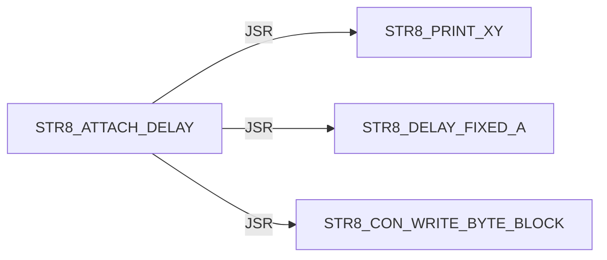

#### STR8 / BANK

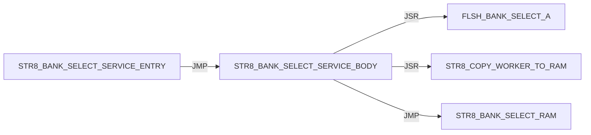

#### STR8 / BOOT

Panel 1 of 2: `STR8_BOOT_INPUT_ARM` through `STR8_BOOT_START`.

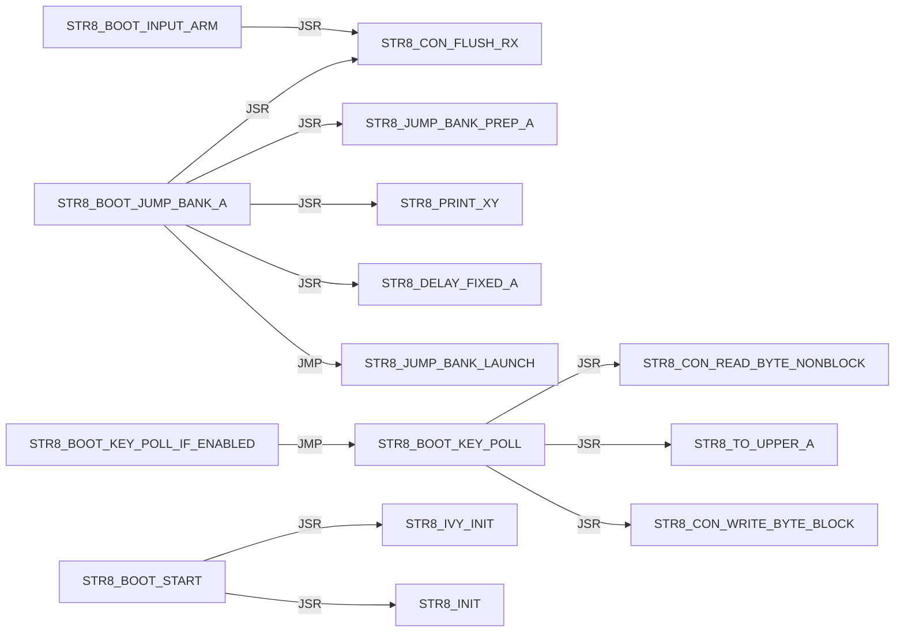

Panel 2 of 2: `STR8_BOOT_START` through `STR8_BOOT_START`.

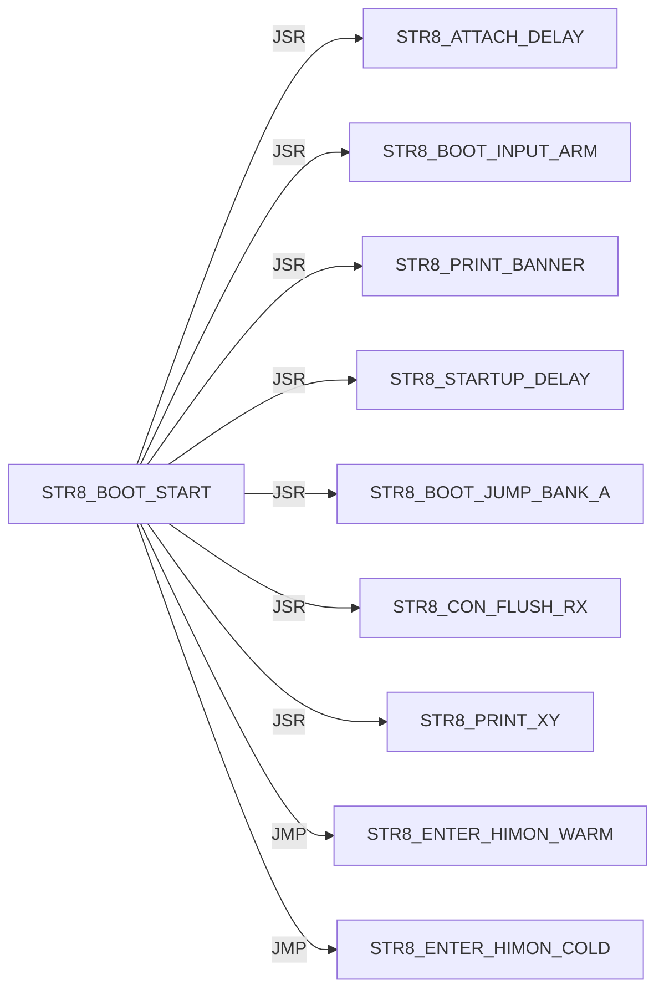

#### STR8 / CON

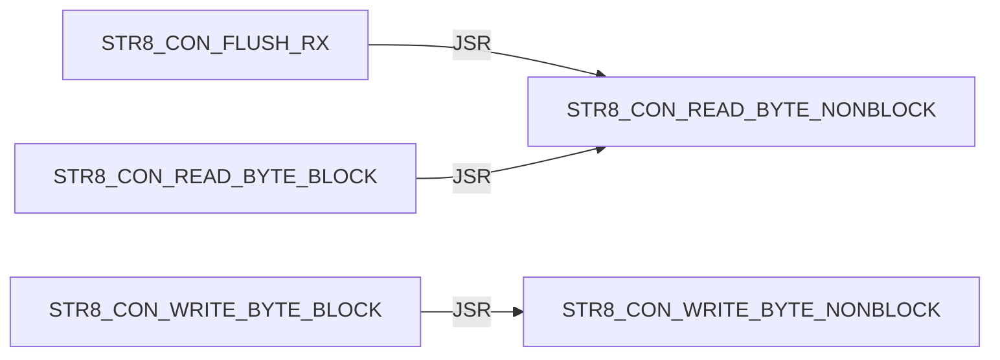

#### STR8 / CONFIRM

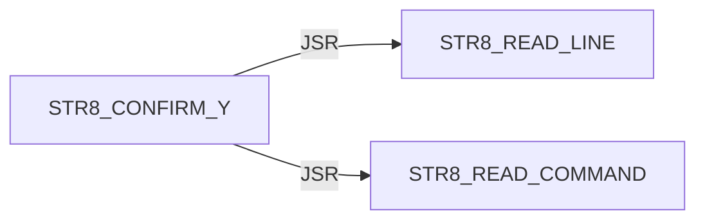

#### STR8 / DELAY


#### STR8 / DIR

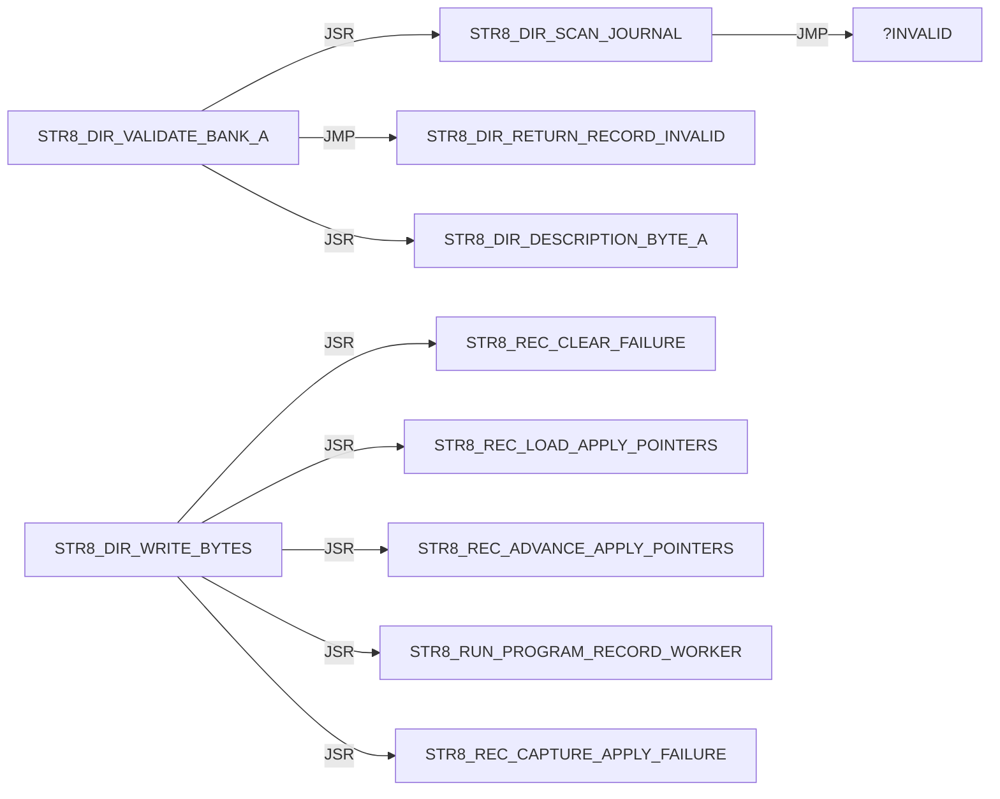

#### STR8 / DISPATCH

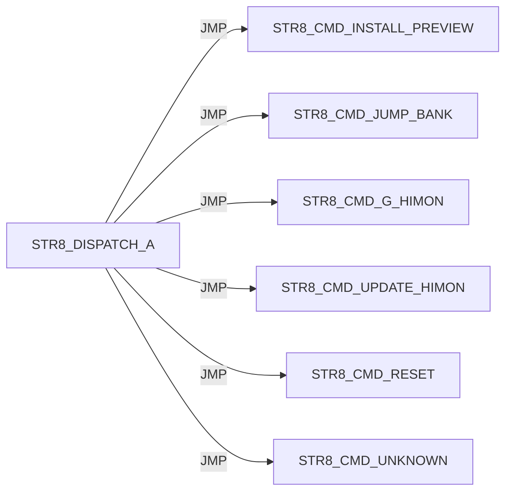

#### STR8 / ENTER

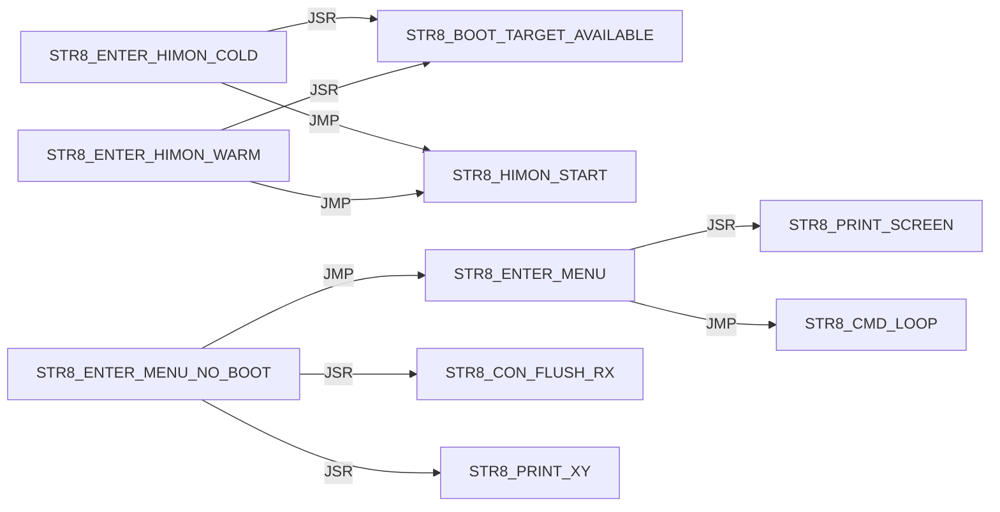

#### STR8 / I

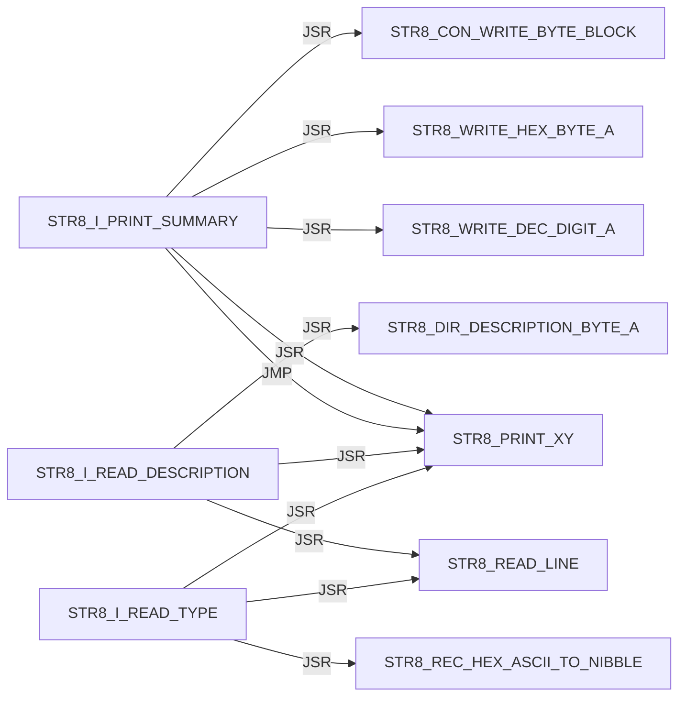

#### STR8 / INIT


#### STR8 / IVY

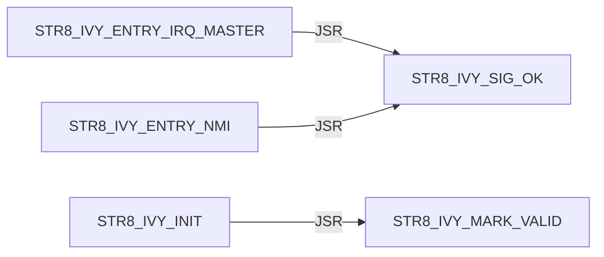

#### STR8 / JUMP

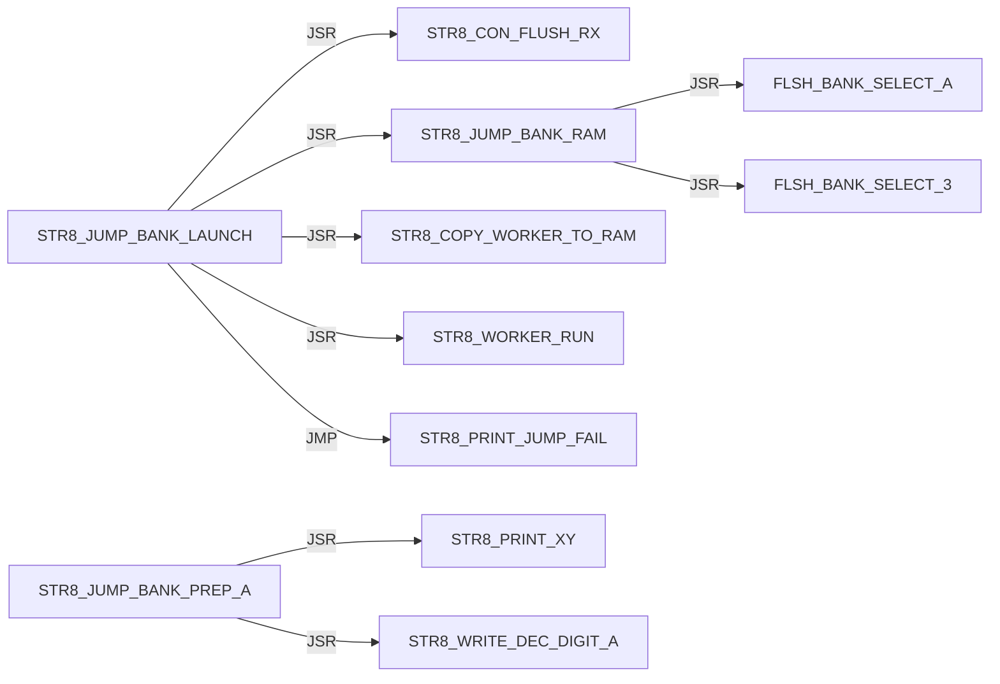

#### STR8 / PRINT

Panel 1 of 2: `STR8_PRINT_BANNER` through `STR8_PRINT_SCREEN`.

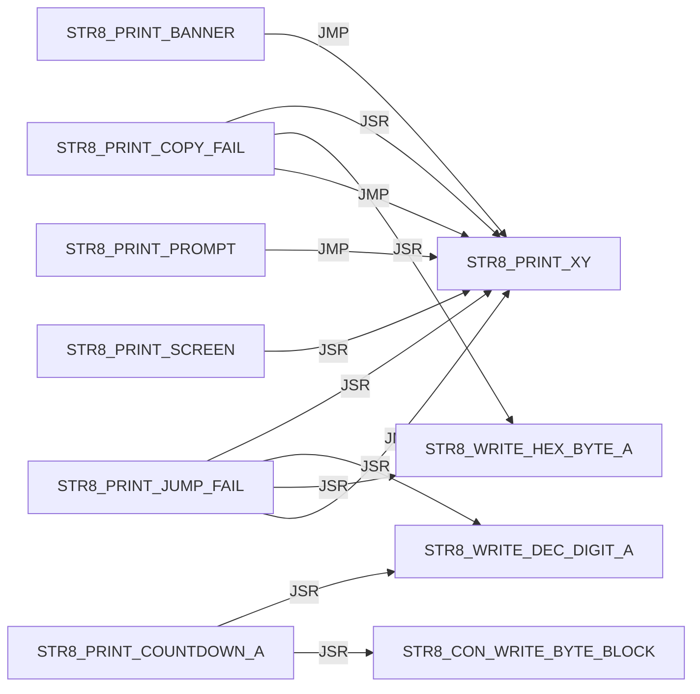

Panel 2 of 2: `STR8_PRINT_SCREEN` through `STR8_PRINT_XY`.

```mermaid
flowchart LR
    N0["STR8_PRINT_SCREEN"] -->|JMP| N1["STR8_PRINT_XY"]
    N1["STR8_PRINT_XY"] -->|JSR| N2["STR8_CON_WRITE_BYTE_BLOCK"]
    N1["STR8_PRINT_XY"] -->|JMP| N2["STR8_CON_WRITE_BYTE_BLOCK"]
```

#### STR8 / PROGRAM

```mermaid
flowchart LR
    N0["STR8_PROGRAM_HIMON_SECTOR_AX"] -->|JSR| N1["STR8_COPY_WORKER_TO_RAM"]
    N0["STR8_PROGRAM_HIMON_SECTOR_AX"] -->|JSR| N2["STR8_WORKER_RUN"]
    N0["STR8_PROGRAM_HIMON_SECTOR_AX"] -->|JSR| N3["STR8_CON_WRITE_BYTE_BLOCK"]
    N4["STR8_PROGRAM_HIMON_UPDATE"] -->|JSR| N0["STR8_PROGRAM_HIMON_SECTOR_AX"]
```

#### STR8 / READ

```mermaid
flowchart LR
    N0["STR8_READ_COMMAND"] -->|JSR| N1["STR8_CON_READ_BYTE_BLOCK"]
    N0["STR8_READ_COMMAND"] -->|JSR| N2["STR8_TO_UPPER_A"]
    N0["STR8_READ_COMMAND"] -->|JSR| N3["STR8_CON_WRITE_BYTE_BLOCK"]
    N4["STR8_READ_HIMON_S19"] -->|JSR| N5["STR8_RECORD_SERVICE_BODY"]
    N4["STR8_READ_HIMON_S19"] -->|JSR| N6["STR8_STAGE_HIMON_RECORD"]
    N4["STR8_READ_HIMON_S19"] -->|JSR| N3["STR8_CON_WRITE_BYTE_BLOCK"]
    N7["STR8_READ_LINE"] -->|JSR| N8["STR8_READ_TEXT_BYTE_BLOCK"]
    N7["STR8_READ_LINE"] -->|JSR| N2["STR8_TO_UPPER_A"]
    N7["STR8_READ_LINE"] -->|JSR| N3["STR8_CON_WRITE_BYTE_BLOCK"]
    N8["STR8_READ_TEXT_BYTE_BLOCK"] -->|JSR| N1["STR8_CON_READ_BYTE_BLOCK"]
```

#### STR8 / REC

Panel 1 of 3: `STR8_REC_APPLY_LF` through `STR8_REC_PARSE`.

```mermaid
flowchart LR
    N0["STR8_REC_APPLY_LF"] -->|JSR| N1["STR8_REC_CLEAR_FAILURE"]
    N0["STR8_REC_APPLY_LF"] -->|JMP| N2["STR8_REC_FAIL_A"]
    N0["STR8_REC_APPLY_LF"] -->|JMP| N3["STR8_REC_RETURN_OK"]
    N0["STR8_REC_APPLY_LF"] -->|JSR| N4["STR8_REC_LOAD_APPLY_POINTERS"]
    N0["STR8_REC_APPLY_LF"] -->|JSR| N5["STR8_REC_CAPTURE_APPLY_FAILURE"]
    N0["STR8_REC_APPLY_LF"] -->|JSR| N6["STR8_REC_ADVANCE_APPLY_POINTERS"]
    N0["STR8_REC_APPLY_LF"] -->|JSR| N7["STR8_RUN_PROGRAM_RECORD_WORKER"]
    N8["STR8_REC_FAIL_READ_X"] -->|JMP| N9["STR8_REC_RETURN_CURRENT_FAIL"]
    N8["STR8_REC_FAIL_READ_X"] -->|JMP| N2["STR8_REC_FAIL_A"]
    N10["STR8_REC_PARSE"] -->|JSR| N11["STR8_REC_CLEAR_RESULT"]
    N10["STR8_REC_PARSE"] -->|JMP| N2["STR8_REC_FAIL_A"]
    N10["STR8_REC_PARSE"] -->|JSR| N12["STR8_REC_READ_CHAR"]
```

Panel 2 of 3: `STR8_REC_PARSE` through `STR8_REC_READ_HEX_BYTE`.

```mermaid
flowchart LR
    N0["STR8_REC_PARSE"] -->|JMP| N1["STR8_REC_FAIL_READ_START"]
    N0["STR8_REC_PARSE"] -->|JMP| N2["STR8_REC_FAIL_READ_TYPE"]
    N3["STR8_REC_PARSE_BODY"] -->|JSR| N4["STR8_REC_READ_SUM_BYTE"]
    N3["STR8_REC_PARSE_BODY"] -->|JMP| N5["STR8_REC_FAIL_READ_HEX"]
    N3["STR8_REC_PARSE_BODY"] -->|JMP| N6["STR8_REC_FAIL_A"]
    N3["STR8_REC_PARSE_BODY"] -->|JSR| N7["STR8_REC_READ_CHAR"]
    N3["STR8_REC_PARSE_BODY"] -->|JMP| N8["STR8_REC_FAIL_READ_END"]
    N3["STR8_REC_PARSE_BODY"] -->|JMP| N9["STR8_REC_RETURN_OK"]
    N7["STR8_REC_READ_CHAR"] -->|JSR| N10["STR8_READ_TEXT_BYTE_BLOCK"]
    N7["STR8_REC_READ_CHAR"] -->|JSR| N11["STR8_CON_READ_BYTE_BLOCK"]
    N12["STR8_REC_READ_HEX_BYTE"] -->|JSR| N7["STR8_REC_READ_CHAR"]
    N12["STR8_REC_READ_HEX_BYTE"] -->|JSR| N13["STR8_REC_HEX_ASCII_TO_NIBBLE"]
```

Panel 3 of 3: `STR8_REC_READ_SUM_BYTE` through `STR8_REC_READ_SUM_BYTE`.

```mermaid
flowchart LR
    N0["STR8_REC_READ_SUM_BYTE"] -->|JSR| N1["STR8_REC_READ_HEX_BYTE"]
```

#### STR8 / RECORD

```mermaid
flowchart LR
    N0["STR8_RECORD_SERVICE_BODY"] -->|JMP| N1["STR8_REC_APPLY_LF"]
    N0["STR8_RECORD_SERVICE_BODY"] -->|JMP| N2["STR8_REC_FAIL_A"]
    N3["STR8_RECORD_SERVICE_ENTRY"] -->|JMP| N0["STR8_RECORD_SERVICE_BODY"]
```

#### STR8 / RUN

```mermaid
flowchart LR
    N0["STR8_RUN_PROGRAM_RECORD_WORKER"] -->|JSR| N1["STR8_COPY_WORKER_TO_RAM"]
    N0["STR8_RUN_PROGRAM_RECORD_WORKER"] -->|JSR| N2["STR8_WORKER_RUN"]
    N3["STR8_RUN_WORKER_SERVICE"] -->|JMP| N4["STR8_RUN_WORKER_SERVICE_BODY"]
    N4["STR8_RUN_WORKER_SERVICE_BODY"] -->|JSR| N1["STR8_COPY_WORKER_TO_RAM"]
    N4["STR8_RUN_WORKER_SERVICE_BODY"] -->|JSR| N2["STR8_WORKER_RUN"]
```

#### STR8 / SELECT

```mermaid
flowchart LR
    N0["STR8_SELECT_BANK_3"] -->|JSR| N1["FLSH_BANK_SELECT_3"]
```

#### STR8 / STARTUP

```mermaid
flowchart LR
    N0["STR8_STARTUP_DELAY"] -->|JSR| N1["STR8_PRINT_XY"]
    N0["STR8_STARTUP_DELAY"] -->|JSR| N2["STR8_BOOT_KEY_POLL_IF_ENABLED"]
    N0["STR8_STARTUP_DELAY"] -->|JSR| N3["STR8_PRINT_COUNTDOWN_A"]
    N0["STR8_STARTUP_DELAY"] -->|JSR| N4["STR8_DELAY_COUNTDOWN_TICK_A"]
```

#### STR8 / WRITE

```mermaid
flowchart LR
    N0["STR8_WRITE_DEC_DIGIT_A"] -->|JMP| N1["STR8_CON_WRITE_BYTE_BLOCK"]
    N2["STR8_WRITE_HEX_BYTE_A"] -->|JSR| N3["STR8_WRITE_HEX_NIBBLE_A"]
    N3["STR8_WRITE_HEX_NIBBLE_A"] -->|JMP| N1["STR8_CON_WRITE_BYTE_BLOCK"]
```

#### STR8 CMD / ABORT

```mermaid
flowchart LR
    N0["STR8_CMD_ABORT"] -->|JSR| N1["STR8_SELECT_BANK_3"]
    N0["STR8_CMD_ABORT"] -->|JMP| N2["STR8_PRINT_XY"]
```

#### STR8 CMD / COPY

```mermaid
flowchart LR
    N0["STR8_CMD_COPY_FAIL"] -->|JSR| N1["STR8_SELECT_BANK_3"]
    N0["STR8_CMD_COPY_FAIL"] -->|JMP| N2["STR8_PRINT_COPY_FAIL"]
```

#### STR8 CMD / G

```mermaid
flowchart LR
    N0["STR8_CMD_G_HIMON"] -->|JSR| N1["STR8_SELECT_BANK_3"]
    N0["STR8_CMD_G_HIMON"] -->|JSR| N2["STR8_PRINT_XY"]
    N0["STR8_CMD_G_HIMON"] -->|JMP| N3["STR8_ENTER_HIMON_WARM"]
```

#### STR8 CMD / INSTALL

```mermaid
flowchart LR
    N0["STR8_CMD_INSTALL_PREVIEW"] -->|JMP| N1["STR8_CMD_UNKNOWN"]
    N0["STR8_CMD_INSTALL_PREVIEW"] -->|JSR| N2["STR8_PRINT_XY"]
    N0["STR8_CMD_INSTALL_PREVIEW"] -->|JSR| N3["STR8_READ_LINE"]
    N0["STR8_CMD_INSTALL_PREVIEW"] -->|JMP| N4["STR8_CMD_ABORT"]
    N0["STR8_CMD_INSTALL_PREVIEW"] -->|JSR| N5["STR8_DIR_VALIDATE_BANK_A"]
    N0["STR8_CMD_INSTALL_PREVIEW"] -->|JSR| N6["STR8_I_READ_TYPE"]
    N0["STR8_CMD_INSTALL_PREVIEW"] -->|JSR| N7["STR8_I_READ_DESCRIPTION"]
    N0["STR8_CMD_INSTALL_PREVIEW"] -->|JMP| N8["STR8_I_PRINT_SUMMARY"]
    N0["STR8_CMD_INSTALL_PREVIEW"] -->|JSR| N9["STR8_I_COPY_RECORD_METADATA"]
    N0["STR8_CMD_INSTALL_PREVIEW"] -->|JMP| N2["STR8_PRINT_XY"]
```

#### STR8 CMD / JUMP

```mermaid
flowchart LR
    N0["STR8_CMD_JUMP_BANK"] -->|JSR| N1["STR8_READ_COMMAND"]
    N0["STR8_CMD_JUMP_BANK"] -->|JMP| N2["STR8_CMD_ABORT"]
    N0["STR8_CMD_JUMP_BANK"] -->|JSR| N3["STR8_JUMP_BANK_PREP_A"]
    N0["STR8_CMD_JUMP_BANK"] -->|JMP| N4["STR8_JUMP_BANK_LAUNCH"]
    N0["STR8_CMD_JUMP_BANK"] -->|JMP| N5["STR8_CMD_UNKNOWN"]
```

#### STR8 CMD / LOOP

```mermaid
flowchart LR
    N0["STR8_CMD_LOOP"] -->|JSR| N1["STR8_PRINT_PROMPT"]
    N0["STR8_CMD_LOOP"] -->|JSR| N2["STR8_READ_LINE"]
    N0["STR8_CMD_LOOP"] -->|JSR| N3["STR8_CMD_ABORT"]
    N0["STR8_CMD_LOOP"] -->|JSR| N4["STR8_READ_COMMAND"]
    N0["STR8_CMD_LOOP"] -->|JSR| N5["STR8_DISPATCH_A"]
```

#### STR8 CMD / OK

```mermaid
flowchart LR
    N0["STR8_CMD_OK"] -->|JSR| N1["STR8_SELECT_BANK_3"]
    N0["STR8_CMD_OK"] -->|JMP| N2["STR8_PRINT_XY"]
```

#### STR8 CMD / RESET

```mermaid
flowchart LR
    N0["STR8_CMD_RESET"] -->|JSR| N1["STR8_SELECT_BANK_3"]
```

#### STR8 CMD / UNKNOWN

```mermaid
flowchart LR
    N0["STR8_CMD_UNKNOWN"] -->|JSR| N1["STR8_PRINT_XY"]
    N0["STR8_CMD_UNKNOWN"] -->|JMP| N1["STR8_PRINT_XY"]
```

#### STR8 CMD / UPDATE

```mermaid
flowchart LR
    N0["STR8_CMD_UPDATE_HIMON"] -->|JMP| N1["STR8_PRINT_XY"]
    N0["STR8_CMD_UPDATE_HIMON"] -->|JSR| N1["STR8_PRINT_XY"]
    N0["STR8_CMD_UPDATE_HIMON"] -->|JSR| N2["STR8_CONFIRM_Y"]
    N0["STR8_CMD_UPDATE_HIMON"] -->|JSR| N3["STR8_STAGE_HIMON_BLANK"]
    N0["STR8_CMD_UPDATE_HIMON"] -->|JSR| N4["STR8_UPD_INIT"]
    N0["STR8_CMD_UPDATE_HIMON"] -->|JSR| N5["STR8_READ_HIMON_S19"]
    N0["STR8_CMD_UPDATE_HIMON"] -->|JSR| N6["STR8_PROGRAM_HIMON_UPDATE"]
    N0["STR8_CMD_UPDATE_HIMON"] -->|JMP| N7["STR8_CMD_OK"]
    N8["STR8_CMD_UPDATE_NO_DATA"] -->|JMP| N1["STR8_PRINT_XY"]
    N9["STR8_CMD_UPDATE_S19_FAIL"] -->|JSR| N10["STR8_CON_FLUSH_RX"]
    N9["STR8_CMD_UPDATE_S19_FAIL"] -->|JMP| N1["STR8_PRINT_XY"]
```

## External Targets

These targets are not labels in this source file; most are `XREF` providers from sibling ROM modules.

```text
FLSH_BANK_SELECT_3
FLSH_BANK_SELECT_A
STR8_BANK_SELECT_RAM
STR8_HIMON_START
STR8_WORKER_RUN
UTL_DELAY_AXY_8MHZ
```

## Unique Direct Edges By Source Label

Each block is one source label. Indented lines are outgoing direct edges.
Blank lines are source-level breaks; they do not imply call depth.

```text
START
    JMP STR8_BOOT_START

STR8_AP_IMPORT_LINK_SERVICE
    JMP STR8_AP_IMPORT_LINK_SERVICE_BODY

STR8_ATTACH_DELAY
    JSR STR8_PRINT_XY
    JSR STR8_DELAY_FIXED_A
    JSR STR8_CON_WRITE_BYTE_BLOCK

STR8_BANK_SELECT_SERVICE_BODY
    JSR FLSH_BANK_SELECT_A
    JSR STR8_COPY_WORKER_TO_RAM
    JMP STR8_BANK_SELECT_RAM

STR8_BANK_SELECT_SERVICE_ENTRY
    JMP STR8_BANK_SELECT_SERVICE_BODY

STR8_BOOT_INPUT_ARM
    JSR STR8_CON_FLUSH_RX

STR8_BOOT_JUMP_BANK_A
    JSR STR8_JUMP_BANK_PREP_A
    JSR STR8_CON_FLUSH_RX
    JSR STR8_PRINT_XY
    JSR STR8_DELAY_FIXED_A
    JMP STR8_JUMP_BANK_LAUNCH

STR8_BOOT_KEY_POLL
    JSR STR8_CON_READ_BYTE_NONBLOCK
    JSR STR8_TO_UPPER_A
    JSR STR8_CON_WRITE_BYTE_BLOCK

STR8_BOOT_KEY_POLL_IF_ENABLED
    JMP STR8_BOOT_KEY_POLL

STR8_BOOT_START
    JSR STR8_IVY_INIT
    JSR STR8_INIT
    JSR STR8_ATTACH_DELAY
    JSR STR8_BOOT_INPUT_ARM
    JSR STR8_PRINT_BANNER
    JSR STR8_STARTUP_DELAY
    JSR STR8_BOOT_JUMP_BANK_A
    JSR STR8_CON_FLUSH_RX
    JSR STR8_PRINT_XY
    JMP STR8_ENTER_HIMON_WARM
    JMP STR8_ENTER_HIMON_COLD

STR8_CMD_ABORT
    JSR STR8_SELECT_BANK_3
    JMP STR8_PRINT_XY

STR8_CMD_COPY_FAIL
    JSR STR8_SELECT_BANK_3
    JMP STR8_PRINT_COPY_FAIL

STR8_CMD_G_HIMON
    JSR STR8_SELECT_BANK_3
    JSR STR8_PRINT_XY
    JMP STR8_ENTER_HIMON_WARM

STR8_CMD_INSTALL_PREVIEW
    JMP STR8_CMD_UNKNOWN
    JSR STR8_PRINT_XY
    JSR STR8_READ_LINE
    JMP STR8_CMD_ABORT
    JSR STR8_DIR_VALIDATE_BANK_A
    JSR STR8_I_READ_TYPE
    JSR STR8_I_READ_DESCRIPTION
    JMP STR8_I_PRINT_SUMMARY
    JSR STR8_I_COPY_RECORD_METADATA
    JMP STR8_PRINT_XY

STR8_CMD_JUMP_BANK
    JSR STR8_READ_COMMAND
    JMP STR8_CMD_ABORT
    JSR STR8_JUMP_BANK_PREP_A
    JMP STR8_JUMP_BANK_LAUNCH
    JMP STR8_CMD_UNKNOWN

STR8_CMD_LOOP
    JSR STR8_PRINT_PROMPT
    JSR STR8_READ_LINE
    JSR STR8_CMD_ABORT
    JSR STR8_READ_COMMAND
    JSR STR8_DISPATCH_A

STR8_CMD_OK
    JSR STR8_SELECT_BANK_3
    JMP STR8_PRINT_XY

STR8_CMD_RESET
    JSR STR8_SELECT_BANK_3

STR8_CMD_UNKNOWN
    JSR STR8_PRINT_XY
    JMP STR8_PRINT_XY

STR8_CMD_UPDATE_HIMON
    JMP STR8_PRINT_XY
    JSR STR8_PRINT_XY
    JSR STR8_CONFIRM_Y
    JSR STR8_STAGE_HIMON_BLANK
    JSR STR8_UPD_INIT
    JSR STR8_READ_HIMON_S19
    JSR STR8_PROGRAM_HIMON_UPDATE
    JMP STR8_CMD_OK

STR8_CMD_UPDATE_NO_DATA
    JMP STR8_PRINT_XY

STR8_CMD_UPDATE_S19_FAIL
    JSR STR8_CON_FLUSH_RX
    JMP STR8_PRINT_XY

STR8_CON_FLUSH_RX
    JSR STR8_CON_READ_BYTE_NONBLOCK

STR8_CON_READ_BYTE_BLOCK
    JSR STR8_CON_READ_BYTE_NONBLOCK

STR8_CON_WRITE_BYTE_BLOCK
    JSR STR8_CON_WRITE_BYTE_NONBLOCK

STR8_CONFIRM_Y
    JSR STR8_READ_LINE
    JSR STR8_READ_COMMAND

STR8_DELAY_FIXED_A
    JMP UTL_DELAY_AXY_8MHZ

STR8_DIR_SCAN_JOURNAL
    JMP ?INVALID

STR8_DIR_VALIDATE_BANK_A
    JMP STR8_DIR_RETURN_RECORD_INVALID
    JSR STR8_DIR_DESCRIPTION_BYTE_A
    JSR STR8_DIR_SCAN_JOURNAL

STR8_DIR_WRITE_BYTES
    JSR STR8_REC_CLEAR_FAILURE
    JSR STR8_REC_LOAD_APPLY_POINTERS
    JSR STR8_REC_ADVANCE_APPLY_POINTERS
    JSR STR8_RUN_PROGRAM_RECORD_WORKER
    JSR STR8_REC_CAPTURE_APPLY_FAILURE

STR8_DISPATCH_A
    JMP STR8_CMD_INSTALL_PREVIEW
    JMP STR8_CMD_JUMP_BANK
    JMP STR8_CMD_G_HIMON
    JMP STR8_CMD_UPDATE_HIMON
    JMP STR8_CMD_RESET
    JMP STR8_CMD_UNKNOWN

STR8_ENTER_HIMON_COLD
    JSR STR8_BOOT_TARGET_AVAILABLE
    JMP STR8_HIMON_START

STR8_ENTER_HIMON_WARM
    JSR STR8_BOOT_TARGET_AVAILABLE
    JMP STR8_HIMON_START

STR8_ENTER_MENU
    JSR STR8_PRINT_SCREEN
    JMP STR8_CMD_LOOP

STR8_ENTER_MENU_NO_BOOT
    JSR STR8_CON_FLUSH_RX
    JSR STR8_PRINT_XY
    JMP STR8_ENTER_MENU

STR8_I_PRINT_SUMMARY
    JSR STR8_PRINT_XY
    JSR STR8_WRITE_DEC_DIGIT_A
    JSR STR8_WRITE_HEX_BYTE_A
    JSR STR8_CON_WRITE_BYTE_BLOCK
    JMP STR8_PRINT_XY

STR8_I_READ_DESCRIPTION
    JSR STR8_PRINT_XY
    JSR STR8_READ_LINE
    JSR STR8_DIR_DESCRIPTION_BYTE_A

STR8_I_READ_TYPE
    JSR STR8_PRINT_XY
    JSR STR8_READ_LINE
    JSR STR8_REC_HEX_ASCII_TO_NIBBLE

STR8_INIT
    JMP STR8_CON_INIT

STR8_IVY_ENTRY_IRQ_MASTER
    JSR STR8_IVY_SIG_OK

STR8_IVY_ENTRY_NMI
    JSR STR8_IVY_SIG_OK

STR8_IVY_INIT
    JSR STR8_IVY_MARK_VALID

STR8_JUMP_BANK_LAUNCH
    JSR STR8_CON_FLUSH_RX
    JSR STR8_JUMP_BANK_RAM
    JSR STR8_COPY_WORKER_TO_RAM
    JSR STR8_WORKER_RUN
    JMP STR8_PRINT_JUMP_FAIL

STR8_JUMP_BANK_PREP_A
    JSR STR8_PRINT_XY
    JSR STR8_WRITE_DEC_DIGIT_A

STR8_JUMP_BANK_RAM
    JSR FLSH_BANK_SELECT_A
    JSR FLSH_BANK_SELECT_3

STR8_PRINT_BANNER
    JMP STR8_PRINT_XY

STR8_PRINT_COPY_FAIL
    JSR STR8_PRINT_XY
    JSR STR8_WRITE_HEX_BYTE_A
    JMP STR8_PRINT_XY

STR8_PRINT_COUNTDOWN_A
    JSR STR8_WRITE_DEC_DIGIT_A
    JSR STR8_CON_WRITE_BYTE_BLOCK

STR8_PRINT_JUMP_FAIL
    JSR STR8_PRINT_XY
    JSR STR8_WRITE_DEC_DIGIT_A
    JSR STR8_WRITE_HEX_BYTE_A
    JMP STR8_PRINT_XY

STR8_PRINT_PROMPT
    JMP STR8_PRINT_XY

STR8_PRINT_SCREEN
    JSR STR8_PRINT_XY
    JMP STR8_PRINT_XY

STR8_PRINT_XY
    JSR STR8_CON_WRITE_BYTE_BLOCK
    JMP STR8_CON_WRITE_BYTE_BLOCK

STR8_PROGRAM_HIMON_SECTOR_AX
    JSR STR8_COPY_WORKER_TO_RAM
    JSR STR8_WORKER_RUN
    JSR STR8_CON_WRITE_BYTE_BLOCK

STR8_PROGRAM_HIMON_UPDATE
    JSR STR8_PROGRAM_HIMON_SECTOR_AX

STR8_READ_COMMAND
    JSR STR8_CON_READ_BYTE_BLOCK
    JSR STR8_TO_UPPER_A
    JSR STR8_CON_WRITE_BYTE_BLOCK

STR8_READ_HIMON_S19
    JSR STR8_RECORD_SERVICE_BODY
    JSR STR8_STAGE_HIMON_RECORD
    JSR STR8_CON_WRITE_BYTE_BLOCK

STR8_READ_LINE
    JSR STR8_READ_TEXT_BYTE_BLOCK
    JSR STR8_TO_UPPER_A
    JSR STR8_CON_WRITE_BYTE_BLOCK

STR8_READ_TEXT_BYTE_BLOCK
    JSR STR8_CON_READ_BYTE_BLOCK

STR8_REC_APPLY_LF
    JSR STR8_REC_CLEAR_FAILURE
    JMP STR8_REC_FAIL_A
    JMP STR8_REC_RETURN_OK
    JSR STR8_REC_LOAD_APPLY_POINTERS
    JSR STR8_REC_CAPTURE_APPLY_FAILURE
    JSR STR8_REC_ADVANCE_APPLY_POINTERS
    JSR STR8_RUN_PROGRAM_RECORD_WORKER

STR8_REC_FAIL_READ_X
    JMP STR8_REC_RETURN_CURRENT_FAIL
    JMP STR8_REC_FAIL_A

STR8_REC_PARSE
    JSR STR8_REC_CLEAR_RESULT
    JMP STR8_REC_FAIL_A
    JSR STR8_REC_READ_CHAR
    JMP STR8_REC_FAIL_READ_START
    JMP STR8_REC_FAIL_READ_TYPE

STR8_REC_PARSE_BODY
    JSR STR8_REC_READ_SUM_BYTE
    JMP STR8_REC_FAIL_READ_HEX
    JMP STR8_REC_FAIL_A
    JSR STR8_REC_READ_CHAR
    JMP STR8_REC_FAIL_READ_END
    JMP STR8_REC_RETURN_OK

STR8_REC_READ_CHAR
    JSR STR8_READ_TEXT_BYTE_BLOCK
    JSR STR8_CON_READ_BYTE_BLOCK

STR8_REC_READ_HEX_BYTE
    JSR STR8_REC_READ_CHAR
    JSR STR8_REC_HEX_ASCII_TO_NIBBLE

STR8_REC_READ_SUM_BYTE
    JSR STR8_REC_READ_HEX_BYTE

STR8_RECORD_SERVICE_BODY
    JMP STR8_REC_APPLY_LF
    JMP STR8_REC_FAIL_A

STR8_RECORD_SERVICE_ENTRY
    JMP STR8_RECORD_SERVICE_BODY

STR8_RUN_PROGRAM_RECORD_WORKER
    JSR STR8_COPY_WORKER_TO_RAM
    JSR STR8_WORKER_RUN

STR8_RUN_WORKER_SERVICE
    JMP STR8_RUN_WORKER_SERVICE_BODY

STR8_RUN_WORKER_SERVICE_BODY
    JSR STR8_COPY_WORKER_TO_RAM
    JSR STR8_WORKER_RUN

STR8_SELECT_BANK_3
    JSR FLSH_BANK_SELECT_3

STR8_STARTUP_DELAY
    JSR STR8_PRINT_XY
    JSR STR8_BOOT_KEY_POLL_IF_ENABLED
    JSR STR8_PRINT_COUNTDOWN_A
    JSR STR8_DELAY_COUNTDOWN_TICK_A

STR8_WRITE_DEC_DIGIT_A
    JMP STR8_CON_WRITE_BYTE_BLOCK

STR8_WRITE_HEX_BYTE_A
    JSR STR8_WRITE_HEX_NIBBLE_A

STR8_WRITE_HEX_NIBBLE_A
    JMP STR8_CON_WRITE_BYTE_BLOCK

```

## Raw Direct Edge Sites By Source Label

Each line is a direct call/jump site with source line number.

```text
START
      173  JMP STR8_BOOT_START

STR8_AP_IMPORT_LINK_SERVICE
      181  JMP STR8_AP_IMPORT_LINK_SERVICE_BODY

STR8_ATTACH_DELAY
      398  JSR STR8_PRINT_XY
      408  JSR STR8_DELAY_FIXED_A
      410  JSR STR8_CON_WRITE_BYTE_BLOCK

STR8_BANK_SELECT_SERVICE_BODY
     1025  JSR FLSH_BANK_SELECT_A
     1036  JSR STR8_COPY_WORKER_TO_RAM
     1038  JMP STR8_BANK_SELECT_RAM

STR8_BANK_SELECT_SERVICE_ENTRY
      198  JMP STR8_BANK_SELECT_SERVICE_BODY

STR8_BOOT_INPUT_ARM
      249  JSR STR8_CON_FLUSH_RX

STR8_BOOT_JUMP_BANK_A
      970  JSR STR8_JUMP_BANK_PREP_A
      971  JSR STR8_CON_FLUSH_RX
      974  JSR STR8_PRINT_XY
      976  JSR STR8_DELAY_FIXED_A
      977  JMP STR8_JUMP_BANK_LAUNCH

STR8_BOOT_KEY_POLL
      484  JSR STR8_CON_READ_BYTE_NONBLOCK
      486  JSR STR8_TO_UPPER_A
      487  JSR STR8_CON_WRITE_BYTE_BLOCK

STR8_BOOT_KEY_POLL_IF_ENABLED
      459  JMP STR8_BOOT_KEY_POLL

STR8_BOOT_START
      205  JSR STR8_IVY_INIT
      206  JSR STR8_INIT
      209  JSR STR8_ATTACH_DELAY
      210  JSR STR8_BOOT_INPUT_ARM
      211  JSR STR8_PRINT_BANNER
      212  JSR STR8_STARTUP_DELAY
      219  JSR STR8_BOOT_JUMP_BANK_A
      221  JSR STR8_CON_FLUSH_RX
      224  JSR STR8_PRINT_XY
      225  JMP STR8_ENTER_HIMON_WARM
      229  JSR STR8_PRINT_XY
      230  JMP STR8_ENTER_HIMON_COLD
      231  JSR STR8_CON_FLUSH_RX

STR8_CMD_ABORT
      944  JSR STR8_SELECT_BANK_3
      948  JMP STR8_PRINT_XY

STR8_CMD_COPY_FAIL
      954  JSR STR8_SELECT_BANK_3
      956  JMP STR8_PRINT_COPY_FAIL

STR8_CMD_G_HIMON
      915  JSR STR8_SELECT_BANK_3
      918  JSR STR8_PRINT_XY
      919  JMP STR8_ENTER_HIMON_WARM
      923  JSR STR8_PRINT_XY
      924  JMP STR8_ENTER_HIMON_WARM

STR8_CMD_INSTALL_PREVIEW
      664  JMP STR8_CMD_UNKNOWN
      668  JSR STR8_PRINT_XY
      670  JSR STR8_READ_LINE
      673  JMP STR8_CMD_ABORT
      682  JSR STR8_DIR_VALIDATE_BANK_A
      691  JSR STR8_I_READ_TYPE
      693  JSR STR8_I_READ_DESCRIPTION
      695  JMP STR8_I_PRINT_SUMMARY
      696  JSR STR8_I_COPY_RECORD_METADATA
      697  JMP STR8_I_PRINT_SUMMARY
      700  JMP STR8_PRINT_XY
      701  JMP STR8_CMD_UNKNOWN

STR8_CMD_JUMP_BANK
      850  JSR STR8_READ_COMMAND
      853  JMP STR8_CMD_ABORT
      863  JSR STR8_JUMP_BANK_PREP_A
      864  JMP STR8_JUMP_BANK_LAUNCH
      866  JMP STR8_CMD_UNKNOWN

STR8_CMD_LOOP
      511  JSR STR8_PRINT_PROMPT
      514  JSR STR8_READ_LINE
      518  JSR STR8_CMD_ABORT
      521  JSR STR8_READ_COMMAND
      524  JSR STR8_CMD_ABORT
      528  JSR STR8_DISPATCH_A

STR8_CMD_OK
      936  JSR STR8_SELECT_BANK_3
      940  JMP STR8_PRINT_XY

STR8_CMD_RESET
      930  JSR STR8_SELECT_BANK_3

STR8_CMD_UNKNOWN
      962  JSR STR8_PRINT_XY
      965  JMP STR8_PRINT_XY

STR8_CMD_UPDATE_HIMON
      875  JMP STR8_PRINT_XY
      879  JSR STR8_PRINT_XY
      880  JSR STR8_CONFIRM_Y
      882  JSR STR8_STAGE_HIMON_BLANK
      883  JSR STR8_UPD_INIT
      886  JSR STR8_PRINT_XY
      887  JSR STR8_READ_HIMON_S19
      893  JSR STR8_PRINT_XY
      894  JSR STR8_CONFIRM_Y
      896  JSR STR8_PROGRAM_HIMON_UPDATE
      898  JMP STR8_CMD_OK

STR8_CMD_UPDATE_NO_DATA
      910  JMP STR8_PRINT_XY

STR8_CMD_UPDATE_S19_FAIL
      902  JSR STR8_CON_FLUSH_RX
      905  JMP STR8_PRINT_XY

STR8_CON_FLUSH_RX
     2168  JSR STR8_CON_READ_BYTE_NONBLOCK

STR8_CON_READ_BYTE_BLOCK
     2182  JSR STR8_CON_READ_BYTE_NONBLOCK

STR8_CON_WRITE_BYTE_BLOCK
     2208  JSR STR8_CON_WRITE_BYTE_NONBLOCK

STR8_CONFIRM_Y
     1812  JSR STR8_READ_LINE
     1823  JSR STR8_READ_COMMAND

STR8_DELAY_FIXED_A
      418  JMP UTL_DELAY_AXY_8MHZ

STR8_DIR_SCAN_JOURNAL
     1198  JMP ?INVALID

STR8_DIR_VALIDATE_BANK_A
     1068  JMP STR8_DIR_RETURN_RECORD_INVALID
     1105  JSR STR8_DIR_DESCRIPTION_BYTE_A
     1144  JSR STR8_DIR_SCAN_JOURNAL

STR8_DIR_WRITE_BYTES
     1253  JSR STR8_REC_CLEAR_FAILURE
     1270  JSR STR8_REC_LOAD_APPLY_POINTERS
     1277  JSR STR8_REC_ADVANCE_APPLY_POINTERS
     1281  JSR STR8_RUN_PROGRAM_RECORD_WORKER
     1284  JSR STR8_REC_LOAD_APPLY_POINTERS
     1290  JSR STR8_REC_ADVANCE_APPLY_POINTERS
     1306  JSR STR8_REC_CAPTURE_APPLY_FAILURE
     1311  JSR STR8_REC_CAPTURE_APPLY_FAILURE

STR8_DISPATCH_A
      633  JMP STR8_CMD_INSTALL_PREVIEW
      638  JMP STR8_CMD_JUMP_BANK
      644  JMP STR8_CMD_G_HIMON
      648  JMP STR8_CMD_UPDATE_HIMON
      653  JMP STR8_CMD_RESET
      655  JMP STR8_CMD_UNKNOWN

STR8_ENTER_HIMON_COLD
      349  JSR STR8_BOOT_TARGET_AVAILABLE
      355  JMP STR8_HIMON_START

STR8_ENTER_HIMON_WARM
      358  JSR STR8_BOOT_TARGET_AVAILABLE
      368  JMP STR8_HIMON_START

STR8_ENTER_MENU
      236  JSR STR8_PRINT_SCREEN
      237  JMP STR8_CMD_LOOP

STR8_ENTER_MENU_NO_BOOT
      386  JSR STR8_CON_FLUSH_RX
      389  JSR STR8_PRINT_XY
      390  JMP STR8_ENTER_MENU

STR8_I_PRINT_SUMMARY
      772  JSR STR8_PRINT_XY
      774  JSR STR8_WRITE_DEC_DIGIT_A
      783  JSR STR8_PRINT_XY
      786  JSR STR8_PRINT_XY
      788  JSR STR8_WRITE_HEX_BYTE_A
      791  JSR STR8_PRINT_XY
      794  JSR STR8_CON_WRITE_BYTE_BLOCK
      806  JSR STR8_PRINT_XY
      808  JSR STR8_WRITE_HEX_BYTE_A
      810  JSR STR8_WRITE_HEX_BYTE_A
      830  JSR STR8_PRINT_XY
      833  JSR STR8_PRINT_XY
      835  JSR STR8_WRITE_HEX_BYTE_A
      838  JMP STR8_PRINT_XY

STR8_I_READ_DESCRIPTION
      732  JSR STR8_PRINT_XY
      734  JSR STR8_READ_LINE
      739  JSR STR8_DIR_DESCRIPTION_BYTE_A

STR8_I_READ_TYPE
      706  JSR STR8_PRINT_XY
      708  JSR STR8_READ_LINE
      712  JSR STR8_REC_HEX_ASCII_TO_NIBBLE
      720  JSR STR8_REC_HEX_ASCII_TO_NIBBLE

STR8_INIT
      246  JMP STR8_CON_INIT

STR8_IVY_ENTRY_IRQ_MASTER
      325  JSR STR8_IVY_SIG_OK
      336  JSR STR8_IVY_SIG_OK

STR8_IVY_ENTRY_NMI
      308  JSR STR8_IVY_SIG_OK

STR8_IVY_INIT
      279  JSR STR8_IVY_MARK_VALID

STR8_JUMP_BANK_LAUNCH
      996  JSR STR8_CON_FLUSH_RX
     1000  JSR STR8_JUMP_BANK_RAM
     1002  JSR STR8_COPY_WORKER_TO_RAM
     1003  JSR STR8_WORKER_RUN
     1005  JMP STR8_PRINT_JUMP_FAIL

STR8_JUMP_BANK_PREP_A
      987  JSR STR8_PRINT_XY
      989  JSR STR8_WRITE_DEC_DIGIT_A
      992  JSR STR8_PRINT_XY

STR8_JUMP_BANK_RAM
     2090  JSR FLSH_BANK_SELECT_A
     2127  JSR FLSH_BANK_SELECT_3

STR8_PRINT_BANNER
      423  JMP STR8_PRINT_XY

STR8_PRINT_COPY_FAIL
     2024  JSR STR8_PRINT_XY
     2026  JSR STR8_WRITE_HEX_BYTE_A
     2028  JSR STR8_WRITE_HEX_BYTE_A
     2031  JMP STR8_PRINT_XY
     2035  JMP STR8_PRINT_XY

STR8_PRINT_COUNTDOWN_A
      465  JSR STR8_WRITE_DEC_DIGIT_A
      470  JSR STR8_CON_WRITE_BYTE_BLOCK

STR8_PRINT_JUMP_FAIL
     2042  JSR STR8_PRINT_XY
     2044  JSR STR8_WRITE_DEC_DIGIT_A
     2047  JSR STR8_PRINT_XY
     2049  JSR STR8_WRITE_HEX_BYTE_A
     2051  JSR STR8_WRITE_HEX_BYTE_A
     2054  JMP STR8_PRINT_XY

STR8_PRINT_PROMPT
     2139  JMP STR8_PRINT_XY

STR8_PRINT_SCREEN
      505  JSR STR8_PRINT_XY
      508  JMP STR8_PRINT_XY

STR8_PRINT_XY
     2147  JSR STR8_CON_WRITE_BYTE_BLOCK
     2153  JMP STR8_CON_WRITE_BYTE_BLOCK

STR8_PROGRAM_HIMON_SECTOR_AX
     2005  JSR STR8_COPY_WORKER_TO_RAM
     2006  JSR STR8_WORKER_RUN
     2009  JSR STR8_CON_WRITE_BYTE_BLOCK

STR8_PROGRAM_HIMON_UPDATE
     1982  JSR STR8_PROGRAM_HIMON_SECTOR_AX
     1986  JSR STR8_PROGRAM_HIMON_SECTOR_AX
     1990  JSR STR8_PROGRAM_HIMON_SECTOR_AX

STR8_READ_COMMAND
      594  JSR STR8_CON_READ_BYTE_BLOCK
      609  JSR STR8_TO_UPPER_A
      610  JSR STR8_CON_WRITE_BYTE_BLOCK

STR8_READ_HIMON_S19
     1907  JSR STR8_RECORD_SERVICE_BODY
     1918  JSR STR8_STAGE_HIMON_RECORD
     1921  JSR STR8_CON_WRITE_BYTE_BLOCK

STR8_READ_LINE
      540  JSR STR8_READ_TEXT_BYTE_BLOCK
      553  JSR STR8_TO_UPPER_A
      557  JSR STR8_CON_WRITE_BYTE_BLOCK
      564  JSR STR8_CON_WRITE_BYTE_BLOCK
      566  JSR STR8_CON_WRITE_BYTE_BLOCK
      568  JSR STR8_CON_WRITE_BYTE_BLOCK

STR8_READ_TEXT_BYTE_BLOCK
      577  JSR STR8_CON_READ_BYTE_BLOCK

STR8_REC_APPLY_LF
     1553  JSR STR8_REC_CLEAR_FAILURE
     1558  JMP STR8_REC_FAIL_A
     1564  JMP STR8_REC_FAIL_A
     1569  JMP STR8_REC_FAIL_A
     1579  JMP STR8_REC_FAIL_A
     1585  JMP STR8_REC_FAIL_A
     1589  JMP STR8_REC_RETURN_OK
     1608  JMP STR8_REC_FAIL_A
     1615  JMP STR8_REC_FAIL_A
     1618  JSR STR8_REC_LOAD_APPLY_POINTERS
     1627  JSR STR8_REC_CAPTURE_APPLY_FAILURE
     1629  JMP STR8_REC_FAIL_A
     1631  JSR STR8_REC_ADVANCE_APPLY_POINTERS
     1635  JSR STR8_RUN_PROGRAM_RECORD_WORKER
     1638  JMP STR8_REC_FAIL_A
     1641  JSR STR8_REC_LOAD_APPLY_POINTERS
     1648  JSR STR8_REC_CAPTURE_APPLY_FAILURE
     1650  JMP STR8_REC_FAIL_A
     1652  JSR STR8_REC_ADVANCE_APPLY_POINTERS
     1655  JMP STR8_REC_RETURN_OK

STR8_REC_FAIL_READ_X
     1547  JMP STR8_REC_RETURN_CURRENT_FAIL
     1550  JMP STR8_REC_FAIL_A

STR8_REC_PARSE
     1359  JSR STR8_REC_CLEAR_RESULT
     1364  JMP STR8_REC_FAIL_A
     1370  JMP STR8_REC_FAIL_A
     1394  JMP STR8_REC_FAIL_A
     1397  JSR STR8_REC_READ_CHAR
     1399  JMP STR8_REC_FAIL_READ_START
     1407  JSR STR8_REC_READ_CHAR
     1409  JMP STR8_REC_FAIL_READ_START
     1415  JMP STR8_REC_FAIL_A
     1417  JSR STR8_REC_READ_CHAR
     1419  JMP STR8_REC_FAIL_READ_TYPE
     1429  JMP STR8_REC_FAIL_A

STR8_REC_PARSE_BODY
     1433  JSR STR8_REC_READ_SUM_BYTE
     1435  JMP STR8_REC_FAIL_READ_HEX
     1441  JMP STR8_REC_FAIL_A
     1450  JMP STR8_REC_FAIL_A
     1452  JSR STR8_REC_READ_SUM_BYTE
     1454  JMP STR8_REC_FAIL_READ_HEX
     1457  JSR STR8_REC_READ_SUM_BYTE
     1459  JMP STR8_REC_FAIL_READ_HEX
     1471  JSR STR8_REC_READ_SUM_BYTE
     1473  JMP STR8_REC_FAIL_READ_HEX
     1480  JSR STR8_REC_READ_SUM_BYTE
     1482  JMP STR8_REC_FAIL_READ_HEX
     1488  JMP STR8_REC_FAIL_A
     1496  JMP STR8_REC_FAIL_A
     1498  JSR STR8_REC_READ_CHAR
     1500  JMP STR8_REC_FAIL_READ_END
     1507  JMP STR8_REC_FAIL_A
     1520  JMP STR8_REC_RETURN_OK
     1530  JMP STR8_REC_RETURN_OK

STR8_REC_READ_CHAR
     1762  JSR STR8_READ_TEXT_BYTE_BLOCK
     1764  JSR STR8_CON_READ_BYTE_BLOCK

STR8_REC_READ_HEX_BYTE
     1719  JSR STR8_REC_READ_CHAR
     1721  JSR STR8_REC_HEX_ASCII_TO_NIBBLE
     1728  JSR STR8_REC_READ_CHAR
     1730  JSR STR8_REC_HEX_ASCII_TO_NIBBLE

STR8_REC_READ_SUM_BYTE
     1707  JSR STR8_REC_READ_HEX_BYTE

STR8_RECORD_SERVICE_BODY
     1353  JMP STR8_REC_APPLY_LF
     1356  JMP STR8_REC_FAIL_A

STR8_RECORD_SERVICE_ENTRY
      184  JMP STR8_RECORD_SERVICE_BODY

STR8_RUN_PROGRAM_RECORD_WORKER
     1329  JSR STR8_COPY_WORKER_TO_RAM
     1330  JSR STR8_WORKER_RUN

STR8_RUN_WORKER_SERVICE
      178  JMP STR8_RUN_WORKER_SERVICE_BODY

STR8_RUN_WORKER_SERVICE_BODY
     1012  JSR STR8_COPY_WORKER_TO_RAM
     1013  JSR STR8_WORKER_RUN

STR8_SELECT_BANK_3
     1805  JSR FLSH_BANK_SELECT_3

STR8_STARTUP_DELAY
      431  JSR STR8_PRINT_XY
      435  JSR STR8_BOOT_KEY_POLL_IF_ENABLED
      439  JSR STR8_PRINT_COUNTDOWN_A
      442  JSR STR8_DELAY_COUNTDOWN_TICK_A
      443  JSR STR8_BOOT_KEY_POLL_IF_ENABLED

STR8_WRITE_DEC_DIGIT_A
     2060  JMP STR8_CON_WRITE_BYTE_BLOCK

STR8_WRITE_HEX_BYTE_A
     2068  JSR STR8_WRITE_HEX_NIBBLE_A

STR8_WRITE_HEX_NIBBLE_A
     2076  JMP STR8_CON_WRITE_BYTE_BLOCK
     2079  JMP STR8_CON_WRITE_BYTE_BLOCK

```
