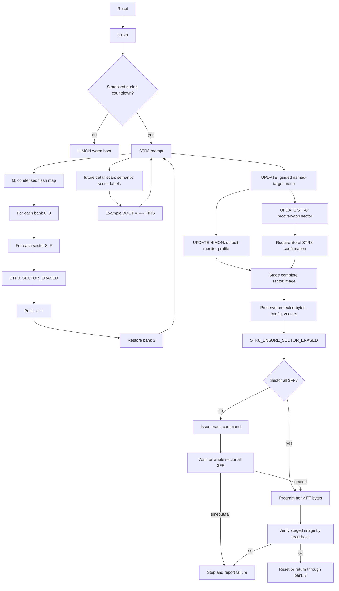

# STR8 Flash Update Proposal

This is the design note for STR8 flash update behavior. The first-pass `M`
physical flash map is implemented, and the first compact HIMON updater is `U`.
Future richer update commands should remain simple enough to avoid target/range
mistakes.

The direction is deliberately simple:

```text
HIMON L F stays conservative.
STR8 owns recovery and dangerous flash update flows.
STR8 should be able to update target code/ranges; HIMON is the default target.
STR8 should also have an explicit, harder-to-trigger option to update STR8.
Monitor replacement means 4K sector rebuild, not casual byte writes.
```

## Command Shape

Keep ordinary STR8 small. Do not expose `U T`, `U H`, or `U S` as operator
commands. Those are only design shorthand:

```text
T  internal idea: generic target/range
H  internal idea: HIMON profile
S  internal idea: STR8/self/top sector
```

The long-form visible command can use full words and named choices:

```text
M              map banks/sectors with condensed used/erased status
UPDATE         guided update menu
UPDATE HIMON   update the default monitor payload
UPDATE STR8    update the recovery/top-sector image
```

The current compact implementation uses `U` as the fixed HIMON profile:

```text
STR8>U
UPDATE HIMON C000-EFFF? Y:
SEND S19 C000-EFFF
...
PROGRAM C000-EFFF? Y:
```

That is still the same safety model: `U` does not ask for a raw range, and it
does not erase until the received S19 has passed the `$C000-$EFFF` gate.

`UPDATE` by itself should print a tiny menu and require the operator to choose
`HIMON`, `STR8`, or `QUIT`:

```text
STR8>UPDATE
UPDATE WHAT?
HIMON  C000-EFFF  NORMAL
STR8   F000-FFFF  DANGER
QUIT
:
```

There is no casual `UPDATE TARGET` in the first operator surface. A generic
target/range path may exist inside the code, but the user should see named
profiles until the machinery is boring. The update screen must print the exact
bank/range, whether the protected top sector is touched, and whether reset will
follow.

## S19 Gates

S19 remains a transport format, not authority to write anywhere. The selected
update command chooses the only address window that may be accepted:

```text
U / UPDATE HIMON
  accept S19 records for $C000-$EFFF
  reject records outside $C000-$EFFF
  stage, erase, write, and verify the C/D/E sectors
  leave $F000-$FFFF untouched so STR8 remains recoverable

UPDATE STR8
  accept S19 records for $F000-$FFFF
  reject records outside $F000-$FFFF
  require TYPE STR8
  stage the full top sector
  preserve or deliberately rebuild config bytes and vectors
  erase, write, verify, then reset
```

There is no mode where a received S19 stream casually spans both regions. If a
future install package contains both HIMON and STR8 bytes, STR8 should split it
into two explicit phases and ask for the STR8 confirmation before the
`$F000-$FFFF` phase. The safe simple rule is:

```text
HIMON update touches $C000-$EFFF.
STR8 update touches $F000-$FFFF.
Anything outside the selected window aborts.
```

`M` is the report command because the operator question is "show me the flash
map." `F` should stay reserved for a broader flash submenu or dangerous flash
tools. `C` should stay available for future condense/compact language rather
than meaning this cheap physical map.

`UPDATE STR8` should require a stronger confirmation than ordinary restore or
HIMON update work:

```text
STR8>UPDATE STR8
UPDATE STR8? TYPE STR8:
```

This should not directly stream bytes into `$FA00`. It should stage a complete
top-sector transaction, preserve required bytes, erase/write/verify, then reset.

The update commands may receive S19, but S19 is only the transport. After the
range gate accepts a record, the update unit is still a complete 4K staged
sector image:

```text
copy live destination sector into RAM
merge S19 bytes into the RAM sector image
if the RAM sector differs from flash, confirm erase
erase the flash sector
write the full RAM sector image
verify the full sector
```

Near-term install packages are still prepared off board. The host build creates
the vector-complete ROM `.bin`, then converts the install range to S1/S9 text
for the board. The current HIMON update stream is:

```text
make -C SRC himon-str8-himon-update-s19
SRC/BUILD/s19/himon-str8-himon-update.s19
```

That file covers `$C000-$EFFF` and omits all-`$FF` S1 data records. STR8
receives that text, starts from a blank C/D/E staged image, overlays the
received bytes, and rebuilds the selected sectors. Later onboard ASM/export
work can bypass S19 by handing STR8 complete sector images or sealed candidate
records directly.

Future STR8 transport may add an S2/S8 profile, commonly written as `.s28`.
That name is a file/profile hint; the records themselves are S2 data records
with 24-bit addresses and an S8 termination record. The third address byte gives
STR8 room to treat incoming records as physical SST39SF010A flash-chip
addresses instead of only as CPU-visible `$8000-$FFFF` bytes.

For the current four 32K bank idea, that future linear map names physical
flash-chip addresses:

```text
bank 0  physical flash $00000-$07FFF
bank 1  physical flash $08000-$0FFFF
bank 2  physical flash $10000-$17FFF
bank 3  physical flash $18000-$1FFFF  reset/default boot bank
```

Translation is simple and visible:

```text
bank        = linear_address >> 15
bank_offset = linear_address & $7FFF
cpu_address = $8000 + bank_offset
```

So physical flash address `$18000` means bank 3 at CPU `$8000`, `$1F000` means
bank 3 top sector, and `$1FFFA-$1FFFF` means the reset/default boot bank's
vector block. That makes S2/S8 a good later fit for bank-aware restore, bulk
data storage, retrieval, and transport. It is not a V0 requirement; V0 can stay
with S1/S9 install packages and explicit STR8 bank/range policy.

V0 should not try to be clever about direct 1->0 patching for HIMON/STR8
replacement. The first rule is sector rebuild. Direct 1->0 writes remain useful
for deliberate one-way flags or later append-only records.

The implementation should still start with the friendliest proof:

```text
install default HIMON target below the protected STR8 sector
verify that STR8 survives a bad or missing target
only then add the STR8/top-sector self-update path
```

That keeps V0 small while avoiding a HIMON-only installer. The low-level
operation is "install this target image/range"; the command profile can still
say `UPDATE HIMON` when the target is the bundled HIMON image.

The first bench proof should use STR8's own HIMON target update path:

```text
flash known-good STR8/HIMON in Bank 3
boot, enter STR8, run M and G as a sanity check
run STR8 B so Bank 2 becomes the known-good recovery copy
build or patch a visibly different HIMON
use STR8 U / UPDATE HIMON to place that candidate in Bank 3
boot and look for the visible HIMON change
if it fails, enter STR8 and high-flash restore Bank 2 -> Bank 3
boot again and confirm the old HIMON is back
```

That proves the recovery shape with the intended updater, not with the
programmer as the normal path. The `UPDATE HIMON` implementation must use the
fixed `$C000-$EFFF` gate and must not rely on whole-ROM programming as its
normal update method.

With the current recovery command set, declining the high-flash warning
preserves `$C000-$FFFF`; that is correct for ordinary restore but not enough to
replace a bad HIMON. The controlled fallback test must accept the
`FLASH C000-FFFF?` warning only when Bank 2 is a known-good STR8/HIMON image.
The external programmer remains the last choice for a bricked board, not the
ordinary update/install proof.

## STR8 And LEAF Boundary

These update commands do not turn STR8 into the runtime owner. STR8 remains the
recovery/update guard. In the current combined image, IVI is the stable
hardware-vector indirection mechanism; using future LEAF patch routines after
handoff is optional payload behavior.

```text
STR8:
  reset entry, recovery prompt, map, backup, restore, guarded flash update

IVI:
  stable vector indirection in the combined STR8 image
  patchable NMI/IRQ/BRK targets
  no authority to erase or rewrite STR8 flash

LEAF:
  future friendly front-door surface built on IVI
  small atomic routines for patching NMI/IRQ/BRK/BRK-service targets

HIMON or another payload:
  normal commands, debugger, application behavior, interrupt meanings
  may call LEAF atomic routines when LEAF exists
  must use STR8 for dangerous flash transactions
```

Atomic LEAF routines should update tiny runtime cells or vector targets in a
way that is never half-old and half-new from the payload's point of view. They
are for "point this interrupt/trap entry over there now." They are not a flash
installer and not a recovery replacement.

## M Map Report

`M` scans bank by bank, sector by sector, then restores bank 3 before returning
to the prompt.

Current first-pass output shape:

```text
STR8>M
BANK0     BANK1     BANK2     BOOT
++--++--  --++--++  --------  ++++++++
STR8>
```

Each status character position maps to one 4K sector:

```text
8=$8000 9=$9000 A=$A000 B=$B000 C=$C000 D=$D000 E=$E000 F=$F000
```

The first line is a label line. Current labels can show bank numbers plus the
boot role, because bank 3 is the bank the board boots from. Future labels may
be role names or catalog names without changing the status grammar:

```text
BASE      RECOV     HIMON     DATA
++--++--  --++--++  --------  ++++++++
```

Status symbols:

```text
- = erased/unused, all bytes are $FF
+ = used, at least one byte is not $FF
```

A later detail mode or separate command can reuse the same eight sector
positions for semantic labels:

```text
BOOT
----+HHS
```

Possible semantic symbols:

```text
- = erased/unused, all bytes are $FF
+ = used, not yet classified
H = HIMON-like sector
S = STR8/top-sector boot material
```

The first-pass `M` report is physical and cheap. The semantic display can
arrive after STR8 has recognizers for WDCMON, HIMON, STR8, RCAT/data records,
or stored bank roles.

## Erase Policy

STR8 should prefer the obvious whole-sector rule over a clever one-byte poll.
For V0 HIMON/STR8 replacement, any changed staged sector is erased and rebuilt:

```text
if sector is all $FF:
  skip erase

if sector is not all $FF:
  issue sector erase
  wait until the whole sector scans all $FF

if erase command fails or full-sector erased wait times out:
  stop
```

The important distinction:

```text
one-byte polling asks "did one watched byte finish?"
whole-sector waiting asks "is the sector actually erased?"
```

For STR8, whole-sector waiting is slower but clearer and safer.

For a monitor update, "write" should be understood as "rebuild the selected 4K
sector." The chip still programs bytes after erase, but the operator-facing
operation is sector erase, full-sector write, and full-sector verify.

## Routine Shape

Build this as routines made from routines:

```text
STR8_CMD_M
  RAM-resident scan fills four map-mask bytes
  scan restores bank 3
  print M/map header
  for bank 0..3
    print eight mask bits as - or +

STR8_ENSURE_SECTOR_ERASED
  call STR8_SECTOR_ERASED
  if erased: success
  issue erase command
  call STR8_WAIT_SECTOR_ERASED

STR8_WAIT_SECTOR_ERASED
  repeat until timeout
    call STR8_SECTOR_ERASED
    if erased: success
  fail

STR8_SECTOR_ERASED
  scan one selected 4K sector
  return C=1 when all bytes are $FF
  return C=0 when any byte is not $FF
```

## Mermaid Map



## Open Refinements

- Decide whether later displays need an optional verbose `ERASED/USED` mode.
- Hardware-prove `U` receiving the `$C000-$EFFF` S-record stream generated by
  `himon-str8-himon-update-s19`.
- Decide whether future bank-aware transport should accept S2/S8 `.s28`
  records in addition to V0 S1/S9 packages.
- Decide whether `UPDATE STR8` requires source image hash/version checks before
  staging.
- Decide how much progress output STR8 should print during erase/program/verify.
- Decide whether failures should report the first bad bank/sector/address.
