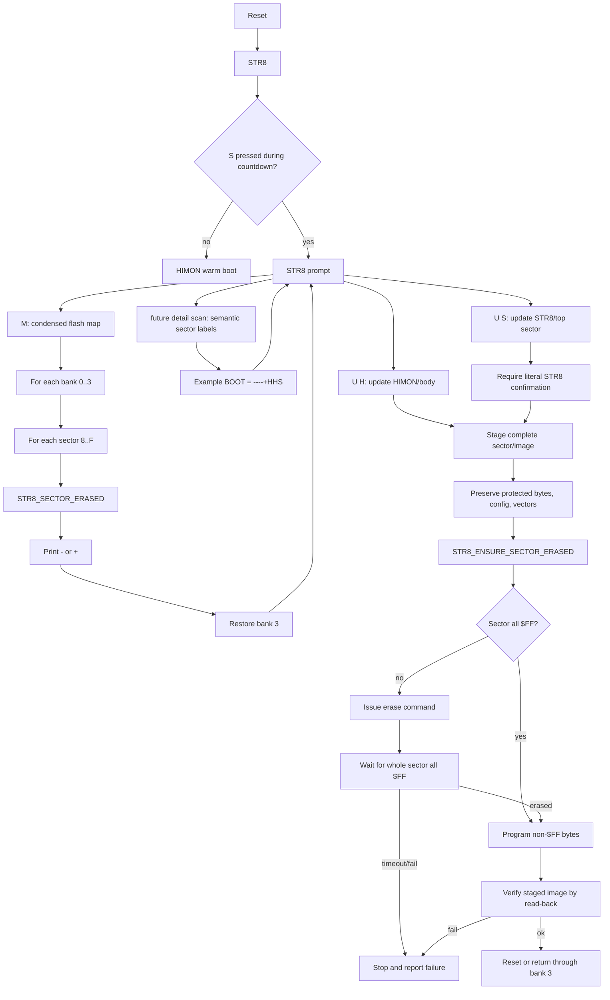

# STR8 Flash Update Proposal

This is a proposal note for STR8 flash update behavior. It is not a current
command contract yet.

The direction is deliberately simple:

```text
HIMON L F stays conservative.
STR8 owns recovery and dangerous flash update flows.
STR8 should be able to update HIMON.
STR8 should also have an explicit, harder-to-trigger option to update STR8.
```

## Command Shape

Keep ordinary STR8 small, but give it a few clear update/report verbs:

```text
M    map banks/sectors with condensed used/erased status
U H  update HIMON body or normal ROM image region
U S  update STR8 protected window/top sector
```

`M` is the proposed report command because the operator question is "show me
the flash map." `F` should stay reserved for a broader flash submenu or
dangerous flash tools. `C` should stay available for future condense/compact
language rather than meaning this cheap physical map.

`U S` should require a stronger confirmation than ordinary restore/update work:

```text
STR8>U S
UPDATE STR8? TYPE STR8:
```

This should not directly stream bytes into `$FA00`. It should stage a complete
top-sector transaction, preserve required bytes, erase/write/verify, then reset.

## M Map Report

`M` scans bank by bank, sector by sector, then restores bank 3 before returning
to the prompt.

Proposed output:

```text
STR8>M
BANK0     BANK1     BANK2     BOOT
++--++--  --++--++  --------  ++++++++
STR8>
```

Each status character position maps to one 4K sector:

```text
8=$8000 9=$9000 A=$A000 B=$B000 C=$C000 D=$D000 E=$E000 F=$F000
```

The first line is a label line. Current labels can show bank numbers plus the
boot role, because bank 3 is the bank the board boots from. Future labels may
be role names or catalog names without changing the status grammar:

```text
BASE      RECOV     HIMON     DATA
++--++--  --++--++  --------  ++++++++
```

Status symbols:

```text
- = erased/unused, all bytes are $FF
+ = used, at least one byte is not $FF
```

A later detail mode or separate command can reuse the same eight sector
positions for semantic labels:

```text
BOOT
----+HHS
```

Possible semantic symbols:

```text
- = erased/unused, all bytes are $FF
+ = used, not yet classified
H = HIMON-like sector
S = STR8/top-sector boot material
```

The plain `M` report should stay physical and cheap. The semantic display can
arrive after STR8 has recognizers for WDCMON, HIMON, STR8, RCAT/data records,
or stored bank roles.

## Erase Policy

STR8 should prefer the obvious whole-sector rule over a clever one-byte poll:

```text
if sector is all $FF:
  skip erase

if sector is not all $FF:
  issue sector erase
  wait until the whole sector scans all $FF

if erase command fails or full-sector erased wait times out:
  stop
```

The important distinction:

```text
one-byte polling asks "did one watched byte finish?"
whole-sector waiting asks "is the sector actually erased?"
```

For STR8, whole-sector waiting is slower but clearer and safer.

## Routine Shape

Build this as routines made from routines:

```text
STR8_CMD_M
  print M/map header
  for bank 0..3
    print bank label
    for sector 8..F
      call STR8_SECTOR_ERASED
      print - or +
  select bank 3

STR8_ENSURE_SECTOR_ERASED
  call STR8_SECTOR_ERASED
  if erased: success
  issue erase command
  call STR8_WAIT_SECTOR_ERASED

STR8_WAIT_SECTOR_ERASED
  repeat until timeout
    call STR8_SECTOR_ERASED
    if erased: success
  fail

STR8_SECTOR_ERASED
  scan one selected 4K sector
  return C=1 when all bytes are $FF
  return C=0 when any byte is not $FF
```

## Mermaid Map



## Open Refinements

- Decide whether later displays need an optional verbose `ERASED/USED` mode.
- Decide whether `U H` receives S-records, a full bank image, or both.
- Decide whether `U S` requires source image hash/version checks before
  staging.
- Decide how much progress output STR8 should print during erase/program/verify.
- Decide whether failures should report the first bad bank/sector/address.
