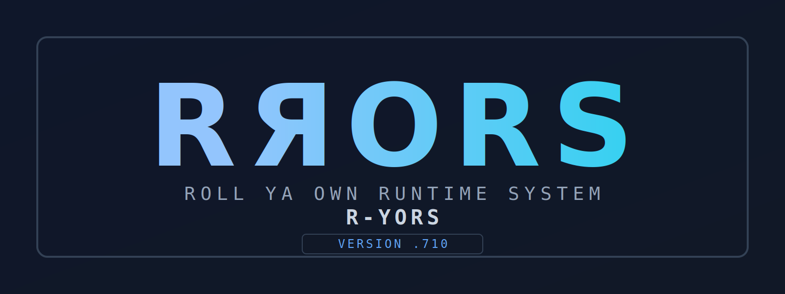



# RЯORS (R-YORS) #

`R-YORS` = **Roll Ya Own Runtime System**

Not eRRORS, but expect fewer.

Pronunciation: **"are-yors"** (`R + Я(ya) + ors`).

This is a play on "Roll Your Own Runtime System," where "Я" (Russian for "ya") represents "your," highlighting the DIY, customizable nature of the project.

## Why

**The goal is to create an inexpensive, turnkey 6502 runtime system that boots directly from hardware without requiring toolchain setup. This will make retro computing accessible to anyone seeking standalone operation and customizable runtime experimentation on a single board.**

## What

R-YORS is an in-progress 65C02 runtime project based on the Western Design Center W65C02SXB/W65C02EDU hardware. I'm building it from the ground up: low-level board bring-up, reusable runtime routines, a compact monitor, loaders, debug paths, and small applications that prove the pieces work on real hardware. The long-term goal is still an RPG II compiler, but the work is deliberately producing useful runtime blocks along the way.

### Why RPG

I want to build the language I actually learned, not a modern approximation. I spent nearly 30 years writing RPG, and there still is not one project here focused on true RPG II. Yes, I could get access to an AS/400 or S/3x0, but that misses the point. This project targets the original RPG II model. As I kept building routines on top of routines, I realized this approach can produce a close approximation/simulation of the original environment. The plan is to build it from the ground up, guided by original IBM documentation, then expand compatibility without losing what made RPG II unique.

## How

R-YORS enables this vision through a modular library of routines that can be easily linked into projects. This approach allows developers to quickly assemble custom runtime systems by selecting and combining pre-built, tested components—eliminating the need to rewrite low-level code and accelerating experimentation on the 6502 platform.

## Example Routines

To illustrate the library's versatility, here are three example routines from different layers:

- **UTL_HEX_NIBBLE_TO_ASCII** (Utility): Converts a low nibble (0-15) in A to uppercase ASCII hex ('0'-'F'), useful for debugging output.
- **BIO_PIA_LED_WRITE** (Hardware Abstraction): Controls LED states on the PIA chip, abstracting direct hardware access for safer GPIO operations.
- **SYS_WRITE_CHAR** (System I/O): Provides device-neutral character output, routing through the selected backend (e.g., FTDI) for consistent I/O across platforms. 

## Architecture & Current Status

My predecessor project, BSO2, proved the concept but suffered from inflexible command processing, poor modularity, and too many rabbit holes. R-YORS adopts a more disciplined approach with layered, reusable building blocks:

- **PIN routines** – Direct hardware interface
- **BIO routines** – Hardware abstraction layer wrapping PIN routines
- **COR routines** – Core reusable services and board-facing helpers
- **SYS routines** – System-level services such as I/O, vectors, debug entry, and monitor-facing adapters

The current supervisory monitor is **HIMONIA-F**, a compact FNV-1a-dispatched monitor built to fit under 8K. It boots from ROM, initializes FTDI I/O, clears RAM on cold reset, patches RAM dispatch cells for reset/NMI/IRQ/BRK handling, and prints terse cold-boot telemetry such as:

```text
BOOT COLD
WAIT OK
RAM ZERO OK
FTDI INIT
RST 7EF8=....
NMI 7EFA=....
IRQ 7EFE=....
BRK 7EFC=....
```

HIMONIA-F currently includes hashed command dispatch, S-record loading, GO/LOAD+GO execution, register display/editing, memory display/modify, disassembly/assembly helpers, breakpoints, single-step support, NMI/BRK trap capture, decoded CPU flags, and return-status reporting for executed user code. BRK handling is now native to the monitor rather than delegated to BSO2. The monitor also exposes discoverable FNV signatures for selected commands and routines, making ROM services easier to identify and call by hash.

Small standalone programs are used to test the runtime surface. One example is a 16x16 Conway Life app loaded at `$2000`, with random/manual/auto/next/quit controls, age-aware cells, NMI count testing, and cleanup that restores the monitor's debug vector before returning.

## Documentation & References

Core references include IBM's SY31-0458-3 (System Unit Theory Diagrams Manual) and GC21-7667-4 (RPG II Reference Manual).
