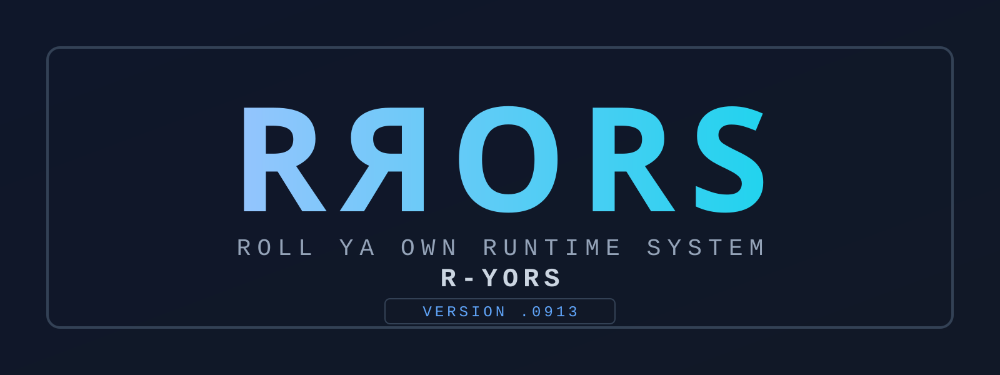

# R-YORS

```text
ROLL YA OWN RUNTIME SYSTEM              W65C02
NOTES / SOURCE / ROMS / MANUALS         READ ME FIRST
```

Not eRRORS, but expect fewer. Pronounced **are-yors**.

R-YORS is a recoverable runtime and onboard workbench for the WDC
W65C02SXB/W65C02EDU board. It boots through a flash-safe recovery guard into a
monitor, assembler, and AP object runtime.

## System

```text
physical RESET -> Bank 3 STR8-N -- 3s timeout --> Bank 3 HIMON
                       |                         |
                       |                         +--> ASM-F2 -> AP object
                       |                                      |
                       |                              OIL <----+
                       |                               |
                       |                           running body
                       |
                       +-- J0/J1/J2 --> Bank 0/1/2 guest reset vector
```

| Part | Role |
| --- | --- |
| **STR8-N** | Bank-3 reset supervisor, recovery, backup/restore, payload updates, and non-destructive `J0`-`J2` opaque-bank handoff |
| **HIMON** | Monitor, loader, debugger, catalog/RJOIN services, and command host |
| **ASM-F2** | Flash-resident onboard W65C02 assembler and AP object producer |
| **OIL** | **Overlay Integration Layer**: AP storage, load, relocation, resident imports, and execution |
| **AP** | Packaged application body, metadata, relocations, exports, and imports |

ASM creates AP objects. OIL integrates them and runs their bodies. HIMON
orchestrates the path, STR8 supplies bank-safe flash/link services, and RJOIN
resolves resident imports. Physical reset selects Bank 3. If the STR8 takeover
key is not pressed, its countdown stays in Bank 3 and enters the Bank-3
default payload, currently HIMON.

## Current Board

The installed 2026-07-31 STR8-N echo image is hardware-proven for:

- Bank-3 reset, the visible three-second countdown, and timeout into the
  Bank-3 HIMON default;
- visible `J0`, `J1`, and `J2` commands, each followed by its `J Bn` status;
- uppercase single echo for reset-time and resident interactive input, with
  Backspace and empty Enter taking the cancel path;
- non-destructive RAM-resident bank selection, target reset-vector validation,
  and handoff into Banks 0-2;
- physical-reset recovery to Bank 3 after every accepted `Jn` handoff;
- unchanged pre/post-handoff bank inventories, with accepted full-image CRCs
  `$4B59/$2A3D/$04EF/$4663` for Banks 0-3;
- boot, backup rotation, restore, and guarded payload updates;
- RAM inspection, S19 loading, one-shot breakpoints, and single-step debugging;
- onboard W65C02 assembly, `SEAL`, `PACKAGE`, `LOAD`, `INSTALL`, and `AP`;
- internal AP relocation and resident RJOIN import resolution;
- AP objects loaded from RAM, visible flash, and banked flash;
- missing-import rejection, overlap protection, and banked-input validation;
- the external ASM session reporter AP, kept in Bank 0 and run with
  `AP B0 $hhhh $4800` from its selected store address;
- interactive bank/sector flash erase with explicit confirmation and recovery;
- standalone examples including the 16x16 column Life program.

The banked-AP bullets above describe the hardware-proven pre-split system.
They are not yet a split-V1 claim. The current HIMON source now stages `AP Bn`
input with a RAM-resident `$F010/$0203` select/copy/restore routine and its host
matrix passes, but the migrated path still needs board proof. Split V1 remains
a candidate rather than the default combined-image/documentation baseline
until that proof is captured.

The follow-up Bank Jump Record is host-accepted but still awaits its separate
board transcript. It publishes `$1FFD-$1FFF = 42 4A nn` after a validated
`J0`-`J2` handoff, preserves a valid record through HIMON cold clear, and uses
`42 4A FF` when no validated target is known. See the
[Bank Jump Record board test](DOC/GUIDES/STR8/STR8_BANK_JUMP_RECORD_BOARD_TEST.md).

The current bank contents are:

| Bank | Installed system | STR8 role |
| --- | --- | --- |
| 0 | R-YORS without ASM | `J0` target |
| 1 | A different R-YORS build without ASM | `J1` target |
| 2 | R-YORS with ASM | `J2` target |
| 3 | R-YORS with ASM and the newest STR8-N | Reset/default supervisor |

Banks 0-2 are opaque 32K systems. They may later contain OSI BASIC,
fig-FORTH, WOZMON, data, or another unrelated system; `Jn` names a bank, not a
system type. After handoff, the selected guest owns `$8000-$FFFF`, its vectors,
peripherals, and execution. Bank-3 STR8 is unmapped and cannot enforce a
timeout or recover control until physical reset.

**Important:** V1 validates only that the selected reset vector is plausible.
Bank identity and whole-image CRC authentication require future Bank-3-owned
metadata. Every unrelated guest system still needs its own warm-handoff,
peripheral, vector, and CRC qualification before it is treated as supported.
The qualification record has four independent gates:

| Gate | Required proof |
| --- | --- |
| **H** | Warm handoff and recovery |
| **P** | Peripherals and surviving machine state |
| **V** | RESET, NMI, and IRQ/BRK vectors |
| **C** | Exact image identity and non-destructive proof |

See the
[STR8 Guest Image Qualification Guide](DOC/GUIDES/STR8/STR8_GUEST_IMAGE_QUALIFICATION.md).

This is the threshold worth noticing: after the initial image is installed,
the board can create, inspect, store, integrate, and run native code using its
own monitor and assembler. It remains a bench system, but it is doing real work
on its own.

Treat it as bench-proven rather than a finished field updater. Keep an external
programmer and a known-good image nearby.

The current line retains the 2026-07-18 size-pass proof: its fixed-width `D`
path, positive RAM AP/RJOIN import path, missing-import atomicity, and
banked-source RJOIN path are hardware-proven. It retires the STR8 `M` map and
the richer resident HIMON `D`/quoted-hash forms, and keeps AP import linking in
HIMON. STR8's former `$F006` compatibility doorway is retired; the slot now
returns carry clear so stale callers fail without disturbing the active V1
service addresses.

## Start Here

- [Operator's Guide](DOC/GUIDES/OPERATORS_GUIDE.md) - STR8, HIMON, and board workflows
- [ASM User Guide](DOC/GUIDES/ASM/ASM_USER_GUIDE.md) - source entry, assembly, and AP commands
- [Address Practices](DOC/GUIDES/ASM/ADDRESS_PRACTICES.md) - safe address choices for ASM and AP work
- [OIL .710 Test Plan](DOC/GUIDES/PLANNING/OIL_710_TEST_PLAN.md) - Overlay Integration Layer board gates
- [STR8 J0-J2 Opaque-Bank Plan](DOC/GUIDES/PLANNING/STR8_J012_OPAQUE_BANK_PLAN.md) - accepted implementation, size, recovery, and proof record
- [STR8 J0-J2 Board Test](DOC/GUIDES/STR8/STR8_J012_BOARD_TEST.md) - exact inventory, handoff, reset, and CRC acceptance rail
- [STR8 Bank Jump Record Board Test](DOC/GUIDES/STR8/STR8_BANK_JUMP_RECORD_BOARD_TEST.md) - pending persistence proof for `$1FFD-$1FFF`
- [STR8 V1 Migration Board Test](DOC/GUIDES/STR8/STR8_V1_MIGRATION_BOARD_TEST.md) - accepted flashable V1 migration and first journaled Bank-2 install proof
- [STR8 Guest Image Qualification](DOC/GUIDES/STR8/STR8_GUEST_IMAGE_QUALIFICATION.md) - mandatory handoff, peripheral, vector, and CRC procedure for unrelated systems
- [STR8 S19 And Bank Volumes](DOC/GUIDES/PLANNING/STR8_MULTIBOOT_BANK_VOLUMES.md) - loader/volume direction and superseded compatible-bank design history
- [Life Quick Card](DOC/GUIDES/ASM/LIFE16_QUICK_CARD.md) - exact ASM-F2 bank-2 procedure
- [Technical Guide](DOC/GUIDES/TECHNICAL_GUIDE.md) - architecture, flash policy, and build products
- [Release Guide](DOC/GUIDES/RELEASES.md) - GitHub release assets, tag naming, and proof notes
- [Memory Map](DOC/GUIDES/MEMORY/MEMORY_MAP.md) - current ROM, RAM, and OIL address boundaries
- [Reference](DOC/GUIDES/REF.md) and [Glossary](DOC/GUIDES/GLOSSARY.md) - compact commands and vocabulary
- [Hardware Test Log](DOC/GUIDES/LOGS/HARDWARE_TEST_LOG.md) - board transcript evidence
- [Full Guide Index](DOC/GUIDES/INDEX.md) - every documentation lane

## Build

From the repository root:

```text
make all
```

The primary output is a complete 32K `$8000-$FFFF` bank image:

```text
SRC/BUILD/bin/himon-str8-rom.bin

$8000-$BC6C  ASM-F2, entry $800C
$BC6D-$BFFF  low-flash growth/AP-store hole
$C000-$EECB  HIMON, including the resident AP import linker
$EECC-$EFFF  HIMON/STR8 growth hole
$F000-$FAEE  STR8-N shell, data, IVI stubs, updater, and adapters
$FAEF-$FD02  top-sector growth hole
$FD03-$FFEF  stored RAM worker
$FFF0-$FFF9  configuration pocket
$FFFA-$FFFF  hardware vectors
```

The matching first-install stream is:

```text
SRC/BUILD/s19/himon-str8-rom-install.s19
```

Useful targets:

```text
make all                       complete current onboard image
make life                      standalone loadable Life S19/BIN
make -C SRC help Q=<term>      find related targets
make release                   image plus release-side artifacts
make docs-html                 HTML rebuild for docs and repository READMEs
```

`make life` does not change the onboard image. It preserves the simple
standalone S19 workflow for programs that should be loaded independently.

## Repository

```text
SRC/ASM/        current ASM-F2 source
SRC/HIMON/      current HIMON source
SRC/STR8/       current STR8-N source
SRC/LIB/        shared board and ROM support
SRC/APPS/       current standalone applications
SRC/PROOFS/     current proof scaffolds still used by onboard work
SRC/TESTS/      current test harnesses
SRC/ARCHIVE/    retired sample, test, proof, demo, and one-off code/data
SRC/tools/      host bootstrap and build tools
DOC/GUIDES/     hand-written guides and hardware logs
DOC/GENERATED/  source-derived reports
```

Active source lanes hold only code or data used to create current onboard
R-YORS images or data intentionally ingested by the board. STR8-N, HIMON V,
and ASM-F2 retain their current structure. Retired material belongs in
`SRC/ARCHIVE/` under the
[historical code migration plan](DOC/GUIDES/PLANNING/HISTORICAL_CODE_MIGRATION_PLAN.md).

New code and data should be processed onboard where practical through HIMON,
ASM-F2, AP packages, OIL, and STR8 install/update services. Host tools remain
where they bootstrap or regenerate current onboard artifacts.

## Safety

Flash operations can overwrite firmware, programs, data, and board
configuration. Destructive STR8 and flash-utility paths require confirmation.
Do not press NMI during erase, program, or restore operations.

`J0`-`J2` do not write flash, but they deliberately replace the visible
Bank-3 runtime with the selected guest. Use physical reset as the universal
return path, and qualify each unrelated guest before relying on its startup or
interrupt behavior.

## Direction

R-YORS grows from the BSO2/WDC monitor line toward a machine with recoverable
flash, discoverable resident routines, onboard assembly, relocatable AP
objects, and a runtime that can explain what it knows.

The long north star remains true RPG II, built from below: stable callable
routines, catalogs, flash-resident programs, fixed entry points, simple text
encodings, and increasingly self-hosted work.

## Notice

R-YORS is independent and is not affiliated with or endorsed by The Western
Design Center, Inc. Product names identify compatible hardware only. No
warranty is provided.
