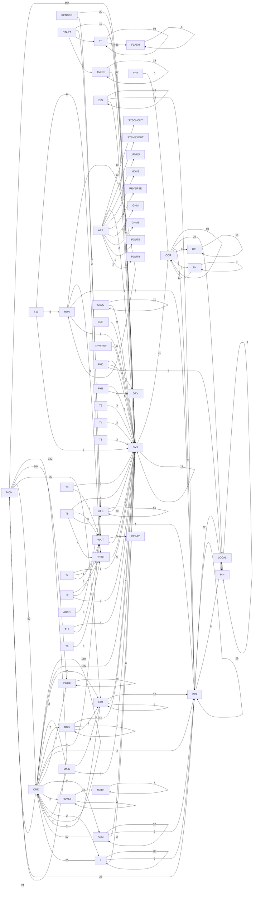

# R-YORS Routine Class Diagram
<!-- AUTO-GENERATED by SRC/tools/gen_docs.ps1. Do not hand-edit. -->

Generated: 2026-04-30 23:24:30 -05:00

```mermaid
flowchart LR
    P_MON[MON] -->|197| P_SYS[SYS]
    P_CMD[CMD] -->|160| P_CMD[CMD]
    P_MON[MON] -->|122| P_MON[MON]
    P_L[L] -->|111| P_L[L]
    P_CMD[CMD] -->|105| P_SYS[SYS]
    P_MON[MON] -->|104| P_CMDP[CMDP]
    P_TF[TF] -->|93| P_TF[TF]
    P_COR[COR] -->|89| P_COR[COR]
    P_CMD[CMD] -->|60| P_HIM[HIM]
    P_ASM[ASM] -->|57| P_ASM[ASM]
    P_ASM[ASM] -->|52| P_CMD[CMD]
    P_MON[MON] -->|52| P_CMD[CMD]
    P_LIFE[LIFE] -->|51| P_LIFE[LIFE]
    P_DIS[DIS] -->|45| P_DIS[DIS]
    P_MON[MON] -->|35| P_HIM[HIM]
    P_BIO[BIO] -->|32| P_PIN[PIN]
    P_SYS[SYS] -->|31| P_COR[COR]
    P_BIO[BIO] -->|29| P_BIO[BIO]
    P_COR[COR] -->|29| P_LOCAL[LOCAL]
    P_CMDP[CMDP] -->|28| P_CMDP[CMDP]
    P_L[L] -->|26| P_CMD[CMD]
    P_MON[MON] -->|26| P_BIO[BIO]
    P_CMD[CMD] -->|21| P_MON[MON]
    P_LIFE[LIFE] -->|20| P_SYS[SYS]
    P_RENDER[RENDER] -->|20| P_SYS[SYS]
    P_TF[TF] -->|20| P_SYS[SYS]
    P_DIS[DIS] -->|19| P_BIO[BIO]
    P_START[START] -->|19| P_SYS[SYS]
    P_CMD[CMD] -->|18| P_MAIN[MAIN]
    P_TMON[TMON] -->|18| P_TMON[TMON]
    P_TMON[TMON] -->|17| P_SYS[SYS]
    P_HIM[HIM] -->|16| P_BIO[BIO]
    P_UTL[UTL] -->|16| P_UTL[UTL]
    P_APP[APP] -->|13| P_SYSCHOUT[SYSCHOUT]
    P_DBG[DBG] -->|13| P_SYS[SYS]
    P_SYS[SYS] -->|13| P_SYS[SYS]
    P_FNV1A[FNV1A] -->|12| P_MATH[MATH]
    P_CALC[CALC] -->|11| P_CALC[CALC]
    P_TF[TF] -->|11| P_FLASH[FLASH]
    P_TH[TH] -->|11| P_COR[COR]
    P_RUN[RUN] -->|10| P_RUN[RUN]
    P_CALC[CALC] -->|9| P_SYS[SYS]
    P_EDIT[EDIT] -->|9| P_SYS[SYS]
    P_RUN[RUN] -->|9| P_PRINT[PRINT]
    P_COR[COR] -->|8| P_BIO[BIO]
    P_FLASH[FLASH] -->|8| P_FLASH[FLASH]
    P_CMD[CMD] -->|7| P_DBG[DBG]
    P_CMD[CMD] -->|7| P_LIFE[LIFE]
    P_COR[COR] -->|7| P_UTL[UTL]
    P_DBG[DBG] -->|7| P_DBG[DBG]
    P_DIS[DIS] -->|7| P_SYS[SYS]
    P_MAIN[MAIN] -->|7| P_CMD[CMD]
    P_RUN[RUN] -->|7| P_BIO[BIO]
    P_T3[T3] -->|7| P_SYS[SYS]
    P_TH[TH] -->|7| P_TH[TH]
    P_APP[APP] -->|6| P_SYS[SYS]
    P_BIO[BIO] -->|6| P_LOCAL[LOCAL]
    P_FNV1A[FNV1A] -->|6| P_FNV1A[FNV1A]
    P_KEYTEST[KEYTEST] -->|6| P_SYS[SYS]
    P_L[L] -->|6| P_BIO[BIO]
    P_L[L] -->|6| P_SYS[SYS]
    P_PH0[PH0] -->|6| P_SYS[SYS]
    P_RUN[RUN] -->|6| P_SYS[SYS]
    P_T13[T13] -->|6| P_WAIT[WAIT]
    P_T5[T5] -->|6| P_SYS[SYS]
    P_APP[APP] -->|5| P_SYSHEXOUT[SYSHEXOUT]
    P_DBG[DBG] -->|5| P_HIM[HIM]
    P_PH1[PH1] -->|5| P_SYS[SYS]
    P_PRINT[PRINT] -->|5| P_SYS[SYS]
    P_RENDER[RENDER] -->|5| P_LIFE[LIFE]
    P_T13[T13] -->|5| P_RUN[RUN]
    P_T5[T5] -->|5| P_WAIT[WAIT]
    P_T7[T7] -->|5| P_SYS[SYS]
    P_TST[TST] -->|5| P_COR[COR]
    P_WAIT[WAIT] -->|5| P_DELAY[DELAY]
    P_APP[APP] -->|4| P_JANUS[JANUS]
    P_APP[APP] -->|4| P_MOVE[MOVE]
    P_APP[APP] -->|4| P_REVERSE[REVERSE]
    P_HIM[HIM] -->|4| P_SYS[SYS]
    P_MAIN[MAIN] -->|4| P_HIM[HIM]
    P_MAIN[MAIN] -->|4| P_SYS[SYS]
    P_MATH[MATH] -->|4| P_MATH[MATH]
    P_PH0[PH0] -->|4| P_DRV[DRV]
    P_PH0[PH0] -->|4| P_PIN[PIN]
    P_PH1[PH1] -->|4| P_DRV[DRV]
    P_T5[T5] -->|4| P_BIO[BIO]
    P_T7[T7] -->|4| P_PRINT[PRINT]
    P_T9[T9] -->|4| P_PRINT[PRINT]
    P_T9[T9] -->|4| P_WAIT[WAIT]
    P_WAIT[WAIT] -->|4| P_SYS[SYS]
    P_APP[APP] -->|3| P_GNM[GNM]
    P_AUTO[AUTO] -->|3| P_LIFE[LIFE]
    P_CMD[CMD] -->|3| P_BIO[BIO]
    P_CMD[CMD] -->|3| P_CMDP[CMDP]
    P_PIN[PIN] -->|3| P_PIN[PIN]
    P_START[START] -->|3| P_LIFE[LIFE]
    P_START[START] -->|3| P_TF[TF]
    P_START[START] -->|3| P_TMON[TMON]
    P_T11[T11] -->|3| P_SYS[SYS]
    P_T11[T11] -->|3| P_WAIT[WAIT]
    P_T13[T13] -->|3| P_SYS[SYS]
    P_T2[T2] -->|3| P_SYS[SYS]
    P_T3[T3] -->|3| P_WAIT[WAIT]
    P_T4[T4] -->|3| P_SYS[SYS]
    P_T5[T5] -->|3| P_PRINT[PRINT]
    P_T6[T6] -->|3| P_PRINT[PRINT]
    P_T7[T7] -->|3| P_WAIT[WAIT]
    P_T8[T8] -->|3| P_SYS[SYS]
    P_T9[T9] -->|3| P_SYS[SYS]
    P_APP[APP] -->|2| P_GNMZ[GNMZ]
    P_APP[APP] -->|2| P_POUT5[POUT5]
    P_APP[APP] -->|2| P_POUT9[POUT9]
    P_ASM[ASM] -->|2| P_BIO[BIO]
    P_ASM[ASM] -->|2| P_SYS[SYS]
    P_CMD[CMD] -->|2| P_ASM[ASM]
    P_CMD[CMD] -->|2| P_FNV1A[FNV1A]
    P_CMD[CMD] -->|2| P_L[L]
    P_COR[COR] -->|2| P_TH[TH]
    P_HIM[HIM] -->|2| P_CMD[CMD]
    P_HIM[HIM] -->|2| P_HIM[HIM]
```
